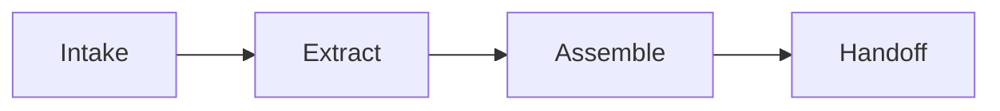
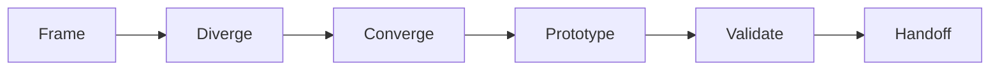
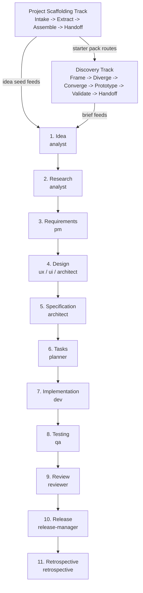

# Specorator — Agentic Development Workflow

 

[](https://github.com/Luis85/agentic-workflow/actions/workflows/verify.yml) [](https://github.com/Luis85/agentic-workflow/actions/workflows/gitleaks.yml) [](https://github.com/Luis85/agentic-workflow/actions/workflows/typos.yml) [](https://github.com/Luis85/agentic-workflow/actions/workflows/zizmor.yml)

**Build software the right way with AI.** Specorator is a ready-to-use workflow template that keeps humans in charge of *what* to build while AI agents handle the heavy lifting of *how*.

> **Status:** v0.2 — Foundation + Skills layer. Intentionally generic and starting-point-y — fork it, adapt it, make it yours.

Product page: <https://luis85.github.io/agentic-workflow/>

---

## What is this?

Specorator is an opinionated, file-based workflow template for **spec-driven, agentic software development**. It is not a product you run — it is a folder of conventions, prompts, agents, skills, and slash commands that you drop into your repository (or fork as a starting point) so an AI coding tool — primarily [Claude Code](https://claude.ai/code) — can help you build real software predictably.

The workflow itself is the deliverable. Everything else (your code, your features) is what you produce *with* it.

---

## The problem it solves

Most AI coding tools jump straight to writing code — and produce confidently wrong code, scattered context, and rework that erases the time they were supposed to save. The common failure modes:

- **Vague briefs become vague code.** "Add login" turns into three different login implementations across one repo.
- **No memory between sessions.** Each new chat re-discovers the same constraints and re-makes the same mistakes.
- **Quality is a vibe, not a gate.** "Looks good" merges; the bug shows up in production.
- **No traceability.** You cannot tell which line of code answers which requirement, or why a decision was made six months ago.
- **One agent does everything.** The same prompt writes the PRD, designs the system, codes it, and reviews itself — with no separation of concerns.

Specorator addresses these by enforcing **specs first, code second**, **one agent per stage**, **quality gates between stages**, and **persistent traceability from idea to test**.

---

## How this helps you

Adopt the template and you get:

- **A predictable lifecycle** — Idea → Research → Requirements → Design → Specification → Tasks → Implementation → Testing → Review → Release → Retrospective. Every stage has one owner, one output, one gate.
- **Specialist AI agents** — narrow-scoped roles (analyst, pm, architect, dev, qa, reviewer, …) that stay in their lane instead of writing the whole feature in one shot.
- **Conversational entry points** — natural-language skills like `orchestrate`, `discovery-sprint`, and `tdd-cycle` you can trigger by talking, not by remembering commands.
- **Built-in quality gates** — EARS-formatted requirements, traceability IDs, ADRs for irreversible decisions, a `verify` gate before every PR.
- **Optional tracks** — Discovery (when you have a blank page), Stock-taking (legacy/brownfield), Sales Cycle (service providers), Project Manager, Roadmap, Portfolio, Quality Assurance. Pick what fits; skip what does not.
- **Tool-agnostic artifacts** — Markdown only. Works with Claude Code first-class, but Cursor / Aider / Copilot / Codex can read the same files.
- **Resumable state** — every feature's progress lives in `specs/<feature>/workflow-state.md`, so any agent (or you) can pick up where the last session left off.

---

## Who is this for?

- **Product managers and designers** — run discovery sprints, write requirements, and review designs without touching code.
- **Developers** — implement from clear specs with AI assistance; no more guessing what the PM meant.
- **Team leads** — coordinate humans and AI agents across a full release cycle with built-in quality checks.
- **Solo builders** — run the whole workflow yourself, with AI agents filling every specialist role.
- **Service providers** — qualify, scope, estimate, propose, and deliver client work with the optional Sales Cycle and Project Manager tracks.

---

## Start here — pick your role

### Product manager / designer

Your job is to define *what* to build and *why*. The workflow starts with you.

1. Open Claude Code in the project folder: `claude`
2. If you're exploring ideas: say **"let's run a design sprint"** → the AI facilitates Frame → Diverge → Converge → Prototype → Validate for you.
3. If you have a brief: say **"let's start a feature: [your one-liner]"** → the AI walks you through Idea, Research, and Requirements stages, asking you questions and producing a clear PRD (`requirements.md`).
4. Review the output in `specs/<feature>/requirements.md`, push back on anything wrong, and sign off when it's right.
5. Hand off to engineering — they'll pick up from the same folder.

You don't need to run any commands yourself. Natural language is enough.

---

### Developer / engineer

Your job starts once Requirements and Design are signed off. You build what the spec says — no more, no less.

1. Check where things stand: `cat specs/<feature>/workflow-state.md`
2. Open Claude Code: `claude`
3. Say **"continue the [feature-name] feature"** — the orchestrator picks up at the right stage.
4. For implementation specifically: `/spec:implement` runs the dev agent against the tasks in `specs/<feature>/tasks.md`.
5. Run the verify gate before opening a PR: `/verify`
6. For TDD discipline, use the `tdd-cycle` skill during implementation.

If you spot a gap in the spec, escalate — don't silently invent a requirement. Update the spec first, then the code.

---

### Team lead / engineering manager

Your job is to set up the workflow, gate between stages, and make sure quality holds.

1. Fork or clone this repo as your project's starting point.
2. If you already have meeting notes, briefs, or Markdown docs, start with `/scaffold:start <project-slug> <source-path>` to produce a reviewable starter pack.
3. Adapt `memory/constitution.md` to your team's principles.
4. Fill `docs/steering/` — at minimum `tech.md` and `quality.md` — so agents have the right context.
5. Use `/adr:new "<title>"` any time an irreversible architectural decision is made.
6. Gate each stage: check `specs/<feature>/workflow-state.md` and confirm the quality gate passed before the next stage starts.
7. Activate operational bots in `agents/operational/` one at a time as the team gets comfortable — `review-bot` and `dep-triage-bot` are good starting points.

You own acceptance at each stage. Agents surface decisions; you make them.

---

### Solo builder

You're doing every role yourself. Use the `orchestrate` skill to run the full lifecycle without switching mental modes.

1. Clone the repo and open Claude Code: `claude`
2. Say **"drive this end-to-end: [your feature idea]"** — the `orchestrate` skill gates with you between stages and dispatches the right specialist agent each time.
3. When you need to brainstorm first, say **"let's run a design sprint"** before kicking off the lifecycle.
4. Your state is always in `specs/<feature>/workflow-state.md` — you can pause and resume across sessions safely.

Tip: even alone, don't skip the Retrospective at the end. It's where the process improves.

---

## How it works

Specorator is built as a layered set of plain-Markdown artifacts and prompt-driven roles. There is no runtime to deploy and no service to host — everything lives in your repository.

**The building blocks**

- **Constitution** (`memory/constitution.md`) — governing principles loaded ahead of every command.
- **Steering** (`docs/steering/`) — scoped context (product, tech, ux, quality, ops) that agents read so they know your project.
- **Specs** (`specs/<feature-slug>/`) — one folder per feature; each stage drops one Markdown artifact here.
- **Agents** (`.claude/agents/`) — one specialist per role, with deliberately narrow tool permissions.
- **Skills** (`.claude/skills/`) — reusable how-tos that auto-trigger from natural language or run via `/<skill-name>`.
- **Slash commands** (`.claude/commands/`) — explicit per-stage entry points (`/spec:idea`, `/spec:design`, …).
- **Templates** (`templates/`) — blank starting points for every artifact you produce.
- **ADRs** (`docs/adr/`) — immutable Architecture Decision Records for anything load-bearing.

**How you are meant to use it**

1. **Adopt** — fork the repo (or click "Use this template"), then personalise `memory/constitution.md` and fill `docs/steering/`.
2. **Pick the right entry point** — Discovery (blank page), Stock-taking (legacy system), Sales Cycle (client work), or jump straight into the Lifecycle (you have a brief).
3. **Drive conversationally** — open Claude Code and say *"let's start a feature"* or *"drive this end-to-end"*. The `orchestrate` skill walks you stage-by-stage, gating with you between each one.
4. **Or drive manually** — run the slash commands yourself in stage order. State lives in `specs/<feature>/workflow-state.md`.
5. **Gate every stage** — review the artifact, push back on anything wrong, sign off, then move on. No stage is skipped; quality gates are non-negotiable.
6. **Implement against the spec** — the dev agent only writes code that matches `tasks.md`. The qa agent verifies every EARS requirement has a test. The reviewer audits traceability.
7. **Ship and learn** — `/spec:release` prepares release readiness, produces release notes, and gates irreversible actions on explicit authorization; `/spec:retro` is mandatory and feeds improvements back into the template.

The workflow has source-led onboarding plus two core delivery tracks:

**Project Scaffolding Track** *(optional — use this when you have collected docs but no canonical artifacts yet)*



Inventory existing folders or Markdown files, extract evidence-backed context, assemble draft steering and workflow seeds, then route to Discovery, Specorator, Project Manager Track, or Stock-taking.

**Discovery Track** *(optional — use this when you don't have a clear brief yet)*



Explore ideas, narrow them down, prototype the most promising one, validate assumptions, then produce a brief that feeds the next track.

**Lifecycle Track** *(11 stages — use this when you have a brief)*

```mermaid
flowchart LR
    idea["Idea"]
    research["Research"]
    requirements["Requirements"]
    design["Design"]
    specification["Specification"]
    tasks["Tasks"]
    implementation["Implementation"]
    testing["Testing"]
    review["Review"]
    release["Release"]
    retro["Retro"]

    idea --> research --> requirements --> design --> specification --> tasks
    tasks --> implementation --> testing --> review --> release --> retro
```



Each stage has **one owner** (a specialist AI agent), **one output** (a Markdown file in `specs/<feature>/`), and **one quality gate** before the next stage can begin. No stage is skipped; quality gates are non-negotiable.

---

## Get started in 5 minutes

### What you need

- [Claude Code](https://claude.ai/code) (the CLI — free tier works)
- Git

### 1. Get the template

Click **"Use this template"** on GitHub, or clone it directly:

```bash
git clone https://github.com/luis85/agentic-workflow.git my-project
cd my-project
```

### 2. Personalise (optional but recommended)

- Edit `memory/constitution.md` to set your project's governing principles.
- Fill in `docs/steering/` with your product, tech stack, and UX context — these files are loaded by agents automatically.

### 3. Open Claude Code and start working

```bash
claude
```

Then just talk to it:

**If you have a clear idea:**
> *"let's start a feature: user login with email and password"*

**If you're still exploring:**
> *"let's run a design sprint"*

Claude guides you through the rest — asking the right questions, running the right agents, and producing the right artifacts at each stage.

---

## Where to learn more

The full user guide lives in [`docs/`](docs/README.md), organised by what you need at the moment (Diátaxis):

- **Learning** → [tutorials](docs/README.md#tutorials) — start with the [first-feature tutorial](docs/tutorials/first-feature.md), 60–90 minutes end-to-end on a tiny example.
- **Doing** → [how-to recipes](docs/README.md#how-to-guides) — task-oriented walkthroughs for common operations.
- **Looking up** → [reference](docs/README.md#reference) — the [workflow overview](docs/workflow-overview.md), [quality framework](docs/quality-framework.md), [EARS notation](docs/ears-notation.md), [traceability](docs/traceability.md), and the artifact [sink catalog](docs/sink.md).
- **Understanding** → [explanation](docs/README.md#explanation) — the *why* behind the design choices, plus every [ADR](docs/adr/).

Other useful pages:

- **Worked examples** → [`examples/`](examples/) shows what a project using this template actually produces.
- **Public product page** → <https://luis85.github.io/agentic-workflow/> ([source](sites/index.html)).
- **Contribute** → [`CONTRIBUTING.md`](CONTRIBUTING.md) for how to improve the template itself.

---

## Repository checks

This template includes a small Node/npm integrity suite for local use and CI:

```bash
npm install
npm run doctor
npm run verify
```

`doctor` reports local environment and repository health. `verify` is read-only. For deterministic local repairs, use `npm run fix:adr-index` to regenerate the ADR index, `npm run fix:commands` to regenerate command inventories, and `npm run fix:script-docs` to regenerate script API docs from JSDoc blocks, then run `npm run verify` again.
Use `npm run fix` to run all generated-block repair helpers together. See [`scripts/README.md`](scripts/README.md) for the full script inventory.

---

## Common starting points

### I know what I want to build

```
/spec:start my-feature-slug
```

Then walk the stages in order, or just say **"drive this end-to-end"** and the `orchestrate` skill handles everything conversationally, gating with you at each step.

### I have a blank page

```
/discovery:start my-sprint-slug
```

Or say **"let's brainstorm new product ideas"** and the `discovery-sprint` skill walks you through Frame → Diverge → Converge → Prototype → Validate → Handoff. The output feeds `/spec:idea`.

### I have collected docs from before adopting this template

```
/scaffold:start my-project path/to/source-docs
```

Or say **"scaffold this project from these docs"** and the `project-scaffolding` skill walks you through Intake → Extract → Assemble → Handoff. The output is a reviewable starter pack, not accepted requirements.

### I want to resume a feature in progress

Check the state file to see where things stand:

```bash
cat specs/<feature-slug>/workflow-state.md
```

Then say **"continue the [feature-name] feature"** in Claude Code — any agent can pick up from the state file.

### I want to make an important architectural decision

```
/record-decision "why we chose PostgreSQL over DynamoDB"
```

This files a permanent Architecture Decision Record (ADR) in `docs/adr/`.

### I want to check project quality assurance

```
/quality:start release-readiness specs/my-feature
/quality:plan release-readiness
/quality:check release-readiness
/quality:review release-readiness
/quality:improve release-readiness
```

The Quality Assurance Track creates ISO 9001-aligned plans, checklists, readiness reviews, and corrective actions. It supports readiness and evidence gathering; it does not grant certification.

### I want to prepare a production release decision

```
cp templates/release-readiness-guide-template.md specs/my-feature/release-readiness-guide.md
/spec:release my-feature
```

Use the Release Readiness Guide when an increment needs product, stakeholder, operational, support, security, privacy, compliance, commercial, or communications evidence before production. It feeds `release-notes.md` and the explicit authorization step; it does not deploy by itself.

### I want to manage a product or project roadmap

```
/roadmap:start product-roadmap
/roadmap:shape product-roadmap
/roadmap:align product-roadmap
/roadmap:communicate product-roadmap delivery-team
/roadmap:review product-roadmap
```

The Roadmap Management Track keeps product outcomes, project delivery confidence, stakeholder alignment, and team communication in one maintained roadmap workspace under `roadmaps/<slug>/`.

### I want to improve Specorator itself

Use the Specorator improvement commands when the template should evolve while you are using it:

```
/specorator:update "automate quality drift review"
/specorator:add-script "quality drift review check"
/specorator:add-tooling "nightly template health review"
/specorator:add-workflow "guided template improvement workflow"
```

These commands route through the `specorator-improvement` skill so scripts, tooling, workflows, docs, generated references, verification, branch hygiene, and PR delivery stay aligned.

---

## Plain-English glossary

New to this kind of workflow? See [`docs/glossary/`](docs/glossary/) — one Markdown file per term. Good starting points:

- [Spec](docs/glossary/spec.md) — a written description of exactly what to build.
- [Agent](docs/glossary/agent.md) — an AI assistant specialised for one role.
- [Artifact](docs/glossary/artifact.md) — a Markdown file produced at each stage.
- [Quality gate](docs/glossary/quality-gate.md) — the checklist a stage must pass before the next one starts.
- [EARS](docs/glossary/ears.md), [ADR](docs/glossary/adr.md), [Traceability](docs/glossary/traceability.md), [Retrospective](docs/glossary/retrospective.md), [Discovery Track](docs/glossary/discovery-track.md).

Add a new term with `/glossary:new "<term>"`. See [ADR-0010](docs/adr/0010-shard-glossary-into-one-file-per-term.md) for the convention.

---

## Workflow at a glance



Each arrow is a quality gate. See [`docs/workflow-overview.md`](docs/workflow-overview.md) for the full cheat sheet and slash command reference.

---

## Slash commands reference

<!-- BEGIN GENERATED: slash-commands -->
```
# Top-level:
/token-review

# Decisions:
/adr:new

# Discovery Track:
/discovery:converge   /discovery:diverge    /discovery:frame
/discovery:handoff    /discovery:prototype  /discovery:start
/discovery:validate

# glossary:
/glossary:new

# Portfolio Track:
/portfolio:start  /portfolio:x      /portfolio:y
/portfolio:z

# Product:
/product:page

# Project Manager Track:
/project:change    /project:close     /project:initiate
/project:post      /project:report    /project:start
/project:weekly

# Quality Assurance Track:
/quality:check    /quality:improve  /quality:plan
/quality:review   /quality:start    /quality:status

# roadmap:
/roadmap:align        /roadmap:communicate  /roadmap:review
/roadmap:shape        /roadmap:start

# Sales Cycle Track:
/sales:estimate  /sales:order     /sales:propose
/sales:qualify   /sales:scope     /sales:start

# Project Scaffolding Track:
/scaffold:assemble  /scaffold:extract   /scaffold:handoff
/scaffold:intake    /scaffold:start

# Lifecycle:
/spec:analyze       /spec:clarify       /spec:design
/spec:idea          /spec:implement     /spec:release
/spec:requirements  /spec:research      /spec:retro
/spec:review        /spec:specify       /spec:start
/spec:tasks         /spec:test

# Specorator Improvements:
/specorator:add-script    /specorator:add-tooling   /specorator:add-workflow
/specorator:update

# Stock-taking Track:
/stock-taking:audit       /stock-taking:handoff     /stock-taking:scope
/stock-taking:start       /stock-taking:synthesize
```
<!-- END GENERATED: slash-commands -->

You can also trigger everything conversationally — the `orchestrate` and `discovery-sprint` skills listen for natural language and dispatch the right command.

---

## Using a different AI tool (not Claude Code)

The workflow is built for Claude Code, but the *conventions* are tool-agnostic:

- **Cursor / Aider / Copilot** — use `AGENTS.md` as your root context and follow the stage order manually.
- **Codex** — same; slash commands won't auto-run but the templates and stage sequence carry over.

The artifact format (Markdown files in `specs/<feature>/`) and the ID scheme (`REQ-X-NNN`, `T-X-NNN`, `TEST-X-NNN`) work with any editor.

---

## What's in the repo

| Path | What it is |
|---|---|
| [`docs/specorator.md`](docs/specorator.md) | Full workflow definition — read this before any non-trivial work |
| [`docs/project-scaffolding-track.md`](docs/project-scaffolding-track.md) | Source-led onboarding detail for turning collected docs into starter artifacts |
| [`docs/discovery-track.md`](docs/discovery-track.md) | Discovery Track detail and phase-by-phase guide |
| [`docs/roadmap-management-track.md`](docs/roadmap-management-track.md) | Product/project roadmap management, stakeholder alignment, and team communication workflow |
| [`docs/quality-assurance-track.md`](docs/quality-assurance-track.md) | ISO 9001-aligned quality assurance review workflow |
| [`docs/release-readiness-guide.md`](docs/release-readiness-guide.md) | Stage 10 go/no-go guide for product perspectives and stakeholder requirements |
| [`docs/workflow-overview.md`](docs/workflow-overview.md) | One-page visual + cheat sheet + slash command list |
| [`docs/quality-framework.md`](docs/quality-framework.md) | Quality dimensions, gates, and Definition of Done per stage |
| [`docs/ears-notation.md`](docs/ears-notation.md) | How to write requirements in EARS format |
| [`docs/traceability.md`](docs/traceability.md) | ID scheme: requirement → spec → task → code → test |
| [`docs/sink.md`](docs/sink.md) | Catalog of every artifact: where it lives, who owns it |
| [`docs/steering/`](docs/steering/) | Scoped context for agents (product, tech, ux, quality, ops) |
| [`docs/adr/`](docs/adr/) | Architecture Decision Records — start with [ADR-0001](docs/adr/0001-record-architecture-decisions.md) |
| [`memory/constitution.md`](memory/constitution.md) | Governing principles loaded before every command |
| [`templates/`](templates/) | Blank artifact templates for each stage |
| [`.claude/agents/`](.claude/agents/) | One subagent per SDLC role |
| [`.claude/skills/`](.claude/skills/) | Reusable skill bundles (`orchestrate`, `grill`, `tdd-cycle`, `verify`, …) |
| [`agents/operational/`](agents/operational/) | Scheduled bots: review-bot, dep-triage-bot, plan-recon-bot, and more |
| [`CONTRIBUTING.md`](CONTRIBUTING.md) | How to improve this template |
| [`sites/index.html`](sites/index.html) | Public product page source, deployable through GitHub Pages |
| [`AGENTS.md`](AGENTS.md) | Cross-tool root context (Codex, Cursor, Aider, Copilot all read this) |
| [`CLAUDE.md`](CLAUDE.md) | Claude Code entry point — imports `AGENTS.md` |
| [`.codex/`](.codex/) | Codex-specific instructions and workflow playbooks |
| [`examples/`](examples/) | Demonstration artifacts — what a project using this template produces. Each `examples/<slug>/` mirrors `specs/<slug>/` shape. Not part of the template's own workflow; agents must not treat these as active features. (`cli-todo`: stages 1–3 complete, stage 4 in-progress) |

---

## Principles

1. **Spec-driven** — code derives from specs, not the other way around.
2. **Separation of concerns** — idea ≠ research ≠ requirements ≠ design ≠ implementation.
3. **Incremental** — small, verifiable steps; each builds on validated outputs.
4. **Quality gates** — no stage completes without passing its criteria.
5. **Traceability** — every artifact links back to a requirement and a decision.
6. **Agent specialisation** — each role has a clear scope; agents don't overreach.
7. **Human oversight** — humans own intent, priorities, and acceptance.

Full version in [`memory/constitution.md`](memory/constitution.md).

---

## Roadmap

| Version | Status | Focus |
|---|---|---|
| v0.1 | Done | Workflow definition, templates, agents, slash commands |
| v0.2 | Done | Skills layer, operational bots, branching / verify / worktrees guides |
| v0.3 | Done | [Worked end-to-end examples, artifact validation](specs/version-0-3-plan/release-notes.md) |
| v0.4 | Planned | [CI quality gates, metrics, maturity model](specs/version-0-4-plan/tasks.md) |
| v0.5 | Planned | [Release workflow, branching strategy, GitHub Releases and Packages](specs/version-0-5-plan/tasks.md) |
| v0.6 | Planned | [Productization, cross-tool adapters, live proof, hooks, and agentic security](specs/version-0-6-plan/tasks.md) |
| v0.7 | Planned | [Automation quality hardening for agents and humans](https://github.com/Luis85/agentic-workflow/issues/98) |
| v0.8 | Planned | [Content-driven product page generation](specs/version-0-8-plan/tasks.md) |
| v0.9 | Planned | [Stakeholder sparring partner for roadmap communication](specs/version-0-9-plan/tasks.md) ([issue #125](https://github.com/Luis85/agentic-workflow/issues/125)) |

---

## License

[MIT](LICENSE)
