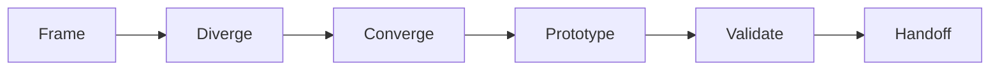
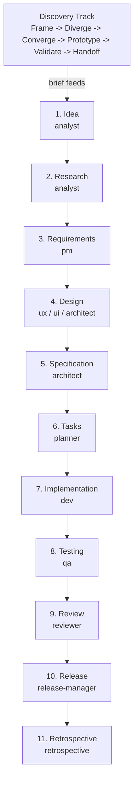

# Specorator — Agentic Development Workflow

 

**Build software the right way with AI.** Specorator is a ready-to-use workflow template that keeps humans in charge of *what* to build while AI agents handle the heavy lifting of *how*.

> **Status:** v0.2 — Foundation + Skills layer. Intentionally generic and starting-point-y — fork it, adapt it, make it yours.

---

## What is this?

Most AI coding tools jump straight to writing code — often the wrong code. Specorator flips that: **specs first, code second**.

Every feature follows a structured journey — understand the problem, research the options, write clear requirements, design a solution, *then* build it. AI agents (powered by Claude) assist at every step while staying in their lane. You remain in charge of intent, priorities, and sign-off.

The result: fewer dead ends, less rework, and software that does what you actually needed.

---

## Who is this for?

- **Product managers and designers** — run discovery sprints, write requirements, and review designs without touching code.
- **Developers** — implement from clear specs with AI assistance; no more guessing what the PM meant.
- **Team leads** — coordinate humans and AI agents across a full release cycle with built-in quality checks.
- **Solo builders** — run the whole workflow yourself, with AI agents filling every specialist role.

---

## Start here — pick your role

### Product manager / designer

Your job is to define *what* to build and *why*. The workflow starts with you.

1. Open Claude Code in the project folder: `claude`
2. If you're exploring ideas: say **"let's run a design sprint"** → the AI facilitates Frame → Diverge → Converge → Prototype → Validate for you.
3. If you have a brief: say **"let's start a feature: [your one-liner]"** → the AI walks you through Idea, Research, and Requirements stages, asking you questions and producing a clear PRD (`requirements.md`).
4. Review the output in `specs/<feature>/requirements.md`, push back on anything wrong, and sign off when it's right.
5. Hand off to engineering — they'll pick up from the same folder.

You don't need to run any commands yourself. Natural language is enough.

---

### Developer / engineer

Your job starts once Requirements and Design are signed off. You build what the spec says — no more, no less.

1. Check where things stand: `cat specs/<feature>/workflow-state.md`
2. Open Claude Code: `claude`
3. Say **"continue the [feature-name] feature"** — the orchestrator picks up at the right stage.
4. For implementation specifically: `/spec:implement` runs the dev agent against the tasks in `specs/<feature>/tasks.md`.
5. Run the verify gate before opening a PR: `/verify`
6. For TDD discipline, use the `tdd-cycle` skill during implementation.

If you spot a gap in the spec, escalate — don't silently invent a requirement. Update the spec first, then the code.

---

### Team lead / engineering manager

Your job is to set up the workflow, gate between stages, and make sure quality holds.

1. Fork or clone this repo as your project's starting point.
2. Adapt `memory/constitution.md` to your team's principles.
3. Fill `docs/steering/` — at minimum `tech.md` and `quality.md` — so agents have the right context.
4. Use `/adr:new "<title>"` any time an irreversible architectural decision is made.
5. Gate each stage: check `specs/<feature>/workflow-state.md` and confirm the quality gate passed before the next stage starts.
6. Activate operational bots in `agents/operational/` one at a time as the team gets comfortable — `review-bot` and `dep-triage-bot` are good starting points.

You own acceptance at each stage. Agents surface decisions; you make them.

---

### Solo builder

You're doing every role yourself. Use the `orchestrate` skill to run the full lifecycle without switching mental modes.

1. Clone the repo and open Claude Code: `claude`
2. Say **"drive this end-to-end: [your feature idea]"** — the `orchestrate` skill gates with you between stages and dispatches the right specialist agent each time.
3. When you need to brainstorm first, say **"let's run a design sprint"** before kicking off the lifecycle.
4. Your state is always in `specs/<feature>/workflow-state.md` — you can pause and resume across sessions safely.

Tip: even alone, don't skip the Retrospective at the end. It's where the process improves.

---

## How it works

The workflow has two tracks:

**Discovery Track** *(optional — use this when you don't have a clear brief yet)*



Explore ideas, narrow them down, prototype the most promising one, validate assumptions, then produce a brief that feeds the next track.

**Lifecycle Track** *(11 stages — use this when you have a brief)*

```mermaid
flowchart LR
    idea["Idea"]
    research["Research"]
    requirements["Requirements"]
    design["Design"]
    specification["Specification"]
    tasks["Tasks"]
    implementation["Implementation"]
    testing["Testing"]
    review["Review"]
    release["Release"]
    retro["Retro"]

    idea --> research --> requirements --> design --> specification --> tasks
    tasks --> implementation --> testing --> review --> release --> retro
```



Each stage has **one owner** (a specialist AI agent), **one output** (a Markdown file in `specs/<feature>/`), and **one quality gate** before the next stage can begin. No stage is skipped; quality gates are non-negotiable.

---

## Get started in 5 minutes

### What you need

- [Claude Code](https://claude.ai/code) (the CLI — free tier works)
- Git

### 1. Get the template

Click **"Use this template"** on GitHub, or clone it directly:

```bash
git clone https://github.com/luis85/agentic-workflow.git my-project
cd my-project
```

### 2. Personalise (optional but recommended)

- Edit `memory/constitution.md` to set your project's governing principles.
- Fill in `docs/steering/` with your product, tech stack, and UX context — these files are loaded by agents automatically.

### 3. Open Claude Code and start working

```bash
claude
```

Then just talk to it:

**If you have a clear idea:**
> *"let's start a feature: user login with email and password"*

**If you're still exploring:**
> *"let's run a design sprint"*

Claude guides you through the rest — asking the right questions, running the right agents, and producing the right artifacts at each stage.

---

## Common starting points

### I know what I want to build

```
/spec:start my-feature-slug
```

Then walk the stages in order, or just say **"drive this end-to-end"** and the `orchestrate` skill handles everything conversationally, gating with you at each step.

### I have a blank page

```
/discovery:start my-sprint-slug
```

Or say **"let's brainstorm new product ideas"** and the `discovery-sprint` skill walks you through Frame → Diverge → Converge → Prototype → Validate → Handoff. The output feeds `/spec:idea`.

### I want to resume a feature in progress

Check the state file to see where things stand:

```bash
cat specs/<feature-slug>/workflow-state.md
```

Then say **"continue the [feature-name] feature"** in Claude Code — any agent can pick up from the state file.

### I want to make an important architectural decision

```
/record-decision "why we chose PostgreSQL over DynamoDB"
```

This files a permanent Architecture Decision Record (ADR) in `docs/adr/`.

---

## Plain-English glossary

New to this kind of workflow? See [`docs/glossary/`](docs/glossary/) — one Markdown file per term. Good starting points:

- [Spec](docs/glossary/spec.md) — a written description of exactly what to build.
- [Agent](docs/glossary/agent.md) — an AI assistant specialised for one role.
- [Artifact](docs/glossary/artifact.md) — a Markdown file produced at each stage.
- [Quality gate](docs/glossary/quality-gate.md) — the checklist a stage must pass before the next one starts.
- [EARS](docs/glossary/ears.md), [ADR](docs/glossary/adr.md), [Traceability](docs/glossary/traceability.md), [Retrospective](docs/glossary/retrospective.md), [Discovery Track](docs/glossary/discovery-track.md).

Add a new term with `/glossary:new "<term>"`. See [ADR-0010](docs/adr/0010-shard-glossary-into-one-file-per-term.md) for the convention.

---

## Workflow at a glance



Each arrow is a quality gate. See [`docs/workflow-overview.md`](docs/workflow-overview.md) for the full cheat sheet and slash command reference.

---

## Slash commands reference

```
# Discovery Track (when you don't have a brief yet):
/discovery:start <sprint>    /discovery:converge      /discovery:validate
/discovery:frame             /discovery:prototype     /discovery:handoff
/discovery:diverge

# Lifecycle (Stages 1–11):
/spec:start <slug>           /spec:tasks              /spec:retro
/spec:idea                   /spec:implement [task]   /spec:clarify
/spec:research               /spec:test               /spec:analyze
/spec:requirements           /spec:review             /adr:new "<title>"
/spec:design                 /spec:release
/spec:specify
```

You can also trigger everything conversationally — the `orchestrate` and `discovery-sprint` skills listen for natural language and dispatch the right command.

---

## Using a different AI tool (not Claude Code)

The workflow is built for Claude Code, but the *conventions* are tool-agnostic:

- **Cursor / Aider / Copilot** — use `AGENTS.md` as your root context and follow the stage order manually.
- **Codex** — same; slash commands won't auto-run but the templates and stage sequence carry over.

The artifact format (Markdown files in `specs/<feature>/`) and the ID scheme (`REQ-X-NNN`, `T-X-NNN`, `TEST-X-NNN`) work with any editor.

---

## What's in the repo

| Path | What it is |
|---|---|
| [`docs/specorator.md`](docs/specorator.md) | Full workflow definition — read this before any non-trivial work |
| [`docs/discovery-track.md`](docs/discovery-track.md) | Discovery Track detail and phase-by-phase guide |
| [`docs/workflow-overview.md`](docs/workflow-overview.md) | One-page visual + cheat sheet + slash command list |
| [`docs/quality-framework.md`](docs/quality-framework.md) | Quality dimensions, gates, and Definition of Done per stage |
| [`docs/ears-notation.md`](docs/ears-notation.md) | How to write requirements in EARS format |
| [`docs/traceability.md`](docs/traceability.md) | ID scheme: requirement → spec → task → code → test |
| [`docs/sink.md`](docs/sink.md) | Catalog of every artifact: where it lives, who owns it |
| [`docs/steering/`](docs/steering/) | Scoped context for agents (product, tech, ux, quality, ops) |
| [`docs/adr/`](docs/adr/) | Architecture Decision Records — start with [ADR-0001](docs/adr/0001-record-architecture-decisions.md) |
| [`memory/constitution.md`](memory/constitution.md) | Governing principles loaded before every command |
| [`templates/`](templates/) | Blank artifact templates for each stage |
| [`.claude/agents/`](.claude/agents/) | One subagent per SDLC role |
| [`.claude/skills/`](.claude/skills/) | Reusable skill bundles (`orchestrate`, `grill`, `tdd-cycle`, `verify`, …) |
| [`agents/operational/`](agents/operational/) | Scheduled bots: review-bot, dep-triage-bot, plan-recon-bot, and more |
| [`CONTRIBUTING.md`](CONTRIBUTING.md) | How to improve this template |
| [`AGENTS.md`](AGENTS.md) | Cross-tool root context (Codex, Cursor, Aider, Copilot all read this) |
| [`CLAUDE.md`](CLAUDE.md) | Claude Code entry point — imports `AGENTS.md` |
| [`.codex/`](.codex/) | Codex-specific instructions and workflow playbooks |
| [`examples/`](examples/) | Demonstration artifacts — what a project using this template produces. Each `examples/<slug>/` mirrors `specs/<slug>/` shape. Not part of the template's own workflow; agents must not treat these as active features. (`cli-todo`: stages 1–3 complete, stage 4 in-progress) |

---

## Principles

1. **Spec-driven** — code derives from specs, not the other way around.
2. **Separation of concerns** — idea ≠ research ≠ requirements ≠ design ≠ implementation.
3. **Incremental** — small, verifiable steps; each builds on validated outputs.
4. **Quality gates** — no stage completes without passing its criteria.
5. **Traceability** — every artifact links back to a requirement and a decision.
6. **Agent specialisation** — each role has a clear scope; agents don't overreach.
7. **Human oversight** — humans own intent, priorities, and acceptance.

Full version in [`memory/constitution.md`](memory/constitution.md).

---

## Roadmap

| Version | Status | Focus |
|---|---|---|
| v0.1 | Done | Workflow definition, templates, agents, slash commands |
| v0.2 | Done | Skills layer, operational bots, branching / verify / worktrees guides |
| v0.3 | Planned | Worked end-to-end examples, artifact validation |
| v0.4 | Planned | CI quality gates, metrics, maturity model |

---

## License

[MIT](LICENSE)
