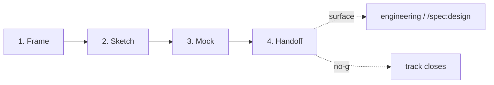

# Design Track — Brand-Compliant Surface Creation

**Version:** 1.0 · **Status:** Stable · **Stability:** Opt-in · **ADR:** [ADR-0019](adr/0019-add-design-track.md) · [ADR-0032](adr/0032-design-handoff-to-spec-design-bridge.md)

An opt-in track for producing new user-visible surfaces — marketing pages, docs sites, onboarding flows, dashboards — under the Specorator brand system. Produces a spec-quality handoff artifact that feeds directly into `/spec:design` or the engineer.

> If you are designing a **feature** with a UI component inside an existing surface, use **Stage 4 (`/spec:design`)** instead. The Design Track is for *new surfaces*, not feature-level UI work.

## Table of contents

1. [Why a Design Track](#1-why-a-design-track)
2. [Where it lives](#2-where-it-lives)
3. [The four phases](#3-the-four-phases)
4. [Specialist agents](#4-specialist-agents)
5. [Brand contract](#5-brand-contract)
6. [Quality gates](#6-quality-gates)
7. [Handoff to Stage 4 or engineering](#7-handoff-to-stage-4-or-engineering)

---

## 1. Why a Design Track

The Specorator's eleven lifecycle stages handle feature-level design at Stage 4. They assume a surface already exists. The **Design Track** is what produces a new surface — or a significant redesign of an existing one — before any engineer touches a file.

It applies when:

- A **second user-visible surface** is being created from scratch (docs site, dashboard, onboarding flow, marketing page).
- An **existing surface** is being redesigned in a way that touches the brand system holistically (not a component fix, but a structural overhaul).
- A **standalone design artifact** (a branded deck, a spec mock, a stakeholder presentation) needs to go through the brand system before it is shared externally.

It does **not** apply when:

- The work is a UI component or feature screen inside an existing surface — use `/spec:design` (Stage 4).
- The work is a copy or content change only — no design track needed.
- The work is a bug fix on an existing surface — patch it directly; invoke `brand-reviewer` at review time.

The track is opinionated about three things:

1. **Brief before brush.** No visual output is produced until the design brief is approved. Scope and audience must be written down before a single screen is sketched.
2. **Token-first, literal-never.** Every visual value — color, type, spacing, radius, shadow — resolves to a named token in `colors_and_type.css`. If a token is missing, it is proposed as an addition via PR; it is never hard-coded as a literal.
3. **Handoff is the gate artifact.** The mock (HTML prototype) is optional and useful; the handoff doc is mandatory. A surface without a handoff has not left the Design Track.

---

## 2. Where it lives

Each design is a directory under `designs/<slug>/` at the repo root. This is parallel to `specs/` (feature folders) and `discovery/` (sprint folders).

```
designs/
└── <slug>/
    ├── design-state.md        # phase state machine
    ├── design-brief.md        # Phase 1 — Frame
    ├── sketch.md              # Phase 2 — Sketch
    ├── mock.html              # Phase 3 — Mock (optional)
    └── design-handoff.md      # Phase 4 — Handoff (gate artifact)
```

Design slugs are kebab-case, ≤ 6 words. Name the *surface*, not the solution: `docs-site`, `onboarding-flow`, `dashboard-v1`.

---

## 3. The four phases



### 3.1 Frame

**Goal:** Understand what surface is being designed, for whom, and why. Write the design brief.

- Owner: `design-lead`
- Consulted: `product-strategist` (if available), `ux-designer`
- Command: `/design:frame`
- Artifact: `design-brief.md`
- Template: `templates/design-brief-template.md`

The brief answers: what is the surface, who uses it, what is their goal, what is the success condition, what are the constraints? It is the only artifact the human must approve before the track moves forward. A brief that has not been approved is a draft, not a gate pass.

**Quality gate:** Surface type named. Primary user and their goal stated. Success condition measurable. At least one constraint named. Human has approved.

### 3.2 Sketch

**Goal:** Map flows, key screens, and states in text. No visual treatment.

- Owner: `design-lead`
- Consulted: `ux-designer`
- Command: `/design:sketch`
- Artifact: `sketch.md`
- Template: `templates/design-sketch-template.md`

The sketch is a text-only document. It names every screen, its purpose, its entry/exit conditions, and its empty/loading/error states. It does not specify colors, fonts, or components — those are Phase 3. A sketch that omits states is not done; "standard error message" is not a state specification.

**Quality gate:** Every screen has empty, loading, and error states. Primary flow is a step list or Mermaid diagram. Accessibility notes exist for every interactive element. Brief goals are fully covered.

### 3.3 Mock

**Goal:** Apply the Specorator visual system. Assign components and tokens. Optionally produce a branded HTML prototype.

- Owner: `design-lead`
- Consulted: `ui-designer`, `brand-reviewer` (optional inline check)
- Command: `/design:mock`
- Artifact: `mock.html` (optional); token decisions recorded in `design-state.md`
- Template: n/a (free-form HTML; must import `colors_and_type.css`)

`ui-designer` assigns a design-system component to each screen element and names every token used. Any element that needs a token not yet in `colors_and_type.css` must be flagged — the token is proposed as an addition via PR before use, not hard-coded as a literal.

The mock is optional. It is valuable when:
- The surface is complex enough that a written inventory leaves layout ambiguity.
- Stakeholder sign-off requires something renderable.
- The engineer needs a pixel reference.

When produced, the mock is a static, self-contained HTML file. It imports `colors_and_type.css` directly. It contains no hex literals outside `:root`. It uses no icon libraries. It uses no emoji.

**Brand non-negotiables (gate on Phase 3 exit):**
- Page background: `var(--paper)`. Never `#fff` at page level.
- `--highlighter` only on: brand mark, primary CTA, step-number circles, code chips on dark backgrounds.
- Headlines: sentence-case, end with a period.
- Zero emoji. Zero icon library imports.
- Lane coding intact: Define = `--lane-define`, Build = `--lane-build`, Ship = `--lane-ship`.
- Every value is a named token. Missing tokens are proposed, not invented.

**Quality gate:** Component inventory complete. All token references are named custom properties. Microcopy exists for every screen element. Brand non-negotiables pass. Any proposed new tokens flagged for human approval.

### 3.4 Handoff

**Goal:** Produce a spec-quality artifact the engineer (or `/spec:design`) can consume directly.

- Owner: `design-lead`
- Consulted: `ui-designer`
- Command: `/design:handoff`
- Artifact: `design-handoff.md`
- Template: `templates/design-handoff-template.md`

The handoff synthesises everything: brief → sketch → mock decisions → final microcopy → accessibility checklist → open questions. It is the artifact that leaves the Design Track. Nothing ships without it.

**Quality gate:** Every screen has a component assignment. Every token reference is a named custom property. Microcopy is final (no "TBD"). Accessibility checklist is complete. Open questions are listed. Human has approved.

---

## 4. Specialist agents

| Agent | Role | Tool surface |
|---|---|---|
| [`design-lead`](../.claude/agents/design-lead.md) | Track orchestrator; owns all phases; reads `specorator-design` before any visual output | Read, Edit, Write |
| [`ux-designer`](../.claude/agents/ux-designer.md) | Flows, IA, states, accessibility (Phases 1–2) | Read, Edit, Write |
| [`ui-designer`](../.claude/agents/ui-designer.md) | Components, tokens, microcopy (Phase 3–4) | Read, Edit, Write |
| [`brand-reviewer`](../.claude/agents/brand-reviewer.md) | Optional inline brand check at Mock phase; same 14-check mechanical checklist as PR gate | Read, Grep, Bash |

### Phase ownership

| Phase | Owner | Consulted |
|---|---|---|
| 1 — Frame | design-lead | product-strategist, ux-designer |
| 2 — Sketch | design-lead | ux-designer |
| 3 — Mock | design-lead | ui-designer, brand-reviewer (opt.) |
| 4 — Handoff | design-lead | ui-designer |

`design-lead` never does the specialist work itself — it sequences, gates, and writes the artifact section that integrates each consulted agent's contribution.

---

## 5. Brand contract

The Design Track is the creation-side complement to the brand-reviewer enforcement gate. The brand contract applies at every phase:

### Mandatory reads (design-lead, before Phase 3)

- `.claude/skills/specorator-design/SKILL.md`
- `.claude/skills/specorator-design/README.md`
- `.claude/skills/specorator-design/colors_and_type.css`

### Non-negotiables

| Rule | Detail |
|---|---|
| No emoji | Zero emoji in copy or markup. Use monospace code chips, `→`, `·`, and status pills instead. |
| No icon imports | Zero load-bearing iconography. If a visual marker is needed, use a text element, a status pill, or a lane-coded stripe. |
| Cream paper | `var(--paper)` (#fbfcf8) for page backgrounds. `var(--surface)` (#ffffff) for cards only. |
| Chartreuse is a pop | `--highlighter` only for: brand mark, primary CTA, step-number circles, code chips on dark backgrounds. Never as a body fill or section background. |
| Sentence-case headlines | End with a period. "A specialist for every stage." — not "A Specialist For Every Stage" and not "A specialist for every stage" |
| Em-dashes | `—` (U+2014) for asides. Never `–` (U+2013). |
| Token-first | Every value resolves to a named token. Missing tokens are proposed via PR; never hard-coded. |
| Lane coding | Define = `--lane-define` (green). Build = `--lane-build` (blue). Ship = `--lane-ship` (gold). |

---

## 6. Quality gates

Each phase exits through a deterministic gate. A gate is either **pass** or **blocked** — there is no partial pass.

| Phase | Gate artifact | Gate conditions |
|---|---|---|
| Frame | `design-brief.md` | Surface type, user, goal, success condition, constraint — all present. Human approved. |
| Sketch | `sketch.md` | All screens have empty/loading/error states. Flow diagrammed. Accessibility noted. Brief goals covered. |
| Mock | token decisions in `design-state.md` | Component inventory complete. All tokens named. Microcopy present. Brand non-negotiables pass. |
| Handoff | `design-handoff.md` | All screens have component assignments and named tokens. Microcopy final. Accessibility checklist complete. Open questions listed. Human approved. |

A track exits with one of two terminal states:

- **Complete** — `design-handoff.md` approved; `design-state.md` set to `status: complete`. Recommend next step.
- **Parked** — the brief was abandoned or the surface was deprioritised before handoff. Record the reason in `design-state.md`; preserve all artifacts produced.

---

## 7. Handoff to Stage 4 or engineering

`design-handoff.md` is the canonical input for downstream consumers.

**If the surface is a new feature within the product:**
Recommend `/spec:design` — the architect reads `design-handoff.md` as Part B input alongside `ux-designer`'s Part A. The handoff replaces `ui-designer`'s Part B contribution at Stage 4 (it is already done).

**If the surface is a standalone artifact (marketing page, docs site, deck):**
Hand off directly to the engineer or the `product-page-designer` agent. The handoff replaces the design brief; the engineer does not need to re-derive token choices or microcopy.

**If the surface requires a new token in `colors_and_type.css`:**
File a PR against `colors_and_type.css` (canonical: `.claude/skills/specorator-design/colors_and_type.css`) and run `npm run fix:sites-tokens` to propagate the mirror. The `brand-reviewer` agent checks the new token for naming conventions and placement at PR review time.

Update `design-state.md` with `downstream:` pointing to the feature slug or engineer handoff issue before closing the track.
