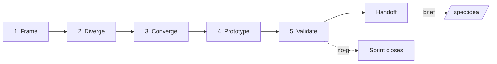

# Discovery Track — Ideation, Design Sprint, and Concept Validation

**Version:** 0.1 · **Status:** Draft · **Stability:** Opt-in · **ADR:** [ADR-0005](adr/0005-add-discovery-track-before-stage-1.md)

A pre-workflow track for teams arriving at the Specorator with a **blank page** rather than a brief. Produces a vetted, prototype-validated concept that feeds `/spec:idea` as input.

> If you already have a brief, **skip this track** and go straight to `/spec:start` + `/spec:idea`.

## Table of contents

1. [Why a Discovery Track](#1-why-a-discovery-track)
2. [Where it lives](#2-where-it-lives)
3. [The five phases](#3-the-five-phases)
4. [Specialist agents](#4-specialist-agents)
5. [Method library](#5-method-library)
6. [Quality gates](#6-quality-gates)
7. [Handoff to Stage 1](#7-handoff-to-stage-1)
8. [Sources and further reading](#8-sources-and-further-reading)

---

## 1. Why a Discovery Track

The Specorator's eleven stages assume a brief exists. The **Discovery Track** is what produces that brief.

It applies when:

- The team has a **strategic outcome** (a North Star, an OKR, a market) but no concrete feature yet.
- A stakeholder has named a **problem area** (e.g. "retention is dropping") without naming a solution.
- Multiple **candidate ideas** are competing and the team needs a structured way to pick.
- The riskiest assumption behind a proposed feature has **never been tested** and the team wants evidence before committing engineering effort.

It does **not** apply when:

- A specific request exists ("add SSO via Okta") — go straight to `/spec:idea`.
- The work is a bug fix, refactor, or compliance task — `/spec:idea` (or skipping straight to `/spec:requirements` via Lean depth) is the right entry.
- The decision has already been made by leadership — running discovery to "validate" a foregone conclusion is theatre, not discovery.

The track is opinionated about three things:

1. **Divergent then convergent.** Phases 2 and 3 separate idea generation from idea selection. They are not the same activity and should not happen at the same time. ([Double Diamond — Design Council](https://www.designcouncil.org.uk/our-resources/framework-for-innovation/))
2. **Test the riskiest assumption, not the smallest viable thing.** A prototype's job is to falsify a hypothesis, not to be a tiny version of the product. ([Higham — *The MVP is dead. Long live the RAT.*](https://hackernoon.com/the-mvp-is-dead-long-live-the-rat-233d5d16ab02))
3. **Game design and product design borrow from each other.** Software product discovery often skips experience framing (what does it *feel* like to use this?). Game design frameworks like MDA and Schell's Lenses fix that gap. ([Hunicke et al. — MDA paper](https://users.cs.northwestern.edu/~hunicke/MDA.pdf), [Schell — *Art of Game Design*](https://schellgames.com/art-of-game-design))

---

## 2. Where it lives

Each sprint is a directory under `discovery/<sprint-slug>/` at the repo root. This is **parallel** to `specs/` (which holds feature folders) and to `agents/operational/` (which holds always-on bots).

```
discovery/
└── <sprint-slug>/
    ├── discovery-state.md           # sprint state machine
    ├── frame.md                     # Phase 1 — context, JTBD, HMW
    ├── divergence.md                # Phase 2 — generated ideas
    ├── convergence.md               # Phase 3 — shortlist + decision
    ├── prototype.md                 # Phase 4 — storyboards + paper proto
    ├── validation.md                # Phase 5 — playtest results, RAT verdicts
    └── chosen-brief.md              # handoff — input to /spec:idea (0..N)
```

A sprint may produce **0, 1, or N** chosen briefs. Zero is a valid outcome: the sprint killed every candidate and saved the team from building the wrong thing. One brief flows into one feature folder; N briefs spawn N feature folders.

Sprint slugs are kebab-case, ≤ 6 words, and **are not** feature slugs — sprints are portfolio-level. Pick a slug that names the *outcome explored*, not the solution: `q2-retention-discovery`, not `loyalty-program`.

---

## 3. The five phases

Mapping the [Google Design Sprint](https://www.gv.com/sprint/) cadence onto the [Double Diamond](https://www.designcouncil.org.uk/our-resources/framework-for-innovation/):



### 3.1 Frame *(Discover + Define)*

**Goal:** turn an outcome into testable opportunity statements.

- Owner: `facilitator`
- Consulted: `product-strategist`, `user-researcher`
- Sprint analog: Monday — Map ([GV Sprint](https://www.gv.com/sprint/))
- Output: `frame.md`
- Methods: North Star, JTBD switch interviews, Opportunity Solution Tree, How-Might-We
- Quality gate: at least one outcome stated, one job-to-be-done articulated, three or more HMW questions, evidence (interviews, data) cited or assumptions made explicit.

### 3.2 Diverge *(Develop — divergent thinking)*

**Goal:** generate many ideas, far more than will survive.

- Owner: `facilitator`
- Consulted: `divergent-thinker`, `game-designer`
- Sprint analog: Tuesday — Sketch
- Output: `divergence.md`
- Methods: Crazy 8s, SCAMPER, lightning demos, MDA core-loop sketches, Schell's Lenses (#1 *Essential Experience*, #14 *Problem Statement*, #20 *Surprise*, #28 *The Toy* — full list under [`5. Method library`](#5-method-library))
- Quality gate: ≥ 12 distinct concepts captured; each tagged with the HMW it answers and the experience it targets (one of MDA's 8 aesthetics); no concept is rejected at this phase.

### 3.3 Converge *(Develop — convergent thinking)*

**Goal:** pick the small set worth prototyping.

- Owner: `facilitator`
- Consulted: `critic`, `product-strategist`
- Sprint analog: Wednesday — Decide
- Output: `convergence.md`
- Methods: Lightning Decision Jam, decision matrix, dot-voting, RAT prioritization, "Note-and-vote", Speed Critique
- Quality gate: shortlist of 1–3 concepts; each has an explicit *riskiest assumption* named; rejected concepts have a one-line reason; the Decider (human or `facilitator` proxy) has signed off.

### 3.4 Prototype *(Deliver — build)*

**Goal:** make the shortlist testable in a day, not a sprint.

- Owner: `facilitator`
- Consulted: `prototyper`, `game-designer`
- Sprint analog: Thursday — Prototype
- Output: `prototype.md` (storyboards, paper-prototype scripts, lo-fi flow descriptions; binary assets if any go in `discovery/<slug>/assets/`)
- Methods: storyboarding, paper prototyping, Wizard-of-Oz scripts, "Frankenstein" mash-ups, fake landing pages
- Quality gate: each shortlisted concept has a prototype description detailed enough that a non-designer could run a playtest with it; the riskiest assumption has a hypothesis statement and a falsification criterion.

### 3.5 Validate *(Deliver — test)*

**Goal:** put the prototype in front of a real human and learn.

- Owner: `facilitator`
- Consulted: `user-researcher`, `critic`
- Sprint analog: Friday — Test
- Output: `validation.md`
- Methods: 5-user usability tests, "Think Aloud" protocol, RAT outcomes, JTBD post-test interviews, 4-measure playtest evaluation (functionality, completeness, balance, engagement)
- Quality gate: ≥ 3 sessions with target users (Sprint 2.0 recommends 5); each riskiest-assumption hypothesis is marked **supported / refuted / inconclusive**; learnings are captured with verbatim quotes, not summaries.

### 3.6 Handoff *(transition to Stage 1)*

**Goal:** turn validated concept(s) into briefs the analyst can ingest.

- Owner: `facilitator`
- Consulted: `product-strategist`
- Output: `chosen-brief.md` (one file per surviving concept)
- Each brief contains: the originating sprint slug, the chosen concept, the riskiest-assumption verdict, the open questions that remain (these become the analyst's research agenda), and a recommended feature slug.
- Update `discovery-state.md` `status: complete`.
- Recommend `/spec:start <feature-slug>` followed by `/spec:idea`. The analyst reads `chosen-brief.md` as a mandatory input.

---

## 4. Specialist agents

Seven new agents under `.claude/agents/`. The vision: every team has an AI agent that can either *consult* the human specialist or *take over* the role if no specialist is available.

| Agent | Shadows | Tool surface | Primary methods |
|---|---|---|---|
| [`facilitator`](../.claude/agents/facilitator.md) | Sprint facilitator / Decider proxy | Read, Edit, Write | Sprint state, gating, hand-offs, `discovery-state.md` |
| [`product-strategist`](../.claude/agents/product-strategist.md) | PM / Strategist | Read, Edit, Write, WebSearch, WebFetch | Lean Canvas, JTBD, North Star, Opportunity Solution Tree |
| [`user-researcher`](../.claude/agents/user-researcher.md) | UX Researcher | Read, Edit, Write, WebSearch, WebFetch | JTBD switch interviews, playtests, RAT design |
| [`game-designer`](../.claude/agents/game-designer.md) | Game / Experience Designer | Read, Edit, Write | MDA, Schell's Lenses, core loops, motivation models |
| [`divergent-thinker`](../.claude/agents/divergent-thinker.md) | Ideation lead | Read, Edit, Write | HMW, Crazy 8s, SCAMPER, analogies, lightning demos |
| [`critic`](../.claude/agents/critic.md) | Devil's advocate / Decider | Read, Edit, Write | LDJ, decision matrices, RAT prioritization |
| [`prototyper`](../.claude/agents/prototyper.md) | UX Designer / Prototyper | Read, Edit, Write | Storyboards, paper prototypes, lo-fi flows |

The same conventions as lifecycle agents apply (see [`.claude/agents/README.md`](../.claude/agents/README.md)): narrow scope, narrow tools, no cross-stage encroachment, escalate ambiguity rather than invent.

### Phase ownership pattern

Each phase has **one owner** (the facilitator) who orchestrates **1–2 consulted specialists**. This mirrors Stage 4 (Design), where `ux-designer → ui-designer → architect` collaborate on a single `design.md`.

| Phase | Owner | Consulted |
|---|---|---|
| 1 — Frame | facilitator | product-strategist, user-researcher |
| 2 — Diverge | facilitator | divergent-thinker, game-designer |
| 3 — Converge | facilitator | critic, product-strategist |
| 4 — Prototype | facilitator | prototyper, game-designer |
| 5 — Validate | facilitator | user-researcher, critic |
| Handoff | facilitator | product-strategist |

The facilitator never does the specialist work itself — it sequences, gates, and writes the artifact section that summarizes each consulted specialist's contribution. If a human specialist is in the room, the consulted agent steps back and serves as note-taker/cross-check.

---

## 5. Method library

A short reference. Agents read this section to decide *which* technique to apply at *which* phase. Long-form descriptions live in the linked external sources.

### Strategic framing (Phase 1)

- **North Star Metric** — single leading indicator of customer-delivered value. ([Ellis — North Star Framework](https://growthmethod.com/the-north-star-metric/))
- **Jobs to be Done — switch interview** — interview a recent customer about the moment they switched, mapping the four forces (Push, Pull, Anxiety, Habit). 12–20 interviews per segment to saturation. ([Strategyn — JTBD](https://strategyn.com/jobs-to-be-done/), [Dscout — JTBD interview primer](https://dscout.com/people-nerds/the-jobs-to-be-done-interviewing-style-understanding-who-users-are-trying-to-become))
- **Opportunity Solution Tree** — Outcome → Opportunities → Solutions → Experiments. Used to keep the diverge phase rooted in real opportunities. ([Torres — OST](https://www.producttalk.org/opportunity-solution-trees/))
- **Lean Canvas** — 9 boxes (Problem, Solution, Key Metrics, UVP, Unfair Advantage, Channels, Customer Segments, Cost Structure, Revenue Streams). Forces the riskiest assumptions to the surface. ([leancanvas.com](https://leancanvas.com/))
- **How Might We** — reframe a problem as `How might we …?` to invite divergent solutions while implying solvability. Aim for 3–7 questions. ([Stanford d.school — HMW](https://dschool.stanford.edu/tools/how-might-we-questions), [NN/g — HMW Questions](https://www.nngroup.com/articles/how-might-we-questions/))

### Divergence (Phase 2)

- **Crazy 8s** — 8 sketches in 8 minutes. Push past the first idea, which is rarely the best. ([Design Sprint Kit — Crazy 8s](https://designsprintkit.withgoogle.com/methodology/phase3-sketch/crazy-8s))
- **Lightning demos** — 3-minute show-and-tell of inspiring solutions from anywhere (other industries, games, art). Mine for transferable mechanics.
- **SCAMPER** — Substitute, Combine, Adapt, Modify, Put to other use, Eliminate, Reverse. Forces orthogonal moves on existing concepts.
- **MDA** *(game-design lens)* — for each candidate, name the **Mechanics** (rules), **Dynamics** (run-time behavior), and **Aesthetics** (target emotional response — one of the 8: Sensation, Fantasy, Narrative, Challenge, Fellowship, Discovery, Expression, Submission). ([Hunicke et al.](https://users.cs.northwestern.edu/~hunicke/MDA.pdf), [Wikipedia — MDA](https://en.wikipedia.org/wiki/MDA_framework))
- **Core loop** *(game-design lens)* — name the smallest action → reward → motivation cycle that drives engagement.
- **Schell's Lenses** *(game-design lens)* — apply 3–5 of the 100 lenses to each candidate. Especially useful at this phase: #1 *Essential Experience*, #14 *Problem Statement*, #20 *Surprise*, #28 *The Toy*, #35 *Curiosity*, #71 *The Player*. ([Schell — Art of Game Design](https://schellgames.com/art-of-game-design))
- **Player motivation models** — Bartle (Achievers / Explorers / Socializers / Killers) and Self-Determination Theory (Competence / Autonomy / Relatedness). For each candidate, name the player type and the SDT need it satisfies. ([IxDF — Bartle's Player Types](https://ixdf.org/literature/article/bartle-s-player-types-for-gamification), [Ryan, Rigby, Przybylski — SDT in games](https://selfdeterminationtheory.org/SDT/documents/2006_RyanRigbyPrzybylski_MandE.pdf))

### Convergence (Phase 3)

- **Lightning Decision Jam (LDJ)** — 40-minute structured decision protocol; replaces open discussion with silent ideation, dot-voting, and effort/impact prioritization. ([AJ&Smart — LDJ](https://www.workshopper.com/lightning-decision-jam))
- **Decision matrix** — score candidates on 3–5 weighted dimensions (impact, confidence, effort, strategic fit, risk).
- **Note-and-vote** — silent: each participant writes notes, then votes; reduces groupthink and the dominance of louder voices.
- **Speed Critique** — for each candidate, 1 minute of strengths, 1 minute of risks, 1 minute of riskiest-assumption naming.
- **RAT prioritization** — for each shortlisted concept, identify *the one assumption that, if wrong, kills it*, and design the smallest test that could falsify it. ([Higham — RAT](https://hackernoon.com/the-mvp-is-dead-long-live-the-rat-233d5d16ab02))

### Prototype (Phase 4)

- **Storyboarding** — 10–15 panels showing the user's journey through the prototype, end to end. Bridges sketches to a testable artifact. ([Design Sprint Kit — Storyboard](https://designsprintkit.withgoogle.com/methodology/phase5-prototype/storyboard))
- **Paper prototyping** — physical pieces, cards, dice, sticky notes. Resist the urge to make it pretty; functionality > aesthetics. Components that will move are separate pieces; static components are drawn directly. ([Get Creative Today — Prototyping for Play](https://getcreativetoday.com/prototyping-for-play-from-paper-to-playtest/))
- **Wizard-of-Oz** — a human pretends to be the system. Tests the user-facing experience without building the backend.
- **Fake-it surface** — design-sprint maxim: build only what the customer will see. The prototype is a façade. ([Sprint book](https://www.thesprintbook.com/the-design-sprint))
- **Frankenstein** — mash up screenshots from existing tools to fake a flow that doesn't yet exist.

### Validate (Phase 5)

- **5-user usability test** — Nielsen's heuristic; 5 users find ~85% of usability issues. Sprint 2.0 follows this. ([AJ&Smart — Sprint 2.0](https://ajsmart.com/design-sprint-2-0/))
- **Think Aloud** — ask the user to narrate their thoughts during the playtest. Captures intent, not just behavior. ([idew.org — Playtest](https://docs.idew.org/project-video-game/project-instructions/2-design-and-build-solution/2.4-playtest-paper-prototype))
- **JTBD post-test interview** — after the test, replay the four forces. Did the prototype lower their Anxiety? Did it strengthen the Pull?
- **Playtest 4 measures** — functionality, completeness, balance, engagement. ([Game Developer — Play(test)ing Paper Prototype](https://www.gamedeveloper.com/design/play-test-ing-paper-prototype))
- **RAT verdict** — for each riskiest assumption, mark **supported / refuted / inconclusive** with verbatim evidence.

---

## 6. Quality gates

Each phase exits through a gate, identical in spirit to the lifecycle stages defined in [`docs/quality-framework.md`](quality-framework.md). The gate lives at the bottom of each phase template (`templates/discovery-*-template.md`).

A sprint exits Phase 5 with one of three terminal states:

- **Go** — ≥ 1 chosen brief; `/discovery:handoff` writes `chosen-brief.md` for each surviving concept.
- **No-go** — every candidate failed validation; the sprint records what was learned and closes. This is a successful sprint outcome.
- **Pivot** — the validation surfaced a different opportunity than what was framed. The sprint either re-runs Phase 1 with the new framing or closes and a fresh sprint is opened.

The Handoff phase is **not optional** when the outcome is Go. A "soft handoff" (one channel message saying "we picked X, build it") is exactly the loss-of-context the Specorator exists to prevent.

---

## 7. Handoff to Stage 1

`chosen-brief.md` is the canonical input format for `/spec:idea`. Its frontmatter pins it to the originating sprint:

```yaml
---
id: BRIEF-<AREA>-NNN
title: <Concept name>
sprint: <sprint-slug>
status: handed-off          # draft | handed-off | feature-opened | dropped
recommended_feature_slug: <feature-slug>
recommended_area: <AREA>
created: YYYY-MM-DD
inputs:
  - discovery/<sprint-slug>/frame.md
  - discovery/<sprint-slug>/convergence.md
  - discovery/<sprint-slug>/validation.md
---
```

The analyst reads `chosen-brief.md` *and* the upstream phase artifacts as mandatory inputs to `idea.md` — it does not invent context that the brief already settles. The brief seeds `idea.md`'s `## Problem statement`, `## Target users`, and `## Open questions`. The unresolved questions in `validation.md` become the research agenda in `research.md`.

---

## 8. Sources and further reading

### Books

- Knapp, J., Zeratsky, J., Kowitz, B. *Sprint: How to Solve Big Problems and Test New Ideas in Just Five Days.* Simon & Schuster, 2016. [thesprintbook.com](https://www.thesprintbook.com/)
- Schell, J. *The Art of Game Design: A Book of Lenses.* 3rd ed., CRC Press, 2019. [schellgames.com/art-of-game-design](https://schellgames.com/art-of-game-design)
- Torres, T. *Continuous Discovery Habits.* Product Talk LLC, 2021.
- Maurya, A. *Running Lean.* O'Reilly, 2010. [leancanvas.com](https://leancanvas.com/)
- Christensen, C., Hall, T., Dillon, K., Duncan, D. *Competing Against Luck.* HarperBusiness, 2016.
- Ulwick, A. *Jobs to be Done: Theory to Practice.* Idea Bite Press, 2016. [strategyn.com/jobs-to-be-done](https://strategyn.com/jobs-to-be-done/)

### Foundational papers and articles

- Hunicke, R., LeBlanc, M., Zubek, R. *MDA: A Formal Approach to Game Design and Game Research.* AAAI Workshop on Challenges in Game AI, 2004. [PDF](https://users.cs.northwestern.edu/~hunicke/MDA.pdf)
- Bartle, R. *Hearts, Clubs, Diamonds, Spades: Players Who Suit MUDs.* 1996.
- Ryan, R., Rigby, S., Przybylski, A. *The Motivational Pull of Video Games: A Self-Determination Theory Approach.* Motivation and Emotion 30, 2006. [PDF](https://selfdeterminationtheory.org/SDT/documents/2006_RyanRigbyPrzybylski_MandE.pdf)
- Higham, R. *The MVP is dead. Long live the RAT.* Hacker Noon, 2016. [hackernoon.com/the-mvp-is-dead-long-live-the-rat](https://hackernoon.com/the-mvp-is-dead-long-live-the-rat-233d5d16ab02)

### Frameworks and tools

- Design Council. *Framework for Innovation* (Double Diamond, 2005; updated 2019). [designcouncil.org.uk](https://www.designcouncil.org.uk/our-resources/framework-for-innovation/)
- AJ&Smart. *Design Sprint 2.0.* [ajsmart.com/design-sprint-2-0](https://ajsmart.com/design-sprint-2-0/)
- AJ&Smart. *Lightning Decision Jam.* [workshopper.com/lightning-decision-jam](https://www.workshopper.com/lightning-decision-jam)
- Google. *Design Sprint Kit* (Crazy 8s, Storyboard, etc.). [designsprintkit.withgoogle.com](https://designsprintkit.withgoogle.com/)
- IDEO / Stanford d.school. *How Might We Questions.* [dschool.stanford.edu](https://dschool.stanford.edu/tools/how-might-we-questions)
- Nielsen Norman Group. *Using "How Might We" Questions to Ideate on the Right Problems.* [nngroup.com](https://www.nngroup.com/articles/how-might-we-questions/)
- Product Talk. *Opportunity Solution Trees.* [producttalk.org](https://www.producttalk.org/opportunity-solution-trees/)
- Strategyn. *Jobs-to-be-Done.* [strategyn.com](https://strategyn.com/jobs-to-be-done/)
- Growth Method. *The North Star Metric & Framework.* [growthmethod.com](https://growthmethod.com/the-north-star-metric/)
- Open Practice Library. *Crazy 8s.* [openpracticelibrary.com](https://openpracticelibrary.com/practice/crazy-8s/)
