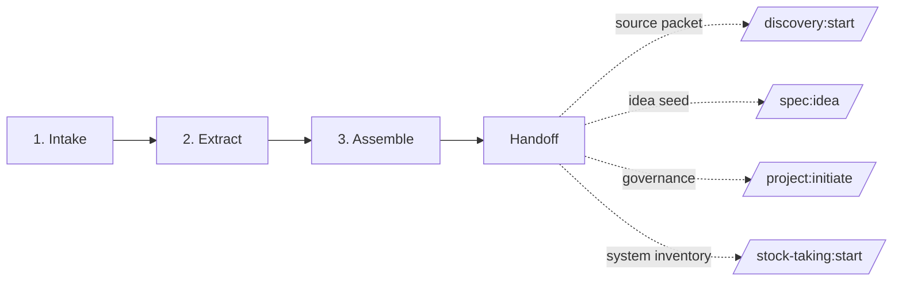

# Project Scaffolding Track — Source-Led Template Adoption

**Version:** 0.1 · **Status:** Draft · **Stability:** Opt-in · **ADR:** [ADR-0011](adr/0011-add-project-scaffolding-track.md)

A pre-workflow track for teams adopting this template when they already have loose project material: meeting notes, strategy docs, pitch decks converted to Markdown, research summaries, client briefs, or a folder of collected documentation. It distils those sources into a reviewable starter pack for the template's canonical artifacts.

> Use this track when you have existing documentation but not yet a clean `docs/steering/`, `projects/`, `discovery/`, or `specs/` structure. If there is no source material, use the Discovery Track. If the source material describes an existing system that must be inventoried, use Stock-taking first.

## Table of contents

1. [Why a Project Scaffolding Track](#1-why-a-project-scaffolding-track)
2. [Where it lives](#2-where-it-lives)
3. [The phases](#3-the-phases)
4. [The project-scaffolder agent](#4-the-project-scaffolder-agent)
5. [Method library](#5-method-library)
6. [Quality gates](#6-quality-gates)
7. [Handoff to downstream tracks](#7-handoff-to-downstream-tracks)

---

## 1. Why a Project Scaffolding Track

The template supports a blank page through Discovery, a clear brief through Specorator, and brownfield system understanding through Stock-taking. A fourth adoption scenario is common: a team has already discussed the project outside the template and arrives with scattered documents that contain useful context but no canonical artifacts.

The Project Scaffolding Track applies when:

- An organisation adopts the template for its first project and has meeting notes, prior docs, or a Markdown folder to ingest.
- A client or stakeholder provides a starting packet and the team needs a first set of steering and workflow documents.
- A team collected general documentation and wants to turn it into a structured starting point without pretending it is already requirements.
- Several candidate next steps are possible and the sources should decide whether to proceed to Discovery, Specorator, Project Manager Track, or Stock-taking.

It does not apply when:

- There is no source material. Start with `/discovery:start`.
- The material is primarily an unknown existing system inventory. Start with `/stock-taking:start`.
- A complete, accepted brief already exists. Start with `/spec:start` + `/spec:idea`.

The track is opinionated about three things:

1. **Evidence before drafting.** Every extracted fact cites its source. Weak or contradictory evidence remains visible.
2. **Drafts before promotion.** The track produces a starter pack under `scaffolding/<project>/` first. Promotion into `docs/steering/`, `projects/`, `discovery/`, or `specs/` is a human-reviewed handoff step.
3. **Context is not requirements.** The scaffolder may seed an idea or research agenda, but EARS requirements remain Stage 3 PM work.

---

## 2. Where it lives

Each engagement lives under `scaffolding/<project-slug>/` at the repo root.

```
scaffolding/
└── <project-slug>/
    ├── scaffolding-state.md       # engagement state machine
    ├── intake.md                  # source pointers, adoption context, desired outputs
    ├── source-inventory.md        # accessible material, reliability, coverage map
    ├── extraction.md              # evidence-backed distilled facts and ambiguities
    ├── starter-pack.md            # draft steering/project/spec/discovery starter content
    └── handoff.md                 # promotion checklist and recommended next track
```

The project slug names the adopting project or initiative, not a single feature. Good: `acme-portal-adoption`, `payments-platform-startup`. Bad: `add-export-button`.

---

## 3. The phases



### 3.1 Intake

**Goal:** identify source pointers, adoption context, desired starter outputs, and constraints.

- Owner: `project-scaffolder`
- Output: `intake.md` and `source-inventory.md`
- Quality gate: at least one source pointer is accessible; intended starter outputs selected; source reliability concerns named; open questions captured.

### 3.2 Extract

**Goal:** distil source-backed facts without turning them into unapproved requirements or design decisions.

- Owner: `project-scaffolder`
- Output: `extraction.md`
- Quality gate: every fact cites a source; confidence is assigned; conflicts are preserved; open questions are explicit.

### 3.3 Assemble

**Goal:** create a reviewable starter pack of draft content for canonical artifacts.

- Owner: `project-scaffolder`
- Output: `starter-pack.md`
- Quality gate: proposed outputs trace back to extraction facts; drafts are clearly labelled; downstream command recommendations are explicit; missing evidence is listed.

### 3.4 Handoff

**Goal:** record what should be promoted and route the team to the next track.

- Owner: `project-scaffolder`
- Output: `handoff.md`
- Quality gate: promotion checklist complete; recommended next step selected; remaining risks named; no human approval claimed unless it happened.

---

## 4. The project-scaffolder agent

One specialist agent, [`project-scaffolder`](../.claude/agents/project-scaffolder.md), owns this track.

| Agent | Shadows | Tool surface | Primary methods |
|---|---|---|---|
| `project-scaffolder` | Business analyst / technical writer / onboarding facilitator | Read, Edit, Write | source inventory, evidence extraction, document synthesis, starter-pack assembly |

Boundaries:

- Does not invent facts, requirements, stakeholder decisions, or architecture decisions.
- Does not overwrite canonical artifacts during extraction or assembly.
- Does not write EARS requirements; it prepares candidate context for Stage 1 and Stage 2.
- Routes to Stock-taking when sources describe an existing system whose behavior is not yet understood.

---

## 5. Method library

- **Source inventory** — enumerate all inputs and rate reliability (`authoritative`, `stale`, `contradictory`, `hearsay`, `unknown`).
- **Coverage mapping** — map each source to product, users, requirements/ideas, technical context, operations, and delivery governance.
- **Evidence extraction** — record one fact per row with source and confidence. This prevents polished prose from hiding weak evidence.
- **Ambiguity register** — keep contradictions visible until a human resolves them.
- **Starter pack assembly** — translate high-confidence extracted facts into draft sections for steering docs, feature idea seed, discovery seed, or project-manager initiation docs.
- **Promotion checklist** — make applying drafts into canonical locations explicit and reviewable.

---

## 6. Quality gates

Each phase template carries its own checklist. Across the track, the invariant is:

- No output is treated as accepted unless the source supports it and the human reviewed it.
- Weak evidence produces open questions, not confident language.
- The handoff chooses the next track based on source content:
  - `discovery` when the team still needs to decide what to build.
  - `spec` when a concrete feature brief can be seeded.
  - `project` when service-provider governance should be initiated.
  - `stock-taking` when source material points at a legacy system inventory need.
  - `none` when the material is insufficient or the engagement is intentionally closed.

---

## 7. Handoff to downstream tracks

`handoff.md` is the canonical handoff artifact. It may recommend one or more downstream commands:

- `/discovery:start <sprint-slug>` when sources contain opportunities but no chosen direction.
- `/spec:start <feature-slug> [<AREA>]` followed by `/spec:idea` when a concrete feature can be seeded.
- `/project:start <project-slug>` followed by `/project:initiate` when project governance is needed.
- `/stock-taking:start <project-slug>` when an existing system must be inventoried before discovery or requirements.

The downstream artifact should reference `scaffolding/<project>/handoff.md` and `scaffolding/<project>/starter-pack.md` in its `inputs:` frontmatter. The scaffolding folder remains preserved as the evidence trail.
