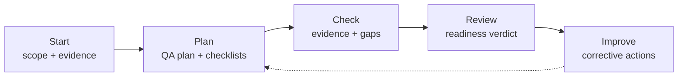

# Quality Assurance Track

The Quality Assurance Track helps a team check whether project execution is in good enough shape to deliver a quality product. It creates evidence-backed checklists, reviews gaps, and turns findings into corrective actions.

This track is aligned with ISO 9001 quality management concepts. It is not a certification program, and it does not replace an accredited external audit. As of 2026-04-28, ISO lists ISO 9001:2015 as current, with ISO 9001:2015/Amd 1:2024 and ISO/FDIS 9001 under development for a future edition. See ISO's current standard page: <https://www.iso.org/standard/62085.html>.

## When to use it

- Before a release gate when delivery readiness is unclear.
- During a project when execution health is drifting.
- Before client handoff or supplier acceptance.
- As internal readiness preparation for an ISO 9001 audit.
- After a retrospective identifies recurring quality-system gaps.

## Workflow

| Phase | Command | Output |
|---|---|---|
| Start | `/quality:start <slug> [scope]` | `quality/<slug>/quality-state.md` |
| Plan | `/quality:plan <slug>` | `quality-plan.md`, `checklists/project-execution.md` |
| Check | `/quality:check <slug>` | Completed checklists with evidence and gaps |
| Review | `/quality:review <slug>` | `quality-review.md` |
| Improve | `/quality:improve <slug>` | `improvement-plan.md` |

## Checklist model

Every checklist item records:

- check ID,
- ISO 9001 area label,
- evidence required,
- status,
- severity,
- owner,
- due date,
- evidence link,
- notes.

Statuses: `open`, `satisfied`, `gap`, `nonconformity`, `not-applicable`.

Severity: `S1` stops delivery, `S2` puts the next gate at risk, `S3` needs owned follow-up, and `S4` is an improvement opportunity.

## Relationship to other tracks

- `specs/` supplies requirements, tasks, implementation logs, test reports, and traceability evidence.
- `projects/` supplies project state, follow-up registers, deliverables maps, and status reports.
- `portfolio/` supplies cross-project health signals.
- `docs/steering/quality.md` supplies project-specific testing and review policy.
- `docs/steering/operations.md` supplies release, rollback, incident, and observability expectations.

The QA track may link findings into those artifacts, but it does not replace their owning agents or acceptance gates.
