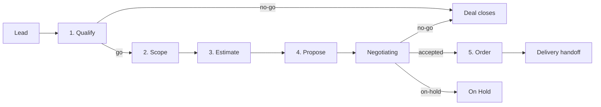

# Sales Cycle Track — Pre-Sales Workflow for Service Providers

**Version:** 0.1 · **Status:** Draft · **Stability:** Opt-in · **ADR:** [ADR-0006](adr/0006-add-sales-cycle-track-before-discovery.md)

A pre-delivery track for **service providers** (development agencies, consulting firms, freelancers) who need to win a project before they can build it. Covers the full commercial arc from lead qualification to signed order, and hands off structured context to the delivery workflow.

> If you already have a signed project mandate, **skip this track** and go straight to `/discovery:start` or `/spec:start`.

## Table of contents

1. [Why a Sales Cycle Track](#1-why-a-sales-cycle-track)
2. [Where it lives](#2-where-it-lives)
3. [The five phases](#3-the-five-phases)
4. [Specialist agents](#4-specialist-agents)
5. [Method library](#5-method-library)
6. [Quality gates](#6-quality-gates)
7. [Handoff to delivery](#7-handoff-to-delivery)
8. [Deal state machine](#8-deal-state-machine)
9. [Sources and further reading](#9-sources-and-further-reading)

---

## 1. Why a Sales Cycle Track

The Spec Kit's eleven stages and the Discovery Track both assume a project mandate exists. The **Sales Cycle Track** is what produces that mandate for a service provider.

It applies when:

- A prospect has reached out with a software development request and you need to decide whether to pursue it.
- You are responding to an RFP or tender and need to produce a structured proposal.
- A client conversation has identified a problem area but no scope or budget has been established.
- You need to produce a Statement of Work (SOW) that will become a contractual basis for delivery.
- You want to capture the pre-sales context in a structured way so it is not lost when delivery begins.

It does **not** apply when:

- You already have a signed contract or internal mandate — go straight to `/discovery:start` or `/spec:start`.
- The work is a change order on an existing project — use the change-control section of your existing `order.md` instead.
- The project is internal (no external client) — the sales cycle adds overhead without value in that context.

The track is opinionated about four things:

1. **Qualify first.** Don't build a proposal for an unwinnable or unprofitable deal. Qualification (BANT / MEDDIC) is a gate, not a formality. ([Napoli — MEDDIC](https://meddic.com/))
2. **Scope before estimating.** Estimation built on an unclear scope is fiction. The scoping workshop produces the bounded problem statement that makes estimation honest. ([Cohn — *Agile Estimating and Planning*](https://www.mountaingoatsoftware.com/books/agile-estimating-and-planning))
3. **Price risk, not just effort.** Every estimate carries uncertainty. Make it explicit — use three-point estimation, risk multipliers, and a clearly stated confidence level. ([Hulett — *Three-Point Estimation*](https://www.projectrisk.com/white_papers/ThreePointEstimationforCostandSchedule.pdf))
4. **The proposal is a boundary document, not a promise of perfection.** A good SOW defines what success looks like, what is out of scope, what the change-control process is, and what assumptions underpin the price. Ambiguity here is the root cause of most project overruns. ([PMI — SOW best practices](https://www.pmi.org/learning/library/statement-of-work-sow-critical-first-step-8114))

---

## 2. Where it lives

Each deal is a directory under `sales/<deal-slug>/` at the repo root. This is **parallel** to `discovery/` (concept exploration) and `specs/` (feature delivery).

```
sales/
└── <deal-slug>/
    ├── deal-state.md          # deal state machine
    ├── qualification.md       # phase 1 — go/no-go verdict + BANT/MEDDIC scores
    ├── scope.md               # phase 2 — bounded problem statement + functional scope
    ├── estimation.md          # phase 3 — WBS, risk register, pricing
    ├── proposal.md            # phase 4 — SOW / offer document
    ├── revisions/             # proposal revision history (LAZY)
    │   └── proposal-v2.md
    └── order.md               # phase 5 — signed/accepted + project kickoff brief
```

A deal may end at any phase with outcome `no-go` (don't bid) or `on-hold` (suspended). A `no-go` is a successful outcome — it prevented wasted effort. The deal folder is preserved as historical context.

Deal slugs are kebab-case, ≤ 6 words, and name the **client + engagement**: `acme-ecommerce-platform`, `globex-data-migration`, `initech-mobile-app`.

---

## 3. The five phases



### Phase 1 — Qualify

**Owner:** `sales-qualifier`  
**Input:** lead information (email thread, RFP document, meeting notes)  
**Output:** `qualification.md` — a structured verdict with supporting evidence

**What happens:**

Evaluate the lead against a qualification framework before investing time in scoping or proposal work. The goal is a binary decision: **pursue** or **no-go** (with a third option: **more info needed**, which extends Phase 1).

Frameworks applied:
- **BANT**: Budget (is there funding?), Authority (are we talking to a decision-maker?), Need (is the problem real and urgent?), Timeline (is the project starting when we can staff it?)
- **MEDDIC extension**: Metrics (how does the client measure success?), Economic Buyer (identified?), Decision Criteria (explicit?), Decision Process (known?), Identify Pain (verified?), Champion (someone internal advocating for us?)
- **Win-probability scoring**: combine BANT/MEDDIC scores, competitive landscape, relationship strength, and strategic fit into a 0–100 score. Deals below 40 are no-go unless strategic.

**Quality gate:** BANT responses documented. Win probability scored and justified. Verdict (pursue / no-go / more-info) stated with rationale. If `more-info`, next steps listed with owner and date.

---

### Phase 2 — Scope

**Owner:** `scoping-facilitator`  
**Input:** `qualification.md`, any RFP or brief provided by the client  
**Output:** `scope.md` — bounded problem statement, in-scope work, explicit exclusions, open questions

**What happens:**

Run a structured scoping session with the client (remote or in-person). The goal is **not** to produce a full spec — it is to produce a bounded problem statement precise enough to estimate.

Techniques applied:
- **Problem framing**: distinguish the stated request ("we need a mobile app") from the underlying problem ("our field technicians can't access work orders offline"). The scope document addresses the problem, not just the stated request.
- **Impact mapping** (Adzic, 2012): Goal → Actors → Impacts → Deliverables. Surfaces the logical chain from business outcome to software deliverable.
- **Scope boundary definition**: explicit in-scope, out-of-scope, and grey-zone lists. Grey-zone items are flagged as assumptions or future change requests.
- **Stakeholder map**: who will use it, who approves it, who can veto it, who is the champion.
- **Dependency scan**: third-party APIs, legacy systems to integrate, data migrations, regulatory requirements, existing infrastructure constraints.
- **Non-functional requirements (NFRs) first pass**: performance, availability, security, geography/data-residency, compliance (GDPR, HIPAA, etc.). NFRs drive architecture choices and therefore cost.
- **Open questions**: anything that couldn't be resolved in the scoping session. Each question has an owner and a due date.

**Quality gate:** Problem statement clearly distinguishes real problem from stated request. In-scope / out-of-scope / grey-zone documented. Stakeholder map complete. NFRs captured at headline level. Open questions owned and dated.

---

### Phase 3 — Estimate

**Owner:** `estimator`  
**Input:** `scope.md`, any technical constraints from qualification  
**Output:** `estimation.md` — work breakdown, risk register, pricing model recommendation, cost range

**What happens:**

Decompose the scope into estimable units and assign effort ranges. Produce a risk-adjusted cost range (not a point estimate) with an explicit confidence level.

Techniques applied:
- **Work Breakdown Structure (WBS)**: decompose the in-scope work into phases (discovery, design, build, test, deploy, stabilisation) and within each phase into work packages. Each package gets a three-point estimate (optimistic / most-likely / pessimistic) in days.
- **PERT formula**: `E = (O + 4M + P) / 6` for expected effort; `SD = (P - O) / 6` for standard deviation. Total range = sum of expected values ± combined standard deviations. Report at 80% confidence interval (E + 1.28 SD).
- **Risk register**: identify the top 5–8 risks with probability (H/M/L) and impact (H/M/L). For each risk, state the mitigation and whether it is included in the estimate or a change-order trigger.
- **Risk multiplier**: apply a multiplier (1.1–1.5×) to the base estimate depending on novelty, team familiarity with the stack, dependency count, and client responsiveness history.
- **Pricing model selection**:
  - **Fixed price**: appropriate when scope is well-defined, client is risk-averse, and provider confidence is high (≥ 80% confidence interval used as the price floor). Include a change-control clause.
  - **Time & Materials (T&M)**: appropriate when scope is exploratory or likely to change. Client bears cost risk; provider bears reputation risk. Set a not-to-exceed (NTE) cap.
  - **Retainer**: appropriate for ongoing, amorphous work (maintenance, enhancements). Price per hour or day with a monthly minimum.
  - **Phased / hybrid**: fixed-price discovery phase → T&M build phase. Reduces client risk while providing scope clarity before committing to build.
- **Payment milestone schedule**: for fixed-price, propose milestone-based payment (e.g., 30% on start, 40% on UAT, 30% on go-live). For T&M, propose monthly invoicing.

**Quality gate:** WBS covers all in-scope items. Three-point estimates recorded (not just single-point). Risk register has ≥ 5 entries. Pricing model chosen with rationale. Cost range stated as a range (not a single number) at an explicit confidence level.

---

### Phase 4 — Propose

**Owner:** `proposal-writer`  
**Input:** `qualification.md`, `scope.md`, `estimation.md`  
**Output:** `proposal.md` — the client-facing proposal / SOW

**What happens:**

Write the formal offer document. The proposal must be readable by a non-technical stakeholder in under 15 minutes (executive summary) **and** by a technical/legal team doing due diligence (detailed sections).

Proposal structure:
1. **Cover page**: client name, proposal title, date, validity period, provider contact.
2. **Executive summary** (≤1 page): problem statement, proposed solution, key benefits, headline price and timeline.
3. **Our understanding of your situation**: restate the client's problem in their language. This demonstrates listening and surfaces misalignments before they become contract disputes.
4. **Proposed solution**: solution overview, approach (methodology, team structure, communication cadence), key decisions and their rationale.
5. **Scope of work**: in-scope deliverables with acceptance criteria, phased timeline with milestones, explicit out-of-scope list.
6. **Technical approach** (optional, for technical audiences): architecture overview, tech stack, integration points, NFR approach.
7. **Team**: roles, named leads if possible, relevant experience.
8. **Pricing and payment**:
   - For fixed price: total price, breakdown by phase, milestone payment schedule, what triggers change orders.
   - For T&M: daily/hourly rates, estimated effort range, NTE cap, invoicing cadence.
9. **Assumptions and exclusions**: every assumption that underpins the price. If an assumption is wrong, a change order follows. Be explicit.
10. **Change control process**: how changes are requested, assessed, priced, and approved.
11. **Our working model**: what the client is expected to provide (access, decisions, feedback turnaround SLA), what happens if they don't.
12. **Next steps**: what happens after the client says yes (onboarding, kickoff, first milestone).
13. **Validity**: proposal is valid for N days. After that, re-estimation may be required.
14. **Terms and conditions**: reference to the master services agreement or include standard terms.

**Internal review before sending:** the proposal-writer must flag any assumptions that haven't been validated with the client, any risks not covered by the pricing, and any commitments that exceed the provider's capacity.

**Quality gate:** All 14 proposal sections present. Assumptions section is non-empty. Out-of-scope list is explicit (not implied). Change-control process defined. Validity period stated. Price matches `estimation.md` figures. Internal review checklist signed off.

---

### Phase 5 — Order

**Owner:** `proposal-writer` (human sign-off required)  
**Input:** `proposal.md`, client acceptance (email, signed PDF, or digital signature)  
**Output:** `order.md` — formal record of the accepted offer + **Project Kickoff Brief**

**What happens:**

Record the accepted commercial terms and produce the **Project Kickoff Brief** — the canonical handoff artifact that seeds the delivery workflow.

The order document:
- References the accepted proposal version and date.
- Records any negotiated changes from the proposal (scope adjustments, price concessions, deferred items).
- Logs the formal acceptance event (email timestamp, signature reference, PO number).
- Contains the **Project Kickoff Brief**: a structured summary written for the delivery team, covering client context, problem statement, agreed scope, budget, timeline, key stakeholders, non-negotiables, political considerations, and open questions that survived into delivery.
- Recommends the downstream workflow entry point: `/discovery:start <sprint-slug>` (for exploratory mandates) or `/spec:start <feature-slug>` (for defined mandates).

**Quality gate:** Accepted proposal version recorded. All negotiated changes documented. Project Kickoff Brief complete (all sections present). Downstream workflow entry point stated. Human sign-off captured before marking `status: ordered`.

---

## 4. Specialist agents

| Agent | Human role it shadows | Phases | Tools |
|---|---|---|---|
| `sales-qualifier` | Account executive / BD rep | 1 — Qualify | Read, Edit, Write, WebSearch |
| `scoping-facilitator` | Solutions architect / presales consultant | 2 — Scope | Read, Edit, Write |
| `estimator` | Lead engineer / delivery manager | 3 — Estimate | Read, Edit, Write |
| `proposal-writer` | Bid manager / account director | 4 — Propose, 5 — Order | Read, Edit, Write |

Agent rules (all agents):
- Operate only within the defined phase scope.
- Use only inputs provided; never invent scope, pricing, or client context.
- Escalate ambiguity as an open question in the active artifact with an owner and due date.
- Update `deal-state.md` on handoff.
- Never autonomously send documents to external parties; that requires explicit human action.

---

## 5. Method library

### Qualification methods

| Method | Use when |
|---|---|
| **BANT** (Budget, Authority, Need, Timeline) | Quick initial screen; useful for inbound leads |
| **MEDDIC** (Metrics, Economic Buyer, Decision Criteria, Decision Process, Identify Pain, Champion) | Complex B2B deals with multiple stakeholders |
| **SPIN Selling** (Situation, Problem, Implication, Need-payoff) | Discovery call structure; elicits pain rather than mapping to features |
| **Win probability score** | Comparing multiple simultaneous opportunities for resource allocation |

### Scoping methods

| Method | Use when |
|---|---|
| **Impact mapping** (Goal → Actor → Impact → Deliverable) | Connecting software features to business outcomes |
| **Event storming** (Brandolini) | Mapping domain events to understand system boundaries |
| **User story mapping** (Patton) | High-level backlog for scoping; identifies must-haves vs. nice-to-haves |
| **6x6 scope matrix** | Quickly categorising items as in / out / grey |
| **Assumption mapping** | Identifying and ranking assumptions by risk and knowability |

### Estimation methods

| Method | Use when |
|---|---|
| **Three-point estimation + PERT** | Standard for any non-trivial project |
| **Analogy-based estimation** | Provider has a comparable delivered project |
| **T-shirt sizing → PERT** | Large initial backlogs where story-level detail isn't available |
| **Planning poker** | Cross-functional team estimation for detailed backlogs |
| **Monte Carlo simulation** | Very large or high-uncertainty projects |

### Proposal / SOW patterns

| Pattern | Use when |
|---|---|
| **Fixed-price SOW** | Scope well-defined; client risk-averse |
| **T&M with NTE cap** | Scope is likely to change; provider reputation at stake |
| **Phased: fixed discovery + T&M build** | Scope unclear; client needs cost certainty after phase 1 |
| **Retainer** | Ongoing maintenance, advisory, or continuous improvement |
| **Value-based pricing** | Strategic outcome is high-value; hourly/daily rates undersell |

---

## 6. Quality gates

### Phase 1 — Qualify

- [ ] BANT responses documented for all four dimensions.
- [ ] Win probability scored (0–100) with justification.
- [ ] Competitive landscape noted (who else is bidding?).
- [ ] Verdict stated: `pursue` / `no-go` / `more-info`.
- [ ] If `more-info`: next steps listed with owner + due date.

### Phase 2 — Scope

- [ ] Problem statement distinguishes real problem from stated request.
- [ ] In-scope deliverables listed.
- [ ] Out-of-scope items listed explicitly.
- [ ] Grey-zone items flagged as assumptions or future change requests.
- [ ] Stakeholder map complete (user, approver, champion, veto).
- [ ] NFRs captured at headline level (performance, availability, security, compliance).
- [ ] Dependencies and integrations listed.
- [ ] Open questions owned and dated (none left unowned).

### Phase 3 — Estimate

- [ ] WBS covers all in-scope deliverables from `scope.md`.
- [ ] Three-point estimates (O / M / P) recorded for each work package.
- [ ] PERT totals computed; standard deviation stated.
- [ ] Confidence interval stated (recommend 80%).
- [ ] Risk register has ≥ 5 entries with probability, impact, mitigation.
- [ ] Risk multiplier applied and justified.
- [ ] Pricing model chosen with rationale.
- [ ] Cost range (not point estimate) stated.
- [ ] Payment milestone schedule proposed.

### Phase 4 — Propose

- [ ] All 14 proposal sections present.
- [ ] Executive summary is ≤ 1 page.
- [ ] Assumptions section is non-empty.
- [ ] Out-of-scope list is explicit.
- [ ] Change-control process defined.
- [ ] Pricing matches `estimation.md` figures.
- [ ] Validity period stated.
- [ ] Internal review checklist complete.
- [ ] Proposal sent to client (human action — not automated).

### Phase 5 — Order

- [ ] Accepted proposal version recorded.
- [ ] Negotiated changes documented (even if none).
- [ ] Acceptance event logged (date, reference).
- [ ] Project Kickoff Brief complete (all sections).
- [ ] Downstream workflow entry point stated.
- [ ] Human sign-off recorded before status → `ordered`.

---

## 7. Handoff to delivery

The `order.md` **Project Kickoff Brief** is the single artefact that bridges the commercial and delivery worlds. It must be read by every agent and human that joins the delivery team.

### Project Kickoff Brief — required sections

1. **Client context**: who they are, their industry, why this project matters to them now.
2. **Problem statement**: verbatim from `scope.md`, not paraphrased. Delivery teams should speak the client's language.
3. **Agreed scope summary**: what is in scope, what is explicitly out of scope, what is deferred to a future phase.
4. **Budget and timeline**: total budget (if shared), payment milestones, required go-live date, hard deadlines.
5. **Key stakeholders**: name, role, communication preference, escalation path.
6. **Non-negotiables**: things the client said must not change (technology choice, data residency, integration with system X, GDPR compliance, etc.).
7. **Political considerations**: internal dynamics the delivery team should be aware of (champion who needs wins, sceptic who needs evidence, budget holder who is not the day-to-day contact).
8. **Assumptions carried into delivery**: every assumption from the proposal that the delivery team must validate or escalate if wrong.
9. **Open questions**: items that were unresolved at close and must be resolved in the first sprint.
10. **Downstream workflow**: which entry point — `/discovery:start` (for exploratory mandates) or `/spec:start` (for defined mandates) — and the slug to use.

### What the delivery workflow reads

When starting a delivery workflow that originates from a sales deal:

- `discovery:start` or `spec:start` references `sales/<deal-slug>/order.md` in the new folder's state file.
- The `analyst` (Stage 1) reads the Project Kickoff Brief as a mandatory input alongside the brief.
- The `pm` (Stage 3) reads budget and non-negotiables as explicit constraints in the PRD.
- The `architect` (Stage 4/5) reads NFRs and technical constraints from `scope.md`.
- The `retrospective` (Stage 11) includes a pre-sales accuracy assessment: how close was the estimate, what scope drift occurred, what open questions were never resolved.

---

## 8. Deal state machine

```
lead
  └─ qualifying          (sales-qualifier running)
       ├─ no-go          (close — record reason; preserve artifacts)
       └─ go
            └─ scoping   (scoping-facilitator running)
                 └─ estimating  (estimator running)
                      └─ proposing  (proposal-writer running)
                           ├─ no-go     (close — record reason)
                           ├─ on-hold   (suspend — record condition)
                           └─ negotiating
                                ├─ no-go
                                ├─ on-hold
                                └─ ordered   (delivery handoff triggered)
```

### deal-state.md YAML frontmatter schema

```yaml
deal: <deal-slug>
client: <Client Name>
contact: <Primary contact name and email>
source: inbound | referral | outbound | rfp   # how the lead arrived
current_phase: qualifying   # qualifying | scoping | estimating | proposing | negotiating | ordered | no-go | on-hold
status: active              # active | on-hold | ordered | closed
last_updated: YYYY-MM-DD
last_agent: <role>
artifacts:
  qualification.md: pending   # pending | in-progress | complete | skipped | blocked
  scope.md: pending
  estimation.md: pending
  proposal.md: pending
  order.md: pending
```

---

## 9. Sources and further reading

- Napoli, J. *MEDDIC Sales Methodology*. PTC, 1990s. [meddic.com](https://meddic.com/)
- Rackham, N. *SPIN Selling*. 1988. McGraw-Hill.
- Miller, R., Heiman, S. *The New Strategic Selling*. Warner Books, 1985.
- PMI. *Statement of Work: A Critical First Step*. [pmi.org](https://www.pmi.org/learning/library/statement-of-work-sow-critical-first-step-8114)
- Cohn, M. *Agile Estimating and Planning*. Prentice Hall, 2005. [mountaingoatsoftware.com](https://www.mountaingoatsoftware.com/books/agile-estimating-and-planning)
- Hulett, D. *Three-Point Estimation for Cost and Schedule*. [projectrisk.com](https://www.projectrisk.com/white_papers/ThreePointEstimationforCostandSchedule.pdf)
- Weiss, A. *Value-Based Fees*. Pfeiffer, 2002.
- Adzic, G. *Impact Mapping*. 2012. [impactmapping.org](https://www.impactmapping.org/)
- Patton, J. *User Story Mapping*. O'Reilly, 2014.
- Brandolini, A. *Introducing Event Storming*. [eventstorming.com](https://www.eventstorming.com/)
- Treloar, G. *How to Scope a Software Project*. Thoughtworks.
