# Specorator — Quality-Driven, Agentic Development Workflow

**Version:** 0.5.1 · **Status:** Release infrastructure in review · **Purpose:** Spec-driven, agentic workflow template

v0.5.1 is the recovery release for v0.5 — republishes the GitHub Release page after the Immutable Releases incident on the v0.5.0 publish dispatch ([#233](https://github.com/Luis85/agentic-workflow/issues/233)). v0.5.0 added the release workflow, GitHub Release and Package distribution path, and fresh-surface package contract on top of the lifecycle, skills, automation, and quality-gate foundation; v0.5.1 carries no behavioural changes — only version metadata and the documentation surfaces that mirror the version differ.

A solution-agnostic, **spec-driven** workflow for building software with humans and AI agents. Treats specifications as the source of truth and code as their artifact. Covers the full SDLC: Product → UX → UI → Engineering → Testing → Quality → Delivery → Operations.

## Table of contents

1. [Core principles](#1-core-principles)
2. [Workflow overview](#2-workflow-overview)
3. [Stages, artifacts, and quality gates](#3-stages-artifacts-and-quality-gates)
4. [Agent model](#4-agent-model)
5. [Orchestration](#5-orchestration)
6. [Quality framework](#6-quality-framework)
7. [Traceability](#7-traceability)
8. [Iteration model](#8-iteration-model)
9. [Usage guidelines](#9-usage-guidelines)
10. [Future extensions](#10-future-extensions)
11. [Quality Assurance Track](#11-quality-assurance-track)
12. [Project-review Workflow](#12-project-review-workflow)
13. [Roadmap Management Track](#13-roadmap-management-track)
14. [Design Track](#14-design-track)
15. [Improving Specorator itself](#15-improving-specorator-itself)

---

## 1. Core principles

See [`memory/constitution.md`](../memory/constitution.md) for the full version. In brief:

1. **Spec-driven** — code derives from specs.
2. **Separation of concerns** — each stage has one purpose.
3. **Incremental** — small, verifiable steps.
4. **Quality gates** — every stage exits through one.
5. **Traceability** — every artifact links to its inputs.
6. **Agent specialisation** — narrow scope per role.
7. **Human oversight** — humans own intent, priorities, acceptance.
8. **Plain language** — written for humans first.
9. **Reversibility** — irreversible actions need explicit authorisation.
10. **Iteration** — feedback loops, not waterfall.

---

## 2. Workflow overview

The canonical v1.0 workflow track taxonomy is frozen in [ADR-0026](adr/0026-freeze-v1-workflow-track-taxonomy.md). The core lifecycle is one track; 11 opt-in or companion tracks sit around it. Do not infer new tracks from new checklists, skills, or review paths unless a superseding ADR adds a new state-bearing workflow.

```mermaid
flowchart LR
    scaffold["Project Scaffolding Track"]
    discovery["Discovery Track"]
    design_track["Design Track"]
    idea["1. Idea"]
    research["2. Research"]
    requirements["3. Requirements"]
    design["4. Design"]
    specification["5. Specification"]
    tasks["6. Tasks"]
    implementation["7. Implementation"]
    testing["8. Testing"]
    review["9. Review"]
    release["10. Release"]
    learning["11. Learning"]

    scaffold -.->|starter pack| discovery
    scaffold -.->|idea seed| idea
    design_track -.->|design-handoff.md| design
    discovery -.->|brief| idea
    idea --> research
    research --> requirements
    requirements --> design
    design --> specification
    specification --> tasks
    tasks --> implementation
    implementation --> testing
    testing --> review
    review --> release
    release --> learning

    learning -.->|feedback| idea
    review -.->|defect| requirements
    review -.->|defect| design
    testing -.->|defect| implementation
```



**Optional gates** (run between any two stages when needed):

- **`/spec:clarify`** — interrogates the active artifact for under-specification. Run before declaring a stage done.
- **`/spec:analyze`** — cross-artifact consistency and coverage check. Catches drift between requirements, design, spec, and tasks.

**Optional pre-stage** (run *before* Stage 1 when no brief exists yet):

- **Project Scaffolding Track** — a source-led onboarding workflow for teams adopting the template with existing folders or Markdown files. Produces `starter-pack.md` and `handoff.md`, then routes to Discovery, Stage 1, Project Manager Track, or Stock-taking. Defined in [`docs/project-scaffolding-track.md`](project-scaffolding-track.md); rationale in [ADR-0011](adr/0011-add-project-scaffolding-track.md). **Use when source material exists but no canonical artifacts exist yet.**
- **Discovery Track** — a 5-phase ideation + design-sprint mini-workflow (Frame → Diverge → Converge → Prototype → Validate → Handoff) for teams arriving with a blank page rather than a brief. Produces `chosen-brief.md` which seeds Stage 1. Defined in [`docs/discovery-track.md`](discovery-track.md); rationale in [ADR-0005](adr/0005-add-discovery-track-before-stage-1.md). **Skip when a brief already exists.**

**Optional companion workflows** (run alongside projects, portfolios, releases, or features when quality, learning, or delivery governance matters):

- **Quality Assurance Track** — an ISO 9001-aligned evidence workflow for checking project execution health and delivery readiness. Produces `quality-plan.md`, checklists, `quality-review.md`, and `improvement-plan.md`. Defined in [`docs/quality-assurance-track.md`](quality-assurance-track.md). **Use for internal readiness, quality drift review, release readiness, supplier assurance, or audit preparation.**
- **Project-review workflow** — an evidence-backed review of project artifacts, git history, PR/issue/CI signals, and retrospectives. Produces project-review artifacts under `quality/<slug>/`, opens a tracking issue, and creates the first draft PR for the selected improvement from its own worktree. Defined in [`docs/project-review-workflow.md`](project-review-workflow.md). **Use when a maintainer wants cross-project learnings and concrete improvement proposals instead of a retrospective that stops at notes.**
- **Roadmap Management Track** — an outcome-led product/project planning workflow for roadmaps, delivery confidence, stakeholder alignment, and team communication. Produces `roadmap-board.md`, `delivery-plan.md`, `stakeholder-map.md`, `communication-log.md`, and `decision-log.md` under `roadmaps/<slug>/`. Defined in [`docs/roadmap-management-track.md`](roadmap-management-track.md). **Use when product direction, project delivery constraints, stakeholder expectations, and team communication need one maintained source of truth.**
- **Design Track** — a four-phase, brand-aware surface-creation workflow (Frame → Sketch → Mock → Handoff) for producing new user-visible surfaces under the Specorator brand system. Produces `design-brief.md`, `sketch.md`, an optional `mock.html`, and `design-handoff.md` under `designs/<slug>/`. Defined in [`docs/design-track.md`](design-track.md); rationale in [ADR-0019](adr/0019-add-design-track.md). **Use when creating a new surface (docs site, marketing page, onboarding flow, dashboard) or significantly redesigning an existing one. Do not use for feature-level UI work — use `/spec:design` (Stage 4) instead.**

Agentic security review guidance is a QA/reviewer extension, not a separate track in the v1.0 taxonomy. See [ADR-0026](adr/0026-freeze-v1-workflow-track-taxonomy.md).

---

## 3. Stages, artifacts, and quality gates

Each stage **consumes inputs**, **produces a defined artifact**, **is owned by one agent role**, and **must pass a quality gate** before the next stage starts.

| # | Stage | Owner | Output (in `specs/<feature>/`) | Template |
|---|---|---|---|---|
| 1 | Idea | Analyst | `idea.md` | [`templates/idea-template.md`](../templates/idea-template.md) |
| 2 | Research | Analyst | `research.md` | [`templates/research-template.md`](../templates/research-template.md) |
| 3 | Requirements | PM | `requirements.md` (PRD) | [`templates/prd-template.md`](../templates/prd-template.md) |
| 4 | Design | UX + UI + Architect | `design.md` (+ ADRs) | [`templates/design-template.md`](../templates/design-template.md) |
| 5 | Specification | Architect | `spec.md` | [`templates/spec-template.md`](../templates/spec-template.md) |
| 6 | Tasks | Planner | `tasks.md` | [`templates/tasks-template.md`](../templates/tasks-template.md) |
| 7 | Implementation | Dev | code + `implementation-log.md` | [`templates/implementation-log-template.md`](../templates/implementation-log-template.md) |
| 8 | Testing | QA | `test-plan.md`, `test-report.md` | [`templates/test-plan-template.md`](../templates/test-plan-template.md), [`templates/test-report-template.md`](../templates/test-report-template.md) |
| 9 | Review | Reviewer | `review.md`, `traceability.md` (RTM) | [`templates/review-template.md`](../templates/review-template.md), [`templates/traceability-template.md`](../templates/traceability-template.md) |
| 10 | Release | Release Manager | `release-notes.md` (+ optional `release-readiness-guide.md`) | [`templates/release-notes-template.md`](../templates/release-notes-template.md), [`templates/release-readiness-guide-template.md`](../templates/release-readiness-guide-template.md) |
| 11 | Learning | Retrospective | `retrospective.md` | [`templates/retrospective-template.md`](../templates/retrospective-template.md) |

Quality gates per stage are summarised below; the full Definition of Done lives in [`docs/quality-framework.md`](quality-framework.md).

### 3.1 Idea
- **Goal:** Capture and structure an initial concept.
- **Quality gate:** Problem is understandable. Scope is bounded. Unknowns are listed.

### 3.2 Research
- **Goal:** Understand context, feasibility, and alternatives.
- **Quality gate:** Sources documented. ≥ 2 alternatives explored. Risks named with severity.

### 3.3 Requirements (PRD)
- **Goal:** Define what should be built and why.
- **Quality gate:** All functional requirements use **EARS notation** (see [`docs/ears-notation.md`](ears-notation.md)) and have stable IDs (`REQ-<AREA>-NNN`). Non-goals explicit. Acceptance criteria testable.

### 3.4 Design
- **Goal:** Describe how the system should work conceptually — from user experience down to system architecture.
- **Combined ownership:** UX (flows, IA), UI (visual, interaction), Architect (components, data flow). Three sub-sections in one artifact, or three linked files for larger features.
- **Optional pre-design skills:**
  - **`design-twice`** — explore divergent module shapes when the design has a genuine fork. Produces `design-comparison.md`.
  - **`arc42-baseline`** — for any architecture-significant feature (SaaS, on-premises, embedded, internal tool, library), drive the Arc42 + 12-Factor questionnaire to lock cross-cutting non-functional and operability decisions before Part C. Produces `arc42-questionnaire.md`, files ADRs for accepted key decisions, and feeds `/spec:design` as canonical input. Sections not applicable to the project type are marked `N/A`.
  - **`specorator-design`** — canonical brand source (tokens, voice, iconography rules, UI kit, deck system). Invoke before generating user-visible HTML / CSS / mocks. Lift values from `colors_and_type.css` by token name; never invent colors, weights, radii, or shadows. See [ADR-0016](adr/0016-design-system-as-skill.md).
  - **Design Track** — when the feature introduces a *new surface* (not just a UI component within an existing surface), run `/design:start <slug>` first. The `design-handoff.md` it produces is the canonical input to Stage 4 Part B: `ui-designer` consumes it (component assignments, token references, microcopy, accessibility checklist) rather than redoing the work. A future ADR will codify a design-handoff-aware branch in `/spec:design`; until then, treat the handoff as authoritative and use Part B to surface only feature-level deltas.
- **Quality gate:** Boundaries clear. Decisions justified. Irreversible architecture choices have ADRs.

### 3.5 Specification
- **Goal:** Define precise, implementation-ready contracts.
- **Quality gate:** Behaviour unambiguous. Edge cases enumerated. Test scenarios derivable.

### 3.6 Tasks
- **Goal:** Break the spec into executable units (~½ day each).
- **Quality gate:** Each task references ≥ 1 requirement ID. Dependencies explicit. TDD ordering: test tasks precede implementation tasks for the same requirement.

### 3.7 Implementation
- **Goal:** Produce working software according to the spec.
- **Quality gate:** Implementation matches spec. No undocumented deviations. Local validation (lint, type, unit tests) passes.

### 3.8 Testing
- **Goal:** Validate behaviour against requirements and spec.
- **Quality gate:** Every EARS clause has ≥ 1 test. Critical paths covered. Failures documented with reproduction.

### 3.9 Review
- **Goal:** Ensure correctness, quality, maintainability.
- **Quality gate:** Requirements satisfied. Risks addressed. No critical findings open. Traceability matrix complete.
- **Brand review (additive gate):** when the diff touches `sites/`, `.claude/skills/specorator-design/`, or any HTML/CSS/JSX producing user-visible UI, the [`brand-reviewer`](../.claude/agents/brand-reviewer.md) agent runs alongside `reviewer` and posts a PASS line or structured findings against the checks in [`templates/brand-review-checklist.md`](../templates/brand-review-checklist.md). Blocking findings (token literal in changed code, emoji, icon library import without ADR, gradient/texture introduced, page background set to white) must be resolved before merge.

### 3.10 Release
- **Goal:** Prepare the feature for delivery.
- **Optional companion artifact:** Use `release-readiness-guide.md` when the increment needs an explicit go/no-go packet across product value, user experience, stakeholder approval, engineering, security/privacy/compliance, operations, support, data, commercial, or communications perspectives.
- **Distribution channels (template-level releases).** When the release publishes the Specorator template itself, it ships through two GitHub-native channels: a **GitHub Release** (source archive plus a tarball asset attached at publish time) and a **GitHub Package** on the npm endpoint at `https://npm.pkg.github.com` under the scoped name `@luis85/agentic-workflow`. The package contract that defines registry, identity, contents, version source, and consumer install path is recorded in [`specs/version-0-5-plan/package-contract.md`](../specs/version-0-5-plan/package-contract.md).
- **Operator path.** Publishing is a manually authorized `workflow_dispatch` action triggered through [`.github/workflows/release.yml`](../.github/workflows/release.yml). The maintainer follows the step-by-step operator guide at [`docs/release-operator-guide.md`](release-operator-guide.md): pre-flight readiness, dry run, confirm gate ([SPEC-V05-002](../specs/version-0-5-plan/spec.md)), publish, failed-publish recovery (manual targeted commands once `gh release create` has succeeded — the workflow is not rerunnable past that step), rollback (forward-only supersession), and post-release cleanup.
- **Release-tag hold.** If release readiness is green but the tag, GitHub Release, package publish, or stable promotion still needs explicit human authorization, keep the workflow in Stage 10: `current_stage: release`, `status: active`, and `release-notes.md: in-progress`. Add a `workflow-state.md` hand-off note marked `release-tag hold` that names the readiness verdict, pending irreversible action, required authorization, and owning issue / PR. Do not advance to Stage 11 or set `status: done` until the irreversible action has completed or been explicitly abandoned.
- **Cross-version handoff.** When a release-quality signal from one cycle is consumed by a later cycle, write the consumption contract in the later cycle's `specs/<version>/` folder and cross-link it from the earlier cycle's release notes. See [`docs/cross-version-handoff.md`](cross-version-handoff.md).
- **Released package shape — fresh-surface starter.** When a release publishes the Specorator template itself (a tagged GitHub Release source archive, a GitHub Package, or any future packaging target), the released artifact ships as a fresh-surface starter, not as the codebase state. Documentation ships in stub form, ADRs are excluded so the consumer's first ADR is `ADR-0001`, and the 10 intake folders (`inputs/`, `specs/`, `discovery/`, `projects/`, `portfolio/`, `roadmaps/`, `quality/`, `scaffolding/`, `stock-taking/`, `sales/`) ship empty. The contract is template-wide and applies to every release. Source of truth: [ADR-0021](adr/0021-release-package-fresh-surface.md). Methodology: [`docs/release-package-contents.md`](release-package-contents.md). The release readiness check enforces the contract before publish.
- **Quality gate:** Changelog written. Release readiness conditions and approvals summarized or the guide is explicitly marked not used. Rollback plan documented. Observability hooks in place. Known limitations disclosed. When the release publishes the Specorator template itself, the fresh-surface contract (ADR-0021) is asserted green or an explicit operator waiver is recorded.

### 3.11 Learning (Retrospective)
- **Goal:** Capture insights for continuous improvement.
- **Quality gate:** What worked / what didn't / actions, each with an owner. Spec-adherence and drift assessed. Mandatory — runs even on clean ships.

---

## 4. Agent model

Each stage is owned by a dedicated agent defined in [`.claude/agents/`](../.claude/agents/). Agents have **narrow tool lists** by design — a QA agent shouldn't have `Edit` on production code; a Dev agent shouldn't be running deletes.

| Stage / role | Agent | Defined at |
|---|---|---|
| 1 — Idea, 2 — Research | `analyst` | `.claude/agents/analyst.md` |
| 3 — Requirements | `pm` | `.claude/agents/pm.md` |
| 4 — Design (UX) | `ux-designer` | `.claude/agents/ux-designer.md` |
| 4 — Design (UI) | `ui-designer` | `.claude/agents/ui-designer.md` |
| Design Track orchestrator | `design-lead` | `.claude/agents/design-lead.md` |
| 4 — Design (architecture), 5 — Specification | `architect` | `.claude/agents/architect.md` |
| 6 — Tasks | `planner` | `.claude/agents/planner.md` |
| 7 — Implementation | `dev` | `.claude/agents/dev.md` |
| 8 — Testing | `qa` | `.claude/agents/qa.md` |
| 9 — Review | `reviewer` | `.claude/agents/reviewer.md` |
| 10 — Release | `release-manager` | `.claude/agents/release-manager.md` |
| 11 — Learning | `retrospective` | `.claude/agents/retrospective.md` |
| Cross-cutting role (post-release ops, incident response, day-2) | `sre` | `.claude/agents/sre.md` |
| Cross-cutting role (stage routing & hand-off) | `orchestrator` | `.claude/agents/orchestrator.md` |
| Pre-workflow — source-led template adoption | `project-scaffolder` | `.claude/agents/project-scaffolder.md` |
| Project review workflow | `project-reviewer` | `.claude/agents/project-reviewer.md` |

### Agent rules

- Operate only within the defined scope.
- Use only provided inputs; do not silently invent missing requirements.
- Escalate ambiguity (open a `clarifications` block in the active artifact, or ask the human).
- Update `workflow-state.md` on hand-off.

---

## 5. Orchestration

### 5.1 Workflow state file

Every feature has a `specs/<feature>/workflow-state.md`:

```yaml
feature: payments-redesign
area: PAY                              # used in IDs (REQ-PAY-NNN, T-PAY-NNN, …)
current_stage: design                  # idea | research | requirements | design | specification | tasks | implementation | testing | review | release | learning
status: active                         # active | blocked | paused | done
last_updated: 2026-04-26
last_agent: ux-designer
artifacts:                             # status enum: pending | in-progress | complete | skipped | blocked
  idea.md: complete
  research.md: complete
  requirements.md: complete
  design.md: in-progress
  spec.md: pending
  tasks.md: pending
  implementation-log.md: pending
  test-plan.md: pending
  test-report.md: pending
  review.md: pending
  traceability.md: pending
  release-notes.md: pending
  retrospective.md: pending
```

Plus the body sections (Notes on meta-features, Skips, Blocks, Hand-off notes, Open clarifications) per the canonical template at [`templates/workflow-state-template.md`](../templates/workflow-state-template.md).

Meta-features are plan-level features whose implementation is a sequence of sub-task PRs rather than a single source tree. They may skip Stage 7-9 canonical artifacts (`implementation-log.md`, `test-plan.md`, `test-report.md`, `review.md`, `traceability.md`) only when each sub-task PR carries its own implementation evidence, tests, review, and trace links. The `## Skips` section must name each skipped artifact, explain the rationale, and point to the per-PR evidence. See [`templates/_shared/state-file-sections.md`](../templates/_shared/state-file-sections.md) for the full rule and [`specs/version-0-3-plan/workflow-state.md`](../specs/version-0-3-plan/workflow-state.md) for the precedent.

### 5.2 Orchestrator responsibilities

The `orchestrator` agent (or a human) reads `workflow-state.md` and:

1. Determines the next stage.
2. Validates that upstream inputs exist and passed their gates.
3. Triggers the correct agent (via slash command).
4. Validates the output against the gate.
5. Updates state and signals the next agent or the human.

### 5.3 Slash command map

| Command | Stage / purpose |
|---|---|
| `/spec:start <slug>` | Scaffold a new feature folder |
| `/spec:idea` | Stage 1 |
| `/spec:research` | Stage 2 |
| `/spec:requirements` | Stage 3 |
| `/spec:design` | Stage 4 |
| `/spec:specify` | Stage 5 |
| `/spec:tasks` | Stage 6 |
| `/spec:implement [task-id]` | Stage 7 |
| `/spec:test` | Stage 8 |
| `/spec:review` | Stage 9 |
| `/spec:release` | Stage 10 |
| `/spec:retro` | Stage 11 |
| `/spec:clarify` | Optional gate — interrogate active artifact |
| `/spec:analyze` | Optional gate — cross-artifact consistency check |
| `/adr:new "<title>"` | File a new architecture decision |
| `/scaffold:start <slug> <source>` | Start source-led project scaffolding |
| `/quality:start <slug> [scope]` | Start an ISO 9001-aligned quality review |
| `/quality:plan <slug>` | Create the quality assurance plan and checklist set |
| `/quality:check <slug>` | Execute checklists and record evidence, gaps, and risks |
| `/quality:review <slug>` | Summarize readiness, nonconformities, and risks |
| `/quality:improve <slug>` | Convert findings into corrective actions and improvement follow-up |
| `/quality:status [--feature <slug>] [--compare] [--save]` | Report deterministic quality KPIs, maturity, attention signals, and trend deltas |
| `/project-review:start <slug> <scope>` | Start a project history and learning review |
| `/project-review:plan <slug>` | Define evidence sources, questions, exclusions, and first PR criteria |
| `/project-review:inspect <slug>` | Inspect artifacts, git history, issues, PRs, CI, and retrospectives |
| `/project-review:synthesize <slug>` | Summarize learnings, strengths, friction, risks, and hypotheses |
| `/project-review:propose <slug>` | Rank improvement proposals and select the first draft PR candidate |
| `/project-review:handoff <slug>` | Open the tracking issue and first draft PR from a dedicated worktree |
| `/roadmap:start <slug>` | Start a product/project roadmap workspace |
| `/roadmap:shape <slug>` | Build or refresh the outcome roadmap and delivery plan |
| `/roadmap:align <slug>` | Map stakeholders and prepare team communication |
| `/roadmap:communicate <slug> [audience]` | Produce and log a focused roadmap update |
| `/roadmap:review <slug>` | Review roadmap confidence, dependencies, risks, and communication needs |
| `/design:start <slug>` | Bootstrap a new Design Track workspace |
| `/design:frame` | Phase 1 — Frame: produce `design-brief.md` |
| `/design:sketch` | Phase 2 — Sketch: produce `sketch.md` |
| `/design:mock` | Phase 3 — Mock: assign components + tokens; optionally produce `mock.html` |
| `/design:handoff` | Phase 4 — Handoff: produce `design-handoff.md` |
| `/specorator:update "<idea>"` | Classify and guide a template improvement |
| `/specorator:add-script "<purpose>"` | Add or change a repository script/check/fixer |
| `/specorator:add-tooling "<purpose>"` | Add developer tooling, CI, generated tooling, or operational automation |
| `/specorator:add-workflow "<purpose>"` | Add or change a workflow, track, command sequence, or handoff |

---

## 6. Quality framework

See [`docs/quality-framework.md`](quality-framework.md) for the full framework. Six dimensions:

- **Correctness** — does it do what the spec says?
- **Completeness** — are all required inputs present?
- **Consistency** — do artifacts agree with each other?
- **Testability** — can each requirement be verified?
- **Maintainability** — can a new agent or human pick this up cold?
- **Traceability** — does every output link back to its inputs?

**Validation philosophy:** validate early, validate continuously, prefer explicit checks over assumptions.

---

## 7. Traceability

Every artifact uses stable IDs (in document-level frontmatter and as marked-up REQ/SPEC/T headings + `Satisfies:` fields in body), so the traceability matrix is mechanically generable. See [`docs/traceability.md`](traceability.md).

```
REQ-AUTH-001 → SPEC-AUTH-001 → T-AUTH-014 → src/auth/reset.ts:42 → TEST-AUTH-007
```

The RTM lives at `specs/<feature>/traceability.md` and must be complete before `/spec:review` exits.

---

## 8. Iteration model

The workflow is iterative, not waterfall:

- Feedback loops exist between **all** stages.
- Earlier stages can be revisited at any time.
- Changes must propagate forward consistently — never patch downstream artifacts to mask upstream defects.
- The retrospective informs amendments to this kit (templates, agents, the constitution itself).

---

## 9. Usage guidelines

- **Start simple.** Use the smallest set of stages that fits your work. Trivial bug fix? Skip Idea/Research and document the skip in `workflow-state.md`.
- **Adapt templates.** Copy and tailor to your domain; don't fight the template if it doesn't fit.
- **Enforce gates strictly** once a feature is non-trivial.
- **Keep artifacts concise but precise.** Walls of text hide defects.
- **Prefer clarity over completeness** in early iterations.

---

## 10. Future extensions

- Domain-specific template variants (mobile, ML, infra)
- Automated artifact validation and an RTM generator — see the roadmap in [`README.md`](../README.md#roadmap)
- Layered template overrides (`templates/overrides/`)
- Metrics and maturity model
- CI quality gates
- Worked end-to-end examples in [`examples/`](../examples/)

---

## 11. Quality Assurance Track

The Quality Assurance Track checks whether project execution is controlled enough to deliver a quality product. It is aligned to ISO 9001 quality management concepts and creates evidence-backed checklists, readiness reviews, and corrective actions.

This track supports internal readiness and audit preparation. It does not grant certification or replace an accredited auditor. As of 2026-04-28, ISO 9001:2015 remains ISO's current published requirements edition, with ISO 9001:2015/Amd 1:2024 listed and ISO/FDIS 9001 under development. See ISO's current standard page: <https://www.iso.org/standard/62085.html>.

| Phase | Command | Artifact |
|---|---|---|
| Start | `/quality:start <slug> [scope]` | `quality-state.md` |
| Plan | `/quality:plan <slug>` | `quality-plan.md`, `checklists/project-execution.md` |
| Check | `/quality:check <slug>` | completed checklists |
| Review | `/quality:review <slug>` | `quality-review.md` |
| Improve | `/quality:improve <slug>` | `improvement-plan.md` |

Use it before release, during project health reviews, before client handoff, for supplier assurance, or after retrospectives reveal recurring quality-system gaps. The full method lives in [`docs/quality-assurance-track.md`](quality-assurance-track.md).

For release-specific go/no-go preparation, use the Stage 10 [`release-readiness-guide.md`](release-readiness-guide.md) reference and [`templates/release-readiness-guide-template.md`](../templates/release-readiness-guide-template.md) to collect product perspectives, stakeholder requirements, release conditions, and approvals before irreversible production actions.

---

## 12. Project-review Workflow

The Project-review workflow reviews a project as a delivery system. It inspects project artifacts, git history, merged PRs, issues, CI signals, retrospectives, and review feedback; captures learnings; summarizes findings; proposes improvements; opens a tracking issue; and creates the first draft PR for the selected proposal from a dedicated worktree.

It uses the existing `quality/<slug>/` sink because it is a quality-and-learning companion workflow rather than a new lifecycle stage or top-level intake tree.

| Phase | Command | Artifact |
|---|---|---|
| Start | `/project-review:start <slug> <scope>` | `project-review-state.md` |
| Plan | `/project-review:plan <slug>` | `review-plan.md` |
| Inspect | `/project-review:inspect <slug>` | `history-review.md` |
| Synthesize | `/project-review:synthesize <slug>` | `findings.md` |
| Propose | `/project-review:propose <slug>` | `improvement-proposals.md` |
| Handoff | `/project-review:handoff <slug>` | GitHub issue + first draft PR |

Use it after a meaningful delivery period, before a release train planning reset, after repeated PR/CI friction, or when a maintainer wants repo-history-backed improvement work. The full method lives in [`docs/project-review-workflow.md`](project-review-workflow.md).

---

## 13. Roadmap Management Track

The Roadmap Management Track creates an outcome-led product/project roadmap that is useful for both product management and project management. It connects desired customer/business outcomes to delivery confidence, dependencies, risks, stakeholder alignment, and team communication.

| Phase | Command | Artifact |
|---|---|---|
| Start | `/roadmap:start <slug>` | `roadmap-state.md`, `roadmap-strategy.md` |
| Shape | `/roadmap:shape <slug>` | `roadmap-board.md`, `delivery-plan.md` |
| Align | `/roadmap:align <slug>` | `stakeholder-map.md`, planned `communication-log.md` entries |
| Communicate | `/roadmap:communicate <slug> [audience]` | `communication-log.md`, `decision-log.md` |
| Review | `/roadmap:review <slug>` | refreshed roadmap artifacts and next review state |

Use it when a team needs a maintained roadmap that explains what is Now / Next / Later, why it matters, what is committed, what is uncertain, who needs to decide, and how the team and stakeholders should be updated. The full method lives in [`docs/roadmap-management-track.md`](roadmap-management-track.md).

---

## 14. Design Track

The Design Track is a four-phase, brand-aware workflow for producing new user-visible surfaces — marketing pages, docs sites, onboarding flows, dashboards — under the Specorator brand system. It is distinct from Stage 4 (`/spec:design`), which handles feature-level UI design within an existing surface.

| Phase | Command | Artifact |
|---|---|---|
| Start | `/design:start <slug>` | `design-state.md` |
| Frame | `/design:frame` | `design-brief.md` |
| Sketch | `/design:sketch` | `sketch.md` |
| Mock | `/design:mock` | token decisions in `design-state.md`; optional `mock.html` |
| Handoff | `/design:handoff` | `design-handoff.md` |

Use it when creating a new user-visible surface from scratch, or significantly redesigning an existing one in a way that touches the brand system holistically. Do not use for feature-level UI — use `/spec:design` (Stage 4) instead.

The track is orchestrated by the `design-lead` agent, which reads the `specorator-design` skill before any phase that produces visual output. `ux-designer` is consulted at Frame and Sketch; `ui-designer` is consulted at Mock and Handoff. `brand-reviewer` runs an optional inline check at Mock phase.

The full methodology lives in [`docs/design-track.md`](design-track.md). Rationale in [ADR-0019](adr/0019-add-design-track.md).

---

## 15. Improving Specorator itself

Specorator can be used to improve the template while a human is actively using it. Treat those requests as template improvements, not downstream product work. Examples include adding a quality drift review check, introducing a new operational routine, adding slash commands, or updating the workflow method.

Use the `/specorator:*` commands when the improvement changes the workflow kit itself:

| Command | Use when |
|---|---|
| `/specorator:update "<idea>"` | The idea is mixed or needs classification first. |
| `/specorator:add-script "<purpose>"` | The change adds or updates a TypeScript repository script, check, fixer, or generated script documentation. |
| `/specorator:add-tooling "<purpose>"` | The change adds CI, scheduled automation, dependencies, generated tooling, operational agents, or local developer tooling. |
| `/specorator:add-workflow "<purpose>"` | The change adds or updates stages, tracks, commands, skills, agents, templates, state transitions, or handoffs. |

All four commands invoke the [`specorator-improvement`](../.claude/skills/specorator-improvement/SKILL.md) skill. The skill applies a single improvement loop:

1. Frame the problem, user scenario, non-goals, and expected automation or artifact.
2. Trace the work to a lifecycle artifact, task, issue, or ADR.
3. Classify the affected surfaces: scripts, tooling, workflow, docs, agents, skills, templates, state/schema, product page, or operations.
4. Design the change before editing implementation files.
5. Patch all owned surfaces in the same branch.
6. Repair generated references with the narrow `npm run fix:*` command.
7. Run targeted checks and `npm run verify`.
8. Commit, push, and open a PR through the topic-branch workflow.

For quality drift review automation, prefer a staged path: add a read-only check first, add a deterministic fixer only for mechanical drift, document human resolution for judgment calls, wire the check into `npm run verify` after false positives are controlled, and add scheduled or bot automation only after local and PR behavior is stable.

---

## Appendix — Project Scaffolding Track (pre-workflow)

When a team arrives with existing documentation but no canonical template artifacts, the **Project Scaffolding Track** runs before Discovery or Stage 1. It turns source folders and Markdown files into evidence-backed starter drafts.

| # | Phase | Owner | Slash command | Artifact |
|---|---|---|---|---|
| — | Bootstrap | — | `/scaffold:start <slug> <source>` | `scaffolding-state.md` |
| 1 | Intake | project-scaffolder | `/scaffold:intake` | `intake.md`, `source-inventory.md` |
| 2 | Extract | project-scaffolder | `/scaffold:extract` | `extraction.md` |
| 3 | Assemble | project-scaffolder | `/scaffold:assemble` | `starter-pack.md` |
| H | Handoff | project-scaffolder | `/scaffold:handoff` | `handoff.md` |

Handoff outcomes: `discovery` → `/discovery:start`; `spec` → `/spec:start` + `/spec:idea`; `project` → `/project:start` + `/project:initiate`; `stock-taking` → `/stock-taking:start`; `none` → preserve the evidence trail and close. Full methodology lives at [`docs/project-scaffolding-track.md`](project-scaffolding-track.md).

## Appendix — Discovery Track (pre-Stage 1)

The 11-stage workflow above assumes a brief exists. When it doesn't, the **Discovery Track** runs first — a 5-phase, multi-specialist sprint (Frame → Diverge → Converge → Prototype → Validate → Handoff) modelled on the Google Design Sprint, Double Diamond, MDA, JTBD, and Riskiest Assumption Test. It produces `chosen-brief.md` which becomes the input to Stage 1.

| # | Phase | Owner | Consulted | Slash command | Artifact |
|---|---|---|---|---|---|
| — | Bootstrap | — | — | `/discovery:start <slug>` | `discovery-state.md` |
| 1 | Frame | facilitator | product-strategist, user-researcher | `/discovery:frame` | `frame.md` |
| 2 | Diverge | facilitator | divergent-thinker, game-designer | `/discovery:diverge` | `divergence.md` |
| 3 | Converge | facilitator | critic, product-strategist | `/discovery:converge` | `convergence.md` |
| 4 | Prototype | facilitator | prototyper, game-designer | `/discovery:prototype` | `prototype.md` |
| 5 | Validate | facilitator | user-researcher, critic | `/discovery:validate` | `validation.md` |
| H | Handoff | facilitator | product-strategist | `/discovery:handoff` | `chosen-brief.md` (0..N) |

Sprint outcomes: `go` → ≥ 1 chosen brief → `/spec:start` + `/spec:idea`. `no-go` → sprint successfully killed bad candidates; close. `pivot` → re-frame and re-run.

Conversational entry: the [`discovery-sprint`](../.claude/skills/discovery-sprint/SKILL.md) skill (parallel to `orchestrate`). Full methodology and method library in [`docs/discovery-track.md`](discovery-track.md). Rationale in [ADR-0005](adr/0005-add-discovery-track-before-stage-1.md).
