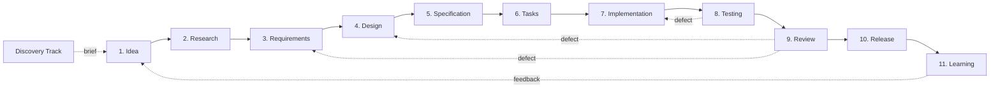

# Specorator — Quality-Driven, Agentic Development Workflow

**Version:** 0.1 · **Status:** Draft · **Purpose:** Foundation for iteration

A solution-agnostic, **spec-driven** workflow for building software with humans and AI agents. Treats specifications as the source of truth and code as their artifact. Covers the full SDLC: Product → UX → UI → Engineering → Testing → Quality → Delivery → Operations.

## Table of contents

1. [Core principles](#1-core-principles)
2. [Workflow overview](#2-workflow-overview)
3. [Stages, artifacts, and quality gates](#3-stages-artifacts-and-quality-gates)
4. [Agent model](#4-agent-model)
5. [Orchestration](#5-orchestration)
6. [Quality framework](#6-quality-framework)
7. [Traceability](#7-traceability)
8. [Iteration model](#8-iteration-model)
9. [Usage guidelines](#9-usage-guidelines)
10. [Future extensions](#10-future-extensions)

---

## 1. Core principles

See [`memory/constitution.md`](../memory/constitution.md) for the full version. In brief:

1. **Spec-driven** — code derives from specs.
2. **Separation of concerns** — each stage has one purpose.
3. **Incremental** — small, verifiable steps.
4. **Quality gates** — every stage exits through one.
5. **Traceability** — every artifact links to its inputs.
6. **Agent specialisation** — narrow scope per role.
7. **Human oversight** — humans own intent, priorities, acceptance.
8. **Plain language** — written for humans first.
9. **Reversibility** — irreversible actions need explicit authorisation.
10. **Iteration** — feedback loops, not waterfall.

---

## 2. Workflow overview



**Optional gates** (run between any two stages when needed):

- **`/spec:clarify`** — interrogates the active artifact for under-specification. Run before declaring a stage done.
- **`/spec:analyze`** — cross-artifact consistency and coverage check. Catches drift between requirements, design, spec, and tasks.

**Optional pre-stage** (run *before* Stage 1 when no brief exists yet):

- **Discovery Track** — a 5-phase ideation + design-sprint mini-workflow (Frame → Diverge → Converge → Prototype → Validate → Handoff) for teams arriving with a blank page rather than a brief. Produces `chosen-brief.md` which seeds Stage 1. Defined in [`docs/discovery-track.md`](discovery-track.md); rationale in [ADR-0005](adr/0005-add-discovery-track-before-stage-1.md). **Skip when a brief already exists.**

---

## 3. Stages, artifacts, and quality gates

Each stage **consumes inputs**, **produces a defined artifact**, **is owned by one agent role**, and **must pass a quality gate** before the next stage starts.

| # | Stage | Owner | Output (in `specs/<feature>/`) | Template |
|---|---|---|---|---|
| 1 | Idea | Analyst | `idea.md` | [`templates/idea-template.md`](../templates/idea-template.md) |
| 2 | Research | Analyst | `research.md` | [`templates/research-template.md`](../templates/research-template.md) |
| 3 | Requirements | PM | `requirements.md` (PRD) | [`templates/prd-template.md`](../templates/prd-template.md) |
| 4 | Design | UX + UI + Architect | `design.md` (+ ADRs) | [`templates/design-template.md`](../templates/design-template.md) |
| 5 | Specification | Architect | `spec.md` | [`templates/spec-template.md`](../templates/spec-template.md) |
| 6 | Tasks | Planner | `tasks.md` | [`templates/tasks-template.md`](../templates/tasks-template.md) |
| 7 | Implementation | Dev | code + `implementation-log.md` | [`templates/implementation-log-template.md`](../templates/implementation-log-template.md) |
| 8 | Testing | QA | `test-plan.md`, `test-report.md` | [`templates/test-plan-template.md`](../templates/test-plan-template.md), [`templates/test-report-template.md`](../templates/test-report-template.md) |
| 9 | Review | Reviewer | `review.md`, `traceability.md` (RTM) | [`templates/review-template.md`](../templates/review-template.md), [`templates/traceability-template.md`](../templates/traceability-template.md) |
| 10 | Release | Release Manager | `release-notes.md` | [`templates/release-notes-template.md`](../templates/release-notes-template.md) |
| 11 | Learning | Retrospective | `retrospective.md` | [`templates/retrospective-template.md`](../templates/retrospective-template.md) |

Quality gates per stage are summarised below; the full Definition of Done lives in [`docs/quality-framework.md`](quality-framework.md).

### 3.1 Idea
- **Goal:** Capture and structure an initial concept.
- **Quality gate:** Problem is understandable. Scope is bounded. Unknowns are listed.

### 3.2 Research
- **Goal:** Understand context, feasibility, and alternatives.
- **Quality gate:** Sources documented. ≥ 2 alternatives explored. Risks named with severity.

### 3.3 Requirements (PRD)
- **Goal:** Define what should be built and why.
- **Quality gate:** All functional requirements use **EARS notation** (see [`docs/ears-notation.md`](ears-notation.md)) and have stable IDs (`REQ-<AREA>-NNN`). Non-goals explicit. Acceptance criteria testable.

### 3.4 Design
- **Goal:** Describe how the system should work conceptually — from user experience down to system architecture.
- **Combined ownership:** UX (flows, IA), UI (visual, interaction), Architect (components, data flow). Three sub-sections in one artifact, or three linked files for larger features.
- **Optional pre-design skills:**
  - **`design-twice`** — explore divergent module shapes when the design has a genuine fork. Produces `design-comparison.md`.
  - **`arc42-baseline`** — for any architecture-significant feature (SaaS, on-premises, embedded, internal tool, library), drive the Arc42 + 12-Factor questionnaire to lock cross-cutting non-functional and operability decisions before Part C. Produces `arc42-questionnaire.md`, files ADRs for accepted key decisions, and feeds `/spec:design` as canonical input. Sections not applicable to the project type are marked `N/A`.
- **Quality gate:** Boundaries clear. Decisions justified. Irreversible architecture choices have ADRs.

### 3.5 Specification
- **Goal:** Define precise, implementation-ready contracts.
- **Quality gate:** Behaviour unambiguous. Edge cases enumerated. Test scenarios derivable.

### 3.6 Tasks
- **Goal:** Break the spec into executable units (~½ day each).
- **Quality gate:** Each task references ≥ 1 requirement ID. Dependencies explicit. TDD ordering: test tasks precede implementation tasks for the same requirement.

### 3.7 Implementation
- **Goal:** Produce working software according to the spec.
- **Quality gate:** Implementation matches spec. No undocumented deviations. Local validation (lint, type, unit tests) passes.

### 3.8 Testing
- **Goal:** Validate behaviour against requirements and spec.
- **Quality gate:** Every EARS clause has ≥ 1 test. Critical paths covered. Failures documented with reproduction.

### 3.9 Review
- **Goal:** Ensure correctness, quality, maintainability.
- **Quality gate:** Requirements satisfied. Risks addressed. No critical findings open. Traceability matrix complete.

### 3.10 Release
- **Goal:** Prepare the feature for delivery.
- **Quality gate:** Changelog written. Rollback plan documented. Observability hooks in place. Known limitations disclosed.

### 3.11 Learning (Retrospective)
- **Goal:** Capture insights for continuous improvement.
- **Quality gate:** What worked / what didn't / actions, each with an owner. Spec-adherence and drift assessed. Mandatory — runs even on clean ships.

---

## 4. Agent model

Each stage is owned by a dedicated agent defined in [`.claude/agents/`](../.claude/agents/). Agents have **narrow tool lists** by design — a QA agent shouldn't have `Edit` on production code; a Dev agent shouldn't be running deletes.

| Stage / role | Agent | Defined at |
|---|---|---|
| 1 — Idea, 2 — Research | `analyst` | `.claude/agents/analyst.md` |
| 3 — Requirements | `pm` | `.claude/agents/pm.md` |
| 4 — Design (UX) | `ux-designer` | `.claude/agents/ux-designer.md` |
| 4 — Design (UI) | `ui-designer` | `.claude/agents/ui-designer.md` |
| 4 — Design (architecture), 5 — Specification | `architect` | `.claude/agents/architect.md` |
| 6 — Tasks | `planner` | `.claude/agents/planner.md` |
| 7 — Implementation | `dev` | `.claude/agents/dev.md` |
| 8 — Testing | `qa` | `.claude/agents/qa.md` |
| 9 — Review | `reviewer` | `.claude/agents/reviewer.md` |
| 10 — Release | `release-manager` | `.claude/agents/release-manager.md` |
| 11 — Learning | `retrospective` | `.claude/agents/retrospective.md` |
| Cross-cutting role (post-release ops, incident response, day-2) | `sre` | `.claude/agents/sre.md` |
| Cross-cutting role (stage routing & hand-off) | `orchestrator` | `.claude/agents/orchestrator.md` |

### Agent rules

- Operate only within the defined scope.
- Use only provided inputs; do not silently invent missing requirements.
- Escalate ambiguity (open a `clarifications` block in the active artifact, or ask the human).
- Update `workflow-state.md` on hand-off.

---

## 5. Orchestration

### 5.1 Workflow state file

Every feature has a `specs/<feature>/workflow-state.md`:

```yaml
feature: payments-redesign
area: PAY                              # used in IDs (REQ-PAY-NNN, T-PAY-NNN, …)
current_stage: design                  # idea | research | requirements | design | specification | tasks | implementation | testing | review | release | learning
status: active                         # active | blocked | paused | done
last_updated: 2026-04-26
last_agent: ux-designer
artifacts:                             # status enum: pending | in-progress | complete | skipped | blocked
  idea.md: complete
  research.md: complete
  requirements.md: complete
  design.md: in-progress
  spec.md: pending
  tasks.md: pending
  implementation-log.md: pending
  test-plan.md: pending
  test-report.md: pending
  review.md: pending
  traceability.md: pending
  release-notes.md: pending
  retrospective.md: pending
```

Plus the body sections (Skips, Blocks, Hand-off notes, Open clarifications) per the canonical template at [`templates/workflow-state-template.md`](../templates/workflow-state-template.md).

### 5.2 Orchestrator responsibilities

The `orchestrator` agent (or a human) reads `workflow-state.md` and:

1. Determines the next stage.
2. Validates that upstream inputs exist and passed their gates.
3. Triggers the correct agent (via slash command).
4. Validates the output against the gate.
5. Updates state and signals the next agent or the human.

### 5.3 Slash command map

| Command | Stage / purpose |
|---|---|
| `/spec:start <slug>` | Scaffold a new feature folder |
| `/spec:idea` | Stage 1 |
| `/spec:research` | Stage 2 |
| `/spec:requirements` | Stage 3 |
| `/spec:design` | Stage 4 |
| `/spec:specify` | Stage 5 |
| `/spec:tasks` | Stage 6 |
| `/spec:implement [task-id]` | Stage 7 |
| `/spec:test` | Stage 8 |
| `/spec:review` | Stage 9 |
| `/spec:release` | Stage 10 |
| `/spec:retro` | Stage 11 |
| `/spec:clarify` | Optional gate — interrogate active artifact |
| `/spec:analyze` | Optional gate — cross-artifact consistency check |
| `/adr:new "<title>"` | File a new architecture decision |

---

## 6. Quality framework

See [`docs/quality-framework.md`](quality-framework.md) for the full framework. Six dimensions:

- **Correctness** — does it do what the spec says?
- **Completeness** — are all required inputs present?
- **Consistency** — do artifacts agree with each other?
- **Testability** — can each requirement be verified?
- **Maintainability** — can a new agent or human pick this up cold?
- **Traceability** — does every output link back to its inputs?

**Validation philosophy:** validate early, validate continuously, prefer explicit checks over assumptions.

---

## 7. Traceability

Every artifact uses stable IDs (in document-level frontmatter and as marked-up REQ/SPEC/T headings + `Satisfies:` fields in body), so the traceability matrix is mechanically generable. See [`docs/traceability.md`](traceability.md).

```
REQ-AUTH-001 → SPEC-AUTH-001 → T-AUTH-014 → src/auth/reset.ts:42 → TEST-AUTH-007
```

The RTM lives at `specs/<feature>/traceability.md` and must be complete before `/spec:review` exits.

---

## 8. Iteration model

The workflow is iterative, not waterfall:

- Feedback loops exist between **all** stages.
- Earlier stages can be revisited at any time.
- Changes must propagate forward consistently — never patch downstream artifacts to mask upstream defects.
- The retrospective informs amendments to this kit (templates, agents, the constitution itself).

---

## 9. Usage guidelines

- **Start simple.** Use the smallest set of stages that fits your work. Trivial bug fix? Skip Idea/Research and document the skip in `workflow-state.md`.
- **Adapt templates.** Copy and tailor to your domain; don't fight the template if it doesn't fit.
- **Enforce gates strictly** once a feature is non-trivial.
- **Keep artifacts concise but precise.** Walls of text hide defects.
- **Prefer clarity over completeness** in early iterations.

---

## 10. Future extensions

- Domain-specific template variants (mobile, ML, infra)
- Automated artifact validation and an RTM generator — see the v0.2 plans in [`README.md`](../README.md) (Versioning section)
- Layered template overrides (`templates/overrides/`)
- Metrics and maturity model
- CI quality gates
- Worked end-to-end examples in [`examples/`](../examples/)

---

## Appendix — Discovery Track (pre-Stage 1)

The 11-stage workflow above assumes a brief exists. When it doesn't, the **Discovery Track** runs first — a 5-phase, multi-specialist sprint (Frame → Diverge → Converge → Prototype → Validate → Handoff) modelled on the Google Design Sprint, Double Diamond, MDA, JTBD, and Riskiest Assumption Test. It produces `chosen-brief.md` which becomes the input to Stage 1.

| # | Phase | Owner | Consulted | Slash command | Artifact |
|---|---|---|---|---|---|
| — | Bootstrap | — | — | `/discovery:start <slug>` | `discovery-state.md` |
| 1 | Frame | facilitator | product-strategist, user-researcher | `/discovery:frame` | `frame.md` |
| 2 | Diverge | facilitator | divergent-thinker, game-designer | `/discovery:diverge` | `divergence.md` |
| 3 | Converge | facilitator | critic, product-strategist | `/discovery:converge` | `convergence.md` |
| 4 | Prototype | facilitator | prototyper, game-designer | `/discovery:prototype` | `prototype.md` |
| 5 | Validate | facilitator | user-researcher, critic | `/discovery:validate` | `validation.md` |
| H | Handoff | facilitator | product-strategist | `/discovery:handoff` | `chosen-brief.md` (0..N) |

Sprint outcomes: `go` → ≥ 1 chosen brief → `/spec:start` + `/spec:idea`. `no-go` → sprint successfully killed bad candidates; close. `pivot` → re-frame and re-run.

Conversational entry: the [`discovery-sprint`](../.claude/skills/discovery-sprint/SKILL.md) skill (parallel to `orchestrate`). Full methodology and method library in [`docs/discovery-track.md`](discovery-track.md). Rationale in [ADR-0005](adr/0005-add-discovery-track-before-stage-1.md).
