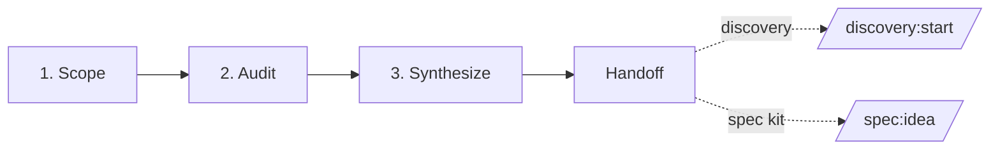

# Stock-taking Track — Legacy System Inventory

**Version:** 0.1 · **Status:** Draft · **Stability:** Opt-in · **ADR:** [ADR-0007](adr/0007-add-stock-taking-track-for-legacy-projects.md)

A pre-workflow track for teams building on top of, alongside, or as a replacement for existing systems. Produces a structured inventory of what already exists that feeds either the Discovery Track or Stage 1 of the Spec Kit.

> If you are starting from scratch with no existing system to understand, **skip this track** and go straight to `/discovery:start` (blank page) or `/spec:start` + `/spec:idea` (clear brief).

## Table of contents

1. [Why a Stock-taking Track](#1-why-a-stock-taking-track)
2. [Where it lives](#2-where-it-lives)
3. [The three phases](#3-the-three-phases)
4. [The legacy-auditor agent](#4-the-legacy-auditor-agent)
5. [Method library](#5-method-library)
6. [Quality gates](#6-quality-gates)
7. [Handoff to downstream tracks](#7-handoff-to-downstream-tracks)
8. [Sources and further reading](#8-sources-and-further-reading)

---

## 1. Why a Stock-taking Track

The Spec Kit's eleven stages assume a brief exists and the team understands enough of the problem context to write requirements. The Discovery Track assumes you need to *find* the right thing to build. Neither addresses a common third situation: **you need to build something new, but an existing system defines the landscape you must navigate**.

The Stock-taking Track applies when:

- A new product or feature must **replace** or **extend** an existing system and you don't have a complete picture of what the existing system does.
- Multiple **legacy processes** exist and their full use-case set has never been documented (or the documentation is stale).
- **Integration constraints** from existing systems will bound the solution space, but those constraints are not yet catalogued.
- A **data migration** will be required and the existing data model and quality are unknown.
- The team is inheriting a system and **tribal knowledge** is the primary documentation.
- Stakeholders disagree about what the existing system *actually does* — the inventory is the shared ground truth.

It does **not** apply when:

- You are building from scratch with no existing system to assess — go to `/discovery:start`.
- You already have a documented, well-understood baseline and a clear brief — go to `/spec:start` + `/spec:idea`.
- The scope is a minor enhancement with no integration risk — `/spec:idea` + Stage 2 research is sufficient.

The track is opinionated about three things:

1. **Inventory before intent.** Understanding what exists precedes deciding what to build. Running a Discovery Sprint before a stock-taking engagement on a legacy system produces briefs that are ignorant of constraints — a form of waste. ([Feathers — *Working Effectively with Legacy Code*](https://www.oreilly.com/library/view/working-effectively-with/0131177052/))
2. **Processes, not just code.** A system is more than its software. It includes manual processes, workarounds, undocumented integrations, and organisational habits. An inventory that ignores the human layer is incomplete. ([Brandolini — *Introducing EventStorming*](https://www.eventstorming.com/book/))
3. **Findings, not requirements.** The stock-taking specialist discovers and documents; it does not prescribe. Turning a finding ("users manually reconcile two spreadsheets every Monday") into a requirement ("WHEN a week ends the system SHALL auto-reconcile data") is the job of the PM in Stage 3, not the auditor.

---

## 2. Where it lives

Each engagement is a directory under `stock-taking/<project-slug>/` at the repo root. This is **parallel** to `discovery/` (ideation sprints) and `specs/` (feature folders).

```
stock-taking/
└── <project-slug>/
    ├── stock-taking-state.md        # engagement state machine
    ├── scope.md                     # Phase 1 — system boundaries, stakeholders, audit plan
    ├── audit.md                     # Phase 2 — processes, use-cases, integrations, data, debt
    ├── synthesis.md                 # Phase 3 — gap analysis, constraints, opportunities
    └── stock-taking-inventory.md    # handoff — consolidated inventory (input to Discovery or /spec:idea)
```

A stock-taking engagement is **project-level**, not feature-level. One engagement may produce inventory that fans out into multiple Discovery Sprints or multiple feature folders. The slug names the *system or system cluster* being inventoried, not the feature being built: `crm-legacy-audit`, `billing-platform-baseline`, not `new-invoice-feature`.

---

## 3. The three phases



### 3.1 Scope *(Define what is being inventoried)*

**Goal:** establish clear boundaries so the audit phase is focused and tractable.

- Owner: `legacy-auditor`
- Output: `scope.md`
- Activities:
  - Name the system(s) in scope and their primary purpose.
  - Identify stakeholder roles (system owners, power users, downstream consumers, integration partners).
  - Map the audit boundary: what processes, modules, integrations, and data domains are included; what is explicitly excluded and why.
  - Record what source material is available (existing docs, code repos, database schemas, architecture diagrams, runbooks, tribal-knowledge contacts).
  - Name what is unknown going into the audit and how it will be resolved (interview, code reading, observation).
- Quality gate: system(s) named; boundary explicit; stakeholders identified; source-material inventory complete; audit plan drafted.

### 3.2 Audit *(Investigate in depth)*

**Goal:** produce a faithful, detailed record of what the existing system actually does.

- Owner: `legacy-auditor`
- Output: `audit.md`
- Activities (sections of `audit.md`, all scoped to the boundaries set in `scope.md`):
  - **Process map** — swim-lane descriptions of primary workflows, including happy paths and known exception paths.
  - **Use-case catalog** — actors, goals, basic flows, alternate flows, exception flows; volume and frequency notes.
  - **Integration map** — external systems, inbound/outbound data flows, protocols, SLAs, coupling points.
  - **Data landscape** — key entities, ownership, quality assessment, known dirty/missing data areas, volume estimates.
  - **Pain points** — user-reported frustrations, known bugs, manual workarounds, recurring incidents.
  - **Technical debt register** — fragile components, missing tests, outdated dependencies, architectural violations; classified by the Technical Debt Quadrant (deliberate/inadvertent × reckless/prudent). ([Fowler — Technical Debt Quadrant](https://martinfowler.com/bliki/TechnicalDebtQuadrant.html))
- Quality gate: all sections present; each process in scope has at least one process-map entry; each stakeholder role has at least one associated use-case; integration map covers all boundary-crossing data flows named in `scope.md`; data landscape entry exists for every primary entity; known pain points evidenced by at least one source; debt register items tagged by quadrant.

### 3.3 Synthesize *(Distil findings into actionable inventory)*

**Goal:** turn the raw audit into a structured inventory that downstream tracks can act from.

- Owner: `legacy-auditor`
- Output: `synthesis.md`
- Activities:
  - **Gap analysis** — what is undocumented, misunderstood, or broken in the existing system that must be resolved or carried forward consciously.
  - **Hard constraints** — integration contracts, regulatory requirements, data residency rules, and SLAs that the new system must honour.
  - **Soft constraints** — organisational habits, user mental models, and operational processes that any new solution must respect or explicitly migrate.
  - **Candidate opportunities** — patterns of pain or workaround that point to high-value improvement areas. Recorded as candidate inputs to the Discovery Track, **not** as requirements.
  - **Migration considerations** — data migration complexity, cutover risk, feature parity checkpoints.
  - **What to keep** vs. **what to replace** — a first-pass Strangler Fig map. ([Fowler — StranglerFigApplication](https://martinfowler.com/bliki/StranglerFigApplication.html))
- Quality gate: every major finding in `audit.md` is addressed (either as constraint, opportunity, or out-of-scope with reason); candidate opportunities are phrased as observations not requirements; recommended-next field is populated; no solution proposals appear (findings only).

### 3.4 Handoff *(Produce consolidated inventory and route downstream)*

**Goal:** produce `stock-taking-inventory.md` and recommend the next step.

- Owner: `legacy-auditor`
- Output: `stock-taking-inventory.md`
- The inventory consolidates key findings from all three phases into a single readable artifact.
- The `recommended_next` field declares one of:
  - `discovery` — team does not yet know what to build; proceed to `/discovery:start`.
  - `spec` — team has a brief and can proceed directly to `/spec:start` + `/spec:idea`.
  - `both` — different parts of the system scope feed into a Discovery Sprint while other parts have clear briefs; document the split.
- Update `stock-taking-state.md` `status: complete`.
- Recommend the downstream command(s) to the user.

---

## 4. The legacy-auditor agent

One specialist agent: [`legacy-auditor`](../.claude/agents/legacy-auditor.md). It shadows the human role of a **Business/Systems Analyst** or **Enterprise Architect** engaged in a legacy assessment.

| Agent | Shadows | Tool surface | Primary methods |
|---|---|---|---|
| [`legacy-auditor`](../.claude/agents/legacy-auditor.md) | Business/Systems Analyst, Enterprise Architect | Read, Edit, Write, WebSearch, WebFetch | Process mapping, use-case cataloging, Event Storming (text-form), BPMN-lite, integration mapping, technical debt quadrant, Strangler Fig mapping |

Unlike the Discovery Track (which uses a facilitator + multiple specialists in each phase), the stock-taking track concentrates expertise in a single agent. The audit domain is coherent — it is one expert's job, not a multi-discipline sprint. The `legacy-auditor` runs all three phases sequentially, writing each artifact before starting the next.

**Boundaries the agent enforces:**

- Does not write requirements, user stories, or acceptance criteria — these belong to the PM in Stage 3.
- Does not propose architecture decisions or solution designs — these belong to Stage 4.
- Does not invent findings — if evidence is absent, it records `unknown` and names the information-gathering step needed to resolve it.
- Does not write to `specs/<feature>/` or `discovery/<sprint>/`.

---

## 5. Method library

A short reference. The `legacy-auditor` reads this section to decide *which* technique to apply at *which* phase.

### Scoping (Phase 1)

- **Context diagram** (text-form C4 Level 1) — name the system, its users, and adjacent systems. The fastest way to make the scope conversation concrete. ([C4 model — Simon Brown](https://c4model.com/))
- **Stakeholder mapping** — power/interest grid: who decides, who uses, who is affected, who maintains. Drives interview priority.
- **Source material audit** — list all available inputs (code, docs, tickets, runbooks, org charts, schema dumps); rate each for reliability (authoritative / stale / contradictory / hearsay).
- **Known-unknowns log** — explicitly list what you don't know going in. This is the audit's research agenda.

### Auditing (Phase 2)

- **Event Storming (text-form)** — walk the timeline of a process by listing domain events in sequence. Surfaces implicit process knowledge faster than interviews alone. ([Brandolini — EventStorming](https://www.eventstorming.com/book/))
- **Swim-lane process map (BPMN-lite)** — for each primary process, show actors as swim lanes and steps as boxes. Mark decision points, integrations, and manual steps explicitly. ([OMG BPMN 2.0](https://www.bpmn.org/))
- **Use-case 2.0 slicing** — for each actor and goal, capture basic flow + 2–3 alternate/exception flows. Note volume and frequency. ([Jacobson et al. — Use-Case 2.0](https://www.ivarjacobson.com/publications/white-papers/use-case-ebook))
- **Integration map** — draw a table (source system → destination system → data flowing → protocol → frequency → owner → SLA). Highlight coupling tightness (tight = sync/blocking; loose = async/eventual).
- **Data entity roster** — list primary entities, their owner (system or team), approximate volume, and any known quality issues (nulls, duplicates, stale data, no PK).
- **Pain-point interview** — structured user interview: "Walk me through a typical [process]. Where do you get stuck? What do you do instead? What would you never want to lose?"
- **Technical Debt Quadrant** — classify each debt item as one of: Reckless-Deliberate ("we don't have time for design"), Prudent-Deliberate ("we'll deal with it later"), Reckless-Inadvertent ("what's layering?"), Prudent-Inadvertent ("now we know better"). Drives remediation priority. ([Fowler — Technical Debt Quadrant](https://martinfowler.com/bliki/TechnicalDebtQuadrant.html))

### Synthesis (Phase 3)

- **Gap analysis table** — for each process / use-case / integration, mark: documented (Y/N), understood by team (Y/N), handled by new system (TBD). Gaps are `N + TBD`.
- **Strangler Fig mapping** — categorise each system component as: Retain (keep as-is), Wrap (keep but add adapter layer), Replace (rewrite), Retire (decommission). ([Fowler — StranglerFigApplication](https://martinfowler.com/bliki/StranglerFigApplication.html))
- **Migration complexity matrix** — for each data domain: row count estimate, cleanliness score (1–5), transformation complexity (low / medium / high), migration risk (green / amber / red).
- **Constraint catalogue** — for each hard constraint, record: what it requires, its source (regulation / contract / SLA / technical), and its immutability (fixed / negotiable / time-bound).
- **Opportunity framing** — for each pain point or gap, write one sentence starting "Users currently struggle with X because of Y — this suggests an opportunity to…". Stop there. Do not design a solution.

---

## 6. Quality gates

Each phase exits through a gate identical in spirit to those defined in [`docs/quality-framework.md`](quality-framework.md). The gate lives at the bottom of each phase template (`templates/stock-taking-*-template.md`).

An engagement ends with one of two terminal states:

- **Inventory complete** — all three phases done; `stock-taking-inventory.md` produced; `recommended_next` field set. Proceed downstream.
- **Inventory incomplete** — one or more audit sections contain `unknown` items that block downstream work. Document the blockers in `stock-taking-state.md`; surface to the human to resolve (e.g. schedule stakeholder interviews, gain access to source systems).

An incomplete inventory is not a failure — it is honest about what is not yet known. The team may proceed downstream with an explicit list of open questions, treating them as research agenda items for Stage 2 (Research) or as constraints to be investigated in the Discovery Track's Frame phase.

---

## 7. Handoff to downstream tracks

`stock-taking-inventory.md` is the canonical handoff artifact. Its frontmatter:

```yaml
---
id: INV-<AREA>-NNN
title: <System name> — Stock-taking Inventory
project: <project-slug>
status: complete           # in-progress | complete | incomplete (open items remain)
recommended_next: discovery | spec | both
created: YYYY-MM-DD
inputs:
  - stock-taking/<project-slug>/scope.md
  - stock-taking/<project-slug>/audit.md
  - stock-taking/<project-slug>/synthesis.md
---
```

**If `recommended_next: discovery`:**
- Recommend `/discovery:start <sprint-slug>`.
- The Discovery Track's Frame phase should reference `stock-taking-inventory.md` in its `inputs:` frontmatter and use the constraint catalogue and opportunity framing directly.

**If `recommended_next: spec`:**
- Recommend `/spec:start <feature-slug> [<AREA>]` followed by `/spec:idea`.
- The analyst reads `stock-taking-inventory.md` as a mandatory input alongside the brief.
- Stage 2 (Research) uses the inventory's open questions as part of its research agenda.

**If `recommended_next: both`:**
- Document which parts of the scope feed into Discovery and which have clear-enough briefs for the Spec Kit.
- Emit one recommendation per path.

---

## 8. Sources and further reading

### Books

- Feathers, M. *Working Effectively with Legacy Code.* Prentice Hall, 2004. [oreilly.com](https://www.oreilly.com/library/view/working-effectively-with/0131177052/)
- Brandolini, A. *Introducing EventStorming.* Leanpub, 2021. [eventstorming.com/book](https://www.eventstorming.com/book/)
- Evans, E. *Domain-Driven Design: Tackling Complexity in the Heart of Software.* Addison-Wesley, 2003. [domainlanguage.com/ddd](https://www.domainlanguage.com/ddd/)
- Richardson, C. *Microservices Patterns.* Manning, 2018. [microservices.io](https://microservices.io/)
- Jacobson, I., Spence, I., Bittner, K. *Use-Case 2.0.* Ivar Jacobson International, 2011. [ivarjacobson.com](https://www.ivarjacobson.com/publications/white-papers/use-case-ebook)

### Foundational articles

- Fowler, M. *StranglerFigApplication.* 2004. [martinfowler.com/bliki/StranglerFigApplication.html](https://martinfowler.com/bliki/StranglerFigApplication.html)
- Fowler, M. *TechnicalDebtQuadrant.* 2009. [martinfowler.com/bliki/TechnicalDebtQuadrant.html](https://martinfowler.com/bliki/TechnicalDebtQuadrant.html)
- Cunningham, W. *Ward Explains Debt Metaphor.* 1992. [wiki.c2.com/?WardExplainsDebtMetaphor](http://wiki.c2.com/?WardExplainsDebtMetaphor)

### Frameworks and tools

- Object Management Group. *BPMN 2.0 Specification.* [bpmn.org](https://www.bpmn.org/)
- Brown, S. *The C4 Model for Software Architecture.* [c4model.com](https://c4model.com/)
- Adzic, G. *Impact Mapping.* [impactmapping.org](https://www.impactmapping.org/)
- Vernon, V. *Strategic Domain-Driven Design* (Context Mapping). [dddcommunity.org](https://dddcommunity.org/)
