# Tutorial — drive your first feature end-to-end

> **Status:** Draft — pending live validation. Every step below is derived from the workflow definition in [`docs/specorator.md`](../specorator.md). It has not yet been re-run from a clean clone of `main` against the live `/spec:*` commands; once it has, the *Status* line will change to *"Validated YYYY-MM-DD on commit `<sha>`"* and any drift between expected and actual output will be patched.

## What you will do

You will drive **one tiny feature** — adding a single term to the plain-English glossary in the top-level `README.md` — through every stage of the Specorator workflow. By the end you will have:

- An `specs/glossary-term/` directory with one artifact per stage.
- A new entry in the glossary table in `README.md`.
- A real retrospective documenting what you learned.

The feature is deliberately small. The point is not the change; the point is *the lifecycle*.

## Who this is for

- You have **never used Specorator** before.
- You have **Claude Code installed** (`claude --version` works) and the repo cloned.
- You are comfortable on the command line and with Git.

## How long it takes

**Plan 60–90 minutes.** Budget two sittings if needed. Each stage is short on its own, but conversational gates and reading what the agents produce takes time.

## Why the whole lifecycle on a tiny feature

Specorator's value proposition is that **every** feature follows the same disciplined sequence of stages. Skipping stages on small work is exactly the habit the workflow is designed to prevent. A tiny subject means the *content* at each stage is small enough to read end-to-end in one sitting — which is what makes this a good tutorial subject.

## Setup

1. Clone or open the repo: `cd <your-clone>`.
2. Cut a scratch branch: `git checkout -b tutorial/first-feature`.
3. Open Claude Code: `claude`.

If you reach the end of the tutorial and want to throw the work away, run `git checkout main && git branch -D tutorial/first-feature && rm -rf specs/glossary-term`.

## The lifecycle

```mermaid
flowchart LR
    s0["Stage 0<br/>Scaffold"]
    s1["Stage 1<br/>Idea"]
    s2["Stage 2<br/>Research"]
    s3["Stage 3<br/>Requirements"]
    s4["Stage 4<br/>Design"]
    s5["Stage 5<br/>Specify"]
    s6["Stage 6<br/>Tasks"]
    s7["Stage 7<br/>Implement"]
    s8["Stage 8<br/>Test"]
    s9["Stage 9<br/>Review"]
    s10["Stage 10<br/>Release"]
    s11["Stage 11<br/>Retro"]

    s0 --> s1 --> s2 --> s3 --> s4 --> s5 --> s6 --> s7 --> s8 --> s9 --> s10 --> s11
```



Each stage has a slash command, produces one Markdown artifact, and updates `specs/glossary-term/workflow-state.md`.

---

### Stage 0 — Scaffold the feature directory

**Command:** `/spec:start glossary-term`.

**What happens:** Claude Code creates `specs/glossary-term/` with a `workflow-state.md` file initialised to `Active stage: Stage 1 — Idea`.

**If you see this, you are on track:** `ls specs/glossary-term/` shows `workflow-state.md`. Open it — `Active stage` reads `Stage 1 — Idea`. No other artifacts yet.

---

### Stage 1 — Idea (analyst)

**Command:** `/spec:idea`. Or in plain language: *"I want to add a new term to the glossary in `README.md` — specifically the term **Tracer Bullet**."*

**What happens:** the `analyst` agent asks you a few clarifying questions, then writes `specs/glossary-term/idea.md` — the framing of the problem and the success signal.

**If you see this, you are on track:** `idea.md` exists; it has a clear `Problem`, `Goal`, and `Success signal` section. The `Active stage` in `workflow-state.md` has advanced to `Stage 2 — Research`.

---

### Stage 2 — Research (analyst)

**Command:** `/spec:research`.

**What happens:** the analyst surfaces alternatives and prior art — for our subject, the agent compares phrasings of *Tracer Bullet*, looks at the existing glossary entries for tone, and lists risks. The output is `research.md`.

**If you see this, you are on track:** `research.md` lists at least two phrasing alternatives plus a recommendation. `Active stage` is now `Stage 3 — Requirements`.

---

### Stage 3 — Requirements (pm)

**Command:** `/spec:requirements`.

**What happens:** the `pm` agent writes `requirements.md` with **EARS-formatted** functional requirements. For this feature you should expect one or two — e.g. `REQ-DOCS-001. Where the README glossary table is rendered, the system shall include an entry for "Tracer Bullet" with a one-sentence plain-English definition.`

**If you see this, you are on track:** `requirements.md` has at least one `REQ-DOCS-NNN` line; each requirement uses one of the EARS keywords (`Where`, `When`, `If`, `While`, or `shall`). For the EARS reference, see [`docs/ears-notation.md`](../ears-notation.md).

---

### Stage 4 — Design (ux + ui + architect)

**Command:** `/spec:design`.

**What happens:** three agents contribute. For a markdown-only change the design is intentionally thin — UX confirms the glossary table is the right place; UI confirms no visual treatment changes; the architect documents which file gets edited and that no code path is touched. Output: `design.md`.

**Accept the defaults.** This is one of the stages where the agents will offer options; for a tutorial subject this small, the recommended option is correct.

**If you see this, you are on track:** `design.md` exists with three short sections (UX, UI, Architecture) and identifies `README.md` as the only file to edit.

---

### Stage 5 — Specification (architect)

**Command:** `/spec:specify`.

**What happens:** the architect produces `spec.md` — implementation-ready detail. For our feature this means: the exact row to add, the column order matching the existing table, and the placement (alphabetical position).

**If you see this, you are on track:** `spec.md` shows the literal Markdown line that will be added to `README.md`, and the line number or anchor it goes after.

---

### Stage 6 — Tasks (planner)

**Command:** `/spec:tasks`.

**What happens:** the `planner` decomposes the spec into a tasks list with stable IDs (`T-DOCS-NNN`). Output: `tasks.md`. Expect one or two tasks — *"Add Tracer Bullet row to glossary"* and *"Verify alphabetical order preserved"*.

**If you see this, you are on track:** `tasks.md` lists at least one `T-DOCS-NNN` task with a Definition of Done and a link back to the originating `REQ-DOCS-NNN`.

---

### Stage 7 — Implementation (dev)

**Command:** `/spec:implement` (the orchestrator dispatches one task at a time).

**What happens:** the `dev` agent edits `README.md`, makes the glossary change, and appends to `implementation-log.md`. The change is staged but not pushed.

**If you see this, you are on track:** `git diff README.md` shows the new glossary row in alphabetical position; `implementation-log.md` records the task ID, the file changed, and the result.

---

### Stage 8 — Testing (qa)

**Command:** `/spec:test`.

**What happens:** because the subject is markdown-only, the `qa` agent runs a small set of checks — does the glossary still parse as a Markdown table? Does the new row sit in alphabetical order? Are there any broken links? Output: `test-plan.md` and `test-report.md`.

**If you see this, you are on track:** `test-report.md` shows every assertion as `PASS` and traces each back to its `REQ-DOCS-NNN`.

---

### Stage 9 — Review (reviewer)

**Command:** `/spec:review`.

**What happens:** the `reviewer` audits the chain: requirement → spec → task → code → test → finding. It refreshes `traceability.md` so every ID has a downstream link. It writes `review.md` with the verdict.

**If you see this, you are on track:** `review.md` ends with `Verdict: APPROVED` (or, more interestingly, lists findings to address — fix them and re-run); `traceability.md` shows your `REQ-DOCS-NNN` linked to the tests that exercised it.

---

### Stage 10 — Release (release-manager) — *out of tutorial scope*

**You will not run `/spec:release` in this tutorial.**

Why — release is the only stage that performs *irreversible, shared-state* actions (cutting a tag, pushing release notes, announcing). [Article IX of the constitution](../../memory/constitution.md) requires explicit human authorisation per release; that authorisation is not something a tutorial should manufacture.

What it would do, if you did run it: invoke the `release-manager` agent to write `release-notes.md`, verify rollback and observability are in place, and prepare (but not execute) the deploy. See [`how-to/authorize-destructive-release.md`](../how-to/authorize-destructive-release.md) when you are ready.

---

### Stage 11 — Retrospective (retrospective)

**Command:** `/spec:retro`.

**What happens:** the `retrospective` agent walks you through what worked, what didn't, and what to change. The output is `retrospective.md`. The retrospective is **mandatory**, not optional, even on a tutorial — running it once now is the easiest way to internalise that.

**If you see this, you are on track:** `retrospective.md` exists with sections for *What worked*, *What didn't*, and *Actions* — the actions field has at least one item (even *"none — feature shipped clean"* counts).

---

## What to do next

You now have:

- A complete `specs/glossary-term/` directory with one artifact per stage.
- A real change to `README.md`.
- A real retrospective.

Where to go from here:

- **Try a real feature.** [`how-to/resume-paused-feature.md`](../how-to/resume-paused-feature.md) shows how to resume across sessions; the [`orchestrate`](../../.claude/skills/orchestrate/SKILL.md) skill drives the same flow on bigger work.
- **Customize the workflow for your stack.** [`how-to/fork-and-personalize.md`](../how-to/fork-and-personalize.md) and [`how-to/adapt-steering.md`](../how-to/adapt-steering.md).
- **Understand why the workflow looks like this.** [`docs/specorator.md`](../specorator.md) is the canonical definition; the [Explanation](../README.md#explanation) quadrant in the doc hub has the rationale for each track.
- **Learn the small disciplines.** [`how-to/write-ears-requirement.md`](../how-to/write-ears-requirement.md), [`how-to/add-adr.md`](../how-to/add-adr.md), [`how-to/run-verify-gate.md`](../how-to/run-verify-gate.md).

If you want to throw away your scratch branch and start fresh:

```bash
git checkout main
git branch -D tutorial/first-feature
rm -rf specs/glossary-term
```

Welcome to spec-driven development.
