# Tutorial — drive your first feature end-to-end

> **Status:** Desk-validated 2026-04-28 against commit `bbe92492ac`. Every step below was cross-checked against the live `/spec:*` command files in `.claude/commands/spec/`, the agent definitions in `.claude/agents/`, and the artifact templates in `templates/`. **No live run yet** — a 60–90 minute end-to-end re-run from a clean clone is still planned, and any discrepancies it surfaces will be patched in a follow-up. Until then, treat the time budget and conversational specifics as estimates.

## What you will do

You will drive **one tiny feature** — adding the term *Tracer Bullet* to the project glossary at `docs/glossary/` — through every stage of the Specorator workflow. By the end you will have:

- A `specs/glossary-term/` directory with one artifact per stage.
- A new file at `docs/glossary/tracer-bullet.md`, scaffolded from `templates/glossary-entry-template.md`.
- A real retrospective documenting what you learned.

The feature is deliberately small. The point is not the change; the point is *the lifecycle*.

> **Why this subject?** The repo's glossary is sharded one-file-per-term per [ADR-0010](../adr/0010-shard-glossary-into-one-file-per-term.md), so adding a term is a markdown-only change with no language-stack assumption. It works the same on Windows, macOS, and Linux. *In real day-to-day work* you would normally run `/glossary:new "Tracer Bullet"` directly — the lifecycle would be overkill. The tutorial uses the lifecycle deliberately so you experience every stage on a small surface.

## Who this is for

- You have **never used Specorator** before.
- You have **Claude Code installed** (`claude --version` works) and the repo cloned.
- You are comfortable on the command line and with Git.

## How long it takes

**Plan 60–90 minutes.** Budget two sittings if needed. Each stage is short on its own, but conversational gates and reading what the agents produce takes time.

## Why the whole lifecycle on a tiny feature

Specorator's value proposition is that **every** feature follows the same disciplined sequence of stages. Skipping stages on small work is exactly the habit the workflow is designed to prevent. A tiny subject means the *content* at each stage is small enough to read end-to-end in one sitting — which is what makes this a good tutorial subject.

## Setup

1. Clone or open the repo: `cd <your-clone>`.
2. Cut a scratch branch: `git checkout -b tutorial/first-feature`.
3. Open Claude Code: `claude`.

If you reach the end of the tutorial and want to throw the work away, see the cleanup snippet at the bottom of this page.

## The lifecycle

```mermaid
flowchart LR
    s0["Stage 0<br/>Scaffold"]
    s1["Stage 1<br/>Idea"]
    s2["Stage 2<br/>Research"]
    s3["Stage 3<br/>Requirements"]
    s4["Stage 4<br/>Design"]
    s5["Stage 5<br/>Specify"]
    s6["Stage 6<br/>Tasks"]
    s7["Stage 7<br/>Implement"]
    s8["Stage 8<br/>Test"]
    s9["Stage 9<br/>Review"]
    s10["Stage 10<br/>Release"]
    s11["Stage 11<br/>Retro"]

    s0 --> s1 --> s2 --> s3 --> s4 --> s5 --> s6 --> s7 --> s8 --> s9 --> s10 --> s11
```



Each stage has a slash command, produces one (or two) Markdown artifacts under `specs/glossary-term/`, and updates `specs/glossary-term/workflow-state.md`. The IDs you will see — `IDEA-DOCS-NNN`, `PRD-DOCS-NNN`, `REQ-DOCS-NNN`, `T-DOCS-NNN`, `TEST-DOCS-NNN` — all use the area code `DOCS`.

---

### Stage 0 — Scaffold the feature directory

**Command:** `/spec:start glossary-term DOCS`.

The first argument is the feature slug; the optional second is the area code that prefixes IDs. If you omit it, `/spec:start` proposes one derived from the slug — confirm `DOCS` when prompted.

**What happens:** Claude Code creates `specs/glossary-term/` and copies `templates/workflow-state-template.md` into it as `workflow-state.md`, filling `feature: glossary-term` and `area: DOCS` in the frontmatter.

**If you see this, you are on track:** `ls specs/glossary-term/` shows exactly one file — `workflow-state.md`. Open it. Frontmatter has `current_stage: idea`, `status: active`, and an `artifacts:` map listing every future artifact as `pending`. Below the frontmatter is a `## Stage progress` table showing each stage with its expected artifact and status `pending`.

---

### Stage 1 — Idea (analyst)

**Command:** `/spec:idea`. Or in plain language: *"I want to add a glossary entry for **Tracer Bullet**, the term defined by Hunt and Thomas in *The Pragmatic Programmer*."*

**What happens:** the `analyst` agent asks a few clarifying questions about the brief, then writes `specs/glossary-term/idea.md` from `templates/idea-template.md`.

**If you see this, you are on track:** `idea.md` exists with frontmatter `id: IDEA-DOCS-001`, `stage: idea`, `status: draft`. Body has these sections: `## Problem statement`, `## Target users`, `## Desired outcome`, `## Constraints`, `## Open questions`. The Open questions section becomes the research agenda for Stage 2. `workflow-state.md`'s frontmatter has advanced to `current_stage: research` and the Stage 1 row in the progress table is now `complete`.

---

### Stage 2 — Research (analyst)

**Command:** `/spec:research`.

**What happens:** the analyst answers the Open questions from `idea.md`. For our subject, the agent compares phrasings of *Tracer Bullet* (Hunt & Thomas's original definition vs. how the term is used elsewhere in this repo's docs), surveys existing glossary entries for tone, and lists risks (e.g. confusing it with *Spike*).

**If you see this, you are on track:** `research.md` exists with `id: RESEARCH-DOCS-001`. Body has `## Research questions` (a table answering each Open question from idea.md), `## Market / ecosystem`, `## User needs`, and a recommendation. `current_stage: requirements`.

---

### Stage 3 — Requirements (pm)

**Command:** `/spec:requirements`.

**What happens:** the `pm` agent writes a PRD at `requirements.md` from `templates/prd-template.md`. The document's own ID is `PRD-DOCS-001`; functional requirements inside it use **EARS notation** with stable IDs `REQ-DOCS-NNN`. For this feature you should expect one or two requirements — e.g. *"Where the `docs/glossary/` directory is read, the system shall include a `tracer-bullet.md` entry with a one-sentence canonical definition."*

**If you see this, you are on track:** `requirements.md` has frontmatter `id: PRD-DOCS-001`. Body has `## Summary`, `## Goals`, `## Non-goals`, `## Personas / stakeholders`, `## Jobs to be done`, and a `## Functional requirements (EARS)` section listing at least one `REQ-DOCS-NNN` line that uses one of the EARS keywords (`When`, `Where`, `While`, `If`, the optional-feature pattern, or the ubiquitous `the system shall` form). Further sections — `## Non-functional requirements`, `## Success metrics`, `## Release criteria`, `## Open questions / clarifications`, `## Out of scope`, `## Quality gate` — round out the PRD shape. For the EARS reference, see [`docs/ears-notation.md`](../ears-notation.md).

---

### Stage 4 — Design (ux + ui + architect)

**Command:** `/spec:design`. The orchestrator sequences three collaborators on the same `design.md` file: ux-designer (Part A), ui-designer (Part B), architect (Part C).

**What happens:** for a markdown-only change the design is intentionally thin — UX confirms `docs/glossary/<slug>.md` is the right home; UI confirms no visual treatment changes; the architect documents the file path, the template (`templates/glossary-entry-template.md`), and that no code path is touched. The architect closes Part C and the cross-cutting requirements-coverage table.

**Accept the defaults.** For a tutorial subject this small, the recommended option at each gate is correct.

**If you see this, you are on track:** `design.md` exists with frontmatter `id: DESIGN-DOCS-001`, `owner: architect`, and `collaborators: [ux-designer, ui-designer, architect]`. Body shows three short Parts (A — UX, B — UI, C — Architecture) and a final cross-cutting table mapping `REQ-DOCS-NNN` → which Part covers it.

---

### Stage 5 — Specification (architect)

**Command:** `/spec:specify`.

**What happens:** the architect produces `spec.md` — implementation-ready detail. For our feature the spec captures: the exact path (`docs/glossary/tracer-bullet.md`), the source template (`templates/glossary-entry-template.md`), the values for the frontmatter fields (`term`, `slug`, `last-updated`, `related`, `tags`), and the body content for each section the template requires (`## Definition`, `## Why it matters`, `## Examples`, `## Avoid`, `## See also`).

**If you see this, you are on track:** `spec.md` has `id: SPECDOC-DOCS-001`, body section `## Interfaces` with at least one `SPEC-DOCS-NNN` heading describing the file to be created. Each `SPEC-DOCS-NNN` lists pre-conditions, the exact content, and links back to its `REQ-DOCS-NNN`.

---

### Stage 6 — Tasks (planner)

**Command:** `/spec:tasks`.

**What happens:** the `planner` decomposes the spec into a tasks list at `tasks.md` from `templates/tasks-template.md`. Each task carries a `T-DOCS-NNN` ID, an emoji marker (🧪 test, 🔨 implementation, 📐 design/scaffolding, 📚 documentation, 🚀 release/ops), an owner from the closed set `dev | qa | sre | human`, and references at least one `REQ-DOCS-NNN`. **TDD ordering** is enforced — the test task for a requirement comes *before* the implementation task for that requirement.

**If you see this, you are on track:** `tasks.md` lists at least one 🧪 test task (owner=`qa`) followed by one 🔨 implementation task (owner=`dev`). Each row has `Satisfies: REQ-DOCS-NNN`, a `Definition of done:` checkbox list, and an estimate of S or M.

---

### Stage 7 — Implementation (dev / qa)

**Command:** `/spec:implement`. The command picks the next ready task automatically (the first whose dependencies are done), routes by `owner`, and runs one task per invocation. Run it once per task.

**What happens for our feature:**

- **First invocation** picks the 🧪 test task (owner=`qa`) — the qa agent writes the failing test. *(This may be as simple as a script that asserts `docs/glossary/tracer-bullet.md` exists and parses, or a check that the term is linked from a related entry.)*
- **Second invocation** picks the 🔨 implementation task (owner=`dev`) — the dev agent creates `docs/glossary/tracer-bullet.md` from the template, fills it from `spec.md`, and re-runs the test until it passes.

After each invocation, `/spec:implement` proposes a per-task commit with a message of the form `feat(docs): T-DOCS-NNN <short title>` (imperative mood, references the task ID). The commit is local-only and reversible (`git reset --soft HEAD~1` undoes it).

**If you see this, you are on track:** `git log --oneline` shows at least one `feat(docs): T-DOCS-NNN …` commit per task. `implementation-log.md` has structured entries — `### YYYY-MM-DD — T-DOCS-NNN — <title>` with **Files changed**, **Commit**, **Spec reference**, **Outcome**, **Deviation from spec**, **Notes**. The new file `docs/glossary/tracer-bullet.md` exists with the frontmatter and body the spec called for.

---

### Stage 8 — Testing (qa)

**Command:** `/spec:test`.

**What happens:** the qa agent confirms entry criteria (spec accepted, implementation complete), runs the full test suite for the change, and writes both `test-plan.md` and `test-report.md`. Because the subject is markdown-only, the suite is small — `npm run check:links` is the load-bearing one.

**If you see this, you are on track:** `test-report.md` has frontmatter `id: TESTREPORT-DOCS-001`. Body shows a `## Summary` table (Total / Passed / Failed / Skipped / Coverage) followed by a `## Per-requirement results` table — one row per `REQ-DOCS-NNN` with the tests that exercised it and a status of ✅. No `## Failures` rows means the run was clean.

---

### Stage 9 — Review (reviewer)

**Command:** `/spec:review`.

**What happens:** the `reviewer` audits the chain: requirement → spec → task → code → test → finding. It refreshes `traceability.md` so every `REQ-DOCS-NNN`, `SPEC-DOCS-NNN`, `T-DOCS-NNN`, and `TEST-DOCS-NNN` is linked end-to-end. It writes `review.md` with the verdict.

**If you see this, you are on track:** `review.md` has a `## Verdict` section with three checkboxes — *Approved — proceed to release*, *Approved with conditions — see findings*, *Blocked — must address before release*. The first checkbox is ticked. The `## Requirements compliance`, `## Design compliance`, and `## Spec compliance` tables all show your `REQ-DOCS-NNN` as satisfied with evidence rows pointing at the test IDs and the implementation-log entry. `traceability.md` (the RTM) has every cell filled — no empty cells, no orphan tests, no orphan tasks.

---

### Stage 10 — Release (release-manager) — *out of tutorial scope*

**You will not run `/spec:release` in this tutorial.**

Why — release is the only stage that performs *irreversible, shared-state* actions (cutting a tag, pushing release notes, announcing). [Article IX of the constitution](../../memory/constitution.md) requires explicit human authorisation per release; that authorisation is not something a tutorial should manufacture.

What it would do, if you did run it: invoke the `release-manager` agent to write `release-notes.md`, verify rollback and observability are in place, and prepare (but not execute) the deploy. See [`how-to/authorize-destructive-release.md`](../how-to/authorize-destructive-release.md) when you are ready.

---

### Stage 11 — Retrospective (retrospective)

**Command:** `/spec:retro`.

**What happens:** the `retrospective` agent reads every artifact in `specs/glossary-term/` and walks you through the questions. The retrospective is **mandatory**, not optional — even on a tutorial — running it once now is the easiest way to internalise that.

**If you see this, you are on track:** `retrospective.md` has frontmatter `id: RETRO-DOCS-001`, `stage: learning`. Body has the sections from `templates/retrospective-template.md` filled in: `## Outcome`, `## What worked`, `## What didn't work`, `## Spec adherence`, `## Process observations`. The agent also surfaces proposed amendments — to templates, agents, or the constitution — for you to accept or reject. Even a one-line *"none — feature shipped clean"* counts as an answer.

---

## What to do next

You now have:

- A complete `specs/glossary-term/` directory with one artifact per stage.
- A new term file at `docs/glossary/tracer-bullet.md`.
- A real retrospective.

Where to go from here:

- **Try a real feature.** [`how-to/resume-paused-feature.md`](../how-to/resume-paused-feature.md) shows how to resume across sessions; the [`orchestrate`](../../.claude/skills/orchestrate/SKILL.md) skill drives the same flow on bigger work.
- **Customize the workflow for your stack.** [`how-to/fork-and-personalize.md`](../how-to/fork-and-personalize.md) and [`how-to/adapt-steering.md`](../how-to/adapt-steering.md).
- **Understand why the workflow looks like this.** [`docs/specorator.md`](../specorator.md) is the canonical definition; the [Explanation](../README.md#explanation) quadrant in the doc hub has the rationale for each track.
- **Learn the small disciplines.** [`how-to/write-ears-requirement.md`](../how-to/write-ears-requirement.md), [`how-to/add-adr.md`](../how-to/add-adr.md), [`how-to/run-verify-gate.md`](../how-to/run-verify-gate.md).
- **Drop the lifecycle when it's overkill.** A real glossary entry would normally just be `/glossary:new "<term>"` — see [`how-to/skip-discovery.md`](../how-to/skip-discovery.md) for the same pragmatism applied to the Discovery Track.

If you want to throw away your scratch branch and start fresh:

```bash
git checkout main
git branch -D tutorial/first-feature
rm -rf specs/glossary-term docs/glossary/tracer-bullet.md
```

Welcome to spec-driven development.
