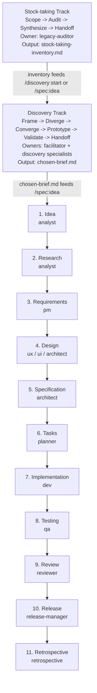

# Workflow Overview — One-Page Cheat Sheet



## At each stage

| Question | Answer lives in |
|---|---|
| What's this stage for? | [`docs/specorator.md` §3](specorator.md#3-stages-artifacts-and-quality-gates) |
| Who owns it? | [`.claude/agents/<role>.md`](../.claude/agents/) |
| What's the input? | The previous stage's artifact in `specs/<feature>/` |
| What's the output? | The matching `templates/<stage>-template.md` |
| When am I done? | The quality gate in [`docs/quality-framework.md`](quality-framework.md) |
| How do I trigger it? | The slash command for the stage — see the **Slash commands** block below for the full list (`/spec:idea`, `/spec:research`, `/spec:requirements`, `/spec:design`, `/spec:specify`, `/spec:tasks`, `/spec:implement`, `/spec:test`, `/spec:review`, `/spec:release`, `/spec:retro`). |

## Quality gates between stages


Optional gates `/spec:clarify` and `/spec:analyze` may be inserted between any two stages.

## State file (`specs/<feature>/workflow-state.md`)

```yaml
feature: <slug>
area: <AREA>                                                       # uppercase short code; used in IDs
current_stage: <stage>
status: active | blocked | paused | done
last_updated: YYYY-MM-DD
last_agent: <role>
artifacts:
  idea.md: pending | in-progress | complete | skipped | blocked    # full enum
  research.md: ...
```

Plus body sections (Skips, Blocks, Hand-off notes, Open clarifications). Canonical shape lives at [`templates/workflow-state-template.md`](../templates/workflow-state-template.md).

## Slash commands

```
# Pre-everything Stock-taking Track (opt-in, for legacy/brownfield projects):
/stock:start <project>      /stock:audit               /stock:handoff
/stock:scope                /stock:synthesize

# Pre-stage Discovery Track (opt-in, when no brief exists yet):
/discovery:start <sprint>   /discovery:converge        /discovery:validate
/discovery:frame            /discovery:prototype       /discovery:handoff
/discovery:diverge

# Lifecycle:
/spec:start <slug>          /spec:tasks                /spec:retro
/spec:idea                  /spec:implement [task-id]  /spec:clarify
/spec:research              /spec:test                 /spec:analyze
/spec:requirements          /spec:review               /adr:new "<title>"
/spec:design                /spec:release
/spec:specify
```

## Per-stage Definition of Done (one-liner each)

| Stage | Done when… |
|---|---|
| Idea | Problem stated, scope bounded, unknowns listed |
| Research | ≥ 2 alternatives explored, sources cited, risks named |
| Requirements | All EARS-formatted, IDs assigned, non-goals explicit |
| Design | Boundaries clear, decisions justified, ADRs filed for irreversibles |
| Specification | Behaviour unambiguous, edge cases enumerated, tests derivable |
| Tasks | ≤ ½ day each, REQ-linked, TDD-ordered |
| Implementation | Spec-matched, lint+types+units green, log updated |
| Testing | Every EARS clause tested, failures reproducible |
| Review | RTM complete, no critical findings, requirements satisfied |
| Release | Changelog + rollback + observability in place |
| Retro | Three buckets (worked / didn't / actions) with owners |
