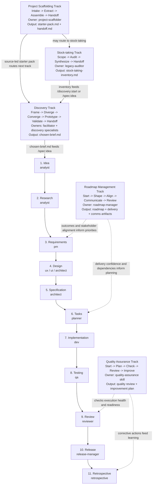

# Workflow Overview — One-Page Cheat Sheet



## At each stage

| Question | Answer lives in |
|---|---|
| What's this stage for? | [`docs/specorator.md` §3](specorator.md#3-stages-artifacts-and-quality-gates) |
| Who owns it? | [`.claude/agents/<role>.md`](../.claude/agents/) |
| What's the input? | The previous stage's artifact in `specs/<feature>/` |
| What's the output? | The matching `templates/<stage>-template.md` |
| When am I done? | The quality gate in [`docs/quality-framework.md`](quality-framework.md) |
| How do I trigger it? | The slash command for the stage — see the **Slash commands** block below for the full list (`/spec:idea`, `/spec:research`, `/spec:requirements`, `/spec:design`, `/spec:specify`, `/spec:tasks`, `/spec:implement`, `/spec:test`, `/spec:review`, `/spec:release`, `/spec:retro`). |

## Quality gates between stages


Optional gates `/spec:clarify` and `/spec:analyze` may be inserted between any two stages.

Use `/scaffold:start <slug> <source>` before the other tracks when a fresh template install should be seeded from existing folders or Markdown files.

Use `/quality:start <slug> [scope]` when a project, portfolio, feature, release, supplier, or internal process needs an ISO 9001-aligned quality assurance review.

Use `/roadmap:start <slug>` when product direction, project delivery confidence, stakeholder expectations, and team communication need a shared roadmap artifact.

## State file (`specs/<feature>/workflow-state.md`)

```yaml
feature: <slug>
area: <AREA>                                                       # uppercase short code; used in IDs
current_stage: <stage>
status: active | blocked | paused | done
last_updated: YYYY-MM-DD
last_agent: <role>
artifacts:
  idea.md: pending | in-progress | complete | skipped | blocked    # full enum
  research.md: ...
```

Plus body sections (Skips, Blocks, Hand-off notes, Open clarifications). Canonical shape lives at [`templates/workflow-state-template.md`](../templates/workflow-state-template.md).

## Slash commands

<!-- BEGIN GENERATED: slash-commands -->
```
# Decisions:
/adr:new

# Discovery Track:
/discovery:converge   /discovery:diverge    /discovery:frame
/discovery:handoff    /discovery:prototype  /discovery:start
/discovery:validate

# glossary:
/glossary:new

# Portfolio Track:
/portfolio:start  /portfolio:x      /portfolio:y
/portfolio:z

# Product:
/product:page

# Project Manager Track:
/project:change    /project:close     /project:initiate
/project:post      /project:report    /project:start
/project:weekly

# Quality Assurance Track:
/quality:check    /quality:improve  /quality:plan
/quality:review   /quality:start    /quality:status

# roadmap:
/roadmap:align        /roadmap:communicate  /roadmap:review
/roadmap:shape        /roadmap:start

# Sales Cycle Track:
/sales:estimate  /sales:order     /sales:propose
/sales:qualify   /sales:scope     /sales:start

# Project Scaffolding Track:
/scaffold:assemble  /scaffold:extract   /scaffold:handoff
/scaffold:intake    /scaffold:start

# Lifecycle:
/spec:analyze       /spec:clarify       /spec:design
/spec:idea          /spec:implement     /spec:release
/spec:requirements  /spec:research      /spec:retro
/spec:review        /spec:specify       /spec:start
/spec:tasks         /spec:test

# Specorator Improvements:
/specorator:add-script    /specorator:add-tooling   /specorator:add-workflow
/specorator:update

# Stock-taking Track:
/stock-taking:audit       /stock-taking:handoff     /stock-taking:scope
/stock-taking:start       /stock-taking:synthesize

# token-review.md:
/token-review.md:token-review
```
<!-- END GENERATED: slash-commands -->

## Per-stage Definition of Done (one-liner each)

| Stage | Done when… |
|---|---|
| Idea | Problem stated, scope bounded, unknowns listed |
| Research | ≥ 2 alternatives explored, sources cited, risks named |
| Requirements | All EARS-formatted, IDs assigned, non-goals explicit |
| Design | Boundaries clear, decisions justified, ADRs filed for irreversibles |
| Specification | Behaviour unambiguous, edge cases enumerated, tests derivable |
| Tasks | ≤ ½ day each, REQ-linked, TDD-ordered |
| Implementation | Spec-matched, lint+types+units green, log updated |
| Testing | Every EARS clause tested, failures reproducible |
| Review | RTM complete, no critical findings, requirements satisfied |
| Release | Changelog + rollback + observability in place |
| Retro | Three buckets (worked / didn't / actions) with owners |
