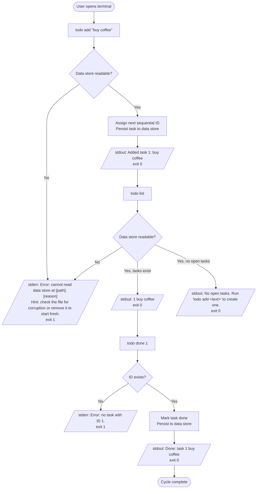
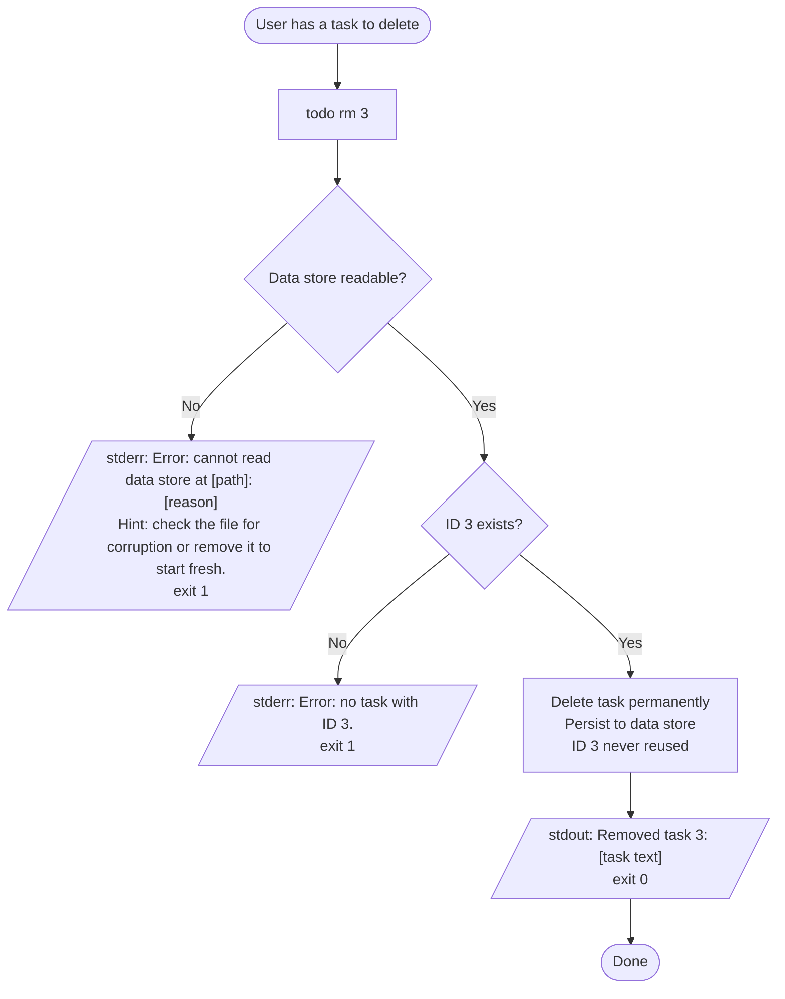
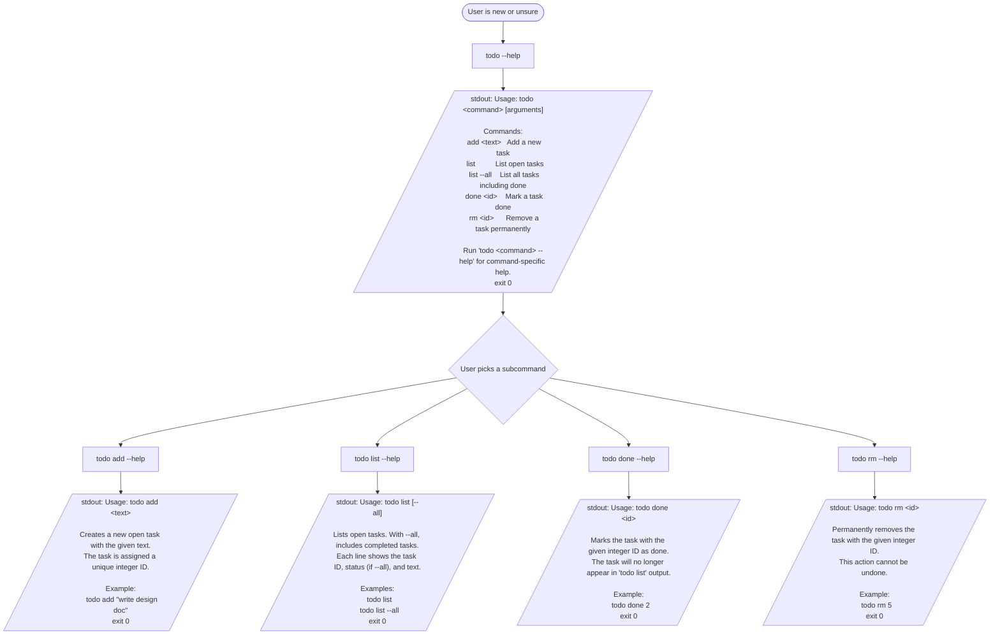
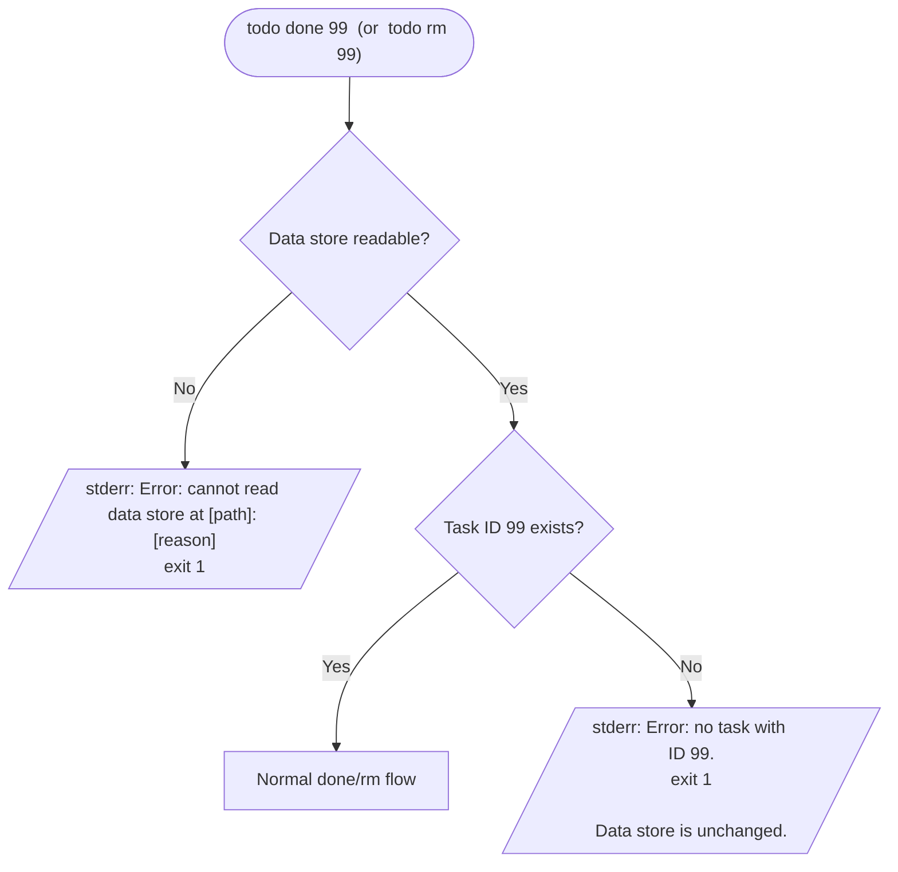
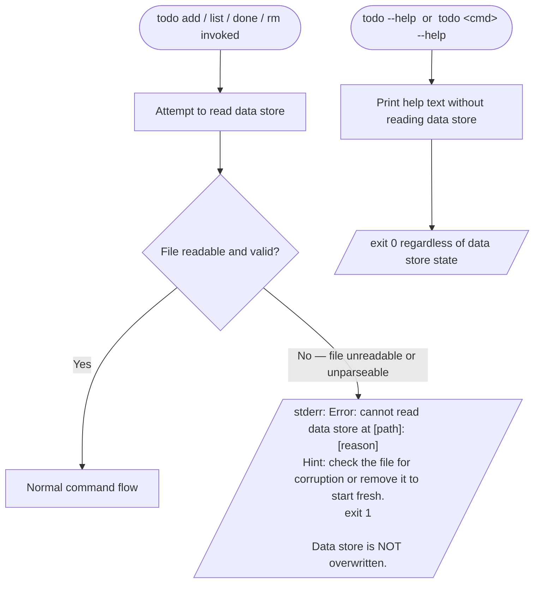
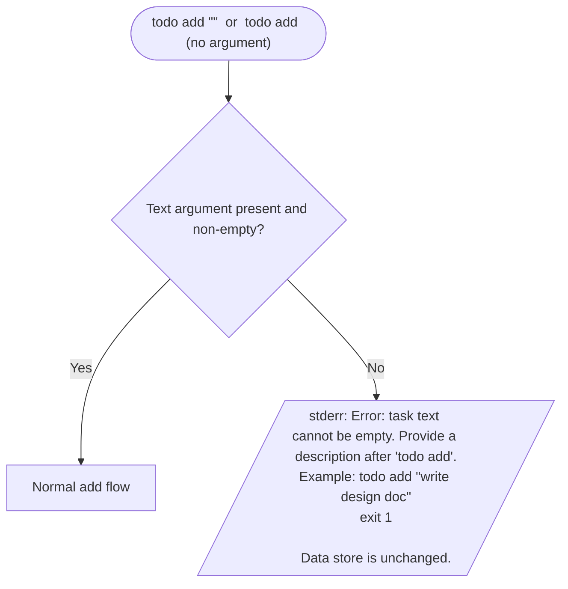

# Design — CLI Todo App

<!-- Parts A, B, C filled sequentially by ux-designer → ui-designer → architect -->

## Context

`todo` is a single-binary command-line task manager for terminal-native engineers who need to capture, track, and close short-lived tasks without leaving their shell. PRD-CLI-001 defines five subcommands (`add`, `list`, `done`, `rm`, and `--help` coverage on all of them), local data persistence with no network dependency, and a strict non-interactive interface. The tool doubles as the primary worked example for the spec-kit: every artifact from idea through retrospective must remain small enough that a contributor can read the complete spec alongside the source code in a single sitting.

## Goals (design-level)

- **D1** — A new user can complete a full `todo add` → `todo list` → `todo done` cycle in under two minutes, guided by `--help` alone, with no external documentation.
- **D2** — Every command follows a single, predictable invocation shape (`todo <subcommand> [argument]`) so there is nothing novel to learn between subcommands.
- **D3** — Every output string — success, empty, and error — communicates exactly what happened and, where applicable, what to do next; no terse codes, no silent exits.
- **D4** — The interaction design is pipe-friendly and script-safe: success output goes to stdout, error output goes to stderr, and exit codes are reliable.
- **D5** — The design artifact itself is co-readable with the PRD in one sitting, serving the didactic goal for spec-kit contributors (Morgan persona).

## Non-goals

- **ND1** — No full-screen TUI or interactive prompts of any kind (maps to PRD NG2).
- **ND2** — No ANSI colour, bold, or other terminal escape sequences in default output (keeps output pipe-safe and avoids a visual design dependency).
- **ND3** — No pagination or pager integration for `todo list` output (maps to PRD out-of-scope: no sorting or filtering beyond `--all`).
- **ND4** — No machine-readable output flag (e.g., `--json`) in v1 (maps to PRD out-of-scope).
- **ND5** — No interactive confirmation prompts before destructive operations (`rm`) — the ID argument is the confirmation (maps to PRD NG2; keeps the tool script-safe).

---

## Part A — UX

### User flows

#### Flow 1 — Happy path: add → list → done cycle



#### Flow 2 — Remove a task



#### Flow 3 — Help discovery



#### Flow 4 — Error: unknown ID (done or rm)



#### Flow 5 — Error: corrupt data store (data-accessing subcommands only)



#### Flow 6 — Error: empty text for add



---

### Information architecture

#### Command hierarchy

```
todo
├── add <text>          positional argument, required, non-empty string
├── list                no required arguments
│   └── --all           optional named flag (long form only)
├── done <id>           positional argument, required, positive integer
├── rm <id>             positional argument, required, positive integer
└── --help              available on the root binary and every subcommand
    ├── todo --help
    ├── todo add --help
    ├── todo list --help
    ├── todo done --help
    └── todo rm --help
```

#### Argument and flag conventions

| Convention | Rule |
|---|---|
| Subcommand | Always first token after `todo`. No subcommand → print root help and exit 0. |
| Positional arguments | `add` takes one positional string (the task text). `done` and `rm` take one positional integer (the task ID). Order is fixed and documented in `--help` for each subcommand. |
| Named flags | `--all` on `list` is the only named flag in v1. Long form only (`--all`, not `-a`) to keep the surface minimal and unambiguous. |
| `--help` | Accepted as the first argument to the root binary or as any argument to a subcommand. Always exits 0 and never reads the data store. |
| No short flags | No single-character flag aliases (e.g., `-a`) in v1. Reduces the surface area to learn and matches the didactic goal. |
| No `=` syntax | Flag values use space separation if they ever carry values; `--all` is boolean and takes no value. |

#### Exit-code contract

| Code | Meaning |
|---|---|
| `0` | Success. The command completed as expected. For `--help`, also 0. For `list` with no tasks, also 0 (empty is not an error). |
| `1` | User or data error. Unknown ID, empty text, corrupt data store, or unrecognised subcommand. Scripts must treat any non-zero exit as failure. |

No other exit codes are defined in v1. The architect may define additional codes in Part C if distinguishing error categories (e.g., I/O failure vs. validation failure) is needed for testability — this is flagged as a decision point for handoff.

#### Deep-link / invocation convention

There are no URLs. The equivalent of a deep link is the full shell invocation. Scripts that embed a specific `todo done <id>` call are coupling to the ID, which is intentional and documented (IDs are stable for the lifetime of a task; they are never reused).

The data store path is discoverable via the `TODO_FILE` environment variable or the platform-standard default location. No subcommand exposes the data file path in normal output (it only appears in error messages when the file cannot be read).

---

### Empty / loading / error states

There is no loading state in a synchronous CLI tool. All states are either immediate success, immediate error, or empty output.

#### Empty: `todo list` with no open tasks

```
No open tasks. Run 'todo add <text>' to create one.
```

- Printed to stdout.
- Exit code 0 (empty is not an error; scripts should not treat it as one).

#### Empty: `todo list --all` with no tasks at all

```
No tasks yet. Run 'todo add <text>' to create your first task.
```

- Printed to stdout.
- Exit code 0.

#### Success: `todo add`

```
Added task [id]: [text]
```

Example: `Added task 4: write design doc`

- Printed to stdout.
- Exit code 0.

#### Success: `todo done`

```
Done: task [id] [text]
```

Example: `Done: task 2 buy coffee`

- Printed to stdout.
- Exit code 0.

#### Success: `todo rm`

```
Removed task [id]: [text]
```

Example: `Removed task 3: review PR`

- Printed to stdout.
- Exit code 0.

#### Error: unknown ID (`done` or `rm`)

```
Error: no task with ID [id].
```

Example: `Error: no task with ID 99.`

- Printed to stderr.
- Exit code 1.
- Data store is unchanged.

#### Error: corrupt or unreadable data store

```
Error: cannot read data store at [path]: [reason]
Hint: check the file for corruption or remove it to start fresh.
```

Example:
```
Error: cannot read data store at /home/alex/.local/share/todo/tasks: unexpected end of data
Hint: check the file for corruption or remove it to start fresh.
```

- Printed to stderr.
- Exit code 1.
- Data store is NOT overwritten.
- This error applies only to `add`, `list`, `done`, and `rm`. Help invocations (`--help` on any command) do not read the data store and are unaffected.

#### Error: empty text for `add`

```
Error: task text cannot be empty. Provide a description after 'todo add'.
Example: todo add "write design doc"
```

- Printed to stderr.
- Exit code 1.
- Data store is unchanged.

#### Error: unrecognised subcommand

```
Error: unknown command "[token]". Run 'todo --help' for a list of commands.
```

Example: `Error: unknown command "delete". Run 'todo --help' for a list of commands.`

- Printed to stderr.
- Exit code 1.

#### Error: missing required argument

```
Error: [subcommand] requires [description of argument]. Run 'todo [subcommand] --help' for usage.
```

Example: `Error: done requires a task ID. Run 'todo done --help' for usage.`

- Printed to stderr.
- Exit code 1.

---

### Accessibility considerations

This is a terminal tool. Accessibility for CLI tools addresses: pipe-friendliness, screen-reader compatibility of terminal output, scripting safety, and non-interactive use.

#### Pipe-friendly output (no ANSI colour in non-TTY mode)

- The tool must not emit ANSI colour codes, bold, or any other terminal escape sequences when stdout is not a TTY (i.e., when piped to another command or redirected to a file).
- When stdout is a TTY, the tool may emit no ANSI codes at all in v1 (plain text is always acceptable; this is left to `ui-designer` to decide in Part B).
- This ensures `todo list | grep coffee` and `todo list > tasks.txt` produce clean plain text.

#### Stderr vs. stdout routing

- All success output and list output goes to stdout.
- All error messages go to stderr.
- This routing is mandatory, not advisory. It allows scripts to capture output (`output=$(todo list)`) without capturing error messages, and to redirect errors independently (`todo list 2>/dev/null`).

#### Exit codes for scripting

- Exit code 0 = success, including empty list.
- Exit code 1 = any error (unknown ID, empty text, corrupt store, bad subcommand).
- Scripts that depend on exit codes must not need to parse output text to determine success or failure. The exit code alone is the machine-readable signal.

#### No interactive prompts

- The tool never prompts for confirmation, asks for input mid-execution, or reads from stdin in any flow.
- This ensures the tool works correctly in non-interactive contexts: CI pipelines, cron jobs, shell scripts, and editors that shell out.

#### Screen-reader compatibility of terminal output

- All output is plain text with no ASCII art, box-drawing characters, or decorative symbols that a screen reader would vocalise as noise.
- List output (`todo list`) uses a simple two-column layout (ID, then text) separated by whitespace, so it reads linearly and naturally when vocalised by a terminal screen reader (e.g., Orca on Linux, VoiceOver + terminal on macOS).
- `todo list --all` adds a status indicator between ID and text. The indicator must be a word, not a symbol. Prescribed forms: `done` and `open` (not `✓`/`✗` or `[x]`/`[ ]`).

Example `todo list --all` output:
```
1  open   buy coffee
2  done   write design doc
3  open   review PR
```

#### ARIA and focus management

Not applicable — this is a CLI tool with no DOM, no focus model, and no ARIA roles.

---

### Requirements coverage (Part A)

| REQ ID | Addressed in Part A |
|---|---|
| REQ-CLI-001 | Flow 1 (happy path add); Empty/error states: success add message, empty-text error |
| REQ-CLI-002 | Flow 1 (happy path list); Empty/error states: empty list message; IA: `todo list` command shape |
| REQ-CLI-003 | IA: `todo list --all` flag convention; Empty/error states: empty `--all` message; Accessibility: `done`/`open` word indicators |
| REQ-CLI-004 | Flow 1 (happy path done); Flow 4 (unknown ID error); Empty/error states: success done message |
| REQ-CLI-005 | Flow 2 (remove flow); Flow 4 (unknown ID error); Empty/error states: success rm message |
| REQ-CLI-006 | Flow 3 (help discovery); IA: `--help` on root and all subcommands; Empty/error states: help text prescriptions |
| REQ-CLI-007 | Implicit in all flows — persistence is a prerequisite for every data-accessing flow; no UX state needed beyond what other flows define |
| REQ-CLI-008 | No UX surface — atomic write is an implementation concern; handed to architect (Part C) |
| REQ-CLI-009 | Error states: data store path appears in corrupt-file error message; IA note on `TODO_FILE` env var as invocation-convention context |
| REQ-CLI-010 | Flow 4 (unknown ID error — done); Empty/error states: unknown ID error message |
| REQ-CLI-011 | Flow 4 (unknown ID error — rm); Empty/error states: unknown ID error message |
| REQ-CLI-012 | Flow 5 (corrupt data store error); Empty/error states: corrupt store error message; Accessibility: stderr routing |
| REQ-CLI-013 | Flow 6 (empty text error); Empty/error states: empty text error message |

<!-- Part B: ui-designer — continue here with visual/presentation design for the CLI output format -->

---

## Part B — UI

> For a CLI tool, "UI" means the textual output conventions: how every output state is formatted, what the confirmation and error lines look like, what microcopy appears in every state. There are no screens, components, or design tokens in the GUI sense. The sections below are adapted accordingly.

### Output states inventory

Every distinct output a user can see, across all 13 FRs.

| State | Trigger | Channel | Example output |
|---|---|---|---|
| Add — success | `todo add <text>` with non-empty text, data store readable | stdout | `Added task 1: buy coffee` |
| Done — success | `todo done <id>` with valid existing ID | stdout | `Done: task 2 buy coffee` |
| Rm — success | `todo rm <id>` with valid existing ID | stdout | `Removed task 3: review PR` |
| List — open tasks present | `todo list`, at least one open task | stdout | `1  buy coffee` (one task per line) |
| List — no open tasks | `todo list`, zero open tasks | stdout | `No open tasks. Run 'todo add <text>' to create one.` |
| List --all — mixed tasks | `todo list --all`, tasks of any status exist | stdout | `1  open   buy coffee` / `2  done   write design doc` (one task per line) |
| List --all — no tasks at all | `todo list --all`, data store is empty | stdout | `No tasks yet. Run 'todo add <text>' to create your first task.` |
| Help — root | `todo --help` or `todo` with no subcommand | stdout | Usage block (see microcopy section) |
| Help — add subcommand | `todo add --help` | stdout | add-specific usage block |
| Help — list subcommand | `todo list --help` | stdout | list-specific usage block |
| Help — done subcommand | `todo done --help` | stdout | done-specific usage block |
| Help — rm subcommand | `todo rm --help` | stdout | rm-specific usage block |
| Error — unknown ID (done) | `todo done <id>` where `<id>` does not exist | stderr | `Error: no task with ID 99.` |
| Error — unknown ID (rm) | `todo rm <id>` where `<id>` does not exist | stderr | `Error: no task with ID 42.` |
| Error — corrupt/unreadable data store | Any data-accessing subcommand, data store unreadable or unparseable | stderr | `Error: cannot read data store at [path]: [reason]` + hint line |
| Error — empty text for add | `todo add ""` or `todo add` with no argument | stderr | `Error: task text cannot be empty. Provide a description after 'todo add'.` + example line |
| Error — unknown subcommand | `todo <unrecognised-token>` | stderr | `Error: unknown command "[token]". Run 'todo --help' for a list of commands.` |
| Error — missing required argument | `todo done` or `todo rm` with no ID argument | stderr | `Error: done requires a task ID. Run 'todo done --help' for usage.` |

---

### Output format conventions

These conventions are precise enough to be referenced directly in the spec. No implementation detail is implied.

#### Task line format — `todo list` (open only)

```
[id]  [text]
```

- Two spaces between the ID and the text.
- No leading spaces before the ID.
- One task per line.
- No header row, no separator lines, no trailing blank line.
- IDs are left-aligned; no padding or zero-filling (ID 1 appears as `1`, not `01`).

Illustrative output:

```
1  buy coffee
4  write design doc
7  review PR
```

#### Task line format — `todo list --all`

```
[id]  [status]   [text]
```

- Two spaces between ID and status; three spaces between status and text.
- Status is always exactly one of two words: `open` or `done`. No symbols, no brackets.
- Column widths are fixed by convention: status field is four characters (`open`) or four characters (`done`) — they are the same width, so text alignment is consistent without padding.
- One task per line. No header row, no separator lines, no trailing blank line.

Illustrative output:

```
1  open   buy coffee
2  done   write design doc
3  open   review PR
```

#### Confirmation line — add

```
Added task [id]: [text]
```

- Colon and one space before the text.
- `[id]` is the integer assigned to the new task.
- `[text]` is the exact text the user provided, untransformed.

#### Confirmation line — done

```
Done: task [id] [text]
```

- Colon after `Done`; one space before `task`.
- `[id]` and `[text]` are separated by a single space; no colon between them.
- `[text]` is the exact task text.

#### Confirmation line — rm

```
Removed task [id]: [text]
```

- Colon and one space before the text.
- `[text]` is the exact task text at the time of removal.

#### Error line format

All errors follow a two-rule structure:

1. First line: `Error: [specific message ending with a full stop]`
2. Hint or example line (only where defined below): plain sentence, no `Hint:` prefix on the example line, `Hint:` prefix retained on the hint line only where it adds navigation value (corrupt data store case).

No multi-line errors beyond the prescribed two-line cases. No stack traces in user-facing output.

---

### Spacing and alignment conventions (tokens)

There are no GUI design tokens. The following conventions serve the equivalent role for this CLI.

| Convention | Value | Rationale |
|---|---|---|
| ID-to-text gap (`list`) | 2 spaces | Readable without being wide; narrower than a tab stop so short IDs don't leave long gaps |
| ID-to-status gap (`list --all`) | 2 spaces | Same as above; consistent with the non-`--all` format |
| Status-to-text gap (`list --all`) | 3 spaces | Extra space makes the text column visually distinct from the 4-char status word |
| No separator lines | — | No `---` or `===` rows between tasks or between output sections; output stays pipe-clean |
| No header row | — | Column headers would appear in `grep` and `wc -l` output; they are noise in scripting |
| No trailing newline beyond standard line ending | — | One `\n` per output line; no blank line after the last entry |
| Error prefix | `Error:` | Consistent prefix on all error messages; casing is sentence-case |
| Hint prefix | `Hint:` | Used only on the second line of the corrupt-data-store error; nowhere else |

No ANSI colour codes, bold, or terminal escape sequences in any output state (ND2).

---

### Content / microcopy

All strings are specified exactly. Variable parts use `[angle-bracket placeholders]`.

#### Confirmation messages

**Add:**
```
Added task [id]: [text]
```

**Done:**
```
Done: task [id] [text]
```

**Rm:**
```
Removed task [id]: [text]
```

#### Empty-list messages

**`todo list` with no open tasks:**
```
No open tasks. Run 'todo add <text>' to create one.
```

**`todo list --all` with no tasks at all:**
```
No tasks yet. Run 'todo add <text>' to create your first task.
```

#### Error messages

**Unknown ID — done:**
```
Error: no task with ID [id].
```

**Unknown ID — rm:**
```
Error: no task with ID [id].
```

(Same pattern for both subcommands; the offending ID is always included.)

**Corrupt or unreadable data store:**
```
Error: cannot read data store at [path]: [reason]
Hint: check the file for corruption or remove it to start fresh.
```

**Empty text for add:**
```
Error: task text cannot be empty. Provide a description after 'todo add'.
Example: todo add "write design doc"
```

**Unknown subcommand:**
```
Error: unknown command "[token]". Run 'todo --help' for a list of commands.
```

**Missing required argument — done:**
```
Error: done requires a task ID. Run 'todo done --help' for usage.
```

**Missing required argument — rm:**
```
Error: rm requires a task ID. Run 'todo rm --help' for usage.
```

#### Help text — root (`todo --help` or `todo` with no subcommand)

```
Usage: todo <command> [arguments]

Commands:
  add <text>   Add a new task
  list          List open tasks
  list --all    List all tasks including done
  done <id>    Mark a task done
  rm <id>      Remove a task permanently

Run 'todo <command> --help' for command-specific help.
```

#### Help text — `todo add --help`

```
Usage: todo add <text>

Creates a new open task with the given text.
The task is assigned a unique integer ID.

Example:
  todo add "write design doc"
```

#### Help text — `todo list --help`

```
Usage: todo list [--all]

Lists open tasks. With --all, includes completed tasks.
Each line shows the task ID, status (if --all), and text.

Examples:
  todo list
  todo list --all
```

#### Help text — `todo done --help`

```
Usage: todo done <id>

Marks the task with the given integer ID as done.
The task will no longer appear in 'todo list' output.

Example:
  todo done 2
```

#### Help text — `todo rm --help`

```
Usage: todo rm <id>

Permanently removes the task with the given integer ID.
This action cannot be undone.

Example:
  todo rm 5
```

---

### Accessibility verification

| Check | Result |
|---|---|
| No information conveyed by colour alone | Pass — no colour is used; status is conveyed by the words `open` and `done` |
| Screen-reader linearity | Pass — all output is plain text, left-to-right, one task per line; `list --all` words read naturally when vocalised |
| No ASCII art or box-drawing characters | Pass — none used anywhere |
| Error messages do not blame the user | Pass — all errors describe the condition, not the user's fault; `Hint:` lines are constructive |
| Pipe-safe output | Pass — no escape sequences; stdout and stderr are routed separately |
| No interactive prompts | Pass — no stdin reads in any flow |
| Help text usable without prior documentation | Pass — every subcommand help includes a concrete example |

---

### Requirements coverage (Part B)

| REQ ID | Addressed in Part B |
|---|---|
| REQ-CLI-001 | Output states: Add — success; Microcopy: add confirmation, empty-text error |
| REQ-CLI-002 | Output states: List — open tasks, List — no open tasks; Format conventions: task line format |
| REQ-CLI-003 | Output states: List --all — mixed, List --all — empty; Format conventions: `list --all` task line format with `open`/`done` word indicators |
| REQ-CLI-004 | Output states: Done — success; Microcopy: done confirmation, unknown-ID error |
| REQ-CLI-005 | Output states: Rm — success; Microcopy: rm confirmation, unknown-ID error |
| REQ-CLI-006 | Output states: Help — root and all four subcommands; Microcopy: all help text blocks |
| REQ-CLI-007 | No additional UI surface — persistence is transparent to the user; handled architecturally |
| REQ-CLI-008 | No additional UI surface — atomic write is invisible to the user in the success path |
| REQ-CLI-009 | Microcopy: `[path]` placeholder in corrupt-data-store error is the only place the data store path appears in output |
| REQ-CLI-010 | Output states: Error — unknown ID (done); Microcopy: unknown-ID error copy |
| REQ-CLI-011 | Output states: Error — unknown ID (rm); Microcopy: unknown-ID error copy |
| REQ-CLI-012 | Output states: Error — corrupt/unreadable data store; Microcopy: two-line error with Hint |
| REQ-CLI-013 | Output states: Error — empty text for add; Microcopy: two-line error with Example |

<!-- Part C: architect -->
