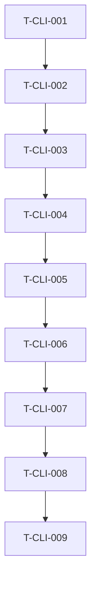

# Tasks — CLI Todo App

The example decomposes implementation into small, traceable work units. Test-oriented tasks come before implementation tasks for the same behavior, matching the workflow's TDD ordering rule.

### T-CLI-001 — Add dispatcher and help tests

- **Description:** Add tests for root help, subcommand help, bare invocation, unknown subcommand, stdout/stderr routing, and exit-code policy.
- **Satisfies:** REQ-CLI-006, REQ-CLI-012, SPEC-CLI-005, SPEC-CLI-006, SPEC-CLI-007
- **Owner:** qa
- **Estimate:** S

### T-CLI-002 — Scaffold binary and command dispatcher

- **Description:** Create the `todo` binary entry point, command dispatcher, root help behavior, unknown-command handling, and single exit-code translation.
- **Satisfies:** REQ-CLI-006, SPEC-CLI-005, SPEC-CLI-006, SPEC-CLI-007
- **Depends on:** T-CLI-001
- **Owner:** dev
- **Estimate:** S

### T-CLI-003 — Add storage and path tests

- **Description:** Add filesystem-backed tests for path resolution, corrupt stores, missing parent directories, empty `TODO_FILE`, and help bypassing corrupt stores.
- **Satisfies:** REQ-CLI-007, REQ-CLI-009, REQ-CLI-012, SPEC-CLI-008, SPEC-CLI-009
- **Depends on:** T-CLI-002
- **Owner:** qa
- **Estimate:** M

### T-CLI-004 — Implement path resolution and storage read validation

- **Description:** Implement XDG default path resolution, `TODO_FILE` override, missing-file behavior, JSON store decoding, and corrupt-store diagnostics.
- **Satisfies:** REQ-CLI-007, REQ-CLI-009, REQ-CLI-012, SPEC-CLI-008, SPEC-CLI-009
- **Depends on:** T-CLI-003
- **Owner:** dev
- **Estimate:** M

### T-CLI-005 — Add atomic-write tests

- **Description:** Add ADR compliance tests for SIGKILL mid-write and cross-filesystem `TODO_FILE` paths.
- **Satisfies:** REQ-CLI-008, NFR-CLI-002, SPEC-CLI-008
- **Depends on:** T-CLI-004
- **Owner:** qa
- **Estimate:** M

### T-CLI-006 — Implement atomic save

- **Description:** Implement the same-directory temp-file, fsync, and rename save path required by ADR-CLI-0001.
- **Satisfies:** REQ-CLI-008, NFR-CLI-002, SPEC-CLI-008
- **Depends on:** T-CLI-005
- **Owner:** dev
- **Estimate:** M

### T-CLI-007 — Add command behavior tests

- **Description:** Add end-to-end tests for command happy paths, empty states, unknown IDs, invalid IDs, empty add text, ID non-reuse, text preservation, and performance.
- **Satisfies:** REQ-CLI-001, REQ-CLI-002, REQ-CLI-003, REQ-CLI-004, REQ-CLI-005, REQ-CLI-010, REQ-CLI-011, REQ-CLI-013, NFR-CLI-001, SPEC-CLI-001, SPEC-CLI-002, SPEC-CLI-003, SPEC-CLI-004
- **Depends on:** T-CLI-006
- **Owner:** qa
- **Estimate:** M

### T-CLI-008 — Implement task commands

- **Description:** Implement `add`, `list`, `list --all`, `done`, and `rm` handlers with exact output strings and ID invariants.
- **Satisfies:** REQ-CLI-001, REQ-CLI-002, REQ-CLI-003, REQ-CLI-004, REQ-CLI-005, REQ-CLI-010, REQ-CLI-011, REQ-CLI-013, SPEC-CLI-001, SPEC-CLI-002, SPEC-CLI-003, SPEC-CLI-004
- **Depends on:** T-CLI-007
- **Owner:** dev
- **Estimate:** M

### T-CLI-009 — Prepare review and traceability artifacts

- **Description:** Populate implementation log, test report, review, release notes, retrospective, and traceability matrix for the worked example.
- **Satisfies:** REQ-CLI-001, REQ-CLI-002, REQ-CLI-003, REQ-CLI-004, REQ-CLI-005, REQ-CLI-006, REQ-CLI-007, REQ-CLI-008, REQ-CLI-009, REQ-CLI-010, REQ-CLI-011, REQ-CLI-012, REQ-CLI-013, NFR-CLI-007
- **Depends on:** T-CLI-008
- **Owner:** dev
- **Estimate:** S

## Dependency graph

## Quality gate

- [x] Each task is small enough for the example.
- [x] Each task has a stable ID.
- [x] Each task references requirement and spec IDs.
- [x] Dependencies explicit.
- [x] TDD ordering is represented by paired QA tasks before implementation completion.
- [x] Owner assigned per task.
