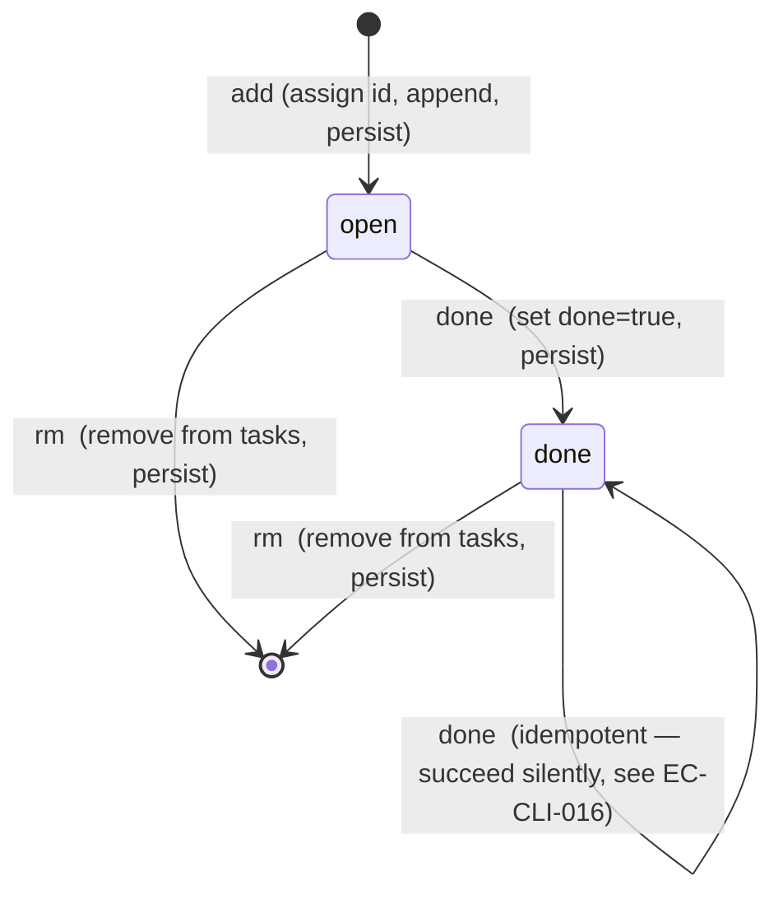

# Specification — CLI Todo App

Implementation-ready contracts for the `todo` binary. Two independent teams should produce indistinguishable behaviour from this document.

> **Illustrative-not-prescriptive:** Signatures, structures, and algorithms below are written in language-agnostic pseudocode. JSON is named explicitly because it is the on-disk *format* decision (the only format considered for v1), not a library choice. No package, library, or function name from any specific language ecosystem is referenced.

## Scope

**This spec covers:**

- All 13 functional requirements (REQ-CLI-001 through REQ-CLI-013) as enumerated subcommand contracts.
- The on-disk JSON encoding for the task store and its envelope.
- The atomic-rename write helper and the data-store path resolver, both as named internal interfaces.
- All edge cases enumerated in §5.
- Test scenarios derivable from §6.
- Stderr-only observability surface (§7).
- The performance budget inherited from NFR-CLI-001 (§8).
- The compatibility posture for the on-disk format version (§9).
- The documented concurrency posture required by ADR-CLI-0001 (§10).

**This spec does not cover:**

- Platform-specific implementation machinery (system calls, library APIs, package layout). Behaviour, not mechanism.
- Library or package selections. The implementation choices are open within the contracts below.
- Windows behaviour. Per PRD NG10 and NFR-CLI-003, Windows is undefined for v1.
- Process supervision, daemonisation, networking, telemetry, or schema migration. Out of scope per PRD.

---

## Interfaces

The public surface is the CLI plus two internal interfaces called out by name because they carry load-bearing invariants (the atomic-write helper from ADR-CLI-0001 and the path resolver from REQ-CLI-009).

### SPEC-CLI-001 — `todo add <text>`

- **Kind:** CLI subcommand.
- **Signature:**
  ```
  todo add <text>
  todo add ""                 -> error (empty text)
  todo add                    -> error (empty text — same message as `todo add ""`)
  todo add --help             -> help text, exit 0 (see SPEC-CLI-005)
  ```
  `<text>` is a single positional string argument. Quoting rules are the user's shell's; the binary receives one argv element after `add` and treats it verbatim.
- **Behaviour:**
  1. Parse argv. If the first non-flag token after `add` is absent, **or** the text argument is the empty string, emit the empty-text error (see Errors) and exit 1. Both cases collapse to the same observable behaviour: a missing text argument and an empty text argument are indistinguishable from the user's perspective and are reported with the same two-line message. (Aligned with design Part A Flow 6 and Part B microcopy.)
  2. Resolve the data-store path (SPEC-CLI-009).
  3. Load the store (SPEC-CLI-008 read path). If the store does not exist on disk, treat as a fresh empty store with `version: 1`, `next_id: 1`, `tasks: []` — do not error and do not write.
  4. Construct a new task: `id = store.next_id`, `text = <argv text verbatim>`, `done = false`, `created_at = <current UTC instant in RFC 3339>`.
  5. Append the task to `store.tasks`. Increment `store.next_id` by 1.
  6. Persist the store via the atomic-write helper (SPEC-CLI-008 write path).
  7. Print the success line on stdout: `Added task <id>: <text>` followed by a newline. Exit 0.
- **Pre-conditions:**
  - The data-store path resolves to a writable location (or to a path whose parent directory can be created).
  - The text argument is a non-empty string.
- **Post-conditions on success:**
  - The on-disk store contains the new task with the assigned `id` and `text`.
  - `store.next_id` is one greater than the new task's `id`.
  - Every previously stored task is preserved unchanged.
  - Stdout has received exactly one `Added task <id>: <text>\n` line. Stderr is empty. Exit code is 0.
- **Side effects:** Creates parent directory if missing. Creates a temporary sibling file during write; renames it over the target path. The temp file does not persist past a successful rename.
- **Errors:**
  | Condition | Channel | Message | Exit |
  |---|---|---|---|
  | Argument absent (`todo add` with no further tokens) **or** empty string argument (`todo add ""`) | stderr | `Error: task text cannot be empty. Provide a description after 'todo add'.` newline `Example: todo add "write design doc"` | 1 |
  | Data store unreadable or corrupt | stderr | Corrupt-store error (see SPEC-CLI-008) | 1 |
  | Write fails after temp-file creation | stderr | `Error: cannot write data store at <path>: <reason>` | 1 |
- **Satisfies:** REQ-CLI-001, REQ-CLI-007, REQ-CLI-008, REQ-CLI-009, REQ-CLI-012, REQ-CLI-013.

---

### SPEC-CLI-002 — `todo list` and `todo list --all`

- **Kind:** CLI subcommand.
- **Signature:**
  ```
  todo list                   -> list of open tasks
  todo list --all             -> list of every task (open and done)
  todo list --help            -> help text, exit 0 (see SPEC-CLI-005)
  ```
  `--all` is a boolean long flag. No short alias. No `=` syntax. No additional positional arguments are accepted; any extra positional token is an unknown-argument error.
- **Behaviour:**
  1. Parse argv. If `--help` appears anywhere, dispatch to help (SPEC-CLI-005).
  2. Determine the mode: `--all` flag present means *all*; absence means *open only*.
  3. Resolve the data-store path (SPEC-CLI-009).
  4. Load the store (SPEC-CLI-008 read path). If the file does not exist, treat as a fresh empty store and proceed; do not create the file.
  5. **Open mode (`todo list`):** filter `store.tasks` to those with `done == false`, in stored insertion order.
     - If the filtered list is empty: print `No open tasks. Run 'todo add <text>' to create one.\n` to stdout. Exit 0.
     - Otherwise: for each task, print `<id>  <text>\n` (two spaces between the ID and text). Exit 0.
  6. **All mode (`todo list --all`):** take all tasks in stored insertion order.
     - If `store.tasks` is empty: print `No tasks yet. Run 'todo add <text>' to create your first task.\n` to stdout. Exit 0.
     - Otherwise: for each task, print `<id>  <status>   <text>\n` where `<status>` is the literal word `open` or `done`. Two spaces between ID and status; three spaces between status and text. Exit 0.
- **Pre-conditions:** The data-store path is resolvable (the file may or may not exist).
- **Post-conditions:**
  - The on-disk store is unchanged. No write occurs in any branch.
  - Stdout has received zero or more task lines (or exactly one empty-state message). Stderr is empty. Exit code is 0.
- **Side effects:** None.
- **Errors:**
  | Condition | Channel | Message | Exit |
  |---|---|---|---|
  | Data store unreadable or corrupt | stderr | Corrupt-store error (see SPEC-CLI-008) | 1 |
  | Unknown flag (e.g., `--allx`, `-a`) | stderr | `Error: unknown flag "<token>". Run 'todo list --help' for usage.` | 1 |
  | Extra positional argument | stderr | `Error: list takes no positional arguments. Run 'todo list --help' for usage.` | 1 |
- **Satisfies:** REQ-CLI-002, REQ-CLI-003, REQ-CLI-007, REQ-CLI-009, REQ-CLI-012.

---

### SPEC-CLI-003 — `todo done <id>`

- **Kind:** CLI subcommand.
- **Signature:**
  ```
  todo done <id>              -> mark task <id> done
  todo done                   -> error (missing argument)
  todo done <non-integer>     -> error (invalid id)
  todo done --help            -> help text, exit 0 (see SPEC-CLI-005)
  ```
  `<id>` is a positional decimal integer. Leading `+` and leading zeros are accepted by canonical-integer parsing rules; a leading `-`, non-digits, an empty string, or any value not representable as a positive integer is rejected.
- **Behaviour:**
  1. Parse argv. If the first non-flag token after `done` is absent, emit missing-argument error and exit 1.
  2. Parse `<id>` as a decimal integer. If parsing fails, or the parsed value is `<= 0`, emit invalid-id error and exit 1.
  3. Resolve the data-store path (SPEC-CLI-009) and load the store. If the file does not exist, treat as a fresh empty store (so the lookup will fail in step 4 with the unknown-ID error).
  4. Find the task whose `id == <parsed id>`. If no match, emit unknown-ID error and exit 1; the data store is not written.
  5. **Idempotency rule:** if the matched task already has `done == true`, the operation succeeds: print the success line and exit 0 without writing. (See EC-CLI-016.) Implementations MAY skip the write if no field changes; behaviour observed by the user is identical either way.
  6. Otherwise set the matched task's `done = true`. Persist the store via the atomic-write helper.
  7. Print the success line on stdout: `Done: task <id> <text>\n` (note: a single space between `<id>` and `<text>`, no colon between them — this differs from `add` and `rm` and is intentional per design Part B). Exit 0.
- **Pre-conditions:** None beyond the path being resolvable.
- **Post-conditions on success:**
  - The matched task has `done == true` on disk.
  - All other fields of all tasks (including their IDs and `next_id`) are unchanged.
  - Stdout has received exactly one `Done: task <id> <text>\n` line. Stderr is empty. Exit code is 0.
- **Side effects:** Atomic write to the data-store path (skipped when the task is already done).
- **Errors:**
  | Condition | Channel | Message | Exit |
  |---|---|---|---|
  | Argument absent | stderr | `Error: done requires a task ID. Run 'todo done --help' for usage.` | 1 |
  | Argument is not a positive integer | stderr | `Error: done requires a positive integer ID, got "<token>". Run 'todo done --help' for usage.` | 1 |
  | No task with that ID | stderr | `Error: no task with ID <id>.` | 1 |
  | Data store unreadable or corrupt | stderr | Corrupt-store error (see SPEC-CLI-008) | 1 |
- **Satisfies:** REQ-CLI-004, REQ-CLI-007, REQ-CLI-008, REQ-CLI-009, REQ-CLI-010, REQ-CLI-012.

---

### SPEC-CLI-004 — `todo rm <id>`

- **Kind:** CLI subcommand.
- **Signature:**
  ```
  todo rm <id>                -> permanently remove task <id>
  todo rm                     -> error (missing argument)
  todo rm <non-integer>       -> error (invalid id)
  todo rm --help              -> help text, exit 0 (see SPEC-CLI-005)
  ```
- **Behaviour:**
  1. Parse argv. If the first non-flag token after `rm` is absent, emit missing-argument error and exit 1.
  2. Parse `<id>` as a positive decimal integer. If parsing fails or the value is `<= 0`, emit invalid-id error and exit 1.
  3. Resolve the data-store path and load the store. If the file does not exist, treat as a fresh empty store; the lookup in step 4 will fail with the unknown-ID error.
  4. Find the task whose `id == <parsed id>`. If no match, emit unknown-ID error and exit 1; the data store is not written.
  5. Capture the task's `text` (for the success line).
  6. Remove the task from `store.tasks`. **Do not** decrement `store.next_id`. (IDs are never reused; this is enforced by leaving `next_id` untouched.)
  7. Persist the store via the atomic-write helper.
  8. Print the success line on stdout: `Removed task <id>: <text>\n`. Exit 0.
- **Pre-conditions:** None beyond the path being resolvable.
- **Post-conditions on success:**
  - The matched task is absent from the on-disk store.
  - `store.next_id` is unchanged compared to before the call.
  - All other tasks are preserved unchanged, in their original insertion order.
  - Stdout has received exactly one `Removed task <id>: <text>\n` line. Stderr is empty. Exit code is 0.
- **Side effects:** Atomic write to the data-store path.
- **Errors:**
  | Condition | Channel | Message | Exit |
  |---|---|---|---|
  | Argument absent | stderr | `Error: rm requires a task ID. Run 'todo rm --help' for usage.` | 1 |
  | Argument is not a positive integer | stderr | `Error: rm requires a positive integer ID, got "<token>". Run 'todo rm --help' for usage.` | 1 |
  | No task with that ID | stderr | `Error: no task with ID <id>.` | 1 |
  | Data store unreadable or corrupt | stderr | Corrupt-store error (see SPEC-CLI-008) | 1 |
- **Satisfies:** REQ-CLI-005, REQ-CLI-007, REQ-CLI-008, REQ-CLI-009, REQ-CLI-011, REQ-CLI-012.

---

### SPEC-CLI-005 — `todo --help` and `todo <subcommand> --help`

- **Kind:** CLI subcommand (help mode).
- **Signature:**
  ```
  todo --help                 -> root help block, exit 0
  todo add --help             -> add help block, exit 0
  todo list --help            -> list help block, exit 0
  todo done --help            -> done help block, exit 0
  todo rm --help              -> rm help block, exit 0
  ```
  `--help` is recognised as a top-level flag immediately after `todo`, or as any positional/flag token after a recognised subcommand name. When `--help` is present alongside other arguments to a recognised subcommand, the help handler wins and other arguments are ignored.
- **Behaviour:**
  1. Identify whether the help target is the root or a specific subcommand.
  2. Print the corresponding help block on stdout, exactly as specified in design Part B (reproduced in §3.4 of this spec for traceability).
  3. **Do not** resolve the data-store path. **Do not** load or touch the data store. Help must succeed even when the store is corrupt, missing, or on an unreadable filesystem (REQ-CLI-012 acceptance, EC-CLI-017).
  4. Exit 0.
- **Pre-conditions:** None.
- **Post-conditions:** The on-disk store is unchanged (it is not even read). Stdout has received exactly one help block. Stderr is empty. Exit code is 0.
- **Side effects:** None.
- **Errors:** None — help cannot fail in v1.
- **Help block strings (verbatim):** see §3.4.
- **Satisfies:** REQ-CLI-006, REQ-CLI-012 (help-on-corrupt-store branch).

---

### SPEC-CLI-006 — `todo` invoked with no arguments

- **Kind:** CLI subcommand (degenerate / convenience).
- **Signature:**
  ```
  todo                        -> root help block, exit 0
  ```
- **Behaviour:** Identical to `todo --help`. Print the root help block on stdout. Do not touch the data store. Exit 0.
- **Pre-conditions:** None.
- **Post-conditions:** Same as SPEC-CLI-005 (root help case).
- **Side effects:** None.
- **Errors:** None.
- **Rationale:** A bare invocation is a discovery action by a user who does not yet know the command shape. Exit 0 + help text is more useful than an error.
- **Satisfies:** REQ-CLI-006.

---

### SPEC-CLI-007 — `todo <unknown-token>` (unknown subcommand)

- **Kind:** CLI dispatcher error path.
- **Signature:**
  ```
  todo <unknown-token>        -> unknown-subcommand error, exit 1
  todo <unknown-token> ...    -> unknown-subcommand error (additional args ignored)
  ```
  `<unknown-token>` is any first positional token after `todo` that is not one of `add`, `list`, `done`, `rm`, and is not `--help`.
- **Behaviour:**
  1. The dispatcher recognises the token is unknown.
  2. Emit on stderr: `Error: unknown command "<token>". Run 'todo --help' for a list of commands.\n`
  3. Exit 1.
  4. **Do not** resolve the data-store path. **Do not** read or write the data store.
- **Pre-conditions:** None.
- **Post-conditions:** The on-disk store is unchanged. Stdout is empty. Stderr has the single error line. Exit code is 1.
- **Side effects:** None.
- **Errors:** This *is* the error path. The error message above is the only output.
- **Satisfies:** REQ-CLI-006 (boundary — unknown commands are rejected with guidance back to `--help`).

---

### SPEC-CLI-008 — Storage write helper (atomic rename) and read path

This interface is the sole mutation entry point for the on-disk store, per ADR-CLI-0001. Every handler that modifies state calls it; no handler writes the data file directly.

- **Kind:** Internal function-style interface (storage layer).
- **Signature (pseudocode):**
  ```
  load(path) -> Store | error
  save(path, store) -> ok | error
  ```
- **Read-path behaviour (`load`):**
  1. If the file at `path` does not exist, return a fresh empty store: `{ version: 1, next_id: 1, tasks: [] }`. This is a valid result, not an error. Callers that require a write step still trigger atomic-rename creation via `save`.
  2. If the file exists, open it for reading. On open failure (permission denied, is-a-directory, etc.), return the corrupt-store error with the OS-level reason as `<reason>`.
  3. Parse the file as JSON. On parse failure (invalid JSON, premature EOF, zero-byte file), return the corrupt-store error with `<reason>` set to a short human-readable parse description (e.g., `unexpected end of data`, `invalid character at byte N`). The exact reason wording is implementation-dependent; the message format is not.
  4. Validate the parsed object against the store-envelope schema (§3.2). If validation fails (wrong `version`, missing required field, duplicate IDs, `id >= next_id`, `id <= 0`, etc.), return the corrupt-store error with `<reason>` set to a short identifier such as `unsupported version 2`, `missing field "next_id"`, or `duplicate id 3`.
  5. Otherwise return the validated `Store` value.
- **Write-path behaviour (`save`) — the atomic-rename contract:**
  1. Resolve the parent directory of `path`. If it does not exist, create it (and any missing ancestors) with permissions inherited from the user's umask.
  2. Serialise `store` to JSON (per §3 encoding rules).
  3. Create a sibling temp file in the **same directory as `path`** (not the system temp dir; cross-filesystem renames are not atomic — see EC-CLI-013, ADR-CLI-0001). The temp file's name is implementation-defined; a recommended pattern is a hidden name with a random suffix (e.g., `.tasks.<random>.tmp`).
  4. Write the serialised bytes to the temp file.
  5. Flush the temp file's contents to durable storage (the OS-level "fsync" semantic — flush the file's data and metadata so a subsequent crash cannot lose the write).
  6. Rename the temp file over `path`. The rename must be atomic with respect to readers — at no point may a concurrent reader observe a partial or zero-byte file at `path`.
  7. On any failure during steps 1–6, surface a write error to the caller and remove the temp file if it exists. The original file at `path` is left untouched.
- **Pre-conditions:**
  - `load`: `path` is a string referring to a path on the local filesystem.
  - `save`: `store` is a structurally valid `Store` (see §3.2 invariants).
- **Post-conditions:**
  - `load` success: returns a `Store` whose invariants hold (no duplicate IDs, every `id < next_id`, `version == 1`).
  - `save` success: `path` exists and contains exactly the JSON encoding of `store`. No temp file remains in the parent directory. Either the file at `path` is the new content in full or a SIGKILL between steps 5 and 6 left the *previous* content in full — never a partial file.
- **Side effects:** May create the parent directory. Creates and removes a temp file in the parent directory. Renames over `path`.
- **Errors (load):**
  | Condition | Returned error | Caller's stderr message |
  |---|---|---|
  | File open failure (permissions, is-a-directory) | corrupt-store, `<reason> = <OS reason>` | `Error: cannot read data store at <path>: <reason>\nHint: check the file for corruption or remove it to start fresh.` |
  | Zero-byte file | corrupt-store, `<reason>` set to a short parse description (e.g., `unexpected end of data`); exact wording is implementation-dependent per the read-path narrative above | same template |
  | Invalid JSON | corrupt-store, `<reason> = <parse description>`; exact wording is implementation-dependent | same template |
  | Schema validation fails (wrong version, missing field, duplicate id, id ≥ next_id, id ≤ 0) | corrupt-store, `<reason> = <validation description>` | same template |
- **Errors (save):**
  | Condition | Returned error | Caller's stderr message |
  |---|---|---|
  | Parent directory cannot be created | write error, `<reason>` | `Error: cannot write data store at <path>: <reason>` |
  | Temp file cannot be created or written | write error, `<reason>` | same template |
  | Flush or rename fails | write error, `<reason>` | same template |
- **Compliance with ADR-CLI-0001:**
  - The temp file lives in the target's directory (not `/tmp` or any other directory).
  - Every mutating handler calls `save`; no handler writes to `path` directly.
  - The SIGKILL-mid-write scenario (TEST-CLI-018) is the test gate.
- **Satisfies:** REQ-CLI-007, REQ-CLI-008, REQ-CLI-012, NFR-CLI-002.

---

### SPEC-CLI-009 — Data-store path resolver

- **Kind:** Internal function-style interface (path resolver).
- **Signature (pseudocode):**
  ```
  resolve_path(env) -> string
  ```
  Where `env` is the process environment (the abstraction over `getenv`).
- **Behaviour:**
  1. Look up the `TODO_FILE` environment variable.
  2. If `TODO_FILE` is set and its value is a non-empty string, return that value verbatim. The value is treated as a *full path to the data file* (not a directory).
  3. Otherwise, compute the XDG-default path:
     - On Linux: `$XDG_DATA_HOME/todo/tasks.json` if `XDG_DATA_HOME` is set and non-empty; otherwise `$HOME/.local/share/todo/tasks.json`.
     - On macOS: same algorithm as Linux. (`XDG_DATA_HOME` is not customary on macOS but is honoured if set; the fallback is the Linux-shaped path under `$HOME/.local/share`. This is intentional — see PRD NFR-CLI-003 — and keeps the resolver simple.)
  4. Return the resolved path.
- **Parent-directory creation:** This interface does **not** create the parent directory. Directory creation is the responsibility of the storage write helper (SPEC-CLI-008 step 1) and only happens on a write. A read against a non-existent file returns the empty-store sentinel without creating any directory.
- **Pre-conditions:** None.
- **Post-conditions:** Returns a string. Does not touch the filesystem.
- **Side effects:** None.
- **Errors:** None — path resolution is a pure function of the environment.
- **Satisfies:** REQ-CLI-009, REQ-CLI-007, NFR-CLI-003.

---

## Data structures

The on-disk data store is a single JSON document. JSON is named explicitly because it is the format decision (the only format considered for v1), not a library choice.

### 3.1 Task object

```
Task {
  id:         positive integer (>= 1, < 2^53)
  text:       non-empty string
  done:       boolean
  created_at: string (RFC 3339, UTC, e.g. "2026-04-27T10:15:30Z")
}
```

| Field | Type | Validation |
|---|---|---|
| `id` | JSON number, integer | Must be a positive integer (`>= 1`). Must be strictly less than `next_id` of the enclosing store. Must be unique across all tasks in the store. JSON-safe upper bound `2^53 - 1` per EC-CLI-018. |
| `text` | JSON string | Must be present and non-empty (length `>= 1`). The user's input is preserved verbatim — no trimming, normalisation, or case folding. May contain any Unicode code point that survived the user's shell. |
| `done` | JSON boolean | Must be present. Initial value at task creation is `false`. May only transition `false -> true`; never `true -> false` in v1. |
| `created_at` | JSON string | Must be a valid RFC 3339 date-time in UTC (trailing `Z`). Set at task creation; never modified. Not displayed in v1 output. |

### 3.2 Store envelope

```
Store {
  version: integer (= 1 in v1)
  next_id: positive integer (>= 1)
  tasks:   ordered list of Task (may be empty)
}
```

| Field | Type | Validation |
|---|---|---|
| `version` | JSON number, integer | Must equal `1` for v1. Any other value (including `2`, `0`, `null`, missing, or a non-integer) is a corrupt-store error per EC-CLI-009. |
| `next_id` | JSON number, integer | Must be present and `>= 1`. For an empty store, `next_id` is `1`. After any insert, `next_id` is one greater than the inserted task's `id`. After a `rm`, `next_id` is **not** decremented. Must be strictly greater than the maximum `id` currently or previously in the store (i.e., greater than every `task.id` in `tasks`). |
| `tasks` | JSON array of Task | Order is significant: it is the insertion order, used by `list` and `list --all` output. May be empty. No two tasks may share an `id`. |

### 3.3 Cross-field invariants

The store is *valid* if and only if all of the following hold. The storage `load` function rejects (with the corrupt-store error) any file that violates any invariant.

1. `version == 1`.
2. `next_id >= 1`.
3. Every `task.id` is a positive integer.
4. Every `task.id < next_id`.
5. No two tasks share an `id`.
6. Every required field of every task is present and well-typed.
7. `tasks` is an ordered array (JSON arrays are ordered by definition); duplicate-ID detection is exact, not modulo ordering.

A canonical empty store is `{ "version": 1, "next_id": 1, "tasks": [] }`.

### 3.4 Verbatim output strings

The following strings are quoted from design Part B and are part of the spec contract. Implementations must produce these strings byte-for-byte (modulo placeholders). Tests should pin the exact bytes.

**Confirmation lines (stdout):**

```
Added task <id>: <text>
Done: task <id> <text>
Removed task <id>: <text>
```

**Empty-list messages (stdout):**

```
No open tasks. Run 'todo add <text>' to create one.
No tasks yet. Run 'todo add <text>' to create your first task.
```

**Error messages (stderr):**

```
Error: no task with ID <id>.
Error: cannot read data store at <path>: <reason>
Hint: check the file for corruption or remove it to start fresh.
Error: task text cannot be empty. Provide a description after 'todo add'.
Example: todo add "write design doc"
Error: unknown command "<token>". Run 'todo --help' for a list of commands.
Error: done requires a task ID. Run 'todo done --help' for usage.
Error: rm requires a task ID. Run 'todo rm --help' for usage.
Error: done requires a positive integer ID, got "<token>". Run 'todo done --help' for usage.
Error: rm requires a positive integer ID, got "<token>". Run 'todo rm --help' for usage.
Error: list takes no positional arguments. Run 'todo list --help' for usage.
Error: unknown flag "<token>". Run 'todo list --help' for usage.
Error: cannot write data store at <path>: <reason>
```

**List task lines (stdout):**

```
<id>  <text>
<id>  <status>   <text>
```

(Two spaces between `<id>` and `<status>`; three spaces between `<status>` and `<text>`. `<status>` is the literal word `open` or `done`.)

**Help blocks (stdout) — exact text from design Part B, reproduced for traceability:**

Root (`todo` or `todo --help`):
```
Usage: todo <command> [arguments]

Commands:
  add <text>   Add a new task
  list          List open tasks
  list --all    List all tasks including done
  done <id>    Mark a task done
  rm <id>      Remove a task permanently

Run 'todo <command> --help' for command-specific help.
```

`todo add --help`:
```
Usage: todo add <text>

Creates a new open task with the given text.
The task is assigned a unique integer ID.

Example:
  todo add "write design doc"
```

`todo list --help`:
```
Usage: todo list [--all]

Lists open tasks. With --all, includes completed tasks.
Each line shows the task ID, status (if --all), and text.

Examples:
  todo list
  todo list --all
```

`todo done --help`:
```
Usage: todo done <id>

Marks the task with the given integer ID as done.
The task will no longer appear in 'todo list' output.

Example:
  todo done 2
```

`todo rm --help`:
```
Usage: todo rm <id>

Permanently removes the task with the given integer ID.
This action cannot be undone.

Example:
  todo rm 5
```

---

## State transitions

A task moves through three logical states. The transitions are deliberately one-way in v1.



**Transition table:**

| From | Trigger | To | Side effect | Notes |
|---|---|---|---|---|
| (no task) | `todo add <text>` | open | task appended; `next_id` incremented | New `id` is the previous `next_id`. |
| open | `todo done <id>` | done | task's `done` set to `true`; `next_id` unchanged | Irreversible in v1 (no `todo undone`). |
| open | `todo rm <id>` | (deleted) | task removed from `tasks`; `next_id` unchanged | ID is never reused. |
| done | `todo done <id>` | done | none (idempotent) | Success line still printed; see EC-CLI-016. |
| done | `todo rm <id>` | (deleted) | task removed from `tasks`; `next_id` unchanged | Same effect as removing an open task. |

The `next_id` field carries the never-reused-ID property across file round-trips. Any reader that strips or recomputes `next_id` on rewrite breaks the invariant.

---

## Validation rules

Validation lives at three boundaries:

1. **Argv parsing (dispatcher level):** subcommand recognition; presence of required arguments; integer parse for `<id>`; non-empty check for `<text>`; flag whitelist for `list`.
2. **Store load (storage layer):** every cross-field invariant in §3.3; structural well-formedness of JSON; presence and types of every required field.
3. **Store save (storage layer):** the `Store` value passed by the caller is assumed to satisfy §3.3; the helper does not re-validate before writing. Handlers must construct only valid stores.

**Inputs the binary rejects (each rejection is a stderr error and exit 1):**

| Input | Rejected because | See |
|---|---|---|
| `todo add` (no further argv) **or** `todo add ""` | text argument missing or empty (collapsed to one observable behaviour) | SPEC-CLI-001, REQ-CLI-013 |
| `todo done` / `todo rm` (no argv) | id required | SPEC-CLI-003, SPEC-CLI-004 |
| `todo done abc` / `todo rm 1.5` | not a positive integer | SPEC-CLI-003, SPEC-CLI-004 |
| `todo done -1` / `todo rm 0` | not a positive integer | SPEC-CLI-003, SPEC-CLI-004 |
| `todo done 99` (no such task) | unknown id | SPEC-CLI-003, REQ-CLI-010 |
| `todo rm 42` (no such task) | unknown id | SPEC-CLI-004, REQ-CLI-011 |
| `todo delete` | unknown subcommand | SPEC-CLI-007 |
| `todo list -a` / `todo list --xxx` | unknown flag | SPEC-CLI-002 |
| `todo list extra` | extra positional argument | SPEC-CLI-002 |
| Store with `version != 1` | unsupported version | SPEC-CLI-008, EC-CLI-009 |
| Store with duplicate task IDs | invariant violation | SPEC-CLI-008 |
| Store with `id >= next_id` | invariant violation | SPEC-CLI-008 |
| Store with missing required field | invariant violation | SPEC-CLI-008 |
| Zero-byte data file | invariant violation | SPEC-CLI-008, EC-CLI-010 |
| Data file is a directory | unreadable | SPEC-CLI-008, EC-CLI-011 |

---

## Edge cases

| ID | Case | Expected behaviour |
|---|---|---|
| EC-CLI-001 | `todo add` invoked when the data file does not exist (first run) | Treat as empty store. Create parent dir if missing. Atomic-write the new store containing the one task. Exit 0. |
| EC-CLI-002 | `todo add` invoked when the parent directory does not exist (first run with XDG default) | Create the parent directory (and any missing ancestors) before the temp-file write. Atomic-write succeeds. Exit 0. |
| EC-CLI-003 | `TODO_FILE` set to a path whose parent directory does not exist | Same as EC-CLI-002 — parent directory is created during the write step. Exit 0. |
| EC-CLI-004 | `todo add ""` (empty-string argument) | Empty-text error on stderr; data file unchanged; exit 1. |
| EC-CLI-005 | `todo add` with no argument at all | Same observable behaviour as EC-CLI-004: empty-text error on stderr (the two-line `Error: task text cannot be empty…` + `Example: todo add "write design doc"`); data file unchanged; exit 1. |
| EC-CLI-006 | `todo done <id>` where `<id>` does not exist | Unknown-ID error on stderr; data file unchanged; exit 1. |
| EC-CLI-007 | `todo rm <id>` where `<id>` does not exist | Unknown-ID error on stderr; data file unchanged; exit 1. |
| EC-CLI-008 | Data file exists but contains invalid JSON | Corrupt-store error on stderr (with `<path>` and `<reason>`); data file unchanged; exit 1. |
| EC-CLI-009 | Data file exists but has `"version": 2` (or any value other than `1`) | Corrupt-store error on stderr with reason `unsupported version <n>`; data file unchanged; exit 1. v1 readers must not silently misread an unknown version. |
| EC-CLI-010 | Data file exists but is zero bytes | Corrupt-store error on stderr with a short parse-reason indicating premature end of input (e.g., `unexpected end of data`); exact reason wording is implementation-dependent — see SPEC-CLI-008 read-path step 3. Data file unchanged; exit 1. |
| EC-CLI-011 | Data file path resolves to a directory (not a regular file) | Corrupt-store error on stderr with the OS-level reason; data file unchanged; exit 1. |
| EC-CLI-012 | SIGKILL arrives while the temp file is being written (mid-rename window) | The file at the target path is left in its pre-mutation state (or, if the rename completed before SIGKILL, the new state — never a partial state). The temp file may be left as an orphan in the parent directory; this is harmless and not cleaned up by v1. |
| EC-CLI-013 | `TODO_FILE` set to a path on a different filesystem from the default XDG dir | The temp file is placed in the *target's* directory (not the system temp dir or any other location). The rename therefore stays within one filesystem and remains atomic. This is enforced by SPEC-CLI-008 step 3 and is a compliance condition of ADR-CLI-0001. |
| EC-CLI-014 | `todo list` with zero tasks in the store | Print `No open tasks. Run 'todo add <text>' to create one.\n` on stdout; exit 0. Empty is not an error. |
| EC-CLI-015 | `todo list --all` with zero tasks | Print `No tasks yet. Run 'todo add <text>' to create your first task.\n` on stdout; exit 0. (Different message from EC-CLI-014.) |
| EC-CLI-016 | `todo done <id>` invoked twice on the same ID | The second call observes `done == true` and succeeds idempotently: it prints `Done: task <id> <text>\n` on stdout and exits 0. The implementation MAY skip the write since no field changes; user-visible behaviour is the same. Rationale: the scripting idiom `todo done $id || true` should compose cleanly. |
| EC-CLI-017 | `todo --help` (or any `todo <subcommand> --help`) invoked when the data file is corrupt | Help text printed on stdout; exit 0. The data store is not read by any help branch (REQ-CLI-012 acceptance). |
| EC-CLI-018 | `next_id` overflow | Out of scope for v1. The realistic upper bound is `2^53 - 1` (the JSON-safe integer ceiling), which is unreachable for any plausible single-user workload. v2 may introduce overflow handling if relevant. |
| EC-CLI-019 | `todo add` text contains shell metacharacters or Unicode | Stored verbatim. Output prints the same bytes back. No transformation of any kind. The user's shell is responsible for quoting. |
| EC-CLI-020 | `todo add` text is very long (e.g., 100 KB on a single line) | Stored verbatim. v1 sets no upper bound on text length beyond the JSON-safe limit and the OS argv length limit. NFR-CLI-001 still applies in aggregate (10,000 tasks, ≤ 1 second). |
| EC-CLI-021 | `TODO_FILE` set to the empty string | Empty value is treated as *unset*; the resolver falls back to the XDG default. (Per REQ-CLI-009 statement: "set to a non-empty value".) |

---

## Test scenarios

The QA agent will turn these into automated tests. Test types: **unit** (single function or component), **integration** (multiple components in-process, real filesystem), **e2e** (built binary invoked as a subprocess).

| Test ID | Scenario | Type | Anchors |
|---|---|---|---|
| TEST-CLI-001 | Happy path: `todo add "buy coffee"` from a fresh state creates a task with id 1, persists it, exits 0 with `Added task 1: buy coffee` on stdout | e2e | SPEC-CLI-001, REQ-CLI-001, EC-CLI-001 |
| TEST-CLI-002 | Happy path: `todo list` after two `add`s prints both tasks, each on its own line, with the `<id>  <text>` format | e2e | SPEC-CLI-002, REQ-CLI-002 |
| TEST-CLI-003 | Happy path: `todo list --all` after one open and one done task prints both tasks with `<id>  <status>   <text>` format including word indicators `open`/`done` | e2e | SPEC-CLI-002, REQ-CLI-003 |
| TEST-CLI-004 | Happy path: `todo done 2` flips task 2 to done, prints `Done: task 2 <text>`, exits 0; subsequent `todo list` does not show task 2; `todo list --all` shows it as `done` | e2e | SPEC-CLI-003, REQ-CLI-004 |
| TEST-CLI-005 | Happy path: `todo rm 3` removes task 3, prints `Removed task 3: <text>`, exits 0; `todo list --all` does not show id 3; subsequent `todo add` assigns the next-higher id, never 3 | e2e | SPEC-CLI-004, REQ-CLI-005 |
| TEST-CLI-006 | `todo --help` prints the root help block verbatim and exits 0 | e2e | SPEC-CLI-005, REQ-CLI-006 |
| TEST-CLI-007 | `todo add --help`, `todo list --help`, `todo done --help`, `todo rm --help` each print the matching help block verbatim and exit 0 | e2e | SPEC-CLI-005, REQ-CLI-006 |
| TEST-CLI-008 | `todo` with no arguments prints the root help block and exits 0 | e2e | SPEC-CLI-006, REQ-CLI-006 |
| TEST-CLI-009 | `todo delete` (or any unknown subcommand) prints `Error: unknown command "delete". Run 'todo --help' for a list of commands.` on stderr, stdout empty, exits 1, data store unchanged | e2e | SPEC-CLI-007 |
| TEST-CLI-010 | `todo list` with an empty store prints `No open tasks. Run 'todo add <text>' to create one.` on stdout, exits 0 | e2e | SPEC-CLI-002, EC-CLI-014 |
| TEST-CLI-011 | `todo list --all` with an empty store prints `No tasks yet. Run 'todo add <text>' to create your first task.` on stdout, exits 0 | e2e | SPEC-CLI-002, EC-CLI-015 |
| TEST-CLI-012 | `todo add ""` prints the empty-text error on stderr and the example line, exits 1, data store unchanged | e2e | SPEC-CLI-001, REQ-CLI-013, EC-CLI-004 |
| TEST-CLI-013 | `todo add` with no argument prints the same empty-text error as TEST-CLI-012 on stderr (byte-exact two-line message), exits 1, data store unchanged | e2e | SPEC-CLI-001, REQ-CLI-013, EC-CLI-005 |
| TEST-CLI-014 | `todo done 99` (no such task) prints `Error: no task with ID 99.` on stderr, exits 1, data store byte-for-byte unchanged | e2e | SPEC-CLI-003, REQ-CLI-010, EC-CLI-006 |
| TEST-CLI-015 | `todo rm 42` (no such task) prints `Error: no task with ID 42.` on stderr, exits 1, data store byte-for-byte unchanged | e2e | SPEC-CLI-004, REQ-CLI-011, EC-CLI-007 |
| TEST-CLI-016 | `todo done abc` and `todo rm -1` print the invalid-id error on stderr, exit 1, data store unchanged | e2e | SPEC-CLI-003, SPEC-CLI-004 |
| TEST-CLI-017 | `todo done` and `todo rm` (no argument) print the missing-argument error on stderr, exit 1, data store unchanged | e2e | SPEC-CLI-003, SPEC-CLI-004 |
| TEST-CLI-018 | **ADR-CLI-0001 compliance:** `todo add` is invoked under SIGKILL injected during the temp-file write phase; the file at the target path equals its pre-mutation state byte-for-byte; no zero-byte or truncated file is observed at the target path. (Required by ADR-CLI-0001 test gate.) | integration | SPEC-CLI-008, REQ-CLI-008, NFR-CLI-002, ADR-CLI-0001 |
| TEST-CLI-019 | `TODO_FILE=/tmp/test-tasks-<rand>` overrides the default path: a `todo add` writes to that path and not to the XDG default; the XDG default file is not created | e2e | SPEC-CLI-009, REQ-CLI-009 |
| TEST-CLI-020 | `TODO_FILE=""` (empty string) falls back to the XDG default | e2e | SPEC-CLI-009, REQ-CLI-009, EC-CLI-021 |
| TEST-CLI-021 | First-run with no data file and no parent directory: `todo add` succeeds, parent directory is created, file is created, exit 0 | e2e | SPEC-CLI-001, EC-CLI-001, EC-CLI-002 |
| TEST-CLI-022 | `todo done <id>` called twice on the same id: both calls exit 0 and print the `Done: task <id> <text>` line; data store contains exactly one task with `done: true` | e2e | SPEC-CLI-003, EC-CLI-016 |
| TEST-CLI-023 | `todo --help` and `todo list --help` exit 0 even when the data file is corrupt (e.g., contains `not json` bytes); the help branches do not read the store | e2e | SPEC-CLI-005, REQ-CLI-012, EC-CLI-017 |
| TEST-CLI-024 | Corrupt JSON in the data file: any `add`/`list`/`done`/`rm` invocation prints `Error: cannot read data store at <path>: <reason>` on stderr, includes the hint line, exits 1, and the file is byte-for-byte unchanged | e2e | SPEC-CLI-008, REQ-CLI-012, EC-CLI-008 |
| TEST-CLI-025 | Data file with `"version": 2`: any data-accessing subcommand prints the corrupt-store error with reason indicating an unsupported version, exits 1, file unchanged | e2e | SPEC-CLI-008, EC-CLI-009 |
| TEST-CLI-026 | Zero-byte data file: any data-accessing subcommand prints the corrupt-store error, exits 1, file unchanged | e2e | SPEC-CLI-008, EC-CLI-010 |
| TEST-CLI-027 | Data path is a directory: any data-accessing subcommand prints the corrupt-store error with the OS reason, exits 1 | e2e | SPEC-CLI-008, EC-CLI-011 |
| TEST-CLI-028 | ID never reused: `todo add x` (id=1), `todo rm 1`, `todo add y` results in the new task having id 2, not 1; `next_id` in the on-disk store is 3 after the second add | e2e | SPEC-CLI-001, SPEC-CLI-004, REQ-CLI-005 |
| TEST-CLI-029 | Stdout/stderr routing: every success message lands on stdout only; every error message lands on stderr only; redirecting stdout never captures error text and redirecting stderr never captures success text | e2e | SPEC-CLI-001..007, design Part A accessibility |
| TEST-CLI-030 | Exit-code contract: every success path returns exit 0 (including empty `list`, all `--help` invocations, and the no-argument `todo` case); every error path returns exit 1 | e2e | SPEC-CLI-001..007, design Part C exit-code table |
| TEST-CLI-031 | Performance: a data store with 10,000 tasks completes any subcommand in ≤ 1 second wall-clock on the reference hardware | integration | NFR-CLI-001 |
| TEST-CLI-032 | Argv `text` preservation: `todo add "  spaces around  "` stores the text verbatim including leading and trailing spaces; `todo list` prints them back unchanged | e2e | SPEC-CLI-001, EC-CLI-019 |
| TEST-CLI-033 | Cross-filesystem `TODO_FILE`: when `TODO_FILE` points to a path on a different filesystem from the default XDG dir, the write still succeeds and the temp file is observed in the *target's* directory (not in `/tmp`). Implementation note for QA: this can be exercised by binding a tmpfs at a known mountpoint and pointing `TODO_FILE` at it. | integration | SPEC-CLI-008, EC-CLI-013, ADR-CLI-0001 |

---

## Observability requirements

v1 has **no structured logging, no metrics, and no traces.** The complete observability surface is `stderr`. This is appropriate for a synchronous, terminal-visible, single-user tool: the user *is* the alerting channel.

### What writes to stderr

| Event | Trigger | Format |
|---|---|---|
| Unknown subcommand | SPEC-CLI-007 | One line: `Error: unknown command "<token>". Run 'todo --help' for a list of commands.` |
| Missing required argument (`done` / `rm`) | SPEC-CLI-003 / 004 | One line: `Error: <subcommand> requires a task ID. Run 'todo <subcommand> --help' for usage.` (exact strings in §3.4) |
| Invalid id (not a positive integer) | SPEC-CLI-003 / 004 | One line: `Error: <subcommand> requires a positive integer ID, got "<token>". Run 'todo <subcommand> --help' for usage.` |
| Empty or missing text on `add` | SPEC-CLI-001 | Two lines: `Error: task text cannot be empty. Provide a description after 'todo add'.` then `Example: todo add "write design doc"` (`todo add` with no argument and `todo add ""` produce the identical message) |
| Unknown task id | SPEC-CLI-003 / 004 | One line: `Error: no task with ID <id>.` |
| Corrupt or unreadable data store | SPEC-CLI-008 (load) | Two lines: `Error: cannot read data store at <path>: <reason>` then `Hint: check the file for corruption or remove it to start fresh.` |
| Write failure | SPEC-CLI-008 (save) | One line: `Error: cannot write data store at <path>: <reason>` |
| Unknown flag / extra positional on `list` | SPEC-CLI-002 | One line each: `Error: unknown flag "<token>". Run 'todo list --help' for usage.` or `Error: list takes no positional arguments. Run 'todo list --help' for usage.` |

### What writes to stdout

Confirmation lines, list output, empty-list messages, and help blocks. Nothing else.

### Sensitive content note

The data-store path appears in user-facing output **only** in the corrupt-store error and the write-failure error. No other output reveals the path. Help text mentions `TODO_FILE` only indirectly (it does not enumerate the resolved path).

### Future evolution

If a hypothetical v2 introduces a daemon or multi-process behaviour, structured logging becomes worth its surface area. v1 deliberately omits it.

---

## Performance budget

Inherits from PRD NFR-CLI-001 with no tightening:

- **Budget:** any subcommand against a data store containing up to 10,000 tasks completes in ≤ 1 second wall-clock on a 2015-era commodity laptop (e.g., 4-core x86-64, SSD, 8 GB RAM, no encryption-at-rest overhead).
- **Implementation implication (informative):** the read-all-into-memory-then-rewrite strategy is acceptable at this scale. No caching, no incremental write, no in-memory database is needed. The dominant cost is file I/O (read + temp write + fsync + rename), all of which are well under 100 ms at 10,000 tasks on commodity hardware.
- **No per-interface tighter budget** is set in v1.

---

### SPEC-CLI-010 — Non-functional acceptance constraints

- **Kind:** Cross-cutting acceptance contract.
- **Performance:** Any subcommand against a data store containing up to 10,000 tasks completes in ≤ 1 second wall-clock on the reference hardware named in NFR-CLI-001.
- **Portability:** v1 supports Linux and macOS using the resolver behavior in SPEC-CLI-009. Windows remains undefined for v1.
- **Privacy:** The CLI has no telemetry, analytics, remote backup, cloud sync, or other network path.
- **Maintainability:** Source remains small enough to review in one sitting; the target is ≤ 500 source lines excluding tests and generated files.
- **Installability:** The example is installable from source with one language-toolchain command and no external service dependency.
- **Traceability:** Review must leave a requirement-to-code mapping in the RTM before the worked example is marked complete.
- **Satisfies:** NFR-CLI-001, NFR-CLI-003, NFR-CLI-004, NFR-CLI-005, NFR-CLI-006, NFR-CLI-007.

---

## Compatibility

**Data format version.** The store envelope's `version` field is `1` for v1 and is checked on every load (SPEC-CLI-008 step 4). Any value other than `1` produces a corrupt-store error (EC-CLI-009). This means:

- A v1 binary will refuse to read a hypothetical v2 store. It cannot silently misinterpret it.
- A future v2 reader that wants to migrate v1 stores must read `version`, transform, and rewrite under `version: 2`.
- No backward-compat concern for v1 itself: this is the first version. There are no older stores to read.

**`next_id` round-trip invariant.** A reader that strips, ignores, or recomputes `next_id` from `tasks` on rewrite breaks the never-reused-ID property: a removed-then-re-added task would receive the same id as a previous, deleted task, and any script that captured the old id would silently target the new one. Implementations must round-trip `next_id` exactly as loaded, mutated only by the increment in `add` and never by any other operation.

**CLI surface compatibility.** v1 is the initial release; no prior CLI surface to be compatible with. Future versions that add subcommands or flags should keep existing surface stable; the single-non-zero-code policy (design Part C, key-decisions table) leaves room to add additional non-zero codes later non-breakingly, since scripts that treat any non-zero as failure remain correct.

---

## Concurrency note (per ADR-CLI-0001 compliance clause)

In plain language: **simultaneous `todo` invocations from separate terminals may lose one update.** If two processes both load the store, mutate it in memory, and save, the later writer overwrites the earlier writer's mutation. This is the *update-update* race; it is a documented limitation, not a bug.

What is **guaranteed**:

- The on-disk file is **never** left in a partial or zero-byte state, regardless of when a SIGKILL or crash occurs. A reader at any instant observes either the pre-mutation file in full or the post-mutation file in full.
- The atomic-rename mechanism (SPEC-CLI-008) is the sole mutation entry point.

What is **not** guaranteed:

- Mutual exclusion between concurrent invocations. v1 has no lockfile; this is per ADR-CLI-0001.
- Detection of a lost update. The losing writer exits 0; its mutation is silently absent from the next read.

This trade-off is appropriate for a single-user local tool. Adding a lockfile is the v2 evolution path if the trade-off becomes unacceptable; it is additive and would not change the on-disk format.

---

## Requirements coverage

Every functional requirement maps to at least one SPEC-CLI-NNN, plus its associated tests and edge cases.

| REQ ID | Spec items | Edge cases | Tests |
|---|---|---|---|
| REQ-CLI-001 | SPEC-CLI-001 | EC-CLI-001, EC-CLI-002, EC-CLI-019, EC-CLI-020 | TEST-CLI-001, 021, 028, 032 |
| REQ-CLI-002 | SPEC-CLI-002 | EC-CLI-014 | TEST-CLI-002, 010 |
| REQ-CLI-003 | SPEC-CLI-002 | EC-CLI-015 | TEST-CLI-003, 011 |
| REQ-CLI-004 | SPEC-CLI-003 | EC-CLI-016 | TEST-CLI-004, 022 |
| REQ-CLI-005 | SPEC-CLI-004 | — | TEST-CLI-005, 028 |
| REQ-CLI-006 | SPEC-CLI-005, SPEC-CLI-006 | EC-CLI-017 | TEST-CLI-006, 007, 008, 023 |
| REQ-CLI-007 | SPEC-CLI-001, 003, 004; SPEC-CLI-008 (read), SPEC-CLI-009 | EC-CLI-001, EC-CLI-002 | TEST-CLI-001, 021, 028 |
| REQ-CLI-008 | SPEC-CLI-008 (write) | EC-CLI-012, EC-CLI-013 | TEST-CLI-018, 033 |
| REQ-CLI-009 | SPEC-CLI-009 | EC-CLI-003, EC-CLI-021 | TEST-CLI-019, 020 |
| REQ-CLI-010 | SPEC-CLI-003 | EC-CLI-006 | TEST-CLI-014 |
| REQ-CLI-011 | SPEC-CLI-004 | EC-CLI-007 | TEST-CLI-015 |
| REQ-CLI-012 | SPEC-CLI-008 (load), SPEC-CLI-005 (help bypass) | EC-CLI-008, EC-CLI-009, EC-CLI-010, EC-CLI-011, EC-CLI-017 | TEST-CLI-023, 024, 025, 026, 027 |
| REQ-CLI-013 | SPEC-CLI-001 | EC-CLI-004, EC-CLI-005 | TEST-CLI-012, 013 |

---

## Quality gate

- [x] Behaviour unambiguous. Every subcommand has step-by-step behaviour, exact output strings, and exact exit codes.
- [x] Every interface specifies signature, behaviour, errors, side effects.
- [x] Validation rules explicit. §3.3 lists every cross-field invariant; §Validation rules enumerates every rejected input.
- [x] Edge cases enumerated. EC-CLI-001 through EC-CLI-021.
- [x] Test scenarios derivable. TEST-CLI-001 through TEST-CLI-033, each anchored to spec items, requirements, and edge cases.
- [x] Each spec item traces to ≥ 1 requirement ID. See §Requirements coverage.
- [x] Observability requirements specified. v1 surface is stderr-only and is fully enumerated.
