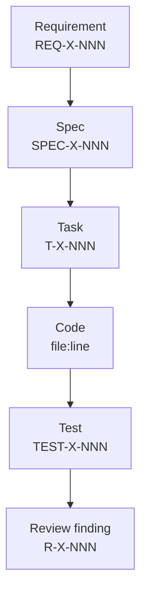

# Constitution

Governing principles for this project. Loaded ahead of every workflow command. **Override only with explicit human approval and a recorded ADR.**

> **Version:** 0.1 — Foundation. Refine this file as the project matures; constitution changes themselves should be ADR-tracked.

## Article I — Spec-Driven Development

1. All implementation derives from explicit specifications.
2. Code is an artifact of the spec, not the starting point.
3. If implementation reveals a missing requirement, the spec is updated *before* the code.
4. Vague intent is a defect. Resolve it through `/spec:clarify` before proceeding.

## Article II — Separation of Concerns

Each stage has one purpose. Cross-stage shortcuts (e.g., writing code during requirements) are forbidden.

```
Idea ≠ Research ≠ Requirements ≠ Design ≠ Specification
≠ Tasks ≠ Implementation ≠ Testing ≠ Review ≠ Release ≠ Learning
```

## Article III — Incremental Progression

1. Work decomposes into the smallest verifiable steps.
2. Each step depends only on validated outputs from prior steps.
3. A stage is not "done" until its quality gate is green.

## Article IV — Quality Gates

1. Quality gates defined in `docs/quality-framework.md` are non-negotiable.
2. Errors are resolved at the **earliest** stage possible. A bug found in testing that traces to a missing requirement is a requirements defect, not a test defect.
3. Two-layer validation at every stage boundary:
   - **Deterministic checks** first (linters, schemas, tests).
   - **Critic-agent review** second (judgment-required checks).

## Article V — Traceability

Every artifact links to its inputs.



The traceability matrix in `specs/<feature>/traceability.md` is regenerable from the artifacts (document-level frontmatter plus marked-up per-item entries in body — see `docs/traceability.md`). No requirement may exist without a downstream chain by the time `/spec:review` runs.

## Article VI — Agent Specialisation

1. Each agent operates only within its defined scope (`.claude/agents/<role>.md`).
2. Agents may **escalate** but may not **invent** missing inputs.
3. Tool restrictions on agents are deliberate. Don't broaden them without an ADR.

## Article VII — Human Oversight

Humans own:
- **Intent** — what we are building and why.
- **Priorities** — what comes first.
- **Acceptance** — declaring a stage complete.

Agents support execution and surface decisions, but do not replace human judgment on these three.

## Article VIII — Plain Language

1. Artifacts are written for humans first, agents second.
2. Functional requirements use **EARS notation** (`docs/ears-notation.md`) so they map 1:1 to tests.
3. Decisions are recorded in **ADRs** (`docs/adr/`) using the active voice and the present tense.

## Article IX — Reversibility

1. Local, reversible actions (file edits, running tests) are free to attempt.
2. Irreversible or shared-state actions (deploys, deletes, force-pushes, public posts) require explicit human authorisation, scoped to the specific action.
3. When unsure, ask. The cost of asking is small; the cost of an unwanted action is large.

## Article X — Iteration

The workflow is a feedback loop, not a waterfall. Earlier stages may be revisited at any time, and changes must propagate forward consistently. The retrospective at `/spec:retro` is mandatory, not optional — even when the feature shipped cleanly.

---

## Amendment process

1. Open an ADR proposing the change with rationale and consequences.
2. Tag affected stages and templates.
3. Once accepted, update this file and bump its version. Do not edit silently.
