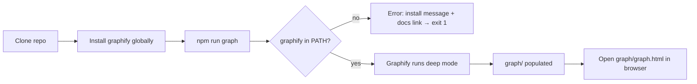
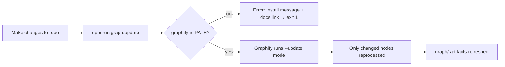
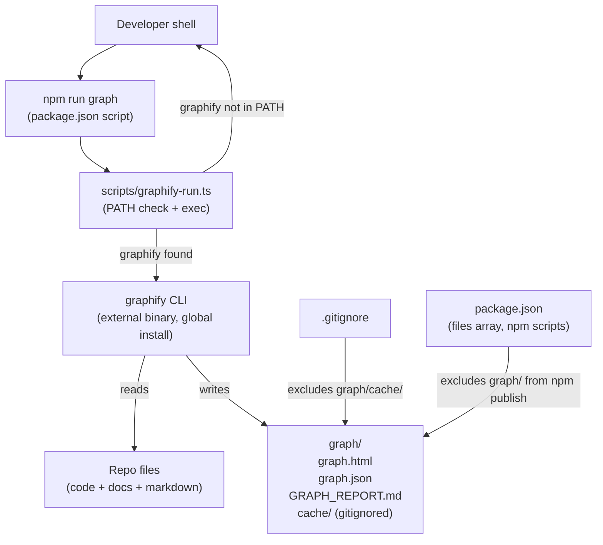

# Design — Graphify Knowledge Graph Integration

> **Collapse note:** This is a developer-tooling feature with no user-facing UI surface. All three roles (UX, UI, Architect) are collapsed into a single pass. Part B is minimal by definition.

## Context

The growing agentic-workflow codebase needs a structural navigation and discovery aid. Graphify (MIT, https://github.com/safishamsi/graphify) transforms code and Markdown into an interactive knowledge graph. The PRD asks for: committed graph artifacts browsable by any contributor; one-command full-build and incremental-update scripts; cache excluded from git and npm package; clear installation docs.

## Goals (design-level)

- D1 — Fit the tooling pattern already established in this repo (`scripts/*.ts` + `npm run *`).
- D2 — Make `graph/` a first-class, committed directory that's naturally absent from the npm package.
- D3 — Detect a missing `graphify` binary before the script fails opaquely.
- D4 — Keep graphify flags readable and maintainable (not buried as one-liners in `package.json`).

## Non-goals

- ND1 — GitHub Pages deployment of `graph.html`.
- ND2 — Graphify as an npm dependency.
- ND3 — CI graph regeneration.

---

## Part A — UX (Developer flows)

### User flows

**Flow 1 — First-time setup**



**Flow 2 — Incremental update (regular contributor)**



**Flow 3 — Browse without graphify (read-only contributor)**


### Information architecture

`graph/` lives at repo root, outside `docs/` and `sites/`. Not committed in the npm package (`files` array does not include it). Linked from:
- `docs/how-to/use-graphify.md` — installation + usage guide
- `README.md` (or repo map) — brief mention with link

### Empty / loading / error states

| State | Trigger | Prescribed behaviour |
|---|---|---|
| First run (no `graph/`) | Developer runs `npm run graph` on fresh clone | Script creates `graph/` directory; graphify populates it |
| Missing binary | `graphify` not in PATH at script start | Exit 1 with human-readable message + link to `docs/how-to/use-graphify.md` |
| Incremental without prior run | Developer runs `npm run graph:update` but no cache | Graphify falls back to full run (graphify handles this internally) |
| Stale artifacts | Committed `graph/` is behind current code | Expected; README documents that contributors should re-run `npm run graph` after significant changes |

### Accessibility considerations

N/A — this is a CLI tool integration. `graph.html` itself is graphify's output and is out of scope for accessibility requirements in this cycle.

---

## Part B — UI

### Key screens / states

| Screen / state | Purpose | Reference |
|---|---|---|
| `graph/graph.html` | Interactive knowledge graph browser | Graphify-generated; no design required |
| Terminal: missing-binary error | Informs developer of missing dependency | See microcopy below |
| Terminal: success output | Graphify's own CLI progress output | Graphify-generated; no design required |

### Components

No design-system components. Pure CLI and file-system integration.

### Tokens

None.

### Content (microcopy)

**Missing-binary error message** (REQ-GRAPH-008):

```
graphify is not installed or not in PATH.
Install it from: https://github.com/safishamsi/graphify
Then re-run: npm run graph
See also: docs/how-to/use-graphify.md
```

---

## Part C — Architecture

### System overview



### Components and responsibilities

| Component | Responsibility | Owns | Dependencies |
|---|---|---|---|
| `scripts/graphify-run.ts` | Pre-flight PATH check; exec graphify with repo-standard flags | Error message, exit code | Node.js `child_process`, graphify binary |
| `package.json` scripts | Named entry points (`graph`, `graph:update`) for developers | Script names and tsx dispatch | `scripts/graphify-run.ts` |
| `graph/` directory | Committed output store for graph artifacts | `.gitkeep` (presence marker), `graph.html`, `graph.json`, `GRAPH_REPORT.md` | graphify binary |
| `.gitignore` | Exclude per-machine cache | `graph/cache/` exclusion rule | — |
| `docs/how-to/use-graphify.md` | Installation + usage guide | Setup steps, script reference, troubleshooting | — |

### Data model

No new data model. `graph/` is an output artefact directory:

```
graph/
  graph.html          # interactive visualization (committed)
  graph.json          # queryable graph structure (committed)
  GRAPH_REPORT.md     # god-nodes + insights report (committed)
  cache/              # SHA256 per-file tracking (gitignored)
```

### Data flow

1. Developer invokes `npm run graph` or `npm run graph:update`.
2. npm dispatches `tsx scripts/graphify-run.ts [--update]`.
3. Script checks `graphify --version` via `child_process.execSync` with `stdio: 'ignore'`.
   - Not found → print message to stderr, `process.exit(1)`.
   - Found → proceed.
4. Script execs `graphify . --mode deep [--update] --output-dir graph` (or equivalent flags; exact `--output-dir` flag name confirmed at implementation against graphify CLI docs).
5. Graphify reads all repo files matching its default include pattern; excludes `node_modules`, `.worktrees`, `graph/cache`.
6. Graphify writes `graph/graph.html`, `graph/graph.json`, `graph/GRAPH_REPORT.md`, `graph/cache/`.
7. Developer opens `graph/graph.html` or commits updated artifacts.

### Interaction / API contracts

No new API contracts. Graphify is invoked as a subprocess; the contract is its CLI interface (external, MIT, not owned by this repo).

**Flag uncertainty (implementation note):** The exact flag for output directory (`--output-dir`, `--output`, `-o`) must be confirmed against graphify CLI docs or `graphify --help` before implementation. If graphify writes to CWD by default, `scripts/graphify-run.ts` runs graphify from the repo root with appropriate path flags. If no output-dir override exists, the script may `cd` into `graph/` before invoking graphify.

### Key decisions

| Decision | Choice | Why | ADR |
|---|---|---|---|
| Wrapper script vs inline flags | `scripts/graphify-run.ts` thin wrapper | Cross-platform PATH check impossible cleanly in package.json JSON; consistent with all other repo scripts (tsx scripts/*.ts pattern); keeps flags maintainable | — |
| Config encoding | npm script flags baked into wrapper (no config file) | Graphify has no native config-file support; PRD Q1 resolved as flag-only | — |
| Output directory | `graph/` at repo root | Not in `files` array → naturally excluded from npm package; avoids `.npmignore` complexity; PRD Q2 resolved | — |
| Cache exclusion strategy | `.gitignore` rule for `graph/cache/` | SHA256 tracking files are per-machine; large over time; no value in version control | — |
| Documentation location | `docs/how-to/use-graphify.md` | Consistent with existing `docs/how-to/` pattern for developer setup guides | — |

### Alternatives considered

| Alternative | Rejected because |
|---|---|
| Inline node one-liner for PATH check in package.json | Cross-platform quoting hell; unreadable; hard to maintain as flags grow |
| `pregraph` npm pre-hook | npm does not support pre-hooks for colon-scoped scripts (`pregraph:update` is not triggered automatically) |
| Committing graph output to `docs/graph/` | `docs/` is in the `files` array; would require `.npmignore` or `files` array modification; more complexity than top-level `graph/` |
| Serving graph.html via GitHub Pages | Out of scope this cycle; PRD non-goal NG1 |

### Risks

| ID | Risk | Mitigation |
|---|---|---|
| RISK-GRAPH-001 | Graphify output flags differ from assumed CLI — `--output-dir` may not exist | Confirm with `graphify --help` before writing implementation; script falls back to CWD execution if needed |
| RISK-GRAPH-002 | `graph.html` and `graph.json` grow large enough to bloat the git repo | NFR-GRAPH-005 cap of 10 MB; verify at initial commit; consider `.gitattributes` LFS if exceeded |
| RISK-GRAPH-003 | Graphify's default exclude patterns miss some large/irrelevant dirs (`.worktrees`, `graph/cache`) | Explicitly pass exclude flags in wrapper script |

### Performance, security, observability

- **Performance:** Full graph build expected under 5 minutes on this repo size (NFR-GRAPH-001). Incremental updates (cache warm) expected under 60 seconds.
- **Security:** Graphify runs locally; reads repo files; no network calls in default mode. Config contains no credentials (NFR-GRAPH-004). No new attack surface for CI (graphify not run in CI, NG2).
- **Observability:** graphify CLI outputs its own progress to stdout. No additional logging needed.

---

## Cross-cutting

### Requirements coverage

| REQ ID | Addressed in |
|---|---|
| REQ-GRAPH-001 | Arch §Key decisions — Config encoding; `scripts/graphify-run.ts` bakes all flags |
| REQ-GRAPH-002 | Arch §Data flow step 4; `npm run graph` → wrapper → `graphify . --mode deep` |
| REQ-GRAPH-003 | Arch §Data flow step 4; `npm run graph:update` → wrapper → `graphify . --update` |
| REQ-GRAPH-004 | Arch §Data model; `graph/graph.html`, `graph/graph.json`, `graph/GRAPH_REPORT.md` committed |
| REQ-GRAPH-005 | Arch §Components `.gitignore`; Arch §Key decisions — Cache exclusion |
| REQ-GRAPH-006 | Arch §Components `package.json`; `graph/` absent from `files` array |
| REQ-GRAPH-007 | Arch §Components `docs/how-to/use-graphify.md`; UX §IA |
| REQ-GRAPH-008 | Arch §Data flow step 3; UX §Empty/error states; Part B §Microcopy |
| NFR-GRAPH-001 | Arch §Performance — 5 min bound |
| NFR-GRAPH-002 | Arch §Key decisions — wrapper script handles cross-platform |
| NFR-GRAPH-003 | Arch §Key decisions — flags from graphify documented CLI |
| NFR-GRAPH-004 | Arch §Security |
| NFR-GRAPH-005 | RISK-GRAPH-002 |

### Open questions

- OQ-GRAPH-001 — Exact graphify output-dir flag name. Confirmed at implementation via `graphify --help`. Does not block spec.

---

## Quality gate

- [x] UX: primary flows mapped; IA clear; empty/loading/error states prescribed.
- [x] UI: key screens identified; design system referenced (N/A — CLI tooling only).
- [x] Architecture: components, data flow, integration points named.
- [x] Alternatives considered and rejected with rationale.
- [ ] Irreversible architectural decisions have ADRs. ← All decisions are reversible (scripts/config changes); no ADR required.
- [x] Risks have mitigations.
- [x] Every PRD requirement is addressed.
