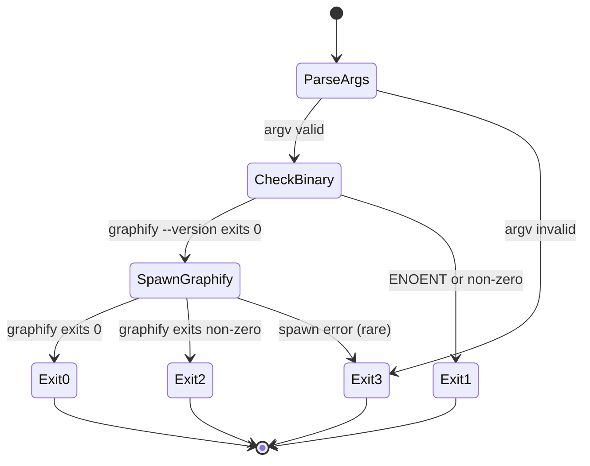

# Specification — Graphify Knowledge Graph Integration

Implementation-ready contracts for the graphify integration. Two independent implementers should produce equivalent behaviour from this spec.

## Scope

**In scope:**
- New file: `scripts/graphify-run.ts` (Node + tsx wrapper).
- Edits: `package.json` (`scripts` block — adds `graph` and `graph:update`).
- Edits: `.gitignore` (one new exclusion).
- New file: `graph/.gitkeep` (so the empty directory exists in git before first build).
- New file: `docs/how-to/use-graphify.md`.
- New file: `docs/scripts/graphify-run/README.md` (per-script doc, matches `docs/scripts/<name>/` pattern; auto-generated by `npm run docs:scripts` if applicable, otherwise hand-authored).
- First-run committed artifacts: `graph/graph.html`, `graph/graph.json`, `graph/GRAPH_REPORT.md`.

**Out of scope:**
- Modifying `package.json#files` (already excludes `graph/` by omission — to be verified, not changed).
- Any change to the `verify` gate or CI pipeline.
- Graphify CLI itself (consumed only).

---

## Interfaces

### SPEC-GRAPH-001 — `scripts/graphify-run.ts`

- **Kind:** Node CLI (executed via `tsx`)
- **Signature:**
  ```
  tsx scripts/graphify-run.ts [--update]

  Args:
    --update   Pass through to graphify as `--update` (incremental mode).
               If absent, full deep-mode build.

  Exit codes:
    0   Graphify completed successfully.
    1   Graphify binary not found in PATH (REQ-GRAPH-008).
    2   Graphify exited non-zero (binary found but failed mid-run).
    3   Internal wrapper error (unexpected; e.g., spawn failed).
  ```
- **Behaviour:**
  1. Parse argv; recognise only `--update` (any other arg → exit 3 with usage message).
  2. Check graphify availability: spawn `graphify --version` synchronously with `stdio: 'ignore'`.
     - On `ENOENT` or non-zero exit → print missing-binary message to **stderr**, exit 1.
  3. Build graphify argv:
     - Always: `['.', '--mode', 'deep', '--output-dir', 'graph', '--exclude', 'node_modules,.worktrees,graph/cache,.git']`
     - When `--update` passed: replace `--mode deep` with `--update`.
     - **Note:** Exact graphify flag names (`--output-dir`, `--exclude`) are confirmed at implementation against `graphify --help`. If `--output-dir` does not exist, the wrapper changes CWD into `graph/` and invokes graphify with the absolute repo root as the path argument. Implementer MUST document the resolved flag form in the implementation log.
  4. Spawn graphify synchronously with `stdio: 'inherit'` so the developer sees graphify's progress output live.
  5. Forward graphify's exit code: 0 → wrapper exits 0; non-zero → wrapper exits 2.
- **Pre-conditions:**
  - Node.js ≥ 20 (matches `package.json#engines`).
  - Repo root is the current working directory (npm guarantees this).
- **Post-conditions:**
  - On exit 0: `graph/graph.html`, `graph/graph.json`, `graph/GRAPH_REPORT.md` exist and were updated within the last second.
  - On any non-zero exit: no partial overwrite of artifacts beyond what graphify itself wrote before failure (wrapper does not pre-clean).
- **Side effects:**
  - Writes to `graph/` and `graph/cache/`.
  - May create `graph/cache/` if absent (graphify's responsibility).
  - Reads no config files; stores no secrets, tokens, or credentials. Wrapper passes only the documented graphify CLI flags listed in step 3 (NFR-GRAPH-003, NFR-GRAPH-004).
- **Errors:** See exit codes above. Missing-binary message text is fixed (see SPEC-GRAPH-005).
- **Satisfies:** REQ-GRAPH-002, REQ-GRAPH-003, REQ-GRAPH-004, REQ-GRAPH-008, NFR-GRAPH-002, NFR-GRAPH-003, NFR-GRAPH-004

---

### SPEC-GRAPH-002 — `npm run graph`

- **Kind:** npm script
- **Signature:**
  ```json
  "graph": "tsx scripts/graphify-run.ts"
  ```
- **Behaviour:** Dispatches to SPEC-GRAPH-001 with no `--update` flag (full deep build).
- **Pre-conditions:** None beyond SPEC-GRAPH-001.
- **Post-conditions:** Equivalent to SPEC-GRAPH-001 invoked without `--update`.
- **Side effects:** As SPEC-GRAPH-001.
- **Errors:** Forwarded from SPEC-GRAPH-001.
- **Satisfies:** REQ-GRAPH-001, REQ-GRAPH-002

---

### SPEC-GRAPH-003 — `npm run graph:update`

- **Kind:** npm script
- **Signature:**
  ```json
  "graph:update": "tsx scripts/graphify-run.ts --update"
  ```
- **Behaviour:** Dispatches to SPEC-GRAPH-001 with `--update` flag (incremental mode).
- **Pre-conditions:** None beyond SPEC-GRAPH-001. (If no prior cache exists, graphify falls back to full build internally — wrapper does not enforce.)
- **Post-conditions:** Equivalent to SPEC-GRAPH-001 invoked with `--update`.
- **Side effects:** As SPEC-GRAPH-001.
- **Errors:** Forwarded from SPEC-GRAPH-001.
- **Satisfies:** REQ-GRAPH-001, REQ-GRAPH-003

---

### SPEC-GRAPH-004 — `.gitignore` exclusion

- **Kind:** Text rule appended to repo `.gitignore`
- **Signature:**
  ```gitignore
  # Graphify cache — per-machine SHA256 tracking files (REQ-GRAPH-005).
  # See docs/how-to/use-graphify.md.
  graph/cache/
  ```
- **Behaviour:** Git ignores any file under `graph/cache/`.
- **Pre-conditions:** Standard repo `.gitignore` exists at repo root.
- **Post-conditions:** `git status` does not list anything under `graph/cache/` as untracked or modified.
- **Side effects:** None.
- **Errors:** N/A.
- **Satisfies:** REQ-GRAPH-005

---

### SPEC-GRAPH-005 — Missing-binary error message

- **Kind:** stderr output string (constant; emitted by SPEC-GRAPH-001 step 2)
- **Signature:**
  ```
  graphify is not installed or not in PATH.
  Install it from: https://github.com/safishamsi/graphify
  Then re-run: npm run graph
  See also: docs/how-to/use-graphify.md
  ```
- **Behaviour:** Exact text emitted to stderr, then `process.exit(1)`. No trailing whitespace; UTF-8; LF line endings (Node default).
- **Pre-conditions:** Graphify check failed (ENOENT or non-zero exit from `graphify --version`).
- **Post-conditions:** Process exits with code 1; nothing written to stdout.
- **Side effects:** None.
- **Errors:** N/A.
- **Satisfies:** REQ-GRAPH-008

---

### SPEC-GRAPH-006 — `docs/how-to/use-graphify.md`

- **Kind:** Markdown how-to guide
- **Required sections:**
  - Frontmatter: `title`, `folder` (`docs/how-to`), `description`, `entry_point: false`.
  - **Why graphify?** — one paragraph linking to the PRD purpose and graph.html.
  - **Install** — commands to install graphify globally; minimum version (latest stable as of integration date).
  - **Verify install** — `graphify --version`.
  - **Run** — `npm run graph` (full) and `npm run graph:update` (incremental).
  - **Browse the graph** — open `graph/graph.html` in a browser.
  - **Troubleshooting** — what the missing-binary message means; how to add graphify to PATH on macOS/Windows/Linux.
  - **Contributing back** — convention: rerun and commit `graph/` artifacts after significant structural changes.
- **Pre-conditions:** None.
- **Post-conditions:** `npm run check:links` passes; `npm run check:frontmatter` passes.
- **Side effects:** None.
- **Errors:** N/A.
- **Satisfies:** REQ-GRAPH-007

---

### SPEC-GRAPH-007 — `package.json#files` constraint

- **Kind:** package.json invariant (no edit; verification only)
- **Signature:**
  ```json
  "files": [".claude/", ".codex/", ".github/", "agents/", "docs/", "examples/",
            "memory/", "scripts/", "sites/", "templates/", "tests/",
            "AGENTS.md", "CHANGELOG.md", "CLAUDE.md", "npm-shrinkwrap.json"]
  ```
  (Current contents — `graph/` MUST be absent.)
- **Behaviour:** `npm pack --dry-run` output contains zero lines starting with `graph/`.
- **Pre-conditions:** `package.json#files` is the canonical authoritative list.
- **Post-conditions:** Verified by `npm pack --dry-run | grep -c '^graph/'` → 0.
- **Side effects:** None.
- **Errors:** If a future maintainer adds `graph/` to `files`, this invariant breaks; release-package-contents check should flag (out of scope to add the check; reuse existing if it covers).
- **Satisfies:** REQ-GRAPH-006

---

## Data structures

### `graph/` directory layout

```
graph/
  .gitkeep            # presence marker; ensures empty graph/ commits
  graph.html          # graphify-generated; binary-ish HTML; tracked
  graph.json          # graphify-generated; JSON; tracked
  GRAPH_REPORT.md     # graphify-generated; Markdown; tracked
  cache/              # graphify-generated; gitignored per SPEC-GRAPH-004
    <sha256>.json     # per-file cache entries; not tracked
```

**Validation rules:**
- `graph.html` MUST be valid HTML (browser-loadable).
- `graph.json` MUST parse as JSON (`JSON.parse` succeeds).
- `GRAPH_REPORT.md` MUST be Markdown (no specific schema beyond what graphify produces).
- Combined size of tracked files MUST be ≤ 10 MB (NFR-GRAPH-005).

### `scripts/graphify-run.ts` argv schema

```
argv: string[] = process.argv.slice(2)

Allowed shapes:
  []                  → full deep build
  ["--update"]        → incremental update

Anything else → exit 3 with usage message:
  Usage: tsx scripts/graphify-run.ts [--update]
```

---

## State transitions

Wrapper script lifecycle:



---

## Validation rules

| Input | Rule |
|---|---|
| `argv` | Must be `[]` or `["--update"]` exactly. Case-sensitive. |
| `graphify --version` exit | Code 0 = available; ENOENT or non-zero = unavailable. |
| `graph/` writability | Must be writable; if not (e.g., readonly mount), graphify will exit non-zero → wrapper exits 2. Wrapper does not pre-check. |

---

## Edge cases

| ID | Case | Expected behaviour |
|---|---|---|
| EC-GRAPH-001 | First run on fresh clone (no `graph/cache/`) | Wrapper proceeds; graphify performs full build; cache populated. |
| EC-GRAPH-002 | `npm run graph:update` on fresh clone (no cache) | Wrapper proceeds with `--update`; graphify falls back to full build internally; cache populated. |
| EC-GRAPH-003 | Graphify installed but failing PATH lookup on Windows (e.g., `.cmd` wrapper) | `child_process.spawn` with `shell: true` resolves the wrapper. Implementer uses `shell: true` on win32. |
| EC-GRAPH-004 | User passes extra args (`npm run graph -- --watch`) | npm forwards args to script; wrapper sees `--watch` in argv → exit 3 (unsupported in this spec). Future enhancement. |
| EC-GRAPH-005 | Graphify exits non-zero mid-run (e.g., out of memory) | Wrapper exits 2; partial `graph/` files may exist; user re-runs. |
| EC-GRAPH-006 | `graph/cache/` exists from prior version of graphify with different cache schema | Out of scope; graphify's responsibility. Wrapper does not migrate or clean cache. |
| EC-GRAPH-007 | Repo cloned via `git archive` (no `.git`, no `.gitignore` enforcement) | `graph/cache/` may be tracked at next commit; documented limitation in `docs/how-to/use-graphify.md` troubleshooting. |
| EC-GRAPH-008 | Combined `graph.html` + `graph.json` exceeds 10 MB | Implementation flags via warning during initial commit; out of scope to enforce automatically (RISK-GRAPH-002 mitigation). |
| EC-GRAPH-009 | Concurrent `npm run graph` invocations on same repo | Graphify's responsibility (its cache may corrupt). Wrapper does not lock. Documented in troubleshooting. |
| EC-GRAPH-010 | `.gitignore` already contains `graph/cache/` (rerun of integration) | Append step idempotent: check before append; do not duplicate. |

---

## Test scenarios

| Test ID | Scenario | Type |
|---|---|---|
| TEST-GRAPH-001 | `tsx scripts/graphify-run.ts --help` is rejected (exit 3 with usage message) | unit |
| TEST-GRAPH-002 | `tsx scripts/graphify-run.ts` with stubbed `graphify` (passes `--version`) → spawns graphify with deep flags | unit (mock spawn) |
| TEST-GRAPH-003 | `tsx scripts/graphify-run.ts --update` with stubbed graphify → spawns graphify with `--update` flag | unit (mock spawn) |
| TEST-GRAPH-004 | `tsx scripts/graphify-run.ts` with absent graphify (mocked ENOENT) → exit 1, exact stderr message | unit (mock spawn) |
| TEST-GRAPH-005 | `tsx scripts/graphify-run.ts --bad-arg` → exit 3 with usage | unit |
| TEST-GRAPH-006 | `tsx scripts/graphify-run.ts` when `graphify --version` is mocked to exit 1 → wrapper exits 1 (treats as unavailable) | unit |
| TEST-GRAPH-007 | After integration, `git status` shows nothing under `graph/cache/` | integration |
| TEST-GRAPH-008 | `npm pack --dry-run` output contains zero `graph/` entries | integration |
| TEST-GRAPH-009 | `npm run check:links` passes including `docs/how-to/use-graphify.md` | integration |
| TEST-GRAPH-010 | `npm run check:frontmatter` passes including `docs/how-to/use-graphify.md` | integration |
| TEST-GRAPH-011 | Combined `graph/graph.html` + `graph/graph.json` size ≤ 10 MB at commit | integration (size assertion) |
| TEST-GRAPH-012 | `tsx scripts/graphify-run.ts` exits 2 when stubbed graphify exits non-zero mid-run | unit (mock spawn) |

---

## Observability requirements

- **Logs:** All output is graphify's own progress (stdio inherited). Wrapper writes only the missing-binary message and the usage message — both to stderr.
- **Metrics:** None. Local dev tool, not a service.
- **Traces:** None.
- **Alerts:** None.

---

## Performance budget

| Interface | Budget | Source |
|---|---|---|
| `npm run graph` (full build) | ≤ 5 minutes on developer laptop, current repo size | NFR-GRAPH-001 |
| `npm run graph:update` (warm cache) | ≤ 60 seconds | DESIGN performance §; not a hard PRD requirement |
| Wrapper overhead before graphify spawn | ≤ 200 ms | New; rationale: PATH check is one synchronous spawn |
| Combined tracked output size (`graph.html` + `graph.json`) | ≤ 10 MB | NFR-GRAPH-005 |

---

## Compatibility

- **Backward compatibility:** N/A — net-new feature; no existing graphify integration to migrate.
- **Versioning:** Tracks graphify's CLI version. If graphify ships a breaking flag change in a future version, implementer pins minimum version in `docs/how-to/use-graphify.md` and updates wrapper.
- **Cross-platform:** macOS, Linux, Windows (PowerShell 5.1+ and 7+). Wrapper uses `child_process.spawn` with `shell: true` on win32 to resolve `.cmd` shims.
- **npm package compatibility:** Existing `@luis85/agentic-workflow` consumers see no change; `graph/` is not in `files`.

---

## Quality gate

- [x] Behaviour unambiguous.
- [x] Every interface specifies signature, behaviour, errors, side effects.
- [x] Validation rules explicit.
- [x] Edge cases enumerated.
- [x] Test scenarios derivable.
- [x] Each spec item traces to ≥ 1 requirement ID.
- [x] Observability requirements specified.
