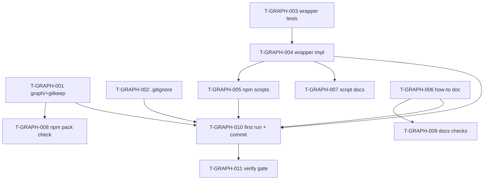

# Tasks — Graphify Knowledge Graph Integration

Each task ≤ ~½ day, has a stable ID, references ≥ 1 requirement, and has a Definition of Done.

> **TDD ordering:** test tasks for a requirement come **before** the implementation task for that requirement.

## Legend

- 🧪 = test task
- 🔨 = implementation task
- 📐 = design / scaffolding task
- 📚 = documentation task
- 🚀 = release / ops task

## Task list

### T-GRAPH-001 📐 — Create `graph/` directory with `.gitkeep`

- **Description:** Create the top-level `graph/` directory and add an empty `graph/.gitkeep` file so the directory exists in git before the first graphify run. Acts as the home for `graph.html`, `graph.json`, `GRAPH_REPORT.md` (committed) and `cache/` (gitignored).
- **Satisfies:** REQ-GRAPH-004, SPEC-GRAPH-001
- **Owner:** dev
- **Estimate:** S
- **Definition of done:**
  - [ ] `graph/` directory exists.
  - [ ] `graph/.gitkeep` is an empty file (or comment-only) tracked by git.
  - [ ] `git status` clean after add.

---

### T-GRAPH-002 📐 — Add `.gitignore` rule for `graph/cache/`

- **Description:** Append the `graph/cache/` exclusion rule (with comment referencing REQ-GRAPH-005 and the how-to doc) to the repo's `.gitignore`. Idempotent: skip if the rule already exists.
- **Satisfies:** REQ-GRAPH-005, SPEC-GRAPH-004
- **Owner:** dev
- **Estimate:** S
- **Definition of done:**
  - [ ] `.gitignore` contains the comment block + `graph/cache/` line exactly once.
  - [ ] Manual smoke: create dummy `graph/cache/foo.json`; `git status` does not list it.

---

### T-GRAPH-003 🧪 — Unit tests for `scripts/graphify-run.ts`

- **Description:** Write unit tests covering all wrapper behaviour from SPEC-GRAPH-001 + SPEC-GRAPH-005 using the existing `tsx scripts/test-scripts.ts` harness. Mock `child_process.spawnSync` so tests run without graphify installed. Tests must fail until T-GRAPH-004 lands.
- **Tests covered:** TEST-GRAPH-001 (--help reject, exit 3), TEST-GRAPH-002 (deep-mode argv), TEST-GRAPH-003 (--update argv), TEST-GRAPH-004 (missing graphify, exit 1, exact stderr message from SPEC-GRAPH-005), TEST-GRAPH-005 (--bad-arg, exit 3), TEST-GRAPH-006 (graphify --version exits 1 → wrapper exits 1), TEST-GRAPH-012 (graphify exits non-zero mid-run → wrapper exits 2).
- **Satisfies:** REQ-GRAPH-002, REQ-GRAPH-003, REQ-GRAPH-008, SPEC-GRAPH-001, SPEC-GRAPH-005
- **Owner:** qa
- **Estimate:** M
- **Definition of done:**
  - [ ] All 7 test cases exist and reference TEST-GRAPH-* IDs in their name or metadata.
  - [ ] Tests fail (red) against an absent `scripts/graphify-run.ts`.
  - [ ] Tests run via `npm run test:scripts` (or its harness).

---

### T-GRAPH-004 🔨 — Implement `scripts/graphify-run.ts`

- **Description:** Implement the wrapper per SPEC-GRAPH-001. Parse argv (only `[]` or `["--update"]` accepted; anything else → exit 3 with usage message). Run `graphify --version` synchronously with `stdio: 'ignore'`; on ENOENT or non-zero, print the SPEC-GRAPH-005 missing-binary message to stderr and `process.exit(1)`. Build graphify argv per spec step 3, with the documented exclude list. Spawn graphify synchronously with `stdio: 'inherit'`; forward exit code (0 → 0; non-zero → 2). On win32, set `shell: true` to resolve `.cmd` shims (EC-GRAPH-003). During implementation, run `graphify --help` to confirm the actual `--output-dir` and `--exclude` flag names; document the resolved form in `implementation-log.md` (resolves OQ-GRAPH-001).
- **Satisfies:** REQ-GRAPH-001, REQ-GRAPH-002, REQ-GRAPH-003, REQ-GRAPH-008, NFR-GRAPH-002, NFR-GRAPH-003, NFR-GRAPH-004, SPEC-GRAPH-001, SPEC-GRAPH-005
- **Owner:** dev
- **Depends on:** T-GRAPH-003
- **Estimate:** M
- **Definition of done:**
  - [ ] `scripts/graphify-run.ts` exists and passes `npm run typecheck:scripts`.
  - [ ] All TEST-GRAPH-001..006 + TEST-GRAPH-012 from T-GRAPH-003 pass (green).
  - [ ] OQ-GRAPH-001 resolved and noted in `implementation-log.md`.
  - [ ] Implementation log entry added.

---

### T-GRAPH-005 🔨 — Add `graph` + `graph:update` npm scripts

- **Description:** Edit `package.json#scripts` to add `"graph": "tsx scripts/graphify-run.ts"` and `"graph:update": "tsx scripts/graphify-run.ts --update"` per SPEC-GRAPH-002 and SPEC-GRAPH-003. Insert in alphabetical order with neighbouring scripts.
- **Satisfies:** REQ-GRAPH-001, REQ-GRAPH-002, REQ-GRAPH-003, SPEC-GRAPH-002, SPEC-GRAPH-003
- **Owner:** dev
- **Depends on:** T-GRAPH-004
- **Estimate:** S
- **Definition of done:**
  - [ ] `npm run graph -- --help` shows wrapper usage exit 3 (proves dispatch works without needing graphify installed).
  - [ ] `package.json` parses cleanly (`npm pkg get scripts.graph` returns the expected value).

---

### T-GRAPH-006 📚 — Write `docs/how-to/use-graphify.md`

- **Description:** Author the how-to per SPEC-GRAPH-006 with all required sections: frontmatter (`title`, `folder: docs/how-to`, `description`, `entry_point: false`), Why graphify, Install (commands + minimum version), Verify install, Run (`npm run graph` + `:update`), Browse the graph (open `graph/graph.html`), Troubleshooting (missing-binary message; PATH instructions per OS; concurrent-runs note from EC-GRAPH-009; `git archive` limitation from EC-GRAPH-007), Contributing back (rerun + commit convention).
- **Satisfies:** REQ-GRAPH-007, SPEC-GRAPH-006
- **Owner:** dev
- **Estimate:** M
- **Definition of done:**
  - [ ] File exists at `docs/how-to/use-graphify.md` with all required sections.
  - [ ] All internal links resolve (`docs/how-to/`, REQ/SPEC IDs).
  - [ ] Frontmatter passes `npm run check:frontmatter`.

---

### T-GRAPH-007 📚 — Add `docs/scripts/graphify-run/` per-script doc

- **Description:** Add per-script documentation under `docs/scripts/graphify-run/` matching the existing pattern (one folder per script in `scripts/`). Run `npm run fix:script-docs` if it auto-generates, otherwise hand-author following a sibling like `docs/scripts/check-fast/`.
- **Satisfies:** Repo convention (`check:script-docs` enforces); cross-cutting traceability for SPEC-GRAPH-001
- **Owner:** dev
- **Depends on:** T-GRAPH-004
- **Estimate:** S
- **Definition of done:**
  - [ ] `docs/scripts/graphify-run/README.md` (or auto-gen contents) exists.
  - [ ] `npm run check:script-docs` passes.

---

### T-GRAPH-008 🧪 — Integration test: `graph/` excluded from npm package

- **Description:** Add a check or test asserting that `npm pack --dry-run` output contains zero entries starting with `graph/`. Could be a new line in an existing release-package check (`scripts/check-release-package-contents.ts`) or a dedicated assertion. Verifies SPEC-GRAPH-007 invariant.
- **Tests covered:** TEST-GRAPH-008
- **Satisfies:** REQ-GRAPH-006, SPEC-GRAPH-007
- **Owner:** qa
- **Depends on:** T-GRAPH-001
- **Estimate:** S
- **Definition of done:**
  - [ ] Check exists and runs as part of (or alongside) `check:release-package-contents`.
  - [ ] Check passes against current `package.json#files`.
  - [ ] Check fails (red) if `graph/` is added to `files` array (manual verification one-shot).

---

### T-GRAPH-009 🧪 — Integration test: docs link + frontmatter checks pass

- **Description:** Run `npm run check:links` and `npm run check:frontmatter` over the new `docs/how-to/use-graphify.md`. No new test file needed — just confirm the existing checks include the new doc and pass. Captures TEST-GRAPH-009 + TEST-GRAPH-010 as a verification gate, not a new automated test.
- **Tests covered:** TEST-GRAPH-009, TEST-GRAPH-010
- **Satisfies:** REQ-GRAPH-007 (verification)
- **Owner:** qa
- **Depends on:** T-GRAPH-006
- **Estimate:** S
- **Definition of done:**
  - [ ] `npm run check:links` exits 0 with `docs/how-to/use-graphify.md` in scope.
  - [ ] `npm run check:frontmatter` exits 0 with the same in scope.

---

### T-GRAPH-010 🚀 — First graphify run; commit `graph/` artifacts; size check

- **Description:** Install graphify locally (per `docs/how-to/use-graphify.md`); run `npm run graph` from the worktree root; verify `graph/graph.html`, `graph/graph.json`, `graph/GRAPH_REPORT.md` produced; assert combined size of `graph.html + graph.json` ≤ 10 MB (NFR-GRAPH-005, TEST-GRAPH-011); confirm `git status` shows nothing under `graph/cache/` (TEST-GRAPH-007); stage + commit the three artifacts. Owner is `human` because this requires installing the external graphify binary on the contributor's machine — `/spec:implement` will halt and hand back.
- **Tests covered:** TEST-GRAPH-007, TEST-GRAPH-011
- **Satisfies:** REQ-GRAPH-004, REQ-GRAPH-005, NFR-GRAPH-001, NFR-GRAPH-005
- **Owner:** human
- **Depends on:** T-GRAPH-001, T-GRAPH-002, T-GRAPH-004, T-GRAPH-005, T-GRAPH-006
- **Estimate:** M
- **Definition of done:**
  - [ ] Three artifacts produced and tracked under `graph/`.
  - [ ] Combined size ≤ 10 MB (record actual size in `implementation-log.md`).
  - [ ] `git status` shows nothing under `graph/cache/` (gitignore working).
  - [ ] Wall-clock time of full build recorded in `implementation-log.md` for NFR-GRAPH-001 evidence.
  - [ ] Three artifacts committed.

---

### T-GRAPH-011 🧪 — Full `npm run verify` gate

- **Description:** Run the repo's full verify gate to ensure no regressions introduced by the integration. Per `feedback_verify_gate.md`: never `--no-verify`; gate green locally before push.
- **Satisfies:** REQ-GRAPH-001, REQ-GRAPH-002, REQ-GRAPH-003, NFR-GRAPH-002
- **Owner:** qa
- **Depends on:** T-GRAPH-010
- **Estimate:** S
- **Definition of done:**
  - [ ] `npm run verify` exits 0.
  - [ ] No new warnings introduced (compare against pre-integration baseline if needed).

---

## Dependency graph

## Parallelisable batches

- **Batch 1 (no deps):** T-GRAPH-001, T-GRAPH-002, T-GRAPH-003, T-GRAPH-006
- **Batch 2 (after Batch 1):** T-GRAPH-004 (needs T-003), T-GRAPH-008 (needs T-001), T-GRAPH-009 (needs T-006)
- **Batch 3 (after T-004):** T-GRAPH-005, T-GRAPH-007
- **Batch 4 (after Batch 3 + Batch 2):** T-GRAPH-010 (human)
- **Batch 5 (after T-010):** T-GRAPH-011

---

## Quality gate

- [x] Each task ≤ ~½ day (estimate S or M).
- [x] Each task has a stable ID (`T-GRAPH-001` … `T-GRAPH-011`).
- [x] Each task references ≥ 1 requirement / spec ID.
- [x] Dependencies explicit.
- [x] Each task has a Definition of Done.
- [x] TDD ordering: T-GRAPH-003 (tests) precedes T-GRAPH-004 (implementation).
- [x] Owner assigned per task (dev × 5, qa × 4, human × 1, planner-only N/A).
