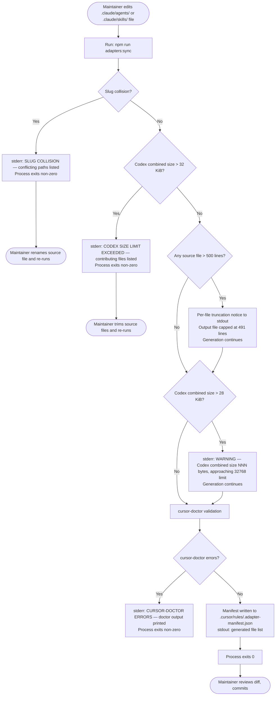
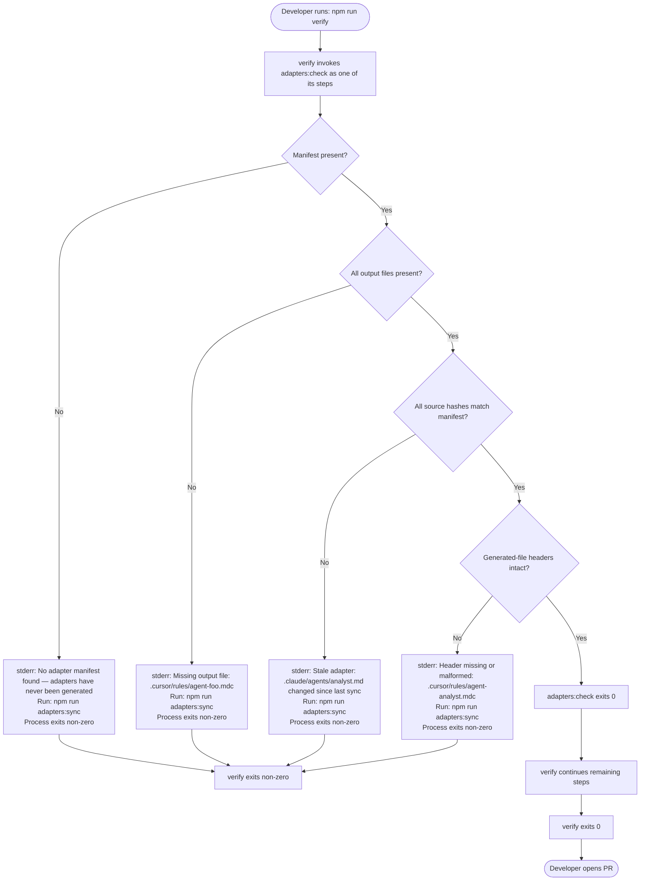
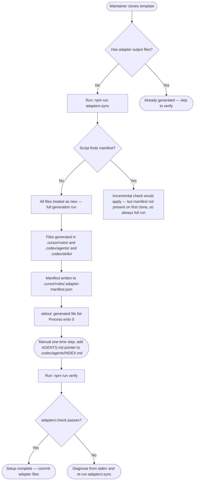
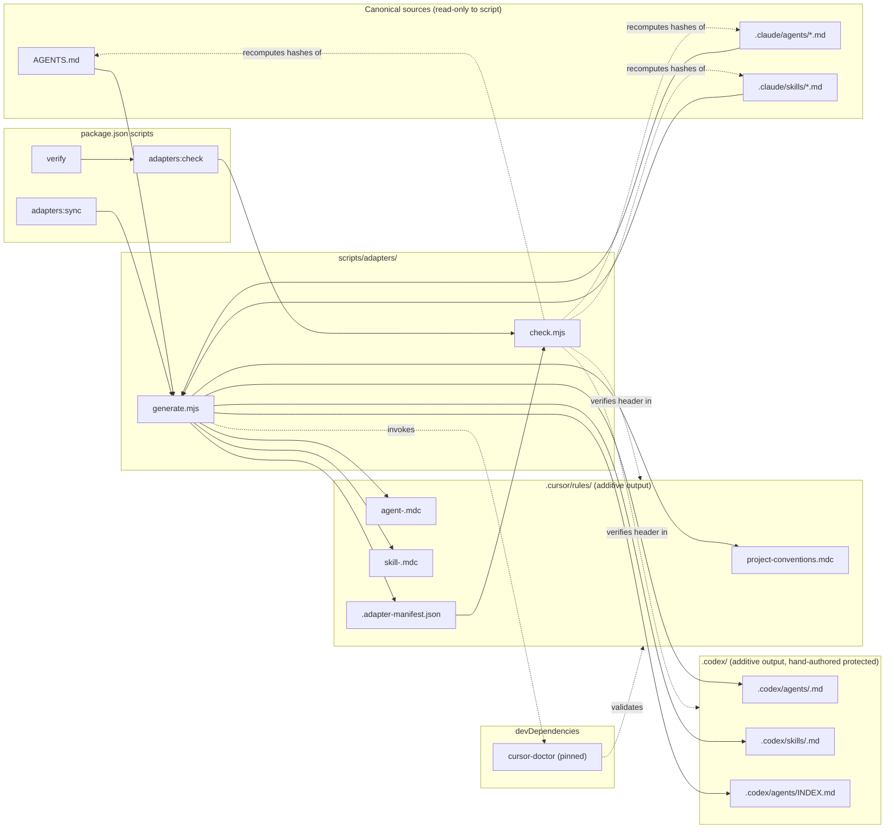

# Design — Multi-Framework Adapters

## Context

The Specorator template is Claude Code-native. Teams using Cursor or Codex must currently hand-translate `.claude/agents/` and `.claude/skills/` into framework-specific files that drift silently. This design covers the adapter generation script, drift-check mechanism, and generated file structure that converts the canonical Claude baseline into `.cursor/rules/*.mdc` and `.codex/agents/*.md` / `.codex/skills/*.md` automatically.

## Goals (design-level)

- D1. Design the developer-experience of `adapters:sync` and `adapters:check` so a maintainer can use them without reading source code.
- D2. Design the generated file structure so Cursor and Codex users receive role-scoped context on first open.
- D3. Design the manifest and check so staleness is caught by `npm run verify` on any OS and any CI/release pipeline.

## Non-goals

- ND1. Visual UI — this is a CLI/script feature; no browser or GUI surfaces.
- ND2. Two-way sync or runtime orchestration.
- ND3. CI-provider-specific files.

---

## Part A — UX

### A.1 Developer flows

#### Flow 1 — Maintainer sync flow

A maintainer has edited one or more `.claude/agents/` or `.claude/skills/` files and needs to push those changes to adapter consumers.



**What the maintainer sees at each step:**

- Before run: no feedback; the working tree just has edited source files.
- During run: no interactive prompts; the script is silent except for warnings, errors, and the final file list.
- Success: stdout lists every file written, one path per line, followed by a summary line. See A.3 for exact copy.
- Truncation warning: stdout includes a per-file notice before the file list. Generation is not aborted.
- Codex size warning: stderr includes the combined byte count and the 32 KiB ceiling. Generation is not aborted.
- Slug collision: stderr names both conflicting source paths. The process stops before writing any output. Maintainer resolves by renaming one source file.
- Codex 32 KiB exceeded: stderr names the contributing files by path and size. Process stops. Maintainer trims source content.
- cursor-doctor failure: stderr contains the raw cursor-doctor output. Process stops. Maintainer fixes the structural issue in the source file.

---

#### Flow 2 — Verify-gate flow

A developer (or CI) runs `npm run verify` before opening or merging a PR. Adapter staleness is caught here.



**Stale-adapter recovery path:**

1. `npm run verify` fails; stderr identifies which source file changed (or which output is missing).
2. Developer runs `npm run adapters:sync`.
3. Developer re-runs `npm run verify`.
4. If clean, verify exits 0 and the developer proceeds.

The recovery instruction appears in the stale-adapter message itself — no need to look up documentation.

---

#### Flow 3 — First-time setup flow

A maintainer has just cloned the Specorator template and has never run adapters. No manifest exists; no adapter output files exist.



**The manual one-time step (REQ-ADAPT-008, NG10):**

The adapter script does not modify `AGENTS.md`. After first-time generation, the maintainer must manually add a "See also" reference to `.codex/agents/INDEX.md` in `AGENTS.md`. This is a one-time human action, not automated. The adapter README documents the exact text to add. The script's success message reminds the user of this step on first run (when no prior manifest exists).

**What the maintainer sees:**
- stdout: full list of generated files.
- stdout (first-run only): reminder line — "First run: remember to add the .codex/agents/INDEX.md pointer to AGENTS.md manually. See the adapter README."
- No errors if sources are clean.

---

### A.2 Information architecture

The adapter feature adds output files at two locations in the repository tree and one manifest file. No canonical source paths are changed.

```
<repo-root>/
├── .claude/                         ← canonical source (read-only to adapter script)
│   ├── agents/
│   │   ├── analyst.md
│   │   ├── architect.md
│   │   └── ...
│   └── skills/
│       ├── verify.md
│       └── ...
├── AGENTS.md                        ← canonical source for project-conventions.mdc
│
├── .cursor/
│   └── rules/                       ← Cursor adapter output (flat, no subdirectories)
│       ├── .adapter-manifest.json   ← staleness manifest (also listed in .gitignore candidate)
│       ├── project-conventions.mdc  ← alwaysApply: true; source: AGENTS.md
│       ├── agent-analyst.mdc        ← alwaysApply: false; source: .claude/agents/analyst.md
│       ├── agent-architect.mdc
│       ├── ...
│       ├── skill-verify.mdc         ← alwaysApply: false; source: .claude/skills/verify.md
│       └── ...
│
└── .codex/
    ├── README.md                    ← hand-authored — NEVER touched by adapter script
    ├── instructions.md              ← hand-authored — NEVER touched by adapter script
    ├── workflows/                   ← hand-authored — NEVER touched by adapter script
    ├── agents/
    │   ├── INDEX.md                 ← GENERATED — lists all .codex/agents/<slug>.md paths
    │   ├── analyst.md               ← GENERATED
    │   ├── architect.md             ← GENERATED
    │   └── ...
    └── skills/
        ├── verify.md                ← GENERATED
        └── ...
```

**How a Cursor user finds their role's rule file:**

Cursor auto-loads `.mdc` files from `.cursor/rules/`. The maintainer does not need to configure anything. A Cursor user working as the analyst role will have `agent-analyst.mdc` available for manual attachment or, if `alwaysApply` were true, automatically included in context. Because `alwaysApply: false` for all agent files, users attach the relevant rule for their active role session. `project-conventions.mdc` has `alwaysApply: true` and loads automatically on every Cursor session.

**How a Codex user discovers INDEX.md:**

`.codex/agents/INDEX.md` lists the path of every generated agent file. The maintainer adds a "See also" reference to this file in `AGENTS.md` (the one-time manual step). Codex auto-loads `AGENTS.md` as part of its context model, so users encounter the pointer without needing to browse the folder structure.

**Naming convention:**

| Source path | Output path (Cursor) | Output path (Codex) |
|---|---|---|
| `AGENTS.md` | `.cursor/rules/project-conventions.mdc` | — (source is used directly) |
| `.claude/agents/<slug>.md` | `.cursor/rules/agent-<slug>.mdc` | `.codex/agents/<slug>.md` |
| `.claude/skills/<slug>.md` | `.cursor/rules/skill-<slug>.mdc` | `.codex/skills/<slug>.md` |

The `agent-` and `skill-` prefixes prevent name collisions in the flat `.cursor/rules/` directory if a skill and an agent share a base name. The Codex paths use subdirectories (`agents/` vs `skills/`) to separate them without prefixes.

---

### A.3 Empty, loading, and error states

There are no loading states in the interactive sense — both commands run to completion and print results. The following prescribes the exact terminal output for each terminal condition.

All messages must be interpretable in plain text with no colour codes. Error and warning messages go to stderr. Generated file lists and informational output go to stdout.

---

#### adapters:sync — success (all files generated cleanly)

stdout:
```
adapters:sync: generating adapter files...
  wrote .cursor/rules/project-conventions.mdc
  wrote .cursor/rules/agent-analyst.mdc
  wrote .cursor/rules/agent-architect.mdc
  wrote .cursor/rules/skill-verify.mdc
  [... one line per file written ...]
  wrote .codex/agents/INDEX.md
  wrote .cursor/rules/.adapter-manifest.json
adapters:sync: done. N files written.
```

stderr: (empty)

Exit code: 0

---

#### adapters:sync — success, first run (no prior manifest)

stdout (same as above, with one additional line after the "done" line):
```
adapters:sync: done. N files written.
First run: no prior manifest found. Remember to add the .codex/agents/INDEX.md pointer to AGENTS.md manually. See the adapter README for the exact text.
```

stderr: (empty)

Exit code: 0

---

#### adapters:sync — warning: Codex combined size exceeds 28 KiB threshold

stdout: (full generated file list as above)

stderr:
```
adapters:sync: WARNING: combined size of .codex/agents/ and .codex/skills/ is NNNN bytes, approaching the 32768-byte Codex context limit. Generation continues. Consider reducing source file sizes to avoid hitting the hard limit.
```

Exit code: 0

---

#### adapters:sync — truncation notice: source file exceeded 500 lines

stdout (inline, before the file list, one notice per truncated file):
```
adapters:sync: TRUNCATED: .claude/agents/large-agent.md exceeded 500 lines. Output .cursor/rules/agent-large-agent.mdc capped at 491 lines with truncation marker on line 491.
adapters:sync: generating adapter files...
  ...
```

stderr: (empty unless other conditions also apply)

Exit code: 0

---

#### adapters:sync — hard failure: slug collision

stdout: (nothing; no files are written before the collision is detected)

stderr:
```
adapters:sync: ERROR: slug collision detected. Two source files produce the same output name.
  .claude/agents/foo/analyst.md
  .claude/agents/bar/analyst.md
Both would produce: agent-analyst.mdc
Rename one source file to resolve the collision, then re-run npm run adapters:sync.
```

Exit code: non-zero (1)

---

#### adapters:sync — hard failure: Codex combined size exceeds 32 KiB

stdout: (nothing; no files are written)

stderr:
```
adapters:sync: ERROR: combined size of generated .codex/ files would exceed 32768 bytes (projected: NNNN bytes).
Contributing files:
  .codex/agents/large-agent.md  NNNN bytes
  .codex/agents/another-agent.md  NNNN bytes
  [... all files contributing to the total ...]
Reduce source file sizes or remove files not needed as Codex context, then re-run npm run adapters:sync.
```

Exit code: non-zero (1)

---

#### adapters:sync — hard failure: cursor-doctor structural errors

stdout: (generated file list up to the point cursor-doctor runs; cursor-doctor is invoked after all files are written)

stderr:
```
adapters:sync: ERROR: cursor-doctor reported structural errors in generated .mdc files.
--- cursor-doctor output ---
[raw cursor-doctor output here]
----------------------------
Fix the structural issues in the source files listed above, then re-run npm run adapters:sync.
```

Exit code: non-zero (1)

---

#### adapters:check — clean state

stdout:
```
adapters:check: all adapter files are up to date.
```

stderr: (empty)

Exit code: 0

---

#### adapters:check — stale: source file changed since last sync

stdout: (empty)

stderr:
```
adapters:check: STALE: the following source files have changed since the last adapters:sync run.
  .claude/agents/analyst.md
Run npm run adapters:sync to regenerate, then re-run npm run verify.
```

Exit code: non-zero (1)

---

#### adapters:check — stale: manifest absent (adapters never generated)

stdout: (empty)

stderr:
```
adapters:check: ERROR: no adapter manifest found at .cursor/rules/.adapter-manifest.json. Adapters have never been generated for this repository.
Run npm run adapters:sync to generate adapter files, then re-run npm run verify.
```

Exit code: non-zero (1)

---

#### adapters:check — stale: output file missing

stdout: (empty)

stderr:
```
adapters:check: MISSING: the following output files listed in the manifest are absent from the working tree.
  .cursor/rules/agent-analyst.mdc
Run npm run adapters:sync to regenerate, then re-run npm run verify.
```

Exit code: non-zero (1)

---

#### adapters:check — stale: generated-file header missing or malformed

stdout: (empty)

stderr:
```
adapters:check: ERROR: generated-file header is absent or malformed in the following output files.
  .cursor/rules/agent-analyst.mdc
These files may have been edited by hand. Run npm run adapters:sync to restore them to their generated state.
```

Exit code: non-zero (1)

---

### A.4 Accessibility (CLI/DX)

This feature has no browser UI. Accessibility here means machine-readability and inclusive developer experience.

**Exit codes are the primary machine-readable signal.**

| Condition | Exit code |
|---|---|
| All adapters generated or checked successfully | 0 |
| Any error (slug collision, size limit, cursor-doctor, stale, missing, malformed header) | non-zero (1) |
| Warning only (28 KiB threshold, truncation) | 0 |

Rationale: CI pipelines, `npm run verify`, and shell scripts rely on exit codes, not stderr parsing, to branch on success or failure.

**Stderr versus stdout separation.**

- Errors and warnings always go to stderr. CI systems typically surface stderr separately from stdout in logs.
- The generated file list and informational messages go to stdout, keeping stderr clean for error scanning.
- A CI job that redirects stdout to a log file will still see errors in its stderr stream.

**File paths in every error message.**

Every error message that references a file includes the repository-root-relative path of that file. This means:

- A human reading plain terminal output can immediately locate the file.
- A script parsing stderr can extract paths with a simple line pattern.
- No message says only "an error occurred" without identifying the affected artifact.

**No dependency on terminal colour codes.**

All messages are plain text. No ANSI escape sequences are used. Messages must be fully readable in:

- Terminals with colour disabled.
- CI log viewers that strip escape codes.
- Plain text files (`npm run verify > output.txt 2>&1`).
- Screen readers used by developers with visual impairments.

**Recovery instruction in every failure message.**

Every non-zero exit message ends with a concrete next action. The user does not need to look up documentation to know what to do next. Examples:

- "Run `npm run adapters:sync` to regenerate, then re-run `npm run verify`."
- "Rename one source file to resolve the collision, then re-run `npm run adapters:sync`."

**Idempotency as a DX property (REQ-ADAPT-016).**

Running `adapters:sync` twice against unchanged sources produces identical output. This means a developer who runs `adapters:sync` as a precaution before verify never introduces a diff they did not intend.

---

### A.5 Requirements coverage (Part A)

| Requirement | Where addressed in Part A |
|---|---|
| REQ-ADAPT-001 — read canonical sources | Flow 1 (maintainer sync flow): sources named |
| REQ-ADAPT-018 — write Cursor outputs | Flow 1, success state (A.3); IA (A.2) |
| REQ-ADAPT-019 — write Codex outputs | Flow 1, success state (A.3); IA (A.2) |
| REQ-ADAPT-002 — Cursor file format | Part C; format prescribed in A.2 naming table |
| REQ-ADAPT-003 — alwaysApply false for agent rules | IA (A.2): Cursor user discovery note |
| REQ-ADAPT-020 — alwaysApply false for skill rules | IA (A.2): naming table |
| REQ-ADAPT-021 — alwaysApply true for project-conventions | IA (A.2): "Cursor user finds their role" note |
| REQ-ADAPT-004 — agent file naming | IA (A.2): naming table |
| REQ-ADAPT-022 — skill file naming | IA (A.2): naming table |
| REQ-ADAPT-023 — conventions file naming | IA (A.2): naming table |
| REQ-ADAPT-024 — flat layout constraint | IA (A.2): folder tree diagram |
| REQ-ADAPT-025 — slug collision detection | Flow 1 (collision branch); A.3 (hard failure: slug collision) |
| REQ-ADAPT-005 — 500-line truncation | Flow 1 (truncation branch); A.3 (truncation notice) |
| REQ-ADAPT-006 — generated file header | IA (A.2): GENERATED labels; A.3 (header integrity messages) |
| REQ-ADAPT-007 — Codex idempotent overwrite | A.4 (idempotency note) |
| REQ-ADAPT-026 — hand-authored file protection | IA (A.2): "NEVER touched" labels |
| REQ-ADAPT-008 — Codex INDEX.md + manual AGENTS.md step | Flow 3 (first-time setup); A.3 (first-run reminder) |
| REQ-ADAPT-009 — Codex 28 KiB warning | Flow 1 (warning branch); A.3 (warning state) |
| REQ-ADAPT-027 — Codex 32 KiB hard limit | Flow 1 (hard failure branch); A.3 (hard failure: size exceeded) |
| REQ-ADAPT-010 — drift detection manifest | Flow 1 (manifest written in success path); IA (A.2) |
| REQ-ADAPT-011 — drift check command | Flow 2 (verify-gate flow); A.3 (all adapters:check states) |
| REQ-ADAPT-012 — drift check wired into verify | Flow 2: verify invokes adapters:check |
| REQ-ADAPT-013 — cursor-doctor validation | Flow 1 (cursor-doctor validation step); A.3 (hard failure: cursor-doctor) |
| REQ-ADAPT-015 — header integrity check | Flow 2 (header check step); A.3 (header missing/malformed state) |
| REQ-ADAPT-016 — idempotent generation | A.4 (idempotency as a DX property) |
| REQ-ADAPT-017 — no non-deterministic content | A.4 (idempotency note): user never sees an unintended diff |
| NFR-ADAPT-001 — check ≤ 5 s | Part C (performance); A.4: no interactive prompts that would inflate wall time |
| NFR-ADAPT-002 — sync ≤ 30 s | Part C (performance); A.4: no interactive prompts |
| NFR-ADAPT-003 — cross-platform | A.3: plain-text output; A.4: no ANSI codes, no OS-specific path separators in messages |
| NFR-ADAPT-004 — idempotency | A.4 |
| NFR-ADAPT-005 — header in 100% of generated files | A.3 (header integrity); IA (A.2) |
| NFR-ADAPT-006 — no runtime dependencies | Part C |
| NFR-ADAPT-007 — zero cursor-doctor errors | Flow 1; A.3 |

---

## Part B — UI

### B.1 Key screens / states

For a CLI/script feature, "screens" are the distinct terminal states a developer may encounter plus the human-readable file surfaces encountered in their editor. Each row below names the state, its purpose, and notes on the format that a reader or script encounters.

| Terminal state / file | Purpose | Format notes |
|---|---|---|
| `adapters:sync` — success (all files generated cleanly) | Confirms to the maintainer that all adapter files were produced; lists every output path so the diff is predictable | stdout only. Preamble line, then indented file list (two-space indent, `wrote` verb), then single summary line. See exact copy in B.4. |
| `adapters:sync` — success, first run (no prior manifest) | Identical to normal success plus a one-line human reminder about the manual AGENTS.md pointer step | Extra line appended after the summary line on stdout; no change to stderr. First-run is detected by absence of a prior manifest. |
| `adapters:sync` — truncation notice (source file > 500 lines) | Warns maintainer that a specific source file was capped; names the output file and the line at which truncation occurred | stdout, printed before the file list so the truncation is visible before output paths. One notice per truncated file. |
| `adapters:sync` — warning: Codex combined size > 28 KiB | Alerts maintainer that the Codex context budget is being approached; generation continues | stderr. Single line including the actual byte count and the 32 KiB ceiling. Exit code 0. |
| `adapters:sync` — hard failure: slug collision | Stops generation before any file is written; names both conflicting source paths and the output name they would have shared | stderr. Structured block: error line, two-space-indented paths, collision explanation, recovery instruction. Exit code 1. |
| `adapters:sync` — hard failure: Codex 32 KiB exceeded | Stops generation before any file is written; names the contributing files with projected byte sizes | stderr. Structured block: error line, labelled list of contributing files with sizes, recovery instruction. Exit code 1. |
| `adapters:sync` — hard failure: cursor-doctor errors | Generation succeeded but structural validation failed; includes verbatim cursor-doctor output so maintainer does not need to re-run the tool separately | stderr. Framed block: error line, separator, raw cursor-doctor output, separator, recovery instruction. Exit code 1. |
| `adapters:check` — clean state | Tells the developer (or CI) that all adapters are current; verify gate may proceed | stdout. Single line. Exit code 0. |
| `adapters:check` — stale: source file changed | Tells the developer which source file changed and what to do | stderr. Structured block: stale line, two-space-indented path(s), recovery instruction. Exit code 1. |
| `adapters:check` — stale: manifest absent | Tells the developer that adapters have never been generated for this repo | stderr. Single error line stating the expected manifest path, then recovery instruction. Exit code 1. |
| `adapters:check` — stale: output file missing | Names the output file(s) absent from the working tree | stderr. Structured block: missing line, two-space-indented path(s), recovery instruction. Exit code 1. |
| `adapters:check` — stale: generated-file header absent or malformed | Names the output file(s) whose header has been removed or corrupted | stderr. Structured block: error line, two-space-indented path(s), explanation, recovery instruction. Exit code 1. |
| Generated `.mdc` file (opened in Cursor) | The "screen" a Cursor user reads when they open or attach a rule | File begins with a YAML frontmatter block; body is the source agent or skill content, possibly capped at 491 lines. Truncation marker appears as a single HTML comment line at position 491 if the file was capped. |
| Generated `.codex/agents/<slug>.md` (opened in editor or by Codex) | The "screen" a Codex adopter or contributor reads when navigating to an agent definition | File begins with the HTML comment header on line 1; body is the source agent content, possibly capped. The comment is the first visual element — immediately communicating that the file is generated. |
| Generated `.codex/agents/INDEX.md` (Codex discovery index) | The file Codex encounters via the AGENTS.md pointer; lists every agent file path | File begins with the HTML comment header on line 1; body is a Markdown table with a row per agent file. |

---

### B.2 Components

For a CLI/script feature, "components" are the reusable output patterns that appear across multiple states. Every message in B.4 is assembled from these patterns.

#### Component 1 — Command-prefixed status line

Used for the preamble and summary lines in `adapters:sync` and the single output line of `adapters:check`.

Pattern: `<command>: <sentence>.`

- `<command>` is the exact npm script name being run: `adapters:sync` or `adapters:check`.
- The sentence uses present-tense active voice (e.g., "generating adapter files...", "done. N files written.", "all adapter files are up to date.").
- The trailing period is part of the sentence, not a suffix convention. The command prefix is not in brackets.
- Stream: stdout for informational lines; see individual states for error/warning assignment.

#### Component 2 — Indented file entry

Used in the file list section of `adapters:sync` success output.

Pattern: `  wrote <repo-root-relative-path>`

- Two-space indent.
- The verb `wrote` is in lower case.
- The path uses forward slashes regardless of host OS (to match repository path conventions).
- One entry per file written, including the manifest file.

#### Component 3 — WARNING line

Used for soft failures (28 KiB threshold) that do not abort generation.

Pattern: `<command>: WARNING: <sentence>.`

- Uppercase `WARNING` makes the line machine-greppable (`grep WARNING`) without ANSI codes.
- Stream: stderr.
- The sentence includes a measurement (byte count) and the ceiling value so a script or human can quantify proximity.

#### Component 4 — TRUNCATED notice line

Used when a source file exceeds 500 lines. Generation continues.

Pattern: `<command>: TRUNCATED: <sentence>.`

- Uppercase `TRUNCATED` is machine-greppable.
- Stream: stdout (this is a generation notice, not an error).
- The sentence names the source path, the output path, and the line number of the truncation marker.

#### Component 5 — ERROR block (structured)

Used for hard failures (slug collision, 32 KiB exceeded, cursor-doctor errors, manifest absent, header malformed).

Pattern:
```
<command>: ERROR: <summary sentence.>
  <supporting detail line 1>
  <supporting detail line 2>
  [...]
<Recovery instruction sentence.>
```

- Uppercase `ERROR` is machine-greppable.
- Stream: stderr.
- Supporting detail lines use two-space indent. Each line contains a file path or a key-value pair (path + size).
- The recovery instruction is not indented; it is a complete imperative sentence ending with a period.
- No blank line between the summary and the detail block; one blank line before the recovery instruction is permitted but not required — consistency within a single message matters more than consistency across messages.

#### Component 6 — STALE / MISSING block (structured)

Used for `adapters:check` non-zero states other than manifest-absent and header-malformed (which use Component 5).

Pattern:
```
<command>: STALE: <summary sentence.>     (or MISSING:)
  <file path>
Run <command-string> to <action>, then re-run <command-string>.
```

- `STALE:` or `MISSING:` in uppercase is machine-greppable.
- Stream: stderr.
- One path per line, two-space indent.
- Recovery instruction is on its own line, not indented, ending with a period.

#### Component 7 — Generated-file header (Cursor `.mdc` — frontmatter fields)

Appears in every `.mdc` file generated by `adapters:sync`. These fields appear within the YAML frontmatter block (between the opening and closing `---`).

Required custom fields (in addition to `description` and `alwaysApply`):

```yaml
x-generated: true
x-source: <repo-root-relative path of the canonical source file>
x-regenerate: "npm run adapters:sync"
```

- `x-generated: true` — boolean literal; used by `adapters:check` header-integrity check (REQ-ADAPT-015).
- `x-source` — string; the canonical source relative path (e.g., `.claude/agents/analyst.md`); enables a reader to locate the authoritative file.
- `x-regenerate` — string literal `"npm run adapters:sync"`; tells any developer who reads the file exactly what command to run instead of editing by hand.

Field order within frontmatter: `description`, `alwaysApply`, then the three `x-` fields. This order places the user-facing fields first and the generation-metadata fields last, matching the reading order of a Cursor user who opens the file to understand what the rule does before noticing the generation metadata.

#### Component 8 — Generated-file header (Codex `.md` — HTML comment)

Appears as line 1 of every `.md` file written to `.codex/agents/`, `.codex/skills/`, and `.codex/agents/INDEX.md`.

```
<!-- GENERATED — do not edit by hand. Source: <repo-root-relative-path>. Regenerate: npm run adapters:sync -->
```

- The comment must be a single line (no line breaks within the comment).
- `GENERATED` in uppercase is machine-greppable and passes the `adapters:check` header-integrity check (REQ-ADAPT-015).
- The em dash (`—`) after `GENERATED` is a visual separator; ASCII hyphen (`-`) is not a substitute — the exact character must be reproduced to satisfy the `adapters:check` pattern match.
- The `Source:` and `Regenerate:` labels follow sentence-case label conventions used elsewhere in the repository.

#### Component 9 — Truncation marker (in-file comment)

Appears as line 491 of any `.mdc` file whose source exceeded 500 lines (REQ-ADAPT-005).

```
<!-- TRUNCATED: source exceeded 500 lines -->
```

- Single HTML comment line.
- Placed after line 490 of body content; no content follows this line in the file.
- The exact text `TRUNCATED: source exceeded 500 lines` is the canonical marker string; `adapters:check` does not check for this marker, but it serves as an in-file signal for any reader who reaches the bottom of a capped file.

#### Component 10 — INDEX.md table

The body of `.codex/agents/INDEX.md` after the generated-file header comment (line 1). The table lists every generated `.codex/agents/<slug>.md` file so Codex can discover individual agent definitions.

Structure:

```markdown
# Agent index

Generated by `npm run adapters:sync`. Do not edit by hand.

| Agent | File |
|---|---|
| <slug> | [<slug>.md](<slug>.md) |
| ... | ... |
```

- The `Agent` column value is the slug (base name without extension), matching the `.claude/agents/<slug>.md` source name.
- The `File` column value is a relative Markdown link to the file within the same directory.
- Rows are sorted alphabetically by slug so the index is stable across regeneration runs (supports REQ-ADAPT-016 idempotency).
- The heading and the introductory sentence repeat the "do not edit" instruction so a reader who jumps past line 1 still sees the warning.

---

### B.3 Tokens

For a CLI/script feature, "tokens" are the canonical string constants and semantic values that all output messages, file headers, and file content decisions share. Any change to a token here propagates to the generated file content, the check logic, and the documentation.

#### Message-prefix tokens

| Token name | Value | Used in |
|---|---|---|
| `CMD_SYNC` | `adapters:sync` | All stdout/stderr lines emitted by the sync script |
| `CMD_CHECK` | `adapters:check` | All stdout/stderr lines emitted by the check script |

Messages are formatted as `<CMD>: <SEVERITY>: <sentence>` or `<CMD>: <sentence>` with no surrounding brackets. The colon after the command name is the sole separator.

#### Exit code semantics

| Condition | Exit code |
|---|---|
| All adapters generated or checked successfully (including warnings) | `0` |
| Any hard error (slug collision, 32 KiB exceeded, cursor-doctor errors, stale adapter, missing output, manifest absent, header absent or malformed) | `1` |
| Warning only (28 KiB threshold, truncation notice) | `0` |

Exit code `1` is the sole non-zero value. No exit code other than `0` or `1` is used.

#### Stream assignment

| Content | Stream |
|---|---|
| Generated file list (one `wrote` line per file) | stdout |
| Preamble line (`adapters:sync: generating adapter files...`) | stdout |
| Summary line (`adapters:sync: done. N files written.`) | stdout |
| First-run reminder | stdout |
| Truncation notice | stdout |
| Clean-state confirmation (`adapters:check: all adapter files are up to date.`) | stdout |
| All `WARNING:`, `ERROR:`, `STALE:`, `MISSING:` messages | stderr |
| cursor-doctor raw output (when framed in error block) | stderr |

#### Severity keyword tokens

| Keyword | Meaning | Exit code |
|---|---|---|
| `WARNING:` | Soft condition; generation or check proceeds; something needs attention | `0` |
| `TRUNCATED:` | Soft condition; a source file was capped; generation proceeds | `0` |
| `ERROR:` | Hard failure; process aborts or check fails | `1` |
| `STALE:` | Hard check failure; source changed without regeneration | `1` |
| `MISSING:` | Hard check failure; output file absent from working tree | `1` |

#### Generated-file marker tokens

| Token name | Value | Where used |
|---|---|---|
| `HEADER_GENERATED_FLAG` | `x-generated: true` | YAML frontmatter of every `.mdc` file (REQ-ADAPT-006) |
| `HEADER_SOURCE_FIELD` | `x-source: <path>` | YAML frontmatter of every `.mdc` file |
| `HEADER_REGENERATE_FIELD` | `x-regenerate: "npm run adapters:sync"` | YAML frontmatter of every `.mdc` file |
| `CODEX_HEADER_PREFIX` | `<!-- GENERATED — do not edit by hand.` | First token on line 1 of every `.md` file written to `.codex/` |
| `TRUNCATION_MARKER` | `<!-- TRUNCATED: source exceeded 500 lines -->` | Line 491 of any `.mdc` file whose source exceeded 500 lines |

The em dash in `CODEX_HEADER_PREFIX` is Unicode character U+2014. Scripts constructing this string must use the literal character, not two hyphens (`--`) or an en dash.

#### Numeric constants

| Constant name | Value | Meaning |
|---|---|---|
| `LINE_LIMIT_HARD` | `500` | Maximum source line count before truncation is applied |
| `LINE_CAP` | `490` | Number of body lines retained when truncation applies |
| `TRUNCATION_LINE` | `491` | Line number at which the truncation marker is placed |
| `CODEX_WARN_BYTES` | `28672` | Combined `.codex/` byte threshold triggering a WARNING |
| `CODEX_HARD_BYTES` | `32768` | Combined `.codex/` byte threshold triggering an ERROR and aborting generation |

`CODEX_HARD_BYTES` equals 32 KiB exactly (32 × 1024). `CODEX_WARN_BYTES` equals 28 KiB exactly (28 × 1024). These values must appear verbatim in error/warning messages when referencing the ceiling so a reader can cross-reference the constant without mental arithmetic.

---

### B.4 Content (microcopy)

Exact message text for every distinct terminal state. All messages follow these rules (from Part A, A.3 and A.4):

- No ANSI colour codes.
- Every error includes a repository-root-relative file path.
- Every non-zero exit message ends with a recovery instruction.
- Severity keywords (`WARNING:`, `ERROR:`, `STALE:`, `MISSING:`, `TRUNCATED:`) are always uppercase and always immediately follow the command prefix.
- Sentence case everywhere except the severity keywords and proper tokens.

---

#### B.4.1 — adapters:sync: success (all files generated cleanly)

Stream: stdout

```
adapters:sync: generating adapter files...
  wrote .cursor/rules/project-conventions.mdc
  wrote .cursor/rules/agent-analyst.mdc
  wrote .cursor/rules/agent-architect.mdc
  wrote .cursor/rules/skill-verify.mdc
  [one line per additional file written]
  wrote .codex/agents/INDEX.md
  wrote .cursor/rules/.adapter-manifest.json
adapters:sync: done. N files written.
```

`N` is the count of files written in this run (integer, no leading zero, no thousands separator). Covers REQ-ADAPT-018, REQ-ADAPT-019, REQ-ADAPT-010.

---

#### B.4.2 — adapters:sync: success, first run (no prior manifest)

Stream: stdout (appended after the summary line)

```
adapters:sync: done. N files written.
First run: no prior manifest found. Remember to add the .codex/agents/INDEX.md pointer to AGENTS.md manually. See the adapter README for the exact text.
```

The first-run reminder is a single sentence on its own line. It is not prefixed with the command name because it is a human-addressed instruction, not a machine-parseable status line. The sentence ends with a period. Covers REQ-ADAPT-008 (manual AGENTS.md step).

---

#### B.4.3 — adapters:sync: truncation notice

Stream: stdout (one line per truncated file, printed before the file list)

```
adapters:sync: TRUNCATED: .claude/agents/large-agent.md exceeded 500 lines. Output .cursor/rules/agent-large-agent.mdc capped at 491 lines with truncation marker on line 491.
```

The message names the source path, the output path, and the specific line number of the marker. Generation continues. Exit code 0. Covers REQ-ADAPT-005.

---

#### B.4.4 — adapters:sync: WARNING — Codex combined size > 28 KiB

Stream: stderr

```
adapters:sync: WARNING: combined size of .codex/agents/ and .codex/skills/ is NNNN bytes, approaching the 32768-byte Codex context limit. Generation continues. Consider reducing source file sizes to avoid hitting the hard limit.
```

`NNNN` is the projected combined byte count (integer, decimal). The ceiling value `32768` appears verbatim so a reader can cross-reference the constant. Exit code 0. Covers REQ-ADAPT-009.

---

#### B.4.5 — adapters:sync: ERROR — slug collision

Stream: stderr

```
adapters:sync: ERROR: slug collision detected. Two source files produce the same output name.
  .claude/agents/foo/analyst.md
  .claude/agents/bar/analyst.md
Both would produce: agent-analyst.mdc
Rename one source file to resolve the collision, then re-run npm run adapters:sync.
```

No files are written before this message is emitted. Exit code 1. Covers REQ-ADAPT-025.

---

#### B.4.6 — adapters:sync: ERROR — Codex combined size > 32 KiB

Stream: stderr

```
adapters:sync: ERROR: combined size of generated .codex/ files would exceed 32768 bytes (projected: NNNN bytes).
Contributing files:
  .codex/agents/large-agent.md  NNNN bytes
  .codex/agents/another-agent.md  NNNN bytes
  [one line per contributing file]
Reduce source file sizes or remove files not needed as Codex context, then re-run npm run adapters:sync.
```

`NNNN` in the summary line is the projected total. Each contributing-file line uses two-space indent and shows the projected individual size in bytes (integer, decimal). No files are written before this message is emitted. Exit code 1. Covers REQ-ADAPT-027.

---

#### B.4.7 — adapters:sync: ERROR — cursor-doctor structural errors

Stream: stderr

```
adapters:sync: ERROR: cursor-doctor reported structural errors in generated .mdc files.
--- cursor-doctor output ---
[raw cursor-doctor output, verbatim, unmodified]
----------------------------
Fix the structural issues in the source files listed above, then re-run npm run adapters:sync.
```

The cursor-doctor output is printed verbatim between the separator lines. The separator lines use a fixed-width ASCII fence (`---`) and a fixed label so a human can visually find the cursor-doctor section in a long stderr log. Files written before cursor-doctor was invoked remain on disk (cursor-doctor is invoked after all files are written per Flow 1). Exit code 1. Covers REQ-ADAPT-013.

---

#### B.4.8 — adapters:check: clean state

Stream: stdout

```
adapters:check: all adapter files are up to date.
```

Single line. Exit code 0. Covers REQ-ADAPT-011 (clean acceptance criterion).

---

#### B.4.9 — adapters:check: STALE — source file changed

Stream: stderr

```
adapters:check: STALE: the following source files have changed since the last adapters:sync run.
  .claude/agents/analyst.md
Run npm run adapters:sync to regenerate, then re-run npm run verify.
```

One indented path per changed source file. Recovery instruction ends with a period. Exit code 1. Covers REQ-ADAPT-011 (stale source acceptance criterion).

---

#### B.4.10 — adapters:check: ERROR — manifest absent

Stream: stderr

```
adapters:check: ERROR: no adapter manifest found at .cursor/rules/.adapter-manifest.json. Adapters have never been generated for this repository.
Run npm run adapters:sync to generate adapter files, then re-run npm run verify.
```

The expected manifest path is embedded in the error line so a reader can confirm they are looking in the right place. Exit code 1. Covers REQ-ADAPT-011 (manifest-absent acceptance criterion).

---

#### B.4.11 — adapters:check: MISSING — output file absent

Stream: stderr

```
adapters:check: MISSING: the following output files listed in the manifest are absent from the working tree.
  .cursor/rules/agent-analyst.mdc
Run npm run adapters:sync to regenerate, then re-run npm run verify.
```

One indented path per missing output file. Exit code 1. Covers REQ-ADAPT-011 (missing output acceptance criterion), REQ-ADAPT-015.

---

#### B.4.12 — adapters:check: ERROR — generated-file header absent or malformed

Stream: stderr

```
adapters:check: ERROR: generated-file header is absent or malformed in the following output files.
  .cursor/rules/agent-analyst.mdc
These files may have been edited by hand. Run npm run adapters:sync to restore them to their generated state.
```

One indented path per offending file. The explanatory sentence ("may have been edited by hand") tells the developer why this check exists without being accusatory. The recovery instruction is embedded in that same sentence so it reads as one natural instruction. Exit code 1. Covers REQ-ADAPT-015.

---

### B.5 Generated file structure (human-readable artifacts)

The following subsections describe the exact structure of each generated file type as it appears to a reader. These are the "visual design" decisions for a CLI feature — what a Cursor or Codex user actually reads.

#### B.5.1 — Cursor `.mdc` file structure

A reader opening `agent-analyst.mdc` in any text editor or Cursor's rule inspector sees:

```
---
description: <one-sentence description of the agent role derived from the source file>
alwaysApply: false
x-generated: true
x-source: .claude/agents/analyst.md
x-regenerate: "npm run adapters:sync"
---

[body: full content of .claude/agents/analyst.md, up to 490 lines]
```

For `project-conventions.mdc` (derived from `AGENTS.md`):

```
---
description: Project-wide operating conventions for all agent roles.
alwaysApply: true
x-generated: true
x-source: AGENTS.md
x-regenerate: "npm run adapters:sync"
---

[body: full content of AGENTS.md, up to 490 lines]
```

For a file whose source exceeded 500 lines:

```
---
description: <description>
alwaysApply: false
x-generated: true
x-source: .claude/agents/large-agent.md
x-regenerate: "npm run adapters:sync"
---

[lines 1–490 of source content]
<!-- TRUNCATED: source exceeded 500 lines -->
```

The frontmatter block is always present and always first. The `description` value is derived from the first non-empty heading or the first sentence of the source file's purpose statement. If neither is present, the description defaults to `"<slug> agent definition."` (where `<slug>` is the file's base name without extension). This fallback is always a non-empty string, satisfying REQ-ADAPT-002 and REQ-ADAPT-003/b.

#### B.5.2 — Codex `.md` file structure (agents and skills)

A reader opening `.codex/agents/analyst.md` sees:

```
<!-- GENERATED — do not edit by hand. Source: .claude/agents/analyst.md. Regenerate: npm run adapters:sync -->

[body: full content of .claude/agents/analyst.md, up to 490 lines; truncation marker on file line 493 if capped]
```

Line 1 is always the HTML comment. Line 2 is always a blank line (the blank line separates the comment from the body content, improving readability in Markdown renderers that do not suppress HTML comment rendering). Body content begins on line 3. When truncation applies, the file lines decompose as: line 1 = HTML comment header; line 2 = blank; lines 3–492 = body (490 source lines max); line 493 = truncation marker. Total file length when capped is 493 lines.

For a truncated Codex file, the truncation marker appears after line 490 of body content:

```
<!-- GENERATED — do not edit by hand. Source: .claude/agents/large-agent.md. Regenerate: npm run adapters:sync -->

[lines 1–490 of source content]
<!-- TRUNCATED: source exceeded 500 lines -->
```

#### B.5.3 — INDEX.md structure

`.codex/agents/INDEX.md` is the discovery entry point for Codex. A reader sees:

```
<!-- GENERATED — do not edit by hand. Source: .claude/agents/ (all files). Regenerate: npm run adapters:sync -->

# Agent index

Generated by `npm run adapters:sync`. Do not edit by hand.

| Agent | File |
|---|---|
| analyst | `analyst.md` |
| architect | `architect.md` |
| [additional rows, sorted alphabetically by slug] |
```

The `x-source` value for INDEX.md is `.claude/agents/ (all files)` because INDEX.md has multiple source files. The table is sorted alphabetically by the `Agent` column so the output is stable across regeneration runs (REQ-ADAPT-016). Relative links in the `File` column point to files within the same `.codex/agents/` directory, requiring no path prefix.

---

### B.6 Accessibility (Part B — UI level)

Part A (A.4) establishes the accessibility contract at the DX level. Part B adds the following UI-level notes:

**Contrast and colour independence.** No ANSI colour codes are used. All severity signals are conveyed by the uppercase keyword (`WARNING:`, `ERROR:`, `STALE:`, `MISSING:`, `TRUNCATED:`) rather than by colour. A developer using a monochrome terminal, a screen reader, or a piped log file receives equivalent information to a developer with full colour support.

**Label clarity in generated files.** The `x-regenerate` frontmatter field and the `Regenerate:` label in the HTML comment use imperative phrasing that tells the reader exactly what to do, not just that the file is generated. The `x-source` field and `Source:` label give the reader the canonical location without requiring navigation.

**No information conveyed by position alone.** The generated-file header is always on line 1 (`.md` files) or in the frontmatter (`.mdc` files). The recovery instruction is always the last line of any error block. These positional conventions are reinforced by the text content of the message, so a reader who skips to the last line still finds actionable guidance.

**Screen-reader-safe separator lines.** The cursor-doctor error frame uses plain ASCII fences (`--- cursor-doctor output ---`) rather than Unicode box-drawing characters, which some screen readers vocalise unpredictably.

**INDEX.md table structure.** The Markdown table in INDEX.md uses a two-column structure with explicit header labels (`Agent`, `File`) so any Markdown renderer or screen reader can identify column intent. The relative links in the `File` column are descriptive (`analyst.md`) rather than generic (`click here`).

---

### B.7 Requirements coverage (Part B)

| Requirement | Where addressed in Part B |
|---|---|
| REQ-ADAPT-002 — Cursor file format (frontmatter fields) | B.2 Component 7 (frontmatter field list and order); B.5.1 (file structure) |
| REQ-ADAPT-003 — alwaysApply false for agent rules | B.5.1 (agent file structure example) |
| REQ-ADAPT-020 — alwaysApply false for skill rules | B.5.1 (file structure; skill files follow same pattern) |
| REQ-ADAPT-021 — alwaysApply true for project-conventions | B.5.1 (project-conventions.mdc example) |
| REQ-ADAPT-025 — slug collision detection | B.3 (exit code tokens); B.4.5 (exact error message) |
| REQ-ADAPT-005 — 500-line truncation | B.2 Component 9 (truncation marker); B.3 (numeric constants); B.4.3 (truncation notice); B.5.1, B.5.2 (file structure with truncation) |
| REQ-ADAPT-006 — generated file header | B.2 Components 7 and 8 (header definitions); B.5.1, B.5.2 (file structure) |
| REQ-ADAPT-008 — Codex INDEX.md and first-run reminder | B.4.2 (first-run message); B.5.3 (INDEX.md structure) |
| REQ-ADAPT-009 — 28 KiB warning | B.3 (CODEX_WARN_BYTES token); B.4.4 (warning message) |
| REQ-ADAPT-027 — 32 KiB hard limit | B.3 (CODEX_HARD_BYTES token); B.4.6 (error message) |
| REQ-ADAPT-011 — adapters:check all states | B.4.8–B.4.12 (all check state messages) |
| REQ-ADAPT-013 — cursor-doctor validation | B.4.7 (cursor-doctor error block) |
| REQ-ADAPT-015 — header integrity check | B.4.12 (header absent/malformed message) |
| REQ-ADAPT-016 — idempotent generation | B.5.3 (INDEX.md sorted alphabetically for stable output) |
| REQ-ADAPT-017 — no non-deterministic content | B.5.1, B.5.2 (no timestamp or process data in file bodies) |
| NFR-ADAPT-003 — cross-platform | B.3 (stream assignment; no ANSI codes); B.6 (accessibility: no colour dependency) |
| NFR-ADAPT-005 — header in 100% of generated files | B.2 Components 7 and 8 (both header forms defined) |
| NFR-ADAPT-007 — zero cursor-doctor errors | B.2 Component 7 (frontmatter field order and completeness) |

---

## Part C — Architecture

### C.1 System overview

The adapter pipeline is a one-directional file transform. Canonical Claude-baseline files are read by `generate.mjs`, transformed into Cursor `.mdc` and Codex `.md` outputs, and recorded in a hash manifest. `check.mjs` reads the manifest and recomputes hashes to detect drift. Both scripts run under the existing Node.js toolchain; no network, no database, no runtime services.



The dotted edges are read-only operations (hash recomputation, structural validation). Solid edges are write operations. No solid edge points into the `CANON` subgraph — this is the additive-only property formalised by ADR-0029.

---

### C.2 Components and responsibilities

Each component owns a single responsibility. Cross-component coordination happens through the manifest and through process exit codes only.

| Component | Responsibility | Owns | Dependencies |
|---|---|---|---|
| `scripts/adapters/generate.mjs` | One-directional generation: parse canonical sources, render output templates, write outputs, invoke `cursor-doctor`, write manifest | The full set of writes to `.cursor/rules/` and the additive subset of `.codex/` (`agents/<slug>.md`, `agents/INDEX.md`, `skills/<slug>.md`); the manifest schema construction; the truncation marker insertion; the slug-collision check; the Codex-size accounting | Node.js LTS built-ins (`fs/promises`, `crypto`, `path`); a small YAML parser (e.g., `js-yaml` already commonly used); `cursor-doctor` invoked as a subprocess; ADR-0028 (canonical source set); ADR-0029 (additive-only output set) |
| `scripts/adapters/check.mjs` | Drift detection only: read manifest, recompute source hashes, verify output paths exist, verify generated headers present | Manifest read parsing; hash comparison logic; output-path existence checks; header-presence regex (one for `x-generated: true` in YAML, one for the `<!-- GENERATED — ` line-1 prefix) | Node.js LTS built-ins (`fs/promises`, `crypto`); the manifest written by `generate.mjs` |
| `.cursor/rules/.adapter-manifest.json` | Single source of truth for what was generated and from what; the staleness oracle | Schema (REQ-ADAPT-010): `{"generated_at": "<ISO-8601>", "script_hash": "<sha256>", "sources": [{"path": "<rel-path>", "sha256": "<hash>"}], "outputs": ["<rel-path>"]}` | Written by `generate.mjs`; read by `check.mjs`; committed to the repository |
| `cursor-doctor` (pinned `devDependency`) | Structural validation of generated `.mdc` files (frontmatter present, `alwaysApply` valid, body non-empty, globs syntactically valid) | None of the file content; only validation outcome (exit code + diagnostic text) | npm registry; pinned version recorded in `package.json` |
| `package.json` scripts (`adapters:sync`, `adapters:check`, `verify`) | Wire the two scripts into the existing developer workflow | The `npm` command surface only; scripts are thin wrappers that invoke `node scripts/adapters/generate.mjs` and `node scripts/adapters/check.mjs` | Existing `verify` script composition (adapters:check is appended as one step, in addition order chosen so it fails fast before slower checks) |

**Boundary notes.**

- `generate.mjs` and `check.mjs` share zero mutable state. They communicate only through the manifest file and through the filesystem. This means a partial sync (e.g., generation succeeds but cursor-doctor fails after some files are written) leaves the manifest unwritten; `check.mjs` will then fail with the manifest-absent message until a successful sync rewrites it.
- `cursor-doctor` runs after all output files are written but before the manifest is written. If it fails, no manifest is produced. This sequencing means a `cursor-doctor` failure cannot leave the repo in a "stale according to manifest" state; the only follow-up is to fix the source and re-run.

---

### C.3 Data model

This is a file-transform pipeline. There is no database. Three structured artifacts are produced; their exact shapes are normative.

#### C.3.1 — Manifest JSON schema (REQ-ADAPT-010)

```json
{
  "generated_at": "<ISO-8601 timestamp, UTC, e.g. 2026-05-03T14:22:01.000Z>",
  "script_hash": "<SHA-256 hex digest of scripts/adapters/generate.mjs>",
  "sources": [
    { "path": "AGENTS.md", "sha256": "<64-hex>" },
    { "path": ".claude/agents/analyst.md", "sha256": "<64-hex>" }
  ],
  "outputs": [
    ".cursor/rules/project-conventions.mdc",
    ".cursor/rules/agent-analyst.mdc",
    ".codex/agents/analyst.md",
    ".codex/agents/INDEX.md"
  ]
}
```

Constraints:

- `generated_at` is ISO-8601 with millisecond precision, UTC (`Z` suffix). Exempted from REQ-ADAPT-017 idempotency by the PRD note; not used in hash comparisons.
- `script_hash` is the SHA-256 of `scripts/adapters/generate.mjs` at the time of generation. This guards against template-change drift (research Q4 mitigation).
- `sources[]` is sorted lexicographically by `path` for stable diffs across runs (REQ-ADAPT-016).
- `sources[]` includes every `.md` file under `.claude/agents/`, every `.md` file under `.claude/skills/`, and `AGENTS.md`. The script file is recorded in `script_hash`, not in `sources[]`.
- `outputs[]` is sorted lexicographically for stable diffs.
- No additional top-level keys are permitted (REQ-ADAPT-010 acceptance criterion).

#### C.3.2 — Cursor `.mdc` frontmatter schema (REQ-ADAPT-002, REQ-ADAPT-006)

Every generated `.mdc` file begins with a YAML frontmatter block of this exact shape, in this exact field order (matches Part B Component 7):

```yaml
---
description: <non-empty string>
alwaysApply: <boolean>
x-generated: true
x-source: <repo-root-relative path of canonical source>
x-regenerate: "npm run adapters:sync"
---
```

Field rules:

| Field | Type | Validation |
|---|---|---|
| `description` | string | Non-empty; derived from source heading or first sentence; falls back to `"<slug> agent definition."` if neither exists (Part B B.5.1) |
| `alwaysApply` | boolean | `true` only for `project-conventions.mdc`; `false` for every other generated file (REQ-ADAPT-003/b/c) |
| `x-generated` | boolean literal | Always `true`; used by the header-integrity check |
| `x-source` | string | Repo-root-relative path with forward slashes regardless of OS; one of: `AGENTS.md`, `.claude/agents/<slug>.md`, `.claude/skills/<slug>.md` |
| `x-regenerate` | string literal | Always `"npm run adapters:sync"` (with double quotes in the YAML) |

No other frontmatter keys (notably, no `globs`) are written by the generator. cursor-doctor validates this shape end-to-end.

#### C.3.3 — Codex `.md` HTML comment header schema (REQ-ADAPT-006)

Every generated `.md` file under `.codex/agents/`, `.codex/skills/`, and `.codex/agents/INDEX.md` has line 1 of the form:

```
<!-- GENERATED — do not edit by hand. Source: <repo-root-relative path>. Regenerate: npm run adapters:sync -->
```

Constraints:

- Single line, no internal line breaks.
- The em dash after `GENERATED` is U+2014 (one Unicode codepoint), not two ASCII hyphens. The header-integrity check matches the literal byte sequence including this codepoint.
- Line 2 is always blank (improves rendering in Markdown viewers that do not suppress HTML comments — Part B B.5.2).
- Body content begins on line 3 (or the truncation marker on line 491 if applicable for a `.mdc`; for `.md` Codex files, truncation marker placement follows the same source-line-490 convention).

#### C.3.4 — Truncation marker (REQ-ADAPT-005)

A single literal line:

```
<!-- TRUNCATED: source exceeded 500 lines -->
```

Placed at line 491 of `.mdc` files whose source exceeded 500 lines. No content follows.

---

### C.4 Data flow

#### C.4.1 — `adapters:sync` flow

End-to-end behaviour for `npm run adapters:sync`. Every step has a defined failure mode aligned with the messages in Part A A.3 and Part B B.4. Steps execute strictly in this order; a non-zero exit at any step skips remaining steps. Steps 3–8 run entirely in memory — no file is written to disk until the validation gates in steps 2 and 8 have passed. This ordering removes the need for any rollback path.

1. **Read sources.** Enumerate `.md` files under `.claude/agents/`, `.md` files under `.claude/skills/`, and `AGENTS.md`. For each, parse YAML frontmatter (if present) to extract any source-level metadata; capture the slug as the file's base name without extension. Read full file contents into memory.
2. **Slug-collision check.** Build a map of slug → source path within each of the two source roots (`agents/`, `skills/`). If any slug maps to more than one path within the same root, exit non-zero with the structured ERROR block in Part B B.4.5. No outputs are written.
3. **Render Cursor `.mdc` outputs (in memory).** For each `.claude/agents/<slug>.md`: build the in-memory string for `.cursor/rules/agent-<slug>.mdc` with frontmatter per C.3.2 (`alwaysApply: false`) plus body. For each `.claude/skills/<slug>.md`: build the in-memory string for `.cursor/rules/skill-<slug>.mdc` similarly. Apply 500-line truncation per REQ-ADAPT-005 with marker per C.3.4 if a source exceeds 500 lines (queue truncation notice for stdout emission at step 9 — or emit immediately, both are equivalent because no disk state has changed yet).
4. **Render `project-conventions.mdc` (in memory).** From `AGENTS.md`: build the in-memory string for `.cursor/rules/project-conventions.mdc` with `alwaysApply: true` (the only generated file with this value).
5. **Render Codex agent outputs (in memory).** For each `.claude/agents/<slug>.md`: build the in-memory string for `.codex/agents/<slug>.md` with the HTML comment header per C.3.3 plus body (capped at 490 source lines + truncation marker on file line 493 when capped, per Part B B.5.2 — file line 1 = HTML comment header, line 2 = blank, lines 3–492 = body (490 source lines max), line 493 = truncation marker).
6. **Render Codex skill outputs (in memory).** For each `.claude/skills/<slug>.md`: build the in-memory string for `.codex/skills/<slug>.md` similarly.
7. **Render `.codex/agents/INDEX.md` (in memory).** Build alphabetically sorted Markdown table of `(slug, file-link)` rows per Part B B.5.3.
8. **Codex combined-size accounting (in memory, pre-write).** Compute `Buffer.byteLength(content, 'utf8')` for every Codex output rendered in steps 5–7 (i.e., everything destined for `.codex/agents/` and `.codex/skills/`, including `INDEX.md`). Sum the byte sizes. If sum > `CODEX_HARD_BYTES` (32768), exit non-zero with the ERROR block per Part B B.4.6. **No files have been written yet, so no rollback is required** — the script exits before any disk writes. If sum > `CODEX_WARN_BYTES` (28672), emit the WARNING per Part B B.4.4 and continue.
9. **Write rendered outputs to disk.** With all validation gates passed, write every in-memory rendered string from steps 3–7 to its destination path. Emit the truncation notice per Part B B.4.3 (one line per truncated file) and the file-list lines per Part B B.4.1 to stdout as files are written (or buffer and emit at step 12; both are observably equivalent).
10. **Invoke `cursor-doctor`.** Spawn `cursor-doctor` as a subprocess with `.cursor/rules/` as its target. If exit code is non-zero, emit the framed ERROR block per Part B B.4.7 and exit non-zero. Generated `.mdc` files remain on disk for inspection; manifest is not written.
11. **Compute hashes and write manifest.** SHA-256 of every source file (sorted by path), SHA-256 of `scripts/adapters/generate.mjs` itself. Write `.cursor/rules/.adapter-manifest.json` per C.3.1.
12. **Print summary.** stdout per Part B B.4.1 (or B.4.2 for first-run case where no prior manifest existed at step 1). Exit 0.

#### C.4.2 — `adapters:check` flow

End-to-end behaviour for `npm run adapters:check`. Designed to run inside `npm run verify` and complete in ≤5 seconds (NFR-ADAPT-001).

1. **Read manifest.** Load `.cursor/rules/.adapter-manifest.json`. If absent, emit the ERROR per Part B B.4.10 and exit non-zero.
2. **Verify outputs exist.** For each path in `outputs[]`, verify the file exists on disk. If any are absent, emit the MISSING block per Part B B.4.11 listing all absent paths and exit non-zero.
3. **Recompute source hashes.** For each entry in `sources[]`, read the file at `path`, compute SHA-256, compare to the stored `sha256`. Also recompute the SHA-256 of `scripts/adapters/generate.mjs` and compare to `script_hash`. Collect every mismatch.
4. **Report stale sources.** If any hash mismatched, emit the STALE block per Part B B.4.9 listing all changed source paths (and a synthetic "scripts/adapters/generate.mjs" entry if the script hash changed) and exit non-zero.
5. **Verify header presence.** For each path in `outputs[]`: if path ends in `.mdc`, parse frontmatter and assert `x-generated: true` is present; if path ends in `.md`, read line 1 and assert it begins with the literal `<!-- GENERATED — do not edit by hand. Source: ` prefix. Collect failures.
6. **Report header failures.** If any header was absent or malformed, emit the ERROR per Part B B.4.12 listing all offending paths and exit non-zero.
7. **Clean exit.** stdout per Part B B.4.8. Exit 0.

#### C.4.3 — Atomicity and partial-failure semantics

Sync is not transactional at the filesystem level (Node.js `fs/promises` does not provide multi-file commit). Two design choices keep the visible behaviour correct:

- **Manifest as commit marker.** The manifest is the last file written. `adapters:check` failing because the manifest is absent is interpreted by users as "the last sync did not complete cleanly" — recovery is always to re-run `adapters:sync`.
- **Pre-write validation.** Slug collisions (step 2) and Codex size projections (step 8) are computed on in-memory rendered content before any output file is written. The most common error modes (slug collision, 32-KiB hard limit) therefore exit before any disk write occurs and require no rollback. cursor-doctor (step 10) runs after writes but before the manifest, so a cursor-doctor failure leaves the user with files but no manifest; the next clean sync run rewrites all outputs deterministically (REQ-ADAPT-016).
- **No deletion.** The script does not delete files. A stale output file (e.g., a `.cursor/rules/agent-old.mdc` whose source was removed from `.claude/agents/`) will not appear in `outputs[]`, will not pass the header-integrity allowlist enforced by ADR-0029 compliance, and will surface as a manual cleanup task. Out of scope for v1; tracked as a known limitation in C.6 risks.

---

### C.5 Key decisions

Decisions that constrain future implementation. Each row is paired with an ADR if architecturally load-bearing.

| Decision | Choice | Why | ADR |
|---|---|---|---|
| Canonical source for adapters | Claude baseline (`.claude/agents/*.md`, `.claude/skills/*.md`, `AGENTS.md`) | Aligns with how Specorator is built; one-hop trace; no migration cost; alternatives (intermediate format, peer sync) introduce schema and conflict-resolution overhead disproportionate to scope | [ADR-0028](../../docs/adr/0028-claude-baseline-as-canonical-source-for-adapters.md) |
| Adapter pipeline boundary | Additive-only over canonical and hand-authored files | Bounds blast radius of script bugs to additive output paths; satisfies CLAR-016 blocker resolution; recovery is mechanical (delete + regenerate) | [ADR-0029](../../docs/adr/0029-adapter-pipeline-additive-only.md) |
| Template engine | None — Node.js template literals | Scope is two output formats; template engine adds dependency, abstraction, and a format to learn; if scope expands to Aider+Copilot, a future ADR can introduce a template engine then. Research Alternative A. | — (reversible; not load-bearing) |
| Sync trigger | On-demand only (`npm run adapters:sync`); no pre-commit hook | `--no-verify` is denied by `.claude/settings.json`; verify-gate already runs `adapters:check`; pre-commit adds latency without strengthening the guarantee. Research Q3 verdict. | — (reversible) |
| Drift detection method | Hash-based manifest, not regenerate-and-compare | Hash-based ≤5s; regenerate-and-compare adds full sync cost to every verify run; template-change drift is mitigated by including `script_hash` in the manifest. Research Q4 verdict. | — (reversible) |
| Codex discovery mechanism | `AGENTS.md` pointer to `.codex/agents/INDEX.md` (manual one-time setup); no `config.toml` writes | Avoids requiring the script to write to `AGENTS.md` (ADR-0029) or `.codex/config.toml`; `AGENTS.md` is auto-loaded by Codex so the pointer is reachable; INDEX.md provides the discovery hop. Research Q2; PRD REQ-ADAPT-008 PM decision. | — (encoded in REQ-ADAPT-008 + ADR-0029) |
| `.mdc` generated-file marker placement | Frontmatter custom fields (`x-generated`, `x-source`, `x-regenerate`) — not HTML comment | cursor-doctor parses YAML frontmatter; HTML comments above frontmatter break some parsers; CLAR-011 blocker resolution mandates two-path rule (frontmatter for `.mdc`, HTML comment for `.md`) | — (encoded in REQ-ADAPT-002, REQ-ADAPT-006) |
| Cursor rule type for agents | `alwaysApply: false` + non-empty `description` (agent-requested rule type) | Always-apply token budget ≈2,000 tokens (Research Q1, RISK-ADAPT-002); per-role rules must be opt-in by Cursor agent decision, not always-injected | — (encoded in REQ-ADAPT-003/b/c) |
| `cursor-doctor` distribution | Pinned `devDependency` in `package.json`; not `npx` fetch | Offline CI must not be blocked by network; pinned version prevents silent schema breakage on cursor-doctor upgrade. PRD REQ-ADAPT-013 PM decision. | — (encoded in REQ-ADAPT-013, NFR-ADAPT-006) |
| `.cursor/rules/` layout | Flat directory; no subdirectories | Cursor nested-directory loading is documented as unreliable (Research Q1); enforced by REQ-ADAPT-024 | — (encoded in REQ-ADAPT-024, RISK-ADAPT-005) |
| Manifest location | `.cursor/rules/.adapter-manifest.json` | Co-located with `.mdc` outputs makes the staleness signal self-contained for Cursor users; the dotfile prefix keeps it out of Cursor's rule-loading scan | — (reversible) |

---

### C.6 Alternatives considered

Carried forward from research; rationale condensed.

#### Alternative B — Template engine (EJS / Handlebars / Nunjucks)

Rejected. The current scope generates two output formats from three source types; a template engine adds: a runtime dependency (violates the spirit of NFR-ADAPT-006 "no net-new runtime dependencies"; though `cursor-doctor` is the `devDependency` exception), a template DSL maintainers must learn, and an indirection layer that complicates debugging. Template literals in Node.js cover the current shape with ~100 lines of rendering code. **Reconsider** when scope expands to a third or fourth framework adapter in a separate ADR.

#### Alternative C — Symlinks or transclusion

Disqualified. Windows symlink creation requires Developer Mode or Administrator privileges, breaking NFR-ADAPT-003 (cross-platform). Cursor `.mdc` files require frontmatter that does not exist in the canonical `.claude/` files; a symlink cannot add frontmatter. Codex has no documented transclusion mechanism. The adapter's value-add (frontmatter routing, generated header, format transformation) cannot be achieved through symlinks at all.

#### Alternative D — Pre-commit hook for sync

Rejected as primary mechanism. Pre-commit hooks add latency to every commit even when no canonical source has changed; the verify-gate already provides the staleness signal locally and in CI; `--no-verify` is denied at the policy layer. A pre-commit hook adds enforcement that is not currently missing. **Reconsider** if data shows maintainers push stale adapters to PR review despite the verify gate.

#### Alternative E — Regenerate-and-compare drift check

Rejected. Adds full sync cost (≤30s) to every verify run, missing the ≤5s NFR-ADAPT-001 budget. Hash-based check covers the source-change case; the `script_hash` field covers the template-change case. The corner case of a generation-logic bug producing different output with no input change is mitigated by review of `generate.mjs` changes and CI re-run.

---

### C.7 Risks

Carried forward from research with two architectural risks added during this design pass.

| ID | Risk | Severity | Likelihood | Mitigation |
|---|---|---|---|---|
| RISK-ADAPT-001 | Cursor changes `.mdc` frontmatter schema or rule-loading behaviour, silently breaking generated rules | med | med | Pin `cursor-doctor` version; CI runs `cursor-doctor` on every adapter sync; monitor Cursor changelog at each Specorator release; bump pinned version deliberately |
| RISK-ADAPT-002 | Generated Cursor rules consume too many tokens (always-apply budget ≈2,000), degrading Cursor response quality | med | med | All agent and skill rules are `alwaysApply: false`; only `project-conventions.mdc` (derived from the small `AGENTS.md`) is `alwaysApply: true` (REQ-ADAPT-003/b/c) |
| RISK-ADAPT-003 | Maintainer edits a generated file by hand, expecting persistence; next `adapters:sync` overwrites it | high | high | Generated-file headers warn prominently; `adapters:check` catches header removal (REQ-ADAPT-015); adapter README documents the one-directional flow |
| RISK-ADAPT-004 | Codex combined context approaches 32 KiB ceiling, silently truncating instructions | med | low | Script computes projected size pre-write; warns at 28 KiB; hard-fails at 32 KiB before any writes (REQ-ADAPT-009/009b) |
| RISK-ADAPT-005 | Future refactor moves rules into subdirectories, breaking Cursor loading silently | low | low | REQ-ADAPT-024 enforces flat layout; ADR-0028/0029 reference Research Q1 finding |
| RISK-ADAPT-006 | `AGENTS.md` "Cursor / Aider" wording misleads future maintainers about Aider coverage | low | med | Separate docs-only PR corrects wording; tracked in PRD release criteria |
| RISK-ADAPT-007 *(new, architecture)* | Stale adapter file remains on disk after its canonical source is deleted (script does not delete files; not in `outputs[]` so check ignores it) | low | low | Document as known limitation in adapter README; manual cleanup workflow; reconsider in v2 if frequency warrants automated pruning. Out of scope for current spec. |
| RISK-ADAPT-008 *(new, architecture)* | Partial sync failure (cursor-doctor errors after writes) leaves outputs without a manifest; user sees "manifest absent" on next check, not "doctor failed last run" | low | med | Sync error message (Part B B.4.7) explicitly tells the user cursor-doctor failed; idempotency means the next clean sync overwrites all outputs deterministically; no recovery procedure beyond re-running `adapters:sync` is needed |

---

### C.8 Performance, security, observability

#### Performance

Targets are inherited from the PRD non-functional requirements and are tighter than no constraint.

| Operation | Target | Rationale |
|---|---|---|
| `adapters:check` end-to-end | ≤ 5 seconds (NFR-ADAPT-001) | Hash recomputation is I/O bound; ~80 source files × ~10 KB average = ~800 KB total; SHA-256 throughput >> 100 MB/s on commodity hardware; budget is comfortably met |
| `adapters:sync` end-to-end | ≤ 30 seconds (NFR-ADAPT-002) | Includes file reads, template rendering, file writes, cursor-doctor subprocess startup (~1–3s typical), and SHA-256 hashing; budget is conservative |
| Per-file generation | No explicit target | Bounded by 500-line cap (REQ-ADAPT-005) — keeps any single file's render time below ~100ms |

Implementation guidance for the dev agent: do source reads in parallel (`Promise.all` over `fs.readFile`); do source hashing in parallel; do output writes serially per directory to avoid filesystem contention on Windows; invoke cursor-doctor exactly once at the end of generation, not per file.

#### Security

The pipeline has a deliberately small attack surface.

- **No network access.** `generate.mjs` and `check.mjs` make no network calls. `cursor-doctor` is a locally installed `devDependency` invoked as a subprocess with no network arguments.
- **No `eval` or dynamic code execution.** Template rendering uses Node.js template literals against parsed inputs; no `Function()` constructor, no `vm` module.
- **No shell execution beyond the cursor-doctor subprocess.** The subprocess is spawned with `child_process.spawn` (or equivalent), arguments passed as an array, no shell interpolation.
- **Filesystem scope is allowlisted.** Reads are bounded to `.claude/agents/`, `.claude/skills/`, `AGENTS.md`, and `scripts/adapters/generate.mjs` (for self-hashing). Writes are bounded to the additive output paths in ADR-0029. The script must not accept path arguments; the canonical source set is hardcoded.
- **No secrets in generated files.** Source files are repository-tracked content; generated files are derived from them; the manifest contains only paths and hashes. No environment variable values or credentials are read or embedded.
- **Manifest is committed.** The manifest is part of the repository and reviewed in PRs like any other tracked file. Hashes in the manifest are not authentication tokens; they are integrity oracles for drift detection only.

#### Observability

Exit codes and stream-separated output are the entire observability surface. There is no logging framework, no metrics emission, no tracing.

| Channel | Content | Consumer |
|---|---|---|
| Process exit code | `0` for success (incl. warnings); `1` for hard failure | CI step success/fail; `npm run verify` step branching; shell scripts |
| stdout | Generated file list, summary line, truncation notices, first-run reminder, clean-state confirmation | Human in terminal; CI log viewer |
| stderr | All `WARNING:`, `ERROR:`, `STALE:`, `MISSING:` messages with severity keywords; raw cursor-doctor output framed in error block | Human in terminal (separate stream); CI log viewer (often surfaced separately); script-based parsers grepping severity keywords |

This minimal surface satisfies the cross-platform requirement (NFR-ADAPT-003) — no platform-specific logging dependencies, no ANSI codes — and the CI-provider-agnostic requirement (NG9) — no provider-specific log formats. The verify-gate sees the exit code and surfaces stderr verbatim; that is sufficient.

No alerts. No dashboards. The drift signal is the verify-gate failure, which is delivered through the existing PR-review workflow.

---

## Cross-cutting

### Requirements coverage

Every requirement from PRD-ADAPT-001 maps to at least one design section. Functional requirements (REQ-ADAPT-*) and non-functional requirements (NFR-ADAPT-*) are listed in numerical order.

| Requirement | Where addressed |
|---|---|
| REQ-ADAPT-001 — read canonical sources | A.1 Flow 1 (sources named); C.1 system overview (CANON subgraph); C.2 (`generate.mjs` row); C.4.1 step 1 |
| REQ-ADAPT-018 — write Cursor outputs | A.1 Flow 1; A.2 IA tree; A.3 (success state); B.4.1; C.1 (CURSOR_OUT subgraph); C.2; C.4.1 steps 3–4 |
| REQ-ADAPT-019 — write Codex outputs | A.1 Flow 1; A.2 IA tree; A.3 (success state); B.4.1; C.1 (CODEX_OUT subgraph); C.2; C.4.1 steps 5–7 |
| REQ-ADAPT-002 — Cursor file format (frontmatter validity) | A.2 naming table; B.2 Component 7; B.5.1; C.3.2 (frontmatter schema with field rules) |
| REQ-ADAPT-003 — `alwaysApply: false` for agent rules | A.2 Cursor user discovery note; B.5.1; C.3.2 (field rules); C.5 (key decisions row) |
| REQ-ADAPT-020 — `alwaysApply: false` for skill rules | A.2 naming table; B.5.1 implication; C.3.2 (field rules) |
| REQ-ADAPT-021 — `alwaysApply: true` for project-conventions | A.2 Cursor user discovery note; B.5.1; C.3.2 (field rules); C.4.1 step 4 |
| REQ-ADAPT-004 — agent file naming | A.2 naming table; C.4.1 step 3 |
| REQ-ADAPT-022 — skill file naming | A.2 naming table; C.4.1 step 3 |
| REQ-ADAPT-023 — conventions file naming | A.2 naming table; C.4.1 step 4 |
| REQ-ADAPT-024 — flat layout constraint | A.2 folder tree; C.5 (key decisions row); C.7 RISK-ADAPT-005 |
| REQ-ADAPT-025 — slug collision detection | A.1 Flow 1 collision branch; A.3; B.4.5; C.4.1 step 2 |
| REQ-ADAPT-005 — 500-line truncation | A.1 Flow 1 truncation branch; A.3; B.2 Component 9; B.3 numeric constants; B.4.3; B.5.1; B.5.2; C.3.4; C.4.1 step 3 |
| REQ-ADAPT-006 — generated file header | A.2 GENERATED labels; A.3 header integrity messages; B.2 Components 7 and 8; B.5.1; B.5.2; C.3.2; C.3.3 |
| REQ-ADAPT-007 — Codex idempotent overwrite | A.4 idempotency note; C.4.1 steps 5–6; C.5 (key decisions row implicit) |
| REQ-ADAPT-026 — hand-authored file protection | A.2 "NEVER touched" labels; C.5 (additive-only key decision); ADR-0029 |
| REQ-ADAPT-008 — Codex INDEX.md + manual AGENTS.md step | A.1 Flow 3; A.3 first-run reminder; B.4.2; B.5.3; C.4.1 step 7; C.5 (Codex discovery key decision); ADR-0029 |
| REQ-ADAPT-009 — Codex 28 KiB warning | A.1 Flow 1 warning branch; A.3; B.3 (CODEX_WARN_BYTES); B.4.4; C.4.1 step 8 |
| REQ-ADAPT-027 — Codex 32 KiB hard limit | A.1 Flow 1 hard failure branch; A.3; B.3 (CODEX_HARD_BYTES); B.4.6; C.4.1 step 8 |
| REQ-ADAPT-010 — drift detection manifest | A.1 Flow 1 (manifest written); A.2 IA tree; B.5 implicit; C.3.1 (manifest schema); C.4.1 step 11 |
| REQ-ADAPT-011 — drift check command | A.1 Flow 2; A.3 (all check states); B.4.8–B.4.11; C.4.2 steps 1–4 |
| REQ-ADAPT-012 — drift check wired into verify | A.1 Flow 2 verify invokes adapters:check; C.1 (NPM subgraph); C.2 (`package.json scripts` row) |
| REQ-ADAPT-013 — cursor-doctor validation | A.1 Flow 1 cursor-doctor step; A.3; B.4.7; C.1 (DEVDEPS subgraph); C.2 (cursor-doctor row); C.4.1 step 10; C.5 (cursor-doctor distribution key decision) |
| REQ-ADAPT-015 — header integrity check | A.1 Flow 2 header check step; A.3; B.4.12; C.4.2 steps 5–6 |
| REQ-ADAPT-016 — idempotent generation | A.4 idempotency note; B.5.3 (sorted INDEX.md); C.3.1 (sorted manifest arrays); C.4.3 atomicity note |
| REQ-ADAPT-017 — no non-deterministic content | A.4 idempotency note; B.5.1, B.5.2 (no timestamps in bodies); C.3.1 (`generated_at` exempted, not used in hashes) |
| NFR-ADAPT-001 — check ≤ 5 s | A.4 (no interactive prompts); C.8 performance table |
| NFR-ADAPT-002 — sync ≤ 30 s | A.4 (no interactive prompts); C.8 performance table |
| NFR-ADAPT-003 — cross-platform | A.3 plain-text output; A.4 no ANSI codes, no OS-specific path separators; B.6; C.8 security (no shell interpolation); C.5 (no symlinks — Alternative C disqualified) |
| NFR-ADAPT-004 — idempotency | A.4; C.3.1 (sorted manifest); C.4.3 atomicity; covers REQ-ADAPT-016 and REQ-ADAPT-017 |
| NFR-ADAPT-005 — header in 100% of generated files | A.3 header integrity; B.2 Components 7 and 8; C.3.2; C.3.3; C.4.2 step 5 enforces |
| NFR-ADAPT-006 — no runtime dependencies | C.2 (`generate.mjs` row dependencies — built-ins only); C.5 (template engine rejected partly on this basis); C.6 Alternative B rejection |
| NFR-ADAPT-007 — zero cursor-doctor errors | A.1 Flow 1; A.3 cursor-doctor failure state; B.2 Component 7 field order/completeness; C.4.1 step 10 |

### Open questions

- None at this stage. All 29 requirements-level clarifications were resolved before design started; no new ambiguities surfaced during this Part C pass that block specification.

---

## Quality gate

- [x] UX: primary flows mapped; IA clear; empty/loading/error states prescribed.
- [x] UI: key screens identified; design system referenced.
- [x] Architecture: components, data flow, integration points named.
- [x] Alternatives considered and rejected with rationale.
- [x] Irreversible architectural decisions have ADRs.
- [x] Risks have mitigations.
- [x] Every PRD requirement is addressed.
