# Specification — Multi-Framework Adapters

Implementation-ready contracts. The spec is precise enough that two independent teams could implement it and produce indistinguishable behaviour.

## Scope

This spec covers the two CLI commands (`npm run adapters:sync`, `npm run adapters:check`), the internal Node.js functions that compose them, the structured artifacts they produce (`.cursor/rules/.adapter-manifest.json`, `.cursor/rules/*.mdc`, `.codex/agents/*.md`, `.codex/skills/*.md`, `.codex/agents/INDEX.md`), and the precise validation, edge-case, and observability semantics required to reproduce DESIGN-ADAPT-001 deterministically.

Out of scope (from PRD non-goals NG1–NG9, restated): adapters for frameworks other than Cursor and Codex; bi-directional sync; GUI tooling; modification of any canonical or hand-authored file; CI-provider-specific configuration; semantic validation of rule content; runtime orchestration. Test code (Stage 8) and task decomposition (Stage 6) are out of scope here.

Authoritative cross-references used throughout:

- Microcopy and exact terminal output: DESIGN-ADAPT-001 Part B B.4.1–B.4.12.
- File structure of generated artifacts: DESIGN-ADAPT-001 Part B B.5.1–B.5.3.
- End-to-end flow: DESIGN-ADAPT-001 Part C C.4.1 (`adapters:sync`) and C.4.2 (`adapters:check`).
- Tokens and numeric constants: DESIGN-ADAPT-001 Part B B.3.

---

## Interfaces

### SPEC-ADAPT-001 — CLI: `npm run adapters:sync`

- **Kind:** CLI command (npm script wrapper around `node scripts/adapters/generate.mjs`).
- **Signature:**
  ```
  $ npm run adapters:sync
  Arguments: none
  Stdin:     ignored
  Stdout:    informational lines per Design B.4.1 / B.4.2 / B.4.3
  Stderr:    warning and error lines per Design B.4.4 / B.4.5 / B.4.6 / B.4.7
  Exit:      0 (success, including warnings) | 1 (any hard failure)
  ```
- **Behaviour:** Executes the twelve-step pipeline defined in DESIGN-ADAPT-001 C.4.1 (read sources → slug-collision check → render Cursor outputs (in memory) → render `project-conventions.mdc` (in memory) → render Codex agent outputs (in memory) → render Codex skill outputs (in memory) → render `.codex/agents/INDEX.md` (in memory) → Codex combined-size accounting (in-memory pre-write check) → write rendered outputs to disk → invoke `cursor-doctor` → write manifest → print summary). Each step's failure mode is one of the messages in Part B B.4 and produces exit code 1 with no further steps executed. Steps 3–8 are pure in-memory operations; the 32-KiB hard-limit gate at step 8 fires before any output file is written, so no rollback path exists.
- **Pre-conditions:**
  - Repository root is the working directory (npm script execution context).
  - `cursor-doctor` is installed as a pinned `devDependency` (REQ-ADAPT-013, NFR-ADAPT-006).
  - Canonical sources (`.claude/agents/*.md`, `.claude/skills/*.md`, `AGENTS.md`) are readable.
  - The script accepts no path arguments — the canonical source set is hardcoded (DESIGN C.8 security).
- **Post-conditions (success path, exit 0):**
  - For every `.md` file under `.claude/agents/` there exists `.cursor/rules/agent-<slug>.mdc` and `.codex/agents/<slug>.md`.
  - For every `.md` file under `.claude/skills/` there exists `.cursor/rules/skill-<slug>.mdc` and `.codex/skills/<slug>.md`.
  - `.cursor/rules/project-conventions.mdc` exists and is the only generated `.mdc` file with `alwaysApply: true`.
  - `.codex/agents/INDEX.md` exists and lists every `.codex/agents/<slug>.md` file alphabetically.
  - `.cursor/rules/.adapter-manifest.json` exists and conforms to SPEC data structure `ManifestObject` (below).
  - No file under `.claude/`, `AGENTS.md`, `CLAUDE.md`, `memory/constitution.md`, `.codex/README.md`, `.codex/instructions.md`, `.codex/workflows/**`, or any non-generated file under `.codex/` is modified.
  - Re-running the command immediately produces byte-for-byte identical output files (idempotency).
- **Side effects:** Writes to additive output paths only (per ADR-0029); spawns `cursor-doctor` as a subprocess once per run with `.cursor/rules/` as its target.
- **Errors:** Enumerated in `CheckResult.kind` and the dedicated error microcopy in Part B B.4:
  | Failure mode | Stream | Exit | Microcopy ref |
  |---|---|---|---|
  | Slug collision | stderr | 1 | B.4.5 |
  | Codex combined size > 32 KiB | stderr | 1 | B.4.6 |
  | `cursor-doctor` reports structural error | stderr | 1 | B.4.7 |
  | Codex combined size 28 KiB < x ≤ 32 KiB (warning) | stderr | 0 | B.4.4 |
  | Source file > 500 lines (truncation notice) | stdout | 0 | B.4.3 |
- **Satisfies:** REQ-ADAPT-001, REQ-ADAPT-018, REQ-ADAPT-019, REQ-ADAPT-002, REQ-ADAPT-003, REQ-ADAPT-020, REQ-ADAPT-021, REQ-ADAPT-004, REQ-ADAPT-022, REQ-ADAPT-023, REQ-ADAPT-024, REQ-ADAPT-025, REQ-ADAPT-005, REQ-ADAPT-006, REQ-ADAPT-007, REQ-ADAPT-026, REQ-ADAPT-008, REQ-ADAPT-009, REQ-ADAPT-027, REQ-ADAPT-010, REQ-ADAPT-013, REQ-ADAPT-016, REQ-ADAPT-017, NFR-ADAPT-002, NFR-ADAPT-003, NFR-ADAPT-004, NFR-ADAPT-005, NFR-ADAPT-006, NFR-ADAPT-007.

---

### SPEC-ADAPT-002 — CLI: `npm run adapters:check`

- **Kind:** CLI command (npm script wrapper around `node scripts/adapters/check.mjs`).
- **Signature:**
  ```
  $ npm run adapters:check
  Arguments: none
  Stdin:     ignored
  Stdout:    informational line per Design B.4.8 (clean state only)
  Stderr:    error lines per Design B.4.9 / B.4.10 / B.4.11 / B.4.12
  Exit:      0 (clean) | 1 (any failure)
  ```
- **Behaviour:** Executes the seven-step pipeline defined in DESIGN-ADAPT-001 C.4.2 (read manifest → verify outputs exist → recompute source hashes → report stale sources → verify header presence → report header failures → clean exit). Steps execute in strict order; the first failure produces exit 1 and skips remaining steps.
- **Pre-conditions:** Repository root is the working directory. The script reads from the manifest path `.cursor/rules/.adapter-manifest.json` and from canonical source paths and listed output paths only. Accepts no arguments.
- **Post-conditions:**
  - Clean (exit 0): every source hash matches the manifest, every output path in `outputs[]` exists, every output's generated-file header is present and well-formed, the script hash matches `script_hash`. Stdout contains the single line in B.4.8. Stderr is empty.
  - Failure (exit 1): stderr contains exactly one structured block matching the first failing step's microcopy. No partial output is written; the check is read-only.
- **Side effects:** None on the filesystem. Reads only.
- **Errors:** Enumerated in `CheckResult.kind`:
  | `kind` | Trigger | Microcopy ref |
  |---|---|---|
  | `no-manifest` | Manifest absent or unparseable as JSON | B.4.10 |
  | `missing-output` | Path in `outputs[]` not present on disk | B.4.11 |
  | `stale-source` | SHA-256 of any `sources[].path` or of `scripts/adapters/generate.mjs` differs from manifest | B.4.9 |
  | `malformed-header` | Generated-file header absent or malformed in any output file | B.4.12 |
- **Satisfies:** REQ-ADAPT-010, REQ-ADAPT-011, REQ-ADAPT-012, REQ-ADAPT-015, NFR-ADAPT-001, NFR-ADAPT-003, NFR-ADAPT-005.

---

### SPEC-ADAPT-003 — Internal function: `parseSourceFile(path)`

- **Kind:** Internal function in `scripts/adapters/generate.mjs`.
- **Signature:**
  ```
  parseSourceFile(path: string): Promise<ParsedSource>

  ParsedSource {
    slug: string                      // file base name without extension; kebab-case enforced
    sourcePath: string                // repo-root-relative, forward slashes
    frontmatter: object | null        // parsed YAML object; null if no frontmatter present
    body: string                      // file content with frontmatter block stripped
    sourceLineCount: number           // total lines in body (post-frontmatter)
  }
  ```
- **Behaviour:**
  - Reads the file at `path` (UTF-8). Path must point to a file under `.claude/agents/`, `.claude/skills/`, or be `AGENTS.md`.
  - If the file's first line is `---`, parses the YAML block until the next `---` line; assigns the parsed object to `frontmatter`. The body string excludes both `---` delimiters and the YAML content.
  - If the first line is not `---`, `frontmatter` is `null` and `body` equals the full file content.
  - `slug` is `path.basename(path, '.md')`. For `AGENTS.md` callers do not use the slug field (the conventions file has a fixed name).
  - `sourcePath` is the repo-root-relative path with forward slashes (Windows backslashes converted).
- **Pre-conditions:** File exists and is readable; UTF-8 encoded; size < 1 MiB (defensive bound; not enforced as hard limit).
- **Post-conditions:** Pure with respect to the filesystem (read only); no modifications to any path.
- **Side effects:** None beyond reading the file.
- **Errors:**
  - `ENOENT`: propagate as a thrown error; caller surfaces as a generic read error.
  - YAML parse failure: throw `Error("malformed frontmatter in <path>")`. Caller exits 1 with a stderr message naming the path.
- **Satisfies:** REQ-ADAPT-001.

---

### SPEC-ADAPT-004 — Internal function: `renderCursorRule(parsed, type)`

- **Kind:** Internal function in `scripts/adapters/generate.mjs`.
- **Signature:**
  ```
  renderCursorRule(parsed: ParsedSource, type: "agent" | "skill" | "conventions"): string
  ```
- **Behaviour:** Produces the full `.mdc` file content per `CursorFrontmatter` schema (below) followed by the body.
  - The frontmatter block emits fields in this exact order: `description`, `alwaysApply`, `x-generated`, `x-source`, `x-regenerate`.
  - `alwaysApply` value is `true` only when `type === "conventions"`; otherwise `false`.
  - `description` is derived per the validation rule below; if absent or empty, fallback `"<slug> agent definition."` is used (where `<slug>` is `parsed.slug`).
  - `x-source` is `parsed.sourcePath`.
  - `x-regenerate` is the literal string `"npm run adapters:sync"` (with double quotes in the YAML output).
  - After the closing `---`, one blank line, then `parsed.body`.
  - If `parsed.sourceLineCount > 500`, body is replaced with the result of `enforceLineLimit(parsed.body)` (SPEC-ADAPT-010).
- **Pre-conditions:** `parsed` is the output of `parseSourceFile`. `type` is one of the three string literals.
- **Post-conditions:** Returns a deterministic string for identical `(parsed, type)` inputs (REQ-ADAPT-016, REQ-ADAPT-017). No filesystem writes.
- **Side effects:** None.
- **Errors:** Throws if `type` is not in the accepted set. Other failure modes propagate from `enforceLineLimit`.
- **Satisfies:** REQ-ADAPT-002, REQ-ADAPT-003, REQ-ADAPT-020, REQ-ADAPT-021, REQ-ADAPT-005, REQ-ADAPT-006, REQ-ADAPT-016, REQ-ADAPT-017.

---

### SPEC-ADAPT-005 — Internal functions: `renderCodexAgent(parsed)` and `renderCodexSkill(parsed)`

- **Kind:** Two internal functions in `scripts/adapters/generate.mjs` with identical shape.
- **Signature:**
  ```
  renderCodexAgent(parsed: ParsedSource): string
  renderCodexSkill(parsed: ParsedSource): string
  ```
- **Behaviour:** Produces a Markdown file content of the form:
  ```
  <CodexHeader line>
  <blank line>
  <body, possibly truncated>
  ```
  where `<CodexHeader line>` is constructed per `CodexHeader` schema (below), with `Source: <parsed.sourcePath>` substituted.
  - Line 1 of the returned string is the HTML comment header.
  - Line 2 is empty (`""`).
  - Lines 3..n are `parsed.body`. If `parsed.sourceLineCount > 500`, body is replaced with the result of `enforceLineLimit(parsed.body)`; the truncation marker therefore appears at file line `1 + 1 + 490 + 1 = 493` only when the source body exceeds 500 lines (matches DESIGN B.5.2; the marker is inserted into the body, not the file as a whole).
  - The two functions are identical except for the directory the caller writes to (`.codex/agents/<slug>.md` vs `.codex/skills/<slug>.md`).
- **Pre-conditions:** `parsed` is the output of `parseSourceFile` for a file under `.claude/agents/` (for `renderCodexAgent`) or `.claude/skills/` (for `renderCodexSkill`).
- **Post-conditions:** Deterministic for identical inputs.
- **Side effects:** None.
- **Errors:** Propagates from `enforceLineLimit`.
- **Satisfies:** REQ-ADAPT-019, REQ-ADAPT-005, REQ-ADAPT-006, REQ-ADAPT-007, REQ-ADAPT-016, REQ-ADAPT-017.

> **Truncation-marker placement (canonical).** The truncation marker always immediately follows source body line 490; the file-relative line number depends on the file type's header overhead. For `.mdc` files (frontmatter-only header), the marker lands on file line 491 per REQ-ADAPT-005. For `.codex/*.md` files, the marker lands on file line 493 (line 1 = HTML comment header, line 2 = blank, lines 3–492 = body 490 source lines max, line 493 = truncation marker), consistent with DESIGN B.5.2 and DESIGN C.4.1 step 5.

---

### SPEC-ADAPT-006 — Internal function: `renderCodexIndex(agents)`

- **Kind:** Internal function in `scripts/adapters/generate.mjs`.
- **Signature:**
  ```
  renderCodexIndex(agents: Array<{ slug: string }>): string
  ```
- **Behaviour:** Produces the full `.codex/agents/INDEX.md` content per Design B.5.3:
  ```
  <!-- GENERATED — do not edit by hand. Source: .claude/agents/ (all files). Regenerate: npm run adapters:sync -->

  # Agent index

  Generated by `npm run adapters:sync`. Do not edit by hand.

  | Agent | File |
  |---|---|
  | <slug-1> | [<slug-1>.md](<slug-1>.md) |
  | <slug-2> | [<slug-2>.md](<slug-2>.md) |
  ```
  - Input array is sorted alphabetically by `slug` (case-sensitive ASCII ordering) before rendering. Caller may pre-sort; the function sorts defensively.
  - Trailing newline at end of file.
- **Pre-conditions:** `agents` is a non-empty array. (Empty case is EC-020 — the call is skipped if no agents exist; INDEX.md is still produced with table header but no rows.)
- **Post-conditions:** Deterministic; sorted output.
- **Side effects:** None.
- **Errors:** None defined.
- **Satisfies:** REQ-ADAPT-008, REQ-ADAPT-016, REQ-ADAPT-006 (header).

---

### SPEC-ADAPT-007 — Internal function: `computeManifest(sources, scriptPath, outputs)`

- **Kind:** Internal function in `scripts/adapters/generate.mjs`.
- **Signature:**
  ```
  computeManifest(
    sources: Array<{ path: string }>,
    scriptPath: string,
    outputs: Array<string>
  ): Promise<ManifestObject>
  ```
- **Behaviour:**
  - For each `sources[i].path`, reads the file, computes SHA-256 hex digest. Constructs `{ path, sha256 }` entries.
  - Reads `scriptPath` (which is `scripts/adapters/generate.mjs`), computes SHA-256, assigns to `script_hash`.
  - `generated_at` is `new Date().toISOString()` (ISO-8601 UTC with `Z` suffix and millisecond precision).
  - Sorts `sources[]` lexicographically by `path` (`a.path.localeCompare(b.path)` with default locale-insensitive ordering — for cross-platform determinism, use `path.localeCompare(b.path, 'en', { sensitivity: 'variant' })` or equivalent stable ordering; the canonical rule is byte-wise lexicographic on the UTF-8 representation).
  - Sorts `outputs[]` lexicographically by the same rule.
  - Returns an object exactly conforming to `ManifestObject` (below). No additional top-level keys.
- **Pre-conditions:** Every `sources[i].path` exists and is readable. `scriptPath` exists and is readable. `outputs` contains repo-root-relative paths only.
- **Post-conditions:** Result is JSON-serialisable. Hashing is deterministic across runs given identical file contents.
- **Side effects:** Reads files only.
- **Errors:** `ENOENT` if a source or script file is missing — propagated.
- **Satisfies:** REQ-ADAPT-010, REQ-ADAPT-016, REQ-ADAPT-017.

---

### SPEC-ADAPT-008 — Internal function: `verifyManifest(manifest)`

- **Kind:** Internal function in `scripts/adapters/check.mjs`.
- **Signature:**
  ```
  verifyManifest(manifest: ManifestObject): Promise<CheckResult>
  ```
- **Behaviour:** Executes the C.4.2 step ordering against the supplied manifest:
  1. Verify every path in `manifest.outputs` exists on disk. Collect missing paths into errors with `kind: "missing-output"`. If any, return early with `ok: false`.
  2. Recompute SHA-256 of each `manifest.sources[i].path` and compare to stored `sha256`. Recompute SHA-256 of `scripts/adapters/generate.mjs` and compare to `manifest.script_hash`. Collect every mismatch into errors with `kind: "stale-source"`. For source-file mismatches the `path` field of the `CheckError` is the source path. For a `script_hash` mismatch the `path` field is the literal `"scripts/adapters/generate.mjs"` — the script path is rendered into the same STALE block (B.4.9) as a source-file mismatch, inheriting the message format from REQ-ADAPT-011 acceptance scenario 1 ("changed source hash"). The user-visible STALE block lists either or both kinds of paths under one heading; no separate microcopy exists for script-hash drift in v1. If any, return early with `ok: false`.
  3. For each path in `manifest.outputs`: if path ends in `.mdc`, read the file, parse frontmatter, assert `x-generated: true` is present (boolean true). If the path ends in `.md`, read line 1 and assert it begins with the literal byte sequence `<!-- GENERATED — do not edit by hand. Source: ` (with U+2014 em dash; see `CodexHeader` validation). Collect failures with `kind: "malformed-header"`.
  4. If no errors collected, return `{ ok: true, errors: [] }`.
- **Pre-conditions:** `manifest` validates against `ManifestObject` schema (caller verifies; for malformed JSON, caller short-circuits with `kind: "no-manifest"` per EC-017).
- **Post-conditions:** Deterministic. Read-only.
- **Side effects:** Reads files only.
- **Errors:** None thrown — failures are returned in `CheckResult.errors`.
- **Satisfies:** REQ-ADAPT-011, REQ-ADAPT-015.

> **Script-hash STALE message format.** When `manifest.script_hash` does not equal the recomputed SHA-256 of `scripts/adapters/generate.mjs`, the resulting STALE block (B.4.9) includes the line `  scripts/adapters/generate.mjs` indented with the two-space prefix used for source-file paths. The summary line, recovery instruction, and exit code are identical to a source-file STALE — the only variation is the path that appears in the indented list. This satisfies REQ-ADAPT-011 acceptance scenario 1 by treating a script change as a "changed source" for the purposes of the user-facing message, even though the script is recorded in the top-level `script_hash` field rather than inside `sources[]`.

---

### SPEC-ADAPT-009 — Internal function: `enforceSizeBudget(codexFiles)`

- **Kind:** Internal function in `scripts/adapters/generate.mjs`.
- **Signature:**
  ```
  enforceSizeBudget(codexFiles: Array<{ path: string, content: string }>): SizeReport
  ```
- **Behaviour:**
  - Computes `totalBytes` as the sum of `Buffer.byteLength(content, 'utf8')` for every file.
  - Returns `SizeReport` (below) with `status` set per the thresholds:
    | Total bytes | `status` |
    |---|---|
    | `totalBytes <= 28672` | `"clean"` |
    | `28672 < totalBytes <= 32768` | `"warn"` |
    | `totalBytes > 32768` | `"error"` |
  - When `status === "error"`, `contributors` lists every file (path + bytes) sorted by descending bytes (largest contributors first). When `status === "clean"` or `"warn"`, `contributors` is the same list but sorted alphabetically by path.
- **Pre-conditions:** `codexFiles` includes every file destined for `.codex/agents/` and `.codex/skills/` (including `INDEX.md`).
- **Post-conditions:** Pure — no side effects, no I/O.
- **Side effects:** None.
- **Errors:** None thrown. Caller branches on `status` and emits the appropriate microcopy (B.4.4 for `"warn"`, B.4.6 for `"error"`).
- **Satisfies:** REQ-ADAPT-009, REQ-ADAPT-027.

> **Threshold rationale.** The boundaries are inclusive at the lower edge of each bucket (clean ≤ 28672, warn ≤ 32768) per EC-008, EC-009, EC-010, EC-011. The constants `CODEX_WARN_BYTES = 28672` and `CODEX_HARD_BYTES = 32768` (DESIGN B.3) are 28 KiB and 32 KiB exactly.

---

### SPEC-ADAPT-010 — Internal function: `enforceLineLimit(content)`

- **Kind:** Internal function in `scripts/adapters/generate.mjs`.
- **Signature:**
  ```
  enforceLineLimit(content: string): { content: string, truncated: boolean }
  ```
- **Behaviour:**
  - Splits `content` by `\n`. Let `lines` be the resulting array; let `n = lines.length`.
  - If `n <= 500`, returns `{ content, truncated: false }` — content unchanged.
  - If `n > 500`, returns `{ content: <first 490 lines joined by "\n"> + "\n" + "<!-- TRUNCATED: source exceeded 500 lines -->" + "\n", truncated: true }`. The result has 491 lines total (lines 1–490 of source + marker on line 491).
  - Empty `content` (`n === 0` or all-empty after split) is returned unchanged with `truncated: false` (EC-003).
- **Pre-conditions:** `content` is a UTF-8 string.
- **Post-conditions:** Deterministic. Pure.
- **Side effects:** None.
- **Errors:** None.
- **Satisfies:** REQ-ADAPT-005.

---

## Data structures

### `ManifestObject` — `.cursor/rules/.adapter-manifest.json` schema

JSON object with exactly four top-level keys, no additional keys permitted (REQ-ADAPT-010 acceptance criterion).

```
ManifestObject {
  generated_at: string  // ISO-8601 UTC, millisecond precision, Z suffix
                        // Pattern: ^\d{4}-\d{2}-\d{2}T\d{2}:\d{2}:\d{2}\.\d{3}Z$
  script_hash:  string  // SHA-256 hex digest of scripts/adapters/generate.mjs
                        // Pattern: ^[0-9a-f]{64}$
  sources:      Array<SourceEntry>
  outputs:      Array<string>      // repo-root-relative paths, forward slashes
}

SourceEntry {
  path:   string  // repo-root-relative, forward slashes, non-empty
                  // must resolve under .claude/agents/, .claude/skills/, or be AGENTS.md
  sha256: string  // SHA-256 hex digest of the source file content
                  // Pattern: ^[0-9a-f]{64}$
}
```

Validation rules (any deviation → error with `kind: "no-manifest"` for malformed JSON, or treated as a structural manifest failure surfaced by `verifyManifest`):

- `generated_at` must match the ISO-8601 pattern above. Exempted from idempotency hash comparisons (REQ-ADAPT-017 note).
- `script_hash` must be exactly 64 lowercase hex characters.
- `sources` must contain one entry per `.md` file under `.claude/agents/`, one per `.md` file under `.claude/skills/`, and one for `AGENTS.md`. The script file is recorded in `script_hash`, not in `sources[]`.
- `sources` must be sorted lexicographically by `path` (byte-wise on UTF-8) — stable diffs.
- Each `SourceEntry.path` is repo-root-relative with forward slashes (Windows backslashes converted before serialisation).
- Each `SourceEntry.sha256` is exactly 64 lowercase hex characters.
- `outputs` must list one path per file written by `adapters:sync` in the same run, sorted lexicographically.
- Every path in `outputs` must lie within the additive output allowlist defined by ADR-0029: `.cursor/rules/*.mdc`, `.cursor/rules/.adapter-manifest.json`, `.codex/agents/<slug>.md`, `.codex/agents/INDEX.md`, `.codex/skills/<slug>.md`.

### `CursorFrontmatter` — YAML frontmatter for every generated `.mdc` file

YAML block delimited by `---` at line 1 and a closing `---`, containing exactly five fields in this exact order (REQ-ADAPT-002, DESIGN C.3.2):

```yaml
---
description: <string>            # required, non-empty
alwaysApply: <boolean>           # required, true | false
x-generated: true                # required, boolean literal true
x-source: <string>               # required, repo-root-relative path with forward slashes
x-regenerate: "npm run adapters:sync"   # required, exact literal string with double quotes
---
```

Field rules:

| Field | Type | Required | Validation |
|---|---|---|---|
| `description` | string | yes | Non-empty after trim. Derived from source per "description fallback" validation rule below. |
| `alwaysApply` | boolean | yes | `true` only for `project-conventions.mdc`; `false` for every agent- and skill-derived rule (REQ-ADAPT-003/b/c). |
| `x-generated` | boolean | yes | Must be the literal `true`. The YAML must serialise as the bare keyword `true`, not as the string `"true"`. |
| `x-source` | string | yes | Non-empty. Must equal the repo-root-relative path of the canonical source: `AGENTS.md`, `.claude/agents/<slug>.md`, or `.claude/skills/<slug>.md`. |
| `x-regenerate` | string | yes | Must equal the literal `"npm run adapters:sync"` (preserve the double quotes in the YAML serialisation). |

No other keys are permitted in the frontmatter block — notably no `globs` field (REQ-ADAPT-003). `cursor-doctor` is the structural validator (REQ-ADAPT-013, NFR-ADAPT-007).

### `CodexHeader` — HTML comment header for every generated `.md` file under `.codex/`

A single line, exactly:

```
<!-- GENERATED — do not edit by hand. Source: <repo-root-relative path>. Regenerate: npm run adapters:sync -->
```

Validation rules (REQ-ADAPT-006, DESIGN C.3.3):

- Single line — no internal `\n` characters.
- Begins with the literal byte sequence `<!-- GENERATED ` followed by U+2014 (em dash, three bytes in UTF-8: `0xE2 0x80 0x94`) followed by ` do not edit by hand. Source: `.
- The em dash must be U+2014 exactly. ASCII hyphen-minus (`-`, U+002D), en dash (U+2013), and double-hyphen (`--`) are NOT acceptable substitutes — any deviation is treated as `malformed-header` (EC-019).
- Followed by `<repo-root-relative path>` — non-empty, forward slashes.
- Followed by `. Regenerate: npm run adapters:sync -->` (literal, terminating the comment).
- Line 2 of the file is always empty (blank line separator).
- For `.codex/agents/INDEX.md`, the substituted path is the literal `.claude/agents/ (all files)`.

`adapters:check` matches line 1 of every `.md` output against the prefix `<!-- GENERATED — do not edit by hand. Source: ` (literal bytes including the U+2014 em dash). Any output whose line 1 does not match this prefix is reported as `malformed-header`.

### `CheckResult` — return type of `verifyManifest`

```
CheckResult {
  ok:     boolean
  errors: Array<CheckError>
}

CheckError {
  kind:    "no-manifest" | "missing-output" | "stale-source" | "malformed-header"
  path:    string         // repo-root-relative path; for no-manifest this is the manifest path itself
  message: string         // human-readable detail; rendered into stderr per the matching B.4 microcopy
}
```

Rules:

- `ok === true` if and only if `errors` is empty.
- The first non-empty `kind` group encountered short-circuits the check (per C.4.2 step ordering); subsequent steps do not execute. As a result, `errors` will contain entries of exactly one `kind` per check run.
- Caller renders `errors` into the matching B.4 block (B.4.10 for `no-manifest`, B.4.11 for `missing-output`, B.4.9 for `stale-source`, B.4.12 for `malformed-header`).

### `SizeReport` — return type of `enforceSizeBudget`

```
SizeReport {
  totalBytes:   number    // non-negative integer; sum of UTF-8 byte lengths
  status:       "clean" | "warn" | "error"
  contributors: Array<Contributor>
}

Contributor {
  path:  string   // repo-root-relative, forward slashes
  bytes: number   // non-negative integer
}
```

Rules:

- `status === "clean"` when `totalBytes <= 28672`.
- `status === "warn"` when `28672 < totalBytes <= 32768`.
- `status === "error"` when `totalBytes > 32768`.
- `contributors` is sorted by descending `bytes` when `status === "error"` (caller emits B.4.6 listing largest contributors first); otherwise sorted alphabetically by `path`.

---

## State transitions

The `adapters:sync` pipeline modelled as a state machine. Each transition is labelled with the trigger condition. The `Done` state is the only success-with-exit-0 terminal state; every other terminal state exits 1.

```mermaid
stateDiagram-v2
  [*] --> Idle
  Idle --> Reading: invoke npm run adapters:sync
  Reading --> ParseError: malformed source frontmatter
  Reading --> SlugCheck: all sources read
  SlugCheck --> SlugCollision: duplicate slug within agents/ or skills/
  SlugCheck --> Rendering: no collisions
  Rendering --> Truncating: any source > 500 lines
  Truncating --> Sizing: truncation applied; notice emitted to stdout
  Rendering --> Sizing: no truncation
  Sizing --> SizeError: combined Codex bytes > 32768
  Sizing --> SizeWarn: 28672 < combined Codex bytes <= 32768
  Sizing --> Validating: combined Codex bytes <= 28672
  SizeWarn --> Validating: warning emitted to stderr
  Validating --> DoctorError: cursor-doctor exits non-zero
  Validating --> Manifesting: cursor-doctor clean
  Manifesting --> Done: manifest written
  ParseError --> [*]: exit 1
  SlugCollision --> [*]: exit 1
  SizeError --> [*]: exit 1
  DoctorError --> [*]: exit 1
  Done --> [*]: exit 0
```



State-to-microcopy map:

| State | Stream | Microcopy |
|---|---|---|
| `Reading` | (silent) | — |
| `ParseError` | stderr | (malformed YAML) — caller-defined; surfaced as a generic read error |
| `SlugCollision` | stderr | B.4.5 |
| `Truncating` | stdout | B.4.3 (one line per truncated file) |
| `SizeError` | stderr | B.4.6 |
| `SizeWarn` | stderr | B.4.4 |
| `DoctorError` | stderr | B.4.7 |
| `Done` | stdout | B.4.1 (or B.4.2 if first run) |

---

## Validation rules

### Source frontmatter — description derivation

Every generated Cursor `.mdc` rule must have a non-empty `description`. The derivation order is:

1. If the source file has a YAML frontmatter block with a non-empty `description` field, use that value verbatim (trimmed).
2. Else, if the source body's first non-empty line is an ATX heading (`# ...`), use the heading text without the leading `#` and surrounding whitespace.
3. Else, fallback to the deterministic literal `"<slug> agent definition."` where `<slug>` is the source file's base name without extension.

The fallback is a validation rule, not a runtime decision: implementations must produce identical frontmatter for identical inputs (REQ-ADAPT-016, REQ-ADAPT-017). A source file with an empty or whitespace-only `description` field in its frontmatter triggers the same fallback as one without the field.

For `project-conventions.mdc` (derived from `AGENTS.md`), the description is the fixed literal `"Project-wide operating conventions for all agent roles."` (DESIGN B.5.1). This overrides the derivation order above for this single file.

### Slug — uniqueness and shape

- A slug is a file's base name without extension: `path.basename(filename, '.md')`.
- Slugs must be kebab-case in source files (matches existing `.claude/` convention; the script does not transform slugs).
- Within `.claude/agents/`, two source files producing the same slug → slug-collision error (REQ-ADAPT-025). The same rule applies independently within `.claude/skills/`. A slug shared between `.claude/agents/` and `.claude/skills/` is permitted because the Cursor outputs use the `agent-` and `skill-` prefixes (REQ-ADAPT-004, REQ-ADAPT-022) and the Codex outputs are placed in distinct subdirectories.

### Manifest JSON schema — strict conformance

Any deviation from the `ManifestObject` schema above is an error. Specifically:

- A top-level key not in `{generated_at, script_hash, sources, outputs}` → reject the manifest as malformed; `verifyManifest` is not invoked; `adapters:check` reports `kind: "no-manifest"` per EC-017 (malformed JSON includes structural malformations beyond JSON parse failure).
- A `sources[]` array element with extra keys, missing `path`, or missing `sha256` → same disposition.
- A `sha256` value that is not 64 hex characters → same disposition.
- A `generated_at` value that does not match the ISO-8601 pattern → same disposition.

### Generated-file headers — strict literal match

- `.mdc` outputs: frontmatter must contain `x-generated: true` (boolean literal). Any output whose frontmatter is missing the field, has it set to a non-true value, or has it as a string `"true"` is reported as `malformed-header`.
- `.md` outputs under `.codex/`: line 1 must begin with the literal prefix `<!-- GENERATED — do not edit by hand. Source: ` including U+2014 em dash. Any deviation is `malformed-header` (EC-019).

---

## Edge cases

| ID | Case | Expected behaviour | Satisfies |
|---|---|---|---|
| EC-001 | Source file with no frontmatter at all | `parseSourceFile` returns `frontmatter: null`; `renderCursorRule` uses fallback description (`"<slug> agent definition."`); generation proceeds normally; exit 0. | REQ-ADAPT-002, REQ-ADAPT-003, REQ-ADAPT-016 |
| EC-002 | Source file has frontmatter but no `description` field (or empty/whitespace `description`) | Fallback description applied per derivation rule step 3; generation proceeds normally; exit 0. | REQ-ADAPT-002, REQ-ADAPT-016 |
| EC-003 | Source file with empty body | Generated `.mdc` and `.md` files contain only frontmatter/header (no body content). Truncation marker is NOT added (body did not exceed 500 lines). Exit 0. | REQ-ADAPT-005, REQ-ADAPT-016 |
| EC-004 | Source file body has 600 lines | Body truncated to first 490 lines + truncation marker on body line 491; truncation notice (B.4.3) emitted to stdout; exit 0. | REQ-ADAPT-005 |
| EC-005 | Source file body has exactly 500 lines | No truncation applied; `truncated: false`; full body emitted; no truncation notice; exit 0. | REQ-ADAPT-005 |
| EC-006 | Source file body has 501 lines | Truncation applied per EC-004 mechanics; truncation notice emitted; exit 0. | REQ-ADAPT-005 |
| EC-007 | Two source files under `.claude/agents/` with the same base name (e.g., `.claude/agents/foo/analyst.md` and `.claude/agents/bar/analyst.md`) | `SlugCheck` state detects the collision; B.4.5 emitted to stderr; no output files written; exit 1. | REQ-ADAPT-025 |
| EC-008 | Codex combined size is exactly 28672 bytes | `SizeReport.status === "clean"`; no warning; exit 0. | REQ-ADAPT-009 |
| EC-009 | Codex combined size is 28673 bytes (28 KiB + 1 byte) | `SizeReport.status === "warn"`; B.4.4 emitted to stderr; generation continues; exit 0. | REQ-ADAPT-009 |
| EC-010 | Codex combined size is exactly 32768 bytes | `SizeReport.status === "warn"` (boundary inclusive at upper edge); B.4.4 emitted; generation continues; exit 0. No hard failure. | REQ-ADAPT-009, REQ-ADAPT-027 |
| EC-011 | Codex combined size is 32769 bytes (32 KiB + 1 byte) | `SizeReport.status === "error"`; B.4.6 emitted to stderr listing contributors sorted by descending bytes; no files written (size accounting runs on in-memory rendered content per DESIGN C.4.1 step 8 before any disk write begins; the script exits 1 before disk writes begin). | REQ-ADAPT-027 |
| EC-012 | First-time run with no manifest present | All sources treated as new; full generation; manifest written at end; B.4.2 first-run reminder appended to summary on stdout; exit 0. | REQ-ADAPT-008, REQ-ADAPT-010 |
| EC-013 | Source file deleted between syncs | At next `adapters:sync`: deleted source is not in the new sources list; the new manifest does not contain its hash; outputs derived from it are not rewritten and are not in the new `outputs[]`. The stale output file remains on disk (script does not delete; RISK-ADAPT-007). At next `adapters:check`: `sources[]` no longer references the deleted file, so no `stale-source` error from this cause. | REQ-ADAPT-016, REQ-ADAPT-026 |
| EC-014 | Output file manually deleted between syncs | `adapters:check` step 1 (verify outputs exist) reports `kind: "missing-output"` per B.4.11; exit 1. | REQ-ADAPT-011, REQ-ADAPT-015 |
| EC-015 | Output `.mdc` or `.md` file manually edited to remove the generated header | `adapters:check` step 5 (verify header presence) reports `kind: "malformed-header"` per B.4.12; exit 1. | REQ-ADAPT-015 |
| EC-016 | `cursor-doctor` reports an error mid-pipeline (after files were written) | Pipeline transitions to `DoctorError`; raw `cursor-doctor` output is printed verbatim to stderr framed by `--- cursor-doctor output ---` separators per B.4.7; manifest is NOT written; exit 1. Idempotency: the next clean sync rewrites all outputs deterministically. | REQ-ADAPT-013, NFR-ADAPT-007 |
| EC-017 | Manifest file present but contains malformed JSON or fails schema validation | `adapters:check` treats this equivalently to "manifest absent" — emits B.4.10 with `kind: "no-manifest"`; exit 1. The literal text "no adapter manifest found" is used; no separate malformed-manifest message exists in v1. | REQ-ADAPT-011 |
| EC-018 | Repeated `adapters:sync` with no source changes | Second run produces byte-for-byte identical generated files; manifest's `generated_at` updates but `sources[].sha256`, `script_hash`, and `outputs[]` are unchanged; `adapters:check` exits 0 after either run. | REQ-ADAPT-016, REQ-ADAPT-017 |
| EC-019 | Header on a generated `.md` file uses ASCII hyphen-minus or en dash instead of U+2014 em dash | `adapters:check` step 5 reports `kind: "malformed-header"` for that file (the line-1 prefix match is byte-strict); exit 1. The generator must emit U+2014 to avoid this. | REQ-ADAPT-006, REQ-ADAPT-015 |
| EC-020 | `.claude/agents/` is empty (no source files) | `INDEX.md` is still produced with the header, the heading, and an empty table (header row only). No `.codex/agents/<slug>.md` files are written. `adapters:sync` exits 0. | REQ-ADAPT-008, REQ-ADAPT-016 |
| EC-021 | Source file path uses Windows backslashes when read by `fs` | `parseSourceFile` normalises `sourcePath` to forward slashes before placing it in the manifest, the `x-source` field, or the `Source:` header. Generated outputs are byte-identical between Windows and POSIX runs (NFR-ADAPT-003). | NFR-ADAPT-003, REQ-ADAPT-016 |
| EC-022 | `cursor-doctor` is not installed (devDependency missing) | Subprocess spawn fails; `adapters:sync` surfaces the spawn error to stderr with a recovery instruction ("install dev dependencies via `npm install`"); exit 1. The manifest is not written. | REQ-ADAPT-013, NFR-ADAPT-006 |
| EC-023 | A non-generated file under `.codex/` (e.g., `.codex/README.md`) exists with content that coincidentally starts with `<!-- GENERATED ` | `adapters:check` only inspects files in `manifest.outputs[]`. Non-generated files are not in `outputs[]`, so this coincidence is harmless. The hand-authored protection rule (REQ-ADAPT-026) is enforced by header-presence check at the *write* boundary in `generate.mjs`, not by `check.mjs`. | REQ-ADAPT-026, REQ-ADAPT-015 |

---

## Test scenarios

The QA agent (Stage 8) turns these into automated tests. Each scenario lists its kind (unit / integration / e2e) and the requirements it covers. Test data lives under `tests/fixtures/adapters/` (path conventional; QA may rename).

| Test ID | Scenario | Type | Satisfies |
|---|---|---|---|
| TEST-ADAPT-001 | `parseSourceFile`: valid frontmatter + body returns slug, frontmatter object, body | unit | REQ-ADAPT-001 |
| TEST-ADAPT-002 | `parseSourceFile`: file with no frontmatter returns `frontmatter: null` and full body | unit | REQ-ADAPT-001, EC-001 |
| TEST-ADAPT-003 | `parseSourceFile`: malformed YAML throws with file path in message | unit | REQ-ADAPT-001 |
| TEST-ADAPT-004 | `renderCursorRule(parsed, "agent")`: emits frontmatter with `alwaysApply: false`, no `globs`, fields in canonical order | unit | REQ-ADAPT-002, REQ-ADAPT-003 |
| TEST-ADAPT-005 | `renderCursorRule(parsed, "skill")`: emits `alwaysApply: false`, non-empty description | unit | REQ-ADAPT-020 |
| TEST-ADAPT-006 | `renderCursorRule(parsed, "conventions")`: emits `alwaysApply: true` exactly once across an entire run | integration | REQ-ADAPT-021, REQ-ADAPT-023 |
| TEST-ADAPT-007 | `renderCursorRule`: source missing `description` produces fallback `"<slug> agent definition."` | unit | REQ-ADAPT-002, EC-002 |
| TEST-ADAPT-008 | `renderCodexAgent` and `renderCodexSkill`: emit U+2014 em dash on line 1; line 2 is blank | unit | REQ-ADAPT-006, EC-019 |
| TEST-ADAPT-009 | `renderCodexIndex`: rows sorted alphabetically by slug; identical input yields identical output | unit | REQ-ADAPT-008, REQ-ADAPT-016 |
| TEST-ADAPT-010 | `computeManifest`: produces JSON conforming exactly to schema; no extra keys; sorted arrays | unit | REQ-ADAPT-010 |
| TEST-ADAPT-011 | `computeManifest`: SHA-256 hashes are deterministic across runs | unit | REQ-ADAPT-016, REQ-ADAPT-017 |
| TEST-ADAPT-012 | `enforceLineLimit`: 500-line input passes through unchanged | unit | REQ-ADAPT-005, EC-005 |
| TEST-ADAPT-013 | `enforceLineLimit`: 501-line input truncates to 491 lines with marker on line 491 | unit | REQ-ADAPT-005, EC-006 |
| TEST-ADAPT-014 | `enforceLineLimit`: empty input returns `{ truncated: false }` | unit | REQ-ADAPT-005, EC-003 |
| TEST-ADAPT-015 | `enforceSizeBudget`: 28672-byte total reports `status: "clean"` | unit | REQ-ADAPT-009, EC-008 |
| TEST-ADAPT-016 | `enforceSizeBudget`: 28673-byte total reports `status: "warn"`; 32768-byte total reports `status: "warn"` | unit | REQ-ADAPT-009, EC-009, EC-010 |
| TEST-ADAPT-017 | `enforceSizeBudget`: 32769-byte total reports `status: "error"`; contributors sorted descending by bytes | unit | REQ-ADAPT-027, EC-011 |
| TEST-ADAPT-018 | E2E: `adapters:sync` on a clean fixture produces all expected outputs and exits 0 | e2e | REQ-ADAPT-018, REQ-ADAPT-019, REQ-ADAPT-007 |
| TEST-ADAPT-019 | E2E: re-running `adapters:sync` with no source changes produces byte-identical files | e2e | REQ-ADAPT-016, REQ-ADAPT-017, NFR-ADAPT-004, EC-018 |
| TEST-ADAPT-020 | E2E: slug collision in fixture causes exit 1; stderr matches B.4.5; no output files written | e2e | REQ-ADAPT-025, EC-007 |
| TEST-ADAPT-021 | E2E: synthetic large source files producing 32 KiB + 1 byte cause exit 1; B.4.6 listed contributors; no Codex outputs persisted | e2e | REQ-ADAPT-027, EC-011 |
| TEST-ADAPT-022 | E2E: synthetic large source files producing 28 KiB + 1 byte produce exit 0 with B.4.4 warning on stderr | e2e | REQ-ADAPT-009, EC-009 |
| TEST-ADAPT-023 | E2E: source with 600 lines produces output with truncation marker on line 491 (`.mdc`) and truncation notice on stdout (B.4.3) | e2e | REQ-ADAPT-005, EC-004 |
| TEST-ADAPT-024 | E2E: `cursor-doctor` reports zero errors on every generated `.mdc` from a clean fixture | e2e | NFR-ADAPT-007, REQ-ADAPT-002, REQ-ADAPT-013 |
| TEST-ADAPT-025 | E2E: forcing a `cursor-doctor` failure (fixture with deliberately invalid frontmatter) causes exit 1 with B.4.7 framed output; manifest is not written | e2e | REQ-ADAPT-013, EC-016 |
| TEST-ADAPT-026 | E2E: `adapters:check` with absent manifest exits 1 with B.4.10 | e2e | REQ-ADAPT-011, EC-017 |
| TEST-ADAPT-027 | E2E: `adapters:check` with manifest containing malformed JSON exits 1 with B.4.10 (no-manifest equivalence) | e2e | REQ-ADAPT-011, EC-017 |
| TEST-ADAPT-028 | E2E: `adapters:check` with all hashes matching exits 0 with B.4.8 | e2e | REQ-ADAPT-011 |
| TEST-ADAPT-029 | E2E: `adapters:check` after a source file has been modified (without re-sync) exits 1 with B.4.9 listing the path | e2e | REQ-ADAPT-011 |
| TEST-ADAPT-030 | E2E: `adapters:check` with a deleted output file (still listed in manifest) exits 1 with B.4.11 | e2e | REQ-ADAPT-011, REQ-ADAPT-015, EC-014 |
| TEST-ADAPT-031 | E2E: `adapters:check` after manually removing the generated header from an output file exits 1 with B.4.12 | e2e | REQ-ADAPT-015, EC-015 |
| TEST-ADAPT-032 | E2E: `adapters:check` with an output `.md` whose line 1 uses ASCII `--` instead of U+2014 em dash exits 1 with B.4.12 | e2e | REQ-ADAPT-015, EC-019 |
| TEST-ADAPT-033 | E2E: `npm run verify` exits 1 when `adapters:check` would exit 1; output contains the staleness message | integration | REQ-ADAPT-012 |
| TEST-ADAPT-034 | E2E: canonical sources unchanged assertion — capture SHA-256 of `.claude/`, `AGENTS.md`, `CLAUDE.md`, `memory/constitution.md` before and after `adapters:sync`; all bytes match | e2e | NG5, ADR-0029 (compliance), REQ-ADAPT-001 |
| TEST-ADAPT-035 | E2E: hand-authored `.codex/` files (`README.md`, `instructions.md`, `workflows/**`) byte-unchanged after `adapters:sync` | e2e | REQ-ADAPT-026, ADR-0029 |
| TEST-ADAPT-036 | Cross-platform: `adapters:sync` produces byte-identical output on Windows 11 (PowerShell + Node LTS) and Linux (POSIX + Node LTS) | e2e | NFR-ADAPT-003, EC-021 |
| TEST-ADAPT-037 | Performance: `adapters:check` completes in ≤ 5 seconds on a 50-agent + 30-skill fixture (quad-core, 8 GB RAM, NVMe) | integration (perf) | NFR-ADAPT-001 |
| TEST-ADAPT-038 | Performance: `adapters:sync` completes in ≤ 30 seconds on the same fixture | integration (perf) | NFR-ADAPT-002 |
| TEST-ADAPT-039 | E2E: first-time run (no prior manifest) emits B.4.2 first-run reminder on stdout | e2e | REQ-ADAPT-008, EC-012 |
| TEST-ADAPT-040 | E2E: empty `.claude/agents/` produces `INDEX.md` with header row only and zero `.codex/agents/<slug>.md` files | e2e | REQ-ADAPT-008, EC-020 |

---

## Observability requirements

This is a CLI/script feature with a deliberately minimal observability surface. The full rationale is in DESIGN-ADAPT-001 C.8.

### Logs

- **Stream assignment.** Per DESIGN B.3:
  - stdout: generated file list (one `wrote <path>` line per file written), preamble line, summary line, truncation notices, first-run reminder, clean-state confirmation.
  - stderr: every `WARNING:`, `ERROR:`, `STALE:`, `MISSING:` message; raw `cursor-doctor` output framed in the B.4.7 error block.
- **No log framework.** No `pino`, `winston`, structured JSON logging, or external logging service. Output is plain text, no ANSI escape codes (NFR-ADAPT-003, DESIGN A.4).
- **Severity keywords.** Uppercase keywords (`WARNING:`, `ERROR:`, `STALE:`, `MISSING:`, `TRUNCATED:`) immediately follow the command prefix and are machine-greppable without colour codes.
- **Path inclusion.** Every error message that references a file MUST include the repository-root-relative path of that file (DESIGN A.4).

### Metrics

None in v1. No counters, gauges, or histograms are emitted. Out of scope.

### Traces

None. No distributed tracing.

### Alerts

The exit code is the alert. `npm run verify` calls `adapters:check`; a non-zero exit from `adapters:check` causes `npm run verify` to fail; CI/release pipelines pick up the failure through their existing `npm run verify` step. No additional alerting integration is required (NG9 — CI-provider-agnostic).

### Deliberate minimality

This minimal surface is a design choice, not an oversight. Justification:

- Cross-platform (NFR-ADAPT-003) — no platform-specific logging dependencies.
- CI-provider-agnostic (NG9) — no provider-specific log formats.
- Single feedback loop — the developer running `npm run verify` sees the exit code and stderr in their terminal; CI surfaces the same to PR reviewers.

A future revision MAY add structured logging (e.g., NDJSON to a `--log` flag) if profiling or remote diagnostics become necessary. That change requires an ADR per the agent-class boundaries (Constitution Article VI).

---

## Performance budget

Inherited from PRD non-functional requirements. The reference hardware is a machine with a quad-core CPU, 8 GB RAM, and NVMe storage (NFR-ADAPT-001, NFR-ADAPT-002).

### End-to-end budgets

| Operation | Budget | Source |
|---|---|---|
| `adapters:check` end-to-end | ≤ 5 seconds wall-clock | NFR-ADAPT-001 |
| `adapters:sync` end-to-end | ≤ 30 seconds wall-clock | NFR-ADAPT-002 |

Reference fixture: up to 50 agent files and 30 skill files (PRD NFR scope).

### Per-interface budgets

Implementation guidance — these are not separate acceptance gates but inform the implementation plan.

| Interface | Per-call budget | Rationale |
|---|---|---|
| `parseSourceFile` | ≤ 10 ms per file | I/O bound on a typical 5–20 KB Markdown file; 80 files × 10 ms = 800 ms ≪ sync budget |
| `renderCursorRule` | ≤ 5 ms per call | Pure CPU, template-literal concatenation |
| `renderCodexAgent` / `renderCodexSkill` | ≤ 5 ms per call | Same as above |
| `renderCodexIndex` | ≤ 20 ms total | Single call per run; alphabetical sort over up to 50 agents |
| `computeManifest` | ≤ 2 seconds total for 80 files | SHA-256 dominated; throughput >> 100 MB/s on commodity hardware |
| `enforceLineLimit` | ≤ 1 ms per call | Pure string manipulation |
| `enforceSizeBudget` | ≤ 5 ms total | Single pass over file contents |
| `verifyManifest` | ≤ 4 seconds for 80 sources | Hash recomputation only; no rendering; budget leaves 1 s for I/O setup |
| `cursor-doctor` subprocess invocation | ≤ 10 seconds | Largest single contributor to sync wall time; external tool with subprocess startup overhead ~1–3 s |

Implementation guidance:

- Read sources in parallel (`Promise.all` over `fs.readFile`).
- Compute SHA-256 in parallel.
- Write outputs serially per directory to avoid Windows filesystem contention.
- Invoke `cursor-doctor` exactly once per run, not per file.

---

## Compatibility

### Backward compatibility

This is a new feature with no prior adapter API in this repository. There is nothing to preserve compatibility against. Pre-existing hand-authored `.codex/` files (`README.md`, `instructions.md`, `workflows/**`) are protected by REQ-ADAPT-026 and ADR-0029; the feature does not modify them.

### Versioning

The manifest schema is implicitly version 1. There is no `schema_version` field in v1. If a future revision changes the schema:

1. Add a `schema_version: 1` field to the v1 manifest in a follow-up patch release (treated as additive — `verifyManifest` ignores unknown fields if and only if a future ADR introduces such tolerance; in v1, additional top-level keys are rejected per the validation rule above).
2. Increment the schema version to `2` when the structural change ships; document the migration in a new ADR.
3. `adapters:check` of a v1 manifest under v2 logic is undefined behaviour for v2; the v2 implementation is responsible for either migrating in place or surfacing a clear "manifest schema upgrade required" message.

### Dependency pinning

`cursor-doctor` is a pinned exact-version `devDependency` in `package.json` (REQ-ADAPT-013, NFR-ADAPT-006). Bumping the pinned version is a separate PR following normal `dep-triage-bot` / Renovate flow; the PR must:

- Re-run `adapters:sync` and `cursor-doctor` against all generated `.mdc` files.
- Verify exit 0 from `cursor-doctor`.
- Note the cursor-doctor changelog entry that motivated the bump (RISK-ADAPT-001 mitigation).

### Cross-platform compatibility

NFR-ADAPT-003 requires Windows 11 (PowerShell + Node LTS) and macOS/Linux (POSIX + Node LTS) parity. Concrete contracts:

- All paths in generated files and the manifest use forward slashes (`/`), regardless of host OS (EC-021).
- No use of `child_process.exec` with shell interpolation; only `child_process.spawn` with arguments as an array.
- No reliance on POSIX-only utilities (`grep`, `sed`, `awk`) within the scripts; pure Node.js.
- Output files use LF line endings (`\n`) regardless of host OS to keep manifest hashes stable across platforms.

---

## Cross-cutting

### Requirements coverage

Every requirement from PRD-ADAPT-001 maps to at least one spec interface, data structure, edge case, or test scenario.

| Requirement | Where addressed |
|---|---|
| REQ-ADAPT-001 — read canonical sources | SPEC-ADAPT-001 (post-conditions); SPEC-ADAPT-003 (`parseSourceFile`); TEST-ADAPT-001/002/003/034 |
| REQ-ADAPT-018 — write Cursor outputs | SPEC-ADAPT-001 (post-conditions); TEST-ADAPT-018 |
| REQ-ADAPT-019 — write Codex outputs | SPEC-ADAPT-001 (post-conditions); SPEC-ADAPT-005; TEST-ADAPT-018 |
| REQ-ADAPT-002 — Cursor file format | SPEC-ADAPT-004; `CursorFrontmatter` data structure; TEST-ADAPT-004/007/024 |
| REQ-ADAPT-003 — `alwaysApply: false` (agents) | SPEC-ADAPT-004; `CursorFrontmatter` field rules; TEST-ADAPT-004 |
| REQ-ADAPT-020 — `alwaysApply: false` (skills) | SPEC-ADAPT-004; TEST-ADAPT-005 |
| REQ-ADAPT-021 — `alwaysApply: true` for project-conventions | SPEC-ADAPT-004; TEST-ADAPT-006 |
| REQ-ADAPT-004 — agent file naming | SPEC-ADAPT-001 (post-conditions); validation rules (slug); TEST-ADAPT-018 |
| REQ-ADAPT-022 — skill file naming | SPEC-ADAPT-001 (post-conditions); validation rules (slug); TEST-ADAPT-018 |
| REQ-ADAPT-023 — conventions file naming | SPEC-ADAPT-001; TEST-ADAPT-006 |
| REQ-ADAPT-024 — flat layout | SPEC-ADAPT-001 (post-conditions); ADR-0029 allowlist |
| REQ-ADAPT-025 — slug collision | SPEC-ADAPT-001 (state diagram, `SlugCollision`); validation rules (slug); EC-007; TEST-ADAPT-020 |
| REQ-ADAPT-005 — 500-line truncation | SPEC-ADAPT-010; `CursorFrontmatter` truncation in body; EC-003/004/005/006; TEST-ADAPT-012/013/014/023 |
| REQ-ADAPT-006 — generated file header | `CursorFrontmatter` data structure; `CodexHeader` data structure; SPEC-ADAPT-004; SPEC-ADAPT-005; SPEC-ADAPT-006; EC-019; TEST-ADAPT-008/032 |
| REQ-ADAPT-007 — Codex idempotent overwrite | SPEC-ADAPT-001 (post-conditions: idempotency); SPEC-ADAPT-005; TEST-ADAPT-019 |
| REQ-ADAPT-026 — hand-authored file protection | SPEC-ADAPT-001 (post-conditions); ADR-0029 allowlist; EC-023; TEST-ADAPT-035 |
| REQ-ADAPT-008 — INDEX.md + manual AGENTS.md step | SPEC-ADAPT-006; EC-012/020; TEST-ADAPT-009/039/040 |
| REQ-ADAPT-009 — Codex 28 KiB warning | SPEC-ADAPT-009; `SizeReport` data structure; EC-008/009/010; TEST-ADAPT-015/016/022 |
| REQ-ADAPT-027 — Codex 32 KiB hard limit | SPEC-ADAPT-009; `SizeReport` data structure; EC-011; TEST-ADAPT-017/021 |
| REQ-ADAPT-010 — drift detection manifest | SPEC-ADAPT-007; `ManifestObject` data structure; TEST-ADAPT-010/011 |
| REQ-ADAPT-011 — drift check command | SPEC-ADAPT-002; SPEC-ADAPT-008; `CheckResult` data structure; EC-014/017; TEST-ADAPT-026/027/028/029/030 |
| REQ-ADAPT-012 — drift check wired into verify | SPEC-ADAPT-002 (intended invocation context); TEST-ADAPT-033 |
| REQ-ADAPT-013 — cursor-doctor validation | SPEC-ADAPT-001 (state diagram, `Validating` step); EC-016/022; TEST-ADAPT-024/025 |
| REQ-ADAPT-015 — header integrity check | SPEC-ADAPT-008 (step 5); `CheckResult.kind: "malformed-header"`; EC-015/019; TEST-ADAPT-031/032 |
| REQ-ADAPT-016 — idempotent generation | SPEC-ADAPT-004/005/006/007 (deterministic post-conditions); EC-018; TEST-ADAPT-019 |
| REQ-ADAPT-017 — no non-deterministic content | `CursorFrontmatter` and `CodexHeader` data structures; SPEC-ADAPT-007 (`generated_at` exemption documented); TEST-ADAPT-011 |
| NFR-ADAPT-001 — check ≤ 5 s | Performance budget (end-to-end); TEST-ADAPT-037 |
| NFR-ADAPT-002 — sync ≤ 30 s | Performance budget (end-to-end); TEST-ADAPT-038 |
| NFR-ADAPT-003 — cross-platform | Compatibility section; observability (no ANSI codes); EC-021; TEST-ADAPT-036 |
| NFR-ADAPT-004 — idempotency | Mapped via REQ-ADAPT-016 / REQ-ADAPT-017; explicitly cited by TEST-ADAPT-019 |
| NFR-ADAPT-005 — header in 100% of generated files | `CursorFrontmatter`, `CodexHeader` data structures; SPEC-ADAPT-008 step 5 |
| NFR-ADAPT-006 — no runtime dependencies | Compatibility (dependency pinning); EC-022 |
| NFR-ADAPT-007 — zero cursor-doctor errors | SPEC-ADAPT-001 (state diagram, `DoctorError`); TEST-ADAPT-024 |

### Open questions

None. All design decisions are encoded in the interfaces, data structures, validation rules, and edge cases above. No new clarifications surfaced during specification.

---

## Quality gate

- [x] Behaviour unambiguous.
- [x] Every interface specifies signature, behaviour, errors, side effects.
- [x] Validation rules explicit.
- [x] Edge cases enumerated (23 entries: EC-001 through EC-023).
- [x] Test scenarios derivable (40 scenarios: TEST-ADAPT-001 through TEST-ADAPT-040).
- [x] Each spec item traces to ≥ 1 requirement ID.
- [x] Observability requirements specified.
