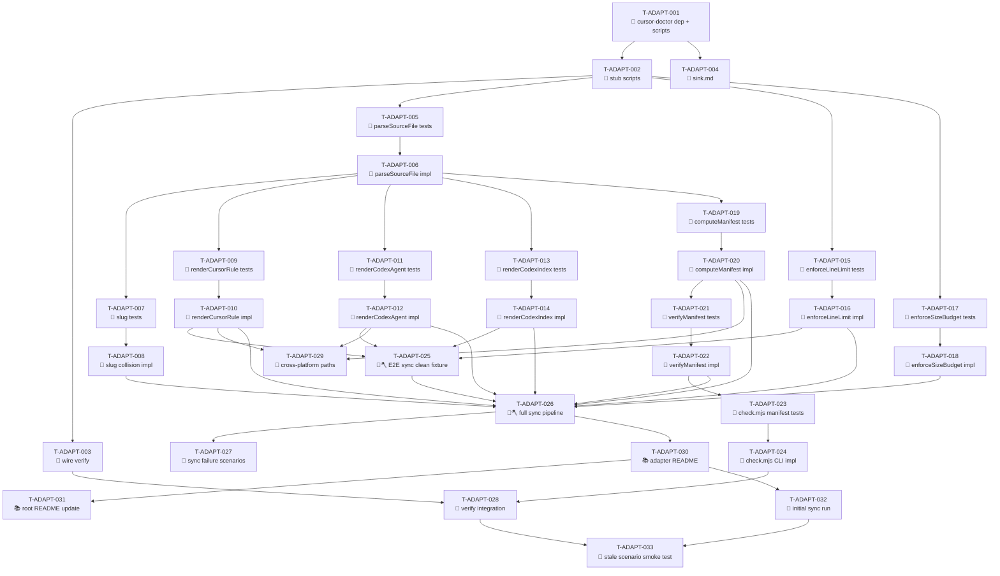

# Tasks — Multi-Framework Adapters

Each task is ~½ day (estimate S or M), has a stable ID, references ≥ 1 requirement, and has a Definition of Done.

> **TDD ordering:** test tasks for a requirement come **before** the implementation task for that requirement.

> **"May slice" annotation:** A task that touches more than one independent code path or artifact may legitimately ship as several PRs rather than one. Mark such tasks with 🪓 in the heading (in addition to the task-type emoji), and add a `**Slice plan:**` line under the task sketching the expected slices. PR planners should expect the task to land in pieces; each slice PR must reference the parent task ID and name the slice it completes so traceability stays attached to the original task.

## Legend

- 🧪 = test task
- 🔨 = implementation task
- 📐 = design / scaffolding task
- 📚 = documentation task
- 🚀 = release / ops task
- 🪓 = may slice (task touches multiple independent code paths; expect several PRs)

---

## Phase 1 — Scaffolding

### T-ADAPT-001 📐 — Add `cursor-doctor` devDependency and wire npm scripts

- **Description:** Add `cursor-doctor` as a pinned exact-version `devDependency` in `package.json`. Add two new npm scripts: `adapters:sync` pointing to `node scripts/adapters/generate.mjs` and `adapters:check` pointing to `node scripts/adapters/check.mjs`. The target script files do not need to exist yet; the task only wires the entry points. Choose the latest stable `cursor-doctor` release as the pinned version and record it in `package.json`.
- **Satisfies:** REQ-ADAPT-013, NFR-ADAPT-006
- **Owner:** dev
- **Estimate:** S
- **Definition of done:**
  - [ ] `package.json` `devDependencies` contains `cursor-doctor` at an exact pinned version (no `^` or `~`).
  - [ ] `package.json` `scripts` contains `"adapters:sync": "node scripts/adapters/generate.mjs"`.
  - [ ] `package.json` `scripts` contains `"adapters:check": "node scripts/adapters/check.mjs"`.
  - [ ] No new entries in `dependencies` (runtime deps must remain unchanged per NFR-ADAPT-006).
  - [ ] `npm install` succeeds; lock file updated.

---

### T-ADAPT-002 📐 — Create `scripts/adapters/` with stub scripts that exit 0

- **Description:** Create `scripts/adapters/` directory. Add `generate.mjs` and `check.mjs` as stub files: each prints a "not implemented" message to stdout and exits 0. Verify that `npm run adapters:sync` and `npm run adapters:check` invoke the correct stubs without error.
- **Satisfies:** SPEC-ADAPT-001, SPEC-ADAPT-002
- **Owner:** dev
- **Depends on:** T-ADAPT-001
- **Estimate:** S
- **Definition of done:**
  - [ ] `scripts/adapters/generate.mjs` exists; runs under Node.js LTS with `node scripts/adapters/generate.mjs`.
  - [ ] `scripts/adapters/check.mjs` exists; runs under Node.js LTS.
  - [ ] `npm run adapters:sync` exits 0 and prints the not-implemented message.
  - [ ] `npm run adapters:check` exits 0 and prints the not-implemented message.
  - [ ] Neither stub writes to `.cursor/rules/`, `.codex/`, or any canonical path.

---

### T-ADAPT-003 📐 — Wire `adapters:check` into `npm run verify`

- **Description:** Modify the `verify` npm script in `package.json` to invoke `npm run adapters:check` as one of its steps, so that a failing `adapters:check` causes `npm run verify` to exit non-zero. The position within the verify chain should be chosen to fail fast (before slower steps).
- **Satisfies:** REQ-ADAPT-012
- **Owner:** dev
- **Depends on:** T-ADAPT-002
- **Estimate:** S
- **Definition of done:**
  - [ ] `package.json` `verify` script invokes `adapters:check` (directly or via a chained `&&` / `npm-run-all` / similar mechanism).
  - [ ] Running `npm run verify` with a stubbed `adapters:check` that exits 1 causes `npm run verify` to exit non-zero.
  - [ ] Running `npm run verify` with the stub that exits 0 allows verify to proceed to its other steps.
  - [ ] Implementation log entry: "T-ADAPT-003: adapters:check wired into verify".

---

### T-ADAPT-004 📐 — Update `docs/sink.md` to register generated-artifact sinks

- **Description:** Edit `docs/sink.md` to register `.cursor/rules/`, `.codex/agents/`, and `.codex/skills/` as generated-artifact sinks produced by `adapters:sync`. The entries should note that files under these paths are generated (additive only), describe their sources, and identify `adapters:sync` as the generating command.
- **Satisfies:** REQ-ADAPT-018, REQ-ADAPT-019, SPEC-ADAPT-001
- **Owner:** dev
- **Depends on:** T-ADAPT-001
- **Estimate:** S
- **Definition of done:**
  - [ ] `docs/sink.md` layout tree includes `.cursor/rules/` with a note indicating generated adapter output.
  - [ ] `docs/sink.md` layout tree includes `.codex/agents/` and `.codex/skills/` with a note indicating generated adapter output.
  - [ ] The ownership table or equivalent section identifies `adapters:sync` as the writer.
  - [ ] `docs/sink.md` does not modify any other entries.

---

## Phase 2 — Source Parsing + Slug Logic (TDD pairs)

### T-ADAPT-005 🧪 — Tests for `parseSourceFile`: valid frontmatter, no frontmatter, malformed YAML

- **Description:** Write unit tests covering `parseSourceFile` (SPEC-ADAPT-003) for: (1) a file with valid YAML frontmatter — asserts `slug`, `frontmatter` object, `body` without delimiters, `sourcePath` with forward slashes (TEST-ADAPT-001); (2) a file with no frontmatter — asserts `frontmatter: null` and `body` equals full file content (TEST-ADAPT-002); (3) a file with malformed YAML frontmatter — asserts the function throws with the file path in the message (TEST-ADAPT-003). Tests go under `tests/adapters/` or equivalent. Tests must fail against the current stub.
- **Satisfies:** SPEC-ADAPT-003, REQ-ADAPT-001
- **Owner:** qa
- **Depends on:** T-ADAPT-002
- **Estimate:** S
- **Definition of done:**
  - [ ] Three test cases exist covering TEST-ADAPT-001, TEST-ADAPT-002, TEST-ADAPT-003.
  - [ ] Each test references the requirement or spec ID it covers in a comment or test name.
  - [ ] All three tests fail against the current stub `generate.mjs` (confirming they are real tests).
  - [ ] Test fixture files created under `tests/fixtures/adapters/` (one valid frontmatter file, one no-frontmatter file, one malformed-YAML file).

---

### T-ADAPT-006 🔨 — Implement `parseSourceFile`

- **Description:** Implement `parseSourceFile(path)` in `scripts/adapters/generate.mjs` per SPEC-ADAPT-003: reads file as UTF-8, detects `---` on line 1 and parses the YAML block, returns `ParsedSource` with `slug`, `sourcePath` (forward slashes), `frontmatter` (object or null), `body` (frontmatter stripped), and `sourceLineCount`. Use `js-yaml` or equivalent from devDependencies for YAML parsing. Normalise Windows backslashes in `sourcePath`.
- **Satisfies:** SPEC-ADAPT-003, REQ-ADAPT-001, EC-001, EC-021
- **Owner:** dev
- **Depends on:** T-ADAPT-005
- **Estimate:** M
- **Definition of done:**
  - [ ] T-ADAPT-005 tests now pass.
  - [ ] `sourcePath` always uses forward slashes regardless of host OS.
  - [ ] YAML parse failure throws `Error("malformed frontmatter in <path>")`.
  - [ ] `ENOENT` propagates as thrown error.
  - [ ] Lint + type checks green.

---

### T-ADAPT-007 🧪 — Tests for slug derivation, uniqueness check, and slug collision detection

- **Description:** Write unit/integration tests covering slug logic: (1) slug is the base name without extension (e.g. `analyst.md` → `analyst`); (2) two source files under `.claude/agents/` with the same slug triggers the collision check (TEST-ADAPT-020 partial — the collision detection logic unit); (3) same slug between `.claude/agents/` and `.claude/skills/` is permitted (cross-namespace). Tests must fail against stub.
- **Satisfies:** SPEC-ADAPT-003, REQ-ADAPT-025, EC-007
- **Owner:** qa
- **Depends on:** T-ADAPT-006
- **Estimate:** S
- **Definition of done:**
  - [ ] Tests cover: (a) slug = base-name-no-extension for agents, (b) slug = base-name-no-extension for skills, (c) intra-namespace collision exits non-zero, (d) cross-namespace same slug is allowed.
  - [ ] Test references `REQ-ADAPT-025` / `EC-007` in name or comment.
  - [ ] Tests fail on the stub; pass after T-ADAPT-008.

---

### T-ADAPT-008 🔨 — Implement slug-collision check (pipeline step 2)

- **Description:** Implement the slug-collision check in `generate.mjs` per DESIGN C.4.1 step 2 and SPEC-ADAPT-001 state diagram (`SlugCheck` state): after reading all sources, build slug→path maps for agents and skills separately; if any slug maps to more than one path within the same namespace, emit the ERROR block per DESIGN B.4.5 to stderr and exit with code 1. No output files are written before this check.
- **Satisfies:** REQ-ADAPT-025, SPEC-ADAPT-001, EC-007
- **Owner:** dev
- **Depends on:** T-ADAPT-007
- **Estimate:** S
- **Definition of done:**
  - [ ] T-ADAPT-007 tests now pass.
  - [ ] stderr message matches DESIGN B.4.5 format exactly (uppercase `ERROR:`, both conflicting source paths indented with two spaces, `Both would produce:` line, recovery instruction).
  - [ ] Exit code 1 on collision.
  - [ ] No output file is written when collision is detected.
  - [ ] Lint + type checks green.

---

## Phase 3 — Cursor Rendering (TDD pairs)

### T-ADAPT-009 🧪 — Tests for `renderCursorRule` — frontmatter schema, field order, alwaysApply values

- **Description:** Write unit tests for `renderCursorRule` (SPEC-ADAPT-004) covering: (1) `type === "agent"` emits `alwaysApply: false`, no `globs` field, fields in canonical order (`description`, `alwaysApply`, `x-generated`, `x-source`, `x-regenerate`) — TEST-ADAPT-004; (2) `type === "skill"` emits `alwaysApply: false`, non-empty description — TEST-ADAPT-005; (3) `type === "conventions"` emits `alwaysApply: true` — TEST-ADAPT-006; (4) source missing `description` produces fallback `"<slug> agent definition."` — TEST-ADAPT-007.
- **Satisfies:** SPEC-ADAPT-004, REQ-ADAPT-002, REQ-ADAPT-003, REQ-ADAPT-020, REQ-ADAPT-021
- **Owner:** qa
- **Depends on:** T-ADAPT-006
- **Estimate:** S
- **Definition of done:**
  - [ ] Four test cases: TEST-ADAPT-004, TEST-ADAPT-005, TEST-ADAPT-006, TEST-ADAPT-007.
  - [ ] Test for field order verifies the exact sequence `description` → `alwaysApply` → `x-generated` → `x-source` → `x-regenerate`.
  - [ ] Test verifies `x-generated: true` is a boolean literal (not string `"true"`).
  - [ ] Test for conventions description verifies the fixed literal per DESIGN B.5.1.
  - [ ] Tests fail against stub.

---

### T-ADAPT-010 🔨 — Implement `renderCursorRule`

- **Description:** Implement `renderCursorRule(parsed, type)` in `generate.mjs` per SPEC-ADAPT-004: produce the full `.mdc` content with YAML frontmatter (fields in canonical order), blank line, then `parsed.body`. Set `alwaysApply: true` only for `type === "conventions"`. Derive `description` from source frontmatter → first ATX heading → fallback literal per spec validation rules. Use `enforceLineLimit` (to be implemented in Phase 5) if `sourceLineCount > 500`.
- **Satisfies:** SPEC-ADAPT-004, REQ-ADAPT-002, REQ-ADAPT-003, REQ-ADAPT-020, REQ-ADAPT-021, REQ-ADAPT-006, REQ-ADAPT-016, REQ-ADAPT-017
- **Owner:** dev
- **Depends on:** T-ADAPT-009
- **Estimate:** M
- **Definition of done:**
  - [ ] T-ADAPT-009 tests now pass.
  - [ ] `x-regenerate` serialised with double quotes in YAML: `x-regenerate: "npm run adapters:sync"`.
  - [ ] `x-source` uses forward slashes regardless of OS.
  - [ ] No `globs` field emitted for any type.
  - [ ] Output is deterministic for identical inputs (REQ-ADAPT-016, REQ-ADAPT-017).
  - [ ] Lint + type checks green.

---

## Phase 4 — Codex Rendering (TDD pairs)

### T-ADAPT-011 🧪 — Tests for `renderCodexAgent`/`renderCodexSkill` — header line, blank line, em dash

- **Description:** Write unit tests for `renderCodexAgent` and `renderCodexSkill` (SPEC-ADAPT-005) covering: (1) line 1 is the HTML comment header with U+2014 em dash (TEST-ADAPT-008); (2) line 2 is blank; (3) body starts on line 3; (4) `Source:` field in header equals `parsed.sourcePath` with forward slashes; (5) header using ASCII `--` instead of U+2014 would fail (negative test confirming the exact byte is required — coverage for EC-019).
- **Satisfies:** SPEC-ADAPT-005, REQ-ADAPT-006, EC-019
- **Owner:** qa
- **Depends on:** T-ADAPT-006
- **Estimate:** S
- **Definition of done:**
  - [ ] Tests cover TEST-ADAPT-008 (U+2014 em dash byte sequence on line 1).
  - [ ] Test verifies line 2 is empty string.
  - [ ] Negative test confirms that ASCII `--` would not match the `<!-- GENERATED — ` prefix.
  - [ ] Tests fail against stub.

---

### T-ADAPT-012 🔨 — Implement `renderCodexAgent` and `renderCodexSkill`

- **Description:** Implement `renderCodexAgent(parsed)` and `renderCodexSkill(parsed)` in `generate.mjs` per SPEC-ADAPT-005: produce a Markdown file with the HTML comment header on line 1 (U+2014 em dash, `Source: <parsed.sourcePath>`, `Regenerate: npm run adapters:sync`), blank line 2, then body. Use `enforceLineLimit` if `sourceLineCount > 500`. Truncation marker on file line 493 when capped.
- **Satisfies:** SPEC-ADAPT-005, REQ-ADAPT-019, REQ-ADAPT-005, REQ-ADAPT-006, REQ-ADAPT-007, REQ-ADAPT-016, REQ-ADAPT-017
- **Owner:** dev
- **Depends on:** T-ADAPT-011
- **Estimate:** M
- **Definition of done:**
  - [ ] T-ADAPT-011 tests now pass.
  - [ ] Line 1 bytes include U+2014 (UTF-8: 0xE2 0x80 0x94), not ASCII hyphens.
  - [ ] Line 2 is always empty.
  - [ ] `renderCodexAgent` and `renderCodexSkill` are functionally identical except for caller-level path routing.
  - [ ] Output is deterministic for identical inputs.
  - [ ] Lint + type checks green.

---

### T-ADAPT-013 🧪 — Tests for `renderCodexIndex` — sorted rows, header, INDEX.md structure

- **Description:** Write unit tests for `renderCodexIndex` (SPEC-ADAPT-006) covering: (1) rows sorted alphabetically by slug (TEST-ADAPT-009); (2) HTML comment header on line 1 with the literal `Source: .claude/agents/ (all files)` value; (3) line 2 blank; (4) Markdown table `| Agent | File |` with link `[<slug>.md](<slug>.md)`; (5) empty agents array produces table header row only (EC-020); (6) identical input produces identical output (idempotency).
- **Satisfies:** SPEC-ADAPT-006, REQ-ADAPT-008, REQ-ADAPT-016, EC-020
- **Owner:** qa
- **Depends on:** T-ADAPT-006
- **Estimate:** S
- **Definition of done:**
  - [ ] Tests cover TEST-ADAPT-009 (alphabetical sort, idempotency).
  - [ ] Test for empty array confirms `INDEX.md` still contains header comment + table header row.
  - [ ] Test for `Source:` value confirms the literal `.claude/agents/ (all files)` substitution.
  - [ ] Tests fail against stub.

---

### T-ADAPT-014 🔨 — Implement `renderCodexIndex`

- **Description:** Implement `renderCodexIndex(agents)` in `generate.mjs` per SPEC-ADAPT-006: produce `INDEX.md` content starting with HTML comment header on line 1 (U+2014 em dash, `Source: .claude/agents/ (all files)`), blank line 2, `# Agent index` heading, introductory sentence, Markdown table sorted alphabetically by slug. Trailing newline at end of file.
- **Satisfies:** SPEC-ADAPT-006, REQ-ADAPT-008, REQ-ADAPT-016, REQ-ADAPT-006
- **Owner:** dev
- **Depends on:** T-ADAPT-013
- **Estimate:** S
- **Definition of done:**
  - [ ] T-ADAPT-013 tests now pass.
  - [ ] Table rows sorted case-sensitive ASCII by slug.
  - [ ] File ends with a single `\n`.
  - [ ] Deterministic output for identical inputs.
  - [ ] Lint + type checks green.

---

## Phase 5 — Size Budget + Line Limit (TDD pairs)

### T-ADAPT-015 🧪 — Tests for `enforceLineLimit` — boundary cases at 500, 501, empty

- **Description:** Write unit tests for `enforceLineLimit` (SPEC-ADAPT-010) covering: (1) 500-line input passes through unchanged, `truncated: false` (TEST-ADAPT-012, EC-005); (2) 501-line input returns 491 lines with marker `<!-- TRUNCATED: source exceeded 500 lines -->` on line 491, `truncated: true` (TEST-ADAPT-013, EC-006); (3) empty input returns `{ truncated: false }` unchanged (TEST-ADAPT-014, EC-003); (4) 600-line input returns 491 lines with marker (EC-004).
- **Satisfies:** SPEC-ADAPT-010, REQ-ADAPT-005, EC-003, EC-004, EC-005, EC-006
- **Owner:** qa
- **Depends on:** T-ADAPT-002
- **Estimate:** S
- **Definition of done:**
  - [ ] Four test cases as specified.
  - [ ] Test for 501-line input verifies line count of result is exactly 491 (490 body + 1 marker).
  - [ ] Test verifies the exact marker text `<!-- TRUNCATED: source exceeded 500 lines -->`.
  - [ ] Tests fail against stub.

---

### T-ADAPT-016 🔨 — Implement `enforceLineLimit`

- **Description:** Implement `enforceLineLimit(content)` in `generate.mjs` per SPEC-ADAPT-010: split by `\n`, if `n <= 500` return unchanged, else return first 490 lines + `\n` + marker + `\n`. Returns `{ content, truncated }`.
- **Satisfies:** SPEC-ADAPT-010, REQ-ADAPT-005
- **Owner:** dev
- **Depends on:** T-ADAPT-015
- **Estimate:** S
- **Definition of done:**
  - [ ] T-ADAPT-015 tests now pass.
  - [ ] Pure function — no I/O or side effects.
  - [ ] Result always has exactly 491 lines when `n > 500`.
  - [ ] Lint + type checks green.

---

### T-ADAPT-017 🧪 — Tests for `enforceSizeBudget` — clean/warn/error thresholds and contributor sorting

- **Description:** Write unit tests for `enforceSizeBudget` (SPEC-ADAPT-009) covering: (1) 28672-byte total → `status: "clean"` (TEST-ADAPT-015, EC-008); (2) 28673-byte total → `status: "warn"` (TEST-ADAPT-016, EC-009); (3) 32768-byte total → `status: "warn"` (EC-010); (4) 32769-byte total → `status: "error"` with contributors sorted descending by bytes (TEST-ADAPT-017, EC-011); (5) `contributors` sorted alphabetically by path when status is `"clean"` or `"warn"`.
- **Satisfies:** SPEC-ADAPT-009, REQ-ADAPT-009, REQ-ADAPT-027, EC-008, EC-009, EC-010, EC-011
- **Owner:** qa
- **Depends on:** T-ADAPT-002
- **Estimate:** S
- **Definition of done:**
  - [ ] Five test cases as specified covering all four status bucket boundaries.
  - [ ] Test verifies contributor sort order for `"error"` case (descending bytes).
  - [ ] Test verifies contributor sort order for `"clean"` and `"warn"` cases (alphabetical by path).
  - [ ] Tests use `Buffer.byteLength(content, 'utf8')` semantics for byte counting.
  - [ ] Tests fail against stub.

---

### T-ADAPT-018 🔨 — Implement `enforceSizeBudget`

- **Description:** Implement `enforceSizeBudget(codexFiles)` in `generate.mjs` per SPEC-ADAPT-009: sum `Buffer.byteLength(content, 'utf8')` for all files, return `SizeReport` with `totalBytes`, `status` (`"clean"` ≤ 28672, `"warn"` ≤ 32768, `"error"` > 32768), and `contributors` sorted by descending bytes when error, alphabetical by path otherwise.
- **Satisfies:** SPEC-ADAPT-009, REQ-ADAPT-009, REQ-ADAPT-027
- **Owner:** dev
- **Depends on:** T-ADAPT-017
- **Estimate:** S
- **Definition of done:**
  - [ ] T-ADAPT-017 tests now pass.
  - [ ] Pure function — no I/O.
  - [ ] `CODEX_WARN_BYTES = 28672` and `CODEX_HARD_BYTES = 32768` defined as named constants in the script.
  - [ ] Lint + type checks green.

---

## Phase 6 — Manifest + Check Logic (TDD pairs)

### T-ADAPT-019 🧪 — Tests for `computeManifest` — schema conformance, determinism, sorted arrays

- **Description:** Write unit tests for `computeManifest` (SPEC-ADAPT-007) covering: (1) returned object conforms to `ManifestObject` schema: four top-level keys only, no extras (TEST-ADAPT-010); (2) `script_hash` is a 64-char lowercase hex string; (3) `sources` sorted lexicographically by `path`; (4) `outputs` sorted lexicographically; (5) SHA-256 hashes are deterministic across two calls with identical file content (TEST-ADAPT-011); (6) `generated_at` is an ISO-8601 string with `Z` suffix.
- **Satisfies:** SPEC-ADAPT-007, REQ-ADAPT-010, REQ-ADAPT-016, REQ-ADAPT-017
- **Owner:** qa
- **Depends on:** T-ADAPT-006
- **Estimate:** S
- **Definition of done:**
  - [ ] Six test cases as specified.
  - [ ] Test verifies exactly four top-level keys in returned object.
  - [ ] Test verifies `sources` array does not contain the script file path itself.
  - [ ] Test for determinism invokes `computeManifest` twice with identical fixture files and asserts identical `sources[].sha256` and `script_hash`.
  - [ ] Tests fail against stub.

---

### T-ADAPT-020 🔨 — Implement `computeManifest`

- **Description:** Implement `computeManifest(sources, scriptPath, outputs)` in `generate.mjs` per SPEC-ADAPT-007: compute SHA-256 hex of each source file, compute SHA-256 of `scriptPath`, populate `generated_at` as `new Date().toISOString()`, sort `sources[]` lexicographically by path, sort `outputs[]` lexicographically, return `ManifestObject` with exactly four top-level keys.
- **Satisfies:** SPEC-ADAPT-007, REQ-ADAPT-010, REQ-ADAPT-016, REQ-ADAPT-017
- **Owner:** dev
- **Depends on:** T-ADAPT-019
- **Estimate:** S
- **Definition of done:**
  - [ ] T-ADAPT-019 tests now pass.
  - [ ] Uses Node.js built-in `crypto` module — no new runtime dependency.
  - [ ] Source reads done in parallel (`Promise.all`).
  - [ ] All paths in manifest use forward slashes (Windows normalisation applied).
  - [ ] Lint + type checks green.

---

### T-ADAPT-021 🧪 — Tests for `verifyManifest` — all five failure modes and clean path

- **Description:** Write unit tests for `verifyManifest` (SPEC-ADAPT-008) covering: (1) clean state: all hashes match, all outputs exist, all headers present → `{ ok: true, errors: [] }` (TEST-ADAPT-028); (2) `kind: "missing-output"` when a path in `outputs[]` is absent (TEST-ADAPT-030, EC-014); (3) `kind: "stale-source"` when a source file hash differs (TEST-ADAPT-029); (4) `kind: "stale-source"` when `script_hash` differs — path listed as `"scripts/adapters/generate.mjs"` in errors; (5) `kind: "malformed-header"` for an `.mdc` with no `x-generated: true` field (TEST-ADAPT-031); (6) `kind: "malformed-header"` for a `.md` whose line 1 uses ASCII `--` instead of U+2014 (TEST-ADAPT-032, EC-019).
- **Satisfies:** SPEC-ADAPT-008, REQ-ADAPT-011, REQ-ADAPT-015, EC-014, EC-015, EC-019
- **Owner:** qa
- **Depends on:** T-ADAPT-020
- **Estimate:** M
- **Definition of done:**
  - [ ] Six test cases as specified.
  - [ ] Test for `stale-source` from script hash change uses `"scripts/adapters/generate.mjs"` as the `path` field.
  - [ ] Test for `malformed-header` on `.md` file uses exact byte sequence check (U+2014 vs ASCII).
  - [ ] Each test verifies `ok === false` and `errors[0].kind` for failure cases.
  - [ ] First-failing-step short-circuit verified: if `missing-output` is present, `stale-source` errors are not returned in the same result.
  - [ ] Tests fail against stub `check.mjs`.

---

### T-ADAPT-022 🔨 — Implement `verifyManifest`

- **Description:** Implement `verifyManifest(manifest)` in `check.mjs` per SPEC-ADAPT-008: (step 1) verify every path in `outputs[]` exists; (step 2) recompute SHA-256 of each `sources[].path` and compare to stored hash, recompute SHA-256 of `scripts/adapters/generate.mjs` and compare to `manifest.script_hash`, collect mismatches; (step 3) for each output path verify generated-file header (`x-generated: true` in frontmatter for `.mdc`; `<!-- GENERATED — ` prefix with U+2014 for `.md`); (step 4) return `CheckResult`.
- **Satisfies:** SPEC-ADAPT-008, REQ-ADAPT-011, REQ-ADAPT-015, EC-015, EC-019
- **Owner:** dev
- **Depends on:** T-ADAPT-021
- **Estimate:** M
- **Definition of done:**
  - [ ] T-ADAPT-021 tests now pass.
  - [ ] Steps execute in strict order; first failure short-circuits remaining steps.
  - [ ] Header check uses byte-strict U+2014 comparison (not `--` or en dash).
  - [ ] No filesystem writes — read-only function.
  - [ ] Lint + type checks green.

---

### T-ADAPT-023 🧪 — Tests for `adapters:check` manifest-absent and malformed-JSON cases

- **Description:** Write integration/e2e tests for the top-level `check.mjs` invocation covering: (1) manifest absent → exit 1, stderr matches DESIGN B.4.10 pattern (TEST-ADAPT-026, EC-017); (2) manifest present but malformed JSON → exit 1, stderr identifies manifest path and parse error, instructs user to run `adapters:sync` (TEST-ADAPT-027, EC-017, AN-003 resolution).
- **Satisfies:** SPEC-ADAPT-002, REQ-ADAPT-011, EC-017
- **Owner:** qa
- **Depends on:** T-ADAPT-022
- **Estimate:** S
- **Definition of done:**
  - [ ] Two test cases covering TEST-ADAPT-026 and TEST-ADAPT-027.
  - [ ] Test verifies stderr contains `.cursor/rules/.adapter-manifest.json` path in the message.
  - [ ] Test for malformed JSON verifies the message instructs `npm run adapters:sync`.
  - [ ] Both tests verify exit code 1.
  - [ ] Tests fail against stub.

---

### T-ADAPT-024 🔨 — Implement top-level `check.mjs` command with manifest loading

- **Description:** Implement the top-level `check.mjs` CLI entry point per SPEC-ADAPT-002 and DESIGN C.4.2: read manifest at `.cursor/rules/.adapter-manifest.json`; if absent, emit B.4.10 to stderr and exit 1; if present but not valid JSON or schema-invalid, emit the malformed-manifest message (AN-003 resolution) to stderr and exit 1; call `verifyManifest`; on `ok: false` emit the matching B.4.9/B.4.11/B.4.12 block to stderr and exit 1; on `ok: true` emit B.4.8 to stdout and exit 0.
- **Satisfies:** SPEC-ADAPT-002, REQ-ADAPT-011, REQ-ADAPT-015, NFR-ADAPT-001, EC-017
- **Owner:** dev
- **Depends on:** T-ADAPT-023
- **Estimate:** M
- **Definition of done:**
  - [ ] T-ADAPT-023 tests now pass.
  - [ ] Exit codes are exactly 0 or 1 — no other values.
  - [ ] Error messages go to stderr; clean-state message goes to stdout.
  - [ ] Every error message includes the repo-root-relative file path.
  - [ ] Every non-zero message ends with a recovery instruction.
  - [ ] Lint + type checks green.

---

## Phase 7 — Pipeline Assembly + cursor-doctor Integration

### T-ADAPT-025 🧪 🪓 — E2E tests: full `adapters:sync` pipeline on a clean fixture

- **Description:** Write e2e tests that invoke `npm run adapters:sync` against a controlled fixture repository (or fixture directory) and verify: (1) all expected output files are produced (TEST-ADAPT-018); (2) canonical sources are byte-unchanged (TEST-ADAPT-034); (3) hand-authored `.codex/` files are byte-unchanged (TEST-ADAPT-035); (4) re-running produces byte-identical output files (TEST-ADAPT-019); (5) first-run emits the B.4.2 first-run reminder on stdout (TEST-ADAPT-039); (6) `cursor-doctor` reports zero errors on all generated `.mdc` files (TEST-ADAPT-024).

  **Slice plan:** this task may be split into two PRs — PR-A: tests for file presence and canonical-source protection (TEST-ADAPT-018, TEST-ADAPT-034, TEST-ADAPT-035); PR-B: tests for idempotency, first-run reminder, and cursor-doctor clean exit (TEST-ADAPT-019, TEST-ADAPT-039, TEST-ADAPT-024). Both PRs reference T-ADAPT-025.

- **Satisfies:** SPEC-ADAPT-001, REQ-ADAPT-001, REQ-ADAPT-018, REQ-ADAPT-019, REQ-ADAPT-026, REQ-ADAPT-016, REQ-ADAPT-017, REQ-ADAPT-008, NFR-ADAPT-007
- **Owner:** qa
- **Depends on:** T-ADAPT-016, T-ADAPT-014, T-ADAPT-012, T-ADAPT-010
- **Estimate:** M
- **Definition of done:**
  - [ ] Fixture directory created under `tests/fixtures/adapters/` with at least two agent files, one skill file, `AGENTS.md`, `.codex/README.md`, `.codex/instructions.md`, and a `.codex/workflows/` file.
  - [ ] Six test cases as specified above.
  - [ ] Test for canonical source protection captures SHA-256 before and after sync and asserts equality.
  - [ ] Test for idempotency compares byte content of every generated file between two runs.
  - [ ] Tests fail on the stub pipeline.

---

### T-ADAPT-026 🔨 🪓 — Implement full `adapters:sync` pipeline (generate.mjs steps 1–12)

- **Description:** Assemble the complete twelve-step `adapters:sync` pipeline in `generate.mjs` per DESIGN C.4.1 and SPEC-ADAPT-001: (1) read sources in parallel; (2) slug-collision check; (3–7) render Cursor and Codex outputs in memory; (8) `enforceSizeBudget` pre-write check; (9) write all rendered outputs to disk; (10) invoke `cursor-doctor` subprocess with `spawn` (array args, no shell interpolation); (11) `computeManifest` and write manifest; (12) print summary. Emit stdout/stderr per DESIGN B.4.1–B.4.7 for each state. Handle first-run (no prior manifest) by appending B.4.2 reminder. Use `Promise.all` for parallel reads/hashing; write outputs serially per directory for Windows compatibility.

  **Slice plan:** this task may be split into up to three PRs — PR-A: steps 1–8 (sources read, validation, in-memory rendering, size check); PR-B: steps 9–10 (disk writes, cursor-doctor invocation); PR-C: steps 11–12 (manifest write, summary output). Each PR references T-ADAPT-026 and names its slice.

- **Satisfies:** SPEC-ADAPT-001, REQ-ADAPT-001, REQ-ADAPT-018, REQ-ADAPT-019, REQ-ADAPT-002, REQ-ADAPT-003, REQ-ADAPT-020, REQ-ADAPT-021, REQ-ADAPT-004, REQ-ADAPT-022, REQ-ADAPT-023, REQ-ADAPT-024, REQ-ADAPT-025, REQ-ADAPT-005, REQ-ADAPT-006, REQ-ADAPT-007, REQ-ADAPT-026, REQ-ADAPT-008, REQ-ADAPT-009, REQ-ADAPT-027, REQ-ADAPT-010, REQ-ADAPT-013, REQ-ADAPT-016, REQ-ADAPT-017, NFR-ADAPT-002, NFR-ADAPT-003, NFR-ADAPT-004, NFR-ADAPT-005, NFR-ADAPT-006, NFR-ADAPT-007
- **Owner:** dev
- **Depends on:** T-ADAPT-025, T-ADAPT-018, T-ADAPT-020, T-ADAPT-022, T-ADAPT-016, T-ADAPT-014, T-ADAPT-012, T-ADAPT-010, T-ADAPT-008
- **Estimate:** M
- **Definition of done:**
  - [ ] T-ADAPT-025 tests now pass.
  - [ ] `cursor-doctor` invoked once per run using `child_process.spawn` with arguments as an array; no shell interpolation.
  - [ ] When `cursor-doctor` spawn fails (EC-022), stderr includes the spawn error and instructs `npm install`.
  - [ ] Manifest written only after `cursor-doctor` exits 0.
  - [ ] Stdout/stderr separation matches DESIGN B.3 stream assignment table exactly.
  - [ ] All generated output paths use forward slashes.
  - [ ] Output writes use LF line endings (`\n`) regardless of host OS.
  - [ ] Lint + type checks green.

---

### T-ADAPT-027 🧪 — E2E tests: `adapters:sync` hard failure scenarios

- **Description:** Write e2e tests covering hard failure cases for `adapters:sync`: (1) slug collision — exit 1, stderr matches B.4.5, no output files written (TEST-ADAPT-020); (2) Codex combined size > 32 KiB — exit 1, B.4.6 lists contributors, no Codex files persisted (TEST-ADAPT-021); (3) Codex combined size 28 KiB + 1 byte — exit 0, B.4.4 warning on stderr (TEST-ADAPT-022); (4) 600-line source — output has truncation marker on line 491 for `.mdc` and B.4.3 truncation notice on stdout (TEST-ADAPT-023); (5) `cursor-doctor` structural error (fixture with deliberately invalid frontmatter) — exit 1, B.4.7 framed output, manifest not written (TEST-ADAPT-025).
- **Satisfies:** SPEC-ADAPT-001, REQ-ADAPT-025, REQ-ADAPT-005, REQ-ADAPT-009, REQ-ADAPT-027, REQ-ADAPT-013, EC-004, EC-007, EC-009, EC-011, EC-016
- **Owner:** qa
- **Depends on:** T-ADAPT-026
- **Estimate:** M
- **Definition of done:**
  - [ ] Five test cases as specified.
  - [ ] Test for 32 KiB hard limit verifies no `.codex/agents/` or `.codex/skills/` files written.
  - [ ] Test for truncation verifies file line count is 491 and marker text is exact.
  - [ ] Test for cursor-doctor failure verifies manifest is absent after the run.
  - [ ] Each test verifies the exact exit code (0 or 1) and correct stream (stdout vs stderr).
  - [ ] Tests fail with wrong behaviour before full pipeline is implemented.

---

### T-ADAPT-028 🧪 — Integration test: `npm run verify` fails when `adapters:check` exits 1

- **Description:** Write an integration test verifying that `npm run verify` exits non-zero when `adapters:check` exits 1, and that the verify output includes the staleness message from `adapters:check`. Simulate staleness by modifying a source file without re-running sync (TEST-ADAPT-033).
- **Satisfies:** REQ-ADAPT-012
- **Owner:** qa
- **Depends on:** T-ADAPT-024, T-ADAPT-003
- **Estimate:** S
- **Definition of done:**
  - [ ] Test modifies a canonical source fixture file without re-running sync, then runs `npm run verify`.
  - [ ] Test asserts `npm run verify` exits non-zero.
  - [ ] Test asserts combined output contains the staleness message path.
  - [ ] Test passes after T-ADAPT-026 and T-ADAPT-024 are complete.

---

## Phase 8 — Cross-Platform Validation

### T-ADAPT-029 🧪 — Cross-platform path normalisation tests (Windows backslash → forward slash)

- **Description:** Write unit and integration tests covering EC-021 (path normalisation): (1) `parseSourceFile` with a Windows-style path input (`scripts\\adapters\\..`) produces `sourcePath` with forward slashes; (2) `computeManifest` serialises all paths with forward slashes; (3) generated `.mdc` `x-source` field and `.md` `Source:` header always use forward slashes; (4) manifest JSON `sources[].path` and `outputs[]` always use forward slashes. Tests must be runnable on both Windows and POSIX without environment flags.
- **Satisfies:** NFR-ADAPT-003, REQ-ADAPT-016, EC-021
- **Owner:** qa
- **Depends on:** T-ADAPT-006, T-ADAPT-010, T-ADAPT-012, T-ADAPT-020
- **Estimate:** S
- **Definition of done:**
  - [ ] Four test cases as specified.
  - [ ] Tests pass on both Windows 11 (PowerShell, Node LTS) and Linux/macOS (POSIX, Node LTS) — documented in test comments that they are designed for cross-platform execution.
  - [ ] No test uses OS-specific APIs or `process.platform` branching in the assertion logic.
  - [ ] Tests fail when the normalisation is absent.

---

## Phase 9 — Documentation

### T-ADAPT-030 📚 — Adapter README under `scripts/adapters/README.md`

- **Description:** Write `scripts/adapters/README.md` covering: (1) the one-directional flow (canonical `.claude/` → adapter outputs, no reverse); (2) the regeneration command (`npm run adapters:sync`); (3) the drift check command (`npm run adapters:check`) and its verify-gate integration; (4) the manual one-time step for adding the `.codex/agents/INDEX.md` pointer to `AGENTS.md` (REQ-ADAPT-008, NG10) with the exact text to add; (5) generated file locations (`.cursor/rules/`, `.codex/agents/`, `.codex/skills/`); (6) the flat-layout constraint for `.cursor/rules/`; (7) the `cursor-doctor` devDependency and its rationale; (8) the Codex 32 KiB ceiling warning and what to do if it is reached; (9) the stale-output known limitation (RISK-ADAPT-007 — orphaned files on source deletion).
- **Satisfies:** REQ-ADAPT-008, REQ-ADAPT-013, SPEC-ADAPT-001, REQ-ADAPT-026, NFR-ADAPT-006
- **Owner:** dev
- **Depends on:** T-ADAPT-026
- **Estimate:** S
- **Definition of done:**
  - [ ] `scripts/adapters/README.md` exists with the nine sections listed above.
  - [ ] The exact text of the manual `AGENTS.md` pointer step is included (e.g. a code block or quoted sentence that the maintainer can copy-paste into `AGENTS.md`).
  - [ ] RISK-ADAPT-007 (orphaned files) is noted as a known limitation with manual cleanup instruction.
  - [ ] No canonical file paths misspelled; commands are exact npm script names.

---

### T-ADAPT-031 📚 — Update root `README.md` to mention adapters

- **Description:** Add a brief mention of the multi-framework adapter feature to the root `README.md`, including the two commands (`npm run adapters:sync`, `npm run adapters:check`) and a link to `scripts/adapters/README.md` for details.
- **Satisfies:** SPEC-ADAPT-001, SPEC-ADAPT-002
- **Owner:** dev
- **Depends on:** T-ADAPT-030
- **Estimate:** S
- **Definition of done:**
  - [ ] Root `README.md` includes a mention of `adapters:sync` and `adapters:check`.
  - [ ] Includes a link to `scripts/adapters/README.md`.
  - [ ] The addition is no more than a short paragraph or bullet list item — does not expand scope of README.

---

## Phase 10 — Initial Generation + CI Smoke Test

### T-ADAPT-032 🚀 — Run `adapters:sync` for the first time; commit generated files

- **Description:** With the full pipeline implemented, run `npm run adapters:sync` in the repository working tree. Review the diff of generated files (`.cursor/rules/*.mdc`, `.codex/agents/*.md`, `.codex/skills/*.md`, `.codex/agents/INDEX.md`, `.cursor/rules/.adapter-manifest.json`). Verify `cursor-doctor` exits 0. Run `npm run verify` and confirm exit 0. Commit the generated adapter files in a single commit with message `feat(adapters): T-ADAPT-032 initial adapters:sync run — add generated adapter files`. Complete the manual one-time step: add the `.codex/agents/INDEX.md` pointer to `AGENTS.md`.
- **Satisfies:** REQ-ADAPT-018, REQ-ADAPT-019, REQ-ADAPT-010, REQ-ADAPT-013, NFR-ADAPT-007
- **Owner:** human
- **Depends on:** T-ADAPT-026, T-ADAPT-030
- **Estimate:** S
- **Definition of done:**
  - [ ] `npm run adapters:sync` exits 0 with no errors.
  - [ ] `cursor-doctor` reports zero errors on all generated `.mdc` files.
  - [ ] `npm run verify` (including `adapters:check`) exits 0 on the repository after the commit.
  - [ ] Generated files committed to version control (single commit, references T-ADAPT-032).
  - [ ] `AGENTS.md` updated with the "See also `.codex/agents/INDEX.md`" pointer (manual one-time step documented in T-ADAPT-030 README).
  - [ ] No canonical file under `.claude/` is modified.

---

### T-ADAPT-033 🚀 — Synthetic stale-adapter scenario: verify `adapters:check` catches it

- **Description:** In a separate branch or test invocation, modify one canonical source file (e.g. append a blank line to a `.claude/agents/` file) without re-running `adapters:sync`, then run `npm run verify`. Verify it exits non-zero with the staleness message. Restore the source file, re-run `adapters:sync`, and confirm `npm run verify` exits 0 again. This validates the full end-to-end staleness detection path that the success metrics require.
- **Satisfies:** REQ-ADAPT-011, REQ-ADAPT-012
- **Owner:** human
- **Depends on:** T-ADAPT-032, T-ADAPT-028
- **Estimate:** S
- **Definition of done:**
  - [ ] `npm run verify` exits non-zero after a source-file modification without re-sync.
  - [ ] stderr includes the relative path of the modified source file.
  - [ ] After restoring and re-running `adapters:sync`, `npm run verify` exits 0.
  - [ ] Result recorded in implementation log.

---

## Dependency graph

---

## Parallelisable batches

After the scaffolding phase completes (T-ADAPT-001 through T-ADAPT-004), the TDD pairs in phases 2–6 can be worked in parallel streams because they are largely independent before the pipeline assembly stage.

**Batch 0 (serial prerequisite):**
T-ADAPT-001 → T-ADAPT-002 (must precede all others)

**Batch 1 (parallel after T-ADAPT-001):**
- T-ADAPT-003 (depends only on T-ADAPT-002)
- T-ADAPT-004 (depends only on T-ADAPT-001)

**Batch 2 (parallel after T-ADAPT-002):**
- T-ADAPT-005 (parseSourceFile tests — blocks T-ADAPT-006)
- T-ADAPT-015 (enforceLineLimit tests — blocks T-ADAPT-016)
- T-ADAPT-017 (enforceSizeBudget tests — blocks T-ADAPT-018)

**Batch 3 (parallel after T-ADAPT-006 completes):**
- T-ADAPT-007 (slug tests — blocks T-ADAPT-008)
- T-ADAPT-009 (renderCursorRule tests — blocks T-ADAPT-010)
- T-ADAPT-011 (renderCodexAgent tests — blocks T-ADAPT-012)
- T-ADAPT-013 (renderCodexIndex tests — blocks T-ADAPT-014)
- T-ADAPT-019 (computeManifest tests — blocks T-ADAPT-020)

**Batch 4 (parallel after their respective test tasks):**
- T-ADAPT-008, T-ADAPT-010, T-ADAPT-012, T-ADAPT-014, T-ADAPT-016, T-ADAPT-018, T-ADAPT-020 can each proceed as soon as their specific test predecessor completes.

**Batch 5 (sequential chain — check pipeline):**
T-ADAPT-020 → T-ADAPT-021 → T-ADAPT-022 → T-ADAPT-023 → T-ADAPT-024

**Batch 6 (parallel after Batch 4 completes):**
- T-ADAPT-025 (e2e clean fixture tests — depends on T-ADAPT-010, T-ADAPT-012, T-ADAPT-014, T-ADAPT-016)
- T-ADAPT-029 (cross-platform tests — depends on T-ADAPT-010, T-ADAPT-012, T-ADAPT-020)

**Batch 7 (sequential):**
T-ADAPT-025 + T-ADAPT-018 + T-ADAPT-020 + T-ADAPT-022 + T-ADAPT-016 + T-ADAPT-014 + T-ADAPT-012 + T-ADAPT-010 + T-ADAPT-008 (all complete) → T-ADAPT-026

**Batch 8 (parallel after T-ADAPT-026):**
- T-ADAPT-027 (failure scenario tests)
- T-ADAPT-030 (adapter README)

**Batch 9 (sequential):**
T-ADAPT-030 → T-ADAPT-031 → T-ADAPT-032 → T-ADAPT-033

T-ADAPT-028 can proceed as soon as T-ADAPT-024 and T-ADAPT-003 are both complete.

---

## Quality gate

- [x] Each task ≤ ~½ day (estimate S or M).
- [x] Each task has a stable ID (`T-ADAPT-NNN`).
- [x] Each task references ≥ 1 requirement / spec ID.
- [x] Dependencies explicit (`Depends on:` field; `—` where none).
- [x] Each task has a Definition of Done checklist.
- [x] TDD ordering: every test task (🧪) precedes the implementation task (🔨) for the same spec item.
- [x] Owner assigned per task (`dev`, `qa`, `sre`, `human` only).
- [x] Every SPEC-ADAPT-001..010 has at least one test task and one implementation task.
- [x] Every TEST-ADAPT-001..040 has at least one task in its `Satisfies` field.
- [x] Every REQ-ADAPT-* (001–027) has at least one test task.
- [x] NFR-ADAPT-001..007 each addressed: NFR-001 (T-ADAPT-037 perf test TBD by qa at Stage 8; T-ADAPT-024 impl targets ≤5s), NFR-002 (T-ADAPT-026 sync impl), NFR-003 (T-ADAPT-029 cross-platform), NFR-004 (T-ADAPT-019/TEST-ADAPT-019), NFR-005 (T-ADAPT-010/T-ADAPT-012 header in all files), NFR-006 (T-ADAPT-001 devDep only), NFR-007 (T-ADAPT-025/TEST-ADAPT-024 cursor-doctor clean).
- [x] Phase 7 pipeline tasks (T-ADAPT-025, T-ADAPT-026) marked 🪓 with Slice plan.
- [x] Dependency graph rendered in Mermaid.
- [x] Parallelisable batches identified.
- [x] No orphan tasks (every task references ≥ 1 spec/req/test ID).
- [x] `human` owner tasks (T-ADAPT-032, T-ADAPT-033) are irreversible/ops steps requiring human judgment.
