# Design — Repo Adoption Track

## Context

The Repo Adoption Track is a new opt-in companion track that clones a foreign git repository into `adoptions/<slug>/repo/`, runs a four-phase gated pipeline (Review → Parity → Enrich → Push) to install the Specorator scaffold, and opens a PR back to the origin. It adds a `repo-adopter` specialist agent and an `adopt-cycle` conductor skill to the template. It supersedes no existing track; it extends the track taxonomy frozen in ADR-0026, requiring a companion ADR-0030.

## Goals (design-level)

- D1 — A single conductor command drives all four phases with explicit human gates between each; no phase runs without human approval of the prior phase's output.
- D2 — All state for an adoption lives under `adoptions/<slug>/`; the main working tree is never polluted.
- D3 — Phase 3 generates files for `status: missing` entries and overwrites files with `resolution: accept-template-version` (CLAR-ADOPT-018 Option A).
- D4 — Push path is direct (`git push` + `gh pr create`) when GitHub write access is confirmed; `git format-patch` fallback when it is not.
- D5 — The preset manifest is loaded at runtime from a file; Phase 3 pipeline logic contains no hard-coded preset names (extensible to v1.2 language presets without code changes).

## Non-goals

- ND1 — No GUI; all interaction is through the Claude Code conductor terminal.
- ND2 — No auto-merge; the PR is opened, not merged.
- ND3 — No support for non-git foreign repositories in v1.1.
- ND4 — No automatic demo promotion (`demo` branch) triggered by this track.

---

## Part A — UX

### A.1 User flows

#### A.1.1 Happy path — URL input through PR opened

The primary flow covers a first-time adoption of a remote GitHub repository by a human who has `gh` authenticated and push access to the foreign remote.

```mermaid
flowchart TD
    START(["/adopt:start &lt;url&gt;"])
    PREFLIGHT["Pre-flight checks\n· gh auth status (REQ-ADOPT-023)\n· inputs/ consultation (REQ-ADOPT-029)\n· branch assertion (RISK-006)\n· idempotency check — .specorator-version absent (REQ-ADOPT-014)\n· slug derivation (REQ-ADOPT-002)\n· slug collision check (REQ-ADOPT-024)"]
    SIZECHECK{"Repo size\n> 500 MB or\n> 10,000 files?\n(REQ-ADOPT-025)"}
    SIZEWARN["Warn: size detected\nAskUserQuestion: confirm clone or abort"]
    CLONE["Clone into adoptions/&lt;slug&gt;/repo/\n(REQ-ADOPT-003)\nWrite adoption-state.md: current_phase=review, phase_status=in_progress\n(REQ-ADOPT-004)"]
    PHASE1["Phase 1 — Review\nProduce review.md:\n· language census, build tools, CI presence\n· docs inventory, license identifier\n· agentic-workflow markers, file count\n· .specorator-version collision note\n· license warning if non-MIT/Apache/BSD\n(REQ-ADOPT-005, REQ-ADOPT-006)"]
    GATE1["Phase 1 gate\nAskUserQuestion:\n  [A] Approve — proceed to Parity\n  [R] Request revision\n  [X] Abort\n(REQ-ADOPT-001)"]
    PHASE2["Phase 2 — Parity\nProduce parity.md:\n· Every preset file: present / missing / conflict\n· Each conflict: resolution = TBD\n(REQ-ADOPT-007)"]
    GATE2["Phase 2 gate\nAskUserQuestion — lists all conflict entries\nHuman must set resolution for each conflict:\n  accept-template-version / skip-this-file / manual-merge-needed\nbefore approving\n(REQ-ADOPT-008)"]
    PRESET["AskUserQuestion — preset selection:\n  [1] Generic (language-agnostic)\n  [2] Node/TypeScript (opt-in)\n(REQ-ADOPT-010)"]
    PHASE3["Phase 3 — Enrich\n· Generate missing files per preset\n· Overwrite accept-template-version conflicts\n· If Node/TS: propose verify.yml with full content (REQ-ADOPT-011)\n· Skip CI files that already exist (REQ-ADOPT-012)\n· Run post-generation parity validation\n· Produce enrich-preview.md\n(REQ-ADOPT-009, REQ-ADOPT-032)"]
    VALCHECK{"Parity validation\nexits zero?"}
    ROLLBACK["Rollback all Phase 3 files\nRecord diagnostics in enrich-preview.md\nRe-present Phase 3 gate\n(REQ-ADOPT-026)"]
    GATE3["Phase 3 gate\nAskUserQuestion: review enrich-preview.md\n  [A] Approve — proceed to Push\n  [R] Request revision\n  [X] Abort\n(REQ-ADOPT-001)"]
    DRAFTPR["Assemble draft PR body:\n· Title, branch name (adopt/specorator)\n· List of generated files\n· License notice block (REQ-ADOPT-028)\n· License warning if Phase 1 flagged it"]
    GATE4["Phase 4 gate — IRREVERSIBLE\nAskUserQuestion: show full PR title + branch + body\n  [A] Approve push and open PR\n  [E] Edit PR body then re-present gate\n  [X] Abort\n(REQ-ADOPT-016)"]
    REMOTECHECK{"Remote URL ==\ntemplate origin?\n(REQ-ADOPT-019)"}
    GITHUBCHECK{"Remote host ==\ngithub.com?\n(REQ-ADOPT-018)"}
    PUSH["git push &lt;foreign-remote&gt; adopt/specorator\ngh pr create\nWrite push-record.md with branch, SHA, PR URL, timestamp\nWrite .specorator-version marker in commit (REQ-ADOPT-013)\n(REQ-ADOPT-015)"]
    COMMIT["Commit artifacts to template repo:\nreview.md, parity.md, enrich-preview.md,\npush-record.md, adoption-state.md\n(REQ-ADOPT-020)"]
    DONE(["PR open on foreign remote\nURL printed to terminal\nadoption-state.md: current_phase=push, phase_status=complete"])

    START --> PREFLIGHT
    PREFLIGHT --> SIZECHECK
    SIZECHECK -- no --> CLONE
    SIZECHECK -- yes --> SIZEWARN
    SIZEWARN -- confirmed --> CLONE
    SIZEWARN -- aborted --> DONE
    CLONE --> PHASE1
    PHASE1 --> GATE1
    GATE1 -- approve --> PHASE2
    GATE1 -- abort --> DONE
    PHASE2 --> GATE2
    GATE2 -- approve --> PRESET
    GATE2 -- abort --> DONE
    PRESET --> PHASE3
    PHASE3 --> VALCHECK
    VALCHECK -- yes --> GATE3
    VALCHECK -- no --> ROLLBACK
    ROLLBACK --> GATE3
    GATE3 -- approve --> DRAFTPR
    GATE3 -- abort --> DONE
    DRAFTPR --> GATE4
    GATE4 -- approve --> REMOTECHECK
    GATE4 -- edit body --> GATE4
    GATE4 -- abort --> DONE
    REMOTECHECK -- match: abort --> DONE
    REMOTECHECK -- no match --> GITHUBCHECK
    GITHUBCHECK -- not github.com --> DONE
    GITHUBCHECK -- github.com --> PUSH
    PUSH --> COMMIT
    COMMIT --> DONE
```



#### A.1.2 Abort and resume paths

**Mid-phase abort (REQ-ADOPT-027)**

If the human closes the Claude Code session or responds "abort" at any gate, the conductor:

1. Sets `adoption-state.md` to `phase_status: gate_blocked` at the last fully completed phase.
2. Does not remove previously committed phase artifacts (e.g., `review.md` from Phase 1 remains intact).
3. Does not leave any partial artifact from the aborted phase without a state record.
4. Prints to terminal: "Adoption aborted. State saved at adoptions/<slug>/adoption-state.md (phase: <last-completed-phase>, status: gate_blocked). Resume by re-running /adopt:start <url>."

**Resume from prior partial run (REQ-ADOPT-004)**

When `/adopt:start <url>` is invoked and `adoptions/<slug>/adoption-state.md` already exists with a completed phase:

1. Conductor reads `adoption-state.md`, identifies `current_phase` and `phase_status`.
2. Prints: "Existing adoption found for <slug> at phase: <phase>, status: <status>. Resuming from Phase <N+1>. Run /adopt:start <url> --refresh to restart from scratch."
3. Skips clone (REQ-ADOPT-004: no re-clone), loads existing `review.md` and `parity.md` as context.
4. Re-presents the gate for the last incomplete phase.

**Already-adopted: idempotency block (REQ-ADOPT-014)**

When Phase 2 begins and `.specorator-version` is found in the foreign repo working tree:

1. Conductor aborts before any Phase 2 operations.
2. Prints: "This repository was previously adopted. .specorator-version records: version <sha>, date <ISO-date>. To refresh the adoption, rerun with: /adopt:start <url> --refresh"

**Slug collision (REQ-ADOPT-024)**

When `adoptions/<slug>/` already exists but no resumable state is detected (e.g., it is an entirely different prior adoption that completed):

1. Conductor pauses before cloning.
2. Prints: "adoptions/<slug>/ already exists. Choose an option:" followed by a numbered `AskUserQuestion`:
   - `[1] Append a numeric suffix (adoptions/<slug>-2/)`
   - `[2] Resume the existing adoption`
   - `[3] Abort`

---

### A.2 Information architecture

#### A.2.1 Directory structure under `adoptions/<slug>/`

The adoption IA is rooted at `adoptions/<slug>/`. This directory is the single source of truth for one adoption run. Its contents at each phase boundary are:

| File | Created at | Committed to template repo? | Purpose |
|---|---|---|---|
| `adoptions/<slug>/.gitignore` | Phase 1 start | Yes | Contains `repo/` — prevents foreign clone from polluting template history (REQ-ADOPT-003) |
| `adoptions/<slug>/adoption-state.md` | Phase 1 start | Yes | Tracks current phase, phase status, upstream URL, preset, clone SHA (REQ-ADOPT-004) |
| `adoptions/<slug>/review.md` | Phase 1 complete | Yes | Observed facts about the foreign repo; no judgment or recommendations (REQ-ADOPT-005, REQ-ADOPT-006) |
| `adoptions/<slug>/parity.md` | Phase 2 complete | Yes | Per-file status (present/missing/conflict) and human-set resolution fields (REQ-ADOPT-007, REQ-ADOPT-008) |
| `adoptions/<slug>/enrich-preview.md` | Phase 3 complete | Yes | Every generated file with purpose description and status; validation failure diagnostics if rollback occurred (REQ-ADOPT-009, REQ-ADOPT-026) |
| `adoptions/<slug>/push-record.md` | Phase 4 complete | Yes | Branch name, commit SHA, PR URL, push timestamp, or patch fallback path and instructions (REQ-ADOPT-015, REQ-ADOPT-017) |
| `adoptions/<slug>/repo/` | Phase 1 start (clone) | No (gitignored) | Foreign repository working tree — disposable, never committed (REQ-ADOPT-003) |

The `adoptions/<slug>/` directory (excluding `repo/`) is committed to the template repository on a per-phase basis, providing an auditable record in the template git history (REQ-ADOPT-020).

#### A.2.2 How the human navigates adoption state

The conductor surfaces the key inspection paths explicitly at each gate prompt. The human does not need to navigate the file system manually during a run; the conductor displays the relevant content inline. However, for asynchronous inspection between sessions:

- **`adoption-state.md`** — the entry point for understanding where a run stands. The human opens this file to check `current_phase`, `phase_status`, and the upstream URL before re-invoking the conductor.
- **`parity.md`** — the primary artifact to inspect after Phase 2. The human reads the conflict list and sets `resolution` fields before approving the Phase 2 gate. The Phase 2 gate prompt prints the path to `parity.md` and the count of TBD conflicts.
- **`enrich-preview.md`** — the primary artifact to inspect after Phase 3. The human reads which files were generated, skipped, or declined. The Phase 3 gate prompt prints the path to `enrich-preview.md` and a summary count (N generated, N skipped, N declined).
- **`review.md`** — read-only reference during Phase 2 and 3 gates. The conductor includes any license warning from `review.md` in the Phase 1 gate prompt verbatim. The human may open `review.md` directly to inspect the full language census or license details.

#### A.2.3 `inputs/` consultation (REQ-ADOPT-029)

The conductor consults `inputs/` as the first step of every adoption run, before pre-flight checks. The terminal output is:

- If `inputs/` contains files beyond `README.md`: "inputs/ contains the following items: [list]. Which are relevant to this adoption? Enter numbers separated by commas, or press Enter to skip."
- If `inputs/` is empty or contains only `README.md`: "inputs/ is empty — no source material to consult."

No archive in `inputs/` is ever extracted automatically. If the human selects an archive, the conductor responds: "Archive selected. Manual extraction is required — the adoption conductor does not auto-extract archives (see docs/inputs-ingestion.md)."

#### A.2.4 Deep-link convention

There is no URL-based deep-link in a CLI context. The navigational equivalent is the re-invocation command. The conductor prints the exact resume command at the end of every gate:

- After Phase 1 gate completes (approve): "Phase 1 complete. Artifact: adoptions/<slug>/review.md"
- After abort: "Resume with: /adopt:start <url>"
- After Phase 4 complete: "PR opened: <PR URL>. Adoption record: adoptions/<slug>/"

---

### A.3 Empty, loading, and error states

All terminal output prescriptions below are exact copy to be implemented. Bracketed tokens (`<slug>`, `<url>`, `<sha>`, `<date>`, `<host>`) are runtime substitutions.

#### A.3.1 Empty states

**No prior adoption for slug (first run)**

No message shown — the conductor proceeds directly to pre-flight. There is no "empty state" screen for a first run; silence is correct.

**`inputs/` empty (REQ-ADOPT-029)**

```
inputs/ is empty — no source material to consult.
```

Printed once at conductor start. The conductor then proceeds to pre-flight.

#### A.3.2 Loading states

**Clone in progress (REQ-ADOPT-002, REQ-ADOPT-003)**

Printed immediately before `git clone` executes:

```
Cloning <url> into adoptions/<slug>/repo/ ...
This may take a moment for large repositories.
```

On completion:

```
Clone complete. Working tree at adoptions/<slug>/repo/ (<N> files, <size> MB).
```

**Phase artifact generation in progress**

Each phase prints a single status line before its main operation:

- Phase 1: `Running Phase 1 (Review) — analysing foreign repository ...`
- Phase 2: `Running Phase 2 (Parity) — comparing against preset manifest ...`
- Phase 3: `Running Phase 3 (Enrich) — generating scaffold files ...`
- Phase 4: `Running Phase 4 (Push) — assembling commit and push commands ...`

No spinner or progress bar is prescribed (terminal capability varies). Status lines are sufficient.

#### A.3.3 Error states

**GitHub CLI not authenticated (REQ-ADOPT-023)**

```
Error: GitHub CLI authentication not found.
Run `gh auth login` and retry.
```

Conductor aborts before cloning. No adoption-state.md is written.

**Clone fails (network error or invalid URL)**

```
Error: Clone failed for <url>.
git output: <git error message>
Check that the URL is reachable and that you have read access, then retry.
```

Conductor aborts. No adoption-state.md is written.

**Push access denied — patch fallback triggered (REQ-ADOPT-017)**

```
Push failed: permission denied on <url>.
Generating patch file at adoptions/<slug>/specorator-adoption.patch ...
Patch file written.

To open a PR from a fork:
  1. Fork <url> on GitHub.
  2. Clone your fork: git clone <fork-url> && cd <repo>
  3. Apply the patch: git am <template-repo-path>/adoptions/<slug>/specorator-adoption.patch
     (full absolute path printed above; patch lives in the template repo, not the fork)
  4. Push your branch: git push origin adopt/specorator
  5. Open a PR from your fork against <url> default branch.

Patch path and instructions recorded in adoptions/<slug>/push-record.md.
```

**Non-GitHub remote (REQ-ADOPT-018)**

```
Error: The adoption target is hosted on <host>, not github.com.
The Repo Adoption Track v1.1 supports GitHub only.
For manual adoption instructions, see docs/manual-adoption.md.
```

Conductor aborts Phase 4. No push is attempted.

**Push target is the template repository (REQ-ADOPT-019)**

```
Error: Phase 4 aborted: the adoption target is the template repository itself.
Check the URL passed to /adopt:start.
```

Conductor aborts Phase 4. No push is attempted.

**Parity validation script exits non-zero (REQ-ADOPT-026)**

```
Phase 3 validation failed.
<validation error output>
Rolling back all Phase 3 generated files ...
Rollback complete. Diagnostics recorded in adoptions/<slug>/enrich-preview.md.

Phase 3 gate re-presented. Review the diagnostics, then choose:
  [A] Retry enrichment
  [X] Abort adoption
```

**`.specorator-version` found — idempotency block (REQ-ADOPT-014)**

```
This repository was previously adopted.
.specorator-version records: version <sha>, date <date>.
To refresh the adoption, rerun with:
  /adopt:start <url> --refresh
```

Conductor aborts before any Phase 2 operations.

**`.specorator-version` found with unrecognised content (RISK-002)**

Surfaced in `review.md` as a `## .specorator-version Collision` section:

```
A file named .specorator-version exists in this repository but its content
does not match the expected Specorator format (git SHA + ISO date).
Existing content: <first 200 characters>
Resolution required before Phase 2 can proceed.
```

The Phase 1 gate prompt surfaces this finding explicitly and requires the human to acknowledge it before approving.

#### A.3.4 Abort states

**Human aborts at any gate (REQ-ADOPT-027)**

```
Adoption aborted.
State saved: adoptions/<slug>/adoption-state.md
  phase: <last-completed-phase>
  status: gate_blocked
Resume by re-running: /adopt:start <url>
```

Previously committed artifacts remain intact. No partial Phase artifacts are left uncommitted.

#### A.3.5 Resume states

**Prior partial adoption detected (REQ-ADOPT-004)**

```
Existing adoption found for <slug>.
  phase: <current-phase>
  status: <phase-status>
  upstream: <url>

Resuming from Phase <N+1>. Prior artifacts intact.
To restart from scratch: /adopt:start <url> --refresh
```

---

### A.4 Accessibility considerations

This feature is a CLI conductor. Accessibility applies to terminal interaction, not graphical UI. The following properties are required.

#### A.4.1 Clear labelling of choices at each gate

Every `AskUserQuestion` gate must present choices with explicit labels, not single-character codes alone. Required format at every gate:

```
  [A] Approve — proceed to <next phase>
  [R] Request revision — describe what to change
  [X] Abort — stop the adoption and save state
```

Abbreviated codes (`A`, `R`, `X`) are the keyboard shortcuts; the full label must appear next to each code. A human using a screen-reader-based terminal reads the label, not the bracket code.

For multi-option prompts (preset selection, slug collision resolution), the same pattern applies:

```
  [1] Generic preset (language-agnostic scaffold)
  [2] Node/TypeScript preset (adds package.json, tsconfig.json, verify.yml)
```

#### A.4.2 Explicit confirmation before irreversible actions

Two actions in this track are irreversible or have shared-state consequences:

1. **Push and PR creation (Phase 4 gate, REQ-ADOPT-016):** The conductor must display the complete PR title, branch name, and PR body before asking for confirmation. The confirmation prompt must include the word "irreversible" or equivalent:

   ```
   The following will be pushed to <url> and a PR will be opened.
   This action cannot be undone from the conductor.
   
   Branch: adopt/specorator
   PR title: feat(scaffold): install Specorator workflow scaffold
   
   <full PR body displayed here>
   
     [A] Approve — push branch and open PR
     [E] Edit PR body — revise before pushing
     [X] Abort — do not push
   ```

2. **`--refresh` overwrite of prior adoption (REQ-ADOPT-014):** When `--refresh` is passed and a prior adoption exists, the conductor must print:

   ```
   Warning: --refresh will overwrite the prior adoption.
   Prior adoption: version <sha>, date <date>.
   All four phases will re-run. The prior PR (if open) will not be closed automatically.
   
     [A] Confirm refresh and proceed
     [X] Abort
   ```

#### A.4.3 Screen-reader-compatible terminal output

- All output is plain text. No ANSI colour codes are required for correct operation; they are decorative only and must not carry meaning. If a warning is flagged, the word "Warning:" or "Error:" must appear at the start of the line — not just a colour change.
- Phase gate summaries must be self-contained readable paragraphs (NFR-ADOPT-009). A human reading through a screen reader from top to bottom must be able to understand the phase outcome without scrolling back to earlier output.
- File paths in output must be written in full relative form (`adoptions/<slug>/parity.md`), not abbreviated. Abbreviation forces a mental inference that is friction for screen-reader users.

#### A.4.4 Non-text element ARIA equivalents (N/A for CLI)

This track has no non-text elements (no icons, images, or graphical widgets). All output is text. No ARIA annotations are applicable.

---

### A.5 Requirements coverage — Part A

| REQ ID | Addressed in Part A |
|---|---|
| REQ-ADOPT-001 | A.1.1 (phase gate structure); A.1.2 (abort); A.3.4 (abort states) |
| REQ-ADOPT-002 | A.1.1 (pre-flight, slug derivation); A.3.2 (clone loading state) |
| REQ-ADOPT-003 | A.2.1 (IA table — gitignored repo/); A.3.2 (clone output) |
| REQ-ADOPT-004 | A.1.2 (resume path); A.2.1 (adoption-state.md); A.3.5 (resume states) |
| REQ-ADOPT-005 | A.1.1 (Phase 1 output); A.2.2 (review.md navigation) |
| REQ-ADOPT-006 | A.1.1 (license warning in Phase 1); A.2.2 (review.md surfacing) |
| REQ-ADOPT-007 | A.1.1 (Phase 2 output); A.2.2 (parity.md navigation) |
| REQ-ADOPT-008 | A.1.1 (Phase 2 gate conflict resolution requirement); A.4.1 (gate labelling) |
| REQ-ADOPT-009 | A.1.1 (Phase 3 output); A.2.2 (enrich-preview.md navigation) |
| REQ-ADOPT-010 | A.1.1 (preset selection AskUserQuestion); A.4.1 (gate labelling) |
| REQ-ADOPT-011 | A.1.1 (verify.yml full content display in Phase 3) |
| REQ-ADOPT-012 | A.1.1 (Phase 3: skip existing CI files) |
| REQ-ADOPT-013 | A.1.1 (Phase 4 commit includes .specorator-version) |
| REQ-ADOPT-014 | A.1.2 (already-adopted abort); A.3.3 (idempotency block error); A.4.2 (--refresh warning) |
| REQ-ADOPT-015 | A.1.1 (Phase 4 push + PR creation); A.2.1 (push-record.md) |
| REQ-ADOPT-016 | A.1.1 (Phase 4 gate); A.4.2 (irreversible action confirmation) |
| REQ-ADOPT-017 | A.3.3 (push-access-denied error + patch fallback output) |
| REQ-ADOPT-018 | A.3.3 (non-GitHub remote error) |
| REQ-ADOPT-019 | A.3.3 (push-to-template-repo error) |
| REQ-ADOPT-020 | A.2.1 (all artifacts committed per-phase) |
| REQ-ADOPT-021 | Architect (Part C) — tool surface definition |
| REQ-ADOPT-022 | Architect (Part C) — write-scope enforcement |
| REQ-ADOPT-023 | A.1.1 (pre-flight gh auth check); A.3.3 (auth error) |
| REQ-ADOPT-024 | A.1.2 (slug collision flow); A.4.1 (gate labelling) |
| REQ-ADOPT-025 | A.1.1 (size check before clone); A.3.3 (size warning with explicit confirmation) |
| REQ-ADOPT-026 | A.1.1 (parity validation + rollback); A.3.3 (validation failure error) |
| REQ-ADOPT-027 | A.1.2 (abort path); A.3.4 (abort states) |
| REQ-ADOPT-028 | A.1.1 (PR body assembly with license notice) |
| REQ-ADOPT-029 | A.2.3 (inputs/ consultation IA and terminal output) |
| REQ-ADOPT-030 | Architect (Part C) — preset manifest structure |
| REQ-ADOPT-031 | Architect (Part C) — ADR-0030 predecessor PR |
| REQ-ADOPT-032 | A.1.1 (Phase 3: overwrite accept-template-version entries) |

---

## Part B — UI

### B.1 Key terminal states / prompts

This track has no graphical UI. All interaction surfaces are terminal output blocks and `AskUserQuestion` calls. Each entry below names the state, states its one-line purpose, and gives the exact copy template (runtime substitutions in `<angle-brackets>`).

| # | Terminal state | Purpose |
|---|---|---|
| B.1.1 | Pre-flight summary block | Confirms the target slug, upstream URL, and pre-flight check outcomes before any destructive or network operation begins |
| B.1.2 | Phase 1 gate prompt | Presents the Phase 1 (Review) result summary and requests human approval before Phase 2 starts |
| B.1.3 | Phase 2 gate prompt — conflict listing format | Lists every conflict entry from `parity.md` and blocks progress until the human has set a resolution for each |
| B.1.4 | Preset selection prompt | Asks the human to choose a scaffold preset before Phase 3 runs |
| B.1.5 | Phase 3 gate prompt — enrich-preview summary | Presents the enrichment summary (files generated, skipped, declined) and requests approval before Phase 4 |
| B.1.6 | Phase 4 gate prompt — draft PR body and irreversible warning | Shows the complete PR title, branch, and body; names the push as irreversible before asking for final approval |
| B.1.7 | Patch-file fallback output | Printed when push is denied; provides the patch path and fork-PR instructions |
| B.1.8 | Completion summary block | Printed on successful Phase 4 completion; gives the PR URL and adoption record path |

---

#### B.1.1 Pre-flight summary block

Printed immediately after inputs/ consultation and before the first network call. Must not exceed 10 lines.

```
Repo Adoption Track — pre-flight
  Source : <url-or-path>
  Slug   : <slug>
  Target : adoptions/<slug>/

  gh auth    OK
  inputs/    <"N items found — see above" | "empty">
  Slug       <"available" | "collision — see above">
  Size check <"OK (< 500 MB)" | "Warning: <size> MB detected — see above">

Proceeding to clone.
```

If any check fails, the block is replaced by the appropriate error message from A.3.3 and the conductor aborts.

---

#### B.1.2 Phase 1 gate prompt (REQ-ADOPT-001)

Printed after `review.md` is written. The gate summary must be self-contained (NFR-ADOPT-009); a human reading from top to bottom must understand the outcome without scrolling back.

```
--- Phase 1 complete: Review ---
Artifact : adoptions/<slug>/review.md

Summary
  Language(s) detected : <language-list>
  Build tool(s)        : <build-tool-list | "none detected">
  CI present           : <yes | no>
  License              : <license-id | "not detected">
  Agentic-workflow     : <"markers found" | "no markers found">
  File count           : <N> files

<IF license warning applies:>
Warning: Non-permissive license detected (<license-id>).
Installed scaffold files carry MIT-origin provenance. You are responsible
for license compatibility. This warning will be reproduced in the PR body.

<IF .specorator-version collision applies:>
Warning: A .specorator-version file exists with unrecognised content.
Review the .specorator-version Collision section in review.md before approving.

To read the full report: adoptions/<slug>/review.md

  [A] Approve — proceed to Phase 2 (Parity)
  [R] Request revision — describe what to change
  [X] Abort — stop the adoption and save state
```

The gate body must not exceed 15 lines before the AskUserQuestion choices.

---

#### B.1.3 Phase 2 gate prompt — conflict listing format (REQ-ADOPT-008)

Printed after `parity.md` is written. If there are no conflicts, the conflict block is replaced by "No conflicts detected."

```
--- Phase 2 complete: Parity ---
Artifact : adoptions/<slug>/parity.md

Summary
  Present  : <N> files
  Missing  : <N> files
  Conflict : <N> files — resolution required before proceeding

<IF conflicts exist:>
Conflicts requiring resolution:

  File                     Current resolution
  ─────────────────────────────────────────────
  <file-path-1>            TBD
  <file-path-2>            TBD
  ...

Edit adoptions/<slug>/parity.md and set each conflict's resolution field to:
  accept-template-version  — overwrite with the template version in Phase 3
  skip-this-file           — leave the existing file untouched
  manual-merge-needed      — flag for manual merge; blocks Phase 4 until cleared

Once all resolutions are set, return here and approve.

  [A] Approve — all conflicts resolved, proceed to preset selection
  [R] Request revision — re-run parity analysis
  [X] Abort — stop the adoption and save state
```

The conductor must verify that zero TBD resolutions remain before accepting [A]. If TBDs remain, it reprints: `Warning: <N> conflict(s) still have resolution: TBD. Set all resolutions before approving.`

---

#### B.1.4 Preset selection prompt (REQ-ADOPT-010)

Printed immediately after Phase 2 gate is approved, before Phase 3 begins.

```
--- Preset selection ---
Choose the scaffold preset for Phase 3 enrichment.

  [1] Generic preset — language-agnostic scaffold
        Installs: AGENTS.md, CLAUDE.md, specs/, docs/, templates/, memory/
  [2] Node/TypeScript preset — generic scaffold plus Node/TS additions
        Adds: package.json, tsconfig.json
        Optionally adds: .github/workflows/verify.yml (requires separate approval)

Enter 1 or 2.
```

---

#### B.1.5 Phase 3 gate prompt — enrich-preview summary (REQ-ADOPT-001, REQ-ADOPT-009)

Printed after `enrich-preview.md` is written. If a rollback occurred, the rollback notice replaces the generated count and the choices change as specified in A.3.3.

```
--- Phase 3 complete: Enrich ---
Artifact : adoptions/<slug>/enrich-preview.md

Summary
  Preset    : <Generic | Node/TypeScript>
  Generated : <N> files
  Overwritten (accept-template-version) : <N> files
  Skipped   : <N> files
  Declined  : <N> files

To review the full file list: adoptions/<slug>/enrich-preview.md

<IF any manual-merge-needed entries exist:>
Warning: <N> file(s) have resolution: manual-merge-needed and require
manual editing before Phase 4 can push. Complete those merges in
adoptions/<slug>/repo/ and confirm before approving.

  [A] Approve — proceed to Phase 4 (Push)
  [R] Request revision — re-run enrichment
  [X] Abort — stop the adoption and save state
```

---

#### B.1.6 Phase 4 gate prompt — draft PR body and irreversible warning (REQ-ADOPT-016, A.4.2)

Printed before any `git push` or `gh pr create` is executed. The complete PR body must be shown inline. This is the only gate where the word "irreversible" appears.

```
--- Phase 4: Push — review before committing ---

Warning: The following action is irreversible from the conductor.
Pushing the branch and opening the PR cannot be undone automatically.
Verify the content below before approving.

  Remote : <url>
  Branch : adopt/specorator
  PR title: feat(scaffold): install Specorator workflow scaffold

── PR body (start) ──────────────────────────────────────────────────
<full PR body rendered inline, including:
  - ## What this PR does
  - ## Files added / modified  (list from enrich-preview.md)
  - ## Conflicts resolved      (list from parity.md)
  - ## License Notice          (standard block from REQ-ADOPT-028)
  - ## License Warning         (reproduced from review.md if applicable)
>
── PR body (end) ────────────────────────────────────────────────────

  [A] Approve — push branch adopt/specorator and open PR
  [E] Edit PR body — revise the body above, then re-present this gate
  [X] Abort — do not push, save state at Phase 3 complete
```

The block between the separator lines is the literal draft PR body that will be passed to `gh pr create`. The gate body (excluding the PR body itself) must not exceed 12 lines.

---

#### B.1.7 Patch-file fallback output (REQ-ADOPT-017)

Exact copy from A.3.3. Reproduced here for completeness as the canonical UI reference.

```
Push failed: permission denied on <url>.
Generating patch file at adoptions/<slug>/specorator-adoption.patch ...
Patch file written.

To open a PR from a fork:
  1. Fork <url> on GitHub.
  2. Clone your fork: git clone <fork-url> && cd <repo>
  3. Apply the patch: git am <template-repo-path>/adoptions/<slug>/specorator-adoption.patch
     (full absolute path printed above; patch lives in the template repo, not the fork)
  4. Push your branch: git push origin adopt/specorator
  5. Open a PR from your fork against <url> default branch.

Patch path and instructions recorded in adoptions/<slug>/push-record.md.
```

This block is the complete terminal output for the fallback path. No AskUserQuestion follows; the conductor records state and exits.

---

#### B.1.8 Completion summary block

Printed after `push-record.md` is committed. Must be self-contained.

```
--- Adoption complete ---

  PR opened : <pr-url>
  Branch    : adopt/specorator
  Commit    : <short-sha>

Adoption record : adoptions/<slug>/
  review.md, parity.md, enrich-preview.md, push-record.md, adoption-state.md

Next steps:
  Review and merge the PR on the foreign repository.
  Re-running /adopt:start <url> will be blocked until .specorator-version
  is detected (idempotency guard). Use --refresh to open a new adoption PR.
```

---

### B.2 Terminal output primitives

This track has no graphical design system. The "components" are terminal output conventions. All conventions below apply uniformly across every phase gate and error state.

#### B.2.1 AskUserQuestion format

Every `AskUserQuestion` call uses labelled choices. Codes are single characters in brackets; the full label follows after an em dash. No bare Y/N prompts are used anywhere in this track (A.4.1).

Pattern:
```
  [<code>] <Label> — <one-line explanation>
```

Example:
```
  [A] Approve — proceed to Phase 2 (Parity)
  [R] Request revision — describe what to change
  [X] Abort — stop the adoption and save state
```

Multi-option numeric prompts (preset selection, slug collision) use the same structure with numeric codes:
```
  [1] <Label> — <one-line explanation>
  [2] <Label> — <one-line explanation>
  [3] <Label> — <one-line explanation>
```

#### B.2.2 Warning block format

Per A.4.3, warnings must start with the word `Warning:` on its own line prefix. No ANSI colour codes carry semantic meaning; colour is decorative only and must not be the sole distinguisher.

```
Warning: <one-line summary>.
<Optional second line with detail or instruction.>
```

#### B.2.3 Error block format

Per A.4.3, errors must start with the word `Error:` on its own line prefix.

```
Error: <one-line description>.
<Second line with instruction or reference if applicable.>
```

Both `Warning:` and `Error:` prefixes are text-only, never represented solely by colour or a symbol. This satisfies the screen-reader requirement in A.4.3.

#### B.2.4 Phase separator / header format

Phase boundaries use a three-dash rule and a phase label:

```
--- Phase <N> <direction>: <Phase name> ---
```

Examples:
```
--- Phase 1 complete: Review ---
--- Phase 4: Push — review before committing ---
```

These headers mark section boundaries for a screen reader; they are the navigational equivalent of a heading element. They must appear on their own line with no preceding blank line between the separator and the first content line.

#### B.2.5 Progress indication during clone

Per A.3.2, no spinner or progress bar is prescribed (terminal capability varies). Two status lines are used instead:

Before clone:
```
Cloning <url> into adoptions/<slug>/repo/ ...
This may take a moment for large repositories.
```

After clone:
```
Clone complete. Working tree at adoptions/<slug>/repo/ (<N> files, <size> MB).
```

Per-phase progress uses single-line status before each phase runs:
```
Running Phase <N> (<Phase name>) — <present-tense description> ...
```

---

### B.3 Formatting conventions (CLI tokens)

This track has no CSS or design-token file. The formatting conventions below serve the same stabilising purpose: they must be applied consistently so that every terminal state is visually uniform.

| Convention | Rule |
|---|---|
| Indentation | Two spaces for list items and labelled fields under a block header. Four spaces are not used. |
| Separator characters | `---` (three dashes) for phase headers. `─` (box-drawing U+2500) for table rule lines within a block. Plain `---` for inline section dividers within a prompt. |
| Line length cap | 72 characters per line for all prose content. Path lines and PR body content are exempt (paths must not be abbreviated per A.4.3). |
| File path display | Full relative form from the template repository root, e.g. `adoptions/<slug>/parity.md`. Never abbreviated. Never absolute. |
| Inline labels | Left-aligned key with right-aligned colon, padded to align values in a column (see pre-flight summary block in B.1.1). |
| Phase gate line budget | Maximum 15 lines of prose and summary between the phase header and the AskUserQuestion choices. The PR body in B.1.6 is exempt because it is a document, not prose. |
| Code / command display | Inline in backtick fences for single commands (`gh auth login`). Numbered list for multi-step instructions (see B.1.7). |
| Placeholder tokens | Runtime substitutions are written in `<angle-brackets>` in this document. In the conductor implementation they are plain string interpolations — no brackets are printed to the terminal. |

---

### B.4 Content / microcopy

The three most consequential messages are given canonical copy below. These are the implementation source of truth; conductor code must reproduce them verbatim (with runtime token substitution) and must not paraphrase.

#### B.4.1 Phase 4 irreversible-action warning (REQ-ADOPT-016, A.4.2)

```
Warning: The following action is irreversible from the conductor.
Pushing the branch and opening the PR cannot be undone automatically.
Verify the content below before approving.
```

- Contains both "irreversible" and "cannot be undone" to satisfy A.4.2 and REQ-ADOPT-016.
- Must appear immediately after the phase header and before the remote/branch/title block.
- Must not be omitted even if the human has already seen it in the same session.

#### B.4.2 Non-GitHub remote error message (REQ-ADOPT-018)

```
Error: The adoption target is hosted on <host>, not github.com.
The Repo Adoption Track v1.1 supports GitHub only.
For manual adoption instructions, see docs/manual-adoption.md.
```

- `<host>` is the hostname extracted from the remote URL (e.g. `gitlab.com`, `bitbucket.org`).
- The reference to `docs/manual-adoption.md` is required by REQ-ADOPT-018. This path must be a live file at release; it is a release criterion dependency (CLAR-ADOPT-008).
- No push or PR-creation command is executed after this message. Conductor records `adoption-state.md` with `phase_status: error` and exits.

#### B.4.3 Already-adopted idempotency message (REQ-ADOPT-014)

```
This repository was previously adopted.
.specorator-version records: version <sha>, date <date>.
To refresh the adoption, rerun with:
  /adopt:start <url> --refresh
```

- `<sha>` is the template git commit SHA read from `.specorator-version`.
- `<date>` is the ISO date read from `.specorator-version` (format: `YYYY-MM-DD`).
- This message is printed to the terminal and recorded in `adoption-state.md` as the abort reason.
- The conductor must not proceed to any Phase 2 operation after printing this message.

---

### B.5 Accessibility verification

| Check | Status | Notes |
|---|---|---|
| Warnings identified by text prefix | Pass | All warnings begin `Warning:` (B.2.2). Colour is never the sole differentiator. |
| Errors identified by text prefix | Pass | All errors begin `Error:` (B.2.3). |
| AskUserQuestion choices include full labels | Pass | Every gate uses `[code] Label — explanation` format (B.2.1, A.4.1). No bare Y/N. |
| Irreversible action named explicitly | Pass | Phase 4 gate uses "irreversible" and "cannot be undone" (B.4.1). |
| File paths written in full | Pass | No abbreviated paths anywhere. Full relative form enforced (B.3). |
| Phase gate summaries are self-contained | Pass | Each gate block includes phase name, artifact path, key counts, and warnings — no need to scroll back (NFR-ADOPT-009). |
| No non-text elements requiring ARIA | N/A | CLI only; no icons or images (A.4.4). |

---

### B.6 Requirements coverage — Part B

| REQ ID | Addressed in Part B |
|---|---|
| REQ-ADOPT-001 | B.1.2, B.1.3, B.1.5, B.1.6 — gate prompts for all four phases |
| REQ-ADOPT-008 | B.1.3 — conflict listing format and TBD guard |
| REQ-ADOPT-010 | B.1.4 — preset selection prompt with labelled choices |
| REQ-ADOPT-011 | B.1.4 — note that verify.yml requires separate inline approval (copy owned by conductor; trigger is within Phase 3 flow) |
| REQ-ADOPT-014 | B.4.3 — idempotency message with version and date |
| REQ-ADOPT-016 | B.1.6, B.4.1 — full PR body display and irreversible warning |
| REQ-ADOPT-017 | B.1.7 — patch-file fallback output |
| REQ-ADOPT-018 | B.4.2 — non-GitHub remote error with docs/manual-adoption.md reference |
| REQ-ADOPT-023 | B.1.1 — pre-flight summary block surfaces gh auth status |
| REQ-ADOPT-024 | B.2.1 — slug collision prompt uses numbered AskUserQuestion format |
| REQ-ADOPT-025 | B.1.1 — pre-flight summary surfaces size warning |
| REQ-ADOPT-026 | B.1.5 — rollback notice variant of Phase 3 gate prompt |
| REQ-ADOPT-027 | B.1.2, B.1.3, B.1.5, B.1.6 — [X] Abort choice at every gate |
| REQ-ADOPT-028 | B.1.6 — PR body includes License Notice section |
| REQ-ADOPT-029 | B.1.1 — pre-flight summary references inputs/ consultation result |

---

## Part C — Architecture

### C.1 System overview

```mermaid
flowchart TD
    USER([Human adopter])
    SLASH["/adopt:start <url> [--refresh]"]

    subgraph TEMPLATE["template repository (this repo)"]
        CONDUCTOR["adopt-cycle<br/>conductor skill<br/>(.claude/skills/adopt-cycle/SKILL.md)"]
        AGENT["repo-adopter<br/>specialist agent<br/>(.claude/agents/repo-adopter.md)"]
        SCRIPT_PARITY["parity-check.ts<br/>(scripts/)"]
        SCRIPT_ENRICH["enrich-generate.ts<br/>(scripts/)"]
        SCRIPT_PUSH["push-adopt.ts<br/>(scripts/)"]
        MANIFEST["presets/manifest.json<br/>(generic, node-typescript)"]
        TEMPLATES_DIR["templates/<br/>(canonical scaffold sources)"]

        subgraph STATE["adoptions/<slug>/ (per-adoption state, committed)"]
            STATE_MD[adoption-state.md]
            REVIEW[review.md]
            PARITY[parity.md]
            ENRICH_PREV[enrich-preview.md]
            PUSH_REC[push-record.md]
            GITIGNORE[.gitignore - 'repo/']
            CLONE[(repo/<br/>foreign clone<br/>gitignored)]
        end

        SETTINGS[".claude/settings.json<br/>deny rules"]
    end

    GH_API[(GitHub REST API<br/>repo size pre-check)]
    FOREIGN[(foreign git remote<br/>github.com/owner/repo)]

    USER --> SLASH --> CONDUCTOR
    CONDUCTOR -- AskUserQuestion gates --> USER
    CONDUCTOR -- Phase 1 review --> AGENT
    CONDUCTOR -- Phase 3 generate --> AGENT
    CONDUCTOR -- Phase 2 deterministic --> SCRIPT_PARITY
    CONDUCTOR -- Phase 3 deterministic --> SCRIPT_ENRICH
    CONDUCTOR -- Phase 4 deterministic --> SCRIPT_PUSH
    AGENT -- read --> CLONE
    AGENT -- write --> REVIEW
    AGENT -- write --> PARITY
    AGENT -- write --> ENRICH_PREV
    SCRIPT_PARITY -- read --> CLONE
    SCRIPT_PARITY -- read --> MANIFEST
    SCRIPT_PARITY -- read --> TEMPLATES_DIR
    SCRIPT_PARITY -- write --> PARITY
    SCRIPT_ENRICH -- read --> MANIFEST
    SCRIPT_ENRICH -- read --> TEMPLATES_DIR
    SCRIPT_ENRICH -- read --> PARITY
    SCRIPT_ENRICH -- write --> CLONE
    SCRIPT_ENRICH -- write --> ENRICH_PREV
    SCRIPT_PUSH -- read --> CLONE
    SCRIPT_PUSH -- write --> CLONE
    SCRIPT_PUSH -- write --> PUSH_REC
    SCRIPT_PUSH -- git push / gh pr create --> FOREIGN
    CONDUCTOR -- pre-flight size check --> GH_API
    CONDUCTOR -- write --> STATE_MD
    CONDUCTOR -- write --> GITIGNORE
    AGENT -. enforced by .-> SETTINGS
    SCRIPT_ENRICH -. enforced by .-> SETTINGS

    classDef state fill:#fff8e1,stroke:#9c6d00
    classDef external fill:#e3f2fd,stroke:#1565c0
    classDef agent fill:#f3e5f5,stroke:#6a1b9a
    classDef script fill:#e8f5e9,stroke:#2e7d32
    class STATE_MD,REVIEW,PARITY,ENRICH_PREV,PUSH_REC,GITIGNORE,CLONE state
    class GH_API,FOREIGN external
    class CONDUCTOR,AGENT agent
    class SCRIPT_PARITY,SCRIPT_ENRICH,SCRIPT_PUSH script
```

The Repo Adoption Track is implemented as a single conductor skill that orchestrates one specialist agent and three TypeScript scripts. State for an adoption lives entirely under `adoptions/<slug>/`. The foreign repository working tree at `adoptions/<slug>/repo/` is gitignored. Phase artifacts (`review.md`, `parity.md`, `enrich-preview.md`, `push-record.md`, `adoption-state.md`) and a per-adoption `.gitignore` are committed to the template repository on a per-phase basis. The preset manifest is a single JSON file at `presets/manifest.json` loaded at runtime by `enrich-generate.ts`.



### C.2 Components and responsibilities

| Component | Responsibility | Owns | Depends on |
|---|---|---|---|
| `adopt-cycle` (conductor skill) | Orchestrates the four phases. Owns every `AskUserQuestion` gate, all writes to `adoption-state.md`, the pre-flight check sequence (`gh auth status`, branch assertion, size pre-check, slug derivation, slug-collision check, idempotency check), the resumption logic, the inputs/ consultation gate, and the per-phase commit of artifacts to the template repository. | `adoption-state.md`, terminal output / `AskUserQuestion` flow, per-phase commits, conductor-side pre-flight | `repo-adopter` agent, `parity-check.ts`, `enrich-generate.ts`, `push-adopt.ts`, `presets/manifest.json`, `gh` CLI |
| `repo-adopter` (specialist agent) | Performs Phase 1 (Review) and the language-and-judgment portions of Phase 3 (Enrich) — choosing the renderer, classifying the foreign repo, drafting the per-file purpose lines for `enrich-preview.md`. Does not touch git history, the template repo's tracked directories, or any remote. | `review.md` content, `enrich-preview.md` per-file purpose strings | Read access to `adoptions/<slug>/repo/`; restricted Bash allowlist (`git status`, `git log`, `git ls-files`, `git diff` only) |
| `parity-check.ts` (Phase 2 script) | Walks the selected preset's manifest entries against the foreign clone. For each entry computes status: `present`, `missing`, or `conflict`. Emits `parity.md` with all entries listed and `resolution: TBD` initialised on every conflict. Pure read; never writes outside `adoptions/<slug>/`. Also re-run by `enrich-generate.ts` post-generation as the rollback guard described in C.4 / CLAR-024. | `parity.md`, post-generation parity validation diagnostic block | `presets/manifest.json`, `templates/`, `adoptions/<slug>/repo/`, Node `path` and `crypto` modules |
| `enrich-generate.ts` (Phase 3 script) | For each `parity.md` entry: writes when `status: missing`; overwrites when `status: conflict, resolution: accept-template-version` (REQ-ADOPT-032); skips otherwise; declines when human declined a gated file (e.g., `verify.yml`). Re-runs `parity-check.ts` post-generation. On non-zero exit of post-generation parity, removes every Phase-3-written file from the working tree and writes failure diagnostics into `enrich-preview.md`. | `enrich-preview.md`, file writes inside `adoptions/<slug>/repo/`, rollback executor | `parity.md`, `presets/manifest.json`, `templates/`, `parity-check.ts` |
| `push-adopt.ts` (Phase 4 script) | Creates branch `adopt/specorator` (with collision behaviour per C.7 / CLAR-009) inside the foreign clone, stages all generated files plus `.specorator-version`, commits, pushes to the foreign remote, opens a PR via `gh pr create`, and writes `push-record.md`. On `git push` permission denial, generates `specorator-adoption.patch` via `git format-patch` and writes the fallback record into `push-record.md`. | `push-record.md`, `.specorator-version` content (template SHA + ISO date), branch creation in the foreign clone, the irreversible push and PR | `gh` CLI, foreign git remote, `enrich-preview.md`, conductor-supplied PR body text |
| `presets/manifest.json` (preset manifest) | Declarative JSON listing of presets, their files, the renderer reference for each file, and version metadata. Loaded by both `parity-check.ts` and `enrich-generate.ts`. New language presets (Python, Go) are added by appending a manifest entry plus a renderer file; no Phase 3 logic change required. | Preset definitions, renderer references, version stamp | `templates/` (renderer outputs), `presets/renderers/*.ts` (one renderer per file class) |
| `adoptions/<slug>/.gitignore` | Static file written once by the conductor at Phase 1 start; contains the single line `repo/`. Prevents the foreign clone from polluting template git history. | The `repo/` ignore rule | None |
| `.claude/settings.json` deny rules | Backstop enforcement for path-scoped writes by the agent and the scripts. New deny rules forbid `Bash(git push:*)` for the agent, forbid `Write` and `Edit` against `specs/`, `docs/`, `templates/`, `.claude/`, `memory/`, and the repo root, when invoked by the `repo-adopter` agent. | Hard limits on agent reach | None |

### C.3 Data model

#### C.3.1 `adoption-state.md`

YAML frontmatter plus a Markdown body. Structured frontmatter is the contract; the body is human prose. Fields below are required unless noted.

```yaml
---
id: ADOPT-<slug>
slug: <slug>                               # derived per REQ-ADOPT-002
upstream_url: <git-url-or-absolute-path>   # the source passed to /adopt:start
upstream_host: <github.com | local | other># classified for REQ-ADOPT-018
upstream_normalised_url: <https-form>      # SSH→HTTPS-normalised (CLAR-021)
template_sha: <git-sha>                    # template repo HEAD at clone time
clone_sha: <git-sha>                       # foreign HEAD at clone time
preset: <generic | node-typescript | "">   # empty until Phase 3
current_phase: <pre-flight | review | parity | enrich | push | complete>
phase_status: <in_progress | gate_blocked | complete | error>
refresh: <true | false>                    # was --refresh passed?
created: <ISO-8601 timestamp>
updated: <ISO-8601 timestamp>              # touched on every conductor write
phase_history:                             # append-only list
  - phase: review
    started: <ISO-8601>
    completed: <ISO-8601>
    status: complete
  - phase: parity
    started: <ISO-8601>
    completed: <ISO-8601 | null>
    status: <complete | gate_blocked | error>
abort_reason: <string | null>              # set when phase_status: gate_blocked or error
---
```

The Markdown body is a one-paragraph summary of the run for human readers (`This adoption targets <url>; preset <preset>; current phase <phase> (<status>).`). NFR-ADOPT-005: no token, key, or credential is ever written to this file; the upstream URL is recorded but not any auth header.

#### C.3.2 `parity.md` entry schema

`parity.md` is a Markdown document with a YAML frontmatter plus one block per file entry. Each entry is a fenced YAML block delimited so a parser can locate it deterministically.

Frontmatter:
```yaml
---
id: PARITY-<slug>
preset: <generic | node-typescript>
generated_by: parity-check.ts
generated_at: <ISO-8601>
template_sha: <git-sha>
counts:
  present: <N>
  missing: <N>
  conflict: <N>
---
```

Per-entry schema (one fenced block per manifest file):
```yaml
- path: <relative path within foreign repo>          # e.g. "AGENTS.md"
  status: <present | missing | conflict>
  template_source: <relative path within templates/> # the renderer's source path
  template_hash: <sha-256 of canonical template render, hex>
  foreign_hash: <sha-256 of foreign-repo file, or null when missing>
  size_bytes: <integer | null>
  resolution: <TBD | accept-template-version | skip-this-file | manual-merge-needed>
  resolution_set_by: <human | conductor | null>
  resolution_set_at: <ISO-8601 | null>
  notes: <free-text or null>                         # populated when CRLF normalisation
                                                     # changes outcome (CLAR-016)
```

Comparison semantics for the `status` field are specified in C.7 / CLAR-016. The `resolution` field is initialised to `TBD` for every `conflict` entry and is the only field a human directly edits in this file.

#### C.3.3 `enrich-preview.md` entry schema

Same shape as `parity.md`: YAML frontmatter, one fenced block per file.

Frontmatter:
```yaml
---
id: ENRICH-<slug>
preset: <generic | node-typescript>
generated_by: enrich-generate.ts
generated_at: <ISO-8601>
template_sha: <git-sha>
counts:
  generated: <N>
  overwritten: <N>
  skipped: <N>
  declined: <N>
  conflict_skipped: <N>     # CI-files-already-present case (REQ-ADOPT-012)
parity_validation:
  exit_code: <integer>
  passed: <true | false>
  ran_at: <ISO-8601>
  failures: []              # populated only when parity_validation.passed: false
---
```

Per-entry schema:
```yaml
- path: <relative path within foreign repo>
  action: <generated | overwrite (accept-template-version) | skipped | declined | conflict-skipped>
  reason: <one-line human-readable purpose or skip rationale>
  size_bytes: <integer>
  source: <relative path within templates/>
  declined_via_gate: <Phase-3-verify.yml | null>    # CI gate identifier when declined
```

Phase 3 must list every manifest entry with an action; entries not affected by Phase 3 (e.g. `present` with no `accept-template-version`) are listed with `action: skipped` and a reason of `already present`.

#### C.3.4 `push-record.md`

Single YAML frontmatter, no per-entry body needed.

```yaml
---
id: PUSH-<slug>
generated_by: push-adopt.ts
generated_at: <ISO-8601>
push_mode: <direct | patch-fallback>
remote_url_normalised: <https form>
branch: <adopt/specorator | adopt/specorator-N>     # collision suffix per CLAR-009
commit_sha: <SHA on foreign branch>                 # null when patch-fallback
template_sha: <git-sha>                             # written into .specorator-version
specorator_version_path: <.specorator-version>     # confirms idempotency marker installed
patch_path: <adoptions/<slug>/specorator-adoption.patch | null>
pr_url: <https://github.com/owner/repo/pull/N | null>
pr_title: <feat(scaffold): install Specorator workflow scaffold>
pushed_at: <ISO-8601 | null>
push_exit_code: <integer>
gh_pr_create_exit_code: <integer | null>
fallback_instructions: <multi-line string | null>   # only populated when patch-fallback
---
```

#### C.3.5 `.specorator-version` content

Plain-text file, two lines, written at the foreign repo root.

```
template_sha: <git-sha>
adopted_on: <YYYY-MM-DD>
```

Both lines are required. The idempotency-check (REQ-ADOPT-014) verifies the presence of both keys with valid values before treating the file as a Specorator marker; any other content is treated as a collision and surfaced per RISK-002 / Phase 1 review (`## .specorator-version Collision` section).

#### C.3.6 `presets/manifest.json` (the preset manifest — CLAR-006)

Single JSON file. Versioned. Loaded at runtime. New v1.2 language presets are added by appending an entry; no Phase 3 logic change required (REQ-ADOPT-030).

```json
{
  "manifest_version": "1.0.0",
  "template_sha_pinned": null,
  "presets": {
    "generic": {
      "label": "Generic preset (language-agnostic scaffold)",
      "version": "1.0.0",
      "files": [
        {
          "path": "AGENTS.md",
          "renderer": "copy",
          "source": "templates/adopt/AGENTS.md",
          "gate": null
        },
        {
          "path": "CLAUDE.md",
          "renderer": "copy",
          "source": "templates/adopt/CLAUDE.md",
          "gate": null
        }
      ]
    },
    "node-typescript": {
      "label": "Node/TypeScript preset (adds package.json, tsconfig.json, verify.yml)",
      "version": "1.0.0",
      "extends": "generic",
      "files": [
        {
          "path": "package.json",
          "renderer": "node-package-json",
          "source": "templates/adopt/package.json.tmpl",
          "gate": null
        },
        {
          "path": ".github/workflows/verify.yml",
          "renderer": "copy",
          "source": "templates/adopt/verify.yml",
          "gate": "Phase-3-verify.yml"
        }
      ]
    }
  }
}
```

Schema rules:

- `manifest_version` follows semver; `enrich-generate.ts` rejects manifests whose major version it does not understand.
- `presets` is an open map keyed by preset name. Phase 3 logic enumerates this map; no preset name is hard-coded in script logic (REQ-ADOPT-030).
- `extends` (optional) names another preset whose files are inherited. Inheritance is shallow: the child's `files` array is concatenated with the parent's, with the child taking precedence on path collisions.
- `renderer` is one of `copy` (byte-identical copy from `source`), or a named transformation registered in `presets/renderers/<name>.ts`. v1.1 ships `copy` and `node-package-json`. v1.2 adds renderers without altering Phase 3 logic.
- `gate` (optional) names an `AskUserQuestion` gate identifier the conductor must invoke before the file is generated. v1.1 defines `Phase-3-verify.yml` (REQ-ADOPT-011). Files with no `gate` field generate unconditionally.
- `source` paths are relative to the template repository root and live under `templates/adopt/`. Renderers are responsible for any token substitution.

### C.4 Data flow

#### C.4.1 Phase 2 (Parity) — end-to-end

```mermaid
sequenceDiagram
    participant U as Human
    participant C as adopt-cycle conductor
    participant P as parity-check.ts
    participant FS as adoptions/<slug>/repo
    participant M as presets/manifest.json
    participant T as templates/
    participant ST as adoptions/<slug>/

    U->>C: approve Phase 1 gate
    C->>P: spawn parity-check.ts --slug <slug> --preset <preset-or-deferred>
    P->>M: read selected preset entries (or all entries when preset deferred)
    P->>T: render each entry through its renderer to produce canonical bytes
    P->>P: hash canonical bytes (SHA-256)
    loop each manifest entry
        P->>FS: read foreign-repo file at entry.path (if exists)
        P->>P: classify status (present / missing / conflict)
        Note right of P: comparison normalises CRLF→LF;<br/>see CLAR-016 / C.7
        P->>P: emit YAML block
    end
    P->>ST: write parity.md (frontmatter + entries + counts)
    P-->>C: exit 0 (or non-zero on read/render failure)
    C->>ST: git add adoptions/<slug>/parity.md adoption-state.md
    C->>C: commit "feat(adopt): T-ADOPT-NNN write parity.md for <slug>"
    C->>U: present Phase 2 gate (B.1.3) — list TBD conflicts
    U->>C: edit parity.md, set resolutions, return [A]
    C->>ST: re-read parity.md, validate zero TBD remain
    alt all resolutions set
        C->>U: proceed to preset selection (B.1.4)
    else any TBD remains
        C->>U: re-present Phase 2 gate with reminder
    end
```

#### C.4.2 Phase 4 (Push) — end-to-end

```mermaid
sequenceDiagram
    participant U as Human
    participant C as adopt-cycle conductor
    participant PS as push-adopt.ts
    participant FS as adoptions/<slug>/repo
    participant FR as foreign git remote (github.com)
    participant GH as gh CLI
    participant ST as adoptions/<slug>/

    U->>C: approve Phase 3 gate
    C->>C: assemble draft PR body (templates/adopt/pr-body.md.tmpl)
    C->>U: present Phase 4 gate (B.1.6) — irreversible warning + full PR body
    alt human edits PR body
        U->>C: [E] edit
        C->>C: rewrite draft body
        C->>U: re-present Phase 4 gate
    end
    U->>C: [A] approve push
    C->>PS: spawn push-adopt.ts --slug <slug> --pr-body <path> --branch adopt/specorator
    PS->>PS: re-read foreign remote URL from clone
    PS->>PS: REQ-ADOPT-019 check — abort if matches template origin
    PS->>PS: REQ-ADOPT-018 check — abort if not github.com (SSH-aware, CLAR-021)
    PS->>FS: git checkout -b adopt/specorator (or -N suffix per CLAR-009)
    PS->>FS: git add <enriched files> .specorator-version
    PS->>FS: git commit -m "feat(scaffold): install Specorator workflow scaffold (T-ADOPT-NNN)"
    PS->>FR: git push <foreign-remote> adopt/specorator
    alt push succeeds
        PS->>GH: gh pr create --repo <owner/repo> --base <default> --head adopt/specorator --title ... --body-file <path>
        GH-->>PS: PR URL
        PS->>ST: write push-record.md (push_mode: direct, pr_url, commit_sha)
        PS-->>C: exit 0
        C->>ST: git add adoptions/<slug>/push-record.md adoption-state.md
        C->>C: commit "feat(adopt): T-ADOPT-NNN record push for <slug>"
        C->>U: completion summary (B.1.8)
    else push permission denied
        PS->>FS: git format-patch <base>..adopt/specorator -o adoptions/<slug>/
        PS->>ST: write push-record.md (push_mode: patch-fallback, patch_path, fallback_instructions)
        PS-->>C: exit 0 (recorded fallback, not an error)
        C->>U: patch-file fallback output (B.1.7)
        C->>ST: git add push-record.md adoption-state.md specorator-adoption.patch
        C->>C: commit "feat(adopt): T-ADOPT-NNN record patch-fallback for <slug>"
    else network error or other transport failure
        PS-->>C: non-zero exit; conductor records error in adoption-state.md (NFR-ADOPT-003)
        C->>U: error block (A.3.3) with resume instructions
    end
```

### C.5 Interaction / API contracts (sketch)

Full contracts (argv schemas, exit codes, stdin/stdout JSON shapes) belong in `spec.md`. Sketches below establish the shape.

`parity-check.ts`:
- argv: `--slug <slug>` (required), `--preset <name>` (optional; when omitted, scans all presets), `--clone-root <abs path>` (optional override; defaults to `adoptions/<slug>/repo`), `--out <abs path>` (optional override; defaults to `adoptions/<slug>/parity.md`).
- stdin: none.
- stdout: a one-line JSON summary: `{"status":"ok","slug":"...","preset":"...","counts":{"present":N,"missing":N,"conflict":N}}`.
- exit codes: `0` success; `2` invalid invocation; `3` clone not found; `4` manifest unreadable or unsupported version; `5` template renderer failure; `1` reserved for unexpected exception.

`enrich-generate.ts`:
- argv: `--slug <slug>` (required), `--preset <name>` (required), `--parity <abs path>` (optional; defaults to `adoptions/<slug>/parity.md`), `--out <abs path>` (optional; defaults to `adoptions/<slug>/enrich-preview.md`), `--accept-verify-yml <true|false>` (required when preset is `node-typescript`; reflects the human's response to the `Phase-3-verify.yml` gate).
- stdin: none.
- stdout: a one-line JSON summary echoing `enrich-preview.md` `counts` plus `parity_validation.passed`.
- exit codes: `0` success including post-generation parity passed; `6` post-generation parity failed (rollback executed; conductor must re-present gate per REQ-ADOPT-026); `2`, `3`, `4`, `5`, `1` as above.

`push-adopt.ts`:
- argv: `--slug <slug>` (required), `--branch <name>` (optional; defaults to `adopt/specorator`), `--pr-title <string>` (required), `--pr-body-file <abs path>` (required), `--remote <name>` (optional; defaults to `origin` of the foreign clone).
- stdin: none.
- stdout: a one-line JSON summary mirroring `push-record.md` frontmatter (`push_mode`, `pr_url` or `patch_path`, `commit_sha`).
- exit codes: `0` direct push and PR succeeded; `0` patch-fallback recorded (the fallback is a recorded outcome, not a failure); `7` non-GitHub remote (REQ-ADOPT-018 abort); `8` template-origin match (REQ-ADOPT-019 abort); `9` `gh` CLI absent or unauthenticated; `10` patch generation failed; `2` invalid invocation; `1` unexpected exception.

The conductor reads stdout JSON and surfaces the human-facing summary; the conductor never parses Markdown to detect outcome.

### C.6 Key decisions

| Decision | Choice | Why | ADR |
|---|---|---|---|
| Architecture shape | Alternative A — agent-orchestrated, conductor-skill-driven, three-script backbone | Strongest constitutional fit (Articles VI/VII/IX); shape consistent with all 12 existing v1.0 tracks; agent judgment concentrated where it adds value (Phase 1 review, Phase 3 per-file purpose strings); deterministic phases backed by typed scripts. Alternatives B (pure CLI), C (multi-PR), D (template repo) rejected — see C.8. | ADR-0030 |
| New track in the v1.0 taxonomy | Add Repo Adoption Track as v1.1 opt-in companion track (#13) | Track meets the bar set by ADR-0026 for amendment via supersession: a new state-bearing first-party workflow with its own entry point and methodology. | ADR-0030 |
| Preset manifest format | JSON file at `presets/manifest.json` with named renderer references and optional inheritance | JSON has zero parser ambiguity, schema-validation tooling is available (zod per ADR-0023), and the renderer-name indirection is the extension seam needed for v1.2 language presets without touching Phase 3 logic (REQ-ADOPT-030). YAML rejected — manifest is consumed by code, not edited often by humans, and YAML's whitespace ambiguity adds risk for no benefit. | ADR-0030 (referenced) |
| Commit timing | Per-phase commits — each phase's artifacts are committed to the template repo immediately on phase completion, before the next gate is presented (CLAR-022) | REQ-ADOPT-027 (orphan prevention) requires that aborts leave a consistent state; per-phase commits make every gate boundary an atomic recovery point and align the audit trail in the template git history with the phase progression. A single end-of-run commit would break NFR-ADOPT-013 (no inconsistent state) and REQ-ADOPT-004 (resumability) on mid-pipeline aborts. | — (design-time choice; recorded here, not ADR-class) |
| Slug behaviour at length excess | Truncate to 32 chars and emit a warning (not abort) — CLAR-013 | Truncation preserves a usable deterministic mapping from URL to slug; abort would block legitimate adoptions of repos with long org/repo names without offering any safer alternative. The slug-collision flow (REQ-ADOPT-024) handles the small risk of two distinct sources truncating to the same slug. NFR-ADOPT-008 phrase "truncation or error" is reconciled in favour of truncation. | — (design-time choice; spec.md updates the NFR wording) |
| SSH remote handling | `push-adopt.ts` normalises SSH URLs (`git@github.com:owner/repo.git`) to HTTPS-equivalent form before applying the host check — CLAR-021 | Adopters using SSH for push should not be wrongly routed to the patch-fallback. Normalisation extracts the host from both `https://` and `git@host:` forms uniformly; the `upstream_normalised_url` field in `adoption-state.md` records the canonical form. | — |
| Idempotency marker name | Keep `.specorator-version` (PM choice from REQ-ADOPT-013); fallback `.specorator/adoption.json` not adopted in v1.1 — CLAR-004 | A 2026 ecosystem scan of `.specorator*` filenames returned no known competing tool. A flat marker at the repo root mirrors `.editorconfig` / `.nvmrc` ergonomics and is visible to foreign-repo CI without subdirectory navigation. The collision-handling path (Phase 1 emits a `## .specorator-version Collision` section in `review.md` when content is unparsable) is sufficient mitigation; if post-launch usage data shows non-trivial collision rates, supersede this decision in v1.2 with the namespaced fallback. | — (recorded; revisit-trigger documented) |
| Agent enforcement mechanism | Both: agent frontmatter declares the narrow tool list and Bash allowlist; `.claude/settings.json` adds explicit deny rules for paths outside `adoptions/<slug>/` and for any `Bash(git push:*)` / `Bash(gh pr create:*)` invocation by the agent — CLAR-005 | Frontmatter is the agent-class declaration (Article VI); `.claude/settings.json` is the session-scope backstop. Both are lightweight and additive. A new "path-scoped write enforcement" mechanism is *not* introduced — the existing deny rules combined with the agent's deliberately small write tool surface (Write, Edit) plus the conductor-owned commit step is sufficient. The path-scope gap identified in research §Q6 is closed by adding the explicit deny rules; no new framework is needed. | — (recorded; ADR not required because no new mechanism) |
| Branch-collision behaviour | When `adopt/specorator` already exists on the foreign remote, append a numeric suffix (`adopt/specorator-2`, `-3`, …) — CLAR-009 | Overwrite would force-push and contradict Article IX (irreversible action without explicit human authorisation for *that specific* destructive action). Abort would force adopters to manually clean a stale branch they may not have created. Suffix-append is the safe default and is consistent with the slug-collision suffixing in REQ-ADOPT-024. The suffix is recorded in `push-record.md.branch`. | — |
| Phase success definition | Each phase has a deterministic success contract (table in C.7 / CLAR-012) that the conductor evaluates before presenting the gate | REQ-ADOPT-001 requires "completed successfully" before advancing; absent a per-phase contract the gate condition is untestable. Defining success per phase makes every phase auditable. | — |
| Resumption scope | Resume restarts the last phase from scratch (it does not continue mid-phase). A missing clone triggers a re-clone (only when the prior `clone_sha` is recorded; otherwise abort with a slug-collision-style prompt) — CLAR-014 | Restart-from-scratch makes phases deterministic and safe to retry. Mid-phase resumption would require persisting partial agent state, which the Specorator stack does not have a mechanism for. Re-clone on missing `repo/` keeps the experience smooth when a worktree is reaped between sessions. The boundary between "interrupted" and "deliberate abort": both produce `phase_status: gate_blocked` at the last completed phase; both are resumed by the same `/adopt:start <url>` invocation; only `--refresh` distinguishes a deliberate restart from scratch. | — |
| Conflict comparison semantics | SHA-256 over CRLF-normalised bytes (every CRLF→LF before hashing); UTF-8 BOM stripped; trailing newline normalised. No semantic / whitespace-tolerant comparison — CLAR-016 | Byte-for-byte over normalised bytes is the simplest deterministic rule that handles the dominant Windows/POSIX false-positive case (CRLF endings). A semantic comparator (parsing JSON / Markdown structurally) is a v1.2 enhancement; v1.1 must ship with a single, defensible rule. Superset detection is *not* attempted: a foreign file that contains the template content plus extra is classified `conflict`, and the human resolves via `parity.md`. | — |
| Manual-merge clearing mechanism | Human edits `parity.md` directly, changing `resolution: manual-merge-needed` to either `accept-template-version` or `skip-this-file`; Phase 4 gate verifies zero `manual-merge-needed` entries before the irreversible push prompt — CLAR-017 | Direct file edit is the lowest-friction option and is consistent with how Phase 2 conflict resolutions are set. No dedicated `/adopt:resolve` command is added in v1.1. The Phase 4 gate's check is the enforcement point. | — |
| Abandoned-adoption handling | Resumption (REQ-ADOPT-004) covers it. The idempotency guard (REQ-ADOPT-014) catches *completed* adoptions; abandoned adoptions are caught by the slug-collision check (REQ-ADOPT-024) which offers `[2] Resume the existing adoption` — CLAR-019 | The two guards are complementary: `.specorator-version` exists ↔ adoption completed; `adoptions/<slug>/` exists ↔ adoption started. Together they cover all four states (never started / started-and-abandoned / completed / completed-and-refresh-requested). | — |
| Parity validation script | `parity-check.ts` is the parity validation script; `enrich-generate.ts` re-invokes it after generation as the rollback guard — CLAR-024 | Reusing one script for both Phase 2 generation and Phase 3 post-generation validation eliminates a class of inconsistency (validation rules diverging from generation rules). Exit codes per C.5 govern rollback semantics. | — |

### C.7 Per-phase success contracts (CLAR-012, CLAR-013, CLAR-014, CLAR-016, CLAR-017)

| Phase | Conductor's success criteria before presenting the gate |
|---|---|
| Pre-flight | `gh auth status` exit 0 (when source is a remote URL); branch assertion passed; `inputs/` consultation completed; idempotency check passed (or `--refresh` set); slug derivation produced a `[a-z0-9-]{1,32}` string; slug collision resolved; foreign-repo size pre-check passed (or human confirmed warning). |
| Phase 1 (Review) | `adoptions/<slug>/review.md` exists; required sections present (`## Language census`, `## Build tools`, `## CI presence`, `## Documentation inventory`, `## License`, `## Agentic-workflow markers`, `## File count`); zero findings is *valid* — the document must be produced even when no notable signals exist; `## License Warning` section present iff license is non-MIT/Apache/BSD; `## .specorator-version Collision` section present iff that file exists with unparsable content. |
| Phase 2 (Parity) | `adoptions/<slug>/parity.md` exists; `counts.present + counts.missing + counts.conflict` equals the manifest's selected preset file count; every entry has `status` set; for every `conflict` entry the human has set `resolution` to one of `accept-template-version`, `skip-this-file`, or `manual-merge-needed`; zero `resolution: TBD` entries remain. |
| Phase 3 (Enrich) | `adoptions/<slug>/enrich-preview.md` exists; every manifest entry for the chosen preset has an `action`; every `parity.md` entry with `resolution: accept-template-version` has a corresponding `enrich-preview.md` entry with `action: overwrite (accept-template-version)`; every `status: missing` entry not gated-and-declined has `action: generated`; `parity_validation.passed: true` (i.e., post-generation re-run of `parity-check.ts` finds zero `conflict` entries among the files Phase 3 wrote). |
| Phase 4 (Push) | `adoptions/<slug>/push-record.md` exists; `push_mode` is either `direct` (then `pr_url` non-null and `commit_sha` non-null) or `patch-fallback` (then `patch_path` non-null and `fallback_instructions` non-null); `.specorator-version` contains both `template_sha` and `adopted_on` lines (verified by re-read of the foreign clone before the conductor records phase complete). |

Phase 2 conflict comparison rule (CLAR-016): `parity-check.ts` computes SHA-256 over a normalised byte stream where CRLF is converted to LF, a leading UTF-8 BOM is stripped, and a trailing newline is appended if absent. A `notes` field on the entry records `"CRLF normalisation applied"` whenever the foreign-repo bytes differed from the template bytes only by line endings; this surfaces a deterministic outcome to the human at the Phase 2 gate.

Slug truncation rule (CLAR-013): when the derived slug exceeds 32 characters, `push-adopt.ts` is irrelevant — this rule applies in pre-flight. The conductor truncates to 32 characters at a `-` boundary if one exists in the last 8 characters; otherwise it truncates at exactly 32 characters. The pre-flight summary block surfaces both `Source` and `Slug` so the human sees the truncation; an explicit `[A] continue / [X] abort` is not required because the slug-collision flow handles any conflict downstream.

Resumption rule (CLAR-014): the conductor identifies the last `phase_history` entry with `status: complete` and re-runs the next phase from its start. If no `phase_history` entry has `status: complete`, the run is treated as fresh (pre-flight again). If `adoptions/<slug>/repo/` is missing but `adoption-state.md.clone_sha` is recorded, the conductor re-clones at that SHA before proceeding; if the clone SHA can no longer be fetched, the conductor surfaces the failure and offers `--refresh`.

### C.8 Alternatives considered

| Alternative | Rejected because |
|---|---|
| B — Pure-CLI scripted pipeline (`npx specorator-adopt`) | Article VII fit weakest of all alternatives: a `--yes` mode bypasses the push gate entirely. No `AskUserQuestion` integration; breaks the agent-track shape established by 12 v1.0 tracks; adds an npm-CLI distribution step not currently in scope. The scripts inside the chosen Alternative A are themselves typed CLIs (C.5), so the deterministic-phase benefit is captured without losing the gates. |
| C — Multi-PR per phase | Quadruples reviewer burden on the foreign team. Inter-PR merge conflicts are likely under concurrent foreign activity. `gh pr create` does not natively express PR dependencies; the conductor would need to poll merge status and cope with closed-without-merge cases, which materially expands the state machine. Explicit out-of-scope in PRD NG4. |
| D — GitHub template repository + post-use script | Does not solve the actual problem. GitHub template repositories create a *new* repository; the adoption track is for adding the scaffold to a *live* existing repository. No conflict detection, no phase gates, no traceability. Article V incompatible. |
| Embedded-skill-only (no specialist agent) | Phase 1 (Review) requires natural-language reasoning about license content, agentic-workflow markers, and `.specorator-version` collisions. A pure-skill implementation collapses that reasoning into hand-coded heuristics that will rot the moment the template's marker conventions change. The agent gives Phase 1 and Phase 3 (per-file purpose strings) a renewable surface. |
| `.worktrees/adopt-<slug>/` for the foreign clone | A foreign-repo clone is not a git worktree of the template repo (different object store). Mis-naming would either contradict the worktree contract (`docs/worktrees.md`) or require carving an exception. `adoptions/<slug>/repo/` with a per-adoption `.gitignore` is the correct shape. (Already corrected in REQ-ADOPT-003; reaffirmed here.) |

### C.9 Risks

Six risks are inherited from research with adjusted mitigations; two new risks surfaced during design.

| ID | Risk | Severity | Likelihood | Mitigation |
|---|---|---|---|---|
| RISK-ADOPT-001 | Push to wrong remote (template origin instead of foreign) | high | low | `push-adopt.ts` reads the foreign clone's `origin` URL and compares against the template repo's `origin` URL (REQ-ADOPT-019, exit code 8); the agent has no `Bash(git push:*)` access; the conductor's pre-flight branch assertion (RISK-ADOPT-006) prevents Stage 4 from running on the wrong template branch. Triple defence. |
| RISK-ADOPT-002 | `.specorator-version` collision with foreign-repo conventions | med | low | Phase 1 Review surfaces unparsable-content collisions in a `## .specorator-version Collision` section; Phase 1 gate requires explicit acknowledgement before approval; v1.2 fallback path (`.specorator/adoption.json`) is documented for supersession if collision rate proves problematic post-launch. |
| RISK-ADOPT-003 | License incompatibility unhandled | low | med | Phase 1 emits non-blocking warning for non-MIT/Apache/BSD foreign LICENSE; warning reproduced in Phase 4 PR body (REQ-ADOPT-028); methodology doc explains MIT-permissive interaction. |
| RISK-ADOPT-004 | Foreign-repo CI conflict — installed `verify.yml` fails | med | med | `verify.yml` install requires explicit Phase 3 gate (REQ-ADOPT-011); existing CI is never overwritten (REQ-ADOPT-012); PR body includes a "may need manual tuning" note when `verify.yml` is generated. |
| RISK-ADOPT-005 | ADR-0030 slot pre-claimed | med | low | `docs/adr/README.md` checked at filing time; ADR-0030 is filed in this PR set with the slot confirmed; if 0030 is claimed before merge, the conductor doc-and-spec references are search-and-replaced to the next free slot before merge. |
| RISK-ADOPT-006 | Branch state silently switched on the *template* repo during an adoption run | high | med | Conductor pre-flight asserts `git branch --show-current` matches expected (`feat/repo-adoption-track` during dev; main-branch-allowed in production once shipped); abort with a clear message otherwise. Adoption artifact writes are confined to `adoptions/<slug>/`; no template-repo file outside that directory is touched. |
| RISK-ADOPT-007 (new) | Token leakage into committed artifacts | low | low | NFR-ADOPT-005 forbids credentials in any artifact; `push-record.md` records normalised URL only; conductor's `adoption-state.md` write redacts query strings from URLs; review checklist at Stage 9 includes a token-leak grep over `adoptions/<slug>/`. |
| RISK-ADOPT-008 (new) | Foreign content injection — a malicious foreign repo plants a file under `.claude/` or `templates/` that the agent reads and treats as a steering instruction | low | low | Agent's read tool can only access `adoptions/<slug>/repo/` and template-repo paths it normally reads; foreign clone files are never loaded as steering documents (the agent's prompt does not `@import` from `repo/`). The agent treats foreign content as data, not instructions, by construction. |

### C.10 Performance, security, observability

#### C.10.1 Performance

- **Clone time (NFR-ADOPT-001):** target <120 s for repos under 500 MB on a broadband connection. `push-adopt.ts` and `parity-check.ts` are not in this budget. Repo size is pre-checked via the GitHub REST API (`/repos/{owner}/{repo}` `size` field, which returns KB) before clone for remote URLs; for local-path sources the size pre-check is skipped (CLAR-023, recorded for spec.md). The conductor surfaces a single status line during clone (B.2.5); no spinner is prescribed.
- **Phase 1–3 artifact generation (NFR-ADOPT-002):** target <60 s for repos under 10 000 files, excluding clone time and excluding LLM round-trips (the agent's review write is excluded from the budget; the script-driven phases are not). `parity-check.ts` walks the clone with `git ls-files` to avoid traversing gitignored output; hashing is SHA-256 over normalised bytes.
- **Windows path depth (NFR-ADOPT-007, NFR-ADOPT-008):** the longest expected path on Windows is `<template-root>\adoptions\<slug-32>\repo\<deepest-file>`. Worst-case template root in this repo is `D:\Projects\agentic-workflow\.worktrees\repo-adoption-track\` (60 chars). Worst-case deepest file in the foreign repo is bounded by the foreign repo's own structure, not by Specorator. With a 32-char slug, the Specorator overhead is `\adoptions\<32>\repo\` = 22 chars, leaving 178 chars for the foreign-repo path under MAX_PATH=260. This is generally adequate; for foreign repos with deeper paths, dev validation in CLAR-007 may revise the slug bound downward in spec.md. All path construction uses `path.join()` (NFR-ADOPT-007).

#### C.10.2 Security

- **Path-scoped write enforcement (REQ-ADOPT-021, REQ-ADOPT-022):** the `repo-adopter` agent's frontmatter tool list is `Read, Write, Edit, Glob, Grep, Bash` with the Bash command list pinned to `git status`, `git log`, `git ls-files`, `git diff`. `.claude/settings.json` adds explicit deny rules for `Bash(git push:*)`, `Bash(git commit:*)`, `Bash(git add:*)`, `Bash(git rm:*)`, `Bash(git checkout -b:*)`, `Bash(gh pr create:*)`, and any `Write` / `Edit` against paths matching `^(?!adoptions/)`. The conductor — not the agent — owns every `git add` and `git commit` against the template repository; the conductor — not the agent — invokes the three TypeScript scripts. Two layers of enforcement, both lightweight, no new framework. CLAR-005 is resolved without an ADR because no new enforcement *mechanism* is introduced.
- **Foreign-content injection (RISK-ADOPT-008):** the agent reads files under `adoptions/<slug>/repo/` only as data, never as steering. The agent's prompt is loaded from `.claude/agents/repo-adopter.md` and includes no `@import` from foreign paths.
- **PAT / token handling (NFR-ADOPT-005):** `gh auth status` is the only authentication touchpoint. The conductor never reads `~/.config/gh/hosts.yml` or any token store directly. URLs are normalised before logging (query strings stripped). `adoption-state.md`, `parity.md`, `enrich-preview.md`, `push-record.md` all forbid token content; the Stage 9 review includes a `grep -E 'ghp_|gho_|ghu_|ghr_'` check over `adoptions/<slug>/`.
- **`.specorator-version` content trust:** the file is plain text written by the conductor; its content is the template SHA + ISO date, both controlled by the conductor at Phase 4 time. The idempotency check parses the file with a strict regex; any unparsable content surfaces the collision flow rather than trusting the value (REQ-ADOPT-014, RISK-ADOPT-002).

#### C.10.3 Observability

- **`adoption-state.md` is the audit log.** Every conductor write touches `updated:` and appends to `phase_history`. Reading this file in isolation answers: where is the run, what happened, when, and what was the abort reason if any.
- **`push-record.md` is the push receipt.** It is the single source of truth for `push_mode`, the resulting PR URL or patch path, the commit SHA on the foreign branch, and the exit codes from `git push` and `gh pr create`. Every adoption run, successful or fallback, produces this file.
- **Per-phase commit messages** reference `T-ADOPT-NNN` task IDs (NFR-ADOPT-012). The template-repo git log is therefore a chronological transcript of every adoption run, indexed by slug, with each phase landing in its own commit.
- **Script stdout JSON** (C.5) provides machine-readable success/failure signals for any future CI integration; v1.1 has no such integration (NFR-ADOPT-014 — no `npm run verify` entry), but the JSON contract is forward-compatible.
- **No external metrics emission.** v1.1 ships no telemetry. The success metrics in PRD §"Success metrics" are gathered manually post-launch by inspecting committed `adoption-state.md` and `push-record.md` files across runs.

### C.11 Clarification resolutions (summary)

| CLAR | Resolution | Recorded in |
|---|---|---|
| CLAR-ADOPT-004 | Keep `.specorator-version`; document `.specorator/adoption.json` as v1.2 supersession trigger if post-launch collision rate proves problematic | C.6 (key decisions) |
| CLAR-ADOPT-005 | Both: agent frontmatter declares the narrow tool list and Bash allowlist; `.claude/settings.json` adds path-scoped and verb-scoped deny rules. No new enforcement mechanism introduced. Not ADR-class. | C.6, C.10.2 |
| CLAR-ADOPT-006 | `presets/manifest.json` (JSON), with named-renderer indirection and optional `extends`. Schema in C.3.6. | C.3.6, C.6 |
| CLAR-ADOPT-007 | Worst-case overhead under this template's path is 22 chars + 32-char slug; budget 178 chars for foreign-repo paths under MAX_PATH=260. Dev validates against a real adoption in spec.md / Stage 7. | C.10.1 |
| CLAR-ADOPT-009 | Branch is `adopt/specorator`; on remote-side collision, append `-2`, `-3`, … (recorded in `push-record.md.branch`). Overwrite rejected on Article IX grounds. | C.6 |
| CLAR-ADOPT-012 | Per-phase success contracts table | C.7 |
| CLAR-ADOPT-013 | Truncate to 32 chars at a `-` boundary in the last 8 characters when possible; otherwise truncate at exactly 32. NFR-ADOPT-008 phrase reconciled in spec.md. | C.7, C.6 |
| CLAR-ADOPT-014 | Resume restarts the last phase from scratch; missing clone triggers re-clone at recorded `clone_sha`; both interrupted and deliberate aborts produce `phase_status: gate_blocked`. | C.7, C.6 |
| CLAR-ADOPT-016 | SHA-256 over CRLF-normalised, BOM-stripped, trailing-newline-normalised bytes. Superset detection not attempted. | C.7, C.6 |
| CLAR-ADOPT-017 | Direct edit of `parity.md`; Phase 4 gate check verifies zero `manual-merge-needed` entries before the irreversible push prompt. | C.6 |
| CLAR-ADOPT-019 | Idempotency guard catches *completed* adoptions; abandoned adoptions are caught by the slug-collision check (REQ-ADOPT-024) which offers `[2] Resume`. The two guards are complementary. | C.6 |
| CLAR-ADOPT-021 | `push-adopt.ts` normalises SSH URLs (`git@host:owner/repo.git`) to HTTPS-equivalent form before applying the host check; `upstream_normalised_url` recorded in `adoption-state.md`. | C.3.1, C.6 |
| CLAR-ADOPT-022 | Per-phase commits — each phase's artifacts are committed immediately on phase completion, before the next gate. Reconciles with REQ-ADOPT-027 (orphan prevention) and NFR-ADOPT-013. | C.6 |
| CLAR-ADOPT-024 | `parity-check.ts` is the parity validation script; `enrich-generate.ts` re-invokes it post-generation. Exit code 6 from `enrich-generate.ts` = post-generation parity failed → rollback. | C.5, C.6 |

CLAR-ADOPT-008, CLAR-ADOPT-010, CLAR-ADOPT-011, CLAR-ADOPT-015, CLAR-ADOPT-023, CLAR-ADOPT-025, and CLAR-ADOPT-026 remain open; they are pm-owned or do not block Stage 4. They are surfaced in the workflow-state hand-off note for the planner.

---

## Cross-cutting

### Requirements coverage

<!-- architect fills this table after completing Part C -->

| REQ ID | Addressed in (UX / UI / Arch section) |
|---|---|
| REQ-ADOPT-001 | UX A.1.1 (gate flow), UI B.1.2 / B.1.3 / B.1.5 / B.1.6 (gate prompts), Arch C.1 (system overview), C.2 (conductor responsibility), C.7 (per-phase success contracts) |
| REQ-ADOPT-002 | UX A.1.1 (pre-flight slug derivation), Arch C.2 (conductor), C.6 (slug truncation decision), C.7 (slug truncation rule), C.10.1 (Windows path budget) |
| REQ-ADOPT-003 | UX A.2.1 (IA table — gitignored repo/), Arch C.1 (overview shows gitignored clone), C.2 (`adoptions/<slug>/.gitignore`), C.8 (rejected `.worktrees/` framing) |
| REQ-ADOPT-004 | UX A.1.2 (resume path), A.3.5 (resume states), Arch C.3.1 (`adoption-state.md` schema), C.6 (resumption scope decision), C.7 (resumption rule) |
| REQ-ADOPT-005 | UX A.1.1 (Phase 1 output), A.2.2 (review.md navigation), Arch C.2 (`repo-adopter` agent owns `review.md`), C.7 (Phase 1 success criteria — required sections) |
| REQ-ADOPT-006 | UX A.1.1 (license warning), Arch C.7 (Phase 1 success — License Warning section iff non-MIT/Apache/BSD), C.10.2 (no license content treated as steering) |
| REQ-ADOPT-007 | UX A.1.1 (Phase 2 output), A.2.2 (parity.md navigation), Arch C.2 (`parity-check.ts`), C.3.2 (parity.md entry schema), C.4.1 (Phase 2 sequence), C.7 (Phase 2 success) |
| REQ-ADOPT-008 | UX A.1.1 (Phase 2 gate), UI B.1.3 (conflict listing format + TBD guard), Arch C.3.2 (resolution field), C.4.1 (gate verification of zero TBD), C.6 (manual-merge clearing) |
| REQ-ADOPT-009 | UX A.1.1 (Phase 3 output), A.2.2 (enrich-preview.md navigation), Arch C.2 (`enrich-generate.ts`), C.3.3 (enrich-preview.md schema), C.7 (Phase 3 success criteria) |
| REQ-ADOPT-010 | UX A.1.1 (preset selection AskUserQuestion), UI B.1.4 (preset selection prompt), Arch C.3.6 (manifest preset entries), C.6 (manifest format choice) |
| REQ-ADOPT-011 | UX A.1.1 (verify.yml full content display), UI B.1.4 (preset prompt notes separate approval), Arch C.3.6 (manifest `gate: Phase-3-verify.yml`), C.5 (`--accept-verify-yml` argv) |
| REQ-ADOPT-012 | UX A.1.1 (Phase 3 skip existing CI), Arch C.2 (`enrich-generate.ts` skips gate-protected paths when present), C.3.3 (`action: conflict-skipped` in enrich-preview) |
| REQ-ADOPT-013 | UX A.1.1 (Phase 4 commit includes .specorator-version), Arch C.3.5 (`.specorator-version` content), C.4.2 (Phase 4 sequence), C.7 (Phase 4 success criteria) |
| REQ-ADOPT-014 | UX A.1.2 (already-adopted abort), A.3.3 (idempotency block), A.4.2 (--refresh warning), UI B.4.3 (idempotency message), Arch C.3.5 (marker parse contract), C.6 (abandoned-adoption handling) |
| REQ-ADOPT-015 | UX A.1.1 (Phase 4 push + PR creation), A.2.1 (push-record.md), Arch C.2 (`push-adopt.ts`), C.3.4 (push-record.md schema), C.4.2 (Phase 4 sequence), C.7 (Phase 4 success) |
| REQ-ADOPT-016 | UX A.1.1 (Phase 4 gate), A.4.2 (irreversible action), UI B.1.6 (PR body display), B.4.1 (irreversible-action warning), Arch C.4.2 (Phase 4 sequence shows gate before push) |
| REQ-ADOPT-017 | UX A.3.3 (push-access-denied error + patch fallback), UI B.1.7 (patch-file fallback output), Arch C.2 (`push-adopt.ts` fallback branch), C.3.4 (push-record.md `push_mode: patch-fallback`), C.4.2 |
| REQ-ADOPT-018 | UX A.3.3 (non-GitHub remote error), UI B.4.2 (canonical error message), Arch C.4.2 (host check), C.5 (push-adopt exit code 7), C.6 (SSH normalisation decision) |
| REQ-ADOPT-019 | UX A.3.3 (push-to-template-repo error), Arch C.4.2 (template-origin match check), C.5 (push-adopt exit code 8), C.9 RISK-ADOPT-001 |
| REQ-ADOPT-020 | UX A.2.1 (all artifacts committed per-phase), Arch C.2 (conductor owns per-phase commits), C.6 (commit timing decision), C.10.3 (audit log model) |
| REQ-ADOPT-021 | Arch C.2 (`repo-adopter` Bash allowlist), C.6 (agent enforcement decision), C.10.2 (frontmatter + `.claude/settings.json` deny rules) |
| REQ-ADOPT-022 | Arch C.2 (write-scope of agent vs. conductor vs. scripts), C.10.2 (path-scoped deny rules in `.claude/settings.json`) |
| REQ-ADOPT-023 | UX A.1.1 (pre-flight gh auth check), A.3.3 (auth error), UI B.1.1 (pre-flight summary `gh auth OK`), Arch C.2 (conductor pre-flight responsibility), C.7 (pre-flight success) |
| REQ-ADOPT-024 | UX A.1.2 (slug collision flow), A.4.1 (gate labelling), UI B.2.1 (numbered AskUserQuestion), Arch C.6 (abandoned-adoption handling — reuses this prompt for resume) |
| REQ-ADOPT-025 | UX A.1.1 (size check), A.3.3 (size warning), UI B.1.1 (pre-flight summary surfaces size), Arch C.10.1 (GitHub API size pre-check; local-path skipped per CLAR-023) |
| REQ-ADOPT-026 | UX A.1.1 (parity validation + rollback), A.3.3 (validation failure error), UI B.1.5 (rollback notice variant), Arch C.2 (`enrich-generate.ts` rollback), C.5 (exit code 6), C.6 (parity validation = parity-check.ts) |
| REQ-ADOPT-027 | UX A.1.2 (abort path), A.3.4 (abort states), Arch C.3.1 (`phase_status: gate_blocked`, `abort_reason`), C.6 (per-phase commits ensure no orphans), C.7 (recovery semantics) |
| REQ-ADOPT-028 | UX A.1.1 (PR body assembly with license notice), UI B.1.6 (PR body includes License Notice), Arch C.4.2 (PR body assembly step) |
| REQ-ADOPT-029 | UX A.2.3 (inputs/ consultation), UI B.1.1 (pre-flight surfaces inputs/ result), Arch C.2 (conductor owns intake gate) |
| REQ-ADOPT-030 | Arch C.3.6 (manifest schema with named renderers + `extends`), C.6 (manifest format choice; v1.2 extension path) |
| REQ-ADOPT-031 | Arch C.6 (ADR-0030 listed as decision authority), C.9 RISK-ADOPT-005 (slot-claim mitigation); ADR-0030 filed in this PR set |
| REQ-ADOPT-032 | UX A.1.1 (Phase 3 overwrite of accept-template-version), Arch C.2 (`enrich-generate.ts` action), C.3.3 (`action: overwrite (accept-template-version)`), C.7 (Phase 3 success criteria) |

### Open questions

Resolved during Part C (see C.11): CLAR-ADOPT-004, -005, -006, -007, -009, -012, -013, -014, -016, -017, -019, -021, -022, -024.

Remaining open at end of Stage 4 (carried into Stage 5 by the planner):

- CLAR-ADOPT-008 — patch-file fallback specification details (`git format-patch` flag set; final shape of `docs/manual-adoption.md`). Architect / pm.
- CLAR-ADOPT-010 — PR body template location and field set (`templates/adopt/pr-body.md.tmpl` named in C.4.2 and C.6 but full schema lives in spec.md). Architect.
- CLAR-ADOPT-011 — ADR slot confirmation. ADR-0030 is filed in this PR set; if the slot is claimed by a parallel PR before merge, doc references must be search-and-replaced before merge (RISK-ADOPT-005).
- CLAR-ADOPT-015 — language-census mapping (file extension → language label) and metric (count vs. byte vs. line). Pm/architect; non-blocking for Stage 4 because Phase 1 success criteria already require the section to be present (C.7).
- CLAR-ADOPT-023 — large-repo size pre-check for local-path inputs is skipped (recorded in C.10.1); spec.md restates the carve-out. Pm/architect.
- CLAR-ADOPT-025 — no-LICENSE-file case for the PR body interpolation rule. Pm.
- CLAR-ADOPT-026 — `inputs/` selection handling (passed to agent? recorded?). Pm/architect.

---

## Quality gate

- [x] UX: primary flows mapped; IA clear; empty/loading/error states prescribed.
- [x] UI: key screens identified; design system referenced.
- [x] Architecture: components, data flow, integration points named.
- [x] Alternatives considered and rejected with rationale.
- [x] Irreversible architectural decisions have ADRs (ADR-0030).
- [x] Risks have mitigations.
- [x] Every PRD requirement is addressed (see Requirements coverage table; all 32 REQ-ADOPT-NNN mapped).
