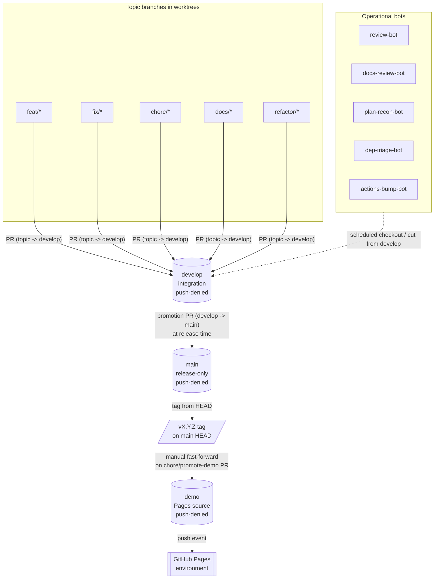
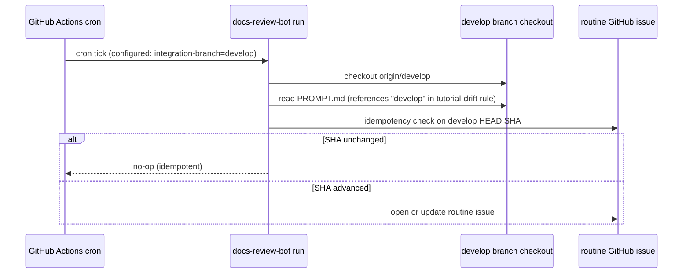

# Design — Shape B branching adoption

## Context

The agentic-workflow template currently runs Shape A (single `main` branch + ad-hoc `release/vX.Y.Z` branches per ADR-0020). The v0.5 release cycle exposed two concrete defects: release-prep commits land on `main` before a tag is cut (creating an integration window where CI is green against partially-released content), and GitHub Pages deploys from `main` (so the public preview reflects in-progress work rather than a validated state). PRD-BRANCH-001 specifies the transition to Shape B — `develop` for integration, `main` for tagged releases only, `demo` for Pages — including 15 functional requirements, 6 NFRs, and two architect-owned clarifications (CLAR-003 demo promotion automation; CLAR-004 protection mechanism).

This design closes both clarifications, names the affected components, sequences the rollout, and routes the irreversible decisions through ADR-0027 (which supersedes ADR-0020).

## Goals (design-level)

- D1. Pick a `demo` promotion mechanism (CLAR-003) and document it so the spec stage can write the procedure.
- D2. Pick a branch-protection mechanism for `develop` and `demo` (CLAR-004) consistent with this repo's GitHub plan tier.
- D3. Specify the exact deny-rule strings to add to `.claude/settings.json` so REQ-BRANCH-002, REQ-BRANCH-003, REQ-BRANCH-011 are unambiguous.
- D4. Specify the rollout order so NFR-BRANCH-006 (Pages continuity) and NFR-BRANCH-001 / NFR-BRANCH-002 (non-destructive seeding) hold.
- D5. Record one new ADR superseding ADR-0020 (REQ-BRANCH-010) and update the predecessor frontmatter only (immutable-body rule).

## Non-goals

- ND1. No prescription for which contributor opens which PR — process detail belongs to the spec stage.
- ND2. No new CI workflows beyond the demo-promotion entry; we are not redesigning the release workflow.
- ND3. No data model — this feature has no runtime data.
- ND4. No user-facing UI surface — Parts A and B are N/A.

---

## Part A — UX

**N/A.** This feature has no user-facing UI surface. The "users" are the maintainer, contributors, operational bots, and Pages visitors; their interaction is through git operations and the public Pages site, both of which are existing surfaces. UX-relevant copy (the `docs/branching.md` rewrite) is a documentation-only artifact owned by the spec stage.

## Part B — UI

**N/A.** No screens, components, or design tokens introduced. The Pages site continues to render `sites/index.html` from the deploying branch; only the source branch changes.

---

## Part C — Architecture

### System overview

Three-branch topology. Topic branches feed `develop`; `develop` promotes to `main` via PR at release time; tags are cut on `main`; `demo` is fast-forwarded to the tagged commit on `main`. Bots and Pages key off the appropriate long-lived branch.



### Components and responsibilities

Every component below is an existing artefact whose contents change, or a new branch pointer. No new code modules are introduced.

| Component | Responsibility | Owns | Dependencies |
|---|---|---|---|
| `develop` branch (new pointer) | Integration target for all topic-branch PRs | Pointer at `main` HEAD on creation; thereafter the merge-commit history of merged topic PRs | `.claude/settings.json` deny entries; GitHub branch-protection rule |
| `main` branch (role narrowed) | Release-only branch; carries promoted commits and tag commits | Tagged release commits | Promotion PR from `develop`; existing push-deny entries |
| `demo` branch (new pointer) | GitHub Pages source; carries a fast-forward of `main` tagged HEADs | Pointer fast-forwarded to the tagged commit on `main` after each release | `.claude/settings.json` deny entries; GitHub branch-protection rule; Pages environment allow-list |
| `docs/branching.md` | Authoritative human-readable description of Shape B as the active model | Branch table, rules, promotion section, settings section | ADR-0027; contributor reads |
| `.claude/settings.json` | Local Claude Code permission boundary | Allow/deny lists for git push patterns | `docs/branching.md` rules; ADR-0027 compliance section |
| `.github/workflows/pages.yml` | Trigger GitHub Pages deployment from the correct branch | `on.push.branches` array; OIDC deploy job | `demo` branch existence; `github-pages` environment allow-list |
| `agents/operational/docs-review-bot/PROMPT.md` | Source-of-truth prompt for docs-review-bot | The "tutorial-drift" rule wording | Prompt is loaded by scheduled run |
| Bot scheduler configs (review-bot, plan-recon-bot, dep-triage-bot, actions-bump-bot) | Pass `develop` as integration-branch argument at runtime | The scheduler/runner invocation strings (workflow YAML, Dependabot config) | The bot PROMPT.md files; runtime env |
| `.github/dependabot.yml` (or Renovate config) | Specify PR target branch for automated dep updates | `target-branch` field | `develop` branch existence |
| `docs/worktrees.md` | Tell contributors which branch to cut topic branches from | "cut from `develop`" instruction | `docs/branching.md`; ADR-0027 |
| `AGENTS.md`, `CLAUDE.md` | Cross-tool root context naming the integration branch | "no direct commits on `main` / `develop`" rule wording, PR target references | `docs/branching.md`; ADR-0027 |
| ADR-0027 (new) | Record the Shape B adoption decision and supersede ADR-0020 | Frontmatter (`supersedes: [ADR-0020]`); decision body; compliance rules | ADR-0020 (predecessor); `templates/adr-template.md` |
| ADR-0020 (frontmatter only) | Predecessor pointer | `status: Superseded`; `superseded-by: [ADR-0027]` | ADR-0027 acceptance |
| GitHub Pages environment (`github-pages`) | Gate deployments to allowed source branches | Environment "Deployment branches" allow-list | `pages.yml` trigger branch; manual UI step |
| GitHub branch-protection (rule or ruleset, see Key decisions) | Block direct push to `develop` and `demo` at the remote | Push restriction; required PR | GitHub plan tier (free for personal account) |

### Data model

**N/A.** No runtime data; no entities; no migrations. The only "schema" change is JSON entries in `.claude/settings.json` and YAML entries in `pages.yml` — both covered under spec.md as exact-string contracts.

### Data flow

#### Flow 1 — A topic PR lands on `develop`

```mermaid
sequenceDiagram
    actor Contributor
    participant Worktree as .worktrees/<slug>/
    participant GitHub
    participant Bots as docs-review-bot

    Contributor->>Worktree: git switch -c feat/foo origin/develop
    Contributor->>Worktree: edit files; verify
    Contributor->>GitHub: git push origin feat/foo
    Note over Contributor,GitHub: .claude/settings.json allow: "Bash(git push origin feat/*)"
    Contributor->>GitHub: gh pr create --base develop
    GitHub-->>Contributor: PR opened against develop
    GitHub->>GitHub: PR title CI, verify, review
    GitHub->>GitHub: merge to develop
    Bots->>GitHub: read develop HEAD on next run
```

#### Flow 2 — Release: `develop` → `main` → tag → `demo` → Pages

```mermaid
sequenceDiagram
    actor Maintainer
    participant develop
    participant main
    participant tag as vX.Y.Z tag
    participant demo
    participant Pages as GitHub Pages

    Maintainer->>develop: ensure green; release-prep commits already on develop
    Maintainer->>main: open promotion PR (develop -> main)
    main->>main: PR review + verify
    main->>main: merge promotion PR
    Maintainer->>tag: create vX.Y.Z on main HEAD
    tag-->>Maintainer: tag exists on main first-parent history
    Maintainer->>demo: open chore/promote-demo PR (fast-forward demo to tagged main)
    demo->>demo: review + merge (or maintainer pushes via GitHub UI bypass per ruleset)
    demo->>Pages: push event triggers pages.yml
    Pages-->>Maintainer: deployed page_url
```

#### Flow 3 — Bot runs against `develop`



### Interaction / API contracts

No HTTP/RPC API. The "contracts" in this feature are exact-text contracts on configuration files, captured here as sketches; full strings live in `spec.md`:

- **`.claude/settings.json` deny entries (REQ-BRANCH-002, REQ-BRANCH-003).** Two new lines for `demo` push-deny; the existing `develop` deny entries stay (they are already present — see `.claude/settings.json` lines 41–42).
- **`.claude/settings.json` allow entries (REQ-BRANCH-011).** Remove the two `release/*` entries (lines 36–37 in the current file).
- **`.github/workflows/pages.yml` trigger (REQ-BRANCH-004).** Replace `branches: [main]` with `branches: [demo]`.
- **`agents/operational/docs-review-bot/PROMPT.md` (REQ-BRANCH-008).** Replace the literal string `clean clone of main` (with backticks around `main`) with `clean clone of develop` (or "the integration branch").
- **`.github/dependabot.yml` `target-branch` field.** Set to `develop` (technical-consideration 3 from research).

No breaking change to any public surface — this is internal repo plumbing. Downstream adopters who copied an older `.claude/settings.json` are unaffected; their settings file is theirs to maintain.

### Key decisions

| Decision | Choice | Why | ADR |
|---|---|---|---|
| Single ADR vs. separate ADRs for the two coupled decisions (Shape B adoption + `release/*` drop) | Single ADR (ADR-0027) covering both | The two are inseparable per research Q3; partial supersession not required by any future scenario; reduces cross-reference overhead | ADR-0027 |
| `demo` promotion trigger (CLAR-003) | Manual `chore/promote-demo` PR cut after each `main` tag, listed in the release checklist; **no** automated CI tag-trigger in this iteration | Single-maintainer cadence is low; an automated workflow would need to push to `demo` (a protected branch) which requires either a ruleset bypass list or a PAT — both expand the threat surface for negligible velocity gain. The manual step is reversible and discoverable; automation can be added later as a follow-up ADR if cadence rises | ADR-0027 §Compliance |
| Branch-protection mechanism for `develop` and `demo` (CLAR-004) | GitHub **rulesets** (not legacy branch-protection rules) | Rulesets are available on free-tier personal accounts for public repos as of 2024; legacy rules are being phased out by GitHub; rulesets give a single allow-list for bypass actors (the maintainer) and a single source of truth for both branches; bypass for the manual `demo` promotion is configurable without a PAT | ADR-0027 §Compliance |
| `.claude/settings.json` deny syntax for `demo` | Add exactly `"Bash(git push origin demo:*)"` and `"Bash(git push -u origin demo:*)"` matching the existing `main` / `develop` patterns; also add `"Bash(git checkout demo:*)"`, `"Bash(git branch -D demo:*)"`, `"Bash(git branch -d demo:*)"`, and `"Bash(git reset --hard origin/demo:*)"` / `"Bash(git reset --hard demo:*)"` for symmetry with `main` and `develop` deny coverage | NFR-BRANCH-005 forbids the deny list shrinking; symmetric coverage prevents accidental hard-resets and force-checkouts of `demo`, matching how `main`/`develop` are protected | ADR-0027 |
| `release/*` push-allow removal timing | Remove in the same change set, not deferred | Research recommended deferral as low priority; PRD raised it to a `should` requirement (REQ-BRANCH-011); doing it together avoids a stale-config window and is one-line of risk | ADR-0027 |
| Bots: PROMPT.md edits vs. scheduler-only edits | `docs-review-bot` PROMPT.md edited (1 line, REQ-BRANCH-008); other four bots unchanged at PROMPT.md level — scheduler config only (REQ-BRANCH-009) | Research Q1 audit confirmed only one literal `main` reference in any prompt; the remaining bots already use `<integration-branch>` placeholders or generic phrasing | — (operational, not architectural) |
| `demo` initial seed source | `main` HEAD at adoption time (REQ-BRANCH-014) | Cleanest non-destructive starting state; matches Pages continuity NFR-BRANCH-006; identical bytes mean Pages sees no diff at the trigger flip | — (mechanical) |
| `develop` initial seed source | `main` HEAD at adoption time (REQ-BRANCH-006) | Same rationale as above; pointer creation, no history rewrite | — (mechanical) |

### Alternatives considered

#### Alt-1 — Keep Shape A (status quo plus a `demo` Pages branch only)

Reject. Addresses only the Pages staleness problem and leaves the integration-window defect intact. The v0.5.1 readiness-check failures recorded in ADR-0020's errata are evidence that the integration window causes real harm at this cadence. Adopters who inspect this template would still see Shape A, contradicting the desired-outcome of providing a live Shape B reference. Detailed in research §Alternatives Alt-B.

#### Alt-2 — Full specorator parity (Shape B + topic-prefix rename + squash-merge default + tag-scheme change)

Reject. Each of the three additional changes has its own blast radius and is excluded from this feature's scope per PRD-BRANCH-001 NG1–NG3. Bundling them would expand the change-set across `.claude/settings.json` allow-list, every agent prompt that mentions `feat/`, every CI regex, every existing in-flight branch, the tag-source script in `scripts/lib/release-readiness.ts`, and downstream adopter expectations. Shape B alone resolves the documented harm; the other three are independent improvements that can each be filed as their own feature when justification appears.

#### Alt-3 — `demo` auto-promoted by CI on every `main` tag creation

Reject for this iteration. Would require: (a) a new GitHub Actions workflow listening for tag events, (b) a write credential against `demo` (PAT or app-token because the default `GITHUB_TOKEN` cannot bypass branch protection without explicit ruleset bypass), (c) error-recovery logic when the auto-fast-forward fails (e.g., `demo` ahead of `main`). The complexity is unjustified at single-maintainer cadence. The manual `chore/promote-demo` PR keeps the protection model uniform and is one extra command per release. Revisit when cadence rises (recorded in ADR-0027 revisit trigger).

### Risks

| ID | Risk | Severity | Likelihood | Mitigation |
|---|---|---|---|---|
| RISK-BRANCH-001 | Pages serves a 404 or stale content during the trigger swap (Pages-environment allow-list not updated before `pages.yml` flips) — violates NFR-BRANCH-006 | high | med | Rollout step 4 (below) requires updating the `github-pages` environment allow-list to include `demo` *before* `pages.yml` is merged. Spec stage to record the manual UI step verbatim. The seeded `demo` branch points to the same commit as `main` so content is byte-identical; the only failure mode is permission denial, recoverable by reverting `pages.yml` |
| RISK-BRANCH-002 | The `.claude/settings.json` deny list shortens (loses coverage) when the `release/*` allow entries are removed but `demo` deny entries are forgotten — violates NFR-BRANCH-005 | med | low | Rollout step 3 specifies adding `demo` deny entries and removing `release/*` allow entries in the same edit; spec.md to enumerate exact strings; reviewer checks the diff against the count rule (post-change deny count for `main`+`develop`+`demo` ≥ pre-change deny count for `main`+`develop`) |
| RISK-BRANCH-003 | Bot scheduler reconfiguration missed for one or more of the four scheduler-config-only bots — produces false drift findings or missed coverage (REQ-BRANCH-009) | med | med | Spec.md to enumerate the exact scheduler/runner config file path per bot (or escalate as clarification if the path is in an external system not tracked in the repo); rollout step 6 lists each bot by name; review checklist includes "all four schedulers updated" |
| RISK-BRANCH-004 | PRs continue to target `main` for the first days after `develop` exists (contributor habit, RISK-001 in research) | low | high | `docs/branching.md`, `AGENTS.md`, `CLAUDE.md`, `docs/worktrees.md` updated in the same PR as `develop` creation (NFR-BRANCH-003 consistency); single maintainer can also set `develop` as the GitHub default branch in repo settings to make `gh pr create` default to it without `--base develop` |
| RISK-BRANCH-005 | `release/v0.5.0` branch exists on remote but is undisplayed; deletion skipped (RISK-008 in research, REQ-BRANCH-013) | low | low | Rollout step 1 specifies pre-condition check `git ls-remote --heads origin release/v0.5.0`; deletion sequenced before `develop` creation; idempotent — safe to re-run |
| RISK-BRANCH-006 | ADR-0020 `superseded-by` left empty after ADR-0027 merges (RISK-007 in research, NFR-BRANCH-004) | low | med | ADR-0020 frontmatter update is part of this same design hand-off; the new ADR PR includes both files; review checklist in ADR-0027 §Compliance |
| RISK-BRANCH-007 | Dependabot opens its first post-flip PR against `main` because `.github/dependabot.yml` `target-branch` was forgotten | med | med | Spec.md to list `.github/dependabot.yml` (or Renovate config) update as an explicit task with the exact field name; rollout step 6 covers it under bot scheduler reconfiguration |
| RISK-BRANCH-008 | Demo promotion forgotten after a `main` tag → public Pages goes stale (RISK-006 in research) | low | med | Manual step is in the release checklist (ADR-0027 compliance); release-manager agent prompt to be updated as a follow-up if cadence rises; counter-metric defined in PRD ("zero `develop → main` promotions skipped" extends naturally to "zero `main → demo` promotions skipped" — record in retrospective) |

### Performance, security, observability

- **Performance.** No runtime change. Bot CI minutes do not increase (same number of bots, same checkout pattern, just a different ref). Pages deploy time unchanged. CI lead time per topic PR may decrease marginally because `develop` carries less drift than `main` did between releases.
- **Security.** Push-deny coverage expands (adds `demo`); does not contract (NFR-BRANCH-005). The `release/*` allow-list removal narrows the remote-push surface for Claude Code agents from five long-lived prefixes to four. GitHub ruleset on `develop` and `demo` adds a server-side enforcement layer that survives clone-and-push from any client. No new credentials introduced; the manual `demo` promotion uses the maintainer's existing push permissions via a PR (no new PAT, no new app token).
- **Observability.** No new SLI. Existing PR-title CI, verify gate, and Pages deployment status remain the operational signals. The "zero PRs targeting `main`" north-star metric (PRD §Success metrics) is observable from the GitHub PR list filtered by `base:main`.

### ADR diff (for ADR-0020 supersession)

Apply only to **frontmatter** of `docs/adr/0020-v05-release-branch-strategy.md`. The body remains immutable per the rule restated at the bottom of the ADR.

```diff
 ---
 id: ADR-0020
 title: Adopt Shape A with release/vX.Y.Z branches for v0.5 releases
-status: accepted
+status: Superseded
 date: 2026-05-02
 deciders:
   - architect
 consulted:
   - pm
   - release-manager
 informed:
   - dev
   - qa
   - sre
 supersedes: []
-superseded-by: []
+superseded-by: [ADR-0027]
 tags: [release, branching, governance]
 ---
```

No other lines in ADR-0020 change. The existing 2026-05-02 errata stays untouched.

### Rollout sequence

The implementation order is non-destructive and ordered so each step is reversible until the next one runs. The spec stage will translate this into discrete tasks; the design fixes the order.

1. **Pre-condition checks** (read-only, no remote write):
   - `git ls-remote --heads origin develop` — must return empty.
   - `git ls-remote --heads origin demo` — must return empty.
   - `git ls-remote --heads origin release/v0.5.0` — if non-empty, queue a delete in step 2.
   - Capture current `main` HEAD SHA — this is the seed commit for both new branches.
2. **Historical cleanup** (REQ-BRANCH-013): if `release/v0.5.0` exists, delete with `git push origin --delete release/v0.5.0`. Safe — that branch is post-tag and superseded by the v0.5.0 tag itself. Skip if not present.
3. **Settings update PR** (touches `.claude/settings.json` only) — independent, can land first or alongside step 5:
   - Add `demo` deny entries (REQ-BRANCH-003).
   - Remove `release/*` allow entries (REQ-BRANCH-011).
   - Add `demo` symmetric deny entries (`reset`, `checkout`, `branch -D/-d`).
   - Verify count rule (NFR-BRANCH-005).
4. **GitHub Pages environment update** (manual UI step, no PR): Settings → Environments → `github-pages` → Deployment branches → add `demo` to allow-list. Do **not** remove `main` from the allow-list yet; remove only after step 7 confirms `demo` deploys cleanly. This satisfies the NFR-BRANCH-006 sequencing constraint.
5. **Branch creation** (no content, no rewrites):
   - `git push origin <captured-main-SHA>:refs/heads/develop` (REQ-BRANCH-006, NFR-BRANCH-001).
   - `git push origin <captured-main-SHA>:refs/heads/demo` (REQ-BRANCH-014, NFR-BRANCH-002).
   - In repo Settings, set `develop` as the default branch (so `gh pr create` defaults to `develop`).
6. **Branch protection rulesets** (manual UI step or `gh api` calls):
   - Create or update a ruleset that targets `main`, `develop`, `demo` and enforces: require PR before merge; restrict creations / deletions; bypass list = maintainer (for `demo` manual promotion).
7. **Pages workflow flip PR** (touches `.github/workflows/pages.yml` only) — sequenced *after* step 4:
   - Change `on.push.branches` from `[main]` to `[demo]` (REQ-BRANCH-004).
   - Trigger one manual `workflow_dispatch` on `demo` to verify the deploy succeeds.
   - After verified-green, optionally remove `main` from the `github-pages` environment allow-list (closes the legacy path).
8. **Documentation + ADR PR** (touches `docs/branching.md`, `docs/worktrees.md`, `AGENTS.md`, `CLAUDE.md`, `agents/operational/docs-review-bot/PROMPT.md`, `docs/adr/0027-adopt-shape-b-branching-model.md`, and `docs/adr/0020-v05-release-branch-strategy.md` frontmatter, and `docs/adr/README.md` index):
   - REQ-BRANCH-001, REQ-BRANCH-005, REQ-BRANCH-007, REQ-BRANCH-008, REQ-BRANCH-010, REQ-BRANCH-012, REQ-BRANCH-015, NFR-BRANCH-003, NFR-BRANCH-004 all close here.
   - This is the largest PR; it locks the new model in writing.
9. **Bot scheduler reconfiguration** (REQ-BRANCH-009): for `review-bot`, `plan-recon-bot`, `dep-triage-bot`, `actions-bump-bot`, update each scheduler's invocation to pass `develop`. For Dependabot, update `.github/dependabot.yml` `target-branch: develop`. Spec stage will identify the exact files; some live outside `agents/operational/` per research technical-consideration 6.
10. **Verification**:
    - `gh pr list --base main` — should show only the (none-yet) post-adoption promotion PRs going forward.
    - Pages site loads; `chore/promote-demo` dry-run unnecessary because `demo` already points at `main` HEAD.
    - `docs-review-bot` next scheduled run does not flag the tutorial-drift rule.
    - Counter-metric: zero direct commits on `main` in the next 30 days.

Steps 3, 5, 7, 8, 9 each land as their own PR per the branch-per-concern rule. Step 4 and Step 6 are GitHub UI actions logged in the implementation log per ADR-0027 compliance. Order matters between 4 → 7 (Pages allow-list before workflow flip) and between 5 → 6 (branches must exist before they can be ruleset-protected).

---

## Cross-cutting

### Requirements coverage

| REQ ID | Addressed in (Arch section) |
|---|---|
| REQ-BRANCH-001 | Components and responsibilities (`docs/branching.md`); Rollout step 8 |
| REQ-BRANCH-002 | Interaction / API contracts (deny entries — already present, retained); Key decisions (deny syntax row); Rollout step 3 |
| REQ-BRANCH-003 | Interaction / API contracts (new `demo` deny entries); Key decisions (deny syntax row); Rollout step 3 |
| REQ-BRANCH-004 | Interaction / API contracts (pages.yml trigger); Rollout step 7; Risks RISK-BRANCH-001 |
| REQ-BRANCH-005 | Components and responsibilities (`docs/branching.md`); Rollout step 8 |
| REQ-BRANCH-006 | Rollout step 1, step 5; NFR-BRANCH-001 mitigation; Key decisions (`develop` initial seed source) |
| REQ-BRANCH-007 | Components and responsibilities (`docs/branching.md`); Rollout step 8 |
| REQ-BRANCH-008 | Interaction / API contracts (PROMPT.md text); Components and responsibilities; Rollout step 8 |
| REQ-BRANCH-009 | Components and responsibilities (Bot scheduler configs); Rollout step 9; Risks RISK-BRANCH-003, RISK-BRANCH-007 |
| REQ-BRANCH-010 | Components and responsibilities (ADR-0027); Key decisions (single ADR row); ADR diff section; Rollout step 8 |
| REQ-BRANCH-011 | Interaction / API contracts (allow-list removal); Key decisions (`release/*` removal timing); Rollout step 3 |
| REQ-BRANCH-012 | Components and responsibilities (`docs/worktrees.md`); Rollout step 8 |
| REQ-BRANCH-013 | Rollout step 1, step 2; Risks RISK-BRANCH-005 |
| REQ-BRANCH-014 | Rollout step 5; Key decisions (`demo` initial seed source); Data flow Flow 2 |
| REQ-BRANCH-015 | Components and responsibilities (`AGENTS.md`, `CLAUDE.md`); Rollout step 8 |
| NFR-BRANCH-001 | Rollout step 1, step 5; Key decisions (`develop` initial seed source) |
| NFR-BRANCH-002 | Rollout step 1, step 5; Key decisions (`demo` initial seed source) |
| NFR-BRANCH-003 | Components and responsibilities (each affected file); Rollout step 8 (single docs PR locks the model) |
| NFR-BRANCH-004 | ADR diff section; Components and responsibilities (ADR-0020 row); Risks RISK-BRANCH-006 |
| NFR-BRANCH-005 | Key decisions (deny syntax row); Risks RISK-BRANCH-002 |
| NFR-BRANCH-006 | Rollout step 4 sequencing; Risks RISK-BRANCH-001; Key decisions (`demo` initial seed source) |

### Open questions

- OPEN-BRANCH-001 (for spec stage). Exact path and syntax for each of the four scheduler-only bot configs (review-bot, plan-recon-bot, dep-triage-bot, actions-bump-bot). Research technical-consideration 6 notes the scheduler config is not tracked in `agents/operational/`. The spec author should locate the GitHub Actions workflow files (likely `.github/workflows/<bot>.yml`) and record exact field paths; if any scheduler lives outside the repo, escalate as a clarification with the user.
- OPEN-BRANCH-002 (for spec stage). Whether to remove `main` from the `github-pages` environment allow-list immediately at step 7 or leave it for a follow-up. Architecturally optional; mention in spec but do not block on it.
- OPEN-BRANCH-003 (for spec stage). Whether to add a PR-title or PR-base CI check that fails when a topic PR targets `main` (RISK-BRANCH-004 mitigation). Out of scope for this feature per PRD NG, but worth flagging as a future improvement.

CLAR-003 and CLAR-004 from the requirements stage are **resolved** in the Key decisions table above:

- CLAR-003 → Manual `chore/promote-demo` PR per release (no auto-trigger this iteration).
- CLAR-004 → GitHub rulesets (not legacy branch-protection rules), available on free-tier personal accounts for public repos.

---

## Quality gate

- [x] UX: N/A — declared explicitly with reason.
- [x] UI: N/A — declared explicitly with reason.
- [x] Architecture: components, data flow, integration points named.
- [x] Alternatives considered and rejected with rationale.
- [x] Irreversible architectural decisions have ADRs (ADR-0027).
- [x] Risks have mitigations.
- [x] Every PRD requirement is addressed (15 REQ-BRANCH-NNN + 6 NFR-BRANCH-NNN mapped above).
- [x] Branch topology diagram present (System overview).
- [x] CLAR-003 resolved (Key decisions: manual promotion).
- [x] CLAR-004 resolved (Key decisions: GitHub rulesets).
- [x] Rollout sequence is ordered and non-destructive.
- [x] New ADR (ADR-0027) written with `supersedes: [ADR-0020]`.
- [x] ADR-0020 frontmatter update specified (status + superseded-by only; body untouched).
