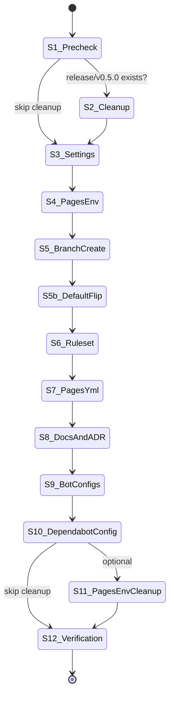

# Specification — Shape B branching adoption

## Overview

This spec is the implementation contract for adopting the Shape B branching model (`develop` integration, `main` release-only, `demo` Pages source) in the agentic-workflow template. It enumerates exact file paths, exact strings to add or remove, exact GitHub API payload shapes, the ordered 12-step rollout with preconditions and success criteria per step, edge-case handling, and an NFR verification checklist.

The spec assumes the architectural decisions already recorded in `design.md` Part C and `docs/adr/0027-adopt-shape-b-branching-model.md`:

- GitHub **rulesets** (not legacy branch-protection rules) gate `develop` and `demo` at the remote (CLAR-004).
- `demo` promotion is a **manual `chore/promote-demo` PR** per release; no CI auto-trigger this iteration (CLAR-003).
- The maintainer is in the ruleset bypass list so that the manual promotion PR can merge without a PAT.
- Seeding is **non-destructive**: `develop` and `demo` are new branch pointers at the captured `main` HEAD SHA at adoption time.

Two independent implementers reading this spec must produce the same result. Where the design left a choice open, this spec resolves it; where the design fixed a choice, this spec restates it for self-containment.

### Scope of this spec

In scope (15 functional + 6 NFR requirements):

- File edits to `.claude/settings.json`, `.github/workflows/pages.yml`, `.github/dependabot.yml`, `agents/operational/docs-review-bot/PROMPT.md`, `docs/branching.md`, `docs/worktrees.md`, `AGENTS.md`, `CLAUDE.md`.
- Branch creation: `develop` and `demo` from `main` HEAD.
- Historical cleanup: delete `release/v0.5.0` from the remote if present.
- GitHub remote configuration: rulesets covering `main`, `develop`, `demo`; default-branch flip to `develop`; `github-pages` environment "Deployment branches" allow-list update.
- Bot scheduler reconfiguration for `review-bot`, `plan-recon-bot`, `dep-triage-bot`, `actions-bump-bot` (and Dependabot via `target-branch`).
- ADR-0027 acceptance + ADR-0020 frontmatter update + ADR README index entry.

Out of scope (carried over from PRD non-goals):

- Topic prefix rename `feat/` → `feature/`.
- Squash-merge as default merge strategy.
- Tag-scheme change `vX.Y.Z` → `X.Y.Z`.
- Adding a CI gate that fails when a topic PR targets `main` (deferred per OPEN-BRANCH-003).
- Removing `main` from the `github-pages` environment allow-list immediately at flip time (deferred per OPEN-BRANCH-002 — see Edge case EC-006).

---

## Interfaces

Each interface below names: the file or remote surface, the required change, the upstream REQ-BRANCH-NNN it satisfies, the verification command, and the rollback procedure.

### IF-01 — `.claude/settings.json` deny list (REQ-BRANCH-002, REQ-BRANCH-003, NFR-BRANCH-005)

**File:** `.claude/settings.json`

**Pre-state (verified 2026-05-03 against the worktree at `.worktrees/shape-b-stage5`):**

- `permissions.allow` is the array on lines 4–38; it contains entries `"Bash(git push -u origin release/*)"` (line 36) and `"Bash(git push origin release/*)"` (line 37).
- `permissions.deny` is the array on lines 39–80; it contains `develop` push-deny entries on lines 41 (`"Bash(git push origin develop:*)"`) and 43 (`"Bash(git push -u origin develop:*)"`), and symmetric `develop` reset/checkout/branch entries on lines 58, 60, 62, 64, 66.

**Required edits (apply in one PR):**

1. **Remove from `permissions.allow`** (REQ-BRANCH-011, `should`):
   - `"Bash(git push -u origin release/*)"`
   - `"Bash(git push origin release/*)"`
2. **Add to `permissions.deny`** (REQ-BRANCH-003, `must`) — insert these six entries after the existing `develop` deny entries, preserving the symmetric pattern already used for `main` and `develop`:
   - `"Bash(git push origin demo:*)"`
   - `"Bash(git push -u origin demo:*)"`
   - `"Bash(git reset --hard origin/demo:*)"`
   - `"Bash(git reset --hard demo:*)"`
   - `"Bash(git checkout demo:*)"`
   - `"Bash(git branch -D demo:*)"`
   - `"Bash(git branch -d demo:*)"`
3. **Do not modify** the existing `main` and `develop` deny entries (REQ-BRANCH-002 — coverage retained).

**Post-state invariant:** `count(deny entries naming any of {main, develop, demo}) >= count(deny entries naming any of {main, develop} pre-change)` (NFR-BRANCH-005). The pre-change count is **12** (4 push-deny + 4 reset + 2 checkout + 2 branch-delete across `main` and `develop`). The post-change count must be **>= 19** (12 retained + 7 added for `demo`).

**Verification:**

```bash
# All three branches push-denied
node -e 'const s=require("./.claude/settings.json"); ["main","develop","demo"].forEach(b => { const has=s.permissions.deny.some(d => d.includes("git push origin "+b+":") || d.includes("git push -u origin "+b+":")); if(!has){process.exit(1)} }); console.log("OK")'

# release/* allow entries gone
node -e 'const s=require("./.claude/settings.json"); const has=s.permissions.allow.some(a => a.includes("release/*")); if(has){process.exit(1)} console.log("OK")'
```

**Rollback:** revert the PR. Settings file is JSON; no migration.

**Errors:**

- `E-IF01-001` — JSON parse failure after edit. Cause: trailing comma or duplicate key. Mitigation: `node -e 'JSON.parse(require("fs").readFileSync(".claude/settings.json"))'` before commit.
- `E-IF01-002` — Deny count regression. Cause: an existing `main`/`develop` entry deleted by accident. Mitigation: post-edit count check above.

---

### IF-02 — `.github/workflows/pages.yml` trigger (REQ-BRANCH-004)

**File:** `.github/workflows/pages.yml`

**Pre-state (lines 3–7):**

```yaml
on:
  push:
    branches:
      - main
  workflow_dispatch:
```

**Required edit:**

```yaml
on:
  push:
    branches:
      - demo
  workflow_dispatch:
```

Replace the single list element `- main` with `- demo`. No other lines change. `workflow_dispatch` remains for manual reruns.

**Verification:**

```bash
# demo present, main absent in trigger list
node -e 'const y=require("yaml").parse(require("fs").readFileSync(".github/workflows/pages.yml","utf8")); const b=y.on.push.branches; if(!b.includes("demo")||b.includes("main")){process.exit(1)} console.log("OK")'
```

**Rollback:** revert the PR. The legacy `main` trigger is restored; no Pages downtime if the `github-pages` environment allow-list still contains `main` (Edge case EC-006).

**Errors:**

- `E-IF02-001` — Pages deploy fails after merge with "branch not in environment allow-list". Cause: Step 4 (UI) was skipped. Mitigation: see Step 4 success criterion before Step 7 (this PR) merges.

---

### IF-03 — `.github/dependabot.yml` `target-branch` (RISK-BRANCH-007)

**File:** `.github/dependabot.yml`

**Pre-state:** Two `updates:` entries (`github-actions` block lines 5–30; `npm` block lines 33–58). Neither entry currently declares `target-branch`; Dependabot defaults to the repository default branch.

**Required edit:** Add `target-branch: develop` to **both** update blocks. Indent at the same level as `package-ecosystem`, `directory`, `schedule`. Place after the `directory: /` line so each block's frontmatter reads:

```yaml
  - package-ecosystem: github-actions
    directory: /
    target-branch: develop
    schedule:
      ...
```

```yaml
  - package-ecosystem: npm
    directory: /
    target-branch: develop
    schedule:
      ...
```

**Verification:**

```bash
node -e 'const y=require("yaml").parse(require("fs").readFileSync(".github/dependabot.yml","utf8")); if(!y.updates.every(u => u["target-branch"] === "develop")){process.exit(1)} console.log("OK")'
```

**Note on default branch:** After Step 5 flips the GitHub repository default branch to `develop`, Dependabot would target `develop` even without `target-branch`. Setting it explicitly is forward-compatibility insurance against a future default-branch change and removes any ambiguity for reviewers.

**Rollback:** delete the two `target-branch: develop` lines; Dependabot reverts to default-branch behaviour.

**Errors:**

- `E-IF03-001` — Dependabot opens its first post-flip PR against `main`. Cause: this edit was forgotten, and the GitHub default branch was not flipped (Step 5). Mitigation: both Step 3 (this edit) and Step 5 (default-branch flip) must complete before the next Monday Dependabot run.

---

### IF-04 — `agents/operational/docs-review-bot/PROMPT.md` tutorial-drift rule (REQ-BRANCH-008)

**File:** `agents/operational/docs-review-bot/PROMPT.md`

**Pre-state (line 46, in the "What to flag" section, item 8 "Tutorial drift `[BLOCKER]`"):**

```text
Flag the tutorial for re-run from a clean clone of `main`; if the tutorial has not been re-validated within 90 days of the change, escalate to `[BLOCKER]`.
```

**Required edit:** replace the literal substring ``clean clone of `main` `` with ``clean clone of `develop` ``. Final wording on the affected sentence:

```text
Flag the tutorial for re-run from a clean clone of `develop`; if the tutorial has not been re-validated within 90 days of the change, escalate to `[BLOCKER]`.
```

**Verification:**

```bash
# Zero matches for the old phrase
grep -c "clean clone of \`main\`" agents/operational/docs-review-bot/PROMPT.md   # must print 0
# Exactly one match for the new phrase
grep -c "clean clone of \`develop\`" agents/operational/docs-review-bot/PROMPT.md # must print 1
```

**Rollback:** revert the PR. The bot resumes its prior wording.

**Errors:** none distinct from a normal Markdown edit.

---

### IF-05 — `docs/branching.md` rewrite (REQ-BRANCH-001, REQ-BRANCH-005, REQ-BRANCH-007)

**File:** `docs/branching.md`

**Pre-state:** Currently lists Shape A and Shape B side-by-side (lines 9–24); §"Required main ruleset" describes the upstream main-only ruleset (lines 51–70); §"Release branches (`release/vX.Y.Z`)" prescribes cutting a release branch (lines 96–135); §"Why not `develop` in v0.5" (lines 133–135) records the deferral.

**Required edits (single PR, can co-locate with IF-06 through IF-09):**

1. **Promote Shape B as the active model for this template repo (REQ-BRANCH-007):**
   - The "Pick **one** of the two shapes below for your project" framing remains for adopters; **add a paragraph above the two tables** stating: *"This template repository operates under Shape B as of ADR-0027 (2026-05-03). Shape A is retained below as a documented option for downstream adopters who do not yet ship versioned releases; it is no longer the active model for template-own operations."*
2. **Topic PR target (REQ-BRANCH-001):**
   - In the Shape B table (currently lines 17–24) and in §"Rules" (currently lines 72–82), every reference to "topic PRs target `main`" must read "topic PRs target `develop`". The Shape A description may continue to name `main` as its own integration target (it remains a documented option for adopters), but the prose **outside** the Shape A subsection must not name `main` as a valid PR target for new topic work in this repo.
3. **Drop `release/vX.Y.Z` as required step (REQ-BRANCH-005):**
   - Replace §"Release branches (`release/vX.Y.Z`)" (lines 96–135) with a new §"Release path under Shape B" that names the **`develop → main` promotion PR** as the release path, and describes the post-tag **`chore/promote-demo` PR** as the Pages-source promotion. The Shape A `release/*` description may be retained inside a `Shape A only — historical convention` callout if useful for adopters; it must not be presented as the active template release process.
   - Remove the line "release/" from the Topic branch prefixes table (currently line 36) **only if** all `release/*` allow entries have been removed from `.claude/settings.json` (IF-01) in the same PR. Otherwise leave the prefix entry and add a `(Shape A only)` annotation.
4. **Update §"Required main ruleset"** (currently lines 51–70) to **§"Required ruleset for `develop`, `main`, `demo`"**:
   - The existing must-haves (block branch deletion; block non-fast-forward updates; require PR before merge; require up-to-date branch; require resolved review threads; require the four always-running status checks) all carry over to all three branches.
   - Add: "Bypass list: the maintainer is the sole bypass actor on `demo` so the manual `chore/promote-demo` PR can be merged via the GitHub UI without a PAT. No bypass actors on `main` or `develop`."
5. **Update §"Settings"** (currently lines 137–145) to read: "Push to `main`, `develop`, and `demo` is denied. Force-push to any of the three is denied."
6. **Replace or remove §"Why not `develop` in v0.5"** (currently lines 133–135). Suggested replacement title: §"Why `develop` and `demo` exist now"; reference ADR-0027 by ID and link.

**Verification:**

```bash
# No bare-prose claim that topic PRs target `main` outside Shape A subsection
grep -nE "topic.*PR.*main|target.*main.*topic" docs/branching.md  # manual review of remaining hits
# Shape B is named active
grep -c "Shape B" docs/branching.md  # must be >= 3
# release/vX.Y.Z is no longer in the active release path
grep -c "release/vX.Y.Z" docs/branching.md   # must be 0 OR only inside a "Shape A only — historical" callout
```

**Rollback:** revert the PR.

**Errors:**

- `E-IF05-001` — Shape A and Shape B both describe the active model after the edit. Cause: insufficient editing of cross-cutting prose. Mitigation: post-edit grep above plus reviewer pass.

---

### IF-06 — `docs/worktrees.md` cut-from branch (REQ-BRANCH-012)

**File:** `docs/worktrees.md`

**Required edit:** every reference to "cut from `main`" or "branch from `main`" in the worktree-setup instructions must read "cut from `develop`" or "branch from `develop`". The heuristic: any occurrence of `main` in the worktree-creation example commands (typically `git worktree add .worktrees/<slug> -b feat/<slug> main`) is replaced with `develop`.

**Verification:**

```bash
# No instruction tells contributors to cut new topic work from main
grep -nE "(cut|branch).*from.*main|origin/main.*-b feat" docs/worktrees.md  # manual review
grep -c "develop" docs/worktrees.md  # must be >= 1 in the cut-from context
```

**Rollback:** revert the PR.

---

### IF-07 — `AGENTS.md` and `CLAUDE.md` integration-branch references (REQ-BRANCH-015)

**Files:** `AGENTS.md`, `CLAUDE.md` (repo root)

**Pre-state highlights:**

- `AGENTS.md` operating-rules block already reads "**No direct commits on `main` / `develop`**" — this remains correct under Shape B and **does not change**.
- `CLAUDE.md` "Conventions specific to Claude Code" block already reads "Pushes to `main` / `develop` are denied" — this remains correct and **does not change**.

**Required edits:** any prose in either file that names `main` as the **PR target for topic work** must name `develop`. As of the current text neither file makes that explicit naming, so the edit may reduce to:

1. In `AGENTS.md` operating-rules, append to the "Branch per concern; verify before push" bullet: *"Topic PRs target `develop` (Shape B per ADR-0027); `main` carries only promoted, tagged commits."*
2. In `CLAUDE.md` conventions, append to the `.claude/settings.json` permission-rules bullet: *"Topic PRs target `develop`; `demo` is the Pages source. See `docs/branching.md`."*

**Verification:**

```bash
grep -c "Topic PRs target \`develop\`" AGENTS.md   # must be >= 1
grep -c "Topic PRs target \`develop\`" CLAUDE.md   # must be >= 1
```

**Rollback:** revert the PR.

---

### IF-08 — ADR-0027 acceptance + ADR-0020 frontmatter (REQ-BRANCH-010, NFR-BRANCH-004)

**Files:**

- `docs/adr/0027-adopt-shape-b-branching-model.md` — already drafted with `status: proposed`. Change to `status: Accepted` at acceptance time.
- `docs/adr/0020-v05-release-branch-strategy.md` — frontmatter `status` and `superseded-by` already updated in the worktree (`status: Superseded`, `superseded-by: [ADR-0027]`). The body **must not** be modified (immutable per the rule at line 141).
- `docs/adr/README.md` — index file. Add a row for ADR-0027 in the table; mark the ADR-0020 row as Superseded (or update the existing row's status column).

**Required edits:**

1. **`docs/adr/0027-adopt-shape-b-branching-model.md` line 4:** change `status: proposed` → `status: Accepted` when the implementation PR is approved for merge. (Some teams accept on PR open; per project convention, accept at merge time.)
2. **`docs/adr/0027-adopt-shape-b-branching-model.md` §Status:** change body line `Proposed` → `Accepted`.
3. **`docs/adr/README.md`:** add a row referencing `0027-adopt-shape-b-branching-model.md`; update the ADR-0020 row's status column to `Superseded` if it is not already.

**Verification:**

```bash
# ADR-0027 frontmatter accepted
grep -E "^status: Accepted$" docs/adr/0027-adopt-shape-b-branching-model.md
# ADR-0020 frontmatter superseded
grep -E "^status: Superseded$" docs/adr/0020-v05-release-branch-strategy.md
grep -E "^superseded-by: \[ADR-0027\]$" docs/adr/0020-v05-release-branch-strategy.md
# ADR-0020 body unchanged
git log --oneline -- docs/adr/0020-v05-release-branch-strategy.md  # only the frontmatter-update commit appears in this PR's range
# README index has ADR-0027 entry
grep -c "0027-adopt-shape-b-branching-model" docs/adr/README.md   # must be >= 1
```

**Rollback:** revert the PR. ADR-0027 returns to `proposed`; ADR-0020 frontmatter reverts in the same revert commit.

**Errors:**

- `E-IF08-001` — ADR-0020 body modified by accident. Cause: editor open in a wide diff. Mitigation: pre-commit `git diff docs/adr/0020-v05-release-branch-strategy.md` must show only frontmatter lines changed.

---

### IF-09 — Bot scheduler reconfiguration (REQ-BRANCH-009)

**Pre-state (Open question OPEN-BRANCH-001):** the exact path to each scheduler config is not yet enumerated in the design. Research technical-consideration 6 notes the configs may live outside `agents/operational/`. The implementer must locate them and apply the change.

**Required action:** for each of `review-bot`, `plan-recon-bot`, `dep-triage-bot`, `actions-bump-bot`:

1. Locate the scheduler/runner config (most likely `.github/workflows/<bot>.yml` based on the operational-bot pattern).
2. Identify the field, env var, or input that names the integration branch (typical names: `INTEGRATION_BRANCH`, `BRANCH`, `target-branch`, or a positional argument to the bot's runner script).
3. Set the value to `develop`.
4. If no such field exists today (the bot defaults to the repo default branch) and the GitHub default branch is being flipped to `develop` in Step 5, document that fact in the implementation log; no edit is required for that bot, and Step 5 alone satisfies REQ-BRANCH-009 for it.
5. If the scheduler lives **outside** the repo (research technical-consideration 6 explicitly calls this out as possible), escalate as a clarification to the user; do not silently invent a new config file.

**Verification (per bot):**

```bash
# Per-bot check; replace <bot> with each of the four
grep -nE "INTEGRATION_BRANCH|integration-branch|target-branch|BRANCH:.*develop" .github/workflows/<bot>.yml
```

**Rollback:** revert the per-bot edit.

**Errors:**

- `E-IF09-001` — Bot opens or skips work against `main` after the flip. Cause: scheduler config not located, or located but the wrong field updated. Mitigation: per-bot dry-run after Step 5 (default-branch flip) before Step 12 (verification window opens).

---

### IF-10 — GitHub Pages environment allow-list (REQ-BRANCH-004 sequencing, NFR-BRANCH-006)

**Surface:** GitHub repository Settings → Environments → `github-pages` → "Deployment branches and tags".

**Required action (manual UI step, no PR; recorded in implementation log):**

1. Open the `github-pages` environment.
2. Under "Deployment branches and tags", select "Selected branches and tags" (if not already selected).
3. **Add** `demo` to the allow-list. **Do not remove** `main` at this step (see Edge case EC-006 and Step 7).
4. Save.

**Success criterion:** the environment allow-list contains both `main` and `demo` after this step. The `main` entry persists until Step 11 optionally removes it.

**Verification (post-step):**

```bash
gh api -H "Accept: application/vnd.github+json" \
  /repos/$OWNER/$REPO/environments/github-pages/deployment-branch-policies \
  --jq '[.branch_policies[].name]'
# Output must include "demo"; "main" remains until later
```

**Rollback:** in the UI, remove `demo` from the allow-list. Pages deploy continues from `main` (no downtime).

**Errors:**

- `E-IF10-001` — Pages deploy fails after Step 7 with "branch not in environment". Cause: this step skipped. Mitigation: Step 4 success criterion above must be evidenced before the Step 7 PR merges.

---

### IF-11 — GitHub ruleset for `main`, `develop`, `demo` (CLAR-004)

**Surface:** GitHub repository Settings → Rules → Rulesets, OR `gh api` with the Repository Rulesets endpoint.

**Existing ruleset:** the repo currently has a ruleset named `main` per `docs/branching.md` lines 51–70. It targets the default branch (`main`) and enforces: no deletion; no non-FF; require PR before merge; require up-to-date; require resolved review threads; required status checks `Verify`, `Conventional Commits PR title`, `spell check`, `scan for committed secrets`.

**Required action:** **extend** the existing ruleset (preferred — single source of truth) OR **create** a second ruleset named `develop-and-demo` (alternative — see Edge case EC-008). Recommended: extend.

**Extend (`PATCH /repos/{owner}/{repo}/rulesets/{ruleset_id}`) payload shape:**

```json
{
  "name": "main",
  "target": "branch",
  "enforcement": "active",
  "conditions": {
    "ref_name": {
      "include": [
        "refs/heads/main",
        "refs/heads/develop",
        "refs/heads/demo"
      ],
      "exclude": []
    }
  },
  "bypass_actors": [
    {
      "actor_id": <maintainer-user-id>,
      "actor_type": "RepositoryRole",
      "bypass_mode": "pull_request"
    }
  ],
  "rules": [
    { "type": "deletion" },
    { "type": "non_fast_forward" },
    {
      "type": "pull_request",
      "parameters": {
        "required_approving_review_count": 0,
        "dismiss_stale_reviews_on_push": false,
        "require_code_owner_review": false,
        "require_last_push_approval": false,
        "required_review_thread_resolution": true
      }
    },
    {
      "type": "required_status_checks",
      "parameters": {
        "strict_required_status_checks_policy": true,
        "required_status_checks": [
          { "context": "Verify" },
          { "context": "Conventional Commits PR title" },
          { "context": "spell check" },
          { "context": "scan for committed secrets" }
        ]
      }
    }
  ]
}
```

Notes on the payload:

- `conditions.ref_name.include` is the field that extends coverage from `main` only to all three branches. Pre-change: `["refs/heads/main"]`. Post-change: `["refs/heads/main", "refs/heads/develop", "refs/heads/demo"]`.
- `bypass_actors` carries the maintainer for the `chore/promote-demo` PR merge case (CLAR-003 / ADR-0027 §Compliance). `bypass_mode: "pull_request"` allows the maintainer to bypass via the PR merge button but not via direct push.
- `required_approving_review_count: 0` matches `docs/branching.md` line 70 ("Approving reviews are intentionally not required in the upstream ruleset yet").
- `strict_required_status_checks_policy: true` corresponds to the "branch must be up to date before merge" requirement in `docs/branching.md` line 60.

**Discovery commands (read-only; run before PATCH):**

```bash
# Find the existing ruleset ID
gh api -H "Accept: application/vnd.github+json" /repos/$OWNER/$REPO/rulesets --jq '.[] | {id, name, target, enforcement}'
# Read the current payload (use this as the baseline for the PATCH body)
gh api -H "Accept: application/vnd.github+json" /repos/$OWNER/$REPO/rulesets/$RULESET_ID
```

**PATCH command:**

```bash
gh api -X PATCH -H "Accept: application/vnd.github+json" \
  /repos/$OWNER/$REPO/rulesets/$RULESET_ID \
  --input ruleset-payload.json
```

**Verification (post-PATCH):**

```bash
gh api /repos/$OWNER/$REPO/rulesets/$RULESET_ID --jq '.conditions.ref_name.include'
# Must equal ["refs/heads/main", "refs/heads/develop", "refs/heads/demo"]
```

**Rollback:** re-PATCH with the pre-change payload (the read step captured this baseline) — single `gh api` call, idempotent.

**Errors:**

- `E-IF11-001` — PATCH returns 422 with "ref_name pattern invalid". Cause: typo in ref name (must be `refs/heads/<branch>`, not bare `<branch>`). Mitigation: use the exact strings above.
- `E-IF11-002` — PATCH returns 403. Cause: token lacks `admin:repo` scope. Mitigation: re-authenticate `gh auth refresh -s admin:repo`.
- `E-IF11-003` — Maintainer bypass fails on the `chore/promote-demo` PR merge. Cause: `bypass_actors` empty or `bypass_mode` set to `always` (which can be more restrictive in some plans) — set to `pull_request`.
- `E-IF11-004` — Required status check "Verify" not found on `develop` because no PR has yet run on `develop`. Cause: status checks are evaluated at PR-merge time, not ruleset-creation time. Mitigation: this is expected on the first PR after Step 6; the check will run normally.

---

### IF-12 — GitHub default-branch flip (RISK-BRANCH-004 mitigation)

**Surface:** GitHub repository Settings → General → "Default branch" → switch icon.

**Required action (manual UI step, after Step 5 creates `develop`):**

1. Open repository Settings → General.
2. Under "Default branch", click the switch icon, choose `develop`, confirm.

**Effect:** `gh pr create` and the GitHub web UI default the PR base to `develop`; new clones default-checkout `develop`.

**Verification:**

```bash
gh repo view --json defaultBranchRef --jq '.defaultBranchRef.name'   # must print "develop"
```

**Rollback:** flip back to `main` in the same UI.

**Errors:** none. The flip is a metadata change; the `main` branch is unchanged.

---

## Data Structures

This feature has no runtime data. The "data structures" are configuration payloads.

### DS-01 — `.claude/settings.json` deny-list entry shape

Each entry is a string of the form `"Bash(<exact-command-prefix>)"`. The `<exact-command-prefix>` is matched as a literal prefix against the candidate command string by the Claude Code permission layer. For wildcards within the command, use the `*` glyph as recognised by the harness (see file-level `_comment` field in `.claude/settings.json` line 106).

**`demo` deny entry shape (REQ-BRANCH-003) — exact strings:**

| String | Purpose |
|---|---|
| `"Bash(git push origin demo:*)"` | Block `git push origin demo` and `git push origin demo --force` etc. |
| `"Bash(git push -u origin demo:*)"` | Block `git push -u origin demo` |
| `"Bash(git reset --hard origin/demo:*)"` | Block hard-reset of local HEAD to `origin/demo` |
| `"Bash(git reset --hard demo:*)"` | Block hard-reset of local HEAD to local `demo` |
| `"Bash(git checkout demo:*)"` | Block accidental `git checkout demo` (operator should use `git switch`) |
| `"Bash(git branch -D demo:*)"` | Block force-delete of `demo` |
| `"Bash(git branch -d demo:*)"` | Block normal delete of `demo` |

The pattern is identical to the existing `main` (lines 40, 42, 57, 59, 61, 63, 65) and `develop` (lines 41, 43, 58, 60, 62, 64, 66) groups.

### DS-02 — GitHub Ruleset payload (extending coverage)

See IF-11 above for the full PATCH payload. The minimal diff that extends coverage from `main` only to all three branches is:

```diff
   "conditions": {
     "ref_name": {
-      "include": ["refs/heads/main"],
+      "include": [
+        "refs/heads/main",
+        "refs/heads/develop",
+        "refs/heads/demo"
+      ],
       "exclude": []
     }
   },
+  "bypass_actors": [
+    {
+      "actor_id": <maintainer-user-id>,
+      "actor_type": "RepositoryRole",
+      "bypass_mode": "pull_request"
+    }
+  ],
```

### DS-03 — `pages.yml` `on.push.branches` shape

YAML list of branch names (no `refs/heads/` prefix; the workflow event matcher resolves bare branch names).

```yaml
on:
  push:
    branches:
      - demo   # exactly one entry; do not list main
```

### DS-04 — `dependabot.yml` `target-branch` field

YAML scalar attached to each entry under `updates:`.

```yaml
- package-ecosystem: <ecosystem>
  directory: /
  target-branch: develop
  schedule: ...
```

### DS-05 — `github-pages` environment "Deployment branches" allow-list

Array of branch-name patterns, managed via the GitHub UI or the `/repos/{owner}/{repo}/environments/{env}/deployment-branch-policies` API.

Post-Step 4 state:

```json
{
  "branch_policies": [
    { "name": "main" },
    { "name": "demo" }
  ]
}
```

Post-Step 11 (optional) state:

```json
{
  "branch_policies": [
    { "name": "demo" }
  ]
}
```

### DS-06 — ADR frontmatter fields (NFR-BRANCH-004)

```yaml
# ADR-0027
status: Accepted               # was "proposed"
supersedes: [ADR-0020]         # already set
superseded-by: []              # remains empty

# ADR-0020
status: Superseded             # was "accepted"
superseded-by: [ADR-0027]      # was []
supersedes: []                 # unchanged
```

ADR-0020 body is **immutable** per the rule at line 141 of that file. Only the `status` and `superseded-by` frontmatter fields may change; any other diff to ADR-0020 in this PR is a defect.

---

## State Transitions — The 12-step rollout

Each step has: **preconditions** (must be true to enter), **actions** (what the implementer does), **success criteria** (how to know the step succeeded), and **REQ links**. Steps are ordered; do not reorder. Each "PR" step lands as its own pull request per the branch-per-concern rule (`.claude/memory/feedback_pr_hygiene.md`). Manual UI steps are recorded in `specs/shape-b-branching-adoption/implementation-log.md` with the maintainer's confirmation timestamp.



### Step 1 — Pre-condition checks (read-only; no PR)

**Preconditions:** the implementer is on the worktree at `.worktrees/shape-b-stage5` with `gh` authenticated against the upstream repo.

**Actions:**

```bash
git fetch origin
git ls-remote --heads origin develop          # capture stdout
git ls-remote --heads origin demo             # capture stdout
git ls-remote --heads origin release/v0.5.0   # capture stdout
git rev-parse origin/main                     # capture as $MAIN_HEAD_SHA
```

**Success criteria:**

- `develop` query returns empty (no existing pointer). If non-empty → see Edge case EC-001.
- `demo` query returns empty. If non-empty → see Edge case EC-002.
- `release/v0.5.0` query result captured (empty or non-empty drives Step 2 branching).
- `$MAIN_HEAD_SHA` captured as a 40-char hex string for use in Step 5.

**REQ:** REQ-BRANCH-013 (precondition for the conditional cleanup), NFR-BRANCH-001/002 (capture the seed SHA so seeding is provably non-destructive).

---

### Step 2 — Historical cleanup (conditional; no PR)

**Preconditions:** Step 1 reports `release/v0.5.0` exists on the remote. If absent, **skip this step**.

**Actions:**

```bash
git push origin --delete release/v0.5.0
```

**Success criteria:**

```bash
git ls-remote --heads origin release/v0.5.0   # must return empty
```

**REQ:** REQ-BRANCH-013.

**Note:** safe — the branch is post-tag, superseded by the v0.5.0 tag itself. If the deletion is rejected (Edge case EC-003), do not force.

---

### Step 3 — Settings PR

**Preconditions:** Steps 1–2 complete. No other open PR is editing `.claude/settings.json`.

**Actions:**

1. Cut a topic branch: `git switch -c chore/shape-b-settings origin/main` (the worktree currently sits on `main`-derived history; `develop` does not yet exist remotely).
2. Apply edits per IF-01.
3. Run `npm run verify`.
4. Commit (one commit) with message: `chore(branching): IF-01 add demo deny entries; remove release/* allow entries (REQ-BRANCH-002, REQ-BRANCH-003, REQ-BRANCH-011, NFR-BRANCH-005)`.
5. Push and open PR. Base = `main` (Shape A is still active until Step 8 docs land; this PR pre-dates the flip).

**Success criteria:**

- IF-01 verification commands pass.
- PR title CI green; verify gate green.
- PR merges.

**REQ:** REQ-BRANCH-002 (retained), REQ-BRANCH-003, REQ-BRANCH-011, NFR-BRANCH-005.

**Edge cases:** EC-004 (deny count regression on review).

---

### Step 4 — GitHub Pages environment allow-list (manual UI; no PR)

**Preconditions:** Step 3 merged. The `demo` branch does not yet exist (it is created in Step 5), but the environment allow-list can be pre-populated for any branch name.

**Actions:** per IF-10 above. Add `demo` to the allow-list; **leave `main` in place**.

**Success criteria:** `gh api ... /environments/github-pages/deployment-branch-policies --jq '[.branch_policies[].name]'` includes both `main` and `demo`.

**REQ:** REQ-BRANCH-004 sequencing, NFR-BRANCH-006.

**Implementation log entry required:** date, time, allow-list contents before and after.

**Edge case:** EC-005 (Pages env not yet configured at all).

---

### Step 5 — Branch creation (no PR; remote-only operation)

**Preconditions:** Step 1's `$MAIN_HEAD_SHA` captured. Steps 1 confirmed `develop` and `demo` absent on the remote. The implementer's local clone has `git push` permission (push to a non-deny-listed pattern). Note: pushing to `refs/heads/develop` or `refs/heads/demo` directly is currently **not** in the deny list because the deny entries (lines 41, 43 for `develop`; soon-to-be entries for `demo`) match the form `git push origin <branch>:*`, not `git push origin <SHA>:refs/heads/<branch>`. The maintainer performs Step 5 once; thereafter the deny entries protect the branches.

**Actions:**

```bash
# Seed develop at main HEAD
git push origin ${MAIN_HEAD_SHA}:refs/heads/develop

# Seed demo at main HEAD (same SHA)
git push origin ${MAIN_HEAD_SHA}:refs/heads/demo
```

**Success criteria:**

```bash
git ls-remote --heads origin develop  # returns ${MAIN_HEAD_SHA}\trefs/heads/develop
git ls-remote --heads origin demo     # returns ${MAIN_HEAD_SHA}\trefs/heads/demo
```

Both branches must point to the **same SHA** as `origin/main` at this moment.

**REQ:** REQ-BRANCH-006, REQ-BRANCH-014, NFR-BRANCH-001, NFR-BRANCH-002.

**Edge cases:** EC-001 (`develop` exists), EC-002 (`demo` exists).

---

### Step 5b — Default-branch flip (manual UI; no PR)

**Preconditions:** Step 5 succeeded; `develop` exists on the remote.

**Actions:** per IF-12 above.

**Success criteria:** `gh repo view --json defaultBranchRef --jq '.defaultBranchRef.name'` prints `develop`.

**REQ:** RISK-BRANCH-004 mitigation; supports REQ-BRANCH-009 for any bot whose scheduler defaults to the repo default branch.

---

### Step 6 — Ruleset extension (manual UI or `gh api`; no PR)

**Preconditions:** Steps 5 and 5b complete; `develop` and `demo` exist.

**Actions:** per IF-11 above. PATCH the existing ruleset to extend `conditions.ref_name.include` to all three branches and add the maintainer to `bypass_actors`.

**Success criteria:** `gh api /repos/$OWNER/$REPO/rulesets/$RULESET_ID --jq '.conditions.ref_name.include'` returns `["refs/heads/main", "refs/heads/develop", "refs/heads/demo"]`.

**REQ:** CLAR-004 resolution (ADR-0027 §Compliance); supports REQ-BRANCH-002, REQ-BRANCH-003 at the remote layer.

**Edge cases:** EC-007 (PATCH 422), EC-008 (extend vs. create-second), EC-009 (PATCH 403).

---

### Step 7 — `pages.yml` flip PR

**Preconditions:** Step 4 confirmed `demo` is in the `github-pages` environment allow-list. Step 5 confirmed `demo` exists. Step 6 confirmed the ruleset covers `demo`.

**Actions:**

1. Cut a topic branch: `git switch -c chore/shape-b-pages-flip origin/develop` (now possible because `develop` exists).
2. Apply edit per IF-02.
3. Verify locally.
4. Commit: `chore(branching): IF-02 retarget pages.yml to demo branch (REQ-BRANCH-004)`.
5. Push and open PR with base = `develop`.
6. Merge after CI green.
7. Trigger one `workflow_dispatch` of the Pages workflow on `demo` (`gh workflow run pages.yml --ref demo`) to verify deploy.

**Success criteria:**

- IF-02 verification command passes.
- The triggered run of `pages.yml` on `demo` reports `success`; the deployed `page_url` resolves to a 200.
- The site at the resolved URL renders `sites/index.html` content (byte-identical to what `main` would have served, since `demo` and `main` point to the same SHA).

**REQ:** REQ-BRANCH-004; NFR-BRANCH-006 (Pages continuity).

**Edge case:** EC-006 (Pages env not yet configured).

---

### Step 8 — Documentation + ADR PR

**Preconditions:** Steps 1–7 complete. The maintainer can address all of IF-04, IF-05, IF-06, IF-07, IF-08 in one cohesive PR (or split into multiple if size demands; the spec recommends one).

**Actions:**

1. Cut a topic branch: `git switch -c docs/shape-b-adoption origin/develop`.
2. Apply edits IF-04, IF-05, IF-06, IF-07, IF-08 in order.
3. Verify each interface's verification command.
4. Commit (one commit per IF if useful, or one squash commit; both acceptable per merge-not-rebase rule).
5. Push and open PR with base = `develop`.
6. Merge after CI green.

**Success criteria:**

- IF-04, IF-05, IF-06, IF-07, IF-08 verification commands pass.
- `git diff origin/develop docs/adr/0020-v05-release-branch-strategy.md` shows **only** the frontmatter `status` and `superseded-by` fields changed (NFR-BRANCH-004; ADR-0020 body immutability).
- `npm run verify` green.

**REQ:** REQ-BRANCH-001, REQ-BRANCH-005, REQ-BRANCH-007, REQ-BRANCH-008, REQ-BRANCH-010, REQ-BRANCH-012, REQ-BRANCH-015; NFR-BRANCH-003, NFR-BRANCH-004.

---

### Step 9 — Bot scheduler reconfiguration PR(s)

**Preconditions:** Step 5b complete (default branch is `develop`).

**Actions:** per IF-09. For each of `review-bot`, `plan-recon-bot`, `dep-triage-bot`, `actions-bump-bot`:

1. Locate the scheduler config.
2. Cut a topic branch (one PR per bot OR one combined PR — implementer's judgment per `feedback_pr_hygiene.md`; the simpler the diff, the better).
3. Apply the edit (set integration-branch arg to `develop`).
4. Push and open PR with base = `develop`.

**Success criteria:** for each of the four bots, the next scheduled run reads from `origin/develop`, not `origin/main`. Verified by the next routine issue's referenced commit SHA matching `develop` HEAD, not `main` HEAD.

**REQ:** REQ-BRANCH-009.

**Edge cases:** EC-010 (scheduler config not in repo).

---

### Step 10 — Dependabot config PR

**Preconditions:** Step 5 complete.

**Actions:** per IF-03. Update both `updates:` blocks in `.github/dependabot.yml` to declare `target-branch: develop`. Combine with Step 9 if useful, or its own PR.

**Success criteria:** IF-03 verification command passes; the next Monday Dependabot run opens any PRs against `develop`, not `main`.

**REQ:** RISK-BRANCH-007 mitigation; supports REQ-BRANCH-009.

---

### Step 11 — Optional: remove `main` from Pages env allow-list (manual UI; no PR)

**Preconditions:** Step 7 succeeded — at least one `pages.yml` run on `demo` has deployed cleanly.

**Actions:** open the `github-pages` environment in repo Settings → Environments, remove `main` from "Deployment branches and tags", save.

**Success criteria:** `gh api ... /deployment-branch-policies --jq '[.branch_policies[].name]'` returns `["demo"]` only.

**REQ:** OPEN-BRANCH-002 — explicitly optional. Default recommendation: do this once Step 12 completes successfully and the next release cycle has run end-to-end.

**Edge case:** EC-006 (Pages env not configured at all → this step is N/A).

---

### Step 12 — Verification window (30-day)

**Preconditions:** Steps 1–10 complete (Step 11 optional).

**Actions:** run the NFR Verification Checklist (next section). Monitor the counter-metrics from PRD §Success metrics:

- `gh pr list --base main --state all --search "is:pr created:>=$(date -u +%Y-%m-%d -d '30 days ago')" --jq 'length'` — must be the number of `develop → main` promotion PRs only (i.e., 0 or 1 for this period).
- `git log origin/main --first-parent --since="30 days ago" --pretty=format:"%H %s"` — every commit on `main` must be a PR-merge commit; zero direct commits.
- `docs-review-bot` next routine issue: must not flag the tutorial-drift rule.

**Success criteria:** All counter-metrics meet target after 30 days. If any fail, file a follow-up under `specs/shape-b-branching-adoption/retrospective.md`.

**REQ:** all REQ-BRANCH-001..015 and NFR-BRANCH-001..006 verified post-rollout.

---

## Edge Cases

### EC-001 — `develop` already exists on the remote

**Detection:** Step 1 `git ls-remote --heads origin develop` returns non-empty.

**Resolution:**

1. Capture the existing `develop` HEAD SHA.
2. Compare with `origin/main` HEAD SHA.
3. **If equal:** skip the `develop` half of Step 5 (the branch is already correctly seeded; record the SHA in the implementation log).
4. **If not equal but `develop` is an ancestor of `main`:** fast-forward `develop` to `main` HEAD via a `gh api PATCH /repos/{owner}/{repo}/git/refs/heads/develop -f sha=$MAIN_HEAD_SHA`. Document the divergence in the implementation log.
5. **If `main` is an ancestor of `develop` (i.e., `develop` already has commits ahead of `main`):** STOP. Escalate as a clarification — adoption requires a clean seed; an existing diverged `develop` is unexpected per Step 1's pre-check assumption and means a prior partial adoption attempt is in flight.
6. **If neither is an ancestor of the other:** STOP. Escalate; this requires user judgment on which history to keep.

### EC-002 — `demo` already exists on the remote

**Detection:** Step 1 `git ls-remote --heads origin demo` returns non-empty.

**Resolution:** identical decision tree to EC-001, substituting `demo` for `develop`.

### EC-003 — `release/v0.5.0` deletion rejected (Step 2)

**Detection:** Step 2 `git push origin --delete release/v0.5.0` returns non-zero with "protected branch" or "cannot delete the default branch" error.

**Resolution:**

- "protected branch": the branch is covered by an existing ruleset that blocks deletion. Acceptable to leave in place; the v0.5.0 tag is the durable artifact. Record in implementation log; do not bypass the protection.
- "cannot delete the default branch": EC out — `release/v0.5.0` is the default branch. Highly unlikely but stop and escalate.

### EC-004 — `.claude/settings.json` deny-count regression detected on review (Step 3)

**Detection:** post-edit count of deny entries naming `{main, develop, demo}` is less than 19.

**Resolution:** reviewer requests change. Re-add the deleted entry (likely a `main`/`develop` line removed by accident during JSON re-formatting). Re-run the IF-01 verification commands.

### EC-005 — `github-pages` environment does not yet exist on the repository (Step 4)

**Detection:** `gh api /repos/$OWNER/$REPO/environments/github-pages` returns 404.

**Resolution:** the `pages.yml` workflow's first run on `main` historically auto-created the environment. If for some reason the environment is missing now:

1. Create the environment first via the UI (Settings → Environments → New environment → name `github-pages`).
2. Configure "Deployment branches and tags" → "Selected branches and tags".
3. Add `demo` to the allow-list.
4. Continue with Step 4 success criterion.

### EC-006 — Pages env update sequencing was reversed (Step 7 merged before Step 4)

**Detection:** after Step 7 merges, the next `pages.yml` run on `demo` fails with environment "branch not in deployment branches".

**Resolution:**

1. Immediately apply Step 4 (add `demo` to the allow-list).
2. Re-trigger the workflow: `gh workflow run pages.yml --ref demo`.
3. Confirm deploy succeeds.
4. **Do not revert** `pages.yml` — the fix-forward is faster than the revert.
5. Record the sequencing error in the implementation log and the retrospective.

This is a recoverable error — Pages will serve the previously-deployed `main` content until the new deploy succeeds (the `github-pages` environment caches the last-deployed artifact).

### EC-007 — Ruleset PATCH returns 422 (Step 6)

**Detection:** `gh api -X PATCH ... rulesets/$RULESET_ID` returns HTTP 422 with a JSON error body.

**Resolution:**

- Inspect the error body's `errors[]` array.
- Most common causes:
  - **`ref_name pattern invalid`:** the include strings must be `refs/heads/<branch>`, not bare `<branch>`. Re-check IF-11 payload.
  - **`required_status_checks not unique`:** you supplied a `context` twice. De-duplicate.
  - **`bypass_actors[].actor_id required`:** look up the maintainer's user ID via `gh api /users/<login> --jq '.id'` and substitute the integer.
- Fix the payload and re-PATCH. Idempotent.

### EC-008 — Ruleset extension blocked by ruleset-name uniqueness (Step 6)

**Detection:** the existing ruleset is owned by an org policy or the maintainer prefers to keep the existing `main` ruleset narrow.

**Resolution:** **create a second ruleset** rather than extending the first:

```bash
gh api -X POST /repos/$OWNER/$REPO/rulesets \
  -H "Accept: application/vnd.github+json" \
  --input new-ruleset-payload.json
```

The `new-ruleset-payload.json` uses the same shape as IF-11's PATCH body, with `name: "develop-and-demo"` and `conditions.ref_name.include: ["refs/heads/develop", "refs/heads/demo"]`. The existing `main` ruleset stays unchanged. Document the choice in the implementation log; ADR-0027 §Compliance accepts either shape.

### EC-009 — Ruleset PATCH returns 403 (Step 6)

**Detection:** `gh api -X PATCH ...` returns HTTP 403.

**Resolution:** the `gh` token lacks `admin:repo` scope. Refresh: `gh auth refresh -s admin:repo`. Retry. If still 403, the user is not a repo admin — escalate.

### EC-010 — Bot scheduler config is not in the repo (Step 9)

**Detection:** `find .github/workflows -name '<bot>*.yml'` returns no result, and the bot's `agents/operational/<bot>/README.md` does not document a scheduler config path.

**Resolution:** escalate as a clarification to the user. Do **not** invent a new config file. Possible outcomes:

- The scheduler is an external cron (e.g., GitHub-account-level scheduled action, or an external runner). Update happens out-of-band; record the change in the implementation log with a screenshot or external system reference.
- The bot is launched only on-demand (no scheduler). REQ-BRANCH-009 is N/A for that bot; record the rationale in the implementation log and in the retrospective.

### EC-011 — Topic PR opened against `main` after adoption (RISK-BRANCH-004)

**Detection:** the 30-day verification window finds a PR with `base: main` that is not the `develop → main` promotion.

**Resolution:**

1. Comment on the PR explaining the new model; close without merge.
2. The author re-opens the PR with base `develop`.
3. Confirm `gh repo view --json defaultBranchRef --jq '.defaultBranchRef.name'` still returns `develop`. If not, redo Step 5b.
4. Consider OPEN-BRANCH-003 (a CI gate that fails when a topic PR targets `main`) as a future hardening if this recurs.

### EC-012 — `demo` promotion forgotten after a `main` tag (RISK-BRANCH-008)

**Detection:** counter-metric "Zero `main → demo` promotions skipped" fails — a tag on `main` is older than 24h and `demo` HEAD does not match the tagged SHA.

**Resolution:**

1. Open `chore/promote-demo` PR per ADR-0027 §Compliance.
2. Maintainer merges it via the GitHub UI (bypass via PR per IF-11 `bypass_actors`).
3. `pages.yml` triggers on push to `demo`; deploy completes.
4. Record the lapse in the retrospective; consider Option D (auto-promotion) if cadence rises (ADR-0027 §Revisit triggers).

---

## NFR Verification Checklist

Each NFR maps to a deterministic check, runnable post-rollout. The QA agent will translate these into automated tests (TEST-BRANCH-NNN) where possible; manual checks are explicitly marked.

### NFR-BRANCH-001 — `develop` creation is non-destructive

**Check:** the SHA at `origin/develop` after Step 5 equals the SHA captured as `$MAIN_HEAD_SHA` in Step 1.

```bash
test "$(git rev-parse origin/develop)" = "${MAIN_HEAD_SHA}"
```

**Pass criterion:** exit 0. Implementation log records `$MAIN_HEAD_SHA` for audit.

**Indirect check:** `git log --oneline origin/main..origin/develop` returns empty (no new commits on `develop` introduced by the seed).

---

### NFR-BRANCH-002 — `demo` creation is non-destructive

**Check:** the SHA at `origin/demo` after Step 5 equals `$MAIN_HEAD_SHA`.

```bash
test "$(git rev-parse origin/demo)" = "${MAIN_HEAD_SHA}"
```

**Pass criterion:** exit 0.

---

### NFR-BRANCH-003 — All affected files are internally consistent on merge

**Check:** post-Step 8 merge, the following grep-style scans return zero results in any non-Shape-A subsection:

```bash
# No file describes main as the integration branch or PR target for topic work
grep -rnE "main.*integration branch|topic.*PR.*target.*main" \
  docs/branching.md docs/worktrees.md AGENTS.md CLAUDE.md \
  agents/operational/docs-review-bot/PROMPT.md \
  | grep -v "Shape A"   # exclude lines inside the retained Shape A description
```

**Pass criterion:** zero hits outside Shape A subsections. Manual reviewer pass to confirm grep heuristic catches all phrasings.

---

### NFR-BRANCH-004 — ADR supersession recorded in both directions

**Check:**

```bash
# ADR-0027
grep -E "^supersedes: \[ADR-0020\]$" docs/adr/0027-adopt-shape-b-branching-model.md
grep -E "^status: Accepted$"          docs/adr/0027-adopt-shape-b-branching-model.md

# ADR-0020
grep -E "^status: Superseded$"        docs/adr/0020-v05-release-branch-strategy.md
grep -E "^superseded-by: \[ADR-0027\]$" docs/adr/0020-v05-release-branch-strategy.md

# ADR-0020 body unchanged (only frontmatter lines in the diff range)
git diff origin/main..HEAD docs/adr/0020-v05-release-branch-strategy.md \
  | grep -E "^[+-]" | grep -vE "^[+-]{3}|^[+-]status:|^[+-]superseded-by:|^[+-]---" \
  | wc -l   # must be 0
```

**Pass criterion:** all four `grep -E` matches succeed; the body-diff line count is zero.

---

### NFR-BRANCH-005 — Deny list does not shrink

**Check:** post-Step 3 merge, the count of `.claude/settings.json` deny entries naming any of `{main, develop, demo}` is `>= 19`.

```bash
node -e '
const s = require("./.claude/settings.json");
const branches = ["main", "develop", "demo"];
const count = s.permissions.deny.filter(d =>
  branches.some(b => d.includes(b))
).length;
if (count < 19) { console.error("FAIL: count="+count); process.exit(1) }
console.log("OK count="+count)
'
```

**Pass criterion:** exit 0; printed count `>= 19`.

**Pre-change baseline (recorded for traceability):** 12 entries naming `main` or `develop`. Post-change: 12 retained + 7 added for `demo` = 19.

---

### NFR-BRANCH-006 — Pages availability not interrupted

**Check (sequencing precondition, automated):** before Step 7 merge, `gh api /repos/$OWNER/$REPO/environments/github-pages/deployment-branch-policies --jq '[.branch_policies[].name]'` returns an array containing both `main` and `demo`.

**Check (post-flip availability, manual + automated):**

1. Capture HTTP status of the Pages site URL **before** Step 7 merges (`curl -s -o /dev/null -w '%{http_code}' https://<owner>.github.io/<repo>/`).
2. Capture HTTP status **after** Step 7 merges and the first `pages.yml` run on `demo` completes.
3. Both must be `200`. If either is not, EC-006 (or worse) applies.

```bash
# Before
BEFORE=$(curl -s -o /dev/null -w '%{http_code}' "$PAGES_URL")
test "$BEFORE" = "200" || echo "WARN baseline not 200: $BEFORE"

# After
AFTER=$(curl -s -o /dev/null -w '%{http_code}' "$PAGES_URL")
test "$AFTER" = "200" || { echo "FAIL post-flip: $AFTER"; exit 1; }
```

**Pass criterion:** both probes return 200. Implementation log records both timestamps and status codes. The seeded `demo` branch points to the same SHA as `main`, so the deployed bytes are identical; only the trigger source changes.

---

## Requirements coverage

| REQ ID | Interface(s) | Step(s) | Verification |
|---|---|---|---|
| REQ-BRANCH-001 | IF-05 | Step 8 | IF-05 grep checks |
| REQ-BRANCH-002 | IF-01 (retain), IF-11 | Steps 3, 6 | IF-01 push-deny check; ruleset coverage |
| REQ-BRANCH-003 | IF-01, IF-11 | Steps 3, 6 | IF-01 push-deny check; ruleset coverage |
| REQ-BRANCH-004 | IF-02, IF-10 | Steps 4, 7 | `pages.yml` parse; allow-list query |
| REQ-BRANCH-005 | IF-05 | Step 8 | IF-05 grep for `release/vX.Y.Z` |
| REQ-BRANCH-006 | IF (none — runtime branch op) | Steps 1, 5 | NFR-BRANCH-001 SHA equality |
| REQ-BRANCH-007 | IF-05 | Step 8 | IF-05 grep for "Shape B" active |
| REQ-BRANCH-008 | IF-04 | Step 8 | IF-04 grep for `clean clone of` |
| REQ-BRANCH-009 | IF-09, IF-03 | Steps 9, 10 | per-bot scheduler check; Dependabot first run |
| REQ-BRANCH-010 | IF-08 | Step 8 | NFR-BRANCH-004 four greps |
| REQ-BRANCH-011 | IF-01 | Step 3 | IF-01 allow-list grep |
| REQ-BRANCH-012 | IF-06 | Step 8 | IF-06 grep |
| REQ-BRANCH-013 | (runtime branch op) | Steps 1, 2 | Step 2 success criterion |
| REQ-BRANCH-014 | (runtime branch op) | Steps 1, 5 | NFR-BRANCH-002 SHA equality |
| REQ-BRANCH-015 | IF-07 | Step 8 | IF-07 grep |
| NFR-BRANCH-001 | — | Steps 1, 5 | SHA equality `origin/develop == $MAIN_HEAD_SHA` |
| NFR-BRANCH-002 | — | Steps 1, 5 | SHA equality `origin/demo == $MAIN_HEAD_SHA` |
| NFR-BRANCH-003 | IF-04..08 | Step 8 | grep heuristic + reviewer pass |
| NFR-BRANCH-004 | IF-08 | Step 8 | four greps + body-diff line count |
| NFR-BRANCH-005 | IF-01 | Step 3 | deny-count `>= 19` |
| NFR-BRANCH-006 | IF-02, IF-10 | Steps 4, 7 | pre/post curl probes both 200 |

---

## Open clarifications carried into Tasks

The Tasks stage (planner) inherits these open items from the design hand-off; none block specification:

- **OPEN-BRANCH-001** — exact path/syntax for the four scheduler-only bot configs. Spec resolution: see IF-09 procedure (locate, edit, escalate if external). Tasks must enumerate one task per bot with the discovered path.
- **OPEN-BRANCH-002** — whether to remove `main` from `github-pages` allow-list immediately at Step 7 or as Step 11 (optional, after the first successful `demo` deploy). Spec resolution: Step 11 is **optional** and recommended after Step 12 verification window completes.
- **OPEN-BRANCH-003** — CI gate that fails when a topic PR targets `main`. Spec resolution: explicitly out of scope; flagged for a future feature; surfaced in EC-011 resolution as a follow-up trigger.

---

## Quality gate

- [x] Every interface has signature, behaviour, pre/post-conditions, side effects, errors, REQ links.
- [x] Every data structure has a precise shape (JSON/YAML examples).
- [x] State transitions are ordered and dependency-explicit (12-step rollout with state diagram).
- [x] Edge cases enumerated (12 cases, EC-001..012); none "TBD".
- [x] NFR verification checklist is deterministic where possible; manual checks marked explicitly.
- [x] All 15 REQ-BRANCH-NNN and 6 NFR-BRANCH-NNN traced to interfaces and steps.
- [x] Performance budgets inherited from PRD NFRs (no runtime change; no tighter budget needed).
- [x] Compatibility: backward-compatible at the file level (no removed public API); the GitHub default branch flip is a metadata change.
- [x] Test scenarios derivable from the verification commands and edge cases (QA agent translates these to TEST-BRANCH-NNN).
