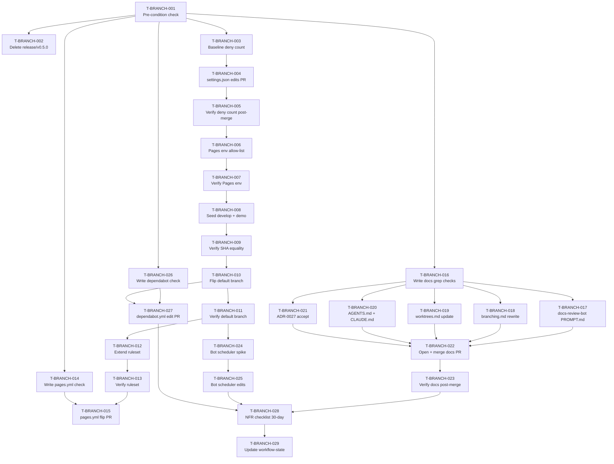

# Tasks — shape-b-branching-adoption

Each task is ≤ ~½ day, has a stable ID, references ≥ 1 requirement, and carries a Definition of Done.

> **TDD ordering:** verification / test tasks for a requirement come **before** or are bundled with the implementation task that satisfies it. Because this feature is a configuration-and-documentation rollout (no application source code), "test tasks" take the form of `qa`-owned verification-script and grep-check tasks that assert the pre-condition or post-condition of each implementation task.

> **Owner key:** `dev` = implementer performing the change; `qa` = agent or human running the verification; `human` = halts automation and requires the maintainer (manual UI action or irreversible remote op).

## Legend

- 🧪 = test / verification task
- 🔨 = implementation task
- 📐 = pre-condition / scaffolding task
- 📚 = documentation task
- 🚀 = release / ops task

---

## Task list

### T-BRANCH-001 📐 — Pre-condition check (read-only state capture)

- **Description:** Run the four read-only commands from spec Step 1 to verify `develop` and `demo` are absent on the remote, capture the presence/absence of `release/v0.5.0`, and record `$MAIN_HEAD_SHA`. Write results to `specs/shape-b-branching-adoption/implementation-log.md` (create the file with a "Step 1" section). This is the mandatory gate before any branch or file operation.
- **Satisfies:** REQ-BRANCH-006 (spec Step 1), REQ-BRANCH-013 (Step 1 pre-check), REQ-BRANCH-014 (Step 1 SHA capture), NFR-BRANCH-001, NFR-BRANCH-002
- **Owner:** human
- **Depends on:** —
- **Estimate:** S
- **Definition of done:**
  - [ ] `git fetch origin` completed with no errors.
  - [ ] `git ls-remote --heads origin develop` output captured and recorded; confirms empty (or EC-001 raised if non-empty).
  - [ ] `git ls-remote --heads origin demo` output captured and recorded; confirms empty (or EC-002 raised if non-empty).
  - [ ] `git ls-remote --heads origin release/v0.5.0` output captured and recorded (drives T-BRANCH-002 branching).
  - [ ] `git rev-parse origin/main` output captured as `$MAIN_HEAD_SHA` (40-char hex) and recorded in `implementation-log.md` §Step 1.
  - [ ] `implementation-log.md` created with timestamp and all captured values.

---

### T-BRANCH-002 📐 — Historical cleanup: delete `release/v0.5.0` if present

- **Description:** Conditional on T-BRANCH-001 finding `release/v0.5.0` on the remote. Run `git push origin --delete release/v0.5.0` and verify the remote ref is gone. If absent (Step 1 returned empty), mark this task skipped and note in `implementation-log.md`. If deletion is rejected (EC-003), do not force — record the rejection and continue.
- **Satisfies:** REQ-BRANCH-013
- **Owner:** human
- **Depends on:** T-BRANCH-001
- **Estimate:** S
- **Definition of done:**
  - [ ] If `release/v0.5.0` was present: `git ls-remote --heads origin release/v0.5.0` returns empty after deletion.
  - [ ] If `release/v0.5.0` was absent: task marked skipped in `implementation-log.md` with rationale.
  - [ ] If deletion rejected (EC-003): rejection reason recorded in `implementation-log.md`; no force-push attempted; task marked skipped-blocked.

---

### T-BRANCH-003 🧪 — Verify `.claude/settings.json` pre-edit state (baseline count)

- **Description:** Before editing `.claude/settings.json`, run the baseline deny-count check to confirm exactly 12 entries name `{main, develop}` (pre-change invariant). Record the baseline count in `implementation-log.md`. Also confirm the two `release/*` allow entries are currently present. This establishes the NFR-BRANCH-005 baseline.
- **Satisfies:** NFR-BRANCH-005 (baseline), REQ-BRANCH-002 (existing entry audit), REQ-BRANCH-011 (pre-change allow audit)
- **Owner:** qa
- **Depends on:** T-BRANCH-001
- **Estimate:** S
- **Definition of done:**
  - [ ] Node script counting deny entries naming `main` or `develop` outputs a count; count recorded in `implementation-log.md`.
  - [ ] `release/*` allow entries confirmed present (2 entries: `git push -u origin release/*` and `git push origin release/*`).
  - [ ] Both results recorded with timestamp in `implementation-log.md` §Baseline.

---

### T-BRANCH-004 🔨 — `.claude/settings.json`: add `demo` deny entries; remove `release/*` allow entries (IF-01)

- **Description:** Apply edits per spec IF-01. Remove `"Bash(git push -u origin release/*)"` and `"Bash(git push origin release/*)"` from `permissions.allow`. Add seven `demo` deny entries (exact strings from DS-01) to `permissions.deny` after the existing `develop` entries. Run the two IF-01 verification commands. Commit as one commit on branch `chore/shape-b-settings` cut from `origin/main`. Push and open PR with base `main`. Merge after CI green.
- **Satisfies:** REQ-BRANCH-002, REQ-BRANCH-003, REQ-BRANCH-011, NFR-BRANCH-005
- **Owner:** dev
- **Depends on:** T-BRANCH-003
- **Estimate:** S
- **Definition of done:**
  - [ ] Seven `demo` deny entries added per DS-01 exact strings.
  - [ ] Both `release/*` allow entries removed.
  - [ ] Existing `main` and `develop` deny entries unchanged (count unchanged at 12 retained entries).
  - [ ] IF-01 verification command 1 passes: all three branches (`main`, `develop`, `demo`) push-denied.
  - [ ] IF-01 verification command 2 passes: no `release/*` allow entry present.
  - [ ] JSON is valid: `node -e 'JSON.parse(require("fs").readFileSync(".claude/settings.json"))'` exits 0.
  - [ ] `npm run verify` green.
  - [ ] PR opened with base `main`; commit message references `REQ-BRANCH-002`, `REQ-BRANCH-003`, `REQ-BRANCH-011`, `NFR-BRANCH-005`.

---

### T-BRANCH-005 🧪 — Verify `.claude/settings.json` post-merge deny count (NFR-BRANCH-005)

- **Description:** After T-BRANCH-004 PR merges, run the NFR-BRANCH-005 node script to confirm the deny-entry count for `{main, develop, demo}` is `>= 19`. Record pass/count in `implementation-log.md`.
- **Satisfies:** NFR-BRANCH-005
- **Owner:** qa
- **Depends on:** T-BRANCH-004
- **Estimate:** S
- **Definition of done:**
  - [ ] Node deny-count script exits 0 with printed count `>= 19`.
  - [ ] Result recorded in `implementation-log.md` §Step 3 verification.

---

### T-BRANCH-006 🚀 — GitHub Pages env: add `demo` to allow-list (IF-10, Step 4)

- **Description:** Manual GitHub UI action. Open repository Settings → Environments → `github-pages` → "Deployment branches and tags". Add `demo` to the allow-list. Do **not** remove `main`. Record the before/after state of the allow-list in `implementation-log.md` §Step 4 with timestamp. If the `github-pages` environment does not exist (EC-005), create it first per the spec procedure.
- **Satisfies:** REQ-BRANCH-004 (sequencing), NFR-BRANCH-006
- **Owner:** human
- **Depends on:** T-BRANCH-005
- **Estimate:** S
- **Definition of done:**
  - [ ] `gh api .../environments/github-pages/deployment-branch-policies --jq '[.branch_policies[].name]'` returns array containing both `"main"` and `"demo"`.
  - [ ] Allow-list before/after states + timestamp recorded in `implementation-log.md` §Step 4.

---

### T-BRANCH-007 🧪 — Verify Pages env allow-list contains both `main` and `demo`

- **Description:** Run the `gh api` query from spec IF-10 verification block and confirm both `main` and `demo` are present. This is a gate before branch seeding (T-BRANCH-008) and before the pages.yml flip (T-BRANCH-013).
- **Satisfies:** NFR-BRANCH-006 (sequencing pre-condition)
- **Owner:** qa
- **Depends on:** T-BRANCH-006
- **Estimate:** S
- **Definition of done:**
  - [ ] `gh api` query exits 0 and returns JSON array containing `"main"` and `"demo"`.
  - [ ] Verification result recorded in `implementation-log.md` §Step 4 verification.

---

### T-BRANCH-008 🚀 — Seed `develop` and `demo` branches from `main` HEAD (Step 5)

- **Description:** Using `$MAIN_HEAD_SHA` captured in T-BRANCH-001, run the two `git push origin` commands that create `develop` and `demo` at `main` HEAD without any history rewrite. This is a one-time remote-only operation — after this task, the deny entries in `.claude/settings.json` protect both branches. Record outcomes in `implementation-log.md` §Step 5.
- **Satisfies:** REQ-BRANCH-006, REQ-BRANCH-014, NFR-BRANCH-001, NFR-BRANCH-002
- **Owner:** human
- **Depends on:** T-BRANCH-007
- **Estimate:** S
- **Definition of done:**
  - [ ] `git push origin ${MAIN_HEAD_SHA}:refs/heads/develop` exits 0.
  - [ ] `git push origin ${MAIN_HEAD_SHA}:refs/heads/demo` exits 0.
  - [ ] `git ls-remote --heads origin develop` returns `${MAIN_HEAD_SHA} refs/heads/develop`.
  - [ ] `git ls-remote --heads origin demo` returns `${MAIN_HEAD_SHA} refs/heads/demo`.
  - [ ] Both results recorded in `implementation-log.md` §Step 5.

---

### T-BRANCH-009 🧪 — Verify `develop` and `demo` SHA equality with `main` HEAD (NFR-BRANCH-001, NFR-BRANCH-002)

- **Description:** Run the two SHA equality checks from spec NFR-BRANCH-001 and NFR-BRANCH-002. Confirm `origin/develop` and `origin/demo` each equal `$MAIN_HEAD_SHA` and that `git log origin/main..origin/develop` returns empty.
- **Satisfies:** NFR-BRANCH-001, NFR-BRANCH-002
- **Owner:** qa
- **Depends on:** T-BRANCH-008
- **Estimate:** S
- **Definition of done:**
  - [ ] `test "$(git rev-parse origin/develop)" = "${MAIN_HEAD_SHA}"` exits 0.
  - [ ] `test "$(git rev-parse origin/demo)" = "${MAIN_HEAD_SHA}"` exits 0.
  - [ ] `git log --oneline origin/main..origin/develop` returns empty.
  - [ ] Both checks recorded in `implementation-log.md` §Step 5 verification.

---

### T-BRANCH-010 🚀 — Flip GitHub default branch to `develop` (IF-12, Step 5b)

- **Description:** Manual GitHub UI action. Open repository Settings → General → Default branch, click the switch icon, choose `develop`, confirm. Record the change in `implementation-log.md` §Step 5b. This satisfies RISK-BRANCH-004 mitigation and ensures bots that default to the repo default branch now target `develop`.
- **Satisfies:** REQ-BRANCH-009 (bots defaulting to repo default branch), RISK-BRANCH-004 mitigation
- **Owner:** human
- **Depends on:** T-BRANCH-009
- **Estimate:** S
- **Definition of done:**
  - [ ] `gh repo view --json defaultBranchRef --jq '.defaultBranchRef.name'` prints `develop`.
  - [ ] Change recorded in `implementation-log.md` §Step 5b with timestamp.

---

### T-BRANCH-011 🧪 — Verify default branch is `develop`

- **Description:** Run the `gh repo view` command from spec IF-12 verification block and confirm it returns `develop`.
- **Satisfies:** REQ-BRANCH-009 (default-branch gate)
- **Owner:** qa
- **Depends on:** T-BRANCH-010
- **Estimate:** S
- **Definition of done:**
  - [ ] `gh repo view --json defaultBranchRef --jq '.defaultBranchRef.name'` outputs `develop`.
  - [ ] Result recorded in `implementation-log.md` §Step 5b verification.

---

### T-BRANCH-012 🚀 — Extend GitHub Ruleset to cover `develop` and `demo` (IF-11, Step 6)

- **Description:** Discover the existing ruleset ID via `gh api /repos/$OWNER/$REPO/rulesets`. Capture the current payload as rollback baseline in `implementation-log.md`. PATCH the ruleset to extend `conditions.ref_name.include` to `["refs/heads/main", "refs/heads/develop", "refs/heads/demo"]` and add the maintainer to `bypass_actors` with `bypass_mode: "pull_request"`. Use the exact payload shape from spec IF-11 / DS-02. Record outcomes in `implementation-log.md` §Step 6.
- **Satisfies:** REQ-BRANCH-002 (remote layer), REQ-BRANCH-003 (remote layer), CLAR-004 resolution per ADR-0027
- **Owner:** human
- **Depends on:** T-BRANCH-011
- **Estimate:** M
- **Definition of done:**
  - [ ] Pre-change ruleset payload captured (rollback baseline) in `implementation-log.md`.
  - [ ] `gh api -X PATCH .../rulesets/$RULESET_ID --input ruleset-payload.json` exits 0.
  - [ ] `gh api .../rulesets/$RULESET_ID --jq '.conditions.ref_name.include'` returns `["refs/heads/main", "refs/heads/develop", "refs/heads/demo"]`.
  - [ ] Result recorded in `implementation-log.md` §Step 6 with ruleset ID and maintainer user ID used.

---

### T-BRANCH-013 🧪 — Verify ruleset covers all three branches

- **Description:** Run the IF-11 post-PATCH verification query and confirm the ruleset `conditions.ref_name.include` array contains all three `refs/heads/<branch>` entries.
- **Satisfies:** REQ-BRANCH-002, REQ-BRANCH-003 (remote-layer coverage)
- **Owner:** qa
- **Depends on:** T-BRANCH-012
- **Estimate:** S
- **Definition of done:**
  - [ ] `gh api .../rulesets/$RULESET_ID --jq '.conditions.ref_name.include'` output contains `"refs/heads/main"`, `"refs/heads/develop"`, `"refs/heads/demo"`.
  - [ ] Result recorded in `implementation-log.md` §Step 6 verification.

---

### T-BRANCH-014 🧪 — Write verification script for `pages.yml` trigger check (IF-02)

- **Description:** Write and commit the node verification command from spec IF-02 as a named script (or inline in the implementation-log verification checklist) that confirms `demo` is present and `main` is absent in `pages.yml`'s `on.push.branches` list. This test must be runnable before and after T-BRANCH-015.
- **Satisfies:** REQ-BRANCH-004
- **Owner:** qa
- **Depends on:** T-BRANCH-001
- **Estimate:** S
- **Definition of done:**
  - [ ] The node command from IF-02 verification block is documented in `implementation-log.md` §Step 7 with expected output.
  - [ ] Running the command against the current (unedited) `pages.yml` confirms `main` present, `demo` absent (pre-change state baseline recorded).

---

### T-BRANCH-015 🔨 — `.github/workflows/pages.yml`: retarget trigger to `demo` (IF-02, Step 7)

- **Description:** Apply the single-element change from spec IF-02: replace `- main` with `- demo` in the `on: push: branches:` block. Leave `workflow_dispatch` unchanged. Cut branch `chore/shape-b-pages-flip` from `origin/develop` (now possible). Commit with message referencing `REQ-BRANCH-004`. Push and open PR with base `develop`. After merge, trigger one `workflow_dispatch` run of `pages.yml` on `demo` and verify the deploy succeeds.
- **Satisfies:** REQ-BRANCH-004, NFR-BRANCH-006
- **Owner:** dev
- **Depends on:** T-BRANCH-014, T-BRANCH-013
- **Estimate:** S
- **Definition of done:**
  - [ ] `pages.yml` `on.push.branches` list contains `demo` and does not contain `main`.
  - [ ] IF-02 node verification command passes.
  - [ ] `npm run verify` green.
  - [ ] PR base = `develop`; PR merged; CI green.
  - [ ] `gh workflow run pages.yml --ref demo` triggers a run; run reports `success`; deployed page URL returns HTTP 200.
  - [ ] Pre-flip HTTP 200 baseline and post-flip HTTP 200 result both recorded in `implementation-log.md` §Step 7 (NFR-BRANCH-006 evidence).

---

### T-BRANCH-016 🧪 — Write grep-check verification suite for docs PR (IF-04, IF-05, IF-06, IF-07, IF-08)

- **Description:** Before editing any documentation, document the full set of verification commands from spec IF-04 through IF-08 (as a checklist in `implementation-log.md` §Step 8 pre-state). Run each command against the current files to record the pre-edit baseline (expected failures). This makes the post-edit pass/fail meaningful.
- **Satisfies:** REQ-BRANCH-001, REQ-BRANCH-005, REQ-BRANCH-007, REQ-BRANCH-008, REQ-BRANCH-010, REQ-BRANCH-012, REQ-BRANCH-015, NFR-BRANCH-003, NFR-BRANCH-004
- **Owner:** qa
- **Depends on:** T-BRANCH-001
- **Estimate:** S
- **Definition of done:**
  - [ ] IF-04 grep commands documented and pre-edit baseline recorded (`grep -c "clean clone of \`main\`"` count before edit).
  - [ ] IF-05 grep commands documented and pre-edit baseline recorded.
  - [ ] IF-06 grep commands documented and pre-edit baseline recorded.
  - [ ] IF-07 grep commands documented and pre-edit baseline recorded.
  - [ ] IF-08 grep commands documented and pre-edit baseline recorded.
  - [ ] All baselines recorded in `implementation-log.md` §Step 8 pre-state.

---

### T-BRANCH-017 📚 — `agents/operational/docs-review-bot/PROMPT.md`: update tutorial-drift rule to reference `develop` (IF-04)

- **Description:** Apply the single string replacement from spec IF-04: replace ``clean clone of `main` `` with ``clean clone of `develop` `` on line 46 of `PROMPT.md`. Verify with the two IF-04 grep commands. Included in the docs PR (Step 8) along with T-BRANCH-018 through T-BRANCH-021.
- **Satisfies:** REQ-BRANCH-008, NFR-BRANCH-003
- **Owner:** dev
- **Depends on:** T-BRANCH-016
- **Estimate:** S
- **Definition of done:**
  - [ ] `grep -c "clean clone of \`main\`" agents/operational/docs-review-bot/PROMPT.md` outputs `0`.
  - [ ] `grep -c "clean clone of \`develop\`" agents/operational/docs-review-bot/PROMPT.md` outputs `1`.

---

### T-BRANCH-018 📚 — `docs/branching.md`: rewrite for Shape B active model (IF-05)

- **Description:** Apply all six IF-05 required edits to `docs/branching.md` in a single editing pass: (1) add Shape B active-model paragraph above the two tables; (2) update topic PR target references to `develop` outside the Shape A subsection; (3) replace §"Release branches (`release/vX.Y.Z`)" with §"Release path under Shape B"; (4) update §"Required main ruleset" to cover all three branches including bypass-actor note; (5) update §"Settings" to name all three denied branches; (6) replace §"Why not `develop` in v0.5" with §"Why `develop` and `demo` exist now" referencing ADR-0027.
- **Satisfies:** REQ-BRANCH-001, REQ-BRANCH-005, REQ-BRANCH-007, NFR-BRANCH-003
- **Owner:** dev
- **Depends on:** T-BRANCH-016
- **Estimate:** M
- **Definition of done:**
  - [ ] IF-05 grep check 1: no bare-prose claim that topic PRs target `main` outside Shape A subsection.
  - [ ] IF-05 grep check 2: `grep -c "Shape B" docs/branching.md` >= 3.
  - [ ] IF-05 grep check 3: `release/vX.Y.Z` appears zero times outside a "Shape A only — historical" callout.
  - [ ] Shape A description retained and explicitly marked as not the active template model.
  - [ ] `chore/promote-demo` manual PR described as the Pages-source promotion path.

---

### T-BRANCH-019 📚 — `docs/worktrees.md`: name `develop` as the cut-from branch (IF-06)

- **Description:** Apply IF-06 edits: replace every reference to "cut from `main`" or "branch from `main`" in worktree-setup instructions with `develop`. Verify with the IF-06 grep commands.
- **Satisfies:** REQ-BRANCH-012, NFR-BRANCH-003
- **Owner:** dev
- **Depends on:** T-BRANCH-016
- **Estimate:** S
- **Definition of done:**
  - [ ] IF-06 grep check: `grep -nE "(cut|branch).*from.*main|origin/main.*-b feat" docs/worktrees.md` returns zero worktree-instruction hits (manual review of any remaining hits to confirm they are not instructional).
  - [ ] `grep -c "develop" docs/worktrees.md` >= 1 in the cut-from context.

---

### T-BRANCH-020 📚 — `AGENTS.md` and `CLAUDE.md`: name `develop` as topic PR target (IF-07)

- **Description:** Apply IF-07 edits: (1) append the Shape B sentence to the "Branch per concern; verify before push" bullet in `AGENTS.md`; (2) append the `develop` + `demo` sentence to the `settings.json` permissions bullet in `CLAUDE.md`. Verify with the IF-07 grep commands.
- **Satisfies:** REQ-BRANCH-015, NFR-BRANCH-003
- **Owner:** dev
- **Depends on:** T-BRANCH-016
- **Estimate:** S
- **Definition of done:**
  - [ ] `grep -c "Topic PRs target \`develop\`" AGENTS.md` outputs >= 1.
  - [ ] `grep -c "Topic PRs target \`develop\`" CLAUDE.md` outputs >= 1.

---

### T-BRANCH-021 📚 — ADR-0027 accept + ADR-0020 frontmatter + ADR README index (IF-08)

- **Description:** Apply IF-08 edits: (1) change `status: proposed` → `status: Accepted` in `docs/adr/0027-adopt-shape-b-branching-model.md` frontmatter and body; (2) confirm ADR-0020 frontmatter already has `status: Superseded` and `superseded-by: [ADR-0027]` — do not touch its body; (3) add ADR-0027 row to `docs/adr/README.md` index and confirm ADR-0020 row shows Superseded status.
- **Satisfies:** REQ-BRANCH-010, NFR-BRANCH-004
- **Owner:** dev
- **Depends on:** T-BRANCH-016
- **Estimate:** S
- **Definition of done:**
  - [ ] `grep -E "^status: Accepted$" docs/adr/0027-adopt-shape-b-branching-model.md` matches.
  - [ ] `grep -E "^status: Superseded$" docs/adr/0020-v05-release-branch-strategy.md` matches.
  - [ ] `grep -E "^superseded-by: \[ADR-0027\]$" docs/adr/0020-v05-release-branch-strategy.md` matches.
  - [ ] `git diff` on `docs/adr/0020-v05-release-branch-strategy.md` shows **only** frontmatter `status` and `superseded-by` lines changed (body immutability).
  - [ ] `grep -c "0027-adopt-shape-b-branching-model" docs/adr/README.md` >= 1.

---

### T-BRANCH-022 🔨 — Open and merge docs + ADR PR (Step 8)

- **Description:** Collect the changes from T-BRANCH-017 through T-BRANCH-021 onto branch `docs/shape-b-adoption` cut from `origin/develop`. Run `npm run verify`. Commit (one combined commit or one per IF — both acceptable). Open PR with base `develop`. Merge after CI green.
- **Satisfies:** REQ-BRANCH-001, REQ-BRANCH-005, REQ-BRANCH-007, REQ-BRANCH-008, REQ-BRANCH-010, REQ-BRANCH-012, REQ-BRANCH-015, NFR-BRANCH-003, NFR-BRANCH-004
- **Owner:** dev
- **Depends on:** T-BRANCH-017, T-BRANCH-018, T-BRANCH-019, T-BRANCH-020, T-BRANCH-021
- **Estimate:** S
- **Definition of done:**
  - [ ] All IF-04 through IF-08 verification commands pass (see T-BRANCH-023).
  - [ ] `npm run verify` green.
  - [ ] PR base = `develop`; PR merged; CI green.
  - [ ] `git diff origin/develop docs/adr/0020-v05-release-branch-strategy.md` shows only frontmatter lines changed.

---

### T-BRANCH-023 🧪 — Verify all docs + ADR changes post-merge (NFR-BRANCH-003, NFR-BRANCH-004)

- **Description:** After T-BRANCH-022 merges, run all IF-04 through IF-08 verification commands against the merged state. Run the NFR-BRANCH-003 and NFR-BRANCH-004 check scripts. Record all results in `implementation-log.md` §Step 8 verification.
- **Satisfies:** REQ-BRANCH-001, REQ-BRANCH-005, REQ-BRANCH-007, REQ-BRANCH-008, REQ-BRANCH-010, REQ-BRANCH-012, REQ-BRANCH-015, NFR-BRANCH-003, NFR-BRANCH-004
- **Owner:** qa
- **Depends on:** T-BRANCH-022
- **Estimate:** S
- **Definition of done:**
  - [ ] IF-04: `grep -c "clean clone of \`main\`" agents/operational/docs-review-bot/PROMPT.md` = 0; `develop` count = 1.
  - [ ] IF-05: Shape B active, no bare `main` PR target outside Shape A, `release/vX.Y.Z` not in active release path.
  - [ ] IF-06: no worktree instruction tells contributors to cut from `main`.
  - [ ] IF-07: both `AGENTS.md` and `CLAUDE.md` contain "Topic PRs target `develop`".
  - [ ] IF-08: ADR-0027 `status: Accepted`; ADR-0020 `status: Superseded` + `superseded-by: [ADR-0027]`; ADR-0020 body diff = 0 non-frontmatter lines; ADR README contains 0027 row.
  - [ ] NFR-BRANCH-003 grep heuristic: zero hits outside Shape A subsections.
  - [ ] NFR-BRANCH-004 four-grep + body-diff check: all pass.
  - [ ] All results recorded in `implementation-log.md` §Step 8 verification.

---

### T-BRANCH-024 🧪 — Investigate bot scheduler configs for `review-bot`, `plan-recon-bot`, `dep-triage-bot`, `actions-bump-bot` (IF-09 spike, OPEN-BRANCH-001)

- **Description:** Per spec IF-09 and OPEN-BRANCH-001, locate the scheduler or runner config for each of the four bots. Check `.github/workflows/<bot>.yml` for each. Inspect each bot's `PROMPT.md` and `README.md` for any hardcoded branch reference. Document findings in `implementation-log.md` §Step 9: for each bot, record (a) config file path or "no in-repo scheduler found", (b) whether it hardcodes an integration-branch value, (c) whether it will automatically inherit the new default branch (`develop`) after Step 5b. If a config is found that names `main` explicitly, create a sub-task or flag it for T-BRANCH-025. If the scheduler lives outside the repo (EC-010), escalate as a clarification.
- **Satisfies:** REQ-BRANCH-009
- **Owner:** dev
- **Depends on:** T-BRANCH-011
- **Estimate:** S
- **Definition of done:**
  - [ ] All four bots checked: `review-bot`, `plan-recon-bot`, `dep-triage-bot`, `actions-bump-bot`.
  - [ ] For each bot: finding documented as one of (A) "no in-repo scheduler — inherits default branch via Step 5b", (B) "scheduler found at path X with integration-branch field Y — edit required", or (C) "scheduler outside repo — clarification raised".
  - [ ] Findings recorded in `implementation-log.md` §Step 9.
  - [ ] If any bot has a hardcoded `main` reference in a scheduler config: T-BRANCH-025 is created; otherwise T-BRANCH-025 is marked N/A.

---

### T-BRANCH-025 🔨 — Bot scheduler config edits: set integration-branch to `develop` where required (IF-09, Step 9)

- **Description:** For each bot where T-BRANCH-024 found an in-repo scheduler config that explicitly names the integration branch, apply the edit (set value to `develop`). Cut branch `chore/shape-b-bot-schedulers` from `origin/develop`. Commit with message referencing `REQ-BRANCH-009`. Push and open PR with base `develop`. If T-BRANCH-024 found no edits required (all bots inherit default branch), record this rationale and mark T-BRANCH-025 as satisfied-by-T-BRANCH-010 (the default-branch flip).
- **Satisfies:** REQ-BRANCH-009
- **Owner:** dev
- **Depends on:** T-BRANCH-024
- **Estimate:** S
- **Definition of done:**
  - [ ] For each bot with an in-repo scheduler that named `main`: the config now names `develop`; IF-09 per-bot grep check passes.
  - [ ] For each bot with no in-repo scheduler (inherits default branch): rationale recorded confirming T-BRANCH-010 satisfies REQ-BRANCH-009 for that bot.
  - [ ] PR (if any edits needed) opened with base `develop`; merged; CI green.
  - [ ] OR: `implementation-log.md` §Step 9 records "No scheduler config edits required — all four bots inherit the repository default branch. T-BRANCH-010 (default-branch flip to develop) satisfies REQ-BRANCH-009."

---

### T-BRANCH-026 🧪 — Write verification check for `dependabot.yml` `target-branch` field (IF-03)

- **Description:** Before editing `.github/dependabot.yml`, document the IF-03 node verification command in `implementation-log.md` §Step 10 pre-state. Run it against the current file to confirm neither `updates:` block currently declares `target-branch` (pre-change baseline).
- **Satisfies:** REQ-BRANCH-009 (Dependabot sub-requirement)
- **Owner:** qa
- **Depends on:** T-BRANCH-001
- **Estimate:** S
- **Definition of done:**
  - [ ] IF-03 node command documented in `implementation-log.md` §Step 10 pre-state.
  - [ ] Running against current `dependabot.yml` confirms neither block has `target-branch` (pre-change baseline recorded).

---

### T-BRANCH-027 🔨 — `.github/dependabot.yml`: add `target-branch: develop` to both update blocks (IF-03, Step 10)

- **Description:** Apply IF-03 edit: add `target-branch: develop` after the `directory: /` line in both the `github-actions` and `npm` update blocks. Cut branch `chore/shape-b-dependabot` from `origin/develop`. Commit with message referencing `RISK-BRANCH-007`, `REQ-BRANCH-009`. Push and open PR with base `develop`. Merge after CI green.
- **Satisfies:** REQ-BRANCH-009, RISK-BRANCH-007 mitigation
- **Owner:** dev
- **Depends on:** T-BRANCH-026, T-BRANCH-010
- **Estimate:** S
- **Definition of done:**
  - [ ] Both `updates:` blocks contain `target-branch: develop` at the correct indentation level.
  - [ ] IF-03 node verification command passes: `y.updates.every(u => u["target-branch"] === "develop")`.
  - [ ] `npm run verify` green.
  - [ ] PR base = `develop`; merged; CI green.
  - [ ] Result recorded in `implementation-log.md` §Step 10 verification.

---

### T-BRANCH-028 🧪 — Post-rollout NFR verification checklist run (Step 12, 30-day gate)

- **Description:** After Steps 1–10 complete (T-BRANCH-001 through T-BRANCH-027), run the full NFR Verification Checklist from spec §NFR Verification Checklist. Record all six NFR pass/fail results in `implementation-log.md` §Step 12. Monitor the Step 12 counter-metrics for 30 days: zero PRs targeting `main` as topic base; zero direct commits on `main`; `docs-review-bot` next issue does not flag the tutorial-drift rule. File retrospective if any counter-metric fails.
- **Satisfies:** NFR-BRANCH-001, NFR-BRANCH-002, NFR-BRANCH-003, NFR-BRANCH-004, NFR-BRANCH-005, NFR-BRANCH-006, REQ-BRANCH-001 through REQ-BRANCH-015
- **Owner:** qa
- **Depends on:** T-BRANCH-023, T-BRANCH-025, T-BRANCH-027
- **Estimate:** M
- **Definition of done:**
  - [ ] NFR-BRANCH-001: SHA equality `origin/develop == $MAIN_HEAD_SHA` confirmed.
  - [ ] NFR-BRANCH-002: SHA equality `origin/demo == $MAIN_HEAD_SHA` confirmed.
  - [ ] NFR-BRANCH-003: no file describes `main` as integration branch or PR target for topic work (grep heuristic passes).
  - [ ] NFR-BRANCH-004: all four ADR greps pass; ADR-0020 body-diff line count = 0.
  - [ ] NFR-BRANCH-005: deny-count node script exits 0 with count >= 19.
  - [ ] NFR-BRANCH-006: both pre/post curl probes return HTTP 200; timestamps recorded.
  - [ ] 30-day counter-metric monitoring plan recorded in `implementation-log.md` §Step 12.
  - [ ] `specs/shape-b-branching-adoption/retrospective.md` stub created (or existing file updated) if any metric fails within the window.

---

### T-BRANCH-029 🚀 — Update `workflow-state.md`: Stage 7 complete

- **Description:** After all implementation tasks merge and the NFR checklist returns green, update `specs/shape-b-branching-adoption/workflow-state.md`: change `current_stage` to `testing` (or `complete` if the 30-day window is satisfied) and append a hand-off note to `qa` naming T-BRANCH-028 as the open monitoring task.
- **Satisfies:** workflow state governance (Article III, Article V)
- **Owner:** dev
- **Depends on:** T-BRANCH-028
- **Estimate:** S
- **Definition of done:**
  - [ ] `workflow-state.md` `current_stage` updated to `testing`.
  - [ ] All completed task artifacts listed in `workflow-state.md` §Stage progress.
  - [ ] Hand-off note appended naming T-BRANCH-028 and the 30-day monitoring window.

---

## Dependency graph

---

## Parallelisable batches

The critical path is the sequential chain of remote-ops steps (T-BRANCH-001 → T-BRANCH-002 → T-BRANCH-003 → T-BRANCH-004 → T-BRANCH-005 → T-BRANCH-006 → T-BRANCH-007 → T-BRANCH-008 → T-BRANCH-009 → T-BRANCH-010 → T-BRANCH-011 → T-BRANCH-012 → T-BRANCH-013). Documentation and dependabot tasks can proceed in parallel once their shared gate (T-BRANCH-001 for doc/dependabot pre-checks, T-BRANCH-013 for pages.yml) is satisfied.

**Batch A — immediately after T-BRANCH-001:**
- T-BRANCH-002 (conditional cleanup) — independent of T-BRANCH-003
- T-BRANCH-003 (baseline deny count) — independent of T-BRANCH-002
- T-BRANCH-014 (write pages.yml check script) — read-only, no dependencies on live state
- T-BRANCH-016 (write docs grep checks) — read-only, no dependencies on live state
- T-BRANCH-026 (write dependabot check) — read-only, no dependencies on live state

**Batch B — after T-BRANCH-005 (settings PR merged) and T-BRANCH-013 (ruleset extended):**
- T-BRANCH-015 (pages.yml flip PR) — requires T-BRANCH-013 and T-BRANCH-014
- T-BRANCH-016 doc sub-tasks (T-BRANCH-017 through T-BRANCH-021) can be authored in parallel once T-BRANCH-016 is done

**Batch C — after T-BRANCH-010 (default branch flipped):**
- T-BRANCH-024 (bot scheduler spike) — independent of T-BRANCH-013
- T-BRANCH-027 (dependabot.yml PR) — requires T-BRANCH-010 and T-BRANCH-026

**Batch D — after T-BRANCH-022 (docs PR merged):**
- T-BRANCH-023 (verify docs) runs immediately

**Final gate — T-BRANCH-028** depends on T-BRANCH-023, T-BRANCH-025, and T-BRANCH-027.

---

## Open-item flag: OPEN-BRANCH-001 resolution in T-BRANCH-024

Spec OPEN-BRANCH-001 asks for the exact scheduler config paths for the four bots. Inspection of the bot PROMPT.md files shows all four use "integration branch" generically without hardcoding `main`. The bots do not have pre-built `.github/workflows/<bot>.yml` scheduler files in this template — they are invoked as Claude Code sessions. **T-BRANCH-024 is the discovery spike** that will confirm this at implementation time and record the finding. If T-BRANCH-024 confirms no in-repo scheduler configs name `main` explicitly, T-BRANCH-025 reduces to a documentation-only task (recording rationale in `implementation-log.md`) and REQ-BRANCH-009 is satisfied for all four bots by T-BRANCH-010 (the default-branch flip).

---

## Requirements coverage matrix

| REQ / NFR | Tasks covering it |
|---|---|
| REQ-BRANCH-001 | T-BRANCH-016, T-BRANCH-018, T-BRANCH-022, T-BRANCH-023, T-BRANCH-028 |
| REQ-BRANCH-002 | T-BRANCH-003, T-BRANCH-004, T-BRANCH-005, T-BRANCH-012, T-BRANCH-013 |
| REQ-BRANCH-003 | T-BRANCH-003, T-BRANCH-004, T-BRANCH-005, T-BRANCH-012, T-BRANCH-013 |
| REQ-BRANCH-004 | T-BRANCH-006, T-BRANCH-007, T-BRANCH-014, T-BRANCH-015 |
| REQ-BRANCH-005 | T-BRANCH-016, T-BRANCH-018, T-BRANCH-022, T-BRANCH-023 |
| REQ-BRANCH-006 | T-BRANCH-001, T-BRANCH-008, T-BRANCH-009 |
| REQ-BRANCH-007 | T-BRANCH-016, T-BRANCH-018, T-BRANCH-022, T-BRANCH-023 |
| REQ-BRANCH-008 | T-BRANCH-016, T-BRANCH-017, T-BRANCH-022, T-BRANCH-023 |
| REQ-BRANCH-009 | T-BRANCH-010, T-BRANCH-011, T-BRANCH-024, T-BRANCH-025, T-BRANCH-026, T-BRANCH-027 |
| REQ-BRANCH-010 | T-BRANCH-016, T-BRANCH-021, T-BRANCH-022, T-BRANCH-023 |
| REQ-BRANCH-011 | T-BRANCH-003, T-BRANCH-004, T-BRANCH-005 |
| REQ-BRANCH-012 | T-BRANCH-016, T-BRANCH-019, T-BRANCH-022, T-BRANCH-023 |
| REQ-BRANCH-013 | T-BRANCH-001, T-BRANCH-002 |
| REQ-BRANCH-014 | T-BRANCH-001, T-BRANCH-008, T-BRANCH-009 |
| REQ-BRANCH-015 | T-BRANCH-016, T-BRANCH-020, T-BRANCH-022, T-BRANCH-023 |
| NFR-BRANCH-001 | T-BRANCH-001, T-BRANCH-008, T-BRANCH-009, T-BRANCH-028 |
| NFR-BRANCH-002 | T-BRANCH-001, T-BRANCH-008, T-BRANCH-009, T-BRANCH-028 |
| NFR-BRANCH-003 | T-BRANCH-016, T-BRANCH-017, T-BRANCH-018, T-BRANCH-019, T-BRANCH-020, T-BRANCH-022, T-BRANCH-023, T-BRANCH-028 |
| NFR-BRANCH-004 | T-BRANCH-016, T-BRANCH-021, T-BRANCH-022, T-BRANCH-023, T-BRANCH-028 |
| NFR-BRANCH-005 | T-BRANCH-003, T-BRANCH-004, T-BRANCH-005, T-BRANCH-028 |
| NFR-BRANCH-006 | T-BRANCH-006, T-BRANCH-007, T-BRANCH-015, T-BRANCH-028 |

---

## Quality gate

- [x] Each task is <= ~½ day (estimate S or M).
- [x] Each task has a stable ID (`T-BRANCH-NNN`).
- [x] Each task references >= 1 requirement / spec ID.
- [x] Dependencies are explicit.
- [x] Each task has a Definition of Done.
- [x] TDD ordering: verification/test tasks precede or accompany implementation tasks for the same requirement.
- [x] Owner assigned per task (`dev`, `qa`, or `human`).
- [x] All 15 REQ-BRANCH-NNN have at least one test task.
- [x] All 6 NFR-BRANCH-NNN have at least one verification task.
- [x] No orphan tasks (every task maps to a spec interface, step, or NFR).
- [x] OPEN-BRANCH-001 surfaced in T-BRANCH-024 (discovery spike) rather than silently resolved.
