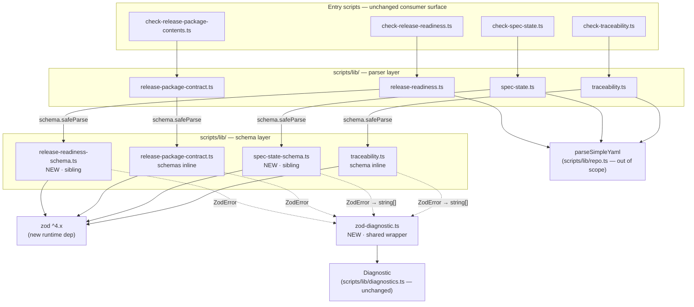
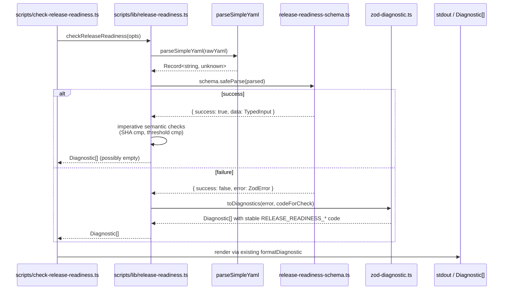

# Design — Zod Runtime Validation for Script-Layer Parsers

## Context

Four script-layer parsers in `scripts/lib/` (`release-readiness.ts`, `release-package-contract.ts`, `spec-state.ts`, `traceability.ts`) currently express shape validation as scattered hand-rolled `typeof` guards and unsafe casts off `parseSimpleYaml`'s `Record<string, unknown>` return. PRD-ZSV-001 mandates replacing those guards with declarative zod schemas while preserving the byte-identical `RELEASE_READINESS_*` and `RELEASE_PKG_*` diagnostic-code surfaces and adding `zod ^4.x` as the package's first runtime dependency.

This design closes the architect-call clarifications (CLAR-003/004/005) and specifies the layering between schemas, parsers, and the wrapper that translates `ZodError` into stable `Diagnostic` records. The Arc42 baseline at `arc42-questionnaire.md` is the canonical source for §4–§8 and §10–§11; this document captures only feature-specific deltas and leaves the inherited material in place.

## Goals (design-level)

- D1 — Define a single, shared `ZodError → Diagnostic` translation surface so byte-identical code emission is verifiable in one place (REQ-ZSV-005, REQ-ZSV-006).
- D2 — Place each schema in exactly one location per artifact shape so a shape change requires edits in at most one file per target (NFR-ZSV-005, REQ-ZSV-012).
- D3 — Keep semantic carve-outs (`checkTagAtMain`, quality-signal thresholds, spec-state cross-property consistency) outside the schema layer (REQ-ZSV-007/008/009).
- D4 — Preserve the entry-script integration point: no consumer-observable surface changes other than diagnostic-message text gaining structure.

## Non-goals

- ND1 — Replace or modify `parseSimpleYaml` (NG2). Schemas validate its `Record<string, unknown>` output, never raw YAML.
- ND2 — Migrate any markdown-frontmatter validators outside the four locked targets (NG1).
- ND3 — Rename or reshape any `RELEASE_READINESS_*` / `RELEASE_PKG_*` constant (NG3). Internals shift; the constants object is touched only at use-sites that already import it.
- ND4 — Introduce a fixture directory tree (`tests/fixtures/zod-schemas/`); inline fixtures keep test scope minimal at this scale.

---

## Part A — UX

N/A — script-layer feature, no user-visible surface. See `workflow-state.md` Skips.

## Part B — UI

N/A — script-layer feature, no user-visible surface. See `workflow-state.md` Skips.

---

## Part C — Architecture

> Inherits the Arc42 baseline at [`arc42-questionnaire.md`](./arc42-questionnaire.md) §4 (solution strategy), §5 (building blocks), §7 (deployment), §8 (crosscutting), §10 (quality), §11 (risks), and the 12-Factor assessment. Only feature-specific deltas appear below.

### System overview

The four target parsers form parallel pipelines feeding a single shared wrapper. Entry scripts under `scripts/check-*.ts` remain unchanged in their imports and call shapes; the validation layer is added inside `scripts/lib/`.

The dependency rule from §5.2 of the questionnaire holds: entry scripts depend only on `scripts/lib/*`; lib modules may depend on `zod` and on each other but never on entry scripts; no circular imports between parser and its sibling schema module.

### Components and responsibilities

| Component | Responsibility | Owns | Dependencies |
|---|---|---|---|
| `scripts/lib/zod-diagnostic.ts` (**new**) | Translate a `ZodError` into either a `Diagnostic[]` carrying a caller-supplied stable code, or a `string[]` for callers that emit string diagnostics. Single mapping policy; single test surface. | The `ZodError`→`Diagnostic` mapping function and the `ZodError`→`string[]` formatter. | `zod`, `./diagnostics.js` (for the `Diagnostic` type only) |
| `scripts/lib/release-readiness-schema.ts` (**new**, sibling) | Declare seven check-input shapes (one per check function exercised by `release-readiness.ts`) plus the `parseReleaseReadinessArgs` argument shape; export schemas and inferred types via `z.infer`. | Per-check `z.object({...})` schemas; argument schema; inferred type re-exports. | `zod` only |
| `scripts/lib/release-readiness.ts` (modified) | Delegate input shape validation to its sibling schema module; route shape-mismatch results through `zod-diagnostic.ts` with the stable `RELEASE_READINESS_*` code attached; keep `checkTagAtMain` SHA comparison and `checkQualitySignals` threshold logic imperative. | Imperative check logic only; no inline `z.object(...)`. | `./release-readiness-schema.js`, `./zod-diagnostic.js`, existing imports |
| `scripts/lib/spec-state-schema.ts` (**new**, sibling) | Declare the `workflow-state.md` frontmatter shape — required-field presence, `current_stage` / `status` / artifact-status enum membership, `artifacts` map shape — plus inferred type. | Frontmatter schema; enum sources re-imported from `workflow-schema.ts`. | `zod`, `./workflow-schema.js` |
| `scripts/lib/spec-state.ts` (modified) | Replace `validateRequiredFields` and `validateArtifactMap` shape branches with one `safeParse` call against the sibling schema; keep `validateCurrentStageArtifact`, `validateDoneState`, and the rest of the cross-property consistency rules as a separate post-schema pass (REQ-ZSV-009). | Cross-property consistency rules only; no inline shape guards for fields the schema covers. | `./spec-state-schema.js`, `./zod-diagnostic.js`, existing imports |
| `scripts/lib/release-package-contract.ts` (modified, schema **inline**) | Declare a discriminated-union schema for `parseReleasePackageArgs` (Pattern B, native ZodError to throw on invalid CLI args) and small inline schemas for frontmatter shapes used by `checkDocsAreStubs`; route `RELEASE_PKG_*` shape-mismatch paths through `zod-diagnostic.ts`. | Inline schemas + existing filesystem-iteration logic. | `zod`, `./zod-diagnostic.js`, existing imports |
| `scripts/lib/traceability.ts` (modified, schema **inline**) | Declare a small inline schema for the workflow-state frontmatter `area` field (`z.object({ area: z.string().regex(/^[A-Z][A-Z0-9]*$/) })`); other validation remains imperative graph traversal. | Inline schema only; graph-traversal logic untouched. | `zod`, `./zod-diagnostic.js`, existing imports |
| `package.json` (modified) | Declare `"zod": "^4.x"` in `dependencies`; `"files"` unchanged. | The dependency record and the locked transitive tree via `npm-shrinkwrap.json`. | n/a |
| `docs/specorator-product/tech.md` (modified) | Record that `@luis85/agentic-workflow` gained its first runtime dep with the rationale and the ADR-0023 reference (REQ-ZSV-011). | The product-steering note. | n/a |

Total artifacts touched: **9** — three new lib modules, four modified lib modules, and two co-shipped configuration/doc files.

### Data model

Schemas are described here at the level of "what fields, what types". Full TypeScript signatures and validation rules per field land in `spec.md`.

| Shape | Fields (high level) | Source for full schema |
|---|---|---|
| **Workflow-state frontmatter** (used by `spec-state-schema.ts`; subset re-used inline by `traceability.ts`) | `feature: string`, `area: string` matching `^[A-Z][A-Z0-9]*$`, `current_stage: enum(workflowStages)`, `status: enum(workflowStatuses)`, `last_updated: string` matching `^\d{4}-\d{2}-\d{2}$`, `last_agent: string`, `artifacts: Record<string, enum(artifactStatuses)>` with required key set drawn from `canonicalArtifacts`. | `spec.md` §Data structures |
| **Release-package CLI args** (used by `release-package-contract.ts` inline schema for `parseReleasePackageArgs`) | Discriminated union over `archiveSource ∈ { argv, env, none, argv-empty }` with `archive: string` required when source is `argv` or `env`, `rawFlag: string` required when source is `argv-empty`. | `spec.md` §Data structures |
| **Release-package doc-stub frontmatter** (used by `release-package-contract.ts` inline schema for `checkDocsAreStubs`) | `title: string`, `folder: string`, `description: string`, `entry_point: boolean`. | `spec.md` §Data structures |
| **release-readiness check inputs** (seven schemas, one per exercised check function in `release-readiness-schema.ts`) | (a) `parseReleaseReadinessArgs` — args object; (b) `checkVersionAlignment` — `{ data: { version: string, ... } }` package-json shape; (c) `checkChangelog` — file-presence is procedural; the schema covers the parsed package-json `version` only; (d) `checkReleaseNotesConfig` — `{ changelog: { categories: array, exclude: { labels: array, authors: array } } }`; (e) `checkPackageMetadata` — `{ name, publishConfig.registry, repository | repository.url, files: string[] }`; (f) `checkWorkflowPermissions` — `{ permissions: Record<string, string> | string, jobs?: Record<string, { permissions?: ... }> }`; (g) `checkQualitySignals` — `{ ciStatus: enum, validationStatus: enum, openBlockers: number, openClarifications: number, maturityLevel: number, waiver?: boolean }`. | `spec.md` §Data structures |
| **`Diagnostic`** (existing, unchanged) | `{ code?: string, path?: string, line?: number, message: string, ... }`. | `scripts/lib/diagnostics.ts` (existing source — see lines 1–11). |

No migration impact. The shapes describe inputs to in-memory parsing; no persistent stored data is reshaped.

### Data flow

Canonical scenario: a consumer runs `npm run check:release-readiness` against malformed input.

For `spec-state.ts` and `traceability.ts` the failure branch uses `Wrap.toStringDiagnostics(error, rel)` — these callers already collect `string[]` rather than structured `Diagnostic[]` (see `specStateDiagnosticsForText` line 38 and `traceabilityDiagnosticsForFeature` line 46), and the wrapper preserves that surface.

### Interaction / API contracts

Sketches only — full TypeScript signatures, validation rules, errors, and edge-case enumerations land in `spec.md`.

**Wrapper module (`scripts/lib/zod-diagnostic.ts`)** — two exported functions:
- `toDiagnostics(error: ZodError, code: string, basePath?: string): Diagnostic[]` — one `Diagnostic` per `error.issues` entry; `code` is the caller-supplied stable `RELEASE_READINESS_*` / `RELEASE_PKG_*` constant (not derived from the issue); message composed from `issue.path.join(".")` and `issue.message`; `path` field set from `basePath` when supplied.
- `toStringDiagnostics(error: ZodError, prefix: string): string[]` — string-form for callers that emit `string[]`; format matches the existing `${rel} ...` shape used by `specStateDiagnosticsForText`.

**Schema-module export shape** — each schema module exports one named schema constant per shape (e.g. `export const ReleaseReadinessArgsSchema = z.object({...})`) and one re-exported inferred type per schema (`export type ReleaseReadinessArgs = z.infer<typeof ReleaseReadinessArgsSchema>`). No manual interface declarations duplicating schema-derived shapes.

**Entry-script integration point** — entry scripts (`scripts/check-*.ts`) keep their existing imports and function-call shapes. They neither import `zod` nor know about the wrapper; only `scripts/lib/*` does.

**Breaking changes** — none on the diagnostic-code surface. `RELEASE_READINESS_DIAGNOSTIC_CODES` and `RELEASE_PACKAGE_DIAGNOSTIC_CODES` constants are imported, not redefined; their byte-identical emission for previously-tested malformed-input fixtures is the contract. The internal callable shape of `parseReleasePackageArgs` may change its throw type from `Error` to `ZodError` (Pattern B, see Q5 of research); this is internal and is captured in `spec.md`.

### Key decisions

| # | Decision | Choice | Why | ADR |
|---|---|---|---|---|
| 1 | Library and dep policy | Adopt `zod ^4.x` in `dependencies`; preserve stable codes via wrapper | See ADR. | [ADR-0023](../../docs/adr/0023-adopt-zod-as-first-runtime-dependency.md) |
| 2 | **CLAR-003** — Wrapper module location | **Shared module: `scripts/lib/zod-diagnostic.ts`** | Single mapping policy, single test surface (RISK-ZSV-003 mitigation), and mirrors how `RELEASE_READINESS_DIAGNOSTIC_CODES` already lives in one place rather than scattered across check functions. Avoids per-target drift in the field-path formatter. | — |
| 3 | **CLAR-004** — Schema-file location per target | **Sibling file** for `release-readiness.ts` (seven check-input schemas) and `spec-state.ts` (frontmatter + cross-references to `workflow-schema.ts` enums); **inline** for `release-package-contract.ts` (only two small schemas: args + doc-stub frontmatter) and `traceability.ts` (single 1-field schema for `area`) | Sibling-file overhead is justified only where the schema set is large enough to dominate the parser file or is reused by other lib modules. The two complex targets meet that bar; the two simple targets do not — a sibling file would hide a 3-line schema. | — |
| 4 | **CLAR-005** — Test fixture organisation | **Inline** in test files | REQ-ZSV-013 requires only one valid + one invalid fixture per target (4×2 = 8 fixtures total). A `tests/fixtures/zod-schemas/` directory is unjustified at this scale and would obscure the test-to-schema link. Reviewer can read fixture and assertion side by side. | — |
| 5 | `parseSimpleYaml` boundary | **Not replaced.** Schemas validate its `Record<string, unknown>` output. | NG2 from PRD; RISK-ZSV-005 mitigation. Any future `parseSimpleYaml` drift surfaces as a structured zod error rather than silent breakage. | — |
| 6 | Cross-property consistency in `spec-state.ts` | **Separate post-schema imperative pass**, not `superRefine` | REQ-ZSV-009 mandate. Keeps schema modules side-effect-free and easy to test in isolation; keeps consistency rules where reviewers expect them (next to `validateCurrentStageArtifact` and `validateDoneState`). | — |
| 7 | Type-inference strategy | **Schemas exported, types derived via `z.infer<typeof S>`** | One source of truth for shape and type. Manual interface duplication ends. NFR-ZSV-005 enforcement. | — |

### Alternatives considered

Library and migration-order alternatives are covered in research §Q2 / §Q4 and ADR-0023. Architectural alternatives surfaced at this stage:

- **Schema-as-class (zod's chained method) vs schema-as-function (modular DSL like valibot or arktype).** Chosen: chained method — idiomatic for zod, matches existing TS style in the codebase, lower cognitive load for future maintainers. Modular DSL would require adopting a different library (rejected by ADR-0023).
- **One mega-schema-file (`scripts/lib/all-schemas.ts`) vs per-target schemas.** Chosen: per-target — keeps blast radius bounded; a shape change to `release-readiness.ts` does not force readers of `spec-state.ts` to scan an unrelated file. Mega-file would also create circular-import risk if the wrapper or any utility module imports back into the schemas.
- **`superRefine` vs separate consistency pass for `spec-state.ts`.** Locked by REQ-ZSV-009 to separate pass; recorded here for completeness so the design rationale is visible to reviewers.
- **Fixture directory tree vs inline fixtures.** Chosen: inline (CLAR-005). Fixture-dir overhead is justified only when fixtures are reused across multiple test files; here each fixture is used once.
- **Per-check-function colocated schemas (inside the same `function check*()` body) vs schemas hoisted to module top-level.** Chosen: hoisted — schemas defined inside function bodies recompile every call, defeating the inferred-type/test-contract benefit and prevents schema-conformance tests from importing them directly (REQ-ZSV-013).

### Risks

Inherits the Arc42 §11.1 risk register (RISK-ZSV-001 through RISK-ZSV-006) verbatim. Design-specific mitigations and one new design-time risk:

| ID | Mitigation added at design stage |
|---|---|
| RISK-ZSV-003 (error-format regression) | Every `RELEASE_READINESS_*` and `RELEASE_PKG_*` constant must have at least one schema-conformance test fixture exercising the wrapper path, mapped 1:1 in `spec.md` §Test scenarios. Reviewer enforces by checking the constants object against the fixture set before merge. |
| RISK-ZSV-004 (test-coverage gap during atomic migration) | Per-target migration commit must contain `<target>-schema.ts` (or inline schema), wrapper integration in `<target>.ts`, and the schema-conformance test in one atomic commit. Planner enforces in `tasks.md`. |
| RISK-ZSV-007 (**new — design-time**) | **Circular import between schema and parser modules.** Sibling files `release-readiness-schema.ts` and `release-readiness.ts` could deadlock if the schema imports a constant from the parser (e.g. `EXPECTED_PACKAGE_NAME`) while the parser imports the schema. Mitigation: schemas import only from `zod` and from `workflow-schema.ts`; constants like `EXPECTED_PACKAGE_NAME` and `MIN_QUALITY_MATURITY_LEVEL` stay in the parser module and the parser passes them as `safeParse` runtime context (not as schema-time imports). Reviewer enforces; `npm run typecheck:scripts` will surface a circular import as a build error. |

### Performance, security, observability

- **Performance.** NFR-ZSV-001 sets a soft ≤ 5% regression budget on `npm run verify` wall-clock. No new SLIs. Benchmark approach: capture baseline `npm run verify` runtime three times on the same machine + Node version before T-ZSV-001 lands; re-measure after each per-target migration commit; record deltas in `implementation-log.md`. If the soft target is breached, planner pauses and the team chooses between optimisation and a documented waiver per Article IX.
- **Security.** Adding the package's first runtime dep enters `zod` into the supply-chain scope. Compliance flow is captured in ADR-0023 §Compliance: `npm-shrinkwrap.json` regenerated and committed alongside `package.json`; `dep-triage-bot` picks up the new entry within one scheduled run (NFR-ZSV-003); CVE history reviewed at merge.
- **Observability.** No change. CLI scripts continue to emit structured `Diagnostic[]` (or `string[]`) to stdout/stderr; existing `formatDiagnostic` renderer is untouched.

---

## Cross-cutting

### Requirements coverage

Every PRD requirement and NFR is addressed below. UX/UI rows are absent because Parts A/B are skipped (script-layer feature).

| REQ ID | Addressed in (Arch section · Component) |
|---|---|
| REQ-ZSV-001 | Components and responsibilities — `release-package-contract.ts` row (inline schemas: args + doc-stub) and `release-package-contract.ts` schema row in §Data model |
| REQ-ZSV-002 | Components and responsibilities — `release-readiness-schema.ts` (seven schemas) and `release-readiness.ts` modified row |
| REQ-ZSV-003 | Components and responsibilities — `spec-state-schema.ts` and `spec-state.ts` modified row; §Data model — Workflow-state frontmatter |
| REQ-ZSV-004 | Components and responsibilities — `traceability.ts` (inline `area` schema); §Data model — Workflow-state frontmatter (subset re-use) |
| REQ-ZSV-005 | §Interaction / API contracts — wrapper signature with caller-supplied `code` parameter; Risk RISK-ZSV-003 mitigation |
| REQ-ZSV-006 | Same as REQ-ZSV-005; Components — `release-package-contract.ts` row routes shape mismatches through the wrapper |
| REQ-ZSV-007 | Components — `release-readiness.ts` responsibility column ("keep `checkTagAtMain` SHA comparison imperative"); Key decisions row 6 by analogy |
| REQ-ZSV-008 | Components — `release-readiness.ts` responsibility column ("keep `checkQualitySignals` threshold logic imperative"); §Risks RISK-ZSV-006 |
| REQ-ZSV-009 | Key decisions row 6; Components — `spec-state.ts` modified row ("separate post-schema pass") |
| REQ-ZSV-010 | Components — `package.json` modified row; ADR-0023 |
| REQ-ZSV-011 | Components — `docs/specorator-product/tech.md` modified row; ADR-0023 §Compliance |
| REQ-ZSV-012 | Components and responsibilities — every schema lives in `scripts/lib/`, never inlined into entry scripts; Key decisions row 3 (sibling vs inline within `lib/`) |
| REQ-ZSV-013 | Key decisions row 4; §Test scenarios in `spec.md` (handed off to QA) |
| NFR-ZSV-001 | §Performance, security, observability — benchmark approach |
| NFR-ZSV-002 | §Data flow — same `Diagnostic[]` / `string[]` shape preserved; ADR-0023 §Compliance — existing tests must pass unchanged |
| NFR-ZSV-003 | §Performance, security, observability — security paragraph; ADR-0023 §Compliance |
| NFR-ZSV-004 | §System overview — schemas import `zod` directly, no CJS interop; inherited from Arc42 §2.1 + §11.3 first row (validation plan) |
| NFR-ZSV-005 | Components and responsibilities — sibling/inline rule per target; Key decisions row 3 |

### Open questions

- None. All architect-call clarifications (CLAR-003/004/005) resolved in the Key decisions table; all upstream-locked decisions inherited from PRD-ZSV-001 and ADR-0023.

---

## Quality gate

- [x] UX: skipped per `workflow-state.md` Skips (script-layer feature).
- [x] UI: skipped per `workflow-state.md` Skips (script-layer feature).
- [x] Architecture: components, data flow, integration points named.
- [x] Alternatives considered and rejected with rationale.
- [x] Irreversible architectural decisions have ADRs (ADR-0023; flipped to `accepted` at this gate).
- [x] Risks have mitigations (Arc42 §11.1 inherited; design-specific additions and RISK-ZSV-007 added).
- [x] Every PRD requirement is addressed (REQ-ZSV-001..013, NFR-ZSV-001..005 all mapped in the coverage table).
- [x] All open clarifications resolved (CLAR-003/004/005) and recorded in `workflow-state.md`.
