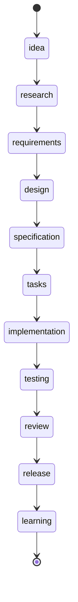

# Specification — Zod Runtime Validation for Script-Layer Parsers

Implementation-ready contracts. Two independent teams reading this document must produce indistinguishable code. All TypeScript snippets are concrete and load-bearing — real type names, real export names, real constant identifiers from existing source.

---

## Scope

**In scope.**

- A shared wrapper module `scripts/lib/zod-diagnostic.ts` that translates `ZodError` to either `Diagnostic[]` (stable-code path) or `string[]` (existing string-diagnostic path).
- A new sibling schema module `scripts/lib/release-readiness-schema.ts` exporting one schema per check-function input (seven schemas) plus the args schema, with inferred types.
- A new sibling schema module `scripts/lib/spec-state-schema.ts` exporting the workflow-state frontmatter schema and inferred type.
- Inline schemas added to `scripts/lib/release-package-contract.ts` (args + doc-stub frontmatter) and `scripts/lib/traceability.ts` (single `area` field).
- Per-target migration of `release-package-contract.ts`, `release-readiness.ts`, `spec-state.ts`, and `traceability.ts` to delegate shape validation to schemas and route shape-mismatch results through the wrapper. Stable diagnostic codes preserved byte-identically.
- A separate post-schema imperative consistency-pass function in `spec-state.ts` covering REQ-ZSV-009 rules.
- `package.json` `dependencies` gains `"zod": "^4.0.0"` (concrete pin); `npm-shrinkwrap.json` regenerated.
- `docs/specorator-product/tech.md` Dependency Policy section gains a paragraph recording the first runtime dep + ADR-0023 reference.

**Out of scope** (restated tightly from PRD non-goals):

- NG1 — Markdown-frontmatter validation across `specs/*/`, `docs/`. Not in this feature.
- NG2 — Replacing or modifying `parseSimpleYaml` in `scripts/lib/repo.ts`.
- NG3 — Renaming or reshaping any `RELEASE_READINESS_*` or `RELEASE_PKG_*` identifier.
- NG4 — Migrating CI workflows or any non-`scripts/` layer.
- NG5 — Drive-by refactoring of unrelated logic.
- NG6 — Bundling, tree-shaking, or `package.json` `"files"` changes beyond the dependency entry.

---

## Interfaces

### SPEC-ZSV-001 — `mapZodErrorToDiagnostic` and `toStringDiagnostics` (shared wrapper module)

- **Kind:** function exports in new file `scripts/lib/zod-diagnostic.ts`.
- **Signature:**
  ```ts
  import type { ZodError } from "zod";
  import type { Diagnostic } from "./diagnostics.js";

  /**
   * Convert a ZodError into one Diagnostic per issue, stamped with the
   * caller-supplied stable code (RELEASE_READINESS_* / RELEASE_PKG_*).
   * The code is NOT derived from the issue — REQ-ZSV-005 / REQ-ZSV-006
   * require byte-identical code emission for previously-tested fixtures,
   * which is only achievable if the caller assigns the code explicitly
   * for the check function it is wrapping.
   *
   * @param error  - The ZodError returned by `schema.safeParse(...).error`.
   * @param code   - Stable diagnostic code constant the caller is wrapping.
   * @param path   - Optional file-relative POSIX path attached to each Diagnostic.
   * @returns      - One Diagnostic per `error.issues` entry; minimum length 1.
   */
  export function mapZodErrorToDiagnostic(
    error: ZodError,
    code: string,
    path?: string,
  ): Diagnostic[];

  /**
   * Convert a ZodError into one prefixed string per issue, matching the
   * `${rel} <message>` format used by `specStateDiagnosticsForText` and
   * `traceabilityDiagnosticsForFeature` (existing string-diagnostic callers).
   *
   * @param error   - The ZodError returned by `schema.safeParse(...).error`.
   * @param prefix  - File-relative path prefix (typically the `rel` argument
   *                  the caller already received).
   * @returns       - One string per issue. Format:
   *                  `${prefix} ${formatPath(issue.path)} ${issue.message}`,
   *                  with empty-path issues rendered as `${prefix} ${message}`.
   */
  export function toStringDiagnostics(error: ZodError, prefix: string): string[];

  /**
   * Format an issue path array (e.g. ["artifacts", "spec.md"]) into a
   * dot-joined string, with numeric segments wrapped as `[N]`.
   * Pure helper exported for tests.
   */
  export function formatPath(path: ReadonlyArray<string | number>): string;
  ```
- **Behaviour:**
  - `mapZodErrorToDiagnostic` walks `error.issues[]` in array order. For each issue it returns a `Diagnostic` whose:
    - `code` field is the supplied `code` argument (verbatim, not derived).
    - `path` field is the supplied `path` argument when defined, otherwise omitted.
    - `message` field is composed as `${formatPath(issue.path)}: ${issue.message}` when `issue.path.length > 0`, otherwise `issue.message` alone.
  - `toStringDiagnostics` walks `error.issues[]` in array order. For each issue it returns `${prefix} ${formatPath(issue.path)} ${issue.message}` (single-space separators) when `issue.path.length > 0`, otherwise `${prefix} ${issue.message}`.
  - `formatPath` joins with `.` for string segments and `[N]` for numeric segments (e.g. `categories[0].name`).
- **Pre-conditions:** `error` is a `ZodError` returned from a `safeParse({ success: false })` call. `code` is non-empty when used by stable-code callers.
- **Post-conditions:** The returned array length equals `error.issues.length`. No I/O; no logging; no global state read or written. The function is pure (deterministic on inputs).
- **Side effects:** None. The wrapper imports `zod` only for the `ZodError` type and `./diagnostics.js` for the `Diagnostic` type — never for runtime values.
- **Errors:** None thrown. Empty `error.issues[]` (theoretically possible but never produced by zod's `safeParse`) returns `[]`; callers must handle accordingly.
- **Satisfies:** REQ-ZSV-005, REQ-ZSV-006.

---

### SPEC-ZSV-002 — `releasePackageArgsSchema` and `docStubFrontmatterSchema` (inline in `release-package-contract.ts`)

- **Kind:** Two `z.object`/`z.discriminatedUnion` schemas declared inline at module top-level (architect-call CLAR-004: this target is small enough to inline).
- **Signature:**
  ```ts
  import { z } from "zod";

  /**
   * Discriminated union over `archiveSource`. Mirrors the existing
   * `ParsedReleasePackageArgs` type; replaces the imperative argv-walking
   * branches in `parseReleasePackageArgs` with a Pattern-B (native ZodError)
   * shape check applied AFTER the loop produces a candidate object.
   */
  export const releasePackageArgsSchema = z.discriminatedUnion("archiveSource", [
    z.object({
      archiveSource: z.literal("argv"),
      archive: z.string().min(1),
    }).strict(),
    z.object({
      archiveSource: z.literal("env"),
      archive: z.string().min(1),
    }).strict(),
    z.object({
      archiveSource: z.literal("none"),
    }).strict(),
    z.object({
      archiveSource: z.literal("argv-empty"),
      rawFlag: z.string().min(1),
    }).strict(),
  ]);

  /**
   * Frontmatter shape every shipping `docs/` page must satisfy
   * (per `templates/release-package-stub.md`, the doc-stub contract from v0.5).
   * Used inside `checkDocsAreStubs` to replace the for-loop key check.
   * Strict so that surplus keys are surfaced as ZodError issues; the
   * existing test suite asserts only required-key presence, so strict
   * mode is a superset and remains backward-compatible.
   */
  export const docStubFrontmatterSchema = z.object({
    title: z.string().min(1),
    folder: z.string().min(1),
    description: z.string().min(1),
    entry_point: z.boolean(),
  }).strict();

  export type ReleasePackageArgs = z.infer<typeof releasePackageArgsSchema>;
  export type DocStubFrontmatter = z.infer<typeof docStubFrontmatterSchema>;
  ```
- **Behaviour:**
  - `releasePackageArgsSchema.safeParse(candidate)` is invoked at the END of `parseReleasePackageArgs` after the imperative argv loop has built a candidate `{ archiveSource, archive?, rawFlag? }`. Pattern B: on failure, the function throws the `ZodError` directly — argument-parsing has no stable diagnostic surface (research §Q5).
  - `docStubFrontmatterSchema.safeParse(parsed)` is invoked inside `checkDocsAreStubs` against each `parseSimpleYaml(fm.raw)` result. Pattern A on failure: route through `mapZodErrorToDiagnostic(error, RELEASE_PACKAGE_DIAGNOSTIC_CODES.DocStub, rel)`. The four required-key checks in the existing `for (const key of DOC_STUB_REQUIRED_FRONTMATTER_KEYS)` loop are removed and replaced by this single `safeParse`.
- **Pre-conditions:** `candidate` for the args schema is a plain object built from argv/env. `parsed` for the doc-stub schema is the return value of `parseSimpleYaml` (a `Record<string, unknown>`).
- **Post-conditions:** On success, the inferred type is available for downstream consumers without manual narrowing.
- **Side effects:** None.
- **Errors:**
  - Args schema: `ZodError` thrown to the caller of `parseReleasePackageArgs` (existing CLI handles unhandled exceptions with non-zero exit).
  - Doc-stub schema: emits `Diagnostic[]` with `code: RELEASE_PACKAGE_DIAGNOSTIC_CODES.DocStub` and `path: rel` (matching the existing fixture assertions).
- **Satisfies:** REQ-ZSV-001, REQ-ZSV-006.

---

### SPEC-ZSV-003 — `releaseReadinessSchemas` (sibling file `release-readiness-schema.ts`)

- **Kind:** Seven `z.object` schemas plus one args-schema export, declared at the top level of new file `scripts/lib/release-readiness-schema.ts`.
- **Signature:**
  ```ts
  import { z } from "zod";

  /**
   * (1) `parseReleaseReadinessArgs` — args schema.
   * Discriminated union mirroring `ParsedReleaseReadinessArgs`.
   */
  export const releaseReadinessArgsSchema = z.discriminatedUnion("kind", [
    z.object({
      kind: z.literal("args"),
      version: z.string().min(1).optional(),
      versionSource: z.enum(["argv", "env"]).optional(),
      archive: z.string().min(1).optional(),
      archiveSource: z.enum(["argv", "env"]).optional(),
    }).strict(),
    z.object({
      kind: z.literal("argv-empty"),
      rawFlag: z.string().min(1),
    }).strict(),
  ]);

  /**
   * (2) `checkVersionAlignment` — package.json content shape.
   * The function ALSO branches on `pkg.missing` / `pkg.parseError` before
   * the schema runs (those paths emit `PackageJsonMissing` from procedural
   * I/O code that stays in `release-readiness.ts`); the schema covers only
   * the shape of `pkg.data` once it exists.
   */
  export const packageJsonSchema = z.object({
    name: z.string().min(1).optional(),
    version: z.string().min(1),
    publishConfig: z
      .object({ registry: z.string().min(1).optional() })
      .strict()
      .optional(),
    repository: z
      .union([
        z.string().min(1),
        z.object({ url: z.string().min(1) }).strict(),
      ])
      .optional(),
    files: z.array(z.string().min(1)).optional(),
  }).passthrough();

  /**
   * (3) `checkChangelog` is procedural file-presence + regex; no shape
   * schema is added (matches research finding — file existence and regex
   * test do not benefit from a zod schema). Placeholder export kept off
   * intentionally. REQ-ZSV-002 is satisfied by the SIX shape-driven
   * checks plus the args schema; `checkChangelog` is documented here
   * as having no shape input to validate.
   */
  // (intentionally no schema export for checkChangelog)

  /**
   * (4) `checkReleaseNotesConfig` — `.github/release.yml` shape.
   * Replaces the existing nested `typeof === "object"` / `Array.isArray`
   * branches in `checkReleaseNotesConfig`.
   */
  export const releaseNotesConfigSchema = z.object({
    changelog: z.object({
      categories: z.array(z.unknown()).min(1),
      exclude: z.object({
        labels: z.array(z.unknown()),
        authors: z.array(z.unknown()),
      }).strict(),
    }).strict(),
  }).strict();

  /**
   * (5) `checkPackageMetadata` — fields read from `package.json` for the
   * metadata-correctness assertions. NOTE: this schema is a NARROWER
   * view of `packageJsonSchema` covering only the metadata fields; the
   * function applies it after `packageJsonSchema` has succeeded.
   * The function preserves its existing per-field stable codes
   * (`PkgName`, `PkgRegistry`, `PkgRepository`, `PkgFiles`) by NOT
   * routing this schema's failure through a single code — instead the
   * function continues to compare per-field after `safeParse` succeeds,
   * because the comparison is against runtime `expected` values that
   * vary per call. The schema's role is shape only.
   */
  export const packageMetadataSchema = z.object({
    name: z.string().min(1),
    publishConfig: z.object({
      registry: z.string().min(1),
    }).strict(),
    repository: z.union([
      z.string().min(1),
      z.object({ url: z.string().min(1) }).strict(),
    ]),
    files: z.array(z.string().min(1)).min(1),
  }).passthrough();

  /**
   * (6) `checkWorkflowPermissions` — top-level + per-job permissions.
   * The schema validates SHAPE only. The detailed key/value checks
   * against `REQUIRED_WORKFLOW_PERMISSIONS` and the disallowed-key
   * enumeration remain imperative in `diagnosticsForPermissions`
   * because they depend on the runtime constant set.
   */
  export const workflowPermissionsBlockSchema = z.union([
    z.string(),
    z.record(z.string(), z.string()),
    z.null(),
    z.undefined(),
  ]);

  export const workflowDocumentSchema = z.object({
    permissions: workflowPermissionsBlockSchema,
    jobs: z.record(
      z.string(),
      z.object({
        permissions: workflowPermissionsBlockSchema,
      }).passthrough(),
    ).optional(),
  }).passthrough();

  /**
   * (7) `checkQualitySignals` — input QualitySignals shape.
   * The schema validates that maturityLevel / openBlockers /
   * openClarifications are NUMBERS; the `<` and `>` threshold
   * comparisons remain imperative per REQ-ZSV-008.
   */
  export const qualitySignalsSchema = z.object({
    ciStatus: z.string().optional(),
    validationStatus: z.string().optional(),
    openBlockers: z.number().int().nonnegative(),
    openClarifications: z.number().int().nonnegative(),
    maturityLevel: z.number().int(),
    waiver: z.string().optional(),
  }).strict();

  export type ReleaseReadinessArgs    = z.infer<typeof releaseReadinessArgsSchema>;
  export type PackageJson             = z.infer<typeof packageJsonSchema>;
  export type ReleaseNotesConfig      = z.infer<typeof releaseNotesConfigSchema>;
  export type PackageMetadata         = z.infer<typeof packageMetadataSchema>;
  export type WorkflowDocument        = z.infer<typeof workflowDocumentSchema>;
  export type QualitySignalsValidated = z.infer<typeof qualitySignalsSchema>;
  ```
- **Behaviour:** Each schema is invoked via `schema.safeParse(input)` inside its corresponding check function in `release-readiness.ts`. On `success: false`, the check function calls `mapZodErrorToDiagnostic(result.error, <stable-code>, <path>)` where `<stable-code>` is the `RELEASE_READINESS_*` constant the original imperative branch emitted (one specific mapping per check):
  - `releaseReadinessArgsSchema` failure → `ZodError` thrown (Pattern B).
  - `packageJsonSchema` failure (after I/O succeeded) → `RELEASE_READINESS_DIAGNOSTIC_CODES.PackageJsonMissing`.
  - `releaseNotesConfigSchema` failure → `RELEASE_READINESS_DIAGNOSTIC_CODES.ReleaseNotesShape`.
  - `packageMetadataSchema` failure → emit per-field code by mapping `issue.path[0]`:
    | `path[0]`         | code                        |
    |-------------------|-----------------------------|
    | `name`            | `PkgName`                   |
    | `publishConfig`   | `PkgRegistry`               |
    | `repository`      | `PkgRepository`             |
    | `files`           | `PkgFiles`                  |
    The function passes a per-issue lookup helper to the wrapper (or calls the wrapper once per issue with the resolved code).
  - `workflowDocumentSchema` failure → `RELEASE_READINESS_DIAGNOSTIC_CODES.WorkflowPermissions`.
  - `qualitySignalsSchema` failure → `RELEASE_READINESS_DIAGNOSTIC_CODES.Quality`.
- **Pre-conditions:** Inputs supplied by the existing parsers (`pkg.data`, parsed YAML root object, `signals` argument).
- **Post-conditions:** On success, downstream imperative logic (`checkTagAtMain` SHA comparison, `checkQualitySignals` threshold comparison, per-field equality in `checkPackageMetadata`) runs against the inferred typed object — REQ-ZSV-007, REQ-ZSV-008 preserved.
- **Side effects:** None.
- **Errors:** Enumerated above per schema.
- **Satisfies:** REQ-ZSV-002, REQ-ZSV-005, REQ-ZSV-007 (`checkTagAtMain` shape only — behaviour stays imperative; the function takes a `GitInterface` not a parsed object, so no shape schema is added for it), REQ-ZSV-008 (quality-signal shape only).

---

### SPEC-ZSV-004 — `specStateFrontmatterSchema` (sibling file `spec-state-schema.ts`)

- **Kind:** One `z.object` schema declared at the top level of new file `scripts/lib/spec-state-schema.ts`.
- **Signature:**
  ```ts
  import { z } from "zod";
  import {
    artifactStatuses,
    canonicalArtifacts,
    workflowStages,
    workflowStatuses,
  } from "./workflow-schema.js";

  // Convert the existing Set<string> exports into z.enum-compatible tuples.
  // These tuples are consumed by zod at module load (one-time cost).
  const stageTuple    = [...workflowStages]    as [string, ...string[]];
  const statusTuple   = [...workflowStatuses]  as [string, ...string[]];
  const artifactTuple = [...artifactStatuses]  as [string, ...string[]];

  /**
   * Workflow-state.md frontmatter shape.
   *
   * Captures every required field, every enum, and the `artifacts` map
   * shape, including required-key presence drawn from `canonicalArtifacts`.
   * Cross-property consistency rules (REQ-ZSV-009) are NOT in this
   * schema — see SPEC-ZSV-005.
   */
  export const specStateFrontmatterSchema = z.object({
    feature:       z.string().min(1),
    area:          z.string().regex(/^[A-Z][A-Z0-9]*$/),
    current_stage: z.enum(stageTuple),
    status:        z.enum(statusTuple),
    last_updated:  z.string().regex(/^\d{4}-\d{2}-\d{2}$/),
    last_agent:    z.string().min(1),
    artifacts:     z
      .record(z.string(), z.enum(artifactTuple))
      .refine(
        (map) => canonicalArtifacts.every((name) => name in map),
        {
          message: `artifacts map missing one or more canonical entries (${canonicalArtifacts.join(", ")})`,
        },
      ),
  }).passthrough();
  // .passthrough() so unrelated frontmatter keys (e.g. `id`, `inputs`,
  // `created`, `updated`, `owner`) on richer state files don't trigger
  // false positives. The existing parser only reads the seven listed
  // fields, so passthrough preserves backward compatibility.

  export type WorkflowStateFrontmatter = z.infer<typeof specStateFrontmatterSchema>;
  ```
- **Behaviour:** Replaces the body of `validateRequiredFields` (lines 93–110) and the shape branch of `validateArtifactMap` (lines 129–144) in `spec-state.ts`. The parser invokes `specStateFrontmatterSchema.safeParse(parseSimpleYaml(frontmatter.raw))`. On `success: false`, calls `toStringDiagnostics(result.error, rel)` and pushes each result onto `errors`. On `success: true`, passes the inferred typed object to the consistency-pass function (SPEC-ZSV-005).
- **Pre-conditions:** Input is the `Record<string, unknown>` returned by `parseSimpleYaml`.
- **Post-conditions:** On success, every downstream consumer sees a `WorkflowStateFrontmatter` typed object — no manual narrowing of `data.artifacts as Record<string, unknown>` (existing line 134) is required.
- **Side effects:** None.
- **Errors:** Schema rejects: missing required field, regex mismatch on `area` or `last_updated`, enum mismatch on `current_stage` / `status` / artifact-status, missing canonical-artifact key in the `artifacts` map. Each emits one or more `string[]` diagnostic via `toStringDiagnostics`.
- **Satisfies:** REQ-ZSV-003.

---

### SPEC-ZSV-005 — `specStateConsistencyDiagnostics` (post-schema imperative pass in `spec-state.ts`)

- **Kind:** Function declared at module level in `scripts/lib/spec-state.ts`, exported for direct test access.
- **Signature:**
  ```ts
  import type { WorkflowStateFrontmatter } from "./spec-state-schema.js";
  import { canonicalArtifacts, stageArtifacts } from "./workflow-schema.js";

  /**
   * Cross-property consistency rules that REQ-ZSV-009 mandates run as a
   * separate pass AFTER `specStateFrontmatterSchema.safeParse` succeeds.
   * Implements the two REQ-ZSV-009 rules:
   *   (a) `status: done` requires every canonical artifact to be in a
   *       terminal state (`complete`, or `skipped` for non-retrospective
   *       artifacts; `retrospective.md` must be `complete`).
   *   (b) For the declared `current_stage`, every artifact belonging to
   *       a STRICTLY EARLIER stage in `stageArtifacts` order must NOT
   *       be `pending`.
   *
   * Returns an array of `${rel} <diagnostic>` strings (matching the
   * existing string-diagnostic surface).
   *
   * @param rel  - The same `rel` argument the caller threads through.
   * @param data - Frontmatter that has already passed schema validation.
   */
  export function specStateConsistencyDiagnostics(
    rel: string,
    data: WorkflowStateFrontmatter,
  ): string[];
  ```
- **Behaviour:**
  1. Build `stageOrder = stageArtifacts.map(([stage]) => stage)`.
  2. Find `currentIndex = stageOrder.indexOf(data.current_stage)`.
  3. **Rule (b):** for each `[stage, artifactList]` in `stageArtifacts` whose index < `currentIndex`, for each artifact in `artifactList`, if `data.artifacts[artifact] === "pending"`, emit `${rel} ${artifact} is pending but current_stage ${data.current_stage} is past its declaration stage ${stage}`.
  4. **Rule (a):** if `data.status === "done"`, for each artifact in `canonicalArtifacts`:
     - If `artifact === "retrospective.md"`: require `data.artifacts[artifact] === "complete"`; otherwise emit `${rel} status is done, but ${artifact} is ${data.artifacts[artifact]}`.
     - Else: require `data.artifacts[artifact] === "complete" || data.artifacts[artifact] === "skipped"`; otherwise emit the same string.
  5. Return the accumulated string array (may be empty).
- **Pre-conditions:** `data` has already passed `specStateFrontmatterSchema.parse` (so all enums are valid and all canonical artifacts are present in the map).
- **Post-conditions:** Pure function. Existing `validateCurrentStageArtifact` and `validateDoneState` (lines 161–206) are deleted; this function replaces both. The wider `validateStageProgress`, `validateRequiredSections`, `validateSkipsDocumentation`, `validateDoneClarifications`, `validateFeatureIdentity` functions are retained unchanged — they cover non-shape rules outside REQ-ZSV-009's scope.
- **Side effects:** None.
- **Errors:** None thrown. Returns string diagnostics only.
- **Satisfies:** REQ-ZSV-009.

---

### SPEC-ZSV-006 — `traceabilityFrontmatterSchema` (inline in `traceability.ts`)

- **Kind:** Single `z.object` schema declared inline at the top of `scripts/lib/traceability.ts`.
- **Signature:**
  ```ts
  import { z } from "zod";

  /**
   * Workflow-state frontmatter subset consumed by traceability. Only
   * `area` is read by this parser; other fields are read by spec-state
   * with its own schema. `feature` is included as optional because
   * `validateDocumentFrontmatter` cross-references it.
   */
  export const traceabilityStateSchema = z.object({
    area:    z.string().regex(/^[A-Z][A-Z0-9]*$/),
    feature: z.string().min(1).optional(),
  }).passthrough();

  export type TraceabilityState = z.infer<typeof traceabilityStateSchema>;
  ```
- **Behaviour:** Replaces lines 53–58 of `traceabilityDiagnosticsForFeature`:
  ```ts
  // before
  const state = parseSimpleYaml(stateFrontmatter.raw);
  const area = String(state.area || "");
  if (!area) {
    errors.push(`${stateRel} missing frontmatter key: area`);
    return errors;
  }
  // after
  const parsed = traceabilityStateSchema.safeParse(parseSimpleYaml(stateFrontmatter.raw));
  if (!parsed.success) {
    errors.push(...toStringDiagnostics(parsed.error, stateRel));
    return errors;
  }
  const state = parsed.data;
  const area = state.area;
  ```
- **Pre-conditions:** Input is the `Record<string, unknown>` returned by `parseSimpleYaml`.
- **Post-conditions:** `area` is statically typed `string` matching `^[A-Z][A-Z0-9]*$`; downstream `String(state.area || "")` cast (existing line 54) is removed. Other downstream readers of `state.feature` (e.g. line 119) keep their existing `data.feature && data.feature !== state.feature` check; passing `passthrough` preserves all extra fields.
- **Side effects:** None.
- **Errors:** Schema rejects: `area` absent, `area` not a string, `area` empty, `area` not matching `^[A-Z][A-Z0-9]*$`.
- **Satisfies:** REQ-ZSV-004.

---

### SPEC-ZSV-007 — `package.json` `dependencies` entry

- **Kind:** Configuration change.
- **Signature (concrete diff):**
  ```diff
   {
     "name": "@luis85/agentic-workflow",
     "version": "0.5.0",
     ...
     "engines": {
       "node": ">=20"
     },
  +  "dependencies": {
  +    "zod": "^4.0.0"
  +  },
     "devDependencies": {
       "@types/node": "^25.5.0",
       ...
     }
   }
  ```
  - The literal range `^4.0.0` is the concrete pin. Research confirmed v4 stable since May 2025; `^4.0.0` admits the v4 line and excludes v5. Implementation may bump to a stricter `^4.X.Y` if a specific version is locked.
  - `npm-shrinkwrap.json` MUST be regenerated in the same commit (`npm install` then commit the lockfile delta).
  - `"files"` entry is unchanged.
  - `devDependencies` MUST NOT receive a duplicate `zod` entry.
- **Behaviour:** After merge, `npm i @luis85/agentic-workflow` resolves `node_modules/zod` automatically.
- **Pre-conditions:** None.
- **Post-conditions:** REQ-ZSV-010 acceptance test passes: `node_modules/zod` exists post-install with version satisfying `^4.0.0`.
- **Side effects:** Consumer install footprint grows by zod's unpacked size (research §Q1 ~250–300 kB for v4).
- **Errors:** None at config level; downstream resolution failure surfaces as `npm i` error, not in our code.
- **Satisfies:** REQ-ZSV-010.

---

### SPEC-ZSV-008 — `docs/specorator-product/tech.md` Dependency Policy update

- **Kind:** Documentation patch.
- **Signature (concrete prose patch — append to the end of the existing `## Dependency Policy` section):**
  ```diff
   ## Dependency Policy

   - New runtime or dev dependencies require a PR justification.
   - Architecturally significant dependencies require an ADR.
   - Security-sensitive dependencies require explicit review.
   - Keep package metadata and release-package checks in sync.
  +
  +### Runtime dependencies
  +
  +As of v0.6, `@luis85/agentic-workflow` carries one runtime dependency:
  +`zod` pinned to `^4.0.0`. It is the validation layer for the four
  +script-layer parsers under `scripts/lib/` (`release-readiness.ts`,
  +`release-package-contract.ts`, `spec-state.ts`, `traceability.ts`).
  +Rationale and consequences are recorded in ADR-0023
  +(`docs/adr/0023-adopt-zod-as-first-runtime-dependency.md`).
  +Adding any further runtime dependency requires a new ADR.
  ```
- **Behaviour:** N/A (doc).
- **Satisfies:** REQ-ZSV-011.

---

## Data structures

The following TypeScript types are the canonical shapes referenced by all spec items above. Each field's validation rule is given alongside its definition.

### `Diagnostic` (existing — DO NOT REDEFINE)

Source: `scripts/lib/diagnostics.ts:1–11`. Reproduced here for spec readers:

```ts
export type Diagnostic = {
  message: string;
  path?: string;
  line?: number;
  code?: string;
  rerun?: string;
  command?: string;
  exit_code?: number;
  stdout_tail?: string;
  stderr_tail?: string;
};
```

The wrapper sets `code` (always for stable-code paths), `path` (when caller supplies it), and `message` (always). Other fields are left unset.

### `WorkflowStateFrontmatter`

```ts
type WorkflowStateFrontmatter = z.infer<typeof specStateFrontmatterSchema>;
// Equivalent to:
// {
//   feature: string;          // non-empty
//   area: string;             // matches /^[A-Z][A-Z0-9]*$/
//   current_stage: WorkflowStage; // member of `workflowStages` Set
//   status: WorkflowStatus;       // member of `workflowStatuses` Set
//   last_updated: string;     // matches /^\d{4}-\d{2}-\d{2}$/
//   last_agent: string;       // non-empty
//   artifacts: Record<string, ArtifactStatus>; // every canonical artifact key present
//   [extra: string]: unknown; // passthrough
// }
```

| Field | Required | Validation |
|---|---|---|
| `feature` | yes | `z.string().min(1)` |
| `area` | yes | `z.string().regex(/^[A-Z][A-Z0-9]*$/)` |
| `current_stage` | yes | `z.enum([...workflowStages])` — exactly one of `idea`, `research`, `requirements`, `design`, `specification`, `tasks`, `implementation`, `testing`, `review`, `release`, `learning` |
| `status` | yes | `z.enum([...workflowStatuses])` — exactly one of `active`, `blocked`, `paused`, `done` |
| `last_updated` | yes | `z.string().regex(/^\d{4}-\d{2}-\d{2}$/)` |
| `last_agent` | yes | `z.string().min(1)` |
| `artifacts` | yes | record of `string → enum(artifactStatuses)`; refinement requires every name in `canonicalArtifacts` to be a key |
| extras | passthrough | unrelated keys allowed |

### `ReleasePackageArgs`

```ts
type ReleasePackageArgs = z.infer<typeof releasePackageArgsSchema>;
// Equivalent to the discriminated union:
// | { archiveSource: "argv";        archive: string }
// | { archiveSource: "env";         archive: string }
// | { archiveSource: "none" }
// | { archiveSource: "argv-empty";  rawFlag: string }
```

| Variant | Required fields | Validation |
|---|---|---|
| `argv` | `archive` | `z.string().min(1)` |
| `env` | `archive` | `z.string().min(1)` |
| `none` | (none) | — |
| `argv-empty` | `rawFlag` | `z.string().min(1)` |

All variants use `.strict()` — surplus fields are rejected.

### `DocStubFrontmatter`

```ts
type DocStubFrontmatter = z.infer<typeof docStubFrontmatterSchema>;
// {
//   title: string;        // non-empty
//   folder: string;       // non-empty
//   description: string;  // non-empty
//   entry_point: boolean;
// }  // strict — surplus fields rejected
```

### Per-check-function input types (release-readiness)

```ts
type ReleaseReadinessArgs    = z.infer<typeof releaseReadinessArgsSchema>;
type PackageJson             = z.infer<typeof packageJsonSchema>;
type ReleaseNotesConfig      = z.infer<typeof releaseNotesConfigSchema>;
type PackageMetadata         = z.infer<typeof packageMetadataSchema>;
type WorkflowDocument        = z.infer<typeof workflowDocumentSchema>;
type QualitySignalsValidated = z.infer<typeof qualitySignalsSchema>;
```

| Type | Strictness | Notable rules |
|---|---|---|
| `ReleaseReadinessArgs` | `.strict()` per variant | discriminated by `kind`; `version` and `archive` optional in `args` variant |
| `PackageJson` | `.passthrough()` | `version` REQUIRED; others optional; `publishConfig` strict; `repository` is `string \| { url: string }` |
| `ReleaseNotesConfig` | `.strict()` outer + `.strict()` inner | `changelog.categories.length >= 1`; `changelog.exclude.{labels,authors}` arrays |
| `PackageMetadata` | `.passthrough()` outer | `name`, `publishConfig.registry`, `repository`, `files` all required and non-empty |
| `WorkflowDocument` | `.passthrough()` | `permissions` is `string \| Record<string,string> \| null \| undefined`; `jobs` optional |
| `QualitySignalsValidated` | `.strict()` | numeric fields are integers; `openBlockers` / `openClarifications` non-negative |

### `TraceabilityState`

```ts
type TraceabilityState = z.infer<typeof traceabilityStateSchema>;
// {
//   area: string;        // matches /^[A-Z][A-Z0-9]*$/
//   feature?: string;    // optional, non-empty when present
//   [extra: string]: unknown;
// }
```

---

## State transitions

REQ-ZSV-009 cross-property rules walk `current_stage` against the `artifacts` map. Stage order is the canonical order in `scripts/lib/workflow-schema.ts:19–31`:

```
idea → research → requirements → design → specification →
tasks → implementation → testing → review → release → learning
```



**Validity table** (consumed by `specStateConsistencyDiagnostics`):

| Condition (`current_stage = X`, `status = Y`) | Permitted artifact states |
|---|---|
| For every stage S whose index < X | every artifact in `stageArtifacts[S]` must NOT be `pending` |
| For stage X itself | any state allowed |
| For every stage S whose index > X | any state allowed |
| `status = done` (regardless of X) | every artifact in `canonicalArtifacts` is `complete` or `skipped`, except `retrospective.md` which must be `complete` |
| `status` ∈ {`active`, `blocked`, `paused`} | (no additional rule beyond the stage-index check) |

Schema rejection (SPEC-ZSV-004) precedes the consistency pass — if the schema fails, the consistency pass does not run for that document.

---

## Validation rules

For each schema, accepted vs rejected inputs:

#### `releasePackageArgsSchema` (see SPEC-ZSV-002 above)

- **Accepted:** any of the four variants whose discriminator (`archiveSource`) and required fields are present and well-typed.
- **Rejected:** missing discriminator → `ZodError` issue with `path: ["archiveSource"]`, `code: "invalid_union_discriminator"`. Wrong-type `archive` (e.g. `null`) → issue with `path: ["archive"]`. Surplus key (`.strict()`) → issue with `code: "unrecognized_keys"`.

#### `docStubFrontmatterSchema` (see SPEC-ZSV-002 above)

- **Accepted:** `{ title, folder, description, entry_point }` all present, types match.
- **Rejected:** missing `title` → issue with `path: ["title"]`, `code: "invalid_type"` (received `undefined`). `entry_point: "true"` (string) → issue with `path: ["entry_point"]`, `code: "invalid_type"` (expected boolean, received string). Surplus key → issue with `code: "unrecognized_keys"`.

#### release-readiness schemas (see SPEC-ZSV-003 above)

Per-schema:

- `releaseReadinessArgsSchema` — missing `kind` discriminator → `ZodError` thrown (Pattern B). Wrong-type `version` → ZodError.
- `packageJsonSchema` — missing `version` → issue with `path: ["version"]`. Wrong-type `files` (e.g. string) → issue with `path: ["files"]`.
- `releaseNotesConfigSchema` — missing `changelog` → `path: ["changelog"]`. `categories: []` (empty array) → issue with `path: ["changelog", "categories"]`, `code: "too_small"`. `exclude.labels` not an array → `path: ["changelog", "exclude", "labels"]`.
- `packageMetadataSchema` — missing `name` → `path: ["name"]`; missing `publishConfig.registry` → `path: ["publishConfig", "registry"]`. `files: []` → `path: ["files"]`, `code: "too_small"`.
- `workflowDocumentSchema` — `permissions: 42` (number) → `path: ["permissions"]`, `code: "invalid_union"`.
- `qualitySignalsSchema` — `maturityLevel: "high"` → `path: ["maturityLevel"]`, `code: "invalid_type"`. `openBlockers: -1` → `path: ["openBlockers"]`, `code: "too_small"`. Surplus key → `code: "unrecognized_keys"`.

#### `specStateFrontmatterSchema` (see SPEC-ZSV-004 above)

- **Accepted:** every required field present and well-typed; `area` matches the regex; `current_stage` and `status` and every artifact-status are enum members; `artifacts` map contains every canonical artifact name.
- **Rejected:** see EC-001..EC-008 for concrete cases.

#### `specStateConsistencyDiagnostics` (see SPEC-ZSV-005 above)

Returns string diagnostics (NOT ZodError) for cross-property violations. Schema-shape violations are upstream and do not reach this function.

#### `traceabilityStateSchema` (see SPEC-ZSV-006 above)

- **Accepted:** `area` present, string, matches `^[A-Z][A-Z0-9]*$`. Other fields ignored via `.passthrough`.
- **Rejected:** `area` absent → `path: ["area"]`, `code: "invalid_type"`. `area: ""` → `path: ["area"]`, `code: "invalid_string"` (regex). `area: "lower"` → same.

---

## Edge cases

| ID | Case | Expected behaviour |
|---|---|---|
| EC-001 | Empty `workflow-state.md` frontmatter block (`---\n---\n` with no keys) | `specStateFrontmatterSchema.safeParse({})` returns `success: false`; one ZodError issue per missing required field (`feature`, `area`, `current_stage`, `status`, `last_updated`, `last_agent`, `artifacts`); wrapper emits 7 string diagnostics prefixed with `rel`. |
| EC-002 | `area: ""` (empty string) | Schema reports regex violation; `path: ["area"]`, `code: "invalid_string"`. |
| EC-003 | `area: "lower"` (lowercase) | Schema reports regex violation; `path: ["area"]`, `code: "invalid_string"`. |
| EC-004 | Release-readiness check input missing optional field (e.g. `releaseReadinessArgsSchema` `args` variant without `version`) | `safeParse` returns `success: true`; `data.version === undefined`; no diagnostic. |
| EC-005 | Release-readiness check input with wrong type for required field (e.g. `qualitySignals.maturityLevel: "high"`) | `safeParse` returns `success: false`; wrapper emits Diagnostic with `code: RELEASE_READINESS_DIAGNOSTIC_CODES.Quality`, `message` containing `maturityLevel: Expected number, received string`. |
| EC-006 | `parseSimpleYaml` returns malformed `Record<string, unknown>` (e.g. `artifacts` parsed as a string because of nested-yaml limitations) | `specStateFrontmatterSchema.safeParse` reports `path: ["artifacts"]`, `code: "invalid_type"`; wrapper emits a string diagnostic identifying `artifacts` as the offending field. |
| EC-007 | `current_stage: "completed"` (typo of `complete` — but note: `complete` is an artifact-status, not a stage; `completed` is just an unknown stage) | Schema rejects via stage enum: `path: ["current_stage"]`, `code: "invalid_enum_value"`, `received: "completed"`, `options: [...workflowStages]`. |
| EC-008 | `status: done` with one canonical artifact still `pending` | Schema accepts shape (status is a valid enum value, artifacts map is well-typed). `specStateConsistencyDiagnostics` then emits `${rel} status is done, but ${artifact} is pending`. |
| EC-009 | Quality-signal `maturityLevel: "high"` (string) | `qualitySignalsSchema.safeParse` returns `success: false`; wrapper emits Diagnostic with `RELEASE_READINESS_DIAGNOSTIC_CODES.Quality`. (Threshold check is downstream and never runs.) |
| EC-010 | `checkTagAtMain` input with valid SHA pair where SHAs match | No schema covers `checkTagAtMain` (it consumes a `GitInterface`, not a parsed object). Imperative comparison returns no diagnostic — REQ-ZSV-007 carve-out preserved. |
| EC-011 | Same as EC-010 but tag SHA ≠ main SHA | Imperative comparison emits `RELEASE_READINESS_DIAGNOSTIC_CODES.TagNotAtMain` — byte-identical to existing code (REQ-ZSV-007). |
| EC-012 | Release-package manifest with extra unknown field | **Decision: `.strict()`** for `docStubFrontmatterSchema` (and for `releasePackageArgsSchema`, `releaseNotesConfigSchema`, `qualitySignalsSchema`). Rationale: stub-template authoring is template-controlled — surplus keys are typos. Strict catches them early. **Not strict (`.passthrough()`)** for `packageJsonSchema`, `packageMetadataSchema`, `workflowDocumentSchema`, `specStateFrontmatterSchema`, `traceabilityStateSchema`: these read documents whose authors legitimately add other fields outside our concern (e.g. `npm` adds dozens of `package.json` keys; workflow YAML has `on`, `jobs`, `name`; frontmatter conventions vary). Passthrough preserves backward compatibility while still validating the fields we read. |
| EC-013 | Concurrent invocations of the same parser on different files | Schemas are stateless module-scope constants (zod schemas are immutable after construction). No shared mutable state. No concurrency hazard. Documented for completeness. |
| EC-014 | Consumer runs `npm i @luis85/agentic-workflow` on a project with prior `zod` ≠ `^4.x` at top level | `zod` is in our `dependencies`, NOT `peerDependencies`. npm install nests `node_modules/@luis85/agentic-workflow/node_modules/zod` if dedupe fails. Our scripts always import via the bare specifier `zod`, which Node resolves nearest-ancestor first — our nested copy. Consumer's top-level zod is unaffected. Documented as the mitigation. |

---

## Test scenarios

The QA agent will turn these into automated tests under `npm run test:scripts`. Per CLAR-005, fixtures are inline in test files — no `tests/fixtures/zod-schemas/` directory.

| Test ID | Scenario | Type | Maps to |
|---|---|---|---|
| TEST-ZSV-001 | Happy path: `releasePackageArgsSchema.safeParse(validArgvVariant)` returns `success: true`; inferred type narrows to `argv` variant. | unit | EC happy path; REQ-ZSV-001 |
| TEST-ZSV-002 | Happy path: `docStubFrontmatterSchema.safeParse(validFrontmatter)` returns `success: true`. | unit | REQ-ZSV-001 |
| TEST-ZSV-003 | Edge: `docStubFrontmatterSchema` with `entry_point: "true"` returns `success: false`; `issues[0].path === ["entry_point"]`. | unit | EC-005 generalised; REQ-ZSV-001 |
| TEST-ZSV-004 | Happy path: each of seven release-readiness schemas accepts a valid fixture; `success: true`. | unit (7 cases) | REQ-ZSV-002 |
| TEST-ZSV-005 | Edge: `qualitySignalsSchema` rejects `maturityLevel: "high"` with `path: ["maturityLevel"]`; wrapper emits Diagnostic with code `Quality`. | unit | EC-009; REQ-ZSV-002, REQ-ZSV-005, REQ-ZSV-008 |
| TEST-ZSV-006 | Edge: `packageMetadataSchema` rejects `files: []`; wrapper emits Diagnostic with code `PkgFiles`. | unit | REQ-ZSV-002, REQ-ZSV-005 |
| TEST-ZSV-007 | Happy path: `specStateFrontmatterSchema.safeParse(validWorkflowState)` returns `success: true`; inferred type narrows. | unit | REQ-ZSV-003 |
| TEST-ZSV-008 | Edge: empty frontmatter object → 7 issues, one per required field. | unit | EC-001; REQ-ZSV-003 |
| TEST-ZSV-009 | Edge: `current_stage: "completed"` rejected via stage enum. | unit | EC-007; REQ-ZSV-003 |
| TEST-ZSV-010 | Cross-property: `specStateConsistencyDiagnostics` with `status: done` + one pending artifact emits the correct string. | unit | EC-008; REQ-ZSV-009 |
| TEST-ZSV-011 | Cross-property: `specStateConsistencyDiagnostics` with `current_stage: testing` + `requirements.md: pending` emits stage-progression diagnostic. | unit | REQ-ZSV-009 |
| TEST-ZSV-012 | Happy path: `traceabilityStateSchema` accepts `{ area: "ZSV" }`. | unit | REQ-ZSV-004 |
| TEST-ZSV-013 | Edge: `traceabilityStateSchema` rejects `area: ""`. | unit | EC-002; REQ-ZSV-004 |
| TEST-ZSV-014 | Edge: `traceabilityStateSchema` rejects `area: "lower"`. | unit | EC-003; REQ-ZSV-004 |
| TEST-ZSV-015 | Wrapper: `mapZodErrorToDiagnostic(err, "RELEASE_READINESS_QUALITY", "x.yml")` returns `[{ code: "RELEASE_READINESS_QUALITY", path: "x.yml", message: ... }]`; length matches `err.issues.length`. | unit | REQ-ZSV-005, REQ-ZSV-006 |
| TEST-ZSV-016 | Wrapper: `toStringDiagnostics(err, "specs/foo/workflow-state.md")` produces strings prefixed with the supplied prefix. | unit | REQ-ZSV-005 (string-path equivalent) |
| TEST-ZSV-017 | Integration: end-to-end `checkReleaseReadiness` against a malformed quality-signals fixture emits the same `RELEASE_READINESS_QUALITY` Diagnostic.code as the pre-migration baseline. | integration | REQ-ZSV-005, REQ-ZSV-008 |
| TEST-ZSV-018 | Integration: end-to-end `checkReleasePackageContents` against a malformed doc-stub fixture emits the same `RELEASE_PKG_DOC_STUB` Diagnostic.code as pre-migration. | integration | REQ-ZSV-006 |
| TEST-ZSV-019 | Integration: end-to-end `specStateDiagnosticsForText` against a malformed-shape fixture emits string diagnostics whose first token is the rel path. | integration | REQ-ZSV-003 |
| TEST-ZSV-020 | Integration: end-to-end `traceabilityDiagnosticsForFeature` against a fixture with bad `area` emits a string diagnostic. | integration | REQ-ZSV-004 |
| TEST-ZSV-021 | Imperative carve-out: `checkTagAtMain` with matching SHAs returns `[]`. | unit | EC-010; REQ-ZSV-007 |
| TEST-ZSV-022 | Imperative carve-out: `checkTagAtMain` with diverging SHAs emits `TAG_NOT_AT_MAIN`. | unit | EC-011; REQ-ZSV-007 |
| TEST-ZSV-023 | Concurrency: invoking schemas in parallel on different inputs returns identical results to serial invocation. | unit | EC-013, NFR-ZSV-002 |
| TEST-ZSV-024 | Compatibility: package.json change resolves at install — `node_modules/zod/package.json#version` satisfies `^4.0.0`. | integration (post-install smoke) | REQ-ZSV-010 |

Counts: **24 tests; 21 unit + 3 integration.** Each `EC-NNN` from above maps to ≥ 1 test; each `SPEC-ZSV-NNN` maps to ≥ 1 happy-path test.

---

## Observability requirements

- **Logs.** Existing stdout/stderr `Diagnostic` emission via `formatDiagnostic` (`scripts/lib/diagnostics.ts:65–73`) is unchanged. No new log events. No new log levels. No structured-log schema change.
- **Metrics.** N/A — CLI tool, no metric surface.
- **Traces.** N/A — synchronous single-process execution.
- **Alerts.** Existing CI red-build is the only alert surface; unchanged.

---

## Performance budget

Inherits NFR-ZSV-001: `npm run verify` wall-clock runtime regression ≤ 5% versus pre-migration baseline.

**Baseline-capture procedure:**

1. Before T-ZSV-001 lands: on the current `main` HEAD, run `npm ci && time npm run verify` three times on the same machine and Node.js version. Record the median wall-clock seconds in `implementation-log.md` under the heading `verify-gate baseline`.
2. After each per-target migration commit lands: re-run `time npm run verify` once on the same machine + Node version. Record the new median in `implementation-log.md` under the per-task heading.
3. Compute delta as `(new - baseline) / baseline`. If `delta > 0.05`, planner pauses the task and either (a) optimises, or (b) requests a documented waiver per Article IX of the constitution.

Per-schema parse time is not budgeted — research §Q1 found no significant cost; zod schemas are constructed once at module load and `safeParse` is microseconds for objects of this size.

---

## Compatibility

- **Backward compatibility on the diagnostic-code surface.** REQ-ZSV-005 and REQ-ZSV-006 require byte-identical `RELEASE_READINESS_*` and `RELEASE_PKG_*` code emission for all currently-tested malformed-input fixtures. The wrapper API enforces this by taking the code as an explicit caller argument (SPEC-ZSV-001) — codes are never derived from `ZodIssue.code`.
- **Versioning.** No bump to `@luis85/agentic-workflow` major — the dep landing is feature-additive. The package's next release is a minor bump. Stated explicitly.
- **Migration plan.** Per RISK-ZSV-004 mitigation in `design.md`, migration is per-target atomic commits. Order (per research §Q4 + design):
  1. `release-package-contract.ts` — inline schemas + wrapper integration + tests.
  2. `release-readiness.ts` — sibling schema module + wrapper integration + tests.
  3. `spec-state.ts` — sibling schema module + consistency-pass refactor + tests.
  4. `traceability.ts` — inline schema + wrapper integration + tests.

Each step ships schema + integration + tests in the same commit; no commit may leave a half-migrated parser in tree.

---

## Quality gate

- [x] Behaviour unambiguous.
- [x] Every interface specifies signature, behaviour, errors, side effects.
- [x] Validation rules explicit.
- [x] Edge cases enumerated (EC-001..EC-014).
- [x] Test scenarios derivable (TEST-ZSV-001..024 with type and traceability).
- [x] Each spec item traces to ≥ 1 requirement ID (mapping in each SPEC-ZSV-NNN).
- [x] Observability requirements specified (no-change rationale documented).
