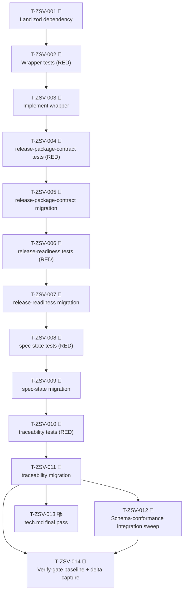

# Tasks — Zod Runtime Validation for Script-Layer Parsers

Each task is ≤ ~½ day, has a stable ID, references ≥ 1 requirement, and has a Definition of Done.

> **TDD ordering:** test tasks for a requirement come **before** the implementation task for that requirement.

> **Vertical-slice discipline (tracer-bullet):** every per-target slice pair (test + impl) crosses all layers for that target atomically — schema definition, wrapper integration, parser refactor, and tests ship in one commit. No horizontal decomposition ("all schemas first").

## Legend

- 🧪 = test task
- 🔨 = implementation task
- 📐 = design / scaffolding task
- 📚 = documentation task
- 🚀 = release / ops task

## Dependency graph

## Task list

### T-ZSV-001 📐 — Land zod dependency and regenerate lockfile

- **Description:** Add `"zod": "^4.0.0"` to `package.json` `dependencies`, regenerate `npm-shrinkwrap.json`, and confirm zod resolves at runtime via a smoke import.
- **Satisfies:** SPEC-ZSV-007, REQ-ZSV-010
- **Owner:** dev
- **Estimate:** S
- **Definition of done:**
  - [ ] `package.json` `dependencies` contains `"zod": "^4.0.0"`; no duplicate entry in `devDependencies`.
  - [ ] `npm-shrinkwrap.json` regenerated in the same commit (`npm install` delta committed).
  - [ ] Smoke: `tsx -e "import { z } from 'zod'; console.log(z.string().safeParse('').success)"` exits 0.
  - [ ] `npm run verify` green on the feature branch after this commit.
  - [ ] Implementation log entry added under `verify-gate baseline` heading (record median wall-clock of three `npm run verify` runs on `main` HEAD, per spec §Performance budget step 1).

---

### T-ZSV-002 🧪 — Write RED unit tests for `mapZodErrorToDiagnostic`, `toStringDiagnostics`, and `formatPath`

- **Description:** Author failing unit tests that fully specify the wrapper module's three exported functions before the module exists, covering happy paths and edge cases for path formatting, code assignment, and prefix formatting.
- **Satisfies:** SPEC-ZSV-001, REQ-ZSV-005, REQ-ZSV-006
- **Owner:** qa
- **Depends on:** T-ZSV-001
- **Estimate:** S
- **Definition of done:**
  - [ ] Tests cover: TEST-ZSV-015 (`mapZodErrorToDiagnostic` sets `code`, `path`, `message` correctly), TEST-ZSV-016 (`toStringDiagnostics` prefixes each string), and `formatPath` (string/numeric segments, empty path).
  - [ ] Each test references its TEST-ZSV-NNN ID in the test name or a comment.
  - [ ] Test file lives under `tests/scripts/` in the existing test layout.
  - [ ] All tests fail (import error or assertion failure) when the implementation file does not exist — RED confirmed.
  - [ ] `npm run verify` (excluding the failing tests themselves) green.

---

### T-ZSV-003 🔨 — Implement `mapZodErrorToDiagnostic`, `toStringDiagnostics`, and `formatPath`

- **Description:** Create the shared wrapper module exporting the three functions specified in SPEC-ZSV-001, making T-ZSV-002 tests go green.
- **Satisfies:** SPEC-ZSV-001, REQ-ZSV-005, REQ-ZSV-006
- **Owner:** dev
- **Depends on:** T-ZSV-002
- **Estimate:** S
- **Definition of done:**
  - [ ] T-ZSV-002 tests (TEST-ZSV-015, TEST-ZSV-016, `formatPath` cases) now pass.
  - [ ] Module is pure: no I/O, no global state, no logging side effects.
  - [ ] `tsc --project tsconfig.scripts.json` exits 0; lint clean.
  - [ ] `npm run test:scripts` exits 0 (zero regressions in pre-existing cases).
  - [ ] Implementation log entry added.

---

### T-ZSV-004 🧪 — Write RED tests for `release-package-contract` schema migration (SPEC-ZSV-002)

- **Description:** Author failing schema-conformance and integration tests for the `releasePackageArgsSchema` and `docStubFrontmatterSchema` before migrating the parser, covering valid fixtures, invalid fixtures, and wrapper-code preservation.
- **Satisfies:** SPEC-ZSV-002, REQ-ZSV-001, REQ-ZSV-006, REQ-ZSV-013
- **Owner:** qa
- **Depends on:** T-ZSV-003
- **Estimate:** S
- **Definition of done:**
  - [ ] Tests cover: TEST-ZSV-001 (valid argv variant), TEST-ZSV-002 (valid doc-stub), TEST-ZSV-003 (`entry_point: "true"` rejected), TEST-ZSV-018 (integration: `checkReleasePackageContents` emits `RELEASE_PKG_DOC_STUB` code unchanged).
  - [ ] Each test references its TEST-ZSV-NNN ID.
  - [ ] Inline fixtures used; no fixture directory created.
  - [ ] All tests fail on the unimplemented / pre-migration branch — RED confirmed.
  - [ ] `npm run verify` (excluding failing tests) green.

---

### T-ZSV-005 🔨 — Migrate `release-package-contract` to zod schemas (SPEC-ZSV-002)

- **Description:** Add inline zod schemas to the release-package-contract parser module, replace the existing hand-rolled shape guards with `safeParse` calls routed through the wrapper, and confirm all T-ZSV-004 tests pass.
- **Satisfies:** SPEC-ZSV-002, REQ-ZSV-001, REQ-ZSV-006, REQ-ZSV-012
- **Owner:** dev
- **Depends on:** T-ZSV-004
- **Estimate:** M
- **Definition of done:**
  - [ ] T-ZSV-004 tests (TEST-ZSV-001, TEST-ZSV-002, TEST-ZSV-003, TEST-ZSV-018) now pass.
  - [ ] `RELEASE_PKG_*` diagnostic codes emitted byte-identically to pre-migration fixtures.
  - [ ] No `typeof` guard for schema-covered fields remains in the parser source.
  - [ ] Schema definitions are in `scripts/lib/`; no `z.object(...)` calls in entry scripts.
  - [ ] `tsc --project tsconfig.scripts.json` exits 0; lint clean.
  - [ ] `npm run test:scripts` exits 0 (zero pre-existing regressions).
  - [ ] Implementation log entry added; wall-clock delta recorded.

---

### T-ZSV-006 🧪 — Write RED tests for `release-readiness` schema migration (SPEC-ZSV-003)

- **Description:** Author failing schema-conformance and integration tests for all seven `release-readiness-schema.ts` schemas and their wrapper integration before migrating the parser, covering valid/invalid fixtures and diagnostic-code preservation for each check function.
- **Satisfies:** SPEC-ZSV-003, REQ-ZSV-002, REQ-ZSV-005, REQ-ZSV-007, REQ-ZSV-008, REQ-ZSV-013
- **Owner:** qa
- **Depends on:** T-ZSV-005
- **Estimate:** M
- **Definition of done:**
  - [ ] Tests cover: TEST-ZSV-004 (7 happy-path schema cases), TEST-ZSV-005 (`qualitySignalsSchema` rejects `maturityLevel: "high"`), TEST-ZSV-006 (`packageMetadataSchema` rejects `files: []`), TEST-ZSV-017 (integration: `checkReleaseReadiness` emits `RELEASE_READINESS_QUALITY` code unchanged), TEST-ZSV-021 (`checkTagAtMain` matching SHAs → `[]`), TEST-ZSV-022 (`checkTagAtMain` diverging SHAs → `TAG_NOT_AT_MAIN`).
  - [ ] Each test references its TEST-ZSV-NNN ID.
  - [ ] Inline fixtures used.
  - [ ] All tests fail on the pre-migration branch — RED confirmed.
  - [ ] `npm run verify` (excluding failing tests) green.

---

### T-ZSV-007 🔨 — Migrate `release-readiness` to sibling schema module (SPEC-ZSV-003)

- **Description:** Create the sibling `release-readiness-schema.ts` module with all seven schemas plus the args schema, replace the existing hand-rolled shape guards in each check function with `safeParse` calls routed through the wrapper, and confirm all T-ZSV-006 tests pass.
- **Satisfies:** SPEC-ZSV-003, REQ-ZSV-002, REQ-ZSV-005, REQ-ZSV-007, REQ-ZSV-008, REQ-ZSV-012
- **Owner:** dev
- **Depends on:** T-ZSV-006
- **Estimate:** M
- **Definition of done:**
  - [ ] T-ZSV-006 tests (TEST-ZSV-004, TEST-ZSV-005, TEST-ZSV-006, TEST-ZSV-017, TEST-ZSV-021, TEST-ZSV-022) now pass.
  - [ ] `RELEASE_READINESS_*` diagnostic codes emitted byte-identically to pre-migration fixtures.
  - [ ] `checkTagAtMain` SHA comparison and `checkQualitySignals` threshold comparisons remain imperative (no zod `.refine` or `.superRefine` for those logic paths).
  - [ ] `checkChangelog` has no schema added (file-presence + regex; documented as per spec §SPEC-ZSV-003 comment).
  - [ ] Schema definitions live in the sibling schema file; no `z.object(...)` calls in entry scripts.
  - [ ] `tsc --project tsconfig.scripts.json` exits 0; lint clean.
  - [ ] `npm run test:scripts` exits 0.
  - [ ] Implementation log entry added; wall-clock delta recorded.

---

### T-ZSV-008 🧪 — Write RED tests for `spec-state` schema migration (SPEC-ZSV-004 + SPEC-ZSV-005)

- **Description:** Author failing unit and integration tests for `specStateFrontmatterSchema` and `specStateConsistencyDiagnostics` before migrating the parser, covering shape-rejection edge cases, cross-property consistency rules, and end-to-end string-diagnostic emission.
- **Satisfies:** SPEC-ZSV-004, SPEC-ZSV-005, REQ-ZSV-003, REQ-ZSV-009, REQ-ZSV-013
- **Owner:** qa
- **Depends on:** T-ZSV-007
- **Estimate:** M
- **Definition of done:**
  - [ ] Tests cover: TEST-ZSV-007 (valid frontmatter), TEST-ZSV-008 (empty object → 7 issues), TEST-ZSV-009 (`current_stage: "completed"` rejected), TEST-ZSV-010 (`status: done` + pending artifact), TEST-ZSV-011 (stage-progression inconsistency), TEST-ZSV-019 (integration: `specStateDiagnosticsForText` emits string diagnostics with rel prefix).
  - [ ] Each test references its TEST-ZSV-NNN ID.
  - [ ] Inline fixtures used.
  - [ ] All tests fail on the pre-migration branch — RED confirmed.
  - [ ] `npm run verify` (excluding failing tests) green.

---

### T-ZSV-009 🔨 — Migrate `spec-state` to sibling schema module + consistency pass (SPEC-ZSV-004 + SPEC-ZSV-005)

- **Description:** Create the sibling `spec-state-schema.ts` module with `specStateFrontmatterSchema`, implement `specStateConsistencyDiagnostics` as a separate exported function replacing the prior imperative validators, and confirm all T-ZSV-008 tests pass.
- **Satisfies:** SPEC-ZSV-004, SPEC-ZSV-005, REQ-ZSV-003, REQ-ZSV-009, REQ-ZSV-012
- **Owner:** dev
- **Depends on:** T-ZSV-008
- **Estimate:** M
- **Definition of done:**
  - [ ] T-ZSV-008 tests (TEST-ZSV-007..011, TEST-ZSV-019) now pass.
  - [ ] `specStateConsistencyDiagnostics` runs only after `specStateFrontmatterSchema.safeParse` returns `success: true`.
  - [ ] Prior `validateCurrentStageArtifact` and `validateDoneState` functions deleted; no hand-rolled `if (!field)` guards for schema-covered fields remain.
  - [ ] Cross-property consistency logic (stage-progression + done-state) implemented imperatively, not as zod `.superRefine`.
  - [ ] Schema file imports from `workflow-schema.js`; no parser-constant imports into the schema file (RISK-ZSV-007 mitigation).
  - [ ] `tsc --project tsconfig.scripts.json` exits 0; lint clean.
  - [ ] `npm run test:scripts` exits 0.
  - [ ] Implementation log entry added; wall-clock delta recorded.

---

### T-ZSV-010 🧪 — Write RED tests for `traceability` schema migration (SPEC-ZSV-006)

- **Description:** Author failing unit and integration tests for the inline `traceabilityStateSchema` before migrating the parser, covering area-field validation and end-to-end diagnostic emission.
- **Satisfies:** SPEC-ZSV-006, REQ-ZSV-004, REQ-ZSV-013
- **Owner:** qa
- **Depends on:** T-ZSV-009
- **Estimate:** S
- **Definition of done:**
  - [ ] Tests cover: TEST-ZSV-012 (valid `{ area: "ZSV" }`), TEST-ZSV-013 (`area: ""` rejected), TEST-ZSV-014 (`area: "lower"` rejected), TEST-ZSV-020 (integration: `traceabilityDiagnosticsForFeature` emits string diagnostic on bad `area`).
  - [ ] Each test references its TEST-ZSV-NNN ID.
  - [ ] Inline fixtures used.
  - [ ] All tests fail on the pre-migration branch — RED confirmed.
  - [ ] `npm run verify` (excluding failing tests) green.

---

### T-ZSV-011 🔨 — Migrate `traceability` to inline zod schema (SPEC-ZSV-006)

- **Description:** Add the inline `traceabilityStateSchema` to the traceability module, replace the existing ad-hoc `area` cast and guard with a `safeParse` call routed through `toStringDiagnostics`, and confirm all T-ZSV-010 tests pass.
- **Satisfies:** SPEC-ZSV-006, REQ-ZSV-004, REQ-ZSV-012
- **Owner:** dev
- **Depends on:** T-ZSV-010
- **Estimate:** S
- **Definition of done:**
  - [ ] T-ZSV-010 tests (TEST-ZSV-012, TEST-ZSV-013, TEST-ZSV-014, TEST-ZSV-020) now pass.
  - [ ] Existing `String(state.area || "")` cast and `if (!area)` guard removed; replaced by `safeParse`.
  - [ ] `area` is statically typed `string` in downstream code within the same function.
  - [ ] `tsc --project tsconfig.scripts.json` exits 0; lint clean.
  - [ ] `npm run test:scripts` exits 0.
  - [ ] Implementation log entry added; wall-clock delta recorded.

---

### T-ZSV-012 🧪 — Schema-conformance integration sweep (all four targets)

- **Description:** Author or extend tests to run all four migrated targets together through valid and invalid fixture pairs in the same suite run, confirming schema-conformance coverage across the full set.
- **Satisfies:** REQ-ZSV-013
- **Owner:** qa
- **Depends on:** T-ZSV-011
- **Estimate:** S
- **Definition of done:**
  - [ ] TEST-ZSV-023 (concurrency: parallel schema invocations return identical results to serial) added and passing.
  - [ ] Each of the four targets has at least one `success: true` and one `success: false` assertion with a non-empty `issues[0].path` in `npm run test:scripts`.
  - [ ] `npm run test:scripts` exit 0 with all 24 TEST-ZSV-NNN cases green.
  - [ ] No new test file adds a `z.object(...)` definition (schemas live in `scripts/lib/` only).

---

### T-ZSV-013 📚 — `tech.md` final pass and ADR cross-link verification

- **Description:** Confirm that `docs/specorator-product/tech.md` Dependency Policy section contains the runtime-dependencies paragraph naming `zod ^4.0.0` and referencing ADR-0023, as specified in SPEC-ZSV-008.
- **Satisfies:** SPEC-ZSV-008, REQ-ZSV-011
- **Owner:** dev
- **Depends on:** T-ZSV-011
- **Estimate:** S
- **Definition of done:**
  - [ ] `docs/specorator-product/tech.md` contains the `### Runtime dependencies` subsection with `zod ^4.0.0` and `ADR-0023` reference.
  - [ ] ADR-0023 exists at `docs/adr/0023-adopt-zod-as-first-runtime-dependency.md` and its status is `accepted`.
  - [ ] The tech.md change is in the same commit or PR as the `package.json` `dependencies` change (REQ-ZSV-011 acceptance criterion).
  - [ ] Spell check / lint green.

---

### T-ZSV-014 🚀 — Verify-gate baseline and wall-clock delta capture

- **Description:** Run `npm run verify` on the feature branch HEAD, compute the wall-clock delta against the baseline captured in T-ZSV-001, and document the result in the implementation log; flag if delta exceeds 5%.
- **Satisfies:** NFR-ZSV-001
- **Owner:** dev
- **Depends on:** T-ZSV-011, T-ZSV-012
- **Estimate:** S
- **Definition of done:**
  - [ ] TEST-ZSV-024 (post-install smoke: `node_modules/zod/package.json#version` satisfies `^4.0.0`) passes.
  - [ ] `npm run verify` exits 0 on the feature branch HEAD.
  - [ ] `implementation-log.md` contains a `verify-gate delta` entry with baseline median, feature-branch median, and computed percentage delta.
  - [ ] If delta > 5%: a waiver block is added to `implementation-log.md` and escalated to human per Article IX of the constitution before merging.
  - [ ] `npm run test:scripts` exits 0 with all 24 TEST-ZSV-NNN cases green.

---

## Parallelisable batches

The dependency graph is largely sequential because each per-target slice pair relies on the wrapper (T-ZSV-003) and the migration order is risk-ranked. However the following concurrency opportunities exist:

**Sequential foundation (must complete in order):**
T-ZSV-001 → T-ZSV-002 → T-ZSV-003

**Per-target pairs (locked sequential order per research migration risk ranking, but could parallelise across multiple developers):**

The four target pairs are independent of each other once the foundation is done. A two-developer team could run:

- **Dev A:** T-ZSV-004 → T-ZSV-005 → T-ZSV-008 → T-ZSV-009 (release-package-contract, then spec-state)
- **Dev B:** T-ZSV-006 → T-ZSV-007 → T-ZSV-010 → T-ZSV-011 (release-readiness, then traceability)

Both paths join at T-ZSV-012 → T-ZSV-014. The recommended single-developer sequence follows the locked migration order: release-package-contract → release-readiness → spec-state → traceability.

**Closing tasks (parallelisable after T-ZSV-011):**
T-ZSV-012, T-ZSV-013, and the first phase of T-ZSV-014 setup can be started concurrently once T-ZSV-011 is complete; T-ZSV-014 must wait for T-ZSV-012.

---

## Quality gate

- [x] Each task is ≤ ~½ day (all estimated S or M).
- [x] Each task has a stable ID (`T-ZSV-NNN`).
- [x] Each task references ≥ 1 requirement or spec ID.
- [x] Dependencies explicit for every task.
- [x] Each task has a Definition of Done with observable, checkable items.
- [x] TDD ordering: every test task (T-ZSV-002, T-ZSV-004, T-ZSV-006, T-ZSV-008, T-ZSV-010, T-ZSV-012) precedes its paired implementation task.
- [x] Owner assigned per task (dev or qa).
- [x] All REQ-ZSV-001..013 and NFR-ZSV-001 covered by at least one task.
- [x] All SPEC-ZSV-001..008 covered by at least one task.
- [x] All 24 TEST-ZSV-NNN IDs assigned to a specific task.
- [x] No horizontal slices introduced.
- [x] No task description contains file paths (paths appear only in DoD bullets).

---

## Definition of done (whole spec)

The feature is complete when all of the following are observable:

1. All four target parsers (`release-package-contract`, `release-readiness`, `spec-state`, `traceability`) route their shape validation through zod schemas; no hand-rolled `typeof` guard for schema-covered fields remains in the parser source.
2. `RELEASE_READINESS_*` and `RELEASE_PKG_*` diagnostic codes are emitted byte-identically to the pre-migration baseline for all previously-tested malformed-input fixtures.
3. `npm run verify` exits 0 on the feature branch; wall-clock delta ≤ 5% versus the baseline captured in T-ZSV-001 (or a documented waiver exists).
4. `npm run test:scripts` exits 0 with all 24 TEST-ZSV-NNN cases (21 unit + 3 integration) green.
5. `package.json` `dependencies` contains `"zod": "^4.0.0"`; `devDependencies` has no duplicate `zod` entry; `npm-shrinkwrap.json` is up to date.
6. `docs/specorator-product/tech.md` contains the Runtime dependencies subsection referencing `zod ^4.0.0` and ADR-0023, updated in the same PR as the `package.json` change.
7. ADR-0023 status is `accepted` and present in `docs/adr/`.
8. `implementation-log.md` contains a verify-gate baseline entry and per-target wall-clock delta entries.

---

## Glossary terms flagged for human review

The following terms are load-bearing in this feature but have no entry under `docs/glossary/`:

- **`Diagnostic`** — the TypeScript type `{ message, path?, code?, ... }` from `scripts/lib/diagnostics.ts`. Used throughout spec and tasks. No glossary slug found.
- **`ZodError`** — the structured error object returned by `schema.safeParse` on failure. Central to SPEC-ZSV-001 and all wrapper behaviour. No glossary slug found.
- **`wrapper`** / **`ZodError-to-Diagnostic wrapper`** — the translation layer at `scripts/lib/zod-diagnostic.ts`. No glossary slug found.
- **`schema-conformance test`** — a test that calls `schema.safeParse(fixture)` and asserts `success` and `issues`. Coined in REQ-ZSV-013; no glossary entry.

> **Action for human:** if these terms will be referenced in future features or cross-feature reviews, run `/glossary:new "<term>"` for each before Stage 7 (Implementation) begins. Not blocking for this feature's tasks.md acceptance.
