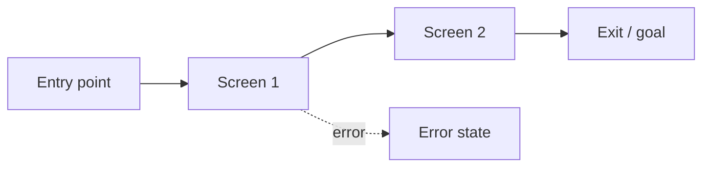

# Sketch — <Surface name>

> No visual treatment in this artifact. Colors, fonts, and components are Phase 3 (Mock).

## 1. Primary flow

<!-- Mermaid flowchart or numbered step list. Pick one form and be consistent. -->

## 2. Screen inventory

<!-- One row per distinct screen or state. Do not omit empty / loading / error states. -->

| # | Screen name | Purpose | Entry condition | Exit condition |
|---|---|---|---|---|
| 1 | | | | |
| 2 | | | | |

## 3. States per screen

<!-- For each screen in the inventory, specify its three required states. -->

### Screen 1 — <name>

**Empty state:**  
<!-- What the user sees before any content exists. Not a loading spinner — the zero-data condition. -->

**Loading state:**  
<!-- What the user sees while content is being fetched. -->

**Error state:**  
<!-- Exact copy for the error message. "Something went wrong" is not a spec. -->

---

<!-- Repeat for each screen. -->

## 4. Accessibility notes

<!-- For every interactive element: keyboard order, focus management, ARIA role/label, screen-reader copy for non-text elements. -->

| Element | Keyboard / focus | ARIA | Screen-reader copy |
|---|---|---|---|
| | | | |

## 5. Brief coverage

<!-- Map every brief goal and constraint to the screen or state that satisfies it. Missing coverage is a clarification, not an invention. -->

| Brief item | Covered by |
|---|---|
| Success condition | |
| Constraint 1 | |
| Constraint 2 | |

## 6. Open questions

<!-- New questions surfaced during sketching. Add to design-brief.md open questions if they need human resolution. -->

- …

## Gate checklist

- [ ] Every screen has an empty state.
- [ ] Every screen has a loading state.
- [ ] Every screen has an error state with final copy.
- [ ] Primary flow is a step list or Mermaid diagram (not prose).
- [ ] Accessibility notes exist for every interactive element.
- [ ] All brief goals are covered or flagged as clarifications.
- [ ] No visual treatment (colors, fonts, components) in this document.
