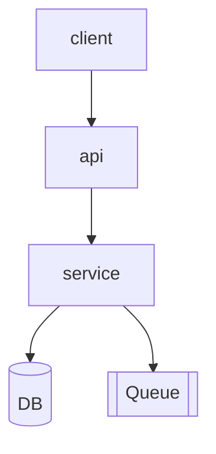

# Design — <Feature name>

## Context

Recap the problem and what the PRD asked for. One short paragraph.

## Goals (design-level)

- D1 …
- D2 …

## Non-goals

- ND1 …

---

## Part A — UX

### User flows

For each primary flow, a step-by-step or diagram (Mermaid is fine).

```mermaid
flowchart LR
  A[Entry] --> B[Step 1]
  B --> C{Decision}
  C -->|yes| D[Outcome 1]
  C -->|no|  E[Outcome 2]
```

### Information architecture

Where does this live in the product? Navigation, deep-link patterns, hierarchy.

### Empty / loading / error states

Prescribe each. Don't leave them to implementation.

### Accessibility considerations

Keyboard, focus order, ARIA, copy for screen readers, contrast.

---

## Part B — UI

### Key screens / states

List each screen or major state with a one-line purpose. Link to design files.

| Screen / state | Purpose | Reference |
|---|---|---|
| … | … | (Figma link / wireframe) |

### Components

Which design-system components are used? Any new components needed (and why)?

### Tokens

Any non-default tokens (spacing, colour, type) introduced for this feature.

### Content

Microcopy, headings, error messages. Tone-checked.

---

## Part C — Architecture

> If `specs/<feature>/arc42-questionnaire.md` exists, link it here and inherit its §4–§8 and §10–§11 answers. Capture only the **feature-specific deltas** below; do not duplicate the baseline.

### System overview



### Components and responsibilities

| Component | Responsibility | Owns | Dependencies |
|---|---|---|---|
| … | … | … | … |

### Data model

Entities, key fields, relationships. Migration impact.

### Data flow

How data moves end-to-end for the primary scenarios.

### Interaction / API contracts

Sketch — full contracts go in `spec.md`. Note any breaking changes.

### Key decisions

| Decision | Choice | Why | ADR |
|---|---|---|---|
| … | … | … | ADR-NNNN |

### Alternatives considered

Why we rejected each.

### Risks

| ID | Risk | Mitigation |
|---|---|---|
| RISK-… | … | … |

### Performance, security, observability

What changes? New SLIs? New attack surface?

---

## Cross-cutting

### Requirements coverage

Map every PRD requirement to where it's addressed in this design.

| REQ ID | Addressed in (UX / UI / Arch section) |
|---|---|
| REQ-<AREA>-001 | UX §… , Arch §… |

### Open questions

- …

---

## Quality gate

- [ ] UX: primary flows mapped; IA clear; empty/loading/error states prescribed.
- [ ] UI: key screens identified; design system referenced.
- [ ] Architecture: components, data flow, integration points named.
- [ ] Alternatives considered and rejected with rationale.
- [ ] Irreversible architectural decisions have ADRs.
- [ ] Risks have mitigations.
- [ ] Every PRD requirement is addressed.
