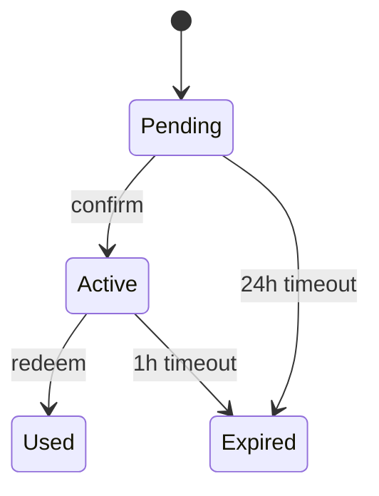

# Specification — <Feature name>

Implementation-ready contracts. The spec is precise enough that two independent teams could implement it and produce indistinguishable behaviour.

## Scope

What this spec covers and what it doesn't.

## Interfaces

For each public interface (API endpoint, function signature, message schema), specify:

### SPEC-<AREA>-001 — <Interface name>

- **Kind:** HTTP endpoint | function | event | CLI command | …
- **Signature:**
  ```
  POST /api/v1/auth/reset
  Request:  { email: string }
  Response: 202 { requestId: string }
            400 { error: "invalid_email" }
            429 { error: "rate_limited", retryAfter: number }
  ```
- **Behaviour:**
  - …
- **Pre-conditions:** …
- **Post-conditions:** …
- **Side effects:** …
- **Errors:** enumerated with codes.
- **Satisfies:** REQ-<AREA>-NNN, REQ-<AREA>-NNN

## Data structures

```
User {
  id: UUID
  email: string (RFC 5322)
  createdAt: ISO-8601 datetime
  ...
}
```

Validation rules per field.

## State transitions

Where applicable. Mermaid state diagrams or transition tables.



## Validation rules

What inputs are accepted; what is rejected and how.

## Edge cases

Enumerate. Include: empty inputs, max-length inputs, concurrent requests, network failures, partial successes, idempotency, ordering, time-zone boundaries, locale boundaries.

| ID | Case | Expected behaviour |
|---|---|---|
| EC-001 | … | … |

## Test scenarios

Derivable from the above. The QA agent will turn these into automated tests.

| Test ID | Scenario | Type |
|---|---|---|
| TEST-<AREA>-001 | Happy path: … | unit / integration / e2e |
| TEST-<AREA>-002 | Edge: empty email | unit |
| TEST-<AREA>-003 | Failure: rate limit hit | integration |

## Observability requirements

- Logs: which events are logged, at what level.
- Metrics: which counters / gauges / histograms are emitted.
- Traces: which spans are created.
- Alerts: which thresholds page.

## Performance budget

Per-interface latency / throughput budgets (inherit from PRD NFRs unless tighter).

## Compatibility

- Backward-compatible? If not, migration plan.
- Versioning strategy.

---

## Quality gate

- [ ] Behaviour unambiguous.
- [ ] Every interface specifies signature, behaviour, errors, side effects.
- [ ] Validation rules explicit.
- [ ] Edge cases enumerated.
- [ ] Test scenarios derivable.
- [ ] Each spec item traces to ≥ 1 requirement ID.
- [ ] Observability requirements specified.
