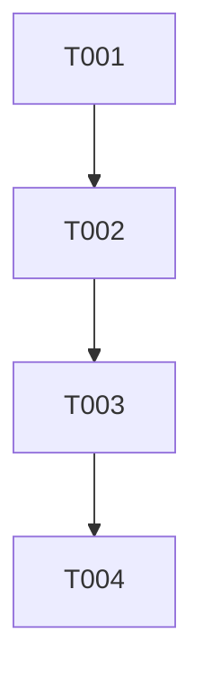

# Tasks — <Feature name>

Each task ≤ ~½ day, has a stable ID, references ≥ 1 requirement, and has a Definition of Done.

> **TDD ordering:** test tasks for a requirement come **before** the implementation task for that requirement.

> **"May slice" annotation:** A task that touches more than one independent code path or artifact may legitimately ship as several PRs rather than one. Mark such tasks with 🪓 in the heading (in addition to the task-type emoji), and add a `**Slice plan:**` line under the task sketching the expected slices. PR planners should expect the task to land in pieces; each slice PR must reference the parent task ID and name the slice it completes so traceability stays attached to the original task. (Convention filed by the v0.3 retrospective after multiple plan-level tasks shipped in slices that were not anticipated by the original `tasks.md`. See [`specs/version-0-3-plan/retrospective.md`](../specs/version-0-3-plan/retrospective.md) for the originating examples.)

## Legend

- 🧪 = test task
- 🔨 = implementation task
- 📐 = design / scaffolding task
- 📚 = documentation task
- 🚀 = release / ops task
- 🪓 = may slice (task touches multiple independent code paths; expect several PRs)

## Task list

### T-<AREA>-001 📐 — <short title>

- **Description:** …
- **Satisfies:** REQ-<AREA>-NNN, SPEC-<AREA>-NNN
- **Owner:** dev | qa | sre | human   *(`/spec:implement` only routes these four; `human` halts the command and hands back to the user)*
- **Depends on:** —
- **Estimate:** S | M (avoid L — split it)
- **Definition of done:**
  - [ ] …
  - [ ] …

### T-<AREA>-002 🧪 — <short title>

- **Description:** …
- **Satisfies:** REQ-<AREA>-NNN
- **Owner:** qa
- **Depends on:** T-<AREA>-001
- **Estimate:** S
- **Definition of done:**
  - [ ] Test exists and references requirement ID in name/metadata.
  - [ ] Test fails on the unimplemented branch.

### T-<AREA>-003 🔨 — <short title>

- **Description:** …
- **Satisfies:** REQ-<AREA>-NNN
- **Owner:** dev
- **Depends on:** T-<AREA>-002
- **Estimate:** M
- **Definition of done:**
  - [ ] T-<AREA>-002 now passes.
  - [ ] Lint + type checks green.
  - [ ] Implementation log entry added.

## Dependency graph

## Parallelisable batches

Batches whose tasks have no inter-dependencies and can run concurrently:

- **Batch 1:** T-<AREA>-001, T-<AREA>-005
- **Batch 2:** T-<AREA>-002, T-<AREA>-006
- …

---

## Quality gate

- [ ] Each task ≤ ~½ day (estimate S or M).
- [ ] Each task has a stable ID.
- [ ] Each task references ≥ 1 requirement / spec ID.
- [ ] Dependencies explicit.
- [ ] Each task has a Definition of Done.
- [ ] TDD ordering: test tasks precede implementation tasks for the same requirement.
- [ ] Owner assigned per task.
