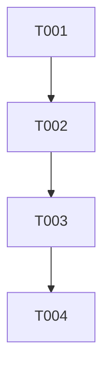

# Tasks — <Feature name>

Each task ≤ ~½ day, has a stable ID, references ≥ 1 requirement, and has a Definition of Done.

> **TDD ordering:** test tasks for a requirement come **before** the implementation task for that requirement.

## Legend

- 🧪 = test task
- 🔨 = implementation task
- 📐 = design / scaffolding task
- 📚 = documentation task
- 🚀 = release / ops task

## Task list

### T-<AREA>-001 📐 — <short title>

- **Description:** …
- **Satisfies:** REQ-<AREA>-NNN, SPEC-<AREA>-NNN
- **Owner:** dev | qa | architect | human
- **Depends on:** —
- **Estimate:** S | M (avoid L — split it)
- **Definition of done:**
  - [ ] …
  - [ ] …

### T-<AREA>-002 🧪 — <short title>

- **Description:** …
- **Satisfies:** REQ-<AREA>-NNN
- **Owner:** qa
- **Depends on:** T-<AREA>-001
- **Estimate:** S
- **Definition of done:**
  - [ ] Test exists and references requirement ID in name/metadata.
  - [ ] Test fails on the unimplemented branch.

### T-<AREA>-003 🔨 — <short title>

- **Description:** …
- **Satisfies:** REQ-<AREA>-NNN
- **Owner:** dev
- **Depends on:** T-<AREA>-002
- **Estimate:** M
- **Definition of done:**
  - [ ] T-<AREA>-002 now passes.
  - [ ] Lint + type checks green.
  - [ ] Implementation log entry added.

## Dependency graph

## Parallelisable batches

Batches whose tasks have no inter-dependencies and can run concurrently:

- **Batch 1:** T-<AREA>-001, T-<AREA>-005
- **Batch 2:** T-<AREA>-002, T-<AREA>-006
- …

---

## Quality gate

- [ ] Each task ≤ ~½ day (estimate S or M).
- [ ] Each task has a stable ID.
- [ ] Each task references ≥ 1 requirement / spec ID.
- [ ] Dependencies explicit.
- [ ] Each task has a Definition of Done.
- [ ] TDD ordering: test tasks precede implementation tasks for the same requirement.
- [ ] Owner assigned per task.
